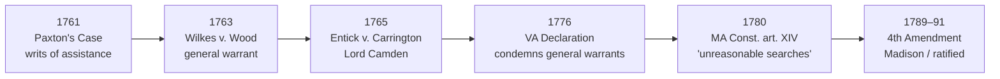

## Rule
This page is **legal history**, not binding precedent. The Fourth Amendment did not appear from nowhere — it was the founding generation's deliberate answer to a specific set of abuses they had lived through: the **general warrant** and the **writ of assistance**, instruments that let officers search where they pleased, for what they pleased, on their own discretion. The story runs from **Paxton's Case** (Massachusetts, 1761) through **[[Wilkes v. Wood]]** (England, 1763) and **[[Entick v. Carrington]]** (England, 1765), into the **state declarations of rights** (Virginia 1776; Massachusetts 1780), and finally into the Bill of Rights that **James Madison** introduced in the First Congress in 1789. The U.S. Supreme Court has recounted this history repeatedly and treats it as the meaning of the Amendment's text. *[[Boyd v. United States]]*, 116 U.S. 616, 624–30 (1886); *[[Riley v. California]]*, 573 U.S. 373, 403 (2014). **The English and colonial cases below are historical sources — they are not U.S. precedent and are not in the U.S. case-law databases.** Only the SCOTUS cases that recount this history (*Boyd*, *Riley*) are binding U.S. authority.

## Key cases
| Case (Bluebook) | Holding / significance in one line | Weight | CourtListener |
|---|---|---|---|
| *Boyd v. United States*, 116 U.S. 616 (1886) | Recounts the founding history at length and adopts *Entick v. Carrington* as "the true and ultimate expression of constitutional law" embodied in the Fourth Amendment. | SCOTUS — binding | [link](https://www.courtlistener.com/opinion/91573/boyd-v-united-states/) |
| *Riley v. California*, 573 U.S. 373 (2014) | Modern Court reaffirms that the Fourth Amendment was the founding generation's response to general warrants and writs of assistance — "one of the driving forces behind the Revolution itself." | SCOTUS — binding | [link](https://www.courtlistener.com/opinion/2680439/riley-v-california/) |

> Historical antecedents — Paxton's Case, Wilkes v. Wood, Entick v. Carrington, the state declarations, and Madison's drafting of the Bill of Rights — are **English/colonial legal history: non-binding, and not found in U.S. case-law databases.** Their substance is grounded here through *Boyd* and *Riley*, which quote and recount them. The English/colonial reporters appear under Sources for reference only.

## Nuances & limits
- **The two reviled instruments — define them precisely.**
  - A **general warrant** named no particular person, place, or thing; it let an officer search broadly and seize at discretion. The Wilkes affair turned on one.
  - A **writ of assistance** was a general *customs* search warrant: it authorized revenue officers to search any suspected place for smuggled goods, it was **transferable** to any officer, and it had **no fixed term** — it ran for the entire reign of the issuing sovereign and lapsed only six months after that sovereign's death. *Boyd* describes the practice as "issuing writs of assistance to the revenue officers, empowering them, in their discretion, to search suspected places for smuggled goods." 116 U.S. at 625.
- **Paxton's Case (Massachusetts, 1761) — the colonial spark.** Boston merchants challenged the writs of assistance; **James Otis** resigned his crown office to argue against them, calling the writ (as *Boyd* quotes) "the worst instrument of arbitrary power, the most destructive of English liberty, and the fundamental principles of law, that ever was found in an English law book," because it placed "the liberty of every man in the hands of every petty officer." 116 U.S. at 625. The argument famously **invoked** the maxim that **a man's house is his castle** (a principle older than the case). A young **John Adams** was in the courtroom taking notes and later wrote that "[t]hen and there the child Independence was born." *Id.* (*Riley* repeats the Otis–Adams account, 573 U.S. at 403.)
- **Wilkes v. Wood (England, 1763) — general warrants meet a jury.** After *The North Briton* No. 45 attacked the Crown, a Secretary of State's **general warrant** was used to ransack John Wilkes's house and seize his papers indiscriminately. Wilkes and the printers sued in trespass; Chief Justice **Pratt** (soon **Lord Camden**) let the cases go to juries, which returned heavy damages — a **£1000** verdict against the messenger Wood in *Wilkes v. Wood* itself, and, in the broader Wilkes litigation, **£4000** against Lord Halifax, the Secretary of State who issued the warrant. *Boyd*, 116 U.S. at 626. The principle: there is no roving executive power to search; general warrants are unlawful.
- **Entick v. Carrington (England, 1765) — the foundational antecedent.** King's messengers, acting under a general warrant, broke into Entick's home and seized his papers. Lord **Camden** held the warrant **illegal and void**, on the ground that the government may not invade person, house, or papers without specific legal authority:
  > "If it is law, it will be found in our books; if it is not to be found there, it is not law. … By the laws of England, every invasion of private property, be it ever so minute, is a trespass. … the warrant to seize and carry away the party's papers in the case of a seditious libel, is illegal and void." — Lord Camden, quoted in *Boyd*, 116 U.S. at 627–29.

  *Boyd* calls Camden's judgment "one of the landmarks of English liberty," "one of the permanent monuments of the British Constitution," and — for American purposes — "the true and ultimate expression of constitutional law," whose "propositions were in the minds of those who framed the Fourth Amendment." 116 U.S. at 626–27. *Entick* is the single most influential antecedent of the Fourth Amendment.
- **State declarations of rights (1776–1780) — text begins to form.** The **Virginia Declaration of Rights (1776)** condemned **general warrants** by name. The **Massachusetts Constitution of 1780, art. XIV**, drafted by **John Adams**, is the source of the actual operative phrase — it guarantees a "right to be secure from all **unreasonable searches, and seizures**," the formulation the Fourth Amendment would adopt.
- **The Fourth Amendment (1789–1791) — Madison.** **James Madison** introduced the proposed amendments in the First Congress in June 1789; he is the principal drafter of the Bill of Rights. The Fourth Amendment was ratified with the rest of the Bill of Rights in **1791**. It carries the *Entick* / Camden principle (no search or seizure without specific authority) and the Massachusetts "unreasonable searches and seizures" language into the federal Constitution.

## Common pitfalls
- **Citing the English/colonial cases as if they were binding U.S. authority.** They are not. They are persuasive *history* — their force in a U.S. courtroom comes from SCOTUS adopting them (*Boyd*, *Riley*), not from the English reports themselves. Cite the SCOTUS case that relies on them.
- **Inventing a "U.S. citation" for Paxton, Wilkes, or Entick.** There is no U.S. Reports cite and no CourtListener entry for these. *Entick* lives in 19 Howell's State Trials 1029; Paxton's Case in Quincy's (Mass.) Reports. Do not dress them up as U.S. case law.
- **Conflating the general warrant with the writ of assistance.** Related but distinct: the writ of assistance was the *customs/colonial* version — transferable and non-expiring (Paxton's Case); the general warrant was the *English* libel-investigation instrument (Wilkes, Entick). The Fourth Amendment's particularity and probable-cause requirements were aimed at **both**.
- **Treating "a man's house is his castle" as the rule.** It is the rhetorical root (Otis, Camden), not the operative test. The operative law is the Fourth Amendment and the SCOTUS doctrine built on it — see [[Fourth Amendment Framework]] and [[Two Definitions of Search]].

## Visual

## Sources
- *Boyd v. United States*, 116 U.S. 616, 624–30 (1886) — https://www.courtlistener.com/opinion/91573/boyd-v-united-states/ *(founding history; quotes Otis, Adams, Wilkes verdicts, and Lord Camden's Entick judgment)*
- *Riley v. California*, 573 U.S. 373, 403 (2014) — https://www.courtlistener.com/opinion/2680439/riley-v-california/ *(modern reaffirmation of the writs-of-assistance / general-warrant history)*
- *Entick v. Carrington*, 19 Howell's State Trials 1029 (C.P. 1765) — *historical; English report, not in CourtListener (grounded above via Boyd).*
- *Wilkes v. Wood*, 19 Howell's State Trials 1153, 98 Eng. Rep. 489 (C.P. 1763) — *historical; English report, not in CourtListener.*
- Paxton's Case, Quincy's Mass. Reports 51–57 (Mass. Super. Ct. 1761) — *historical; colonial report, not in CourtListener.*
- Virginia Declaration of Rights (1776), § 10; Massachusetts Constitution (1780), pt. I, art. XIV; U.S. Const. amend. IV (proposed 1789, ratified 1791) — *primary historical/constitutional sources.*
