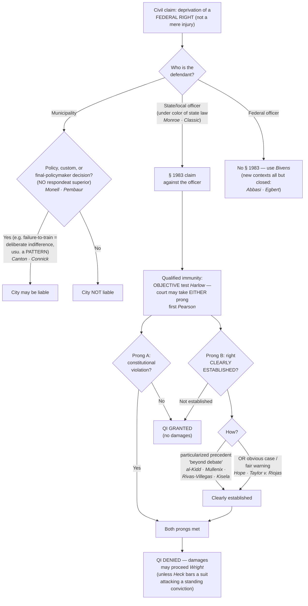

# § 1983 Liability & Qualified Immunity

## The Brief

**Field-decisive question:** *Can this officer — or the municipality that employs him — be sued for what happened, and does qualified immunity bar the claim?* This page is about **civil accountability** and the immunity defense to it — not about whether evidence is suppressed (that is [[The Exclusionary Rule]]). Both tracks reward the same habit: objectively reasonable, well-articulated conduct.

**Black-letter rule — § 1983 is the engine of civil accountability.** **42 U.S.C. § 1983** creates a civil action against any person who, **under color of** state law, deprives someone of a **right** secured by the Constitution or federal law. A claim has **two elements**: (1) a **person acting under color of state law** who (2) **deprives the plaintiff of a federal right** — § 1983 protects *rights*, not mere injuries. *[[Monroe v. Pape#^pin-184|Monroe v. Pape]]*, 365 U.S. 167 (1961), made it operative and held that **"under color of" reaches an officer's *misuse* of state-conferred authority**, even conduct state law forbids, with no exhaustion of state remedies required. The color-of-law definition is drawn from *[[United States v. Classic#^pin-326|United States v. Classic]]*: "**Misuse of power, possessed by virtue of state law and made possible only because the wrongdoer is clothed with the authority of state law, is action taken 'under color of' state law.**" 313 U.S. 299, 326 (1941). An officer who acts *illegally* can still act under color of law — the badge is what makes the deprivation actionable. Prevailing plaintiffs may recover **reasonable attorney's fees** in the court's discretion (**42 U.S.C. § 1988(b)**) — paid from the public fisc. The **criminal** analog is **18 U.S.C. § 242** (a *willful*, specific-intent deprivation of rights under color of law), reserved in practice for the most egregious violations because the willfulness burden is steep. *[[Screws v. United States|Screws v. United States]]*, 325 U.S. 91 (1945) (construing "willfully").

**Not every constitutional-adjacent wrong is a § 1983 claim.** A violation of the *Miranda* prophylactic rules is **not itself** a constitutional violation and **"does not provide a basis for a § 1983 claim."** *[[Vega v. Tekoh#^pin-134|Vega v. Tekoh]]*, 597 U.S. 134 (2022). And the Self-Incrimination Clause is a **trial right** — coercive questioning that yields no statement used against the suspect in a criminal case is not, by itself, a completed Fifth Amendment violation, so it cannot ground a § 1983 self-incrimination claim: "**it is not until their use in a criminal case that a violation of the Self-Incrimination Clause occurs.**" *[[Chavez v. Martinez#^pin-767|Chavez v. Martinez]]*, 538 U.S. 760, 767 (2003) (plurality) (leaving open a separate substantive-due-process "shocks the conscience" theory).

**Reaching the agency — *Monell*: policy or custom, never [[Common Legal Terms#respondeat-superior|respondeat superior]].** Municipalities are "persons" under § 1983 but are liable **only** for injuries inflicted by their own official **policy or custom** — "**a municipality cannot be held liable … under § 1983 on a *respondeat superior* theory.**" *[[Monell v. Department of Social Services#^pin-691|Monell v. Dep't of Soc. Servs.]]*, 436 U.S. 658, 691 (1978); liability attaches only when "execution of a government's policy or custom … inflicts the injury," *[[Monell v. Department of Social Services#^pin-690|id.]]* at 690–691. Three routes reach the city: (a) an official **policy**; (b) a widespread **custom**; or (c) a **single decision by an official with final policymaking authority** — "**municipal liability … attaches where — and only where — a deliberate choice to follow a course of action is made … by the official or officials responsible for establishing final policy** with respect to the subject matter in question." *[[Pembaur v. City of Cincinnati#^pin-483|Pembaur v. City of Cincinnati]]*, 475 U.S. 469, 483–484 (1986). **Failure-to-train** is the hardest route: it is a "policy" only where the failure amounts to **deliberate indifference** — "**the inadequacy of police training may serve as the basis for § 1983 liability only where the failure to train amounts to deliberate indifference to the rights of persons with whom the police come into contact.**" *[[City of Canton v. Harris#^pin-388|City of Canton v. Harris]]*, 489 U.S. 378, 388 (1989). And **a single incident almost never suffices**: "**A pattern of similar constitutional violations by untrained employees is 'ordinarily necessary' to demonstrate deliberate indifference for purposes of failure to train.**" *[[Connick v. Thompson#^pin-62|Connick v. Thompson]]*, 563 U.S. 51, 62 (2011) (a single *Brady* nondisclosure did not support municipal liability — cross-reference [[Brady and Giglio]]).

**Suing a *federal* officer — *Bivens*, now all but closed.** § 1983 reaches only action under color of **state** law; the analog for a **federal** agent (FBI, DEA, CBP) is *[[Bivens v. Six Unknown Named Agents#^pin-397|Bivens v. Six Unknown Named Agents]]*, 403 U.S. 388, 397 (1971), which recognized an implied damages remedy for a Fourth Amendment violation. But the Court has **all but foreclosed new *Bivens* contexts**: extending the remedy is now a **"disfavored judicial activity"** (*Ziglar v. Abbasi*, 582 U.S. 120 (2017)), and "**if there is even a single 'reason to pause before applying *Bivens* in a new context,' a court may not recognize a *Bivens* remedy.**" *Egbert v. Boule*, 596 U.S. 482, 491–492 (2022). Outside its original search-and-seizure setting *Bivens* is nearly a dead letter.

**The individual officer's shield — qualified immunity, an *objective* test.** Officials sued for damages "**are shielded from liability … insofar as their conduct does not violate clearly established statutory or constitutional rights of which a reasonable person would have known.**" *[[Harlow v. Fitzgerald#^pin-818|Harlow v. Fitzgerald]]*, 457 U.S. 800, 818 (1982). *Harlow* **abandoned the subjective good-faith/malice prong**: the question is **not** whether the officer meant well, but whether the **law was clearly established at the time**. QI is analyzed in **two prongs** — (a) did the conduct **violate a constitutional right**, and (b) was that right **clearly established**? *[[Saucier v. Katz#^pin-201|Saucier v. Katz]]*, 533 U.S. 194, 201 (2001) (originally mandatory sequence). *[[Pearson v. Callahan#^pin-236|Pearson v. Callahan]]* made the order **discretionary**: "**while the sequence set forth there is often appropriate, it should no longer be regarded as mandatory.**" 555 U.S. 223, 236 (2009). A court may now grant QI on "not clearly established" **without ever deciding** whether a right was violated — which can leave the underlying constitutional question unresolved.

**"Clearly established" — the heart of modern QI — demands a high degree of specificity.** A right is clearly established only where "**existing precedent … [has] placed the … question beyond debate.**" *[[Ashcroft v. al-Kidd|al-Kidd]]*, 563 U.S. 731, 741 (2011). The inquiry is **particularized**: the dispositive question is "**whether the violative nature of particular conduct is clearly established,**" *[[Mullenix v. Luna#^pin-12|Mullenix v. Luna]]*, 577 U.S. 7, 12 (2015) ([[Common Legal Terms#per-curiam|per curiam]]), "**in light of the specific context of the case, not as a broad general proposition**"; the plaintiff must "**identify a case that put [the officer] on notice that his specific conduct was unlawful,**" *[[Rivas-Villegas v. Cortesluna#^pin-op5|Rivas-Villegas v. Cortesluna]]*, 595 U.S. 1 (2021) (per curiam) (slip op., at 4–5). The Court has "**repeatedly told courts not to define clearly established law at too high a level of generality,**" and QI protects "**all but the plainly incompetent or those who knowingly violate the law.**" *[[City of Tahlequah v. Bond#^pin-op3|City of Tahlequah v. Bond]]*, 595 U.S. 9 (2021) (per curiam) (slip op., at 3) (quoting *[[District of Columbia v. Wesby|Wesby]]*, 583 U.S. 48, 63 (2018), quoting *[[Malley v. Briggs#^pin-341|Malley v. Briggs]]*, 475 U.S. 335, 341 (1986)). In the **force** setting the specificity demand is at its strictest: the general standards of *[[Graham v. Connor|Graham]]* and *[[Tennessee v. Garner|Garner]]* "**do not by themselves create clearly established law outside an 'obvious case,'**" *[[White v. Pauly#^pin-73|White v. Pauly]]*, 580 U.S. 73 (2017) (slip op., at 7), so officers keep QI "**unless existing precedent 'squarely governs' the specific facts at issue,**" *[[Kisela v. Hughes#^pin-1153|Kisela v. Hughes]]*, 584 U.S. 100 (2018) (per curiam) (fact-specific cases put conduct in the "hazy border between excessive and acceptable force," *[[Brosseau v. Haugen|Brosseau v. Haugen]]*, 543 U.S. 194 (2004) (per curiam)). The Court continues to police circuits that frame the right too generally (most recently in *Zorn v. Linton* (2026), summarily reversing a QI denial where circuit precedent did not clearly establish the specific conduct's unlawfulness).

**The counterweight — the "obvious case" needs no precedent on point.** A right can be clearly established **without a case on all fours**: "**officials can still be on notice that their conduct violates established law even in novel factual circumstances.**" *[[Hope v. Pelzer#^pin-741|Hope v. Pelzer]]*, 536 U.S. 730, 741 (2002). The Court revived that route in *[[Taylor v. Riojas#^pin-7|Taylor v. Riojas]]*, 592 U.S. 7 (2020) (per curiam) — denying QI without a case on point because "**any reasonable officer should have realized that Taylor's conditions of confinement** [six days in shockingly unsanitary cells] **offended the Constitution.**" *Id.* (slip op., at 3). Read the two lines together: **particularized precedent *or* an obvious case defeats QI.**

**QI in the warrant setting.** Applying for a warrant earns **qualified, not absolute, immunity**: an officer loses it only where "**no reasonably competent officer would have concluded that a warrant should issue.**" *[[Malley v. Briggs#^pin-341|Malley]]*, 475 U.S. at 341. The magistrate's approval is strong but not conclusive — "**the fact that a neutral magistrate has issued a warrant … does not end the inquiry into objective reasonableness,**" yet "**the threshold for establishing this exception is a high one, and it should be.**" *[[Messerschmidt v. Millender#^pin-547|Messerschmidt v. Millender]]*, 565 U.S. 535, 547 (2012). Bringing the **media into a home** during a warrant's execution (not in aid of the warrant) **violates the Fourth Amendment** — "**it is a violation of the Fourth Amendment for police to bring members of the media or other third parties into a home during the execution of a warrant when the presence of the third parties … was not in aid of the execution of the warrant**" — **but the officers had QI** because in 1992 the right "**was not clearly established.**" *[[Wilson v. Layne#^pin-614|Wilson v. Layne]]*, 526 U.S. 603, 614–615 (1999); *[[Hanlon v. Berger#^pin-810|Hanlon v. Berger]]*, 526 U.S. 808 (1999) (same-day companion, ride-along during a *search* warrant). Related warrant-execution and split-second-entry situations recur on the QI-granted side: officers may briefly detain occupants (even unclothed) while securing a room, *[[Los Angeles County v. Rettele|Los Angeles County v. Rettele]]*, 550 U.S. 609 (2007); may enter a home on an **objectively reasonable fear of imminent violence**, *[[Ryburn v. Huff|Ryburn v. Huff]]*, 565 U.S. 469 (2012) (per curiam); and even where a search was unreasonable (a school strip search), QI attached because the right was not clearly established, *[[Safford Unified School District v. Redding|Safford Unified Sch. Dist. v. Redding]]*, 557 U.S. 364 (2009).

**The merits mirror — objective reasonableness governs both sides.** Force/seizure § 1983 claims are judged by the Fourth Amendment's **objective reasonableness** standard; "**subjective concepts like 'malice' and 'sadism' have no proper place in that inquiry.**" *[[Graham v. Connor#^pin-396|Graham v. Connor]]*, 490 U.S. 386, 396–397 (1989) (see [[Use of Force]]). Deadly force is reasonable only on probable cause the suspect poses a significant threat of death or serious injury, *[[Tennessee v. Garner|Tennessee v. Garner]]*, 471 U.S. 1 (1985); reasonableness is judged on the **[[Common Legal Terms#totality-of-the-circumstances|totality of the circumstances]]**, an inquiry that "has no time limit," rejecting the "moment of threat" rule, *[[Barnes v. Felix|Barnes v. Felix]]*, 605 U.S. 73 (2025); a **pretrial detainee's** excessive-force claim is likewise **objective**, *[[Kingsley v. Hendrickson|Kingsley v. Hendrickson]]*, 576 U.S. 389 (2015); and a death caused by a high-speed **pursuit** with no Fourth Amendment seizure runs on **Fourteenth Amendment substantive due process** ("shocks the conscience" — a *purpose to cause harm*), *[[County of Sacramento v. Lewis|County of Sacramento v. Lewis]]*, 523 U.S. 833 (1998); deadly force to end a dangerous chase is reasonable, with QI as the fallback, *[[Plumhoff v. Rickard|Plumhoff v. Rickard]]*, 572 U.S. 765 (2014); *[[City and County of San Francisco v. Sheehan|City & County of San Francisco v. Sheehan]]*, 575 U.S. 600 (2015). The QI side (*Harlow*) and the merits side (*Graham*) march in **lockstep**: **objective reasonableness governs both** — and the officer's subjective motive is irrelevant to the reasonableness of an otherwise-valid action, *[[Ashcroft v. al-Kidd#^pin-736|al-Kidd]]*, 563 U.S. at 736.

**The *Heck* bar — a § 1983 suit cannot collaterally attack a standing conviction.** A § 1983 damages action that "**would necessarily imply the invalidity of [an outstanding] conviction or sentence**" is **not cognizable** unless the conviction has already been invalidated — "**the plaintiff must prove that the conviction or sentence has been reversed on direct appeal, expunged by executive order, declared invalid by a state tribunal … or called into question by a federal court's issuance of a writ of [[Common Legal Terms#habeas-corpus|habeas corpus]].**" *[[Heck v. Humphrey#^pin-486|Heck v. Humphrey]]*, 512 U.S. 477, 486–487 (1994). A defendant convicted on challenged evidence generally cannot pursue a parallel § 1983 suit attacking the same search/seizure **while the conviction stands**.

**Burden, standard of review, and remedy.** The **plaintiff** bears the burden on the § 1983 elements and, once QI is raised (an affirmative defense the officer pleads), on showing the right was **clearly established**. Whether QI applies is a **question of law**: it is reviewed **[[Common Legal Terms#de-novo|de novo]]** and, because it is an *immunity from suit*, a denial turning on a legal question is **immediately appealable** by interlocutory appeal. **Remedy:** compensatory (and, for individuals, punitive) **damages**, **injunctive/declaratory** relief, and **§ 1988(b) attorney's fees** to a prevailing plaintiff. **Accountability is layered:** the § 1983 civil track sits alongside the § 242 criminal track, the **FTCA** track for federal-officer torts (*Martin v. United States*, 605 U.S. 371 (2025), holding the § 2680(h) law-enforcement proviso overrides the intentional-tort exception and the Supremacy Clause is no FTCA defense — a wrong-house-raid remedy running parallel to *Bivens*), and the officer-credibility/disclosure track that can independently sink a case and follow an officer for a career (see [[Brady and Giglio]]).

**Pitfalls.**

- **Conflating QI with the *Leon* good-faith exception.** QI is a **civil** defense to § 1983 **damages**; *[[United States v. Leon|Leon]]* good faith is a separate **criminal-side** exclusionary-rule doctrine about **suppression**. The maxim "no good-faith exception to a warrantless search — it's objective reasonableness" refers to *Harlow*'s objective QI standard; do not merge it with *Leon*.
- **Thinking QI affects suppression.** It does not — QI never decides whether evidence comes in or out of a criminal trial; it only limits **civil damages**.
- **Treating § 1983 and § 242 as interchangeable.** Civil (damages, preponderance, no willfulness element) vs. criminal (prosecution, beyond a reasonable doubt, a **willful** deprivation — *[[Screws v. United States|Screws]]*). Willfulness is why § 242 charges are rare.
- **Confusing § 1983 with *Bivens*.** § 1983 reaches **state/local** actors only; to sue a **federal** officer you need *Bivens* — now nearly foreclosed outside its original Fourth Amendment context (*Egbert*/*Abbasi*).
- **Suing the city as if respondeat superior applies.** *[[Monell v. Department of Social Services|Monell]]* forecloses that — identify a **policy, custom, or final-policymaker decision** (*[[Pembaur v. City of Cincinnati|Pembaur]]*), not merely a bad employee.
- **Treating one bad incident as *Monell* failure-to-train.** *[[Connick v. Thompson|Connick]]* requires a **pattern** to show deliberate indifference; one incident almost never suffices.
- **Relying on subjective good (or bad) intentions.** Post-*Harlow*/*Graham*, a good motive does not save objectively unreasonable conduct, and a bad motive does not defeat objectively reasonable conduct.
- **Defining the right too generally.** Vague rights ("freedom from excessive force") rarely overcome QI; precedent must be **particularized** and "beyond debate" (*[[Ashcroft v. al-Kidd|al-Kidd]]*; *[[Mullenix v. Luna|Mullenix]]*; *[[Rivas-Villegas v. Cortesluna|Rivas-Villegas]]*; *[[City of Tahlequah v. Bond|Tahlequah]]*).
- **Assuming *any* precedent suffices — or that *only* an identical case does.** Both extremes are wrong: precedent must be particularized "beyond debate," **but** an "obvious case" needs no case on point (*[[Hope v. Pelzer|Hope]]*; *[[Taylor v. Riojas|Taylor v. Riojas]]*).
- **Filing a Miranda-only § 1983 claim.** A *Miranda* violation is not itself actionable under § 1983 (*[[Vega v. Tekoh|Vega]]*).
- **Filing a § 1983 Fourth-Amendment-damages suit while the conviction stands.** *[[Heck v. Humphrey|Heck]]* bars it if success would necessarily imply the conviction's invalidity.

**Field framing (the "apply it" angle).** Ask, in order: *Who is the defendant?* A **state/local officer** → § 1983; a **municipality** → only via a **policy, custom, or final-policymaker decision** (failure-to-train needs a **pattern**, not one incident); a **federal officer** → *Bivens*, and expect the door to be shut in any new context. *Was a federal right actually deprived* (not just an injury, and not a bare *Miranda* lapse)? Then the immunity question: *did the conduct violate a **clearly established** right — one a prior case had placed "beyond debate" at a **high degree of specificity**, or one so obviously unlawful that no reasonable officer could doubt it?* If yes on either, QI does not shield the officer. Throughout, the safest posture is the same as on the merits: **objectively reasonable, well-articulated conduct**, documented — because the QI test and the Fourth Amendment merits test both turn on it.

## Key cases

| Case (Bluebook) | Holding in one line | Weight | Treatment | CourtListener |
|---|---|---|---|---|
| *[[Monroe v. Pape]]*, 365 U.S. 167 (1961) | "Under color of" law reaches an officer's **misuse** of state-conferred authority, even when it violates state law; no exhaustion of state remedies required. **Limited by** *[[Monell v. Department of Social Services\|Monell]]* (municipal-immunity holding overruled). | Binding — SCOTUS | limited *(2026-06-30)* | [opinion](https://www.courtlistener.com/opinion/106170/monroe-v-pape/) |
| *[[United States v. Classic]]*, 313 U.S. 299 (1941) | The anchor color-of-law definition: misuse of power possessed by virtue of state law, made possible only because the actor is clothed with state authority, is action "under color of" state law. | Binding — SCOTUS | good *(2026-06-30)* | [opinion](https://www.courtlistener.com/opinion/103531/united-states-v-classic/) |
| *[[Monell v. Department of Social Services]]*, 436 U.S. 658 (1978) | Municipalities are § 1983 "persons," but liable **only** for injuries caused by an official **policy or custom** — **no respondeat superior**. | Binding — SCOTUS | good *(2026-06-30)* | [opinion](https://www.courtlistener.com/opinion/109881/monell-v-new-york-city-dept-of-social-servs/) |
| *[[Pembaur v. City of Cincinnati]]*, 475 U.S. 469 (1986) | A **single decision by an official with final policymaking authority** for the subject matter is an "official policy" that triggers *Monell* liability. | Binding — SCOTUS | good *(2026-06-30)* | [opinion](https://www.courtlistener.com/opinion/111615/pembaur-v-city-of-cincinnati/) |
| *[[City of Canton v. Harris]]*, 489 U.S. 378 (1989) | **Failure-to-train** grounds municipal liability **only** where the inadequacy amounts to **deliberate indifference** to the rights of those the police encounter. | Binding — SCOTUS | good *(2026-06-30)* | [opinion](https://www.courtlistener.com/opinion/112209/city-of-canton-v-harris/) |
| *[[Connick v. Thompson]]*, 563 U.S. 51 (2011) | A **pattern** of similar violations is "ordinarily necessary" to show deliberate indifference; a **single** *Brady* nondisclosure does not support *Monell* liability. | Binding — SCOTUS | good *(2026-06-30)* | [opinion](https://www.courtlistener.com/opinion/213505/connick-v-thompson/) |
| *[[Harlow v. Fitzgerald]]*, 457 U.S. 800 (1982) | Reformulated QI as a purely **objective** test — shielded unless conduct violated **clearly established** law a reasonable person would have known; abandoned the subjective good-faith prong. | Binding — SCOTUS | good *(2026-06-30)* | [opinion](https://www.courtlistener.com/opinion/110763/harlow-v-fitzgerald/) |
| *[[Saucier v. Katz]]*, 533 U.S. 194 (2001) | Set the QI **two-step**: (1) constitutional violation on the alleged facts? (2) was the right clearly established, judged at a **specific** level? **Limited by** *[[Pearson v. Callahan\|Pearson]]* (sequence now discretionary). | Binding — SCOTUS | limited *(2026-06-30)* | [opinion](https://www.courtlistener.com/opinion/118449/saucier-v-katz/) |
| *[[Pearson v. Callahan]]*, 555 U.S. 223 (2009) | The *Saucier* sequence "should no longer be regarded as mandatory" — courts may decide either prong first. | Binding — SCOTUS | good *(2026-06-30)* | [opinion](https://www.courtlistener.com/opinion/145918/pearson-v-callahan/) |
| *[[Ashcroft v. al-Kidd]]*, 563 U.S. 731 (2011) | "Clearly established" requires existing precedent placing the question **"beyond debate"**; subjective intent is irrelevant to Fourth Amendment reasonableness. | Binding — SCOTUS | good *(2026-06-30)* | [opinion](https://www.courtlistener.com/opinion/217703/ashcroft-v-al-kidd/) |
| *[[Mullenix v. Luna]]*, 577 U.S. 7 (2015) | QI turns on "whether the **violative nature of particular conduct** is clearly established" — particularized to the specific context, not a broad proposition. | Binding — SCOTUS | good *(2026-06-30)* | [opinion](https://www.courtlistener.com/opinion/3153112/mullenix-v-luna/) |
| *[[Rivas-Villegas v. Cortesluna]]*, 595 U.S. 1 (2021) | The plaintiff must **identify a case that put the officer on notice** that his specific conduct was unlawful; the inquiry is the specific context, not a broad general proposition. | Binding — SCOTUS | good *(2026-06-30)* | [opinion](https://www.courtlistener.com/opinion/5290447/rivas-villegas-v-cortesluna/) |
| *[[City of Tahlequah v. Bond]]*, 595 U.S. 9 (2021) | "Do not define clearly established law at too high a level of generality"; QI protects "all but the plainly incompetent or those who knowingly violate the law." | Binding — SCOTUS | good *(2026-06-30)* | [opinion](https://www.courtlistener.com/opinion/5290448/city-of-tahlequah-v-bond/) |
| *[[White v. Pauly]]*, 580 U.S. 73 (2017) | *Garner* and *Graham* "do not by themselves create clearly established law outside an 'obvious case'"; clearly established law must be particularized to the facts. | Binding — SCOTUS | good *(2026-06-30)* | [opinion](https://www.courtlistener.com/opinion/4374579/white-v-pauly/) |
| *[[Malley v. Briggs]]*, 475 U.S. 335 (1986) | A **warrant-applying** officer gets **qualified**, not absolute, immunity, lost only where no reasonably competent officer would have sought the warrant; source of the "plainly incompetent" formula. | Binding — SCOTUS | good *(2026-06-30)* | [opinion](https://www.courtlistener.com/opinion/111611/malley-v-briggs/) |
| *[[Messerschmidt v. Millender]]*, 565 U.S. 535 (2012) | Officers retain QI for a **facially overbroad warrant** where reliance on the magistrate's approval was objectively reasonable; the *Malley* exception is a **high** threshold. | Binding — SCOTUS | good *(2026-06-30)* | [opinion](https://www.courtlistener.com/opinion/623242/messerschmidt-v-millender/) |
| *[[Wilson v. Layne]]*, 526 U.S. 603 (1999) | Bringing **media/third parties into a home** during a warrant's execution (not in aid of it) violates the Fourth Amendment — but the officers had **QI** (right not clearly established in 1992). | Binding — SCOTUS | good *(2026-06-30)* | [opinion](https://www.courtlistener.com/opinion/118289/wilson-v-layne/) |
| *[[Hanlon v. Berger]]*, 526 U.S. 808 (1999) | Same-day companion to *Wilson*: a media ride-along during a **search** warrant violated the Fourth Amendment, but the officers were entitled to **QI**. | Binding — SCOTUS | good *(2026-06-30)* | [opinion](https://www.courtlistener.com/opinion/1087699/hanlon-v-berger/) |
| *[[Hope v. Pelzer]]*, 536 U.S. 730 (2002) | A right can be clearly established **without a factually identical case** — in an "obvious case," officials have **fair warning** even in novel circumstances. | Binding — SCOTUS | good *(2026-06-30)* | [opinion](https://www.courtlistener.com/opinion/121169/hope-v-pelzer/) |
| *[[Taylor v. Riojas]]*, 592 U.S. 7 (2020) | Revived the *Hope* route: QI **denied without a case on point** where confining an inmate six days in shockingly unsanitary cells was **obviously** unconstitutional. | Binding — SCOTUS | good *(2026-06-30)* | [opinion](https://www.courtlistener.com/opinion/4802501/taylor-v-riojas/) |
| *[[Bivens v. Six Unknown Named Agents]]*, 403 U.S. 388 (1971) | Recognized an **implied damages remedy** against **federal** officers for a Fourth Amendment violation — the § 1983 analog (now sharply cabined for new contexts). | Binding — SCOTUS | good *(2026-06-30)* | [opinion](https://www.courtlistener.com/opinion/108375/bivens-v-six-unknown-named-agents-of-federal-bureau-of-narcotics/) |
| *[[Vega v. Tekoh]]*, 597 U.S. 134 (2022) | A **Miranda** violation is not itself a Fifth Amendment violation and **does not** provide a basis for a § 1983 damages claim against the officer. | Binding — SCOTUS | good *(2026-06-30)* | [opinion](https://www.courtlistener.com/opinion/6480695/vega-v-tekoh/) |
| *[[Chavez v. Martinez]]*, 538 U.S. 760 (2003) | The Self-Incrimination Clause is a **trial right**: coercive questioning not used against the suspect in a criminal case is not, by itself, a completed violation grounding § 1983. | Binding — SCOTUS | good *(2026-06-30)* | [opinion](https://www.courtlistener.com/opinion/127927/chavez-v-martinez/) |
| *[[Graham v. Connor]]*, 490 U.S. 386 (1989) | Force/seizure § 1983 claims are judged by Fourth Amendment **objective reasonableness**; "malice" and "sadism" are irrelevant — the merits mirror of QI's objectivity. | Binding — SCOTUS | good *(2026-06-30)* | [opinion](https://www.courtlistener.com/opinion/112257/graham-v-connor/) |
| *[[Heck v. Humphrey]]*, 512 U.S. 477 (1994) | A § 1983 damages claim that would **necessarily imply the invalidity** of a standing conviction is barred until the conviction is overturned (favorable-termination rule). | Binding — SCOTUS | good *(2026-06-30)* | [opinion](https://www.courtlistener.com/opinion/117864/heck-v-humphrey/) |

## Related cases across doctrines

These cases are treated in full on other pages but bear directly on **§ 1983 liability and qualified immunity** — framed here for that doctrine.

| Case | Relevance to § 1983 / qualified immunity | Primary home | Treatment | CourtListener |
|---|---|---|---|---|
| *[[Screws v. United States]]*, 325 U.S. 91 (1945) | The **criminal** civil-rights analog: 18 U.S.C. § 242 requires a **willful** (specific-intent) deprivation of rights under color of law — the reason § 242 charges are reserved for egregious cases. | [[Due-Process Voluntariness of Confessions]] | good *(2026-06-30)* | [opinion](https://www.courtlistener.com/opinion/104135/screws-v-united-states/) |
| *[[Tennessee v. Garner]]*, 471 U.S. 1 (1985) | The **merits** rule § 1983 deadly-force claims run on: force is reasonable only on probable cause the suspect poses a significant threat of death or serious injury (with *Graham*, too general to clearly establish QI-defeating law alone). | [[Use of Force]] | good *(2026-06-30)* | [opinion](https://www.courtlistener.com/opinion/111397/tennessee-v-garner/) |
| *[[Barnes v. Felix]]*, 605 U.S. 73 (2025) | The reasonableness step § 1983 force claims run through: judged on the **totality of the circumstances**, which "has no time limit"; rejects the Fifth Circuit's "moment of threat" rule. | [[Use of Force]] | good *(2026-06-30)* | [opinion](https://www.courtlistener.com/opinion/10584846/barnes-v-felix/) |
| *[[Kingsley v. Hendrickson]]*, 576 U.S. 389 (2015) | A **pretrial detainee's** excessive-force claim requires only that the force was **objectively** unreasonable — no subjective awareness needed; extends the objective theme past *Graham*. | [[Use of Force]] | good *(2026-06-30)* | [opinion](https://www.courtlistener.com/opinion/2811847/kingsley-v-hendrickson/) |
| *[[County of Sacramento v. Lewis]]*, 523 U.S. 833 (1998) | Which right frames the § 1983 claim: a **pursuit** death with no Fourth Amendment seizure is judged under **Fourteenth Amendment substantive due process** — only a **purpose to cause harm** shocks the conscience. | [[Use of Force]] | good *(2026-06-30)* | [opinion](https://www.courtlistener.com/opinion/118214/county-of-sacramento-v-lewis/) |
| *[[Brosseau v. Haugen]]*, 543 U.S. 194 (2004) | QI granted for shooting a fleeing suspect in a vehicle: *Garner*/*Graham* are cast at too high a level of generality, and fact-specific cases put the conduct in the "hazy border between excessive and acceptable force." | [[Use of Force]] | good *(2026-06-30)* | [opinion](https://www.courtlistener.com/opinion/137736/brosseau-v-haugen/) |
| *[[Kisela v. Hughes]]*, 584 U.S. 100 (2018) | The specificity demand in force cases: officers keep QI unless existing precedent **"squarely governs"** the specific facts; *Garner*/*Graham* do not clearly establish law outside an obvious case. | [[Use of Force]] | good *(2026-06-30)* | [opinion](https://www.courtlistener.com/opinion/4482892/kisela-v-hughes/) |
| *[[Plumhoff v. Rickard]]*, 572 U.S. 765 (2014) | Deadly force to end a dangerous high-speed chase is reasonable; even if not, the officers would have **QI** — a paired merits/immunity holding. | [[Use of Force]] | good *(2026-06-30)* | [opinion](https://www.courtlistener.com/opinion/2675750/plumhoff-v-rickard/) |
| *[[City and County of San Francisco v. Sheehan]]*, 575 U.S. 600 (2015) | Officers who used force against an armed, mentally ill suspect had **QI** (no clearly established right); illustrates the QI-granted force pattern. | [[Use of Force]] | good *(2026-06-30)* | [opinion](https://www.courtlistener.com/opinion/2801435/city-and-county-of-san-francisco-v-sheehan/) |
| *[[Ryburn v. Huff]]*, 565 U.S. 469 (2012) | A warrantless home entry on an **objectively reasonable fear of imminent violence** is reasonable, judged from the on-scene officer's perspective — officers had **QI**. | [[Emergency Aid]] | good *(2026-06-30)* | [opinion](https://www.courtlistener.com/opinion/622303/ryburn-v-huff/) |
| *[[Los Angeles County v. Rettele]]*, 550 U.S. 609 (2007) | Officers executing a valid warrant may briefly detain occupants (even unclothed) to secure the room without violating the Fourth Amendment — a recurring QI-warrant-execution setting. | [[Securing the Scene]] | good *(2026-06-30)* | [opinion](https://www.courtlistener.com/opinion/145728/los-angeles-county-california-v-rettele/) |
| *[[Safford Unified School District v. Redding]]*, 557 U.S. 364 (2009) | A student strip search was unreasonable, **but** the officials had **QI** because the right was not clearly established — QI can spare officials even after a found violation. | [[Special Needs and Administrative Searches]] | good *(2026-06-30)* | [opinion](https://www.courtlistener.com/opinion/145852/safford-unified-school-district-1-v-redding/) |
| *[[Devenpeck v. Alford]]*, 543 U.S. 146 (2004) | Defeats a § 1983 **false-arrest** claim: an arrest is lawful if the known facts give probable cause for **some** offense, even if not the one invoked — the stated charge being wrong creates no liability. | [[Probable Cause and Reasonable Suspicion]] | good *(2026-06-30)* | [opinion](https://www.courtlistener.com/opinion/137733/devenpeck-v-alford/) |
| *[[Heien v. North Carolina]]*, 574 U.S. 54 (2014) | The same objective-reasonableness logic QI runs on: an **objectively reasonable mistake of law (or fact)** does not violate the Fourth Amendment — blunting § 1983 exposure for good-faith legal errors. | [[Traffic Stops]] | good *(2026-06-30)* | [opinion](https://www.courtlistener.com/opinion/2760668/heien-v-north-carolina/) |

## Recent developments

Role-based circuit/state developments only (**no SCOTUS** — any Supreme Court holding homes to Key cases regardless of date). The modern QI battleground is the wrong-house/wrong-target raid, where circuits divide over whether *Maryland v. Garrison*'s duty to identify the place to be searched clearly establishes the specific verification duty — one court denying QI on concrete facts, another granting it by reading precedent as a "general principle."

- **Wright v. City of Euclid (6th Cir. 2020)** — *Binding in-circuit — 6th Cir.* **QI reversed** on excessive force, false arrest, extended detention, and malicious prosecution: "It was clearly established as of November 4, 2016 that drawing a weapon on a suspect who was not fleeing or posing a safety risk and tasering a suspect who was not actively resisting arrest constituted excessive force." 962 F.3d 852, 868. The concrete-facts model of what **defeats** QI (role: **application / illustrative QI denial**). [opinion](https://www.courtlistener.com/opinion/4762133/lamar-wright-v-city-of-euclid/)
- **Jimerson v. Lewis (5th Cir. 2024)** — *Binding in-circuit — 5th Cir.* A divided panel **granted** QI to an officer who raided the **wrong house**, reading *[[Maryland v. Garrison|Maryland v. Garrison]]* as announcing only a "general principle" that did not clearly establish, with the requisite specificity, a duty to verify the address; the [[Common Legal Terms#dissenting-opinion|dissent]] read *Garrison* plus circuit precedent to clearly establish it. ⚖ **Circuit split** on the wrong-house-raid QI question; cert. denied (role: **split / narrowing application**). [opinion](https://www.courtlistener.com/opinion/9471275/jimerson-v-lewis/)

## Visual

## Sources

- *Monroe v. Pape*, 365 U.S. 167 (1961) — pinpoint 184 — https://www.courtlistener.com/opinion/106170/monroe-v-pape/
- *United States v. Classic*, 313 U.S. 299 (1941) — pinpoint 326 — https://www.courtlistener.com/opinion/103531/united-states-v-classic/
- *Monell v. Department of Social Services*, 436 U.S. 658 (1978) — pinpoints 690, 691 — https://www.courtlistener.com/opinion/109881/monell-v-new-york-city-dept-of-social-servs/
- *Pembaur v. City of Cincinnati*, 475 U.S. 469 (1986) — pinpoints 483–484 — https://www.courtlistener.com/opinion/111615/pembaur-v-city-of-cincinnati/
- *City of Canton v. Harris*, 489 U.S. 378 (1989) — pinpoints 388, 390 — https://www.courtlistener.com/opinion/112209/city-of-canton-v-harris/
- *Connick v. Thompson*, 563 U.S. 51 (2011) — pinpoint 62 — https://www.courtlistener.com/opinion/213505/connick-v-thompson/ *(Monell failure-to-train needs a pattern; cross-reference [[Brady and Giglio]])*
- *Harlow v. Fitzgerald*, 457 U.S. 800 (1982) — pinpoint 818 — https://www.courtlistener.com/opinion/110763/harlow-v-fitzgerald/
- *Saucier v. Katz*, 533 U.S. 194 (2001) — pinpoint 201 — https://www.courtlistener.com/opinion/118449/saucier-v-katz/
- *Pearson v. Callahan*, 555 U.S. 223 (2009) — pinpoint 236 — https://www.courtlistener.com/opinion/145918/pearson-v-callahan/
- *Ashcroft v. al-Kidd*, 563 U.S. 731 (2011) — pinpoints 736, 741 — https://www.courtlistener.com/opinion/217703/ashcroft-v-al-kidd/ *("beyond debate"; subjective intent irrelevant)*
- *Mullenix v. Luna*, 577 U.S. 7 (2015) (per curiam) — pinpoint 12 — https://www.courtlistener.com/opinion/3153112/mullenix-v-luna/
- *District of Columbia v. Wesby*, 583 U.S. 48 (2018) — pinpoint 63 — https://www.courtlistener.com/opinion/4460854/district-of-columbia-v-wesby/ *(clearly-established / "settled law"; primary home [[Probable Cause and Reasonable Suspicion]])*
- *Rivas-Villegas v. Cortesluna*, 595 U.S. 1 (2021) (per curiam) — slip op. 4–5 — https://www.courtlistener.com/opinion/5290447/rivas-villegas-v-cortesluna/
- *City of Tahlequah v. Bond*, 595 U.S. 9 (2021) (per curiam) — slip op. 3 — https://www.courtlistener.com/opinion/5290448/city-of-tahlequah-v-bond/
- *White v. Pauly*, 580 U.S. 73 (2017) (per curiam) — slip op. 6–7 — https://www.courtlistener.com/opinion/4374579/white-v-pauly/
- *Malley v. Briggs*, 475 U.S. 335 (1986) — pinpoints 341, 345 — https://www.courtlistener.com/opinion/111611/malley-v-briggs/
- *Messerschmidt v. Millender*, 565 U.S. 535 (2012) — pinpoint 547 — https://www.courtlistener.com/opinion/623242/messerschmidt-v-millender/
- *Wilson v. Layne*, 526 U.S. 603 (1999) — pinpoints 614, 615 — https://www.courtlistener.com/opinion/118289/wilson-v-layne/
- *Hanlon v. Berger*, 526 U.S. 808 (1999) — pinpoint 810 — https://www.courtlistener.com/opinion/1087699/hanlon-v-berger/
- *Hope v. Pelzer*, 536 U.S. 730 (2002) — pinpoint 741 — https://www.courtlistener.com/opinion/121169/hope-v-pelzer/
- *Taylor v. Riojas*, 592 U.S. 7 (2020) (per curiam) — slip op. 3 — https://www.courtlistener.com/opinion/4802501/taylor-v-riojas/
- *Bivens v. Six Unknown Named Agents*, 403 U.S. 388 (1971) — pinpoint 397 — https://www.courtlistener.com/opinion/108375/bivens-v-six-unknown-named-agents-of-federal-bureau-of-narcotics/
- *Egbert v. Boule*, 596 U.S. 482 (2022) — pinpoints 491–492 — https://www.courtlistener.com/opinion/6475794/egbert-v-boule/ *(Bivens sharply cabined; no case page — page-less)*
- *Ziglar v. Abbasi*, 582 U.S. 120 (2017) — https://www.courtlistener.com/opinion/4249878/ziglar-v-abbasi/ *(new Bivens contexts a "disfavored judicial activity"; no case page — page-less; **flag: new assertion, not yet CL-re-verified**)*
- *Vega v. Tekoh*, 597 U.S. 134 (2022) — pinpoint 134 — https://www.courtlistener.com/opinion/6480695/vega-v-tekoh/
- *Chavez v. Martinez*, 538 U.S. 760 (2003) — pinpoints 766, 767 — https://www.courtlistener.com/opinion/127927/chavez-v-martinez/
- *Graham v. Connor*, 490 U.S. 386 (1989) — pinpoints 396–397 — https://www.courtlistener.com/opinion/112257/graham-v-connor/ *(objective-reasonableness merits; cross-reference [[Use of Force]])*
- *Heck v. Humphrey*, 512 U.S. 477 (1994) — pinpoints 486–487 — https://www.courtlistener.com/opinion/117864/heck-v-humphrey/
- *Screws v. United States*, 325 U.S. 91 (1945) — https://www.courtlistener.com/opinion/104135/screws-v-united-states/ *(construing § 242 "willfully")*
- *Tennessee v. Garner*, 471 U.S. 1 (1985) — https://www.courtlistener.com/opinion/111397/tennessee-v-garner/ *(deadly-force merits; home [[Use of Force]])*
- *Barnes v. Felix*, 605 U.S. 73 (2025) — pinpoint 80 — https://www.courtlistener.com/opinion/10584846/barnes-v-felix/ *(reasonableness step; home [[Use of Force]])*
- *Kingsley v. Hendrickson*, 576 U.S. 389 (2015) — https://www.courtlistener.com/opinion/2811847/kingsley-v-hendrickson/
- *County of Sacramento v. Lewis*, 523 U.S. 833 (1998) — https://www.courtlistener.com/opinion/118214/county-of-sacramento-v-lewis/
- *Brosseau v. Haugen*, 543 U.S. 194 (2004) (per curiam) — https://www.courtlistener.com/opinion/137736/brosseau-v-haugen/
- *Kisela v. Hughes*, 584 U.S. 100 (2018) (per curiam) — 138 S. Ct. at 1153 — https://www.courtlistener.com/opinion/4482892/kisela-v-hughes/
- *Plumhoff v. Rickard*, 572 U.S. 765 (2014) — https://www.courtlistener.com/opinion/2675750/plumhoff-v-rickard/
- *City and County of San Francisco v. Sheehan*, 575 U.S. 600 (2015) — https://www.courtlistener.com/opinion/2801435/city-and-county-of-san-francisco-v-sheehan/
- *Ryburn v. Huff*, 565 U.S. 469 (2012) (per curiam) — https://www.courtlistener.com/opinion/622303/ryburn-v-huff/
- *Los Angeles County v. Rettele*, 550 U.S. 609 (2007) (per curiam) — https://www.courtlistener.com/opinion/145728/los-angeles-county-california-v-rettele/
- *Safford Unified School District v. Redding*, 557 U.S. 364 (2009) — https://www.courtlistener.com/opinion/145852/safford-unified-school-district-1-v-redding/
- *Devenpeck v. Alford*, 543 U.S. 146 (2004) — https://www.courtlistener.com/opinion/137733/devenpeck-v-alford/
- *Heien v. North Carolina*, 574 U.S. 54 (2014) — https://www.courtlistener.com/opinion/2760668/heien-v-north-carolina/
- *Maryland v. Garrison*, 480 U.S. 79 (1987) — https://www.courtlistener.com/opinion/111826/maryland-v-garrison/ *(wrong-place / reasonable-effort-to-identify; primary home [[The Warrant Requirement]])*
- *Wright v. City of Euclid*, 962 F.3d 852 (6th Cir. 2020) — pinpoint 868 — https://www.courtlistener.com/opinion/4762133/lamar-wright-v-city-of-euclid/ *(illustrative QI denial)*
- *Jimerson v. Lewis*, 116 F.4th 407 (5th Cir. 2024) — https://www.courtlistener.com/opinion/9471275/jimerson-v-lewis/ *(wrong-house-raid QI; circuit split; no case page — page-less)*
- *Martin v. United States*, 605 U.S. 371 (2025) — https://www.courtlistener.com/opinion/10776839/martin-v-united-states/ *(FTCA wrong-house-raid parallel track; no case page — page-less)*
- *Zorn v. Linton*, 606 U.S. ___ (2026) — https://www.courtlistener.com/opinion/10813527/zorn-v-linton/ *(recent QI-specificity application; no case page — page-less; **flag: restated from the prior verified page, not independently CL-re-verified here**)*
