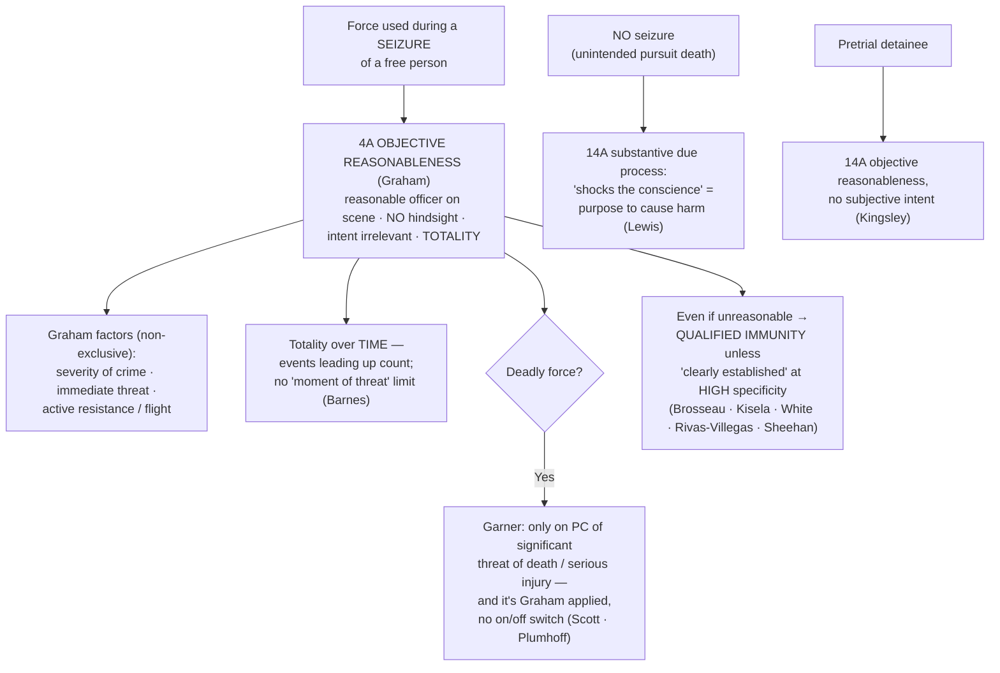

## The Brief

**Field-decisive question:** *Was this force objectively reasonable under the totality of the circumstances — judged from the perspective of a reasonable officer on the scene, not with 20/20 hindsight?*

When an officer uses force to make an arrest, an investigatory stop, or any other **seizure of a free person**, the force is itself a Fourth Amendment event and is measured by the Amendment's **objective-reasonableness** standard — not by substantive due process. "[A]ll claims that law enforcement officers have used excessive force — deadly or not — in the course of an arrest, investigatory stop, or other 'seizure' of a free citizen should be analyzed under the Fourth Amendment and its 'reasonableness' standard." *[[Graham v. Connor#^pin-395|Graham v. Connor]]*, 490 U.S. 386, 395 (1989). The test is **purely objective**, judged "from the perspective of a reasonable officer on the scene, rather than with the 20/20 vision of hindsight." *[[Graham v. Connor#^pin-396|Graham]]*, 490 U.S. at 396. Intent is irrelevant on both sides: "An officer's evil intentions will not make a Fourth Amendment violation out of an objectively reasonable use of force; nor will an officer's good intentions make an objectively unreasonable use of force constitutional." *Id.* at 397. And the standard "must embody allowance for the fact that police officers are often forced to make split-second judgments — in circumstances that are tense, uncertain, and rapidly evolving — about the amount of force that is necessary in a particular situation." *Id.* at 396–97.

**The Graham factors — plus everything else.** Reasonableness "requires careful attention to the facts and circumstances of each particular case, **including** the severity of the crime at issue, whether the suspect poses an immediate threat to the safety of the officers or others, and whether he is actively resisting arrest or attempting to evade arrest by flight." *[[Graham v. Connor#^pin-396a|Graham]]*, 490 U.S. at 396. Those three named factors — **severity of the crime · immediate threat · active resistance/flight** — are **non-exclusive** (the word is "including"); force is judged on the **totality of the circumstances**, so the factors are the starting point, not a closed checklist. This is where the articulation habit pays off: name every fact that made the force reasonable ([[Three Golden Rules]]).

Because *Graham* is litigated as a civil claim, the operational apparatus is unusual for a Fourth Amendment doctrine: the **remedy** for excessive force is a **42 U.S.C. § 1983 damages action** (or injunctive relief), not suppression — force rarely produces evidence to exclude. The **§ 1983 plaintiff bears the burden** of proving the force was objectively unreasonable; at summary judgment the historical facts are taken in the plaintiff's favor and the ultimate reasonableness question is one of law. Whether the officer is **personally liable** is a *separate* question — **qualified immunity** (below) — which does not change what the Fourth Amendment requires.

**Deadly force is the same standard at its sharpest.** Apprehension by deadly force is a seizure, and deadly force to stop a fleeing suspect "may not be used unless it is necessary to prevent the escape and the officer has **probable cause to believe that the suspect poses a significant threat of death or serious physical injury** to the officer or others." *[[Tennessee v. Garner#^pin-3|Tennessee v. Garner]]*, 471 U.S. 1, 3 (1985). So "[a] police officer may not seize an unarmed, nondangerous suspect by shooting him dead." *[[Tennessee v. Garner#^pin-11|Garner]]*, 471 U.S. at 11. But *Garner* is **not a rigid on/off switch**: it "did not establish a magical on/off switch that triggers rigid preconditions whenever an officer's actions constitute 'deadly force'" — it "was simply an application of the Fourth Amendment's 'reasonableness' test." *[[Scott v. Harris#^pin-1777|Scott v. Harris]]*, 550 U.S. 372 (2007). *Garner*'s factors therefore *inform* reasonableness; they are not a separate two-prong gate.

**Totality, not a single frozen instant.** In *[[Barnes v. Felix#^pin-73|Barnes v. Felix]]*, 605 U.S. 73 (2025), a unanimous Court rejected the Fifth Circuit's "moment-of-threat" rule: "To assess whether an officer acted reasonably in using force, a court must consider all the relevant circumstances, **including facts and events leading up to the climactic moment**." A court "cannot review the totality of the circumstances if it has put on chronological blinders." *[[Barnes v. Felix#^pin-73b|Barnes]]* (slip op., at 7). The totality inquiry has **no time limit** — the reason for the stop and the officer's own approach are part of the picture. *Barnes* **vacated and remanded**; it did not itself decide whether the force was reasonable, and it left the "officer-created danger" question open.

**Vehicle pursuits** are the paradigmatic dangerous-flight case. "A police officer's attempt to terminate a dangerous high-speed car chase that threatens the lives of innocent bystanders does not violate the Fourth Amendment, even when it places the fleeing motorist at risk of serious injury or death." *[[Scott v. Harris#^pin-1779|Scott]]*, 550 U.S. at 386 (ramming a recklessly fleeing motorist was reasonable). *[[Plumhoff v. Rickard#^pin-777|Plumhoff v. Rickard]]*, 572 U.S. 765, 777 (2014), applied that rule to shots fired to end a 100-mph chase and added that "if police officers are justified in firing at a suspect in order to end a severe threat to public safety, the officers need not stop shooting until the threat has ended." *[[Plumhoff v. Rickard#^pin-777b|Id.]]* And *[[Mullenix v. Luna]]*, 577 U.S. 7 (2015) (per curiam), granted qualified immunity to an officer who fired at a fleeing, intoxicated suspect who had twice threatened to shoot police — because the "clearly established" law was not particularized to that situation (below).

**Pretrial detainees are judged objectively too — but under the Fourteenth Amendment.** A convicted prisoner's excessive-force claim (Eighth Amendment) turns on whether force was applied "maliciously and sadistically"; a **pretrial detainee's** claim does not. "[A] pretrial detainee must show only that the force purposely or knowingly used against him was **objectively unreasonable**" — no proof of the officers' subjective awareness of unreasonableness is required. *[[Kingsley v. Hendrickson#^pin-397|Kingsley v. Hendrickson]]*, 576 U.S. 389, 396–97 (2015). The force must be deliberate (purposeful or knowing, not accidental), but its reasonableness is objective.

**When there is no seizure, the Fourth Amendment does not apply at all.** A person killed by a pursuit the police did not intend to stop him with is not "seized" — a seizure requires "termination of freedom of movement **through means intentionally applied**." *[[Brower v. County of Inyo#^pin-596|Brower v. County of Inyo]]*, 489 U.S. 593, 596–97 (1989). Such a death is judged under **Fourteenth Amendment substantive due process**, which in the pursuit setting is satisfied only by conduct that "shocks the conscience" — meaning "**a purpose to cause harm** unrelated to the legitimate object of arrest"; deliberate or reckless indifference is not enough in a high-speed chase. *[[County of Sacramento v. Lewis#^pin-836|County of Sacramento v. Lewis]]*, 523 U.S. 833, 836, 854 (1998). Keep the two tracks straight: an intentional seizure → *Graham* Fourth Amendment reasonableness; an unintended pursuit death → *Lewis* shocks-the-conscience.

**The qualified-immunity overlay — where most force cases are actually won and lost.** Even when force may have been unreasonable, an officer sued under § 1983 is immune unless the illegality was "**clearly established**," and in the force setting the Court demands that clearly-established law be defined at a **high level of specificity**, not as a broad principle. "*Graham* and *Garner*, following the lead of the Fourth Amendment's text, are cast at a high level of generality." *[[Brosseau v. Haugen#^pin-199|Brosseau v. Haugen]]*, 543 U.S. 194, 199 (2004) (per curiam). Officers "are entitled to qualified immunity unless existing precedent 'squarely governs' the specific facts at issue," and *Graham*/*Garner*'s general rules "do not by themselves create clearly established law outside an 'obvious case.'" *[[Kisela v. Hughes#^pin-1153|Kisela v. Hughes]]*, 584 U.S. 100 (2018) (per curiam). Accord *[[White v. Pauly#^pin-73|White v. Pauly]]*, 580 U.S. 73 (2017) (per curiam) (clearly established law must be "particularized" to the facts); *[[Rivas-Villegas v. Cortesluna#^pin-op5|Rivas-Villegas v. Cortesluna]]*, 595 U.S. 1 (2021) (per curiam) (the plaintiff "must identify a case that put [the officer] on notice that his specific conduct was unlawful"); *[[City and County of San Francisco v. Sheehan#^pin-1778|City and County of San Francisco v. Sheehan]]*, 575 U.S. 600 (2015) (immunity where officers had no "fair and clear warning of what the Constitution requires"). The full doctrine lives on [[Section 1983 Liability and Qualified Immunity]]; the field point is that the **reasonableness** question and the **clearly-established** question are distinct, and force claims often turn on the second.

**Recurring field and analytical errors:**

- **Treating the three factors as a closed test.** *Graham* says "including" — severity, threat, and resistance are illustrative, not exhaustive. Judge the totality.
- **Judging with hindsight.** The question is what a reasonable officer on the scene perceived in a tense, rapidly evolving moment — not what could have been done with time to reflect.
- **Smuggling in intent.** A "good faith" or "malicious/sadistic" inquiry misstates the standard; *Graham* rejected the *Johnson v. Glick* good-faith test — reasonableness is objective.
- **Reading *Garner* as a rigid two-part precondition for any deadly force.** *Scott* corrects this: no on/off switch; a dangerous fleeing suspect (a reckless high-speed driver) is a different totality than the unarmed, non-dangerous burglar in *Garner*.
- **Compressing the scene to the final second.** After *Barnes*, ignoring the events leading up to the force is reversible error — the totality has no time limit.
- **Confusing the standard with liability.** *Graham* fixes the constitutional force standard; qualified immunity and § 1983 damages are separate questions and do not change what the Fourth Amendment requires.
- **Applying the wrong amendment.** Free-person seizure → 4A *Graham*; pretrial detainee → 14A *Kingsley* (objective); convicted prisoner → 8A malicious-and-sadistic; unintended pursuit death (no seizure) → 14A *Lewis* shocks-the-conscience.

## Key cases

| Case (Bluebook) | Holding in one line | Authority weight | Treatment | CourtListener |
|---|---|---|---|---|
| *[[Graham v. Connor]]*, 490 U.S. 386 (1989) | Excessive force during any "seizure" of a free person is judged under the Fourth Amendment's **objective-reasonableness** standard (on-scene officer's perspective, no hindsight, no regard to intent), guided by three non-exclusive factors — not substantive due process. | Binding — SCOTUS | Good (2026-06-30) | [link](https://www.courtlistener.com/opinion/112257/graham-v-connor/) |
| *[[Tennessee v. Garner]]*, 471 U.S. 1 (1985) | Deadly force against an apparently unarmed, non-dangerous fleeing suspect is an **unreasonable seizure**; deadly force needs **probable cause** the suspect poses a significant threat of death or serious physical injury. | Binding — SCOTUS | Good; clarified (not limited) by *[[Scott v. Harris]]* | [link](https://www.courtlistener.com/opinion/111397/tennessee-v-garner/) |
| *[[Scott v. Harris]]*, 550 U.S. 372 (2007) | *Garner* is not a rigid separate test but "simply an application" of *Graham* reasonableness — no "magical on/off switch"; ramming a fleeing motorist who endangered the public was reasonable. | Binding — SCOTUS | Good (2026-06-30) | [link](https://www.courtlistener.com/opinion/145738/scott-v-harris/) |
| *[[Plumhoff v. Rickard]]*, 572 U.S. 765 (2014) | Deadly force to end a dangerous high-speed chase is reasonable, and officers "need not stop shooting until the threat has ended"; alternatively the officers had qualified immunity. | Binding — SCOTUS | Good (2026-06-30) | [link](https://www.courtlistener.com/opinion/2675750/plumhoff-v-rickard/) |
| *[[Barnes v. Felix]]*, 605 U.S. 73 (2025) | Reasonableness is judged on the **totality of the circumstances**, which has **no time limit**; the "moment-of-threat" rule that ignores the events leading up to the force is rejected (vacated & remanded, unanimous). | Binding — SCOTUS | Good (2026-06-30) | [link](https://www.courtlistener.com/opinion/10584846/barnes-v-felix/) |
| *[[Kingsley v. Hendrickson]]*, 576 U.S. 389 (2015) | A **pretrial detainee's** Fourteenth Amendment excessive-force claim requires only that the deliberate force was **objectively unreasonable** — no subjective awareness of unreasonableness need be shown. | Binding — SCOTUS | Good (2026-06-30) | [link](https://www.courtlistener.com/opinion/2811847/kingsley-v-hendrickson/) |
| *[[County of Sacramento v. Lewis]]*, 523 U.S. 833 (1998) | A pursuit death **without a seizure** is judged under Fourteenth Amendment substantive due process; only a **purpose to cause harm** unrelated to arrest "shocks the conscience" — reckless indifference is not enough in a chase. | Binding — SCOTUS | Good (2026-06-30) | [link](https://www.courtlistener.com/opinion/118214/county-of-sacramento-v-lewis/) |
| *[[Kisela v. Hughes]]*, 584 U.S. 100 (2018) (per curiam) | Officers get qualified immunity in force cases unless existing precedent "**squarely governs**" the specific facts; *Graham*/*Garner* "do not by themselves create clearly established law outside an 'obvious case.'" | Binding — SCOTUS | Good (2026-06-30) | [link](https://www.courtlistener.com/opinion/4482892/kisela-v-hughes/) |
| *[[Brosseau v. Haugen]]*, 543 U.S. 194 (2004) (per curiam) | *Graham* and *Garner* "are cast at a high level of generality" and rarely clearly establish the answer in a particular shooting; the officer who shot a fleeing driver fell in the "hazy border" and had qualified immunity. | Binding — SCOTUS | Good (2026-06-30) | [link](https://www.courtlistener.com/opinion/137736/brosseau-v-haugen/) |
| *[[City and County of San Francisco v. Sheehan]]*, 575 U.S. 600 (2015) | Officers who used force against an armed, mentally ill suspect after re-entering her room had qualified immunity — no clearly established law gave "fair and clear warning"; the ADA-accommodation question was left open. | Binding — SCOTUS | Good (2026-06-30) | [link](https://www.courtlistener.com/opinion/2801435/city-and-county-of-san-francisco-v-sheehan/) |

## Related cases across doctrines

These cases are treated in full on other pages but bear directly on the use-of-force / objective-reasonableness inquiry, framed here for that doctrine.

| Case | Relevance to use of force (objective reasonableness) | Primary treatment | CourtListener |
|---|---|---|---|
| *[[White v. Pauly]]*, 580 U.S. 73 (2017) (per curiam) | The qualified-immunity specificity rule for force: clearly established law must be "particularized" to the facts, and *Graham*/*Garner* alone do not create it "outside an 'obvious case'" — an officer who arrived late to an ongoing scene did not violate clearly established law by firing without a warning. | [[Section 1983 Liability and Qualified Immunity]] | [opinion](https://www.courtlistener.com/opinion/4374579/white-v-pauly/) |
| *[[Mullenix v. Luna]]*, 577 U.S. 7 (2015) (per curiam) | Reinforces that "clearly established" law must be defined with particularity to the specific context ("whether the violative nature of particular conduct is clearly established") — immunity for shooting a fleeing, intoxicated suspect who had threatened officers. | [[Section 1983 Liability and Qualified Immunity]] | [opinion](https://www.courtlistener.com/opinion/3153112/mullenix-v-luna/) |
| *[[Rivas-Villegas v. Cortesluna]]*, 595 U.S. 1 (2021) (per curiam) | The plaintiff must identify a case putting the officer on notice that "his specific conduct was unlawful," judged "in light of the specific context of the case, not as a broad general proposition" — a brief knee-to-the-back during a serious domestic-violence call was immune. | [[Section 1983 Liability and Qualified Immunity]] | [opinion](https://www.courtlistener.com/opinion/5290447/rivas-villegas-v-cortesluna/) |
| *[[Brower v. County of Inyo]]*, 489 U.S. 593 (1989) | Defines when force effects a **seizure** at all: only a "termination of freedom of movement through means intentionally applied" — the threshold that separates a *Graham* Fourth Amendment claim from the *Lewis* substantive-due-process track for unintended pursuit harm. | [[Seizure of the Person]] | [opinion](https://www.courtlistener.com/opinion/112218/brower-ex-rel-estate-of-caldwell-v-county-of-inyo/) |

## Recent developments

The Supreme Court supplies the governing force standard; the circuit courts do the day-to-day line-drawing on the *Graham* factors. The decision below is **Binding in-circuit** within its own circuit and **Persuasive (outside circuit)** elsewhere — never state a circuit holding as nationwide law.

- **Application of the *Graham* factors — *[[Wright v. City of Euclid]]* (6th Cir. 2020).** A published Sixth Circuit decision reversing summary judgment and denying qualified immunity: taking the plaintiff's account as true, "drawing a weapon on a suspect who was not fleeing or posing a safety risk and tasering a suspect who was not actively resisting arrest constituted excessive force," and that was clearly established. A worked circuit example of the *Graham* factors (low offense severity, no immediate threat, no active resistance) cutting against the force used. **Binding in-circuit — 6th Cir.; Persuasive (outside circuit)** elsewhere. [opinion](https://www.courtlistener.com/opinion/4762133/lamar-wright-v-city-of-euclid/).

## Visual

## Sources
- *Graham v. Connor*, 490 U.S. 386 (1989) — https://www.courtlistener.com/opinion/112257/graham-v-connor/ — pinpoints: 395, 396, 397.
- *Tennessee v. Garner*, 471 U.S. 1 (1985) — https://www.courtlistener.com/opinion/111397/tennessee-v-garner/ — pinpoints: 3, 11.
- *Scott v. Harris*, 550 U.S. 372 (2007) — https://www.courtlistener.com/opinion/145738/scott-v-harris/ — pinpoints: 550 U.S. at 386 (S. Ct. reporter 1777, 1779).
- *Plumhoff v. Rickard*, 572 U.S. 765 (2014) — https://www.courtlistener.com/opinion/2675750/plumhoff-v-rickard/ — pinpoints: 777, 778.
- *Barnes v. Felix*, 605 U.S. 73 (2025) — https://www.courtlistener.com/opinion/10584846/barnes-v-felix/ — pinpoints: slip op., at 1, 7.
- *Kingsley v. Hendrickson*, 576 U.S. 389 (2015) — https://www.courtlistener.com/opinion/2811847/kingsley-v-hendrickson/ — pinpoints: 396–97.
- *County of Sacramento v. Lewis*, 523 U.S. 833 (1998) — https://www.courtlistener.com/opinion/118214/county-of-sacramento-v-lewis/ — pinpoints: 836, 854.
- *Kisela v. Hughes*, 584 U.S. 100 (2018) (per curiam) — https://www.courtlistener.com/opinion/4482892/kisela-v-hughes/ — pinpoints: 138 S. Ct. at 1152, 1153.
- *Brosseau v. Haugen*, 543 U.S. 194 (2004) (per curiam) — https://www.courtlistener.com/opinion/137736/brosseau-v-haugen/ — pinpoints: 198, 199, 201.
- *City and County of San Francisco v. Sheehan*, 575 U.S. 600 (2015) — https://www.courtlistener.com/opinion/2801435/city-and-county-of-san-francisco-v-sheehan/ — pinpoints: 600; 135 S. Ct. at 1778.
- *White v. Pauly*, 580 U.S. 73 (2017) (per curiam) — https://www.courtlistener.com/opinion/4374579/white-v-pauly/ — pinpoints: slip op., at 6–7.
- *Mullenix v. Luna*, 577 U.S. 7 (2015) (per curiam) — https://www.courtlistener.com/opinion/3153112/mullenix-v-luna/ — pinpoints: 11, 12.
- *Rivas-Villegas v. Cortesluna*, 595 U.S. 1 (2021) (per curiam) — https://www.courtlistener.com/opinion/5290447/rivas-villegas-v-cortesluna/ — pinpoints: slip op., at 4, 5.
- *Brower v. County of Inyo*, 489 U.S. 593 (1989) — https://www.courtlistener.com/opinion/112218/brower-ex-rel-estate-of-caldwell-v-county-of-inyo/ — pinpoints: 596–97, 599.
- *Wright v. City of Euclid*, 962 F.3d 852 (6th Cir. 2020) — https://www.courtlistener.com/opinion/4762133/lamar-wright-v-city-of-euclid/ — pinpoint: slip op., at 17.
