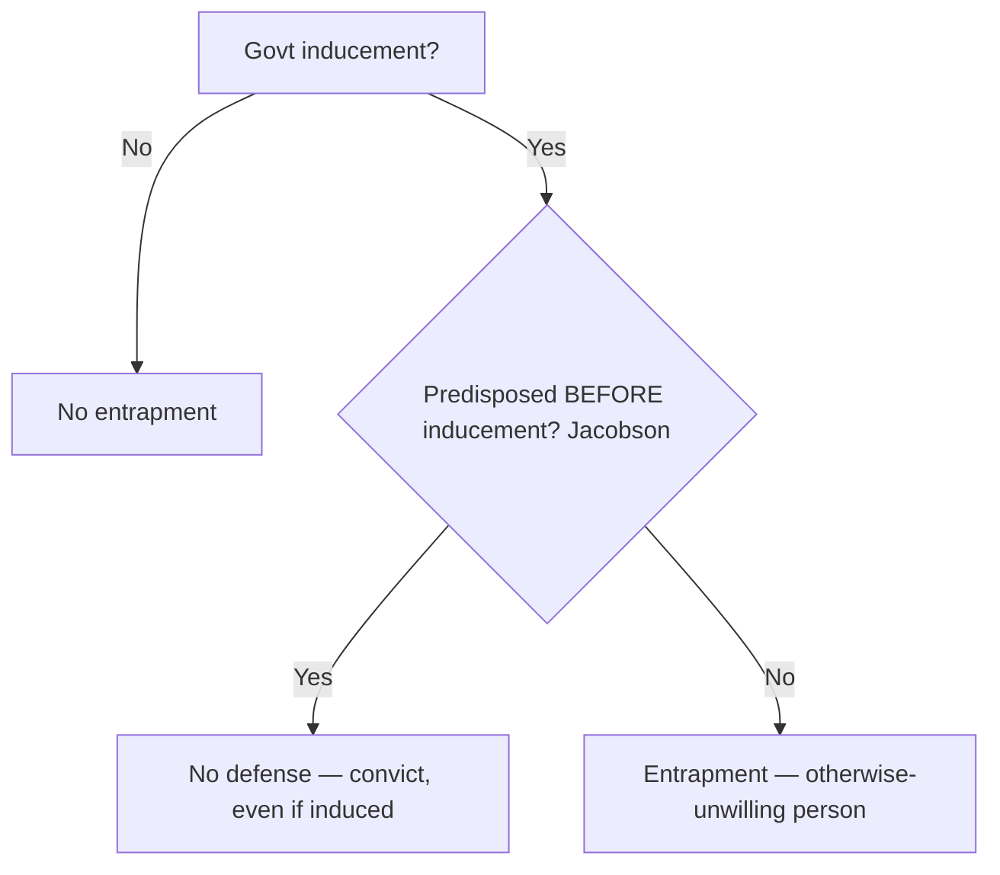

---
aliases:
  - "Entrapment"
topic: Entrapment
type: doctrine
jurisdiction: Federal substantive criminal-law defense; SCOTUS baseline
status: verified
related:
  - "[[Common Legal Terms]]"
  - "[[Sixth Amendment Right to Counsel]]"
  - "[[Due-Process Voluntariness of Confessions]]"
  - "[[Miranda and Custodial Interrogation]]"
---

# Entrapment

## Rule
Entrapment is a substantive **defense to criminal liability** — not a Fourth Amendment suppression remedy. In federal court the test is **subjective**: it turns on the defendant's **predisposition** to commit the crime, not on the mere fact of government inducement. The government may furnish an *opportunity* to break the law, but it may not implant the criminal design in the mind of an otherwise-unwilling person and then lure that person into committing the offense. Once the defense raises inducement, the government must prove beyond a reasonable doubt that the defendant was predisposed.

**Rule (two-element test + burden split).** Entrapment has two elements: (1) **government inducement** of the crime, and (2) the defendant's **lack of predisposition** to commit it. The defendant bears the **burden of production** on inducement (he must point to some evidence of government inducement); once inducement is raised, the **government bears the burden of persuasion** to prove **beyond a reasonable doubt** that the defendant was predisposed — and predisposed *prior to* first being approached by government agents. *Jacobson v. United States*, 503 U.S. 540, 548-49 (1992); *Mathews v. United States*, 485 U.S. 58, 62-63 (1988).

## Key cases

| Case | Holding (one line) | Weight | CourtListener |
|------|--------------------|--------|---------------|
| *Sorrells v. United States*, 287 U.S. 435 (1932) | Recognizes entrapment as a defense; it arises when officials implant the criminal design in a person who had no previous disposition and then lure that otherwise-innocent person into the crime. | SCOTUS — binding | [opinion](https://www.courtlistener.com/opinion/101997/sorrells-v-united-states/) |
| *Sherman v. United States*, 356 U.S. 369 (1958) | Entrapment established as a matter of law where the government's informant implanted the design in an unwilling person (a recovering addict pressured by a fellow patient) and induced the crime. | SCOTUS — binding | [opinion](https://www.courtlistener.com/opinion/105681/sherman-v-united-states/) |
| *United States v. Russell*, 411 U.S. 423 (1973) | No entrapment where the defendant was predisposed, even though an agent supplied a hard-to-obtain but legal ingredient; the Court reaffirmed the predisposition test and rejected the objective test. | SCOTUS — binding | [opinion](https://www.courtlistener.com/opinion/108768/united-states-v-russell/) |
| *Jacobson v. United States*, 503 U.S. 540 (1992) | Where the government induces the crime it must prove predisposition existed independent of, and prior to, the inducement; 26 months of solicitation that itself created the predisposition defeats the prosecution as a matter of law. | SCOTUS — binding | [opinion](https://www.courtlistener.com/opinion/112720/jacobson-v-united-states/) |
| *Mathews v. United States*, 485 U.S. 58 (1988) | A defendant may raise entrapment even while denying one or more elements of the charged offense, whenever the evidence would let a reasonable jury find entrapment. | SCOTUS — binding | [opinion](https://www.courtlistener.com/opinion/112012/mathews-v-united-states/) |
| *Hampton v. United States*, 425 U.S. 484 (1976) | The entrapment defense does not bar conviction of a predisposed defendant who sold government-supplied contraband — conceded predisposition defeats the defense (majority result). A three-Justice plurality (Rehnquist, J.) would further hold that the Due Process Clause never bars such a conviction, but Justices Powell and Blackmun, concurring only in the judgment, expressly **reserved** the possibility of a due-process bar in cases of outrageous government conduct (*id.* at 491-95 (Powell, J., concurring in the judgment)), and the three dissenters would recognize such a defense — so the flat 'no due-process bar' proposition did not command a majority. | SCOTUS — binding | [opinion](https://www.courtlistener.com/opinion/109437/hampton-v-united-states/) |

## Related cases across doctrines
These cases are treated in full elsewhere but bear on this doctrine, framed here for entrapment.

| Case | Relevance to entrapment | Primary treatment | CourtListener |
|------|-------------------------|-------------------|---------------|
| *Illinois v. Perkins*, 496 U.S. 292 (1990) | Undercover-sting backbone: *Miranda* warnings are NOT required when an undercover agent posing as an inmate elicits statements, because the coercive atmosphere *Miranda* guards against is absent in a sting. The flip side an instructor must teach with entrapment: lawful undercover/sting tactics that furnish an opportunity are constitutional; what converts a sting into entrapment is implanting criminal design in an unpredisposed target, not the deception itself. | [[Miranda and Custodial Interrogation]] | [opinion](https://www.courtlistener.com/opinion/112452/illinois-v-perkins/) |
| *United States v. Henry*, 447 U.S. 264 (1980) | Sixth Amendment analog to entrapment's "government engineered it" theory: by intentionally creating a situation likely to INDUCE an indicted defendant to make incriminating statements through a paid informant, the government "deliberately elicited" them in violation of the right to counsel. Distinguish from entrapment: *Henry* is a post-charge suppression rule about eliciting statements, not a predisposition defense to liability — useful for showing instructors that "the informant set him up" can implicate different doctrines depending on whether charges have attached and whether the issue is a statement or the crime itself. | [[Sixth Amendment Right to Counsel]] | [opinion](https://www.courtlistener.com/opinion/110300/united-states-v-henry/) |

## Nuances & limits
- **Predisposition is the controlling fact.** Inducement alone is never entrapment. The dispositive question is whether the defendant was *ready and willing* before the government appeared (*Russell*, *Hampton*).
- **The Jacobson timing rule.** Predisposition must exist *before* the government's contact. As the *Jacobson* Court held: "Where the Government has induced an individual to break the law and the defense of entrapment is at issue ... the prosecution must prove beyond reasonable doubt that the defendant was disposed to commit the criminal act prior to first being approached by Government agents." (503 U.S. at 548-49). Government conduct cannot manufacture the very predisposition it then points to.
- **Furnishing means or contraband is not entrapment** of a predisposed person. Supplying a legal-but-scarce ingredient (*Russell*) or even the contraband itself (*Hampton*) does not establish the defense and, on these facts, raised no due-process bar.
- **Denial plus entrapment.** A defendant need not admit the acts to claim entrapment. *Mathews* held: "even if the defendant denies one or more elements of the crime, he is entitled to an entrapment instruction whenever there is sufficient evidence from which a reasonable jury could find entrapment" (485 U.S. at 62).
- **Subjective vs. objective test (federal–state split).** Federal courts apply the *subjective* (predisposition) test. A minority/state approach uses an *objective* test focused on whether police conduct would induce a hypothetical law-abiding person. The objective test is a **non-federal alternative, illustrative only** — it does **not** govern in federal court. See [[Common Legal Terms]].

## Common pitfalls
- **Treating inducement as automatic entrapment.** Persuasion, opportunity, or even repeated requests do not entrap a *predisposed* person; predisposition controls.
- **Applying the objective test in federal court.** Officers and instructors sometimes ask "would this tactic induce an average person?" — that is the state/objective framing. Federal law asks about *this defendant's* predisposition.
- **Confusing entrapment with a Fourth Amendment / suppression remedy.** Entrapment does not suppress evidence; it is a **defense to liability** decided by the jury (or, when clear, as a matter of law).

## Recent developments & subsequent treatment
The *Jacobson* predisposition framework has been steadily applied in the online-sting era, where outcomes turn on the facts of the inducement rather than on any disagreement about the legal standard. The following are recent circuit applications — **persuasive, not binding** — illustrating how the two-element test (government inducement + lack of predisposition) is being worked out in attempted-enticement prosecutions. There is no pending SCOTUS case unsettling the test.

- **United States v. Hanapel (8th Cir. 2024)** — Applying the two-element entrapment test (government inducement + lack of predisposition), the Eighth Circuit (**persuasive, not binding**) affirmed the conviction for attempting to entice a minor: no inducement as a matter of law where the defendant readily responded to an undercover officer posing as a 14-year-old, so a reasonable jury could reject entrapment. A contrasting fact-driven outcome under the same framework, showing the doctrine produces divergence on the facts, not a split on the legal standard. [opinion](https://www.courtlistener.com/opinion/10038262/united-states-v-james-hanapel/).
- **United States v. Perez-Rodriguez (1st Cir. 2021)** — The First Circuit (**persuasive, not binding**) vacated the conviction and remanded for a new trial: the district court committed plain error in refusing an entrapment instruction in an online attempted-enticement sting. The agent's "bundling of licit and illicit sex into a package deal" (offering a sexual encounter combining legal sex with an adult and illegal sex with a fictitious 11-year-old) is a recognized "plus factor" that, on the evidence, could establish improper inducement (Hinkel/Gamache line), and the burden of production on both inducement and lack-of-predisposition prongs was met. *Jacobson* framework applied in the digital-sting context. [opinion](https://www.courtlistener.com/opinion/5067201/united-states-v-perez-rodriguez/).

## Visual

## Sources
- [Sorrells v. United States, 287 U.S. 435 (1932)](https://www.courtlistener.com/opinion/101997/sorrells-v-united-states/)
- [Sherman v. United States, 356 U.S. 369 (1958)](https://www.courtlistener.com/opinion/105681/sherman-v-united-states/)
- [United States v. Russell, 411 U.S. 423 (1973)](https://www.courtlistener.com/opinion/108768/united-states-v-russell/)
- [Jacobson v. United States, 503 U.S. 540 (1992)](https://www.courtlistener.com/opinion/112720/jacobson-v-united-states/)
- [Mathews v. United States, 485 U.S. 58 (1988)](https://www.courtlistener.com/opinion/112012/mathews-v-united-states/)
- [Hampton v. United States, 425 U.S. 484 (1976)](https://www.courtlistener.com/opinion/109437/hampton-v-united-states/)
