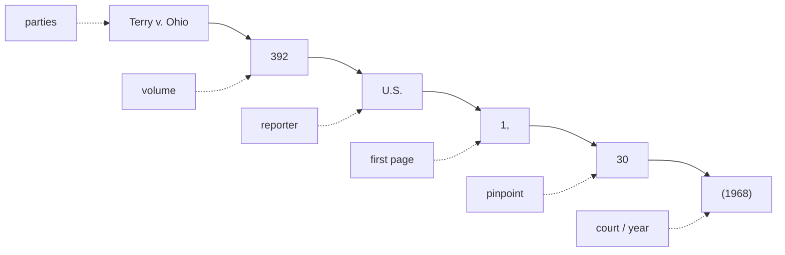

---
aliases:
  - "Legal Research and Case Citations"
  - "Reading and Citing Cases"
title: "Reading & Citing Cases"
topic: Reading and Citing Cases
type: reference
jurisdiction: Federal
status: verified
related: ["[[Legal Research Tools]]", "[[Verifying Good Law]]", "[[The Federal Court System]]", "[[Common Legal Terms]]", "[[Fourth Amendment Analysis Checklist]]"]
---

**You're handed a cite — what does each part tell you, and is it worth trusting?** This page decodes a citation left to right, then covers the state conventions the federal rules don't, and ends with a quick-reference glossary of the citation and posture terms that show up in opinions. It is one of three companion references: this one on **reading and citing**, [[Legal Research Tools]] on **finding the opinion free**, and [[Verifying Good Law]] on **confirming it still stands**. House style throughout is **Bluebook**, and every case this wiki asserts is verified on CourtListener before it goes on a page.

## Reading a federal citation

### Anatomy of a cite

Take a neutral running example:

> *[[Terry v. Ohio]]*, 392 U.S. 1, 30 (1968).

Read left to right, every standard cite has the same parts:

- **Case name (the parties)** — *Terry v. Ohio*. Italicized; the *v.* separates the two sides. By convention the first-named party is the appellant/petitioner on review, so the same dispute can flip names on appeal. Cite by the short name everyone uses (*Terry*).
- **Volume number** — `392`. Which physical volume of the reporter the case sits in.
- **Reporter abbreviation** — `U.S.` Tells you *which set of books* (and therefore which court). See the reporter table below.
- **First page** — `1`. The page where the opinion *starts*.
- **Pinpoint (pin cite)** — `30`. The *specific* page the quoted or relied-on language is on. `392 U.S. 1, 30` means "the opinion starts at page 1; the point I'm making is on page 30." **Always pin when you quote or attribute a specific point** — a cite without a pin is hard to check and weak in a courtroom.
- **Court & year parenthetical** — `(1968)`. The year decided. For lower courts the parenthetical also names the **court**, e.g. `(9th Cir. 2021)` or `(S.D.N.Y. 2020)`. For the Supreme Court the reporter `U.S.` already identifies the court, so the parenthetical is year only.

### Which reporter = which court

The reporter abbreviation is the fastest way to tell a case's level — and therefore its precedential weight (see [[The Federal Court System]]).

| Reporter | Court | Example |
| --- | --- | --- |
| `U.S.` | U.S. Supreme Court (official) | 392 U.S. 1 |
| `S. Ct.` | U.S. Supreme Court (West) — parallel | 88 S. Ct. 1868 |
| `L. Ed. 2d` | U.S. Supreme Court (Lawyers' Ed.) — parallel | 20 L. Ed. 2d 889 |
| `F.4th` / `F.3d` / `F.2d` / `F.` | U.S. Courts of Appeals (circuits) | 5 F.4th 100 (9th Cir. 2021) |
| `F. Supp. 3d` / `F. Supp. 2d` / `F. Supp.` | U.S. District Courts | 500 F. Supp. 3d 1 (D. Mass. 2020) |
| `F. App'x` | unpublished circuit dispositions (Federal Appendix) | 700 F. App'x 1 |

- The numbered series (`F.`, `F.2d`, `F.3d`, `F.4th`) are just *editions* of the same Federal Reporter as the volumes filled up over the decades — `F.4th` is simply the current one.
- For a circuit case the parenthetical's circuit tells you *whose* authority it is — `(5th Cir.)` binds the Fifth Circuit but is **Persuasive (outside circuit)** elsewhere. Never anchor a multi-jurisdiction point to one circuit.

### Parallel citations (federal)

The *same* SCOTUS opinion appears in three reporters at once, so you'll see all three strung together:

> *Terry v. Ohio*, 392 U.S. 1, 88 S. Ct. 1868, 20 L. Ed. 2d 889 (1968).

These are **parallel citations** — same case, three sets of books. For federal work, citing the official `U.S.` reporter alone is standard; the parallels matter mainly for older cases or some state-court practice. Don't mistake parallels for three different cases.

### Signals, short forms, and back-references

- **Introductory signals** tell the reader *how* the cite supports the point:
  - *(no signal)* — the source directly states the proposition.
  - **See** — the source supports it by clear inference (the workhorse signal).
  - **See also** — additional support, secondary to what you already cited.
  - **Cf.** — supports an *analogous* point; worth a parenthetical explaining why.
  - **E.g.** — one example among many that say the same thing.
  - **But see** / **Contra** — authority that cuts the *other* way (cite these honestly).
- **Short forms** — after a case is cited in full once, refer to it by the short name (*Terry*) or a short cite (`392 U.S. at 30`).
- **`Id.`** — "the immediately preceding authority." `Id. at 30` = same source, new page. Use only when the cite right before it is the same source.
- **`Supra`** — points back to a source cited earlier but *not* immediately above (used mainly for books, articles, and the like — generally **not** for cases under Bluebook).

### Published, unpublished, and per curiam

This distinction drives **how much weight** an opinion carries — tie it to [[The Federal Court System]].

- **Published** opinions are designated for the bound reporters (`F.4th`, `F. Supp. 3d`) and are **precedential** — binding on that court and the courts below it within the jurisdiction.
- **Unpublished** dispositions (often in `F. App'x`, the Federal Appendix, or marked "not for publication") are typically **Persuasive only — non-precedential**. Circuits vary on whether and how they may be cited; Federal Rule of Appellate Procedure 32.1 permits *citing* federal unpublished opinions issued on or after Jan. 1, 2007, but permission to cite is not the same as binding force.
- **Per curiam** ("by the court") opinions are issued in the name of the whole court rather than a single authoring judge. They can be fully precedential (many SCOTUS per curiams are) or summary and non-precedential — judge the weight by the court and whether it's published, not by the "per curiam" label alone.
- **Bottom line for instructors:** before you lean on a case, confirm it is *published* (or otherwise binding in your jurisdiction). An unpublished circuit case is a teaching illustration, not a rule you can hang a search on.

## Federal vs. state citation conventions

The federal patterns above get you through SCOTUS and the circuits. State reporting is its own world, and students hit it constantly. Here are the conventions that actually change how you read a cite.

### Prosecuting-party names (and the Bluebook short-form rule)

Criminal captions put the **government first**. Which name the government uses depends on the jurisdiction:

- **Federal** — *United States v. ___*.
- **State v. ___** — most states (e.g., Ohio, Florida, New Jersey, Washington).
- **People v. ___** — California, New York, Illinois, Michigan, Colorado.
- **Commonwealth v. ___** — Pennsylvania, Massachusetts, Virginia, Kentucky.

**Bluebook short-form rule.** When the deciding court sits **in** that sovereign, shorten the government party to *State*, *People*, or *Commonwealth* alone (*State v. Smith*). When a court **outside** that sovereign decides the case — e.g., the U.S. Supreme Court reviewing a Florida conviction — keep the **state's name** so the reader isn't left guessing *which* state (*Stern v. Florida*, not *Stern v. State*). Same reason SCOTUS opinions read *Georgia v. Randolph*, not *State v. Randolph*.

### The caption as a civil-vs-criminal signal (not a rule)

A caption is a **heuristic**, not a guarantee:

- Government-first (*United States v. ___*, *State v. ___*) is **usually criminal**.
- Two private-party names (*Smith v. Jones*) is **usually civil**.

Name the exceptions so you don't overclaim. Government-first appears in plenty of **non-criminal** matters: civil enforcement suits (*United States v. [Corporation]*), **in rem** civil forfeiture (styled against the property itself, *United States v. $124,700 in U.S. Currency*), and administrative actions. And criminal-adjacent postures carry their own captions: *In re ___* (a matter, not two adversaries), *Ex parte ___* (one side only), and habeas corpus, which reads civil — the prisoner sues the custodian (*[Petitioner] v. [Warden]*). Read the caption as a first hint, then confirm from the opinion.

### Regional reporters (the West National Reporter System)

West's National Reporter System groups the states into **seven regional reporters**. The abbreviation tells you the region, not the specific state:

| Regional reporter | Abbreviation(s) |
| --- | --- |
| Atlantic | `A.` / `A.2d` / `A.3d` |
| North Eastern | `N.E.` / `N.E.2d` / `N.E.3d` |
| North Western | `N.W.` / `N.W.2d` |
| Pacific | `P.` / `P.2d` / `P.3d` |
| Southern | `So.` / `So. 2d` / `So. 3d` |
| South Eastern | `S.E.` / `S.E.2d` |
| South Western | `S.W.` / `S.W.2d` / `S.W.3d` |

Each reporter covers a fixed cluster of states, but the cluster is **not** something to recite from memory — it's easy to misremember, and it isn't intuitive (Oklahoma is in the Pacific reporter, not the South Western). **Bluebook Table T1** gives each state's official reporter and citation preference; the front matter of any reporter volume lists its states. Look it up rather than guessing.

### Neutral / public-domain citations

A growing number of states have adopted a **medium-neutral** (public-domain, vendor-neutral) citation: **year + court abbreviation + sequential opinion number**, with a **`¶` paragraph** pincite instead of a page:

> *1997 ND 15, ¶ 21* — the 15th opinion the North Dakota Supreme Court released in 1997, paragraph 21.
> *2021 WI 5, ¶ 7* — the 5th Wisconsin Supreme Court opinion of 2021, paragraph 7.

The `¶` matters: it pins to a **paragraph** the court numbered itself, so the cite survives no matter what page a reprint puts it on. Bluebook pairs the neutral cite with a **parallel** regional-reporter cite where one exists. The adopting-state list **drifts** — states join over time and formats vary — so confirm the current list and each state's exact format against the authority rather than freezing a snapshot (see Sources: USC Law's *Universal Citation* guide and the deciding court's own citation rule).

### Parallel citations (state)

Some state practice strings the **official state reporter** and the **regional reporter** together:

> *Commonwealth v. Serge*, 586 Pa. 671, 896 A.2d 1170 (2006).

That is **one** case in two sets of books — `586 Pa. 671` (Pennsylvania Reports) and `896 A.2d 1170` (Atlantic Reporter) — not two cases. Many states have **discontinued their official reporters**; for those, cite the regional reporter (plus the neutral cite if the state uses one). Don't read a parallel cite as two different opinions.

### Finding a state high-court opinion free

You do not need Westlaw to pull a state supreme-court opinion. Fastest free routes:

- **CourtListener** — all 50 states plus the federal system; full-text and citation search.
- **Google Scholar** (Case law) — state appellate/supreme coverage from roughly 1950 forward.
- **The state court's own website** — the authoritative slip opinion, often posted the day it drops.
- **Justia** — browsable state collections by court.
- **vLex Fastcase** — comprehensive, but free only through a bar-association membership (see [[Legal Research Tools]]).

Confirm the text on the court's own site or CourtListener before you rely on it. The full toolset — free backbone and low-cost options — is on [[Legal Research Tools]].

## Citation & posture terms (quick reference)

Plain-English definitions of the citation-mechanics and procedural-posture terms that recur in opinions. Each is a stable anchor other pages link to. Several (*en banc, certiorari, slip opinion, on remand, vacated*) bear on **authority weight** or **good-law status** — for weight, see [[The Federal Court System]]; for whether a case still stands, see [[Verifying Good Law]].

### Supra
Latin for "above." A short-form pointer back to a source already cited **earlier but not immediately above** — used mainly for books, articles, and other secondary sources, and generally **not** for cases under Bluebook.
*Example:* *Smith, supra*, at 42 — return to the Smith article cited a few footnotes back, now at page 42.

### Id.
Latin for "the same." A short form that points to the **immediately preceding** authority; add a pincite when the page changes.
*Example:* After a full cite to an opinion, `Id. at 30` means the very same source, now at page 30.

### Pinpoint cite (pin cite)
The **exact page (or paragraph) number** where the quoted or relied-on language sits, given after the first page. Pinpointing is what lets a reader open to the precise text you're standing on.
*Example:* In `392 U.S. 1, 30`, the `1` is where the opinion starts and the `30` is the pin cite; a paragraph pin reads `¶ 21`.

### Reporter
A **published set of volumes** collecting court opinions; its abbreviation (`U.S.`, `F.4th`, `A.3d`) identifies both the series and, usually, the court. Reporters can be **official** (court-sanctioned) or **unofficial** (commercial, like West's).
*Example:* `392 U.S. 1` sits in volume 392 of the *United States Reports*, the official Supreme Court reporter.

### Parallel citation
Two or more citations to the **same opinion** in different reporters, given together. It signals one case in multiple books, not multiple cases.
*Example:* `392 U.S. 1, 88 S. Ct. 1868, 20 L. Ed. 2d 889` — one Supreme Court opinion, three reporters.

### En banc
A sitting of the **full court** rather than the usual three-judge panel. Circuit courts normally decide in panels; en banc rehearing lets the whole active bench reconsider, and it is the only way (short of SCOTUS) to overrule a prior panel of that circuit.
*Example:* A three-judge Ninth Circuit panel rules; the circuit then rehears the case en banc and reaches a different result that governs the whole circuit.

### Certiorari (cert.)
The discretionary **writ by which the U.S. Supreme Court agrees to review** a lower-court decision. The Court grants only a small fraction of petitions (roughly 1%), and a **denial of certiorari decides nothing on the merits** — it just leaves the decision below standing.
*Example:* A party who lost in a court of appeals files a petition for a writ of certiorari; if four Justices vote to grant (the "rule of four"), the Court hears the case.

### Slip opinion
The **first, official version** of a decision the court releases on decision day, before it is paginated into the bound reporter. It is authoritative but not yet finalized — pagination is provisional and minor corrections can follow.
*Example:* The day a case comes down, you cite the slip opinion from the court's website; months later the same text appears at a permanent reporter page.

### On remand
The posture of a case **sent back to a lower court** for further proceedings after a higher court's decision. The lower court must act consistently with the higher court's instructions.
*Example:* An appeals court reverses and remands; **on remand**, the district court holds a new suppression hearing under the standard the appellate court set.

### Vacated
A ruling that has been **set aside and deprived of legal effect** by a higher court (or the same court). A vacated decision is no longer good law and cannot be relied on — a critical good-law flag when you check a case's treatment (see [[Verifying Good Law]]).
*Example:* A court of appeals **vacates** a district-court order and remands; the vacated order no longer controls anything.

## Sources

Citation and reporting conventions (practice references, not case authority):

- [Bluebook Rule 10 — Case Citation (Suffolk Law)](https://www.suffolk.edu/law/faculty-research/library-services/a-bluebook-guide-for-law-students/case-citation-rule-10)
- [Citing State Cases (USC Law)](https://guides.law.sc.edu/LRAWFall/CitingStateCases)
- [Bluebook — State Courts (Georgetown Law)](https://guides.ll.georgetown.edu/c.php?g=261289&p=2339384)
- [State & Regional Reporters (NYU Law)](https://nyulaw.libguides.com/c.php?g=773843&p=5551864)
- [Universal (medium-neutral) Citation — adopting states (USC Law)](https://guides.law.sc.edu/universalcitation/adoptedby)
- [Medium-neutral citations, Rule 11.6 (North Dakota Courts)](https://www.ndcourts.gov/legal-resources/rules/ndrct/11-6)
- [Public Domain Legal Citations (Justia)](https://lawblog.justia.com/2010/12/17/public-domain-legal-citations/)
- [Caption — Wex (Cornell LII)](https://www.law.cornell.edu/wex/caption)
