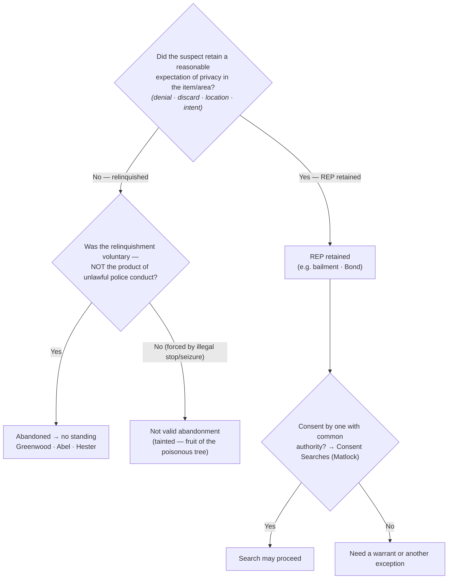

---
aliases:
  - "Abandonment"
title: "Abandonment"
topic: Abandonment
type: doctrine
amendment: "U.S. Const. amend. IV"
jurisdiction: "Federal (U.S. Const. amend. IV); SCOTUS baseline"
status: verified
related: ["[[Fourth Amendment Framework]]", "[[Two Definitions of Search]]", "[[Curtilage]]", "[[Seizure of the Person]]", "[[Consent Searches]]", "[[Standing to Challenge a Search]]"]
---

# Abandonment

## The Brief

**Field-decisive question:** *Did the suspect retain a reasonable expectation of privacy in the item or area — or did he abandon it?*

**Black-letter rule.** A person who **voluntarily abandons** property or a place loses any reasonable expectation of privacy in it and therefore has **no standing** to challenge its later search or seizure. Abandonment is judged by the **Fourth Amendment expectation-of-privacy standard** (the *[[Katz v. United States|Katz]]* test), **not** by strict property law — the question is whether the person retained an expectation of privacy "that society accepts as objectively reasonable." [[California v. Greenwood#^pin-40|*Greenwood*, 486 U.S. at 39–40]]. Relinquishment has **two facets** — an **outward act** (denial, discard, walking away) and the **intent** that act reveals — and it must be **voluntary**: an abandonment that is the **product of unlawful police conduct** (e.g., contraband dropped only because of an illegal stop or seizure) is not a valid relinquishment and does not defeat standing.

**The factors (a totality inquiry, not a checklist).** Courts synthesize the case law into four recurring factors, all bearing on the single ultimate question — *was a reasonable expectation of privacy retained?* — rather than as independent legal tests: (1) **denial of ownership**; (2) **physical relinquishment or discard**; (3) the **location** where the item was left; and (4) **intent inferred from conduct**.

**The three lines to know.**

- **Curbside trash — [[California v. Greenwood|*Greenwood*]] (the abandonment line).** There is **no** reasonable expectation of privacy in garbage bags left for collection at the curb, **outside the curtilage** of a home, so a warrantless search and seizure of curbside trash does not violate the Fourth Amendment. [[California v. Greenwood|*California v. Greenwood*]], 486 U.S. 35, 37, 40–41 (1988). The reason: "It is common knowledge that plastic garbage bags left on or at the side of a public street are readily accessible to animals, children, scavengers, snoops, and other members of the public." [[California v. Greenwood#^pin-40b|*Id.* at 40]]. Note the express boundary — the bags were left for collection **"outside the curtilage of a home."** Trash still **within** the curtilage (a can beside the back door) is a different question — see [[Curtilage]].
- **Vacated premises — [[Abel v. United States|*Abel*]] (the discard-and-leave line).** Items left in a hotel-room wastebasket after the guest "paid his bill and vacated the room" were abandoned — *bona vacantia* — so their warrantless seizure was lawful; once he left, "[t]he hotel then had the exclusive right to its possession," so **both** the abandonment **and** the hotel's consent justified the search. [[Abel v. United States#^pin-241|*Abel v. United States*, 362 U.S. 217, 241 (1960)]]; [[Abel v. United States#^pin-241a|*id.*]] **Check-out, not mere absence,** is the line.
- **Discard while fleeing — [[Hester v. United States|*Hester*]] (the abandonment-by-flight line).** A fleeing suspect who dropped containers abandoned any Fourth Amendment interest in them: "there was no seizure in the sense of the law when the officers examined the contents of each after it had been abandoned." [[Hester v. United States#^pin-58|*Hester v. United States*, 265 U.S. 57, 58 (1924)]]. The companion **seizure-timing** rule is [[California v. Hodari D.|*Hodari D.*]]: contraband a suspect "tossed away" *before* he submits to a show of authority is abandoned and admissible. [[California v. Hodari D.|*California v. Hodari D.*]], 499 U.S. 621, 629 (1991); see [[Seizure of the Person]].

**The contrast — bailment is NOT abandonment ([[Bond v. United States|*Bond*]]).** Giving up *possession* is not giving up *privacy*. A bus passenger **retained** a reasonable expectation of privacy in a carry-on bag, and an agent's exploratory physical manipulation ("squeezing") **was** a search: "Physically invasive inspection is simply more intrusive than purely visual inspection." [[Bond v. United States#^pin-337|*Bond v. United States*, 529 U.S. 334, 337 (2000)]]. Handing a bag to a carrier, hotel, or friend is a temporary transfer of possession (a **bailment**) that preserves the privacy interest. (*Bond*'s own home doctrine is [[Two Definitions of Search]]; here it marks the bailment-vs-abandonment boundary.)

**It's privacy, not property.** The reach of the Fourth Amendment is not set by state property law: a person can hold **title** to discarded property and still have abandoned any *Fourth Amendment* interest in it, while one who merely lends possession (a bailment) keeps it. The controlling question is always the [[California v. Greenwood|*Greenwood*]]/[[Katz v. United States|*Katz*]] one — did the person retain an expectation of privacy society accepts as objectively reasonable.

**Abandonment ≠ common-authority consent — keep the doctrines distinct.** Where a privacy interest **was** retained (no abandonment), a search may still be valid if a third party with **common authority** consents — but that is the **consent** route, taught under [[Consent Searches]], **not** abandonment. Common authority "rests rather on mutual use of the property by persons generally having joint access or control for most purposes," and is "not to be implied from the mere property interest a third party has in the property." [[United States v. Matlock#^pin-171a|*United States v. Matlock*, 415 U.S. 164, 171 & n.7 (1974)]]. The distinction is doctrinally load-bearing: **abandonment** means there is **no** reasonable expectation of privacy at all, so the defendant lacks standing to object; **consent** presupposes that a privacy interest **exists** but has been voluntarily waived (by the defendant or by one with common authority). Different doctrines, different proof — do not route "common authority" through abandonment.

**Burden, review, and remedy.** The **defendant** bears the burden of establishing a legitimate expectation of privacy / standing in the item searched, by a preponderance. [[Rakas v. Illinois|*Rakas v. Illinois*]], 439 U.S. 128, 130–31 n.1 (1978); [[Rawlings v. Kentucky|*Rawlings v. Kentucky*]], 448 U.S. 98, 104–05 (1980). On the abandonment question itself, most courts place the burden on the **government** to prove **voluntary abandonment**, typically by a preponderance. Whether a legitimate expectation of privacy was retained — and whether any abandonment was voluntary — is a mixed question: the trial court's historical findings of fact are reviewed for **clear error**, the ultimate Fourth Amendment determination **de novo**. **Remedy/consequence:** if the suspect retained a reasonable expectation of privacy and the search was unlawful, suppression follows (see [[Standing to Challenge a Search]] · [[The Exclusionary Rule]]); if he **abandoned** the item, he lacks standing — the suppression motion fails and the evidence comes in.

**Pitfalls.**

- **Treating all trash as fair game.** *Greenwood* authorizes the **curbside** bag left for collection *outside the curtilage*; trash sitting **within** the curtilage is not covered by *Greenwood* on its terms — [[Curtilage]].
- **Confusing giving up possession with giving up privacy.** A bailment — bag to a bus, luggage to a hotel — is not abandonment. *[[Bond v. United States|Bond]]*.
- **Relying on a third party's property interest to imply consent.** Common authority turns on mutual **use** and joint **access or control**, not on who owns the item or holds the keys — and it belongs to **[[Consent Searches]]**, never to abandonment. *[[United States v. Matlock|Matlock]]* n.7.
- **Litigating abandonment as a property dispute.** The court asks about the **expectation of privacy**, not who holds title. *[[California v. Greenwood|Greenwood]]*.

**Field framing (the "apply it" angle).** In the field, frame the question as whether the suspect has **"anything to do with"** the item — not merely whether it is "theirs." A clean disclaimer of any connection to the item supports the inference that no expectation of privacy was retained — but remember the voluntariness limit: a disclaimer or discard coerced by an **unlawful** stop or seizure is not a valid abandonment.

## Key cases

| Case (Bluebook) | Holding in one line | Weight | Treatment | CourtListener |
|---|---|---|---|---|
| *[[Hester v. United States]]*, 265 U.S. 57 (1924) | A fleeing suspect who dropped containers abandoned any 4A interest in them — examining the contents was "no seizure in the sense of the law" (abandonment by flight). | Binding — SCOTUS | good *(2026-06-30)* | [opinion](https://www.courtlistener.com/opinion/100413/hester-v-united-states/) |
| *[[Abel v. United States]]*, 362 U.S. 217 (1960) | Items left in a hotel-room wastebasket after the guest paid up and **vacated** the room were abandoned (*bona vacantia*); warrantless seizure was lawful. | Binding — SCOTUS | good *(2026-06-30)* | [opinion](https://www.courtlistener.com/opinion/106021/abel-v-united-states/) |
| *[[California v. Greenwood]]*, 486 U.S. 35 (1988) | **No** reasonable expectation of privacy in garbage bags left for collection at the curb, outside the curtilage; warrantless search/seizure of curbside trash does not violate the 4A. | Binding — SCOTUS | good *(2026-06-30)* | [opinion](https://www.courtlistener.com/opinion/112067/california-v-greenwood/) |

## Related cases across doctrines

These cases are treated in full elsewhere but bear on the abandonment doctrine, framed here for it.

| Case (Bluebook) | Relevance to abandonment | Primary home (doctrine) | Treatment | CourtListener |
|---|---|---|---|---|
| *[[Bond v. United States]]*, 529 U.S. 334 (2000) | A bus passenger **retained** a REP in a carry-on bag; an agent's exploratory squeezing was a search — a **bailment** is not abandonment. The bailment-vs-abandonment contrast. | [[Two Definitions of Search]] | good *(2026-06-30)* | [opinion](https://www.courtlistener.com/opinion/118354/bond-v-united-states/) |
| *[[United States v. Matlock]]*, 415 U.S. 164 (1974) | The **consent** route, *not* abandonment: where a privacy interest was retained, a third party with **common authority** (mutual use plus joint access or control — not mere property interest) may validly consent. Marks the abandonment/consent line the page keeps distinct. | [[Consent Searches]] | good *(2026-06-30)* | [opinion](https://www.courtlistener.com/opinion/108967/united-states-v-matlock/) |
| *[[Rakas v. Illinois]]*, 439 U.S. 128 (1978) | Fourth Amendment rights are personal: a defendant who abandoned an item (or never had a privacy interest in the place searched) cannot vicariously assert another's REP — abandonment is litigated as the absence of the defendant's own legitimate expectation of privacy, i.e., as standing. Sets the **defendant's burden** (130–31 n.1). | [[Standing to Challenge a Search]] · [[The Exclusionary Rule]] | good *(2026-06-30)* | [opinion](https://www.courtlistener.com/opinion/109953/rakas-v-illinois/) |
| *[[Rawlings v. Kentucky]]*, 448 U.S. 98 (1980) | Owning the seized item is not enough; the defendant must have a REP in the **place** searched — the property/privacy split that drives abandonment (you can hold title to discarded property yet have abandoned any 4A interest). | [[Standing to Challenge a Search]] | good *(2026-06-30)* | [opinion](https://www.courtlistener.com/opinion/110326/rawlings-v-kentucky/) |
| *[[Katz v. United States]]*, 389 U.S. 347 (1967) | Supplies the very test abandonment turns on — a search occurs only where a person has an actual expectation of privacy that society accepts as objectively reasonable; abandonment means that expectation was relinquished or never reasonable. | [[Two Definitions of Search]] · [[Standing to Challenge a Search]] | good *(2026-06-30)* | [opinion](https://www.courtlistener.com/opinion/107564/katz-v-united-states/) |
| *[[United States v. Salvucci]]*, 448 U.S. 83 (1980) | Abolished automatic standing for possessory offenses: a defendant charged with possessing the discarded item must still prove his own REP in it — so a clean disclaimer or discard leaves him no standing to suppress. | [[Standing to Challenge a Search]] | good *(2026-06-30)* | [opinion](https://www.courtlistener.com/opinion/110325/united-states-v-salvucci/) |
| *[[Jones v. United States]]*, 362 U.S. 257 (1960) | **Established** "automatic standing" for possessory offenses — **overruled by** *[[United States v. Salvucci]]* (1980). Relevant to abandonment because the rule that once shielded possessors who disclaimed property is gone. | [[Standing to Challenge a Search]] | overruled *(by Salvucci)* | [opinion](https://www.courtlistener.com/opinion/106022/jones-v-united-states/) |
| *[[Byrd v. United States]]*, 584 U.S. 395 (2018) | Lawful possession and control of effects (a rental car not in one's name) supports a REP — the mirror image of abandonment: absence from a paper title or rental agreement is not relinquishment of the privacy interest. | [[Standing to Challenge a Search]] | good *(2026-06-30)* | [opinion](https://www.courtlistener.com/opinion/4497658/byrd-v-united-states/) |
| *[[Minnesota v. Carter]]*, 525 U.S. 83 (1998) | A short-term, purely commercial visitor with no prior connection had no REP in the premises — illustrates how transient, non-possessory presence (like discard) leaves no expectation of privacy society will protect. | [[Standing to Challenge a Search]] | good *(2026-06-30)* | [opinion](https://www.courtlistener.com/opinion/118249/minnesota-v-carter/) |

## Recent developments

Role-based circuit developments only (no SCOTUS resolves digital abandonment, and there is **no recognized circuit split** on these points). Each case below is **binding in its own circuit** and **persuasive (outside circuit)** elsewhere — none is nationally controlling. The emerging refinement (**first-impression / refinement** role) is that a cellphone's *physical device* and its *digital data* may warrant **separate** abandonment inquiries, reflecting [[Riley v. California|*Riley*]] and [[Carpenter v. United States|*Carpenter*]]'s recognition that phone data is uniquely comprehensive.

- **United States v. Hunt (9th Cir. 2025)** — *Binding in-circuit — 9th Cir.* The abandonment doctrine applies to cellphones, but courts must analyze the intent to abandon the **physical device** separately from the intent to abandon its **data**. Hunt, who dropped his iPhone after being shot five times and fled to seek medical help, abandoned neither the phone nor its contents, so he had standing — though his suppression claim failed on the merits because agents later obtained a warrant. Declining amici's invitation to scuttle abandonment for cellphones, the published opinion (Lee, J.) adapts the doctrine to the comprehensive nature of phone data by requiring a separate inquiry for device and data, and holds that an accidental drop under trauma (gunshot) is **not** voluntary relinquishment of the digital data (role: **first-impression / refinement**). [opinion](https://www.courtlistener.com/opinion/10661637/united-states-v-hunt/)
- **United States v. Small (4th Cir. 2019)** — *Binding in-circuit — 4th Cir.* Although "the simple loss of a cell phone does not entail the loss of a reasonable expectation of privacy," Small **deliberately** discarded his phone during flight (fleeing on foot, tossing personal items), which the court held was a voluntary abandonment; he therefore lost his REP in both the device and its digital contents, and the warrantless searches were lawful (denial of suppression **affirmed**). Anticipates the device-vs-data distinction the Ninth Circuit later adopted in *Hunt*; both circuits treat phones as a special abandonment category because of the volume of personal information stored (role: **refinement**). [opinion](https://www.courtlistener.com/opinion/4684957/united-states-v-dontae-small/)
- **United States v. Crumble (8th Cir. 2018)** — *Binding in-circuit — 8th Cir.* A defendant who wrecked his car after a shootout, fled on foot leaving the vehicle (key in ignition, window shot out) and a cellphone behind, and initially denied any knowledge of the car, abandoned the vehicle and its contents including the phone; no reasonable expectation of privacy, so no 4A challenge. The court declined to categorically exempt cellphones from the abandonment doctrine, distinguishing [[Riley v. California|*Riley*]] (denial of suppression affirmed). Shows the older [[Hester v. United States|*Hester*]]/[[California v. Hodari D.|*Hodari D.*]] discard-while-fleeing rule still reaches phones where the relinquishment is plainly voluntary — the counterpoint to *Hunt*'s accidental-drop scenario (role: **refinement**). [opinion](https://www.courtlistener.com/opinion/4456532/united-states-v-prentiss-anthony-crumble/)

## Visual

## Sources

- *Hester v. United States*, 265 U.S. 57 (1924) — https://www.courtlistener.com/opinion/100413/hester-v-united-states/ — pinpoint: 58.
- *Abel v. United States*, 362 U.S. 217 (1960) — https://www.courtlistener.com/opinion/106021/abel-v-united-states/ — pinpoint: 241.
- *California v. Greenwood*, 486 U.S. 35 (1988) — https://www.courtlistener.com/opinion/112067/california-v-greenwood/ — pinpoints: 37, 39–40.
- *Bond v. United States*, 529 U.S. 334 (2000) — https://www.courtlistener.com/opinion/118354/bond-v-united-states/ — pinpoints: 337, 338–39.
- *United States v. Matlock*, 415 U.S. 164 (1974) — https://www.courtlistener.com/opinion/108967/united-states-v-matlock/ — pinpoint: 171 & n.7 *(common-authority consent line; home = [[Consent Searches]])*.
- *California v. Hodari D.*, 499 U.S. 621 (1991) — https://www.courtlistener.com/opinion/112579/california-v-hodari-d/ — pinpoint: 629 *(abandonment-by-flight / seizure timing; cross-reference)*.
