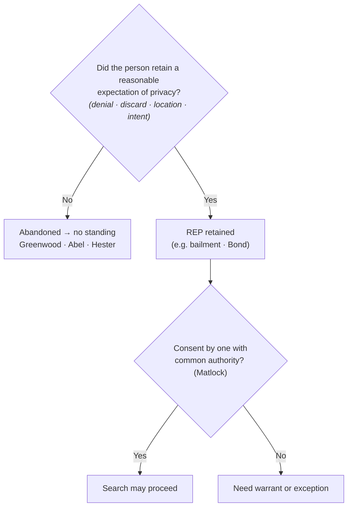

---
aliases:
  - "Abandonment"
title: "Abandonment"
topic: Abandonment
type: doctrine
jurisdiction: Federal (U.S. Const. amend. IV); SCOTUS baseline
status: verified
related: ["[[Fourth Amendment Framework]]", "[[Curtilage]]", "[[Seizure of the Person]]", "[[CREW]]"]
---

## Rule
A person who **voluntarily abandons** property loses any reasonable expectation of privacy in it and therefore has **no standing** to challenge its later search or seizure. Abandonment is judged by the **Fourth Amendment expectation-of-privacy standard**, not by strict property law — the question is whether the person retained an expectation of privacy that society accepts as objectively reasonable. *California v. Greenwood*, 486 U.S. 35, 39–40, 44 (1988). Garbage left for collection **outside the curtilage** carries no such expectation, so a warrantless search of curbside trash is permissible. *Id.* at 37, 40–41. Items thrown away — into a vacated hotel room's wastebasket (*Abel v. United States*, 362 U.S. 217, 241 (1960)) or dropped while fleeing (*Hester v. United States*, 265 U.S. 57, 58 (1924)) — are abandoned, and examining them is no "seizure in the sense of the law." Distinguish a mere **bailment** (temporary transfer of possession), which does **not** abandon a privacy interest. *Bond v. United States*, 529 U.S. 334, 338–39 (2000).

## Key cases
| Case (Bluebook) | Holding in one line | Weight | CourtListener |
|---|---|---|---|
| *Hester v. United States*, 265 U.S. 57 (1924) | A fleeing suspect who dropped containers abandoned any 4A interest in them — examining the contents was "no seizure in the sense of the law" (abandonment by flight). | SCOTUS — binding | [link](https://www.courtlistener.com/opinion/100413/hester-v-united-states/) |
| *Abel v. United States*, 362 U.S. 217 (1960) | Items left in a hotel-room wastebasket after the guest paid up and **vacated** the room were abandoned ("bona vacantia"); warrantless seizure was lawful. | SCOTUS — binding | [link](https://www.courtlistener.com/opinion/106021/abel-v-united-states/) |
| *California v. Greenwood*, 486 U.S. 35 (1988) | **No** reasonable expectation of privacy in garbage bags left for collection at the curb, outside the curtilage; warrantless search/seizure of curbside trash does not violate the 4A. | SCOTUS — binding | [link](https://www.courtlistener.com/opinion/112067/california-v-greenwood/) |
| *Bond v. United States*, 529 U.S. 334 (2000) | A bus passenger **retained** a REP in a carry-on bag; an agent's exploratory physical manipulation ("squeezing") was a search — a bailment is not abandonment. | SCOTUS — binding | [link](https://www.courtlistener.com/opinion/118354/bond-v-united-states/) |

## Related cases across doctrines
These cases are treated in full elsewhere but bear on the abandonment doctrine, framed here for it.

| Case | Relevance to abandonment | Primary treatment | CourtListener |
|---|---|---|---|
| *Rakas v. Illinois*, 439 U.S. 128 (1978) | Fourth Amendment rights are personal: a defendant who has abandoned an item (or never had a privacy interest in the place searched) cannot vicariously assert someone else's REP — abandonment is litigated as the absence of the defendant's own legitimate expectation of privacy, i.e., as standing. | [[Standing to Challenge a Search]] · [[The Exclusionary Rule]] | [opinion](https://www.courtlistener.com/opinion/109953/rakas-v-illinois/) |
| *Rawlings v. Kentucky*, 448 U.S. 98 (1980) | Owning the seized item is not enough; the defendant must have a REP in the place searched — the property/privacy split that drives abandonment (you can hold title to discarded property yet have abandoned any Fourth Amendment interest in it). | [[Standing to Challenge a Search]] | [opinion](https://www.courtlistener.com/opinion/110326/rawlings-v-kentucky/) |
| *Katz v. United States*, 389 U.S. 347, 351 (1967); *id.* at 361 (Harlan, J., concurring) | Supplies the very test abandonment turns on — a search occurs only where a person has an actual expectation of privacy that society accepts as objectively reasonable; abandonment means that expectation was relinquished or never reasonable. | [[Standing to Challenge a Search]] | [opinion](https://www.courtlistener.com/opinion/107564/katz-v-united-states/) |
| *United States v. Salvucci*, 448 U.S. 83 (1980) | Abolished automatic standing for possessory offenses: a defendant charged with possessing the abandoned/discarded item must still prove his own REP in it — so a clean disclaimer or discard leaves him no standing to suppress. | [[Standing to Challenge a Search]] | [opinion](https://www.courtlistener.com/opinion/110325/united-states-v-salvucci/) |
| *Jones v. United States*, 362 U.S. 257 (1960) | **Established** "automatic standing" for possessory offenses (later **overruled by *Salvucci***, 448 U.S. 83 (1980)) — relevant to abandonment because the rule that once shielded possessors who disclaimed property is gone | [[Standing to Challenge a Search]] | [opinion](https://www.courtlistener.com/opinion/106022/jones-v-united-states/) |
| *Byrd v. United States*, 584 U.S. 395 (2018) | Lawful possession and control of effects (a rental car not in one's name) supports a REP — the mirror image of abandonment: mere absence from a paper title or rental agreement is not relinquishment of the privacy interest. | [[Standing to Challenge a Search]] | [opinion](https://www.courtlistener.com/opinion/4497658/byrd-v-united-states/) |
| *Minnesota v. Carter*, 525 U.S. 83 (1998) | A short-term, purely commercial visitor with no prior connection had no REP in the premises — illustrates how transient, non-possessory presence (like discard) leaves no expectation of privacy society will protect. | [[Standing to Challenge a Search]] | [opinion](https://www.courtlistener.com/opinion/118249/minnesota-v-carter/) |
| *United States v. Matlock*, 415 U.S. 164 (1974) | The consent route, *not* abandonment: where a privacy interest was retained (no abandonment), a third party with **common authority** — mutual use plus joint access or control, not mere property interest — may still validly consent to a search. Marks the abandonment/consent line the page keeps distinct. | [[CREW]] · [[Standing to Challenge a Search]] | [opinion](https://www.courtlistener.com/opinion/108967/united-states-v-matlock/) |

## Nuances & limits
- **It's about privacy, not property.** The reach of the Fourth Amendment is not determined by state property law: a person can hold title to discarded property and still have abandoned any *Fourth Amendment* interest in it; conversely, relinquishing physical possession (a bailment) does not by itself abandon a privacy interest. The controlling question is the *Greenwood/Katz* one — did the person retain an expectation of privacy "that society accepts as objectively reasonable." *Greenwood*, 486 U.S. at 39.
- **Why curbside trash fails the test.** "It is common knowledge that plastic garbage bags left on or at the side of a public street are readily accessible to animals, children, scavengers, snoops, and other members of the public." *Greenwood*, 486 U.S. at 40. Note the express limit: the bags were left for collection **"outside the curtilage of a home."** *Id.* at 37. Trash still **within the curtilage** is a different question — see [[Curtilage]].
- **Abandonment is a totality inquiry, not a checklist.** Courts commonly weigh, as a synthesis of the case law, (1) **denial of ownership**, (2) **physical relinquishment or discard**, (3) the **location** where the item was left, and (4) **intent inferred from conduct**. These are factors bearing on the single ultimate question — whether a reasonable expectation of privacy was retained under *Greenwood* — not independent legal tests.
- **Abandonment by flight.** In *Hester*, the defendant and an associate dropped a jug, a jar, and a bottle while fleeing; the Court held "there was no seizure in the sense of the law when the officers examined the contents of each after it had been abandoned." 265 U.S. at 58. Contraband discarded *before* a suspect submits to authority is abandoned and admissible — the seizure-of-the-person timing in *California v. Hodari D.*, 499 U.S. 621, 629 (1991) (suspect "tossed away" crack while running) is the companion rule. See [[Seizure of the Person]].
- **Vacated premises.** *Abel* turned on the guest having "paid his bill and vacated the room"; once he left, "[t]he hotel then had the exclusive right to its possession," so both the abandonment *and* the hotel's consent justified the warrantless search. 362 U.S. at 241. Check-out, not mere absence, is the line.
- **Bailment ≠ abandonment.** Handing a bag to a carrier, hotel, or friend is a temporary transfer of possession that preserves a privacy interest. *Bond* squarely rejected the argument that "by exposing his bag to the public, petitioner lost a reasonable expectation that his bag would not be physically manipulated"; the Court held the agent's manipulation **was** a search — "Physically invasive inspection is simply more intrusive than purely visual inspection." 529 U.S. at 337.
- **Common authority (a third-party route, not abandonment).** Where there is no abandonment, a search may still be valid if someone with **common authority** consents. Common authority "rests rather on mutual use of the property by persons generally having joint access or control for most purposes," and "is, of course, not to be implied from the mere property interest a third party has in the property." *Matlock*, 415 U.S. at 171 & n.7. Full consent doctrine is covered later under C.R.E.W. — see [[CREW]].
- **Abandonment vs. consent — keep them distinct.** *Abandonment* means there is **no** reasonable expectation of privacy at all, so the defendant lacks standing to object. *Consent* presupposes that a privacy interest **exists** but has been voluntarily waived (by the defendant or by one with common authority). Different doctrines, different proof.
- **Burden of proof.** The **defendant** bears the burden of establishing a legitimate expectation of privacy / standing in the item searched (by a preponderance). *Rakas v. Illinois*, 439 U.S. 128, 130-31 n.1 (1978); *Rawlings v. Kentucky*, 448 U.S. 98, 104-05 (1980). On the abandonment question itself, most courts place the burden on the **government** to prove **voluntary abandonment**, typically by a preponderance of the evidence.

## Common pitfalls
- Treating **all** trash as fair game. *Greenwood* authorizes the **curbside** bag left for collection *outside the curtilage*; trash sitting within the curtilage (e.g., a can beside the back door) is not covered by *Greenwood* on its terms.
- Confusing **giving up possession** with **giving up privacy**. A bailment — bag to a bus, luggage to a hotel — is not abandonment. *Bond*.
- Relying on a **third party's property interest** to imply consent. Common authority turns on mutual *use* and joint *access or control*, not on who owns or holds the keys. *Matlock* n.7.
- Litigating abandonment as a property dispute. The court asks about the **expectation of privacy**, not who holds title. *Greenwood*.

## Practical capture
To establish abandonment in the field, frame the question as whether the suspect has **"anything to do with"** the item — not merely whether it is "theirs." A clean disclaimer of any connection to the item supports the inference that no expectation of privacy was retained.

## Visual

## Recent developments & subsequent treatment
Recent federal law extends abandonment to digital devices, with circuits adapting the *Hester*/*Hodari D.* discard-while-fleeing rule to cellphones. The emerging refinement — none of it SCOTUS, all of it persuasive — is that a phone's *physical device* and its *digital data* warrant separate abandonment inquiries, reflecting *Riley* and *Carpenter*'s recognition that phone data is uniquely comprehensive. No SCOTUS case squarely resolves digital abandonment, and there is no recognized circuit split on these points.

- **United States v. Hunt (9th Cir. 2025)** — The abandonment doctrine applies to cellphones, but courts must analyze the intent to abandon the physical device separately from the intent to abandon its data; Hunt, who dropped his iPhone after being shot five times and fled to seek medical help, abandoned neither the phone nor its contents, so he had standing — though his suppression claim failed on the merits because agents later obtained a warrant. Declining amici's invitation to scuttle abandonment for cellphones, the published opinion (Lee, J.) instead adapts the doctrine to the comprehensive nature of phone data by requiring a separate abandonment inquiry for the device and for its data, and holds that an accidental drop under trauma (gunshot) is not voluntary relinquishment of the digital data. Ninth Circuit law — **persuasive, not binding**. [opinion](https://www.courtlistener.com/opinion/10661637/united-states-v-hunt/)
- **United States v. Small (4th Cir. 2019)** — Although "the simple loss of a cell phone does not entail the loss of a reasonable expectation of privacy," Small DELIBERATELY discarded his phone during flight (fleeing on foot, tossing personal items), which the court held was a voluntary abandonment; he therefore lost his REP in both the device and its digital contents, and the warrantless searches were lawful. Denial of suppression AFFIRMED. Anticipates the device-vs-data distinction the Ninth Circuit later adopted in *Hunt*; both circuits treat phones as a special abandonment category because of the volume of personal information stored. Fourth Circuit law — **persuasive, not binding**. [opinion](https://www.courtlistener.com/opinion/4684957/united-states-v-dontae-small/)
- **United States v. Crumble (8th Cir. 2018)** — Defendant who wrecked his car after a shootout, fled on foot leaving the vehicle (key in ignition, window shot out) and a cell phone behind, and initially denied any knowledge of the car, abandoned the vehicle and its contents including the phone; no reasonable expectation of privacy, so no 4A challenge. The court declined to categorically exempt cell phones from the abandonment doctrine, distinguishing *Riley*. Denial of suppression affirmed. Shows the older *Hester*/*Hodari D.* discard-while-fleeing rule still reaches phones where the relinquishment is plainly voluntary — the counterpoint to *Hunt*'s accidental-drop scenario. Eighth Circuit law — **persuasive, not binding**. [opinion](https://www.courtlistener.com/opinion/4456532/united-states-v-prentiss-anthony-crumble/)

## Sources
- *Hester v. United States*, 265 U.S. 57 (1924) — https://www.courtlistener.com/opinion/100413/hester-v-united-states/
- *Abel v. United States*, 362 U.S. 217 (1960) — https://www.courtlistener.com/opinion/106021/abel-v-united-states/
- *United States v. Matlock*, 415 U.S. 164 (1974) — https://www.courtlistener.com/opinion/108967/united-states-v-matlock/
- *California v. Greenwood*, 486 U.S. 35 (1988) — https://www.courtlistener.com/opinion/112067/california-v-greenwood/
- *Bond v. United States*, 529 U.S. 334 (2000) — https://www.courtlistener.com/opinion/118354/bond-v-united-states/
- *California v. Hodari D.*, 499 U.S. 621 (1991) — https://www.courtlistener.com/opinion/112579/california-v-hodari-d/ *(abandonment-by-flight / seizure timing; cross-reference)*
