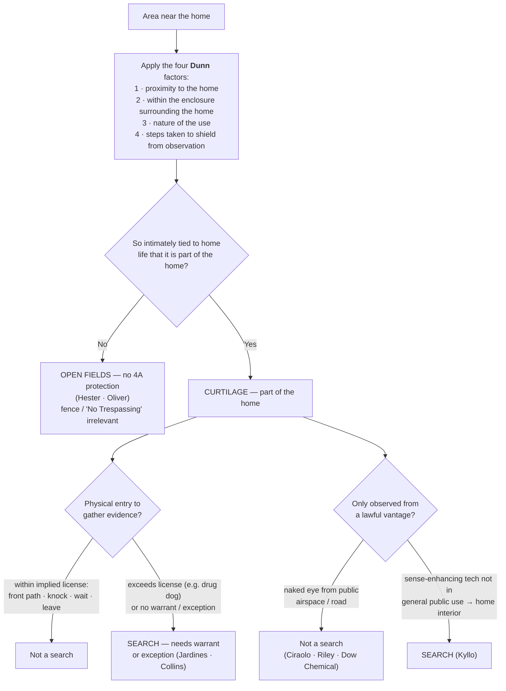

---
aliases:
  - "Curtilage"
title: "Curtilage"
topic: Curtilage
type: doctrine
jurisdiction: Federal (U.S. Const. amend. IV); SCOTUS baseline
status: verified
related: ["[[Two Definitions of Search]]", "[[Fourth Amendment Framework]]", "[[Abandonment]]", "[[Tents]]", "[[Knock and Talk]]", "[[Plain View Doctrine]]"]
---

## The Brief

**Field-decisive question:** *Is the ground the officer is standing on — or wants to enter, or to observe from outside — **curtilage**, the home's protected extension, or is it an **open field**?* Same officer, same patch of marijuana: which side of that one line the ground falls on decides whether a "search" happened at all, and therefore whether the evidence is suppressed.

**The black-letter rule.** *Curtilage* is "the area immediately surrounding and associated with the home" — the land "to which the activity of home life extends." It is treated as **part of the home itself** for Fourth Amendment purposes, so a **physical intrusion onto curtilage to gather evidence is a search**, presumptively unreasonable without a warrant or a recognized exception. *[[Florida v. Jardines#^pin-6|Jardines]]*, 569 U.S. 1, 6–7 (2013). Everything beyond the curtilage is **open fields**, which get **no** Fourth Amendment protection at all — not even when the land is fenced and posted "No Trespassing." *[[Oliver v. United States|Oliver]]*, 466 U.S. 170, 176–81 (1984); *[[Hester v. United States|Hester]]*, 265 U.S. 57, 59 (1924).

**The named test — the four *[[United States v. Dunn|Dunn]]* factors (stated up front).** Whether a given spot is curtilage (protected) or open fields (not) is "resolved with particular reference to four factors":

1. **Proximity** — the proximity of the area claimed to be curtilage to the home;
2. **Enclosure** — whether the area is included within an enclosure surrounding the home;
3. **Nature of the use** — the nature of the uses to which the area is put; and
4. **Steps to shield** — the steps taken by the resident to protect the area from observation by people passing by.

*[[United States v. Dunn#^pin-301|Dunn]]*, 480 U.S. 294, 301 (1987). These four are **not a mechanical checklist** and no single one is dispositive. They are "useful analytical tools only to the degree that... they bear upon the centrally relevant consideration — whether the area in question is so intimately tied to the home itself that it should be placed under the home's 'umbrella' of Fourth Amendment protection." *Id.* In *[[United States v. Dunn|Dunn]]* itself a barn standing ~50 yards beyond the fence around the ranch house, used to manufacture drugs and left largely unshielded, flunked all four factors and was **open fields**, not curtilage.

**Open fields get nothing — and a fence won't save them.** "[O]pen fields do not provide the setting for those intimate activities that the Amendment is intended to shelter from government interference or surveillance." *[[Oliver v. United States|Oliver]]*, 466 U.S. at 179. Crucially, "fences or 'No Trespassing' signs" do **not** convert an open field into protected space; in *[[Oliver v. United States|Oliver]]* officers walked past a locked, posted gate to a secluded marijuana field more than a mile from the house, and there was still no "search." *Id.* at 179–80. The line that decides suppression is curtilage-vs-open-field, not the presence or absence of a fence.

**Two theories of "search," either one sufficient.** *[[Florida v. Jardines|Jardines]]* decides on the **trespass / property** theory revived in *[[United States v. Jones|Jones]]*, 565 U.S. 400 (2012): a physical intrusion into a constitutionally protected area (here, the front porch) **to gather information** is itself a search, and the Court expressly did **not** need to reach the *[[Katz v. United States|Katz]]* reasonable-expectation-of-privacy theory. Either theory can independently establish a search; *[[Katz v. United States|Katz]]* **supplemented**, it did not replace, the property baseline. The practical upshot: the porch, the path, the driveway top, the carport — proximity plus the home-life connection, **not** the absence of a fence — make them curtilage. *[[Collins v. Virginia|Collins]]* treated a partly enclosed driveway top abutting the house as curtilage; *[[Florida v. Jardines|Jardines]]* treated the front porch the same way.

**The implied license defines the *scope*, not just the place.** The reason an officer (or a Girl Scout) may walk up and knock is a narrow implied social license:

> "This implicit license typically permits the visitor to approach the home by the front path, knock promptly, wait briefly to be received, and then (absent invitation to linger longer) leave. … it is generally managed without incident by the Nation's Girl Scouts and trick-or-treaters." — *[[Florida v. Jardines|Jardines]]*, 569 U.S. at 8.

Stay inside that license and the lawful approach is no search; **exceed** it — bring a drug dog onto the porch, peer with a flashlight, or linger to snoop — and the same approach becomes a trespassory search. "[I]ntroducing a trained police dog to explore the area around the home in hopes of discovering incriminating evidence... There is no customary invitation to do that." *[[Florida v. Jardines#^pin-9|Jardines]]*, 569 U.S. at 9. (The license is also bounded by **time and purpose** in the circuits — see Recent developments.)

**Curtilage carries the home's protection against the warrant exceptions — including the automobile exception.** Because curtilage is part of the home, an officer may not use a warrant **exception** for one thing (the car) to justify the separate trespass of entering protected ground. *[[Collins v. Virginia|Collins]]* held "the automobile exception does not permit an officer without a warrant to enter a home or its curtilage in order to search a vehicle therein." 584 U.S. 586, ___ (2018) (slip op., at 14). Lawful authority to search a vehicle is **not** lawful authority to walk into the curtilage to reach it.

**Lawful vantage ≠ lawful entry; naked eye ≠ sense-enhancing technology.** Officers may *observe* curtilage from any place they are lawfully entitled to be — including the air — without it being a search. Warrantless **naked-eye aerial observation** of a fenced backyard from public navigable airspace is not a search: from a fixed-wing plane at 1,000 feet (*[[California v. Ciraolo|Ciraolo]]*, 476 U.S. 207, 213–15 (1986)) and from a helicopter at 400 feet (*[[Florida v. Riley|Riley]]*, 488 U.S. 445, 451–52 (1989) (plurality)), because "[a]ny member of the public" could lawfully have been there and seen the same thing. But *[[California v. Ciraolo|Ciraolo]]*/*[[Florida v. Riley|Riley]]* permit **observation** from a lawful vantage; they do **not** authorize physically **entering** the curtilage (*[[Collins v. Virginia|Collins]]*), and they do **not** reach **sense-enhancing technology** that exposes the home's interior. Using "a device that is not in general public use, to explore details of the home that would previously have been unknowable without physical intrusion" **is** a search — thermal imaging of a home from the street in *[[Kyllo v. United States|Kyllo]]*, 533 U.S. 27, 34, 40 (2001), where "[i]n the home... *all* details are intimate details." *Id.* at 37. *[[Florida v. Riley|Riley]]*'s own "no intimate details... observed" caveat foreshadows that line.

**Do businesses have curtilage? No — but that is not the same as "no privacy."** Curtilage is a *home* concept; commercial property has no analogous domestic curtilage, and the open ground of a business is treated **more like open fields** than like the curtilage of a house. In *[[Dow Chemical Co. v. United States|Dow Chemical]]* the open areas between buildings of a 2,000-acre industrial complex were "more comparable to an open field," so warrantless EPA aerial photography from navigable airspace was not a search. 476 U.S. 227, 235–39 (1986) — the same lawful-vantage logic of *[[California v. Ciraolo|Ciraolo]]*. But **no curtilage ≠ no Fourth Amendment privacy**: commercial premises, especially their **non-public interiors**, retain a reasonable expectation of privacy. *[[See v. City of Seattle|See]]*, 387 U.S. 541, 545–46 (1967) (the businessman, like the homeowner, may insist on a warrant against administrative entry); *G. M. Leasing Corp. v. United States*, 429 U.S. 338, 351–59 (1977) (warrantless entry into a corporation's **private offices** to seize assets was unreasonable, though seizing cars from open/public areas was upheld). Operative rule for officers: the open, publicly exposed grounds of a business are open-fields-like (lawful-vantage observation is generally fine), but **entry into the private, non-public interior still needs a warrant or a recognized exception** — and the knock-and-talk implied license ([[Knock and Talk]]) reaches only the public-facing approach. This commercial-privacy thread runs into the administrative-inspection regime ([[Special Needs and Administrative Searches]]). State courts illustrate the same federal point and are cited for existence only, not as controlling propositions: *State v. Karston*, 588 So. 2d 165 (La. Ct. App. 1991); *State v. Weaver*, 349 S.W.3d 521 (Tex. Crim. App. 2011); *State v. Larson*, 159 Or. App. 34, 977 P.2d 1175 (1999) (each **persuasive — state, illustrative**).

**A tent has no curtilage.** The curtilage concept belongs to a fixed dwelling. A tent's home-like protection covers its **interior**, but not the open ground around it: on a dispersed public-land campsite, "the area outside of the tent... is not curtilage." *[[United States v. Basher|Basher]]*, 629 F.3d 1161, 1169 (9th Cir. 2011) (**Binding in-circuit — 9th Cir.**). See [[Tents]].

**Burden · standard of review · remedy.** The **defendant** (the proponent of suppression) bears the burden of establishing that the area searched was **curtilage** and that he had a legitimate expectation of privacy / standing there, by a preponderance of the evidence. *[[Rakas v. Illinois|Rakas]]*, 439 U.S. 128, 130–31 n.1 (1978); *[[Rawlings v. Kentucky|Rawlings]]*, 448 U.S. 98, 104–05 (1980). On appeal the district court's underlying factual findings on the *[[United States v. Dunn|Dunn]]* factors are reviewed for **[[Common Legal Terms#clear-error|clear error]]**, while the ultimate curtilage / Fourth-Amendment determination is reviewed **[[Common Legal Terms#de-novo|de novo]]**. Cf. *[[Ornelas v. United States|Ornelas]]*, 517 U.S. 690, 699 (1996). The **remedy** for an unjustified warrantless search of curtilage is suppression of the evidence and its fruits under the exclusionary rule ([[The Exclusionary Rule]]).

**Pitfalls to flag for the field.** (1) Treating a **driveway, porch, or attached carport** as fair game — *[[Collins v. Virginia|Collins]]* and *[[Florida v. Jardines|Jardines]]* say proximity plus the home-life connection, not a fence, controls. (2) Reading *[[California v. Ciraolo|Ciraolo]]* as "anything visible is fair game" — it permits **observation** from a lawful vantage, never physical **entry** of the curtilage (*[[Collins v. Virginia|Collins]]*), and never sense-enhancing tech that reveals the interior (*[[Kyllo v. United States|Kyllo]]*). (3) Assuming a **fence or "No Trespassing" sign** turns open fields into protected space — *[[Oliver v. United States|Oliver]]* says it does not. (4) Forgetting the knock-and-talk license is **scope-limited** — overstaying, or bringing investigative tools onto the porch, converts a lawful approach into a search (*[[Florida v. Jardines|Jardines]]*).

## Key cases

| Case | Holding in one line | Weight | Treatment | CourtListener |
|---|---|---|---|---|
| *[[Hester v. United States]]*, 265 U.S. 57 (1924) | **Origin of the open-fields doctrine** — 4A protection of "persons, houses, papers, and effects" does not extend to open fields. | Binding — SCOTUS | good *(2026-06-30)* | [link](https://www.courtlistener.com/opinion/100413/hester-v-united-states/) |
| *[[Oliver v. United States]]*, 466 U.S. 170 (1984) | Reaffirms open fields get no 4A protection — even fenced, posted "No Trespassing," secluded land; only curtilage carries the home's protection. | Binding — SCOTUS | good *(2026-06-30)* | [link](https://www.courtlistener.com/opinion/111146/oliver-v-united-states/) |
| *[[United States v. Dunn]]*, 480 U.S. 294 (1987) | **Sets the four-factor curtilage test** (proximity · enclosure · use · steps to shield); barn 50 yds beyond the fence held not curtilage. | Binding — SCOTUS | good *(2026-06-30)* | [link](https://www.courtlistener.com/opinion/111833/united-states-v-dunn/) |
| *[[Florida v. Jardines]]*, 569 U.S. 1 (2013) | Front porch is curtilage; bringing a drug dog there exceeds the implied license to approach and knock — a trespassory **search** (property theory). | Binding — SCOTUS | good *(2026-06-30)* | [link](https://www.courtlistener.com/opinion/856347/florida-v-jardines/) |
| *[[Collins v. Virginia]]*, 584 U.S. 586 (2018) | The **automobile exception does not reach into curtilage** — no warrantless entry of a home or its curtilage to search a vehicle parked there. | Binding — SCOTUS | good *(2026-06-30)* | [link](https://www.courtlistener.com/opinion/4501697/collins-v-virginia/) |
| *[[California v. Ciraolo]]*, 476 U.S. 207 (1986) | Warrantless **naked-eye aerial observation** of a fenced curtilage from navigable airspace (1,000 ft) is **not** a search. | Binding — SCOTUS | good *(2026-06-30)* | [link](https://www.courtlistener.com/opinion/111666/california-v-ciraolo/) |
| *[[Florida v. Riley]]*, 488 U.S. 445 (1989) | Extends *[[California v. Ciraolo|Ciraolo]]* to a **helicopter at 400 ft**: naked-eye observation of curtilage from lawful public airspace is not a search (plurality; "no intimate details" caveat). | Binding — SCOTUS | good *(2026-06-30)* | [link](https://www.courtlistener.com/opinion/112175/florida-v-riley/) |

## Related cases across doctrines

These are treated in full elsewhere but bear on the curtilage / open-fields line, framed for it here.

| Case | Relevance to curtilage (framed here) | Weight · Treatment | Treated in full · CourtListener |
|---|---|---|---|
| *[[Kyllo v. United States]]*, 533 U.S. 27 (2001) | The **lawful-vantage** rule does not reach **sense-enhancing technology**: using a device not in general public use to reveal the home's interior is a search — "all details are intimate details" in the home. Bounds *[[California v. Ciraolo|Ciraolo]]*/*[[Florida v. Riley|Riley]]*. | Binding — SCOTUS · good | [[Two Definitions of Search]] · [CL](https://www.courtlistener.com/opinion/118443/kyllo-v-united-states/) |
| *[[Dow Chemical Co. v. United States]]*, 476 U.S. 227 (1986) | Open areas of a 2,000-acre industrial complex are **more like open fields than curtilage**; warrantless aerial photography from navigable airspace was not a search — yet commercial premises still retain some 4A privacy. | Binding — SCOTUS · good | [[Two Definitions of Search]] · [CL](https://www.courtlistener.com/opinion/111667/dow-chemical-co-v-united-states-ex-rel-administrator/) |
| *[[See v. City of Seattle]]*, 387 U.S. 541 (1967) | Commercial premises have **4A protection against warrantless administrative entry** — "no curtilage" does not mean "no privacy" for a business interior. | Binding — SCOTUS · good | [[Special Needs and Administrative Searches]] · [CL](https://www.courtlistener.com/opinion/107474/see-v-city-of-seattle/) |
| *[[Kentucky v. King]]*, 563 U.S. 452 (2011) | Officers may approach and knock where any private citizen could — the **implied-license entry** onto curtilage (porch/path) is lawful, and police don't "create" an exigency merely by knocking within that license. | Binding — SCOTUS · good | [[Knock and Talk]] · [[Exigent Circumstances and Hot Pursuit]] · [CL](https://www.courtlistener.com/opinion/216733/kentucky-v-king/) |
| *[[French v. Merrill]]*, 15 F.4th 116 (1st Cir. 2021) | The knock-and-talk license onto curtilage is fixed by the implied social license to approach the front door; officers who exceeded it (a nighttime intrusion) committed a *[[Florida v. Jardines|Jardines]]* trespassory search of the curtilage. | Binding in-circuit — 1st Cir. · good | [[Knock and Talk]] · [CL](https://www.courtlistener.com/opinion/5273192/french-v-merrill/) |
| *[[United States v. Santana]]*, 427 U.S. 38 (1976) | A suspect in her own open doorway/threshold is in a "public" place — marking the line where the home's curtilage protection gives way; she cannot retreat indoors to defeat a public-place arrest. *(Hot-pursuit dimension limited by [[Lange v. California]]; cited here only for the threshold/public-place line.)* | Binding — SCOTUS · good | [[Arrest in the Home]] · [[Exigent Circumstances and Hot Pursuit]] · [CL](https://www.courtlistener.com/opinion/109504/united-states-v-santana/) |
| *[[United States v. Basher]]*, 629 F.3d 1161 (9th Cir. 2011) | A tent has **no curtilage** — its home-like protection covers the interior, not the open campsite ground around it. | Binding in-circuit — 9th Cir. · good | [[Tents]] · [CL](https://www.courtlistener.com/opinion/183144/united-states-v-basher/) |

## Recent developments

Role-based, circuit/state only (no SCOTUS). Two active lines test the curtilage and lawful-vantage rules.

**Pole-camera surveillance of the home's exterior/curtilage (circuit split on the *[[Carpenter v. United States|Carpenter]]* mosaic theory).** The circuits divide over whether *[[Carpenter v. United States|Carpenter]]*'s mosaic/aggregation theory turns months of fixed, warrantless pole-camera watching of a home's exterior into a Fourth Amendment "search," or whether the *[[California v. Ciraolo|Ciraolo]]*/*[[Kyllo v. United States|Kyllo]]* "publicly visible / lawful vantage" rule still controls. The Supreme Court has not resolved it (cert. denied in *[[United States v. Tuggle|Tuggle]]* and *Moore-Bush*). ⚖ **Circuit split.**

- ***[[United States v. Tuggle|Tuggle]]* (7th Cir. 2021)** — *first-impression / "no search" side.* ~18 months of warrantless pole-camera surveillance of a home's exterior/curtilage was **not** a search because the cameras saw only what was publicly visible; the court declined the mosaic theory under current doctrine while flagging the looming *[[Carpenter v. United States|Carpenter]]* aggregation problem. "[T]he extensive pole camera surveillance in this case did not constitute a search under the current understanding of the Fourth Amendment," 4 F.4th 505, 512. **Binding in-circuit — 7th Cir.** · good. [opinion](https://www.courtlistener.com/opinion/4899735/united-states-v-travis-tuggle/)
- **United States v. Moore-Bush (1st Cir. 2022) (en banc)** — *illustrates the split.* The en banc First Circuit divided 3–3 on whether eight months of warrantless pole-camera surveillance of a home's curtilage is a search; the tie affirmed suppression below, the panel splintering over whether *[[Carpenter v. United States|Carpenter]]*'s mosaic theory expands the REP definition of "search" to long-term targeted surveillance (resolved on *[[United States v. Leon|Leon]]* good faith). **Binding in-circuit — 1st Cir.** · good. *(No standalone case page — named in prose with circuit.)* [opinion](https://www.courtlistener.com/opinion/6476395/united-states-v-moore-bush/)
- **United States v. May-Shaw (6th Cir. 2020)** — *"no search" side.* Upheld 23-day warrantless pole-camera surveillance of a carport/parking area near an apartment: no reasonable expectation of privacy once one leaves the protected curtilage for an unprotected area visible to the public. **Binding in-circuit — 6th Cir.** · good. *(No standalone case page — named in prose with circuit.)* [opinion](https://www.courtlistener.com/opinion/4743325/united-states-v-christopher-may-shaw/)

**Applying *[[Florida v. Jardines|Jardines]]* to the implied license (time + purpose).** ***[[United States v. Lundin|Lundin]]* (9th Cir. 2016)** — *narrows the license.* Applied *[[Florida v. Jardines|Jardines]]* to hold a **4 a.m.** knock-and-talk exceeded the implied license to enter the curtilage — both because of the unusual hour and because the officers' purpose was to **arrest**, not to ask questions — so the exception did not apply and the resulting evidence was suppressed. "[T]he officers knocked on Lundin's door around 4:00 a.m. without evidence that Lundin generally accepted visitors at that hour, and without a reason for knocking that a resident would ordinarily accept as sufficiently weighty to justify the disturbance," 817 F.3d 1151, 1159. **Binding in-circuit — 9th Cir.** · good. *(The subjective-purpose approach divides the circuits — see [[Knock and Talk]].)* [opinion](https://www.courtlistener.com/opinion/3187682/united-states-v-eric-lundin/)

## Visual

## Sources

- *Hester v. United States*, 265 U.S. 57 (1924) — https://www.courtlistener.com/opinion/100413/hester-v-united-states/
- *Oliver v. United States*, 466 U.S. 170 (1984) — https://www.courtlistener.com/opinion/111146/oliver-v-united-states/
- *United States v. Dunn*, 480 U.S. 294 (1987) — https://www.courtlistener.com/opinion/111833/united-states-v-dunn/
- *Florida v. Jardines*, 569 U.S. 1 (2013) — https://www.courtlistener.com/opinion/856347/florida-v-jardines/
- *Collins v. Virginia*, 584 U.S. 586 (2018) — https://www.courtlistener.com/opinion/4501697/collins-v-virginia/
- *California v. Ciraolo*, 476 U.S. 207 (1986) — https://www.courtlistener.com/opinion/111666/california-v-ciraolo/
- *Florida v. Riley*, 488 U.S. 445 (1989) — https://www.courtlistener.com/opinion/112175/florida-v-riley/
- *Kyllo v. United States*, 533 U.S. 27 (2001) — https://www.courtlistener.com/opinion/118443/kyllo-v-united-states/
- *United States v. Jones*, 565 U.S. 400 (2012) — https://www.courtlistener.com/opinion/7350871/united-states-v-jones/ *(trespass-theory origin; cross-reference)*
- *Dow Chemical Co. v. United States*, 476 U.S. 227 (1986) — https://www.courtlistener.com/opinion/111667/dow-chemical-co-v-united-states-ex-rel-administrator/
- *See v. City of Seattle*, 387 U.S. 541 (1967) — https://www.courtlistener.com/opinion/107474/see-v-city-of-seattle/
- *G. M. Leasing Corp. v. United States*, 429 U.S. 338 (1977) — https://www.courtlistener.com/opinion/109579/g-m-leasing-corp-v-united-states/ *(no standalone case page; brief-mention)*
- *Kentucky v. King*, 563 U.S. 452 (2011) — https://www.courtlistener.com/opinion/216733/kentucky-v-king/
- *French v. Merrill*, 15 F.4th 116 (1st Cir. 2021) — https://www.courtlistener.com/opinion/5273192/french-v-merrill/
- *United States v. Santana*, 427 U.S. 38 (1976) — https://www.courtlistener.com/opinion/109504/united-states-v-santana/
- *United States v. Basher*, 629 F.3d 1161 (9th Cir. 2011) — https://www.courtlistener.com/opinion/183144/united-states-v-basher/
- *United States v. Tuggle*, 4 F.4th 505 (7th Cir. 2021) — https://www.courtlistener.com/opinion/4899735/united-states-v-travis-tuggle/
- *United States v. Moore-Bush*, 36 F.4th 320 (1st Cir. 2022) (en banc) — https://www.courtlistener.com/opinion/6476395/united-states-v-moore-bush/ *(no standalone case page)*
- *United States v. May-Shaw*, 955 F.3d 563 (6th Cir. 2020) — https://www.courtlistener.com/opinion/4743325/united-states-v-christopher-may-shaw/ *(no standalone case page)*
- *United States v. Lundin*, 817 F.3d 1151 (9th Cir. 2016) — https://www.courtlistener.com/opinion/3187682/united-states-v-eric-lundin/
- *State v. Karston*, 588 So. 2d 165 (La. Ct. App. 1991) *(persuasive — state, illustrative)* — https://www.courtlistener.com/opinion/1767998/state-v-karston/
- *State v. Weaver*, 349 S.W.3d 521 (Tex. Crim. App. 2011) *(persuasive — state, illustrative)* — https://www.courtlistener.com/opinion/2546485/state-v-weaver/
- *State v. Larson*, 159 Or. App. 34, 977 P.2d 1175 (1999) *(persuasive — state, illustrative)* — https://www.courtlistener.com/opinion/1187724/state-v-larson/
</content>
</invoke>
