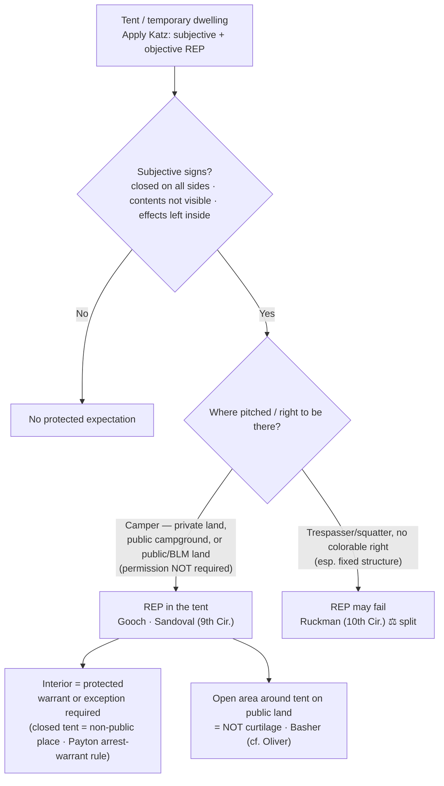

# Tents

## The Brief

**Field-decisive question:** *Does this occupant have a reasonable expectation of privacy in the tent or temporary dwelling — and where is it pitched (private land · public campground · open public land), as opposed to an open field or structure he has no right to occupy?*

A tent used as a temporary dwelling is, for Fourth Amendment purposes, analyzed far more like a **home** than like a car: its occupant can hold a **reasonable expectation of privacy** in the tent's interior, so a warrantless search of the inside is presumptively unreasonable. There is **no Supreme Court decision on tents directly**; the controlling test comes from [[Katz v. United States]] and the doctrine has been built in the **federal courts of appeals** — most heavily the **Ninth Circuit**.

**The named test (state it up front — the *Katz* two-part inquiry):** whether a reasonable expectation of privacy exists turns on (1) a **subjective** expectation of privacy the occupant actually exhibited, and (2) one that **society is prepared to recognize as reasonable** (objective). [[Katz v. United States#^pin-361]] (Harlan, J., [[Common Legal Terms#concurring-opinion|concurring]]). The Ninth Circuit applies exactly that two-part requirement to tents: occupancy requires "both a subjective and an objectively reasonable expectation of privacy in the tent." [[United States v. Gooch#^pin-677]].

**Apply it through three factors:**
- **Use as a dwelling, not a vehicle.** A tent occupied as a dwelling is treated like a house, not a car — the automobile exception's reduced-privacy logic does **not** transfer. *Gooch* squarely rejected the government's motor-home analogy: "a tent is more like a house than a car," and "the warrantless search of his tent violated the Fourth Amendment." [[United States v. Gooch#^pin-677b]]. *Basher* puts it the same way: a tent "is comparable to a house, apartment, or hotel room because it is a private area where people sleep and change clothing." [[United States v. Basher#^pin-1169]].
- **Closure / what the occupant exhibited (the subjective prong).** Articulate the outward signs the occupant treated the tent as private: it was **closed on all sides**, its contents were **not visible from outside**, and the occupant left **personal effects inside**. [[United States v. Sandoval#^pin-661]]. Conversely, a flap left wide open or contents in plain view from a lawful vantage cut against a subjective expectation.
- **Location / right to be there (the objective prong).** The expectation can be objectively reasonable on **private property**, in a **public campground**, and even on **undeveloped public (BLM) land** — and it does **not** turn on whether the camper had permission to be there. [[United States v. Gooch#^pin-677a]]; [[United States v. Sandoval#^pin-661]]. The Ninth Circuit's lineage runs from *LaDuke v. Nelson*, 762 F.2d 1318 (9th Cir. 1985) (tent on private property), through [[United States v. Gooch]] (public campground), to [[United States v. Sandoval]] (BLM land). As *Sandoval* reasoned, the rule cannot "turn on whether he had permission to camp," because then "a camper who overstayed his permit in a public campground would lose his Fourth Amendment rights, while his neighbor, whose permit had not expired, would retain those rights." [[United States v. Sandoval#^pin-661]]. **Illegality of the camping does not defeat the expectation** — the court "rejected the argument that a person lacks a subjective expectation of privacy simply because he is engaged in illegal activity."

**Burden, standard of review, remedy.** The occupant claiming the protection bears the burden of establishing his **own** legitimate expectation of privacy (a standing requirement — see [[Standing to Challenge a Search]]). On review, the **subjective-expectation** finding is a factual one reviewed for **[[Common Legal Terms#clear-error|clear error]]** (in *Gooch* the district court's finding was "not clearly erroneous"), while the ultimate **reasonable-expectation / reasonableness** question is reviewed **[[Common Legal Terms#de-novo|de novo]]**. The remedy for an unlawful warrantless tent search is **suppression** of the resulting evidence (see [[The Exclusionary Rule]]).

**Limits, nuances, and pitfalls (woven in):**
- **The protection is the tent's *interior*, not a "curtilage" around it.** A tent has no curtilage the way a house does. On a **dispersed, undeveloped public-land campsite** (the camp was visible from a developed campground), "there was no expectation of privacy in the campsite, and that the area outside of the tent in these circumstances is not curtilage." [[United States v. Basher#^pin-1169a]]. This tracks the open-fields/curtilage line of [[Oliver v. United States#^pin-180]]: only the curtilage — "the land immediately surrounding and associated with the home" — carries the home's protection; exposed open land does not. **Pitfall:** treating the whole campsite as protected — items left outside the tent and plain-view observations from a lawful vantage are a different question from a search of the interior.
- **The trespasser / squatter limit, and the live ⚖ split.** Where the occupant has **no colorable right to occupy** — especially a permanent or semi-permanent structure — courts have found no reasonable expectation of privacy. *United States v. Ruckman*, 806 F.2d 1471 (10th Cir. 1986), treated a man living in a **cave** on federal land as a trespasser with no legal right to occupy, so no expectation arose. The circuits are **not aligned**: *Ruckman* (10th Cir.) tied the expectation to a legal right to occupy, while [[United States v. Sandoval]] (9th Cir.) held a public-land camper's expectation does **not** turn on permission. **Pitfall:** overreading *Ruckman* — it turned on a long-term cave occupant with no right to be there; it does not license treating every unpermitted overnight camper as a rightless trespasser.
- **A closed tent is a "non-public" place for arrest-warrant purposes.** Working through then-unsettled ground, *Gooch* held that a **closed** tent is a "non-public" place, so officers needed an **arrest warrant** — or **exigent circumstances** — to enter and arrest the occupant inside. The [[Payton v. New York]] firm line "at the entrance to the house" ([[Payton v. New York#^pin-590]]) can therefore reach a tent, not just a house. **Pitfall:** assuming you can reach into a closed tent to arrest without a warrant or true exigency.
- **Guests sleep over in tents too — but presence alone is not enough.** A person staying **overnight** in another's tent can claim the same expectation an overnight houseguest has under [[Minnesota v. Olson#^pin-98]] ("a houseguest has a legitimate expectation of privacy in his host's home"); privacy turns on the **expectation**, not on holding title to the tent. That standing is **bounded** by [[Minnesota v. Carter#^pin-90]]: one "merely present with the consent of the householder" — a short, purely commercial visit with no prior connection — may **not** claim the protection.

These appellate decisions are **binding in-circuit (9th Cir.)** within the Ninth Circuit and **persuasive (outside circuit)** elsewhere; treat them as the best-developed federal guidance, not a settled nationwide rule.

## Key cases

| Case (Bluebook) | Holding in one line | Authority weight | Treatment | CourtListener | Case page |
|---|---|---|---|---|---|
| *Katz v. United States*, 389 U.S. 347 (1967) | Supplies the controlling test: a search invades a **subjective** expectation of privacy that society recognizes as **objectively reasonable** — "the Fourth Amendment protects people, not places." | Binding — SCOTUS | good *(2026-06-30)* | [link](https://www.courtlistener.com/opinion/107564/katz-v-united-states/) | [[Katz v. United States]] |
| *United States v. Gooch*, 6 F.3d 673 (9th Cir. 1993) | An occupant has a reasonable expectation of privacy in a tent in a **public campground**; "a tent is more like a house than a car," so its warrantless search violated the Fourth Amendment; a **closed** tent is a "non-public" place requiring an arrest warrant to enter. | Binding in-circuit — 9th Cir. | good *(2026-06-30)* | [link](https://www.courtlistener.com/opinion/654273/united-states-v-kenneth-d-gooch/) | [[United States v. Gooch]] |
| *United States v. Sandoval*, 200 F.3d 659 (9th Cir. 2000) | Reasonable expectation of privacy in a closed tent on **public (BLM) land** does **not** turn on whether the camper had permission to be there; denial of suppression reversed. | Binding in-circuit — 9th Cir. | good *(2026-06-30)* | [link](https://www.courtlistener.com/opinion/767260/united-states-v-rodrigo-sandoval/) | [[United States v. Sandoval]] |
| *United States v. Basher*, 629 F.3d 1161 (9th Cir. 2011) | Reaffirms privacy **inside** a tent ("comparable to a house, apartment, or hotel room"), but the **area outside** the tent at a dispersed public-land campsite is **not curtilage** — no expectation of privacy there. | Binding in-circuit — 9th Cir. | good *(2026-06-30)* | [link](https://www.courtlistener.com/opinion/183144/united-states-v-basher/) | [[United States v. Basher]] |
| *United States v. Ruckman*, 806 F.2d 1471 (10th Cir. 1986) | **Contrary view (⚖ split):** a man living in a **cave** on federal land was a trespasser with no legal right to occupy, so no reasonable expectation of privacy arose — the structure was treated as open land, not a "house." | Binding in-circuit — 10th Cir. | good *(2026-06-30)* | [link](https://www.courtlistener.com/opinion/480405/united-states-v-frank-william-ruckman/) | — (no page) |

## Related cases across doctrines

These are treated in full elsewhere but frame the tent question.

| Case (Bluebook) | Relevance to tents (primary home) | Authority weight | Treatment | CourtListener | Case page |
|---|---|---|---|---|---|
| *Minnesota v. Olson*, 495 U.S. 91 (1990) | An **overnight guest** has a reasonable expectation of privacy in the place he is staying — the logic that lets a guest sleeping over in another's tent challenge a warrantless entry, just as in a host's home. *Home:* [[Standing to Challenge a Search]]. | Binding — SCOTUS | good *(2026-06-30)* | [opinion](https://www.courtlistener.com/opinion/112416/minnesota-v-olson/) | [[Minnesota v. Olson]] |
| *Minnesota v. Carter*, 525 U.S. 83 (1998) | The **boundary** of the guest rule: one "merely present with the consent of the householder" for a short, purely commercial visit has **no** expectation of privacy — so mere presence in another's tent is not automatically protected. *Home:* [[Standing to Challenge a Search]]. | Binding — SCOTUS | good *(2026-06-30)* | [opinion](https://www.courtlistener.com/opinion/118249/minnesota-v-carter/) | [[Minnesota v. Carter]] |
| *Oliver v. United States*, 466 U.S. 170 (1984) | The **open-fields / curtilage boundary**: only the curtilage carries the home's protection; exposed open land does not — the doctrinal basis for *Basher*'s holding that the ground **outside** a public-land tent is not protected. *Home:* [[Curtilage]]. | Binding — SCOTUS | good *(2026-06-30)* | [opinion](https://www.courtlistener.com/opinion/111146/oliver-v-united-states/) | [[Oliver v. United States]] |
| *Payton v. New York*, 445 U.S. 573 (1980) | A warrant is generally required to cross the "firm line at the entrance to the house" to make an arrest. Applying that rule, *Gooch* held a **closed tent** is a "non-public" place, so police needed an **arrest warrant** (absent exigency) to enter and arrest the occupant inside. *Home:* [[Arrest in the Home]]. | Binding — SCOTUS | good *(2026-06-30)* | [opinion](https://www.courtlistener.com/opinion/110235/payton-v-new-york/) | [[Payton v. New York]] |

## Recent developments

*Role: circuit split / unresolved frontier (no SCOTUS).* The Supreme Court has **never** addressed tents directly, so the doctrine remains **circuit-built** — developed most fully in the **Ninth Circuit** (*LaDuke* → *Gooch* → *Sandoval* → *Basher*). The live frontier is the ⚖ **split** on whether a **legal right to occupy** matters to the expectation of privacy: the **Ninth Circuit** (*Sandoval*) holds it does **not** for a closed tent on public land, while the **Tenth Circuit** (*Ruckman*) tied the expectation to a right to occupy and found none for a long-term cave dweller on federal land. The related open question — how far the home-like protection extends beyond the tent's interior on undeveloped public land — is answered in-circuit by *Basher* (no curtilage around a dispersed campsite) but is otherwise unsettled nationwide. No post-decision SCOTUS authority has resolved the split.

## Visual

## Sources
- *Katz v. United States*, 389 U.S. 347 (1967) — https://www.courtlistener.com/opinion/107564/katz-v-united-states/ — pinpoints: 351, 361 (Harlan, J., concurring).
- *United States v. Gooch*, 6 F.3d 673 (9th Cir. 1993) — https://www.courtlistener.com/opinion/654273/united-states-v-kenneth-d-gooch/ — pinpoints: 677, 678.
- *United States v. Sandoval*, 200 F.3d 659 (9th Cir. 2000) — https://www.courtlistener.com/opinion/767260/united-states-v-rodrigo-sandoval/ — pinpoint: 661.
- *United States v. Basher*, 629 F.3d 1161 (9th Cir. 2011) — https://www.courtlistener.com/opinion/183144/united-states-v-basher/ — pinpoint: 1169.
- *United States v. Ruckman*, 806 F.2d 1471 (10th Cir. 1986) — https://www.courtlistener.com/opinion/480405/united-states-v-frank-william-ruckman/ *(no case page — page-less contrast/split authority)*.
- *Minnesota v. Olson*, 495 U.S. 91 (1990) — https://www.courtlistener.com/opinion/112416/minnesota-v-olson/ — pinpoint: 98.
- *Minnesota v. Carter*, 525 U.S. 83 (1998) — https://www.courtlistener.com/opinion/118249/minnesota-v-carter/ — pinpoint: 90.
- *Oliver v. United States*, 466 U.S. 170 (1984) — https://www.courtlistener.com/opinion/111146/oliver-v-united-states/ — pinpoints: 179, 180.
- *Payton v. New York*, 445 U.S. 573 (1980) — https://www.courtlistener.com/opinion/110235/payton-v-new-york/ — pinpoints: 576, 590.
- *LaDuke v. Nelson*, 762 F.2d 1318 (9th Cir. 1985) — https://www.courtlistener.com/opinion/452994/charles-laduke-v-alan-c-nelson-etc/ *(no case page — Ninth Circuit origin of the tent rule, lineage of Gooch/Sandoval)*.
