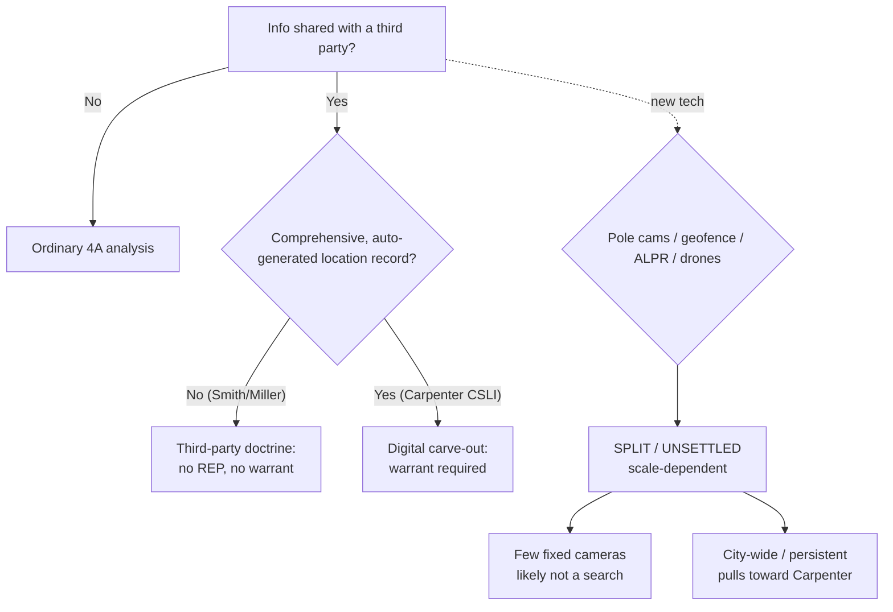

---
aliases:
  - "The Third-Party Doctrine and Digital Surveillance"
topic: Third-party doctrine & digital surveillance
type: doctrine
jurisdiction: Federal (U.S. Const. amend. IV); SCOTUS baseline
status: verified
related: ["[[Two Definitions of Search]]", "[[Fourth Amendment Recalibration]]", "[[Search Incident to Arrest]]", "[[Plain View Doctrine]]", "[[Curtilage]]"]
---

# The Third-Party Doctrine and Digital Surveillance

## The Brief

**Field-decisive question:** *Did the suspect voluntarily convey this information to a third party — and if what I want is long-term, comprehensive digital location data, does* Carpenter *require a warrant anyway?*

**The black-letter rule.** Under the federal **third-party doctrine**, a person has **no reasonable expectation of privacy in information voluntarily turned over to a third party**, so the government may obtain it without a warrant. *[[Smith v. Maryland#Rule|Smith v. Maryland]]* states it directly: "a person has no legitimate expectation of privacy in information he voluntarily turns over to third parties." The twin pillars are *[[Smith v. Maryland]]* (the numbers a caller dials, captured by a pen register) and *[[United States v. Miller]]* (bank records the customer exposed to the bank). The animating theory is **assumption of risk**: by handing information to a phone company, a bank, or any intermediary, you assume the risk that the recipient will reveal it to the government.

**The *Carpenter* digital limit (the modern dividing line).** *[[Carpenter v. United States#Rule|Carpenter v. United States]]* (2018) held that acquiring **historical cell-site location information (CSLI)** is a Fourth Amendment **search** that generally requires a **warrant** — the third-party doctrine does **not** mechanically extend to the comprehensive, automatically generated record of a person's physical movements. As the Court put it, an individual "maintains a legitimate expectation of privacy in the record of his physical movements as captured through CSLI." Two points keep this disciplined. First, *Carpenter* did **not** overrule *Smith* or *Miller* — it carved a deliberately **narrow** exception for a "qualitatively different category" of digital data and left conventional surveillance and ordinary business records untouched. Second, the doctrine now runs on **two tracks**: ordinary records voluntarily conveyed to a third party (no warrant), versus comprehensive, auto-generated digital records of movement (warrant). The field call is deciding which track the data sits on.

**How to apply it.** Ask, in order: (1) Was the information **voluntarily conveyed** to a third party? If yes, the default is no REP and no warrant (*Smith*/*Miller*). (2) Is it instead a **comprehensive, automatically generated digital record** of the suspect's movements over time — the kind of "all-encompassing record" that provides "an intimate window into a person's life"? If yes, *Carpenter* treats acquisition as a search requiring a warrant. (3) For tracking devices specifically, mind the **home/public line**: tracking **public movements** is not a search (*[[United States v. Knotts#Rule|United States v. Knotts]]* — "no reasonable expectation of privacy in his movements ... over public thoroughfares"), but using the device to reveal a fact about the **interior of a residence** is (*[[United States v. Karo#Rule|United States v. Karo]]* — the monitor "does reveal a critical fact about the interior of the premises").

**Burden, standard of review, remedy.** A defendant moving to suppress bears the **burden** of establishing a Fourth Amendment search — a legitimate expectation of privacy in the thing acquired; if the acquisition is not a search (third-party doctrine), there is nothing to suppress. On appeal, the legal conclusion (was there a search?) is reviewed **[[Common Legal Terms#de-novo|de novo]]** and the historical facts for **[[Common Legal Terms#clear-error|clear error]]**. The **remedy** when *Carpenter*'s line is crossed without a warrant is the ordinary one — **suppression** ([[The Exclusionary Rule]]) — subject to good-faith and the other exclusionary-rule exceptions, which is the escape hatch lower courts have leaned on in the geofence cases (see Recent developments).

**Limits, nuances, and pitfalls (woven in).** *Carpenter* is **narrow, not a repeal** — do not over-read it; *Smith* and *Miller* remain good law and govern conventional records. The widely taught "***Carpenter* prongs**" — (1) a new category of digital-age information, (2) generated without meaningful voluntary choice, (3) revealing "the privacies of life" — are **instructor framing, not the Court's holding**; the Court never enumerated a three-part test, and only "the privacies of life" is its own phrase. Label the gloss as a gloss, not a holding. **Scale / the mosaic is the dividing line for new technology**: a few fixed cameras capturing public movement tend to stay on the *Smith*/*Knotts* side (not a search), while comprehensive, city-wide, persistent tracking pulls toward *Carpenter*. **Sense-enhancing technology draws its own line** — *[[Kyllo v. United States]]* holds that using technology "not in general public use" to expose the interior of a home is a search, with *[[Dow Chemical Co. v. United States]]* the contrast (a commonly available aerial camera over commercial premises is not). And remember the **electronic-surveillance particularity baseline**: *[[Berger v. New York]]* struck down a permissive eavesdropping statute for lack of particularity and safeguards, setting the constitutional floor for electronic-surveillance warrants. Two field watch-outs: **do not state pole-camera, geofence, ALPR, or drone law as a settled federal rule** — each is split or unsettled and jurisdiction-dependent (Recent developments) — and **do not treat the manned-aircraft cases (*[[California v. Ciraolo]]*, *[[Florida v. Riley]]*) as drone law**; they predate drones and *Carpenter*, and low, persistent, zoom-capable drones may not fit them cleanly.

## Key cases

| Case (Bluebook) | Holding (one line) | Weight | Treatment | CourtListener | Case page |
|---|---|---|---|---|---|
| *Smith v. Maryland*, 442 U.S. 735 (1979) | No REP in the numbers a caller dials, voluntarily conveyed to the phone company; a pen register is not a search — the origin of the third-party doctrine. | Binding — SCOTUS | Good (2026-06-30) | [link](https://www.courtlistener.com/opinion/110118/smith-v-maryland/) | [[Smith v. Maryland]] |
| *United States v. Miller*, 425 U.S. 435 (1976) | No legitimate expectation of privacy in bank records exposed to the bank; the depositor assumes the risk of disclosure to the government. | Binding — SCOTUS | Good (2026-06-30) | [link](https://www.courtlistener.com/opinion/109433/united-states-v-miller/) | [[United States v. Miller]] |
| *Carpenter v. United States*, 585 U.S. 296 (2018) | Acquiring historical CSLI is a search requiring a warrant; the third-party doctrine does not reach comprehensive, auto-generated location records. **Narrow.** | Binding — SCOTUS | Good (2026-06-30) | [link](https://www.courtlistener.com/opinion/4510032/carpenter-v-united-states/) | [[Carpenter v. United States]] |
| *United States v. Knotts*, 460 U.S. 276 (1983) | Beeper-aided tracking of a vehicle over public roads is not a search; no REP in movements over public thoroughfares. | Binding — SCOTUS | Good (2026-06-30) | [link](https://www.courtlistener.com/opinion/110882/united-states-v-knotts/) | [[United States v. Knotts]] |
| *United States v. Karo*, 468 U.S. 705 (1984) | Monitoring a beeper **inside a private residence** is a search — it reveals a critical fact about the interior the government could not otherwise obtain. | Binding — SCOTUS | Good (2026-06-30) | [link](https://www.courtlistener.com/opinion/111257/united-states-v-karo/) | [[United States v. Karo]] |
| *Berger v. New York*, 388 U.S. 41 (1967) | A permissive eavesdropping statute is unconstitutional for lack of particularity and safeguards — the baseline standards for electronic-surveillance warrants. | Binding — SCOTUS | Good (2026-06-30) | [link](https://www.courtlistener.com/opinion/107483/berger-v-new-york/) | [[Berger v. New York]] |

## Related cases across doctrines

| Case (Bluebook) | Why it matters here | Weight | Treatment | CourtListener | Case page |
|---|---|---|---|---|---|
| *Kyllo v. United States*, 533 U.S. 27 (2001) | The sense-enhancing-technology line: tech "not in general public use" used to expose a home's interior is a search — the counterweight to surveillance that only captures public exposure. | Binding — SCOTUS | Good (2026-06-30) | [link](https://www.courtlistener.com/opinion/118443/kyllo-v-united-states/) | [[Kyllo v. United States]] |
| *Florida v. Riley*, 488 U.S. 445 (1989) (plurality) | Naked-eye helicopter observation into curtilage at 400 ft is not a search — the closest manned-aircraft analogue for low-altitude drones (but predates drones/*Carpenter*). | Binding — SCOTUS | Good (2026-06-30) | [link](https://www.courtlistener.com/opinion/112175/florida-v-riley/) | [[Florida v. Riley]] |
| *California v. Ciraolo*, 476 U.S. 207 (1986) | Naked-eye aerial observation of a fenced yard from navigable airspace (~1,000 ft) is not a search — the aerial-surveillance lineage. | Binding — SCOTUS | Good (2026-06-30) | [link](https://www.courtlistener.com/opinion/111666/california-v-ciraolo/) | [[California v. Ciraolo]] |
| *Dow Chemical Co. v. United States*, 476 U.S. 227 (1986) | Aerial photography of a commercial complex with a commonly available camera is not a search — the *Kyllo* contrast point. | Binding — SCOTUS | Good (2026-06-30) | [link](https://www.courtlistener.com/opinion/111667/dow-chemical-co-v-united-states-ex-rel-administrator/) | [[Dow Chemical Co. v. United States]] |

## Recent developments

Role-based circuit/state law applying *Carpenter* to newer surveillance technology. None is SCOTUS; all are persuasive outside their issuing court, and the frontier is **unsettled** — present each as one court's position, not a national rule.

| Case (court · year) | Role vs. *Carpenter* | Holding (one line) | Weight | CourtListener |
|---|---|---|---|---|
| *United States v. Hay* (10th Cir. 2024) | Narrows *Carpenter*'s reach (pole cameras) | ~2 months of pole-camera surveillance capturing only a home's public-view exterior is not a search; *Carpenter* did not abrogate circuit precedent. | Binding in-circuit — 10th Cir. | [link](https://www.courtlistener.com/opinion/9485331/united-states-v-hay/) |
| *United States v. Porter* (5th Cir. Mar. 17, 2026) (No. 25-60163) | First-impression / declines to extend (ALPR) | An automatic license-plate reader (ALPR) capturing vehicle-location data is not a search; the ALPR hit supplied reasonable suspicion for the stop. | Binding in-circuit — 5th Cir. | [link](https://www.courtlistener.com/opinion/10810059/united-states-v-porter/) |
| *Robinson v. Commonwealth* (Va. Ct. App. Apr. 7, 2026) | State illustration (ALPR network) | A Flock ALPR network (172 cameras) is not a search; no REP in a vehicle's public movements — not the "near perfect surveillance" of *Carpenter*. | Persuasive — state, illustrative | [link](https://www.courtlistener.com/opinion/10838748/eddie-eugene-robinson-v-commonwealth-of-virginia/) |
| *Leaders of a Beautiful Struggle v. Baltimore Police Dep't*, 2 F.4th 330 (4th Cir. 2021) (en banc) | Extends *Carpenter* (the mosaic counterpoint) | An aerial wide-area surveillance program tracking everyone's public movements **required a warrant** under *Carpenter* — scale/mosaic crosses the line. | Binding in-circuit — 4th Cir. | — |

**Geofence warrants & long-term pole-camera surveillance — an open circuit split (post-*Carpenter*; circuits named; persuasive-only outside each circuit).** On **geofence warrants**, *United States v. Smith* (5th Cir.) treats them as unconstitutional general warrants that lack particularity (evidence admitted only on a **good-faith** rationale), while *United States v. Chatrie* (4th Cir.) runs in the contra direction — accessing geofence location data was not treated as a search on those facts / was likewise resolved on good-faith. On **long-term pole cameras**, *United States v. Moore-Bush* (1st Cir., en banc) fractured on whether sustained pole-camera surveillance of a home's exterior is a search after *Carpenter*, producing **no controlling majority rationale** — and it sits opposite the permissive 10th Circuit view in *Hay* above. The common thread across this split is that courts upholding the evidence often do so through the **good-faith** exception rather than by settling the Fourth Amendment question. These cases have **no standalone pages** (annotate-only); their specific positions carry "confirm-at-ingest" caveats and are presented here as a live split, not as settled holdings. **Drones** remain a further frontier — there is **no SCOTUS drone decision**, the manned-aircraft lineage (*Ciraolo*, *Riley*, *Dow Chemical*) is the bridge but may not fit, and some states are moving by statute or case law toward warrants for sustained curtilage surveillance; treat as jurisdiction-dependent and unsettled.

## Visual

## Sources

- *Smith v. Maryland*, 442 U.S. 735, 743–44 (1979) — https://www.courtlistener.com/opinion/110118/smith-v-maryland/
- *United States v. Miller*, 425 U.S. 435, 442–43 (1976) — https://www.courtlistener.com/opinion/109433/united-states-v-miller/
- *Carpenter v. United States*, 585 U.S. 296 (2018) (slip op., at 11) — https://www.courtlistener.com/opinion/4510032/carpenter-v-united-states/
- *United States v. Knotts*, 460 U.S. 276, 281–82 (1983) — https://www.courtlistener.com/opinion/110882/united-states-v-knotts/
- *United States v. Karo*, 468 U.S. 705, 714–15 (1984) — https://www.courtlistener.com/opinion/111257/united-states-v-karo/
- *Berger v. New York*, 388 U.S. 41, 44, 56 (1967) — https://www.courtlistener.com/opinion/107483/berger-v-new-york/
- *Kyllo v. United States*, 533 U.S. 27, 34–35, 40 (2001) — https://www.courtlistener.com/opinion/118443/kyllo-v-united-states/
- *Florida v. Riley*, 488 U.S. 445, 450–52 (1989) (plurality) — https://www.courtlistener.com/opinion/112175/florida-v-riley/
- *California v. Ciraolo*, 476 U.S. 207, 213–14 (1986) — https://www.courtlistener.com/opinion/111666/california-v-ciraolo/
- *Dow Chemical Co. v. United States*, 476 U.S. 227, 237–39 (1986) — https://www.courtlistener.com/opinion/111667/dow-chemical-co-v-united-states-ex-rel-administrator/
- *United States v. Hay*, 95 F.4th 1304, 1314–19 (10th Cir. 2024) — https://www.courtlistener.com/opinion/9485331/united-states-v-hay/
- *United States v. Porter*, No. 25-60163 (5th Cir. Mar. 17, 2026) — https://www.courtlistener.com/opinion/10810059/united-states-v-porter/
- *Robinson v. Commonwealth* (Va. Ct. App. Apr. 7, 2026) — https://www.courtlistener.com/opinion/10838748/eddie-eugene-robinson-v-commonwealth-of-virginia/
- *Leaders of a Beautiful Struggle v. Baltimore Police Dep't*, 2 F.4th 330 (4th Cir. 2021) (en banc) — CourtListener URL not verified in this pass (no-CL); confirm at the serial-CL gate.
</content>
</invoke>
