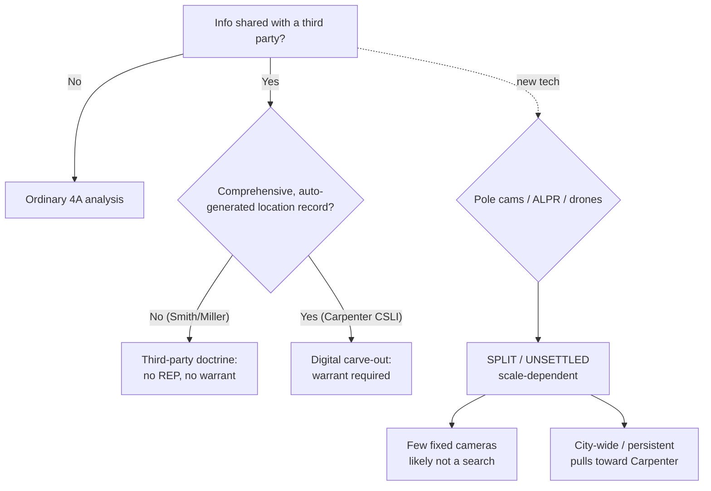

---
aliases:
  - "The Third-Party Doctrine and Digital Surveillance"
topic: Third-party doctrine & digital surveillance
type: doctrine
jurisdiction: Federal (U.S. Const. amend. IV); SCOTUS baseline
status: verified
related: ["[[Two Definitions of Search]]", "[[Fourth Amendment Recalibration]]", "[[Search Incident to Arrest]]", "[[Plain View Doctrine]]", "[[Curtilage]]"]
---

## Rule

Under the federal **third-party doctrine**, a person has **no reasonable expectation of privacy in information voluntarily turned over to a third party** — so the government may obtain it without a warrant. As the Supreme Court put it in *Smith v. Maryland*, "a person has no legitimate expectation of privacy in information he voluntarily turns over to third parties." *Smith* (pen-register dialing) and *United States v. Miller* (bank records) are the twin pillars. **Carpenter v. United States** (2018) carved a narrow digital-age exception: the doctrine does **not** extend to the comprehensive, automatically generated record of physical movements that historical cell-site location information (CSLI) provides, which now requires a warrant. *Carpenter* did **not** overrule *Smith* or *Miller*. The open frontier — applying *Carpenter* to newer surveillance technology (pole cameras, license-plate readers, drones) — is **unsettled**, and lower courts divide.

## Key cases

| Case (Bluebook) | Holding (one line) | Weight | CourtListener |
|---|---|---|---|
| *Smith v. Maryland*, 442 U.S. 735 (1979) | Pen register recording dialed numbers is not a search; no REP in info voluntarily conveyed to the phone company — origin of the third-party doctrine. | SCOTUS — binding | [link](https://www.courtlistener.com/opinion/110118/smith-v-maryland/) |
| *United States v. Miller*, 425 U.S. 435 (1976) | Bank records are the bank's business records, not the customer's private papers; no REP in information exposed to the bank. | SCOTUS — binding | [link](https://www.courtlistener.com/opinion/109433/united-states-v-miller/) |
| *Carpenter v. United States*, 585 U.S. 296 (2018) | Acquiring historical CSLI is a search requiring a warrant; the third-party doctrine does not reach comprehensive auto-generated location records. **Narrow.** | SCOTUS — binding | [link](https://www.courtlistener.com/opinion/4510032/carpenter-v-united-states/) |
| *Kyllo v. United States*, 533 U.S. 27 (2001) | Thermal imaging of a home with sense-enhancing tech "not in general public use" is a search, presumptively unreasonable without a warrant. | SCOTUS — binding | [link](https://www.courtlistener.com/opinion/118443/kyllo-v-united-states/) |
| *United States v. Hay*, 95 F.4th 1304 (10th Cir. 2024) | ~2 months of pole-camera surveillance capturing only a home's public-view exterior is not a search; *Carpenter* did not abrogate circuit precedent. **(Split — see below.)** | Circuit — persuasive | [link](https://www.courtlistener.com/opinion/9485331/united-states-v-hay/) |
| *United States v. Porter*, No. 25-60163 (5th Cir. Mar. 17, 2026) | Use of an automatic license-plate reader (ALPR) for vehicle-location data is not a search; the ALPR hit supplied reasonable suspicion for the stop. | Circuit — persuasive | [link](https://www.courtlistener.com/opinion/10810059/united-states-v-porter/) |
| *Robinson v. Commonwealth* (Va. Ct. App. Apr. 7, 2026) *(state — illustrative, non-binding)* | A Flock ALPR camera network (172 cameras) is not a search; no REP in a vehicle's public movements; not the "near perfect surveillance" of *Carpenter*. | State — illustrative | [link](https://www.courtlistener.com/opinion/10838748/eddie-eugene-robinson-v-commonwealth-of-virginia/) |
| *Leaders of a Beautiful Struggle v. Baltimore Police Dep't*, 2 F.4th 330 (4th Cir. 2021) (en banc) | Aerial wide-area surveillance program tracking everyone's public movements **required a warrant** under *Carpenter* — the scale/mosaic counterpoint. | Circuit — persuasive | — |
| *California v. Ciraolo*, 476 U.S. 207 (1986) | Naked-eye aerial observation of a fenced yard from navigable airspace (~1,000 ft) is not a search. | SCOTUS — binding | [link](https://www.courtlistener.com/opinion/111666/california-v-ciraolo/) |
| *Florida v. Riley*, 488 U.S. 445 (1989) | Naked-eye helicopter observation at 400 ft into curtilage is not a search (plurality) — closest analogue for low-altitude drones. | SCOTUS — binding | [link](https://www.courtlistener.com/opinion/112175/florida-v-riley/) |
| *Dow Chemical Co. v. United States*, 476 U.S. 227 (1986) | Aerial photography of a commercial complex with a commonly available camera is not a search. | SCOTUS — binding | [link](https://www.courtlistener.com/opinion/111667/dow-chemical-co-v-united-states-ex-rel-administrator/) |

This is the **federal** standard. SCOTUS cases bind; circuit decisions are persuasive (splits flagged below); *Robinson* is cited only to illustrate a federal principle and is non-binding.

## Nuances & limits

- **Carpenter is narrow.** It governs comprehensive, automatically generated location records (historical CSLI). It expressly does **not** disturb *Smith*/*Miller*, conventional surveillance, or ordinary business records. Do not over-read it.
- **The "Carpenter prongs" are instructor framing, not a holding.** As a close reading, *Carpenter* can be summarized as turning on three features: (1) a **new category of information** arising from the digital age; (2) information **generated without meaningful voluntary choice**; and (3) information that **reveals "the privacies of life."** The Court did **not** enumerate this three-part test — it is an interpretive gloss. Only the phrase "the privacies of life" is the Court's own (quoting *Boyd*/*Riley*); the Court described CSLI location records as ones that "hold for many Americans the 'privacies of life.'"
- **Scale / mosaic is the dividing line for new tech.** A few fixed cameras capturing public movement tend to stay on the *Smith*/*Knotts* side (not a search); comprehensive, city-wide, persistent tracking pulls toward *Carpenter*. Contrast the ALPR cases (*Porter*, *Robinson* — not a search) with *Leaders of a Beautiful Struggle* (aerial wide-area program — warrant required).
- **Sense-enhancing technology.** *Kyllo* draws a separate line for tech "not in general public use" used to expose the interior of a home — a search. *Dow Chemical* is the contrast: commonly available aerial camera over commercial premises is not.
- **Pole cameras are split.** *Hay* (10th Cir.) is one circuit's permissive view. The doctrine is unsettled: circuits and state high courts divide on whether long-term pole-camera surveillance of a home is a search. Present *Hay* as one circuit's position, not a settled federal rule.
- **Drones — emerging, no SCOTUS case.** There is no Supreme Court drone decision. The manned-aircraft lineage (*Ciraolo*, *Riley*, *Dow Chemical*) is the bridge, but drones may not fit it: they fly far below navigable airspace, can hover and persist, are cheap and pervasive, and can zoom — features that pull toward *Kyllo* (tech not in general public use) and *Carpenter* (persistent, comprehensive surveillance). Treat as jurisdiction-dependent and unsettled; some states are moving by statute or case law toward warrants for sustained curtilage surveillance.

## Common pitfalls

- **Don't present the "Carpenter prongs" as the Court's holding.** They are the instructor's interpretive framing of the opinion, not language the Court enumerated. Label them as such.
- **Don't assert reporter cites for *Porter* and *Robinson*.** Both are too recent to have confirmed reporter (F.4th / S.E.2d) citations; cite *Porter* by docket (No. 25-60163, 5th Cir. Mar. 17, 2026) and *Robinson* as a 2026 Va. Ct. App. opinion (Eddie Eugene Robinson v. Commonwealth, Apr. 7, 2026). Any reporter cite you may see floating around for these is unconfirmed/wrong — do not use one.
- **Don't state pole-camera or drone law as a settled federal rule.** Both are split/unsettled and jurisdiction-dependent. Flag the split.
- **Don't treat *Ciraolo*/*Riley* as drone law.** They predate drones and *Carpenter*; low, persistent, zoom-capable drones may not fit them cleanly.
- **Don't over-read *Carpenter*.** It is not a general repeal of the third-party doctrine — *Smith* and *Miller* remain good law.

## Visual

## Sources

- *Smith v. Maryland*, 442 U.S. 735, 743-44 (1979) — https://www.courtlistener.com/opinion/110118/smith-v-maryland/
- *United States v. Miller*, 425 U.S. 435, 442-43 (1976) — https://www.courtlistener.com/opinion/109433/united-states-v-miller/
- *Carpenter v. United States*, 585 U.S. 296, 309-11, 313-16 (2018) — https://www.courtlistener.com/opinion/4510032/carpenter-v-united-states/
- *Kyllo v. United States*, 533 U.S. 27, 34-35, 40 (2001) — https://www.courtlistener.com/opinion/118443/kyllo-v-united-states/
- *United States v. Hay*, 95 F.4th 1304, 1314-19 (10th Cir. 2024) — https://www.courtlistener.com/opinion/9485331/united-states-v-hay/
- *United States v. Porter*, No. 25-60163 (5th Cir. Mar. 17, 2026) — https://www.courtlistener.com/opinion/10810059/united-states-v-porter/
- *Robinson v. Commonwealth* (Va. Ct. App. Apr. 7, 2026) — https://www.courtlistener.com/opinion/10838748/eddie-eugene-robinson-v-commonwealth-of-virginia/
- *California v. Ciraolo*, 476 U.S. 207, 213-14 (1986) — https://www.courtlistener.com/opinion/111666/california-v-ciraolo/
- *Florida v. Riley*, 488 U.S. 445, 450-52 (1989) (plurality) — https://www.courtlistener.com/opinion/112175/florida-v-riley/
- *Dow Chemical Co. v. United States*, 476 U.S. 227, 237-39 (1986) — https://www.courtlistener.com/opinion/111667/dow-chemical-co-v-united-states-ex-rel-administrator/
