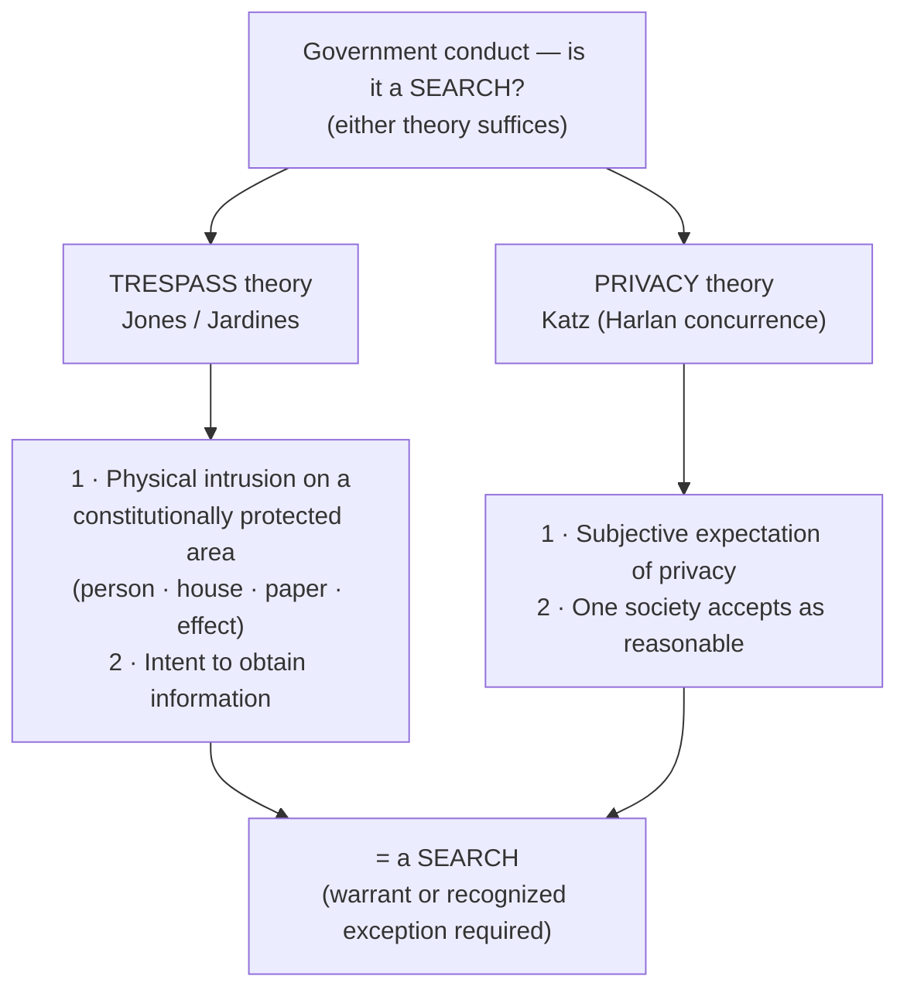

## Rule
Government conduct becomes a Fourth Amendment **"search"** under **either** of **two independent theories** — satisfy one and it is a search; neither is required to also satisfy the other. **(A) Trespass / property:** a physical intrusion onto a constitutionally protected area ("persons, houses, papers, and effects") to obtain information is itself a search. *United States v. Jones*, 565 U.S. 400, 404–05, 408 n.5 (2012). **(B) Reasonable expectation of privacy (*Katz*):** government conduct that invades an expectation of privacy society accepts as reasonable is a search, even with no physical trespass at all. *Katz v. United States*, 389 U.S. 347, 351, 360–61 (1967). *Jones* **revived** the older property baseline that *Katz* had **supplemented** — *Katz* "did not narrow the Fourth Amendment's scope." *Jones*, 565 U.S. at 408. The two overlap but are distinct: trespass is often, but not always, also a privacy violation.

## Key cases
| Case (Bluebook) | Holding in one line | Weight | CourtListener |
|---|---|---|---|
| *Olmstead v. United States*, 277 U.S. 438 (1928) | Wiretapping with **no physical entry** of the defendants' premises was **not** a search — pure property/trespass framing; **overruled** on the privacy point by *Katz*. (Brandeis, J., dissenting: "the right to be let alone.") | SCOTUS — binding (superseded on privacy) | [link](https://www.courtlistener.com/opinion/101320/olmstead-v-united-states/) |
| *Silverman v. United States*, 365 U.S. 505 (1961) | A "spike mike" physically penetrating the wall into the house was a search — an **unauthorized physical intrusion** into a constitutionally protected area; the Court refused to rest on local-law "technical trespass" niceties. | SCOTUS — binding | [link](https://www.courtlistener.com/opinion/106187/silverman-v-united-states/) |
| *Katz v. United States*, 389 U.S. 347 (1967) | "The Fourth Amendment protects people, not places"; a listening device on a public phone booth was a search though there was no trespass — **overruled** *Olmstead*'s trespass-only view. | SCOTUS — binding | [link](https://www.courtlistener.com/opinion/107564/katz-v-united-states/) |
| *United States v. Jones*, 565 U.S. 400 (2012) | Installing a GPS tracker on a vehicle and monitoring it was a search under the **revived trespass theory** — physical intrusion on an "effect" to obtain information. The **controlling** modern trespass-search case. | SCOTUS — binding | [link](https://www.courtlistener.com/opinion/7350871/united-states-v-jones/) |
| *Florida v. Jardines*, 569 U.S. 1 (2013) | Applied the *Jones* trespass theory to the home's **curtilage** — bringing a drug dog onto the front porch exceeded the implied license, a trespassory search. (See [[Curtilage]].) | SCOTUS — binding | [link](https://www.courtlistener.com/opinion/856347/florida-v-jardines/) |
| *Carpenter v. United States*, 585 U.S. 296 (2018) | Acquiring extended historical **cell-site location information** is a search — a reasonable expectation of privacy in "the whole of [one's] physical movements"; narrows the third-party doctrine for digital-age data. | SCOTUS — binding | [link](https://www.courtlistener.com/opinion/4510032/carpenter-v-united-states/) |

## Related cases across doctrines
These cases are treated in full elsewhere but bear on the two-definitions-of-search threshold question, framed for it here.

| Case | Relevance to the two definitions of search | Primary treatment | CourtListener |
|---|---|---|---|
| *Arizona v. Hicks*, 480 U.S. 321 (1987) | Moving stereo equipment a few inches to read its serial numbers was itself a SEARCH separate from the lawful entry — a textbook illustration of the threshold question "what government conduct counts as a search?" Even a minimal physical manipulation/inspection to obtain information crosses the line. | [[Plain View Doctrine]] | [opinion](https://www.courtlistener.com/opinion/111834/arizona-v-hicks/) |
| *United States v. Tuggle*, 4 F.4th 505 (7th Cir. 2021) | Applying the *Katz* privacy theory to new technology: 18 months of warrantless pole-camera surveillance of a home's exterior was held NOT a search under existing doctrine (no reasonable expectation of privacy in what is exposed to public view), but the panel openly flagged *Carpenter*'s mosaic logic and the unsettled question whether aggregated long-term surveillance becomes a search. A leading circuit data point on the outer edge of the privacy definition. (7th Cir. — persuasive, not binding; circuit split.) | [[Two Definitions of Search]] | [opinion](https://www.courtlistener.com/opinion/4899735/united-states-v-travis-tuggle/) |

## Nuances & limits
- **Two theories, either suffices.** *Jones* held GPS tracking a search on trespass grounds without reaching *Katz*: "We have no doubt that such a physical intrusion would have been considered a 'search' within the meaning of the Fourth Amendment when it was adopted." *Jones*, 565 U.S. at 404–05. A defendant's "Fourth Amendment rights do not rise or fall with the *Katz* formulation." *Id.* at 406. Conversely, *Katz* finds a search with no trespass at all.
- **The *Jones* trespass test — two elements.** A trespass alone is not enough; it must be (1) a physical intrusion on a constitutionally protected area, (2) joined with intent to obtain information. "Trespass alone does not qualify, but there must be conjoined with that what was present here: an attempt to find something or to obtain information." *Jones*, 565 U.S. at 408 n.5.
- **Property baseline revived, not replaced.** *Katz* "established that property rights are not the sole measure of Fourth Amendment violations, but did not snuff out the previously recognized protection for property." *Jones*, 565 U.S. at 407 (quoting *Soldal v. Cook County*, 506 U.S. 56, 64 (1992)). "*Katz* did not narrow the Fourth Amendment's scope." *Id.* at 408. So the property/trespass theory and the *Katz* privacy theory now run in parallel.
- **The *Katz* test is from Justice Harlan's CONCURRENCE, not the majority.** The majority held "the Fourth Amendment protects people, not places" and that "[w]hat a person knowingly exposes to the public … is not a subject of Fourth Amendment protection." *Katz*, 389 U.S. at 351. The familiar two-prong test comes from Harlan's concurrence: (1) a person exhibited an **actual (subjective) expectation of privacy** and (2) one **society is prepared to recognize as "reasonable."** *Id.* at 361 (Harlan, J., concurring). *Jones* itself notes the Court's later cases "applied the analysis of Justice Harlan's concurrence." *Jones*, 565 U.S. at 406.
- **Trespass need not track local property law.** A physical intrusion into a constitutionally protected area is a search even if it is not a "trespass" under state property rules. In *Silverman*, the Court refused to decide "whether or not there was a technical trespass under the local property law relating to party walls," explaining that "[i]nherent Fourth Amendment rights are not inevitably measurable in terms of ancient niceties of tort or real property law." *Silverman*, 365 U.S. at 511. The unauthorized physical penetration into the home was enough.
- **Old wiretap law is gone.** *Olmstead* treated electronic eavesdropping without physical entry as no search — "There was no searching. There was no seizure. … There was no entry of the houses or offices of the defendants." 277 U.S. at 464. *Katz* overruled that. Many pre-*Katz* surveillance holdings are no longer good law — analyze modern surveillance under *Katz* privacy and, where there is a physical intrusion, under *Jones* trespass.
- **Privacy theory recalibrates for new technology.** *Carpenter* holds that "individuals have a reasonable expectation of privacy in the whole of their physical movements," so the government's acquisition of long-term CSLI is a search — declining to mechanically extend the **third-party doctrine** (the rule that information voluntarily shared with a third party generally loses Fourth Amendment protection) to pervasive digital location data. *Carpenter*, 585 U.S. at 310–16. *Katz* and *Carpenter* are the privacy theory adjusting to emerging technology; as *Carpenter* put it, "what [one] seeks to preserve as private, even in an area accessible to the public, may be constitutionally protected." *Carpenter*, 585 U.S. at 310 (quoting *Katz*, 389 U.S. at 351–52).
- **The privacy theory reaches non-traditional dwellings.** *Katz* protects people, not building types, so a **tent** used as a temporary home can carry a reasonable expectation of privacy — "a tent is more like a house than a car," and its warrantless search is a Fourth Amendment search even on public land. *United States v. Gooch*, 6 F.3d 673, 677 (9th Cir. 1993) (9th Cir. — persuasive, not binding). See [[Tents]] (primary treatment).

## Common pitfalls
- **Assuming "no trespass" means "no search."** That was *Olmstead*, and *Katz* overruled it. A bug on a phone booth, a thermal scan, or long-term CSLI can be a search with zero physical entry.
- **Assuming "no privacy invasion" means "no search."** *Jones* and *Jardines* find a search on **trespass** grounds even where a pure *Katz* analysis would be contested (e.g., a car's location on public roads is exposed to all). Trespass to gather information is independently a search.
- **Attributing the two-prong test to the *Katz* majority.** It is **Harlan's concurrence**. Cite it correctly: *Katz*, 389 U.S. at 361 (Harlan, J., concurring).
- **Treating *Olmstead* as dead letter.** It is overruled on privacy, but its property/entry instinct was **revived** by *Jones* — physical intrusion to obtain information is back as an independent route to "search."
- **Reading *Carpenter* as abolishing the third-party doctrine.** It narrows it for pervasive digital location data; it does not erase it.

## Visual

## Recent developments & subsequent treatment
The threshold "did a search occur?" question is being actively relitigated for emerging surveillance technology — geofence/reverse-location warrants, long-term pole cameras, and automated hash-matching — with the circuits splitting over how far *Katz*/*Carpenter*'s privacy theory reaches and a SCOTUS vehicle now pending. The federal courts of appeals decisions below are **persuasive, not binding** outside their own circuits.

- **United States v. Chatrie** — *pending before the Supreme Court* (question: whether executing a geofence warrant for Google Location History data is a Fourth Amendment "search"; cert granted, No. 25-112, argued Apr. 27, 2026, not yet decided; below, the en banc Fourth Circuit affirmed by an equally divided court on whether a search occurred). ⚖ Circuit split. [oral argument](https://www.courtlistener.com/audio/104529/okello-t-chatrie-petitioner-v-united-states/).
- **United States v. Chatrie (panel) (4th Cir. 2024)** — the panel held that obtaining ~2 hours of Google Location History was NOT a Fourth Amendment search, reasoning the data was less revealing than the CSLI in *Carpenter* and was voluntarily shared because Location History is off-by-default/opt-in (third-party doctrine applies); it reads *Carpenter* narrowly and declines to extend the reasonable-expectation-of-privacy theory to opt-in app data. Subsequently reheard en banc (granted Nov. 1, 2024), so the panel opinion is no longer the operative disposition; the underlying question is now before SCOTUS. Decision of the **Fourth Circuit — persuasive, not binding**. ⚖ Circuit split. [opinion](https://www.courtlistener.com/opinion/10265776/united-states-v-okello-chatrie/).
- **United States v. Smith (5th Cir. 2024)** — obtaining Google Location History via a geofence invades a reasonable expectation of privacy and is a Fourth Amendment search; geofence warrants are "modern-day general warrants" and categorically unconstitutional under the Fourth Amendment regardless of probable cause — though the evidence was not suppressed here under the *Leon* good-faith exception given the novelty of the technology. Decision of the **Fifth Circuit — persuasive, not binding**. ⚖ Circuit split. "We hold that geofence warrants are modern-day general warrants and are unconstitutional under the Fourth Amendment. However, considering law enforcement's reasonable conduct in this case in light of the novelty of this type of warrant, we uphold the district court's determination that suppression was unwarranted under the good-faith exception." *Smith*, 110 F.4th at 838. [opinion](https://www.courtlistener.com/opinion/10036119/united-states-v-smith/).
- **United States v. Moore-Bush (1st Cir. 2022)** — the en banc First Circuit (6 judges) unanimously reversed the district court's grant of suppression and remanded with instructions to deny the motions to suppress — the eight-month pole-camera evidence comes in. The court divided 3-3 only on the rationale for whether the surveillance of the home's curtilage was a Fourth Amendment "search" (Barron/Thompson/Kayatta: it was a search under *Carpenter*'s aggregation/mosaic theory but *Leon*/*Davis* good-faith reliance on circuit precedent *Bucci* saves it; Lynch/Howard/Gelpi: no search at all). Either way the evidence was admitted. Decision of the **First Circuit — persuasive, not binding**. ⚖ Circuit split. [opinion](https://www.courtlistener.com/opinion/6476395/united-states-v-moore-bush/).
- **United States v. Wilson (9th Cir. 2021)** — the government's warrantless viewing of a defendant's email attachments — which Google had flagged via automated hash-matching but which no Google employee or other person had ever actually viewed — exceeded the scope of the antecedent private search under *Walter v. United States* and *United States v. Jacobsen*. The government both (1) learned new, critical information and (2) expanded the search beyond any earlier private intrusion; the court reversed the denial of suppression and vacated the conviction, reading *Jacobsen*'s "virtual certainty" and scope limits strictly for algorithmic/hash matches. Decision of the **Ninth Circuit — persuasive, not binding**; it diverges from Fifth and Sixth Circuit decisions upholding similar hash-flag viewings. ⚖ Circuit split. [opinion](https://www.courtlistener.com/opinion/5296785/united-states-v-luke-wilson/).

## Sources
- *Olmstead v. United States*, 277 U.S. 438 (1928) — https://www.courtlistener.com/opinion/101320/olmstead-v-united-states/
- *Silverman v. United States*, 365 U.S. 505 (1961) — https://www.courtlistener.com/opinion/106187/silverman-v-united-states/
- *Katz v. United States*, 389 U.S. 347 (1967) — https://www.courtlistener.com/opinion/107564/katz-v-united-states/
- *United States v. Jones*, 565 U.S. 400 (2012) — https://www.courtlistener.com/opinion/7350871/united-states-v-jones/
- *Florida v. Jardines*, 569 U.S. 1 (2013) — https://www.courtlistener.com/opinion/856347/florida-v-jardines/
- *Carpenter v. United States*, 585 U.S. 296 (2018) — https://www.courtlistener.com/opinion/4510032/carpenter-v-united-states/
- *Arizona v. Hicks*, 480 U.S. 321 (1987) — https://www.courtlistener.com/opinion/111834/arizona-v-hicks/
- *United States v. Tuggle*, 4 F.4th 505 (7th Cir. 2021) *(persuasive)* — https://www.courtlistener.com/opinion/4899735/united-states-v-travis-tuggle/
- *United States v. Gooch*, 6 F.3d 673 (9th Cir. 1993) *(persuasive)* — https://www.courtlistener.com/opinion/[verify]/united-states-v-gooch/
- *United States v. Chatrie* (cert. granted, No. 25-112) — https://www.courtlistener.com/audio/104529/okello-t-chatrie-petitioner-v-united-states/
- *United States v. Chatrie* (panel) (4th Cir. 2024) *(persuasive)* — https://www.courtlistener.com/opinion/10265776/united-states-v-okello-chatrie/
- *United States v. Smith*, 110 F.4th 817 (5th Cir. 2024) *(persuasive)* — https://www.courtlistener.com/opinion/10036119/united-states-v-smith/
- *United States v. Moore-Bush* (1st Cir. 2022) (en banc) *(persuasive)* — https://www.courtlistener.com/opinion/6476395/united-states-v-moore-bush/
- *United States v. Wilson* (9th Cir. 2021) *(persuasive)* — https://www.courtlistener.com/opinion/5296785/united-states-v-luke-wilson/
