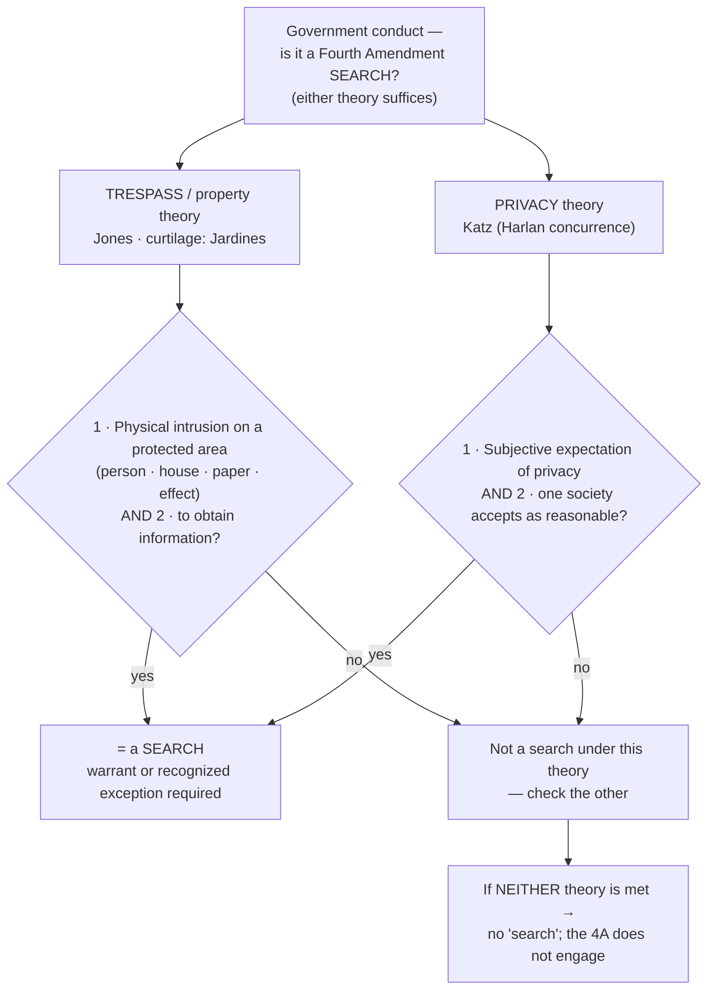

# Two Definitions of Search — Trespass & Privacy

## The Brief

**Field-decisive question:** *Before* you reach any warrant or exception, ask the threshold question — did the government do something the Fourth Amendment even counts as a **"search"**? It is a search if **either** (a) officers **physically intruded on a constitutionally protected area to get information** (the trespass theory) **or** (b) they **invaded a reasonable expectation of privacy** (the *[[Katz v. United States|Katz]]* theory). Satisfy one and it is a search; neither is required to also satisfy the other. If **neither** is met, there is no "search," and the Fourth Amendment's warrant-and-reasonableness machinery never engages.

Government conduct becomes a Fourth Amendment "search" under **either of two independent tests** — state both up front:

- **Test A — Trespass / physical-intrusion** ([[United States v. Jones|*United States v. Jones*]]; applied to the home's curtilage in [[Florida v. Jardines|*Florida v. Jardines*]]). Two elements, **both** required: **(1)** a physical intrusion onto or occupation of a constitutionally protected area — the textual "persons, houses, papers, and effects" — **(2)** done **to obtain information**. As *Jones* put it, the government "physically occupied private property for the purpose of obtaining information," and "such a physical intrusion would have been considered a 'search' . . . when [the Amendment] was adopted." [[United States v. Jones#^pin-404a|*Jones*, 565 U.S. at 404–05]]. Trespass alone is not enough — the intrusion must be joined with an attempt to gather information — and the intrusion need **not** be a "trespass" under state property law ([[Silverman v. United States|*Silverman v. United States*]]).
- **Test B — Reasonable expectation of privacy** ([[Katz v. United States|*Katz v. United States*]]; the operative two-prong test comes from **Justice Harlan's [[Common Legal Terms#concurring-opinion|concurrence]]**, not the majority). Two prongs: **(1)** the person exhibited an **actual (subjective) expectation of privacy**, and **(2)** one **society is prepared to recognize as "reasonable."** [[Katz v. United States#^pin-361|*Katz*, 389 U.S. at 361]] (Harlan, J., concurring). The majority's holding is the principle that "the Fourth Amendment protects people, not places," so that "what [a person] seeks to preserve as private, even in an area accessible to the public, may be constitutionally protected." [[Katz v. United States#^pin-351|*Id.* at 351]].

The two tests run **in parallel, not in sequence**: *Katz*'s privacy test "has been *added to*, not *substituted for*, the common-law trespassory test." [[United States v. Jones#^pin-409|*Jones*, 565 U.S. at 409]]. *Jones* itself decided the case on trespass grounds without ever reaching *Katz*. The property baseline that *Katz* had supplemented was thus **revived, not replaced** — the Amendment "protects property as well as privacy." [[Soldal v. Cook County#^pin-62|*Soldal v. Cook County*, 506 U.S. at 62]]. The two overlap but are distinct: a trespass to gather information is independently a search even where a pure privacy analysis would be contested.

**Who bears what, and the remedy.** The threshold "did a search occur?" question — a question of law reviewed **[[Common Legal Terms#de-novo|de novo]]** (subsidiary historical facts for [[Common Legal Terms#clear-error|clear error]]) — is the movant's to raise: the party seeking suppression must first show that the conduct was a Fourth Amendment search and that **he personally** held the invaded interest (his own reasonable expectation of privacy, or a possessory/property interest — see [[Standing to Challenge a Search]]). Only once a **warrantless** search is established does the burden shift to the government to justify it under the warrant requirement or a recognized exception. If the search was unreasonable, the evidence and its fruits are subject to exclusion (see [[The Exclusionary Rule]]).

**Where the lines fall — what counts and what does not.** The trespass theory captures conduct a pure privacy analysis might miss: a "spike mike" driven through a party wall into the home (*Silverman*), attaching and monitoring a GPS tracker on a vehicle (*Jones*), and walking a drug dog onto the front-porch curtilage (*Jardines*) are all searches because officers physically occupied protected ground to obtain information. The privacy theory, in turn, recalibrates for new technology: aiming sense-enhancing equipment "not in general public use" at a home to learn its interior ([[Kyllo v. United States|*Kyllo v. United States*]], [[Kyllo v. United States#^pin-40|533 U.S. at 40]] — "[i]n the home . . . all details are intimate details," [[Kyllo v. United States#^pin-37|*id.* at 37]]), and acquiring extended historical cell-site records that chronicle "the whole of [one's] physical movements" ([[Carpenter v. United States|*Carpenter v. United States*]], declining to mechanically extend the **third-party doctrine** — the rule that information voluntarily shared with a third party generally loses Fourth Amendment protection — to pervasive digital location data). Even minimal acts cross the line when they expose hidden information: turning over stereo components to read concealed serial numbers is a separate search — "[a] search is a search, even if it happens to disclose nothing but the bottom of a turntable." [[Arizona v. Hicks#^pin-325|*Arizona v. Hicks*, 480 U.S. at 325]]. And exploratory **tactile** inspection of a traveler's bag is a search because "[p]hysically invasive inspection is simply more intrusive than purely visual inspection." [[Bond v. United States#^pin-337|*Bond v. United States*, 529 U.S. at 337]].

Conversely, conduct that exposes only what is already public, or reveals only contraband, is **not** a search: tracking a vehicle's movements over public roads by beeper ([[United States v. Knotts|*United States v. Knotts*]]), a canine sniff of luggage in public or during a lawful, un-prolonged traffic stop ([[United States v. Place|*United States v. Place*]]; [[Illinois v. Caballes|*Illinois v. Caballes*]]), examining a car's exterior or a legally-required VIN ([[Cardwell v. Lewis|*Cardwell v. Lewis*]]; [[New York v. Class|*New York v. Class*]]), an undercover purchase in a commercial setting ([[Lewis v. United States (1966)|*Lewis v. United States (1966)*]]; [[Maryland v. Macon|*Maryland v. Macon*]]), aerial photography of an industrial complex's open areas ([[Dow Chemical Co. v. United States|*Dow Chemical Co. v. United States*]]), and a prisoner's cell, in which there is **no** reasonable expectation of privacy ([[Hudson v. Palmer|*Hudson v. Palmer*]]). But the same surveillance technique can flip with context: monitoring a beeper to learn it is **inside a private residence** *is* a search ([[United States v. Karo|*United States v. Karo*]]), as the home marks the privacy theory's core. The privacy theory also reaches non-traditional dwellings — "a tent is more like a house than a car," so a tent used as a home can carry a reasonable expectation of privacy. [[United States v. Gooch|*United States v. Gooch*]], 6 F.3d 673 (9th Cir.) (**Binding in-circuit — 9th Cir.**); see [[Tents]] (primary treatment).

A separate strand of the threshold question is the **seizure of property**: a "seizure" occurs whenever there is "meaningful interference with an individual's possessory interests in that property," independent of any privacy or liberty interest. [[Soldal v. Cook County#^pin-61|*Soldal*, 506 U.S. at 61–62]]. And the manner of entry matters even apart from force — entry obtained "by stealth, or through social acquaintance, or in the guise of a business call" can still render the ensuing search a Fourth Amendment violation. [[Gouled v. United States#^pin-306|*Gouled v. United States*, 255 U.S. at 306]] (the *Gouled* "mere-evidence" rule was overruled by [[Warden v. Hayden|*Warden v. Hayden*]]; its stealth/ruse-entry holding survives).

**Pitfalls to avoid.** Do **not** assume "no trespass means no search" — that was [[Olmstead v. United States|*Olmstead v. United States*]], and *Katz* overruled it; a bug on a phone booth, a thermal scan, or long-term cell-site data can be a search with zero physical entry. Do **not** assume "no privacy invasion means no search" — *Jones* and *Jardines* find a search on **trespass** grounds even where a pure *Katz* analysis would be contested (a car's location on public roads is exposed to all). Do **not** attribute the two-prong privacy test to the *Katz* majority — it is **Harlan's concurrence** ([[Katz v. United States#^pin-361|*Katz*, 389 U.S. at 361]]). Do **not** treat *Olmstead* as a dead letter — it is overruled on privacy, but its property/entry instinct was **revived** by *Jones*. And do **not** read *Carpenter* as abolishing the third-party doctrine — it **narrows** it for pervasive digital location data; it does not erase it.

## Key cases

| Case | Holding (one line) | Weight | Treatment | CourtListener |
|---|---|---|---|---|
| [[Olmstead v. United States]] | Wiretapping with **no physical entry** of the defendants' premises was **not** a search — pure property/trespass framing; the origin point later overruled on privacy by *Katz* (property instinct revived by *Jones*). | Historical | overruled · 2026-06-30 | [opinion](https://www.courtlistener.com/opinion/101320/olmstead-v-united-states/) |
| [[Silverman v. United States]] | A "spike mike" physically penetrating the wall into the house was a search — an **unauthorized physical intrusion** into a protected area, not measured by local-law "technical trespass" niceties. | Binding — SCOTUS | good · 2026-06-30 | [opinion](https://www.courtlistener.com/opinion/106187/silverman-v-united-states/) |
| [[Katz v. United States]] | "The Fourth Amendment protects people, not places"; a listening device on a public phone booth was a search though there was no trespass — overruled *Olmstead*'s trespass-only view (Harlan's concurrence supplies the REP test). | Binding — SCOTUS | good · 2026-06-30 | [opinion](https://www.courtlistener.com/opinion/107564/katz-v-united-states/) |
| [[United States v. Jones]] | Installing a GPS tracker on a vehicle and monitoring it was a search under the **revived trespass theory** — physical intrusion on an "effect" to obtain information; the controlling modern trespass-search case. | Binding — SCOTUS | good · 2026-06-30 | [opinion](https://www.courtlistener.com/opinion/7350871/united-states-v-jones/) |
| [[Florida v. Jardines]] | Bringing a drug dog onto the home's **curtilage** (the front porch) to investigate exceeded the implied license — a trespassory search. | Binding — SCOTUS | good · 2026-06-30 | [opinion](https://www.courtlistener.com/opinion/856347/florida-v-jardines/) |
| [[Kyllo v. United States]] | Using **sense-enhancing technology not in general public use** to learn a home's interior details is a search, presumptively unreasonable without a warrant. | Binding — SCOTUS | good · 2026-06-30 | [opinion](https://www.courtlistener.com/opinion/118443/kyllo-v-united-states/) |
| [[Carpenter v. United States]] | Acquiring extended historical **cell-site location information** is a search — a reasonable expectation of privacy in "the whole of [one's] physical movements"; **narrows** the third-party doctrine for digital-age data. | Binding — SCOTUS | good · 2026-06-30 | [opinion](https://www.courtlistener.com/opinion/4510032/carpenter-v-united-states/) |
| [[Soldal v. Cook County]] | A **seizure of property** occurs on any "meaningful interference with . . . possessory interests"; the Amendment "protects property as well as privacy," independent of any privacy/liberty interest. | Binding — SCOTUS | good · 2026-06-30 | [opinion](https://www.courtlistener.com/opinion/112795/soldal-v-cook-county/) |
| [[United States v. Place]] | A canine sniff of luggage in a public place is **sui generis** and **not** a search — it reveals only the presence or absence of contraband (the boundary of what counts). | Binding — SCOTUS | good · 2026-06-30 | [opinion](https://www.courtlistener.com/opinion/110979/united-states-v-place/) |
| [[Bond v. United States]] | An officer's exploratory **tactile** squeezing of a bus passenger's soft luggage IS a search — "[p]hysically invasive inspection is . . . more intrusive than purely visual inspection." | Binding — SCOTUS | good · 2026-06-30 | [opinion](https://www.courtlistener.com/opinion/118354/bond-v-united-states/) |
| [[Gouled v. United States]] | Entry obtained by **stealth, ruse, or social pretext** can still render the ensuing search a Fourth Amendment violation. *(The case's separate "mere-evidence" rule was overruled by *Warden v. Hayden*.)* | Historical | overruled (in part) · 2026-06-30 | [opinion](https://www.courtlistener.com/opinion/99745/gouled-v-united-states/) |

## Related cases across doctrines

These cases are treated in full on other doctrine pages but bear on the threshold "is it a search?" question, framed for it here.

| Case | Relevance to the threshold question | Weight | Primary home | CourtListener |
|---|---|---|---|---|
| [[Arizona v. Hicks]] | Moving stereo equipment a few inches to read concealed serial numbers was a **separate search** — even minimal physical manipulation to obtain hidden information crosses the line. | Binding — SCOTUS | [[Plain View Doctrine]] | [opinion](https://www.courtlistener.com/opinion/111834/arizona-v-hicks/) |
| [[United States v. Knotts]] | Beeper-aided tracking of a vehicle over public roads is **not** a search — no reasonable expectation of privacy in movements over public thoroughfares. | Binding — SCOTUS | [[The Third-Party Doctrine and Digital Surveillance]] | [opinion](https://www.courtlistener.com/opinion/110882/united-states-v-knotts/) |
| [[United States v. Karo]] | Monitoring a beeper **inside a private residence** IS a search — it reveals a critical fact about the home's interior not open to visual surveillance. | Binding — SCOTUS | [[The Third-Party Doctrine and Digital Surveillance]] | [opinion](https://www.courtlistener.com/opinion/111257/united-states-v-karo/) |
| [[Illinois v. Caballes]] | A dog sniff during a lawful traffic stop that does not prolong it is **not** a search — it reveals only contraband, implicating no legitimate privacy interest. | Binding — SCOTUS | [[Traffic Stops]] | [opinion](https://www.courtlistener.com/opinion/137742/illinois-v-caballes/) |
| [[Cardwell v. Lewis]] | Examining a car's exterior (paint, tires) on probable cause in a public lot invades **no** protected privacy interest — reduced expectation of privacy in a vehicle's exterior. | Binding — SCOTUS | [[Automobile Exception]] | [opinion](https://www.courtlistener.com/opinion/109069/cardwell-v-lewis/) |
| [[New York v. Class]] | **No** reasonable expectation of privacy in a VIN the law requires to be visible; reaching in to move papers obscuring it was a minimal but reasonable search. | Binding — SCOTUS | [[Traffic Stops]] | [opinion](https://www.courtlistener.com/opinion/111600/new-york-v-class/) |
| [[United States v. Van Leeuwen]] | Brief detention of mailed packages on reasonable suspicion invades **no** privacy interest — that interest is implicated only when the package is opened under a warrant. | Binding — SCOTUS | [[Terry Stops and Reasonable Suspicion]] | [opinion](https://www.courtlistener.com/opinion/108099/united-states-v-van-leeuwen/) |
| [[Maryland v. Macon]] | An undercover officer's purchase of magazines from a public store is **neither** a search (no REP in wares exposed to the public) **nor** a seizure (voluntary transfer). | Binding — SCOTUS | [[Consent Searches]] | [opinion](https://www.courtlistener.com/opinion/111477/maryland-v-macon/) |
| [[Lewis v. United States (1966)]] | An undercover agent invited in to transact illegal business is **no** search — but he may not exceed the invitation to conduct a general search. | Binding — SCOTUS | [[Consent Searches]] | [opinion](https://www.courtlistener.com/opinion/107312/lewis-v-united-states/) |
| [[Dow Chemical Co. v. United States]] | Precision aerial photography of an industrial complex's open areas from navigable airspace is **not** a search — such areas are more like open fields than curtilage. | Binding — SCOTUS | [[Curtilage]] | [opinion](https://www.courtlistener.com/opinion/111667/dow-chemical-co-v-united-states-ex-rel-administrator/) |
| [[Berger v. New York]] | Set Fourth Amendment particularity and safeguard standards for electronic-eavesdropping warrants — a companion to the *Katz* turn away from trespass-only doctrine. | Binding — SCOTUS | [[The Third-Party Doctrine and Digital Surveillance]] | [opinion](https://www.courtlistener.com/opinion/107483/berger-v-new-york/) |
| [[Hudson v. Palmer]] | A prisoner has **no** reasonable expectation of privacy in his cell — the outer boundary of the privacy definition (homed here as a REP-boundary marker). | Binding — SCOTUS | [[Two Definitions of Search]] | [opinion](https://www.courtlistener.com/opinion/111252/hudson-v-palmer/) |

## Recent developments

The threshold "did a search occur?" question is being actively relitigated for emerging surveillance technology — geofence/reverse-location warrants, long-term pole cameras, and automated hash-matching — with the circuits splitting over how far the *Katz*/*Carpenter* privacy theory reaches. The geofence question is now before the Supreme Court (*United States v. Chatrie*, cert. granted, No. 25-112, argued Apr. 27, 2026, not yet decided); the circuit/state decisions below are **persuasive (outside circuit)**, named here by role.

- **First-impression / split-flag — pole cameras.** [[United States v. Tuggle]] (**7th Cir. 2021** — Persuasive (outside circuit) — 7th Cir.) held that 18 months of warrantless pole-camera surveillance of a home's exterior was **not** a search under existing doctrine (no reasonable expectation of privacy in what is exposed to public view), while openly flagging *Carpenter*'s mosaic logic and the unsettled question whether aggregated long-term surveillance becomes a search. *(Tuggle is primarily homed on [[Plain View Doctrine]].)*
- **Split (narrowing) — geofence.** *United States v. Chatrie* (**4th Cir. 2024**, panel; later reheard **en banc**) held that obtaining ~2 hours of Google Location History was **not** a search, reading *Carpenter* narrowly and treating off-by-default/opt-in Location History as voluntarily shared (third-party doctrine). The panel opinion is no longer the operative disposition, and the underlying question is now before SCOTUS.
- **Split (expanding privacy) — geofence.** *United States v. Smith* (**5th Cir. 2024**) held that obtaining Google Location History via a geofence invades a reasonable expectation of privacy and **is** a search, calling geofence warrants "modern-day general warrants" — though the evidence was admitted under the *Leon* good-faith exception given the technology's novelty.
- **Split (3-3 on rationale) — pole cameras.** *United States v. Moore-Bush* (**1st Cir. 2022**, en banc) admitted eight months of pole-camera evidence, the six judges dividing 3-3 only on whether the surveillance was a search (*Carpenter* aggregation/mosaic vs. no search at all); good-faith reliance on circuit precedent saved it either way.
- **Split (private-search doctrine) — hash-matching.** *United States v. Wilson* (**9th Cir. 2021**) held that the government's warrantless viewing of email attachments flagged by Google's automated hash-matching but never actually viewed by any person exceeded the antecedent private search, diverging from Fifth and Sixth Circuit decisions upholding similar hash-flag viewings.

## Visual

## Sources

- *Olmstead v. United States*, 277 U.S. 438 (1928) — pinpoint 464 — https://www.courtlistener.com/opinion/101320/olmstead-v-united-states/
- *Silverman v. United States*, 365 U.S. 505 (1961) — pinpoints 509, 510, 511 — https://www.courtlistener.com/opinion/106187/silverman-v-united-states/
- *Katz v. United States*, 389 U.S. 347 (1967) — pinpoints 351, 361 (Harlan, J., concurring) — https://www.courtlistener.com/opinion/107564/katz-v-united-states/
- *United States v. Jones*, 565 U.S. 400 (2012) — pinpoints 404–05, 409 — https://www.courtlistener.com/opinion/7350871/united-states-v-jones/
- *Florida v. Jardines*, 569 U.S. 1 (2013) — pinpoints 6, 9 — https://www.courtlistener.com/opinion/856347/florida-v-jardines/
- *Kyllo v. United States*, 533 U.S. 27 (2001) — pinpoints 34, 37, 40 — https://www.courtlistener.com/opinion/118443/kyllo-v-united-states/
- *Carpenter v. United States*, 585 U.S. 296 (2018) — pinpoint slip op. at 11 — https://www.courtlistener.com/opinion/4510032/carpenter-v-united-states/
- *Soldal v. Cook County*, 506 U.S. 56 (1992) — pinpoints 61, 62 — https://www.courtlistener.com/opinion/112795/soldal-v-cook-county/
- *United States v. Place*, 462 U.S. 696 (1983) — pinpoint 707 — https://www.courtlistener.com/opinion/110979/united-states-v-place/
- *Bond v. United States*, 529 U.S. 334 (2000) — pinpoints 337, 338–339 — https://www.courtlistener.com/opinion/118354/bond-v-united-states/
- *Gouled v. United States*, 255 U.S. 298 (1921) — pinpoint 306 — https://www.courtlistener.com/opinion/99745/gouled-v-united-states/
- *Arizona v. Hicks*, 480 U.S. 321 (1987) — pinpoints 324, 325 — https://www.courtlistener.com/opinion/111834/arizona-v-hicks/
- *United States v. Knotts*, 460 U.S. 276 (1983) — https://www.courtlistener.com/opinion/110882/united-states-v-knotts/
- *United States v. Karo*, 468 U.S. 705 (1984) — https://www.courtlistener.com/opinion/111257/united-states-v-karo/
- *Illinois v. Caballes*, 543 U.S. 405 (2005) — https://www.courtlistener.com/opinion/137742/illinois-v-caballes/
- *Cardwell v. Lewis*, 417 U.S. 583 (1974) — https://www.courtlistener.com/opinion/109069/cardwell-v-lewis/
- *New York v. Class*, 475 U.S. 106 (1986) — https://www.courtlistener.com/opinion/111600/new-york-v-class/
- *United States v. Van Leeuwen*, 397 U.S. 249 (1970) — https://www.courtlistener.com/opinion/108099/united-states-v-van-leeuwen/
- *Maryland v. Macon*, 472 U.S. 463 (1985) — https://www.courtlistener.com/opinion/111477/maryland-v-macon/
- *Lewis v. United States*, 385 U.S. 206 (1966) — https://www.courtlistener.com/opinion/107312/lewis-v-united-states/
- *Dow Chemical Co. v. United States*, 476 U.S. 227 (1986) — https://www.courtlistener.com/opinion/111667/dow-chemical-co-v-united-states-ex-rel-administrator/
- *Berger v. New York*, 388 U.S. 41 (1967) — https://www.courtlistener.com/opinion/107483/berger-v-new-york/
- *Hudson v. Palmer*, 468 U.S. 517 (1984) — https://www.courtlistener.com/opinion/111252/hudson-v-palmer/
- *United States v. Gooch*, 6 F.3d 673 (9th Cir. 1993) *(Binding in-circuit — 9th Cir.)* — https://www.courtlistener.com/opinion/654273/united-states-v-kenneth-d-gooch/
- *United States v. Tuggle*, 4 F.4th 505 (7th Cir. 2021) *(Persuasive (outside circuit) — 7th Cir.)* — https://www.courtlistener.com/opinion/4899735/united-states-v-travis-tuggle/
- *United States v. Chatrie* (cert. granted, No. 25-112) *— flagged for serial-CL gate (no case page)* — https://www.courtlistener.com/audio/104529/okello-t-chatrie-petitioner-v-united-states/
- *United States v. Chatrie* (panel) (4th Cir. 2024) *— flagged (no case page)* — https://www.courtlistener.com/opinion/10265776/united-states-v-okello-chatrie/
- *United States v. Smith*, 110 F.4th 817 (5th Cir. 2024) *— flagged (no case page)* — https://www.courtlistener.com/opinion/10036119/united-states-v-smith/
- *United States v. Moore-Bush* (1st Cir. 2022) (en banc) *— flagged (no case page)* — https://www.courtlistener.com/opinion/6476395/united-states-v-moore-bush/
- *United States v. Wilson* (9th Cir. 2021) *— flagged (no case page)* — https://www.courtlistener.com/opinion/5296785/united-states-v-luke-wilson/
