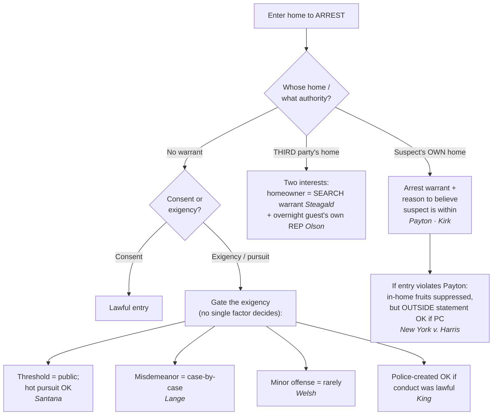

---
aliases:
  - "Arrest in the Home"
title: "Arrest in the Home"
topic: Arrest in the Home
type: doctrine
jurisdiction: Federal (U.S. Const. amend. IV); SCOTUS baseline
status: verified
related: ["[[Seizure of the Person]]", "[[Exigent Circumstances and Hot Pursuit]]", "[[Securing the Scene]]", "[[Standing to Challenge a Search]]", "[[Search Incident to Arrest]]", "[[Emergency Aid]]", "[[Curtilage]]"]
---

## The Brief

**Field-decisive question:** *May I enter this home to arrest — and what do I need?*

The home receives the Fourth Amendment's highest protection. Absent **consent** or **exigent circumstances**, police may not cross the threshold to make an arrest without a warrant: "the Fourth Amendment has drawn a firm line at the entrance to the house. Absent exigent circumstances, that threshold may not reasonably be crossed without a warrant." *[[Payton v. New York#^pin-590|Payton v. New York]]*, 445 U.S. 573, 590 (1980). A routine felony arrest does not by itself justify crossing that line.

For the suspect's **own** dwelling, *Payton* supplies the operative rule: "[a]n arrest warrant founded on probable cause implicitly carries with it the limited authority to enter a dwelling in which the suspect lives when there is reason to believe the suspect is within." 445 U.S. at 603. Two predicates ride on that one sentence — the suspect **lives** there, and there is **reason to believe** he is **present now**. So the field answer for the suspect's own home is: an **arrest warrant + reason to believe the suspect is within** (or consent, or a true exigency). Because a warrantless home entry is presumptively unreasonable, the **government bears the burden** of proving consent or a recognized exigency; the suspect need not disprove it. On appeal, suppression rulings get a **mixed standard of review** — historical facts for **clear error**, the ultimate reasonableness question (consent, exigency, "reason to believe") **de novo**.

The warrant requirement **flips** when the suspect is inside **someone else's** home. An arrest warrant protects the suspect, not the homeowner, so to enter a **third party's** home to arrest the suspect police need a **search warrant** absent exigency or consent: *[[Steagald v. United States#^pin-205|Steagald v. United States]]* held "that a search warrant must be obtained absent exigent circumstances or consent." 451 U.S. 204, 205–06 (1981). In the third-party scenario two protected interests are in play at once — the homeowner's (*Steagald*) and the overnight guest's own (*Olson*, below).

**The remedy is real but bounded.** Suppression for a *Payton* violation reaches only what the unlawful entry produced **inside** the home. Where police have **probable cause** to arrest, a *Payton* violation does **not** bar a statement the suspect later makes **outside** the home: "where the police have probable cause to arrest a suspect, the exclusionary rule does not bar the State's use of a statement made by the defendant outside of his home, even though the statement is taken after an arrest made in the home in violation of *Payton*." *[[New York v. Harris#^pin-21|New York v. Harris]]*, 495 U.S. 14, 21 (1990). A later, properly-Mirandized station-house statement, made in lawful custody supported by PC, "was [not] the fruit of having been arrested in the home rather than someplace else." *Id.* at 19.

When there is **no warrant**, the entry survives only on **consent** or a genuine **exigency** (escape, imminent evidence destruction, danger) — and the exigency is bounded by four lines of authority that run **at the same time**; no single factor decides it, and you must articulate the actual exigency:

- **The threshold is public; hot pursuit crosses it.** A suspect in her own doorway is in a "public" place and "may not defeat an arrest which has been set in motion in a public place ... by the expedient of escaping to a private place." *[[United States v. Santana#^pin-43|United States v. Santana]]*, 427 U.S. 38, 43 (1976) — but **limited by *[[Lange v. California]]*** for misdemeanor pursuits (below): after *Lange*, *Santana*'s broad fleeing-suspect language carries **felony** pursuits and genuine emergencies across the threshold, but no longer **misdemeanor** pursuits automatically.
- **Offense gravity (*Welsh*).** "[A]pplication of the exigent-circumstances exception in the context of a home entry should rarely be sanctioned when there is probable cause to believe that only a minor offense ... has been committed." *[[Welsh v. Wisconsin#^pin-753|Welsh v. Wisconsin]]*, 466 U.S. 740, 753 (1984). A minor offense drags the whole analysis toward *unreasonable*.
- **Police-created exigency (*King*).** Police do **not** forfeit the exception by lawfully "creating" the exigency, **unless** they created it "by engaging or threatening to engage in conduct that violates the Fourth Amendment." *[[Kentucky v. King]]*, 563 U.S. 452, 462 (2011). Lawful knock-and-announce that prompts occupants to destroy evidence counts; an unlawful threat that manufactures the emergency does not.
- **Misdemeanor flight is not categorical (*Lange*).** "[T]he pursuit of a fleeing misdemeanor suspect" does not "categorically ... qualif[y] as an exigent circumstance. We hold it does not." *[[Lange v. California]]*, 594 U.S. 295, 298 (2021); courts make a "case-by-case assessment of exigency." This is the *field-application* change — it is why a misdemeanor chase into a home is no longer a sure thing.

The guest is **not** rightless. An **overnight guest** has his **own** reasonable expectation of privacy in the host's home, so even the person being arrested may have standing to suppress when he is staying somewhere as a guest: "Olson's status as an overnight guest is alone enough to show that he had an expectation of privacy in the home that society is prepared to recognize as reasonable." *[[Minnesota v. Olson]]*, 495 U.S. 91, 96–97 (1990). Standing tracks the interest: the named suspect cannot invoke *Steagald* (that is the homeowner's right), but he **can** assert his own *Olson*/*Payton* privacy interest in the place he is staying. *See* [[Standing to Challenge a Search]].

The firm line has held. *[[Kirk v. Louisiana#^pin-638|Kirk v. Louisiana]]* (per curiam) reaffirms it: "police officers need either a warrant or probable cause plus exigent circumstances in order to make a lawful entry into a home," and a court that upholds the entry without assessing exigency "violate[s] *Payton*." 536 U.S. 635, 638 (2002). Probable cause to arrest, by itself, never substitutes for the warrant-or-exigency predicate.

**Flag the "reason to believe" quantum — don't anchor to one reading.** *Payton* never defined the showing behind "reason to believe the suspect is within," and it loads **two** contested predicates: reason to believe the suspect (a) **resides** there and (b) is **presently home**. The circuits divide — some read "reason to believe" as **probable cause** on both predicates; others read it as a lesser, reasonable-suspicion-like showing, reasoning that the Court pointedly did not say "probable cause." The split is unresolved at the Supreme Court, and the circuit decisions are **Persuasive (outside circuit)** — never anchor to one. For a multi-jurisdiction audience, **default to the higher (probable-cause) showing** on both predicates: it satisfies every circuit and the articulation costs nothing.

**Keep the three protected interests straight — the most common field errors live here:**

- **Don't use an arrest warrant to enter a third party's home.** That is a *Steagald* violation: you need a **search warrant** for the home, even with a valid arrest warrant for the guest inside.
- **Don't assume a guest "has no rights."** Under *Olson* an overnight guest has his **own** REP; even where the homeowner's *Steagald* right is the headline, the guest may *also* have standing of his own.
- **Don't treat "reason to believe" as a hunch.** State both predicates (resides + present) with facts behind each; default to probable cause to be safe in any circuit.
- **Don't read *Santana* as a blank check for hot pursuit.** After *Lange*, chasing a fleeing **misdemeanant** into a home is not automatically lawful.
- **Don't assume any arrest supports home exigency.** *Welsh* is the opposite — for a **minor offense**, warrantless home entry should "rarely be sanctioned."
- **Don't think a "police-created exigency" always poisons the entry.** Under *King*, only if the police created it by conduct that itself **violated or threatened to violate** the Fourth Amendment.

Finally, this is **criminal** exigency. Entry merely to render aid is a different, **non-criminal** justification governed by an objective-reasonableness standard — do not conflate emergency-aid entry with entry to make an arrest. *See* [[Emergency Aid]]; and note there is **no** freestanding "community caretaking" power to cross a home's threshold (*[[Caniglia v. Strom]]*).

## Key cases

| Case (Bluebook) | Holding in one line | Authority weight | Treatment | CourtListener |
|---|---|---|---|---|
| *[[Payton v. New York]]*, 445 U.S. 573 (1980) | Warrantless, nonconsensual entry into a suspect's **own** home for a routine felony arrest is presumptively unreasonable; an **arrest warrant + reason to believe the suspect is within** authorizes entry. | Binding — SCOTUS | Good (2026-06-30) | [link](https://www.courtlistener.com/opinion/110235/payton-v-new-york/) |
| *[[United States v. Santana]]*, 427 U.S. 38 (1976) | A suspect in her own doorway is in a **public** place; she cannot defeat a public-place arrest by retreating inside, and **hot pursuit** justifies the warrantless entry. | Binding — SCOTUS | Good; **limited by *[[Lange v. California]]*** (misdemeanor pursuit no longer categorical) | [link](https://www.courtlistener.com/opinion/109504/united-states-v-santana/) |
| *[[Steagald v. United States]]*, 451 U.S. 204 (1981) | To arrest the subject of an arrest warrant inside a **third party's** home, police need a **search warrant** (absent exigency or consent) — the arrest warrant protects the suspect, not the homeowner. | Binding — SCOTUS | Good (2026-06-30) | [link](https://www.courtlistener.com/opinion/110464/steagald-v-united-states/) |
| *[[New York v. Harris]]*, 495 U.S. 14 (1990) | With **probable cause** to arrest, a *Payton* violation does **not** bar a statement the suspect makes **outside** the home; the remedy reaches only what was gathered inside. *(Limits Payton's remedy.)* | Binding — SCOTUS | Good (2026-06-30) | [link](https://www.courtlistener.com/opinion/112413/new-york-v-harris/) |
| *[[Kirk v. Louisiana]]*, 536 U.S. 635 (2002) (per curiam) | Reaffirms *Payton*: police need **a warrant or probable cause plus exigent circumstances** to enter a home to arrest; PC to arrest alone is not enough. | Binding — SCOTUS | Good (2026-06-30) | [link](https://www.courtlistener.com/opinion/121167/kirk-v-louisiana/) |
| *[[Lange v. California]]*, 594 U.S. 295 (2021) | Pursuit of a fleeing **misdemeanor** suspect does **not categorically** justify warrantless home entry; courts apply a **case-by-case** exigency assessment. | Binding — SCOTUS | Good (2026-06-30) | [link](https://www.courtlistener.com/opinion/4894407/lange-v-california/) |

## Related cases across doctrines

These cases are treated in full elsewhere but bear on this doctrine — the arrest-in-the-home rules — framed here for it.

| Case | Relevance to arrest in the home | Primary treatment | CourtListener |
|---|---|---|---|
| *[[Welsh v. Wisconsin]]*, 466 U.S. 740 (1984) | Caps the exigency: the **gravity of the offense** is a key factor, and warrantless home entry for a **minor offense** should "rarely be sanctioned" — the seriousness of the crime cuts directly against a warrantless home arrest. | [[Exigent Circumstances and Hot Pursuit]] | [opinion](https://www.courtlistener.com/opinion/111173/welsh-v-wisconsin/) |
| *[[Kentucky v. King]]*, 563 U.S. 452 (2011) | Police do **not** forfeit the exigency exception by lawfully "creating" it; only conduct that itself violates/threatens the Fourth Amendment poisons the entry — the police-created-exigency limit applied to home-arrest entries. | [[Exigent Circumstances and Hot Pursuit]] | [opinion](https://www.courtlistener.com/opinion/216733/kentucky-v-king/) |
| *[[Minnesota v. Olson]]*, 495 U.S. 91 (1990) | An **overnight guest** has his **own** reasonable expectation of privacy in the host's home — so the person being arrested may have standing to challenge a warrantless entry; the standing counterpart to *Payton*'s protection. | [[Standing to Challenge a Search]] | [opinion](https://www.courtlistener.com/opinion/112416/minnesota-v-olson/) |
| *[[Sabbath v. United States]]*, 391 U.S. 585 (1968) | The **manner** of a home-arrest entry matters: opening a closed but unlocked door without announcing authority and purpose is an unannounced "breaking" governed by the knock-and-announce rule — the announcement overlay on a lawful arrest entry. | [[The Warrant Requirement]] | [opinion](https://www.courtlistener.com/opinion/107718/sabbath-v-united-states/) |
| *[[Vale v. Louisiana]]*, 399 U.S. 30 (1970) | A street arrest on the front steps does **not** let officers search the house as "incident" to it and supplies **no** exigency of its own; the State bears the burden to justify any warrantless dwelling search — the spatial/burden limit bracketing the home-arrest power. | [[Search Incident to Arrest]] | [opinion](https://www.courtlistener.com/opinion/108183/vale-v-louisiana/) |
| *[[Maryland v. Buie]]*, 494 U.S. 325 (1990) | When officers lawfully arrest inside a home, they may make a limited protective sweep — automatically of spaces immediately adjoining the place of arrest, and beyond that only on articulable facts suggesting a dangerous person is present; the in-home arrest power and its protective scope are two halves of the same encounter. | [[Securing the Scene]] | [opinion](https://www.courtlistener.com/opinion/112384/maryland-v-buie/) |
| *[[Minnesota v. Carter]]*, 525 U.S. 83 (1998) | The flip side of *Olson*: a short-term visitor present in another's home for a purely commercial purpose, with no overnight stay or prior relationship, has **no** reasonable expectation of privacy — so unlike the overnight guest, he cannot invoke *Payton*/*Olson* to suppress a warrantless entry that seizes him. | [[Standing to Challenge a Search]] | [opinion](https://www.courtlistener.com/opinion/118249/minnesota-v-carter/) |
| *[[Warden v. Hayden]]*, 387 U.S. 294 (1967) | Foundational hot-pursuit authority: warrantless entry into a house to seize a fleeing armed robber is reasonable where the exigencies (danger, escape) leave no time for a warrant — the felony-pursuit baseline that *Santana* builds on and that *Lange* leaves intact for genuine emergencies. | [[Exigent Circumstances and Hot Pursuit]] | [opinion](https://www.courtlistener.com/opinion/107465/warden-maryland-penitentiary-v-hayden/) |
| *[[Brigham City v. Stuart]]*, 547 U.S. 398 (2006) | Marks the boundary of this doctrine: police may cross the threshold without a warrant to render emergency aid (objectively reasonable basis to believe an occupant is seriously injured/threatened) — a **non-criminal** justification distinct from arrest exigency; do not conflate aid entry with entry to make an arrest. | [[Emergency Aid]] | [opinion](https://www.courtlistener.com/opinion/145654/brigham-city-v-stuart/) |
| *[[Caniglia v. Strom]]*, 593 U.S. 194 (2021) | There is **no** freestanding "community caretaking" exception for the home — closing off an end-run around *Payton*. To cross the threshold non-consensually police still need a warrant, a recognized exigency, or true emergency aid; caretaking alone will not do. | [[Emergency Aid]] | [opinion](https://www.courtlistener.com/opinion/4883694/caniglia-v-strom/) |
| *[[Case v. Montana]]*, 607 U.S. ___ (2026) | Sharpens the **emergency-aid** boundary: a warrantless home entry to render aid needs only *Brigham City*'s "objectively reasonable basis," **not** the criminal-investigative probable cause that governs an arrest entry — a non-criminal justification not to be conflated with arrest exigency. | [[Emergency Aid]] | [opinion](https://www.courtlistener.com/opinion/10774335/case-v-montana/) |
| *[[Illinois v. McArthur]]*, 531 U.S. 326 (2001) | The less-intrusive alternative to a warrantless arrest entry: with PC that a home holds contraband, officers may temporarily bar a resident from re-entering his own home (or enter only to prevent destruction) while they obtain a warrant — a reasonable middle path that respects *Payton*'s firm line at the threshold. | [[Securing the Scene]] | [opinion](https://www.courtlistener.com/opinion/118405/illinois-v-mcarthur/) |
| *[[Segura v. United States]]*, 468 U.S. 796 (1984) | After a *Payton*-problematic entry, officers may secure the premises from within pending a warrant; evidence later seized under a warrant supported wholly by independent information is admissible — the securing/independent-source counterpart to the firm-line rule. | [[Securing the Scene]] | [opinion](https://www.courtlistener.com/opinion/111259/segura-v-united-states/) |
| *[[Mincey v. Arizona]]*, 437 U.S. 385 (1978) | No "murder scene" exception: the gravity/seriousness of the suspected offense does not by itself manufacture exigency to enter or remain in a home — the seriousness-cuts-both-ways companion to *Welsh* on the exigency analysis. | [[Emergency Aid]] | [opinion](https://www.courtlistener.com/opinion/109905/mincey-v-arizona/) |

## Recent developments

The home-arrest rules have held steady at their core, but the *Payton* "reason to believe" quantum remains the live battleground and the **constructive-entry** question is an open frontier. The circuit decisions below are **Binding in-circuit** within their own circuits and **Persuasive (outside circuit)** elsewhere — never state a circuit holding as nationwide law; genuine splits are flagged.

- **Constructive-entry circuit split — *United States v. Maez* (10th Cir.); contra *United States v. Berkowitz* (7th Cir.); *Knight v. Jacobson* (11th Cir.).** ⚖ Circuit split. Circuits divide on whether *Payton* reaches "constructive entry" — police using coercive tactics (surrounding the home, drawn weapons, loudspeakers) to force a suspect out for arrest at/beyond the threshold without physically crossing it. The **Tenth Circuit** (*Maez*, 872 F.2d 1444) treats such coercion as a *Payton* in-home arrest; the **Seventh Circuit** (*Berkowitz*, 927 F.2d 1376) and **Eleventh Circuit** (*Knight v. Jacobson*, 300 F.3d 1272) require the officer's body to cross the threshold. **Binding in-circuit** in each; **Persuasive (outside circuit)** elsewhere; unresolved frontier/split, not new SCOTUS law. [Maez](https://www.courtlistener.com/opinion/521939/united-states-v-arthur-maez/); [Berkowitz](https://www.courtlistener.com/opinion/557342/united-states-v-marvin-berkowitz/).
- **United States v. Brinkley (4th Cir. 2020).** ⚖ Circuit split. Holds that *Payton*'s "reason to believe the suspect is within" requires **probable cause on BOTH predicates** — PC the suspect resides at the home AND PC he is presently inside; "generic signs of life" and a resident's nervousness are not enough. Suppressed the entry where officers had only a well-founded suspicion he sometimes stayed there. **Binding in-circuit — 4th Cir.; Persuasive (outside circuit).** "the quantum of proof necessary to satisfy Payton has divided the circuits, with some construing 'reason to believe' to demand less than probable cause and others equating the two standards" (980 F.3d at 387). [opinion](https://www.courtlistener.com/opinion/4805913/united-states-v-kendrick-brinkley/).
- **United States v. Vasquez-Algarin (3d Cir. 2016).** ⚖ Circuit split. Holds "reason to believe" under *Payton* "embodies the same standard of reasonableness inherent in probable cause," requiring PC that the arrestee both resides at and is present in the dwelling before forcing entry on an arrest warrant alone — joining the 5th, 6th, 7th, and 9th Circuits against the 2d, 10th, and D.C. Circuits' lesser-standard view. **Binding in-circuit — 3d Cir.; Persuasive (outside circuit).** "we join the Fifth, Sixth, Seventh and Ninth Circuits in holding that Payton's 'reason to believe' language amounts to a probable-cause standard." (821 F.3d at 477). [opinion](https://www.courtlistener.com/opinion/3199633/united-states-v-johnny-vasquez-algarin/).

## Visual

## Sources
- *Payton v. New York*, 445 U.S. 573 (1980) — https://www.courtlistener.com/opinion/110235/payton-v-new-york/ — pinpoints: 576, 590, 603.
- *United States v. Santana*, 427 U.S. 38 (1976) — https://www.courtlistener.com/opinion/109504/united-states-v-santana/ — pinpoints: 42, 43.
- *Steagald v. United States*, 451 U.S. 204 (1981) — https://www.courtlistener.com/opinion/110464/steagald-v-united-states/ — pinpoints: 205–06.
- *New York v. Harris*, 495 U.S. 14 (1990) — https://www.courtlistener.com/opinion/112413/new-york-v-harris/ — pinpoints: 17, 19, 21.
- *Kirk v. Louisiana*, 536 U.S. 635 (2002) (per curiam) — https://www.courtlistener.com/opinion/121167/kirk-v-louisiana/ — pinpoints: 636, 638.
- *Welsh v. Wisconsin*, 466 U.S. 740 (1984) — https://www.courtlistener.com/opinion/111173/welsh-v-wisconsin/ — pinpoints: 753, 755.
- *Minnesota v. Olson*, 495 U.S. 91 (1990) — https://www.courtlistener.com/opinion/112416/minnesota-v-olson/ — pinpoints: 96–97.
- *Kentucky v. King*, 563 U.S. 452 (2011) — https://www.courtlistener.com/opinion/216733/kentucky-v-king/ — pinpoint: 462.
- *Lange v. California*, 594 U.S. 295 (2021) — https://www.courtlistener.com/opinion/4894407/lange-v-california/ — pinpoint: 298.
- *Sabbath v. United States*, 391 U.S. 585 (1968) — https://www.courtlistener.com/opinion/107718/sabbath-v-united-states/ — pinpoints: 585–86, 590.
- *Vale v. Louisiana*, 399 U.S. 30 (1970) — https://www.courtlistener.com/opinion/108183/vale-v-louisiana/ — pinpoints: 33, 34, 35.
- *Case v. Montana*, 607 U.S. ___ (2026) (No. 24-624) — https://www.courtlistener.com/opinion/10774335/case-v-montana/ — pinpoints: slip op. at 7, 8, 9, 10–11.
- *Maryland v. Buie*, 494 U.S. 325 (1990) — https://www.courtlistener.com/opinion/112384/maryland-v-buie/.
- *Minnesota v. Carter*, 525 U.S. 83 (1998) — https://www.courtlistener.com/opinion/118249/minnesota-v-carter/.
- *Warden v. Hayden*, 387 U.S. 294 (1967) — https://www.courtlistener.com/opinion/107465/warden-maryland-penitentiary-v-hayden/.
- *Brigham City v. Stuart*, 547 U.S. 398 (2006) — https://www.courtlistener.com/opinion/145654/brigham-city-v-stuart/.
- *Caniglia v. Strom*, 593 U.S. 194 (2021) — https://www.courtlistener.com/opinion/4883694/caniglia-v-strom/.
- *Illinois v. McArthur*, 531 U.S. 326 (2001) — https://www.courtlistener.com/opinion/118405/illinois-v-mcarthur/.
- *Segura v. United States*, 468 U.S. 796 (1984) — https://www.courtlistener.com/opinion/111259/segura-v-united-states/.
- *Mincey v. Arizona*, 437 U.S. 385 (1978) — https://www.courtlistener.com/opinion/109905/mincey-v-arizona/.
- *United States v. Maez*, 872 F.2d 1444 (10th Cir. 1989) — https://www.courtlistener.com/opinion/521939/united-states-v-arthur-maez/.
- *United States v. Berkowitz*, 927 F.2d 1376 (7th Cir. 1991) — https://www.courtlistener.com/opinion/557342/united-states-v-marvin-berkowitz/.
- *United States v. Brinkley*, 980 F.3d 377 (4th Cir. 2020) — https://www.courtlistener.com/opinion/4805913/united-states-v-kendrick-brinkley/.
- *United States v. Vasquez-Algarin*, 821 F.3d 467 (3d Cir. 2016) — https://www.courtlistener.com/opinion/3199633/united-states-v-johnny-vasquez-algarin/.
