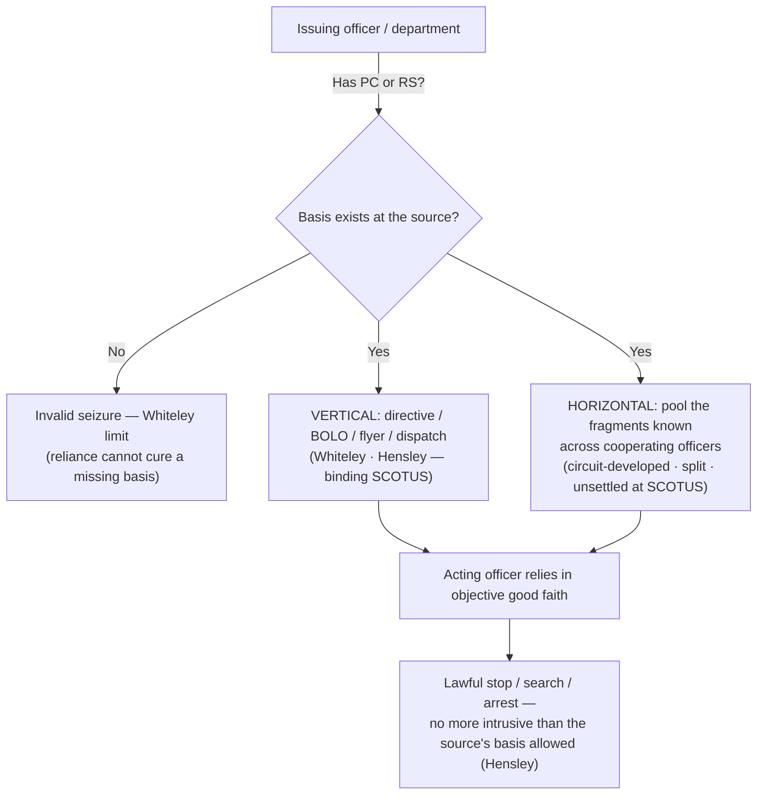

---
aliases:
  - "Collective Knowledge and the Fellow-Officer Rule"
title: "Collective Knowledge and the Fellow-Officer Rule"
topic: Collective Knowledge and the Fellow-Officer Rule
type: doctrine
amendment: "U.S. Const. amend. IV"
jurisdiction: Federal (U.S. Const. amend. IV); SCOTUS baseline
status: verified
related:
  - "[[Terry Stops and Reasonable Suspicion]]"
  - "[[Probable Cause and Reasonable Suspicion]]"
  - "[[Seizure of the Person]]"
  - "[[Traffic Stops]]"
  - "[[The Exclusionary Rule]]"
---

# Collective Knowledge and the Fellow-Officer Rule

## The Brief

**Field-decisive question:** *Can I act on another officer's knowledge — and whose knowledge counts?*

**Black-letter rule.** Under the **collective-knowledge (fellow-officer) doctrine**, the [[Probable Cause and Reasonable Suspicion|probable cause or reasonable suspicion]] held by one officer can be **imputed** to another who acts at his direction. An officer who makes a stop or arrest in **objective reliance** on a bulletin, flyer, or radio dispatch is presumed to act on the requisite quantum and need not personally possess all the underlying facts. But the doctrine **pools knowledge — it never manufactures it**: if the issuing officer or department in fact lacked the necessary basis, the resulting [[Seizure of the Person|seizure]] is invalid regardless of the acting officer's good faith. The doctrine supplies the *who-knew-what* layer beneath PC/RS — it imputes the quantum across officers and reaches **searches, warrants, and arrests**, not only seizures of persons.

**Two distinct modes — keep them apart.** *Vertical* imputation runs along a chain of command or communication: an officer who **has** PC/RS issues a directive (BOLO, flyer, dispatch), and the acting officer may execute it without independently knowing the facts. *Horizontal* pooling instead aggregates the fragments **known across cooperating officers** working a common investigation to satisfy the threshold collectively. The two prongs rest on very different footing, and conflating them is the doctrine's central trap.

**The vertical prong is settled SCOTUS law (** [[Whiteley v. Warden|*Whiteley*]] **·** [[United States v. Hensley|*Hensley*]] **).** [[Whiteley v. Warden|*Whiteley v. Warden*]] establishes that officers may act on a fellow officer's bulletin and **assume** the issuer had probable cause — but the validity of the arrest still turns on PC existing **somewhere in the originating chain**: "an otherwise illegal arrest cannot be insulated from challenge by the decision of the instigating officer to rely on fellow officers to make the arrest." [[Whiteley v. Warden#^pin-568|401 U.S. at 568]]. No basis at the source means no valid seizure downstream — this is **the *Whiteley* limit**. [[United States v. Hensley|*United States v. Hensley*]] extends the rule to **Terry stops**: reliance on a flyer justifies a stop "if a flyer or bulletin has been issued on the basis of articulable facts supporting a reasonable suspicion that the wanted person has committed an offense ... If the flyer has been issued in the absence of a reasonable suspicion, then a stop in the objective reliance upon it violates the Fourth Amendment." 469 U.S. at 232–33. *Hensley* also fixes an **intrusiveness ceiling** — the stop must be "not significantly more intrusive than would have been permitted the issuing department" (469 U.S. at 233): the acting officer inherits the *scope* the source's basis would authorize and cannot exceed it. See [[Terry Stops and Reasonable Suspicion]].

**The horizontal prong is unsettled at SCOTUS — and *Pringle* is not authority for it.** No single SCOTUS holding adopts a **pure horizontal-pooling rule**; *Whiteley* and *Hensley* squarely supply only the vertical, directive-based prong. The imputation of pooled/aggregated reasonable suspicion among cooperating officers has been built out by the federal courts of appeals, where it remains **circuit-developed and split** (see Recent developments). A common miscitation is [[Maryland v. Pringle|*Maryland v. Pringle*]]: *Pringle* is an **aggregate / particularized-probable-cause-as-to-a-person** case — PC "must be particularized with respect to the person" (540 U.S. at 371), satisfied by the reasonable inference of a "common enterprise among the three men" (id. at 373). It aggregates facts about **suspects**, not knowledge across **officers**, and contains **no** collective-knowledge, fellow-officer, or imputation reasoning. It is therefore **not** SCOTUS support for horizontal pooling; its home is [[Probable Cause and Reasonable Suspicion]], and it appears below only to be expressly **distinguished**.

**Imputed *and mistaken* collective knowledge (** [[Herring v. United States|*Herring*]] **).** The fellow-officer rule's flip side is what happens when the pooled information is **wrong**. In [[Herring v. United States|*Herring v. United States*]], an officer arrested in reliance on a neighboring department's records that **erroneously** showed an outstanding warrant (it had been recalled months earlier and never purged). The seizure rested on imputed — but mistaken — collective knowledge, yet the Court declined to suppress: exclusion turns on the **culpability** of the police conduct, because "[t]o trigger the exclusionary rule, police conduct must be sufficiently deliberate that exclusion can meaningfully deter it, and sufficiently culpable that such deterrence is worth the price paid by the justice system." [[Herring v. United States#^pin-144|555 U.S. at 144]]. Isolated, attenuated bookkeeping negligence does not warrant suppression; deliberate, reckless, or **recurring/systemic** error in the shared records can. This is where the fellow-officer rule meets [[The Exclusionary Rule]].

**Burden, review, and remedy.** On a motion to suppress, the **defendant/movant** bears the initial burden of establishing a Fourth Amendment violation (and standing/REP). Where the government invokes the collective-knowledge doctrine to justify a warrantless stop/search/arrest, the **government** bears the burden of showing that the imputing or directing officer (the **source**) actually possessed the requisite probable cause or reasonable suspicion. On appeal, the existence of PC/RS is reviewed **de novo**, while the district court's underlying historical findings of fact are reviewed for **clear error**. [[Ornelas v. United States|*Ornelas v. United States*]], 517 U.S. 690, 699 (1996). **Remedy:** if the source lacked the basis (or the scope was exceeded), the seizure is unlawful and its fruits are suppressed unless an exclusionary-rule exception applies (*Herring* good-faith; see [[The Exclusionary Rule]]).

**Pitfalls.**

- **Assuming the BOLO cures a missing factual basis.** A flyer, dispatch, or warrant request does not *create* PC or RS — it merely transmits whatever the issuer actually had. If suppression litigation traces the bulletin back to an empty factual basis, the seizure falls (*[[Whiteley v. Warden|Whiteley]]*; *[[United States v. Hensley|Hensley]]*). This recurs in dispatch-driven [[Traffic Stops]], where the acting officer's stop is only as good as the issuer's underlying basis.
- **Conflating vertical reliance with horizontal pooling.** Reliance on a directive (vertical) is anchored in binding SCOTUS authority; aggregating scattered, uncommunicated facts among on-scene officers (horizontal) rests on **split** circuit law. Do not present pooled-knowledge theories as SCOTUS-blessed, and do not cite *[[Maryland v. Pringle|Pringle]]* for them.
- **Forgetting the intrusiveness ceiling.** Under *[[United States v. Hensley|Hensley]]*, the acting officer inherits the *scope* the source's quantum would justify; escalating beyond an RS stop on the strength of a flyer issued only on RS is unsupported.

## Key cases

| Case (Bluebook) | Holding (one line) | Weight | Treatment | CourtListener | Case page |
|---|---|---|---|---|---|
| *Whiteley v. Warden*, 401 U.S. 560 (1971) | Officers may rely on a radio bulletin and assume the issuer had PC; but if the issuer in fact lacked PC, reliance on fellow officers cannot cure the missing basis — the quantum is measured **at the source** (the vertical anchor; *Whiteley* limit). | Binding — SCOTUS | good *(2026-06-30)* | [opinion](https://www.courtlistener.com/opinion/108297/whiteley-v-warden-wyoming-state-penitentiary/) | [[Whiteley v. Warden]] |
| *United States v. Hensley*, 469 U.S. 221 (1985) | Extends *Whiteley* to Terry stops: a stop in reliance on a wanted flyer is lawful only if the issuing department had reasonable suspicion grounded in articulable facts — and the stop may be no more intrusive than the source's basis would permit. | Binding — SCOTUS | good *(2026-06-30)* | [opinion](https://www.courtlistener.com/opinion/111294/united-states-v-hensley/) | [[United States v. Hensley]] |
| *Herring v. United States*, 555 U.S. 135 (2009) | Imputed/mistaken collective knowledge: arresting on another department's records that erroneously showed an outstanding warrant does **not** require suppression where the recordkeeping error was isolated negligence rather than deliberate, reckless, or systemic conduct (non-exclusive Key — also Key on [[The Exclusionary Rule]]). | Binding — SCOTUS | good *(2026-06-30)* | [opinion](https://www.courtlistener.com/opinion/145922/herring-v-united-states/) | [[Herring v. United States]] |

## Related cases across doctrines

These cases are treated in full on other doctrine pages but bear on the collective-knowledge / fellow-officer rule, framed here for it.

| Case (Bluebook) | Relevance to the fellow-officer rule | Primary home (doctrine) | Treatment | CourtListener | Case page |
|---|---|---|---|---|---|
| *Maryland v. Pringle*, 540 U.S. 366 (2003) | **Aggregate / particularized probable cause as to a person — NOT horizontal pooling across officers.** PC "must be particularized with respect to the person" (at 371), satisfied by the reasonable inference of a "common enterprise among the three men" (at 373); the opinion aggregates facts about *suspects*, not knowledge across *officers*, and contains no collective-knowledge or imputation reasoning. Listed here only to be **expressly distinguished** from the fellow-officer rule. | [[Probable Cause and Reasonable Suspicion]] | good *(2026-06-30)* | [opinion](https://www.courtlistener.com/opinion/131150/maryland-v-pringle/) | [[Maryland v. Pringle]] |
| *Arizona v. Evans*, 514 U.S. 1 (1995) | The database face of fellow-officer reliance: reliance on a mistaken arrest record in the shared law-enforcement system; where the error was a **court clerk's** (not police), the good-faith exception applied and exclusion did not follow — the "source must actually have had it" problem when the pooled information is wrong. | [[The Exclusionary Rule]] | good *(2026-06-30)* | [opinion](https://www.courtlistener.com/opinion/117905/arizona-v-evans/) | [[Arizona v. Evans]] |
| *Utah v. Strieff*, 579 U.S. 232 (2016) | The warrant-in-the-system scenario behind fellow-officer reliance: discovery of a valid pre-existing arrest warrant during an unlawful stop was an intervening circumstance that **attenuated** the taint — bears on how downstream officers may act on warrants/records issued by others. | [[The Exclusionary Rule]] | good *(2026-06-30)* | [opinion](https://www.courtlistener.com/opinion/8176208/utah-v-strieff/) | [[Utah v. Strieff]] |

## Recent developments

Since *Whiteley* and *Hensley*, the federal courts of appeals have done most of the work fleshing out the doctrine — extending vertical imputation across agencies and into the *Rodriguez* prolongation context, while **sharply splitting** over whether "horizontal" aggregation of *uncommunicated* facts is permissible. **There is no controlling SCOTUS resolution of that split.** The decisions below are circuit law — binding only within their own circuits, persuasive elsewhere — and none states nationwide law. None of these cases has a standalone case page (page-less; named in plain text).

- **United States v. Trent (6th Cir. 2026)** — *Persuasive only — non-precedential* (6th Cir.; unpublished). Applying the collective-knowledge doctrine at the *Rodriguez* intersection, the court held that reasonable suspicion to prolong a traffic stop for a canine sniff may be imputed across multiple law-enforcement agencies even where the stopping officer was "wholly unaware" of the specific facts establishing that suspicion. Posture: this opinion is unpublished and **non-precedential** within the Sixth Circuit (role: **expand — vertical imputation across agencies**). [opinion](https://www.courtlistener.com/opinion/10855903/united-states-v-mark-anthony-trent/)
- **United States v. Massenburg (4th Cir. 2011)** — *Binding in-circuit — 4th Cir.* (persuasive elsewhere). The court held the collective-knowledge doctrine extends **only** to information or instructions communicated ("vertically") to the acting officers, and **declined** to adopt the expansive "horizontal" theory aggregating uncommunicated facts, reasoning that after-the-fact aggregation strays from the doctrine's purpose. ⚖ **Circuit split.** "No case from the Supreme Court or from our own court has ever expanded the collective-knowledge doctrine beyond the context of information or instructions communicated ('vertically') to acting officers. Some of our sister courts have authorized 'horizontal' aggregation of uncommunicated information." 654 F.3d at 493–94 (role: **narrow — rejects horizontal aggregation**). [opinion](https://www.courtlistener.com/opinion/223188/united-states-v-massenburg/)
- **United States v. Chavez (10th Cir. 2008)** — *Binding in-circuit — 10th Cir.* (persuasive elsewhere). Upheld a stop where a federal agent with probable cause asked a state officer to stop a suspect without communicating the reasons — applying **vertical** collective knowledge. The court did **not need to reach** the freestanding horizontal-pooling question because one officer (Mowduk) already possessed all the probable-cause components. ⚖ **Circuit split** (left open). "Rather than a horizontal pooling of discrete pieces of information, one officer here (Mowduk) had all the requisite probable cause components; the question then is whether that information can be imputed vertically to another officer (Patrolman Chavez)." 534 F.3d at 1347–48 (role: **split — leaves horizontal open**). [opinion](https://www.courtlistener.com/opinion/171034/united-states-v-chavez/)
- **United States v. Ramirez (9th Cir. 2007)** — *Binding in-circuit — 9th Cir.* (persuasive elsewhere). Held the collective-knowledge doctrine imposes **no requirement** about the content of the communication between officers — the directing officer need not tell the acting officer *why* to stop/arrest; it is enough that the directing officer (or investigating team) had the requisite basis. The lead opinion on the "communication content" question the split turns on. ⚖ **Circuit split.** "we have applied the collective knowledge doctrine 'regardless of whether [any] information [giving rise to probable cause] was actually communicated to' the officer conducting the stop, search, or arrest." 473 F.3d at 1032–33 (role: **expand — content-of-communication**). [opinion](https://www.courtlistener.com/opinion/3040421/united-states-v-ramirez/)

## Visual

## Sources

- *Whiteley v. Warden*, 401 U.S. 560 (1971) — https://www.courtlistener.com/opinion/108297/whiteley-v-warden-wyoming-state-penitentiary/ — pinpoint: 568.
- *United States v. Hensley*, 469 U.S. 221 (1985) — https://www.courtlistener.com/opinion/111294/united-states-v-hensley/ — pinpoints: 232–33, 233.
- *Herring v. United States*, 555 U.S. 135 (2009) — https://www.courtlistener.com/opinion/145922/herring-v-united-states/ — pinpoint: 144.
- *Maryland v. Pringle*, 540 U.S. 366 (2003) — https://www.courtlistener.com/opinion/131150/maryland-v-pringle/ — pinpoints: 371, 373 *(aggregate/particularized PC; home = [[Probable Cause and Reasonable Suspicion]]; distinguished, NOT horizontal pooling)*.
- *Arizona v. Evans*, 514 U.S. 1 (1995) — https://www.courtlistener.com/opinion/117905/arizona-v-evans/ *(home = [[The Exclusionary Rule]])*.
- *Utah v. Strieff*, 579 U.S. 232 (2016) — https://www.courtlistener.com/opinion/8176208/utah-v-strieff/ *(home = [[The Exclusionary Rule]])*.
- *Ornelas v. United States*, 517 U.S. 690 (1996) — https://www.courtlistener.com/opinion/118030/ornelas-v-united-states/ — pinpoint: 699 *(de novo / clear-error standard of review)*.
- *United States v. Trent* (6th Cir. 2026) — https://www.courtlistener.com/opinion/10855903/united-states-v-mark-anthony-trent/ *(Persuasive only — non-precedential; page-less)*.
- *United States v. Massenburg*, 654 F.3d 480 (4th Cir. 2011) — https://www.courtlistener.com/opinion/223188/united-states-v-massenburg/ — pinpoint: 493–94 *(page-less)*.
- *United States v. Chavez*, 534 F.3d 1338 (10th Cir. 2008) — https://www.courtlistener.com/opinion/171034/united-states-v-chavez/ — pinpoint: 1347–48 *(page-less)*.
- *United States v. Ramirez*, 473 F.3d 1027 (9th Cir. 2007) — https://www.courtlistener.com/opinion/3040421/united-states-v-ramirez/ — pinpoint: 1032–33 *(page-less; distinct from the warrant-execution* United States v. Ramirez*)*.
