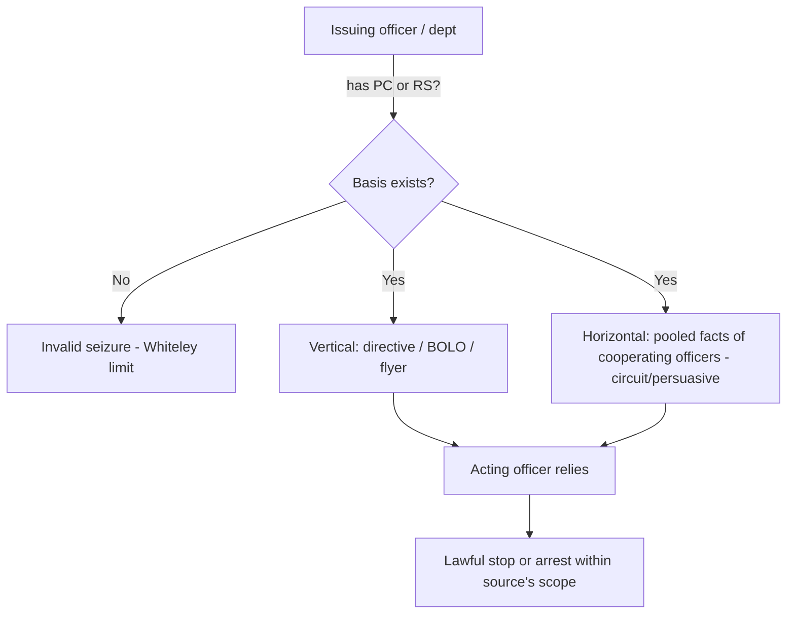

---
aliases:
  - "Collective Knowledge and the Fellow-Officer Rule"
topic: Collective Knowledge and the Fellow-Officer Rule
type: doctrine
jurisdiction: Federal (U.S. Const. amend. IV); SCOTUS baseline
status: verified
related:
  - "[[Terry Stops and Reasonable Suspicion]]"
  - "[[Probable Cause and Reasonable Suspicion]]"
  - "[[Seizure of the Person]]"
  - "[[Traffic Stops]]"
---

# Collective Knowledge and the Fellow-Officer Rule

## Rule

Under the collective-knowledge (fellow-officer) doctrine, the [[Probable Cause and Reasonable Suspicion|probable cause or reasonable suspicion]] held by one officer can be imputed to another who acts at his direction. An officer who makes a stop or arrest in objective reliance on a bulletin, flyer, or radio dispatch is presumed to be acting on the requisite quantum, and need not personally possess all the underlying facts. But the doctrine pools knowledge — it never manufactures it: if the issuing officer or department in fact lacked the necessary basis, the resulting [[Seizure of the Person|seizure]] is invalid regardless of the acting officer's good-faith reliance.

## Key cases

| Case | Holding (one line) | Weight | CourtListener |
|---|---|---|---|
| *Whiteley v. Warden*, 401 U.S. 560 (1971) | Officers may rely on a radio bulletin and assume the issuer had PC; but if the issuer lacked PC, reliance on fellow officers cannot cure the missing basis. | SCOTUS — binding | [opinion](https://www.courtlistener.com/opinion/108297/whiteley-v-warden-wyoming-state-penitentiary/) |
| *United States v. Hensley*, 469 U.S. 221 (1985) | Extends Whiteley to Terry stops: a stop in reliance on a wanted flyer is lawful only if the issuing department had reasonable suspicion grounded in articulable facts. | SCOTUS — binding | [opinion](https://www.courtlistener.com/opinion/111294/united-states-v-hensley/) |

## Related cases across doctrines

These cases are treated in full on other doctrine pages but bear on the collective-knowledge/fellow-officer rule, framed for it here.

| Case | Relevance to the collective-knowledge / fellow-officer rule | Primary treatment | CourtListener |
|---|---|---|---|
| *Herring v. United States*, 555 U.S. 135 (2009) | The fellow-officer rule's flip side: when an officer arrests in reliance on a warrant that another department's records erroneously showed as outstanding, the seizure rests on imputed (mistaken) collective knowledge — suppression turns on whether the recordkeeping error was deliberate/reckless/systemic rather than isolated negligence. | [[The Exclusionary Rule]] | [opinion](https://www.courtlistener.com/opinion/145922/herring-v-united-states/) |
| *Arizona v. Evans*, 514 U.S. 1 (1995) | Reliance on a mistaken arrest record carried in the shared law-enforcement database is the database face of fellow-officer reliance; where the error was a court clerk's (not police), the good-faith exception applied and exclusion did not follow — illustrating Whiteley's "the source must actually have had it" problem when the pooled information is wrong. | [[The Exclusionary Rule]] | [opinion](https://www.courtlistener.com/opinion/117905/arizona-v-evans/) |
| *Utah v. Strieff*, 579 U.S. 232 (2016) | The classic warrant-in-the-system scenario behind fellow-officer reliance: discovery of a valid pre-existing arrest warrant during an unlawful stop was an intervening circumstance that attenuated the taint — relevant to how downstream officers may act on warrants/records issued by others. | [[The Exclusionary Rule]] | [opinion](https://www.courtlistener.com/opinion/8176208/utah-v-strieff/) |
| *Maryland v. Pringle*, 540 U.S. 366, 371-74 (2003) | On the horizontal-pooling side: officers working a scene aggregate the facts each observes (drugs and cash in a car, no occupant claiming them) to reach probable cause collectively to arrest all occupants — the threshold the fellow-officer rule then imputes across the cooperating officers. | [[Probable Cause and Reasonable Suspicion]] | [opinion](https://www.courtlistener.com/opinion/131150/maryland-v-pringle/) |

## Nuances & limits

- **Two distinct modes.** *Vertical* imputation runs along a chain of command or communication: an officer-with-PC/RS issues a directive (BOLO, flyer, dispatch), and the acting officer may execute it without independently knowing the facts. *Horizontal* pooling aggregates the facts known across cooperating officers working a common investigation to satisfy the threshold collectively. Note the doctrine's scope: it supplies the *who-knew-what* layer beneath PC/RS — it imputes the quantum across officers and applies to searches, warrants, and arrests, not only to seizures of persons.
- **The Whiteley limit (source must actually have it).** *Whiteley* makes clear that "an otherwise illegal arrest cannot be insulated from challenge by the decision of the instigating officer to rely on fellow officers to make the arrest" (401 U.S. at 568). No basis at the source means no valid seizure downstream.
- **Hensley's RS extension and intrusiveness cap.** *Hensley* holds that reliance on a flyer justifies a stop "if a flyer or bulletin has been issued on the basis of articulable facts supporting a reasonable suspicion that the wanted person has committed an offense ... If the flyer has been issued in the absence of a reasonable suspicion, then a stop in the objective reliance upon it violates the Fourth Amendment" (469 U.S. at 232-33). The Court further conditioned admissibility on the stop being "not significantly more intrusive than would have been permitted the issuing department" (469 U.S. at 233) — the acting officer cannot exceed the scope the source's basis would have authorized. See [[Terry Stops and Reasonable Suspicion]].
- **Horizontal pooling is largely circuit-developed (persuasive).** No single SCOTUS holding adopts a pure horizontal-pooling rule; the imputation of pooled/aggregated reasonable suspicion among cooperating officers has been built out by the federal courts of appeals and should be labeled **persuasive (circuit-developed)**, not treated as a settled nationwide SCOTUS rule. *Whiteley* and *Hensley* squarely supply only the vertical, directive-based prong.
- **Burden & standard of review.** On a motion to suppress, the defendant/movant bears the initial burden of establishing a Fourth Amendment violation (and standing/REP). Where the government invokes the collective-knowledge (fellow-officer) doctrine to justify a warrantless stop/search/arrest, the **government** bears the burden of showing that the imputing or directing officer (the source) actually possessed the requisite probable cause or reasonable suspicion. On appeal, the existence of probable cause / reasonable suspicion is reviewed **de novo**, while the district court's underlying historical findings of fact are reviewed for **clear error**. See *Ornelas v. United States*, 517 U.S. 690, 699 (1996).

## Common pitfalls

- **Assuming the BOLO cures a missing factual basis.** A flyer, dispatch, or warrant request does not create PC or RS — it merely transmits whatever the issuer actually had. If suppression litigation traces the bulletin back to an empty factual basis, the seizure falls (*Whiteley*; *Hensley*). This recurs in dispatch-driven [[Traffic Stops]], where the acting officer's stop is only as good as the issuer's underlying basis.
- **Conflating vertical reliance with horizontal pooling.** Reliance on a directive (vertical) is anchored in binding SCOTUS authority; aggregating scattered facts among on-scene officers (horizontal) rests on persuasive circuit law. Instructors should keep the two prongs separate and not present pooled-knowledge theories as SCOTUS-blessed.
- **Forgetting the intrusiveness ceiling.** Under *Hensley*, the acting officer inherits the *scope* the source's quantum would justify; escalating beyond an RS stop on the strength of a flyer issued only on RS is unsupported.

## Visual

## Recent developments & subsequent treatment

Since *Whiteley* and *Hensley*, the federal courts of appeals have done most of the work fleshing out the doctrine — extending vertical imputation across agencies and to the *Rodriguez* prolongation context, while sharply splitting over whether "horizontal" aggregation of *uncommunicated* facts is permissible. There is no controlling SCOTUS resolution of that split. The decisions below are circuit law: **persuasive, not binding**, and none states nationwide law.

- **United States v. Trent (6th Cir. 2026)** — Applying the collective-knowledge doctrine at the *Rodriguez* intersection, the court (6th Cir., **persuasive, not binding**) held that reasonable suspicion to prolong a traffic stop for a canine sniff may be imputed across multiple law-enforcement agencies even where the stopping officer was "wholly unaware" of the specific facts establishing that suspicion. **Note posture: this opinion is unpublished and non-precedential within the Sixth Circuit — treat as persuasive only.** [opinion](https://www.courtlistener.com/opinion/10855903/united-states-v-mark-anthony-trent/).
- **United States v. Massenburg (4th Cir. 2011)** — The court (4th Cir., **persuasive, not binding**) held that the collective-knowledge doctrine extends only to information or instructions communicated ("vertically") to the acting officers, and declined to adopt the expansive "horizontal" theory aggregating uncommunicated facts among officers, reasoning that such after-the-fact aggregation strays from the doctrine's purpose. ⚖ Circuit split. "No case from the Supreme Court or from our own court has ever expanded the collective-knowledge doctrine beyond the context of information or instructions communicated ('vertically') to acting officers. Some of our sister courts have authorized 'horizontal' aggregation of uncommunicated information." (654 F.3d at 493-94). [opinion](https://www.courtlistener.com/opinion/223188/united-states-v-massenburg/).
- **United States v. Chavez (10th Cir. 2008)** — The court (10th Cir., **persuasive, not binding**) upheld a stop where a federal agent with probable cause asked a state officer to stop a suspect without communicating the reasons — applying **vertical** collective knowledge. The court did **not need to reach** the freestanding horizontal-pooling question because, on these facts, one officer (Mowduk) already possessed all the probable-cause components, so the only issue was vertical imputation. ⚖ Circuit split (some circuits permit horizontal aggregation of uncommunicated facts; Chavez left that question open). "Rather than a horizontal pooling of discrete pieces of information, one officer here (Mowduk) had all the requisite probable cause components; the question then is whether that information can be imputed vertically to another officer (Patrolman Chavez)." (534 F.3d at 1347-48). [opinion](https://www.courtlistener.com/opinion/171034/united-states-v-chavez/).
- **United States v. Ramirez (9th Cir. 2007)** — The court (9th Cir., **persuasive, not binding**) held the collective-knowledge doctrine imposes no requirement about the content of the communication one officer makes to another — the directing officer need not tell the acting officer *why* to stop/arrest; it is enough that the directing officer (or the investigating team) had the requisite basis. This is the lead opinion on the "communication content" question that the circuit split turns on. ⚖ Circuit split. "we have applied the collective knowledge doctrine 'regardless of whether [any] information [giving rise to probable cause] was actually communicated to' the officer conducting the stop, search, or arrest." (473 F.3d at 1032-33). [opinion](https://www.courtlistener.com/opinion/3040421/united-states-v-ramirez/).

## Sources

- [Whiteley v. Warden, 401 U.S. 560 (1971)](https://www.courtlistener.com/opinion/108297/whiteley-v-warden-wyoming-state-penitentiary/)
- [United States v. Hensley, 469 U.S. 221 (1985)](https://www.courtlistener.com/opinion/111294/united-states-v-hensley/)
