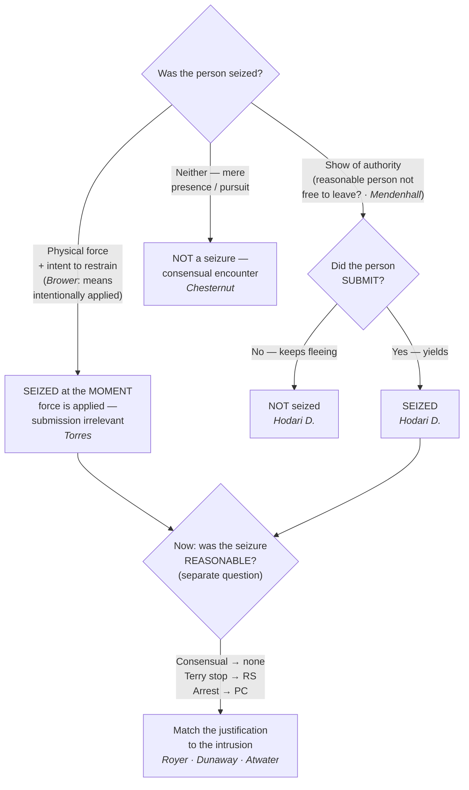

# Seizure of the Person

## The Brief

**Field-decisive question:** *Has this encounter become a Fourth Amendment seizure of the person — and if so, at what moment?* This page fixes only *when* a seizure has occurred; whether that seizure is *reasonable* (a hunch, reasonable suspicion, probable cause, or a recognized justification) is a separate question taken up later.

**Black-letter rule — two roads to a seizure, kept separate.** A person is "seized" under the Fourth Amendment in one of **two ways**: (1) the **application of physical force** to the body with intent to restrain, or (2) a **show of authority to which the person submits**. [[California v. Hodari D.#^pin-626b|*California v. Hodari D.*, 499 U.S. 621, 626 (1991)]] ("An arrest requires *either* physical force . . . *or,* where that is absent, submission to the assertion of authority"); [[Torres v. Madrid|*Torres v. Madrid*]], 592 U.S. 306 (2021). The force branch and the show-of-authority branch are analyzed differently — do not import the submission requirement into a force case, or the force requirement into a show-of-authority case.

**The named tests, up front.**

- **The *Mendenhall* "free to leave" test (the show-of-authority threshold).** A show-of-authority seizure can occur only where, "in view of all of the circumstances surrounding the incident, a reasonable person would have believed that he was not free to leave." [[United States v. Mendenhall#^pin-554|*United States v. Mendenhall*, 446 U.S. 544, 554 (1980)]]. The inquiry is **objective and totality-based**. The Court listed circumstances that **might** indicate a seizure even where the person did not try to leave: "the threatening presence of several officers, the display of a weapon by an officer, some physical touching of the person of the citizen, or the use of language or tone of voice indicating that compliance with the officer's request might be compelled." [[United States v. Mendenhall#^pin-554a|*Id.*]].
- **The *Hodari D.* submission rule (the show-of-authority completion requirement).** "Free to leave" is **necessary but not sufficient**: for a show of authority, the suspect must also **yield**. The "narrow question . . . whether, with respect to a show of authority . . . , a seizure occurs even though the subject does not yield. We hold that it does not." [[California v. Hodari D.#^pin-626|*Hodari D.*, 499 U.S. at 626]]. A command — "Stop, in the name of the law!" — to a fleeing suspect "is no seizure" until he submits. Practical upshot: contraband a fleeing suspect tosses **before** submitting was not abandoned during a seizure, so it is not suppressible as fruit (see [[Abandonment]]).
- **The *Torres* force rule (the force branch needs no submission).** Where officers apply physical force to restrain, the seizure is **complete at the instant of application** even if it fails to subdue: "the application of physical force to the body of a person with intent to restrain is a seizure even if the person does not submit and is not subdued." [[Torres v. Madrid|*Torres*]], 592 U.S. 306, 325 (2021). Torres was seized the moment the bullets struck her, though she then drove away. Two corollaries: a force seizure absent submission **lasts only as long as the application of force** — there is no "continuing arrest during the period of fugitivity," *id.* at 325 (quoting *Hodari D.*, 499 U.S. at 625); and the force must be **applied to restrain**, "not force applied by accident or for some other purpose" — "the appropriate inquiry is whether the challenged conduct objectively manifests an intent to restrain," *id.* (a tap on the shoulder to get attention rarely shows that intent).
- **The *Brower* "means intentionally applied" rule (what governmental conduct counts).** A seizure occurs "only when there is a governmental termination of freedom of movement *through means intentionally applied*," not "the accidental effects of otherwise lawful government conduct." [[Brower v. County of Inyo#^pin-596|*Brower v. County of Inyo*, 489 U.S. 593, 596–597 (1989)]]. It is "enough for a seizure that a person be stopped by the very instrumentality set in motion or put in place in order to achieve that result" [[Brower v. County of Inyo#^pin-599|*id.* at 599]] — a fleeing driver stopped by a roadblock he crashes into is seized.

**The continuum — consensual encounter → investigative detention → arrest.** Seizure of the person is not all-or-nothing; the level of intrusion sets the justification required.

- **Consensual encounter — no seizure, no justification needed.** A mere **hunch** justifies no seizure of any kind; the lawful tool is a consensual encounter, in which the person remains free to leave. Police pursuit, standing alone, is **not** a seizure — driving alongside a fleeing pedestrian without a siren, command, weapon, or aggressive blocking "does not, standing alone, constitute a seizure." [[Michigan v. Chesternut#^pin-575b|*Michigan v. Chesternut*, 486 U.S. 567, 575–576 (1988)]]. And without reasonable suspicion, officers may not even stop a person to demand identification. [[Brown v. Texas|*Brown v. Texas*]], 443 U.S. 47 (1979).
- **Investigative detention (*Terry* stop) — reasonable suspicion, least intrusive means.** A brief investigative detention requires reasonable, articulable suspicion (the predicate built under [[Terry v. Ohio|*Terry v. Ohio*]], 392 U.S. 1 (1968) — see [[Terry Stops and Reasonable Suspicion]]) and "must be temporary and last no longer than is necessary . . . . [T]he investigative methods employed should be the least intrusive means reasonably available." [[Florida v. Royer#^pin-500|*Florida v. Royer*, 460 U.S. 491, 500 (1983)]] (plurality). When officers hold a suspect's ticket and ID, confine him, and never tell him he is free to go, "[a]s a practical matter, [he is] under arrest" — and that escalation needs probable cause. [[Florida v. Royer#^pin-503|*Id.* at 503]].
- **Arrest / de facto arrest — probable cause.** A station-house detention for interrogation "regardless of its label" is a seizure that requires probable cause and cannot be justified by *Terry*-type balancing. [[Dunaway v. New York#^pin-216|*Dunaway v. New York*, 442 U.S. 200, 216 (1979)]]. Awakening a suspect at 3 a.m. and transporting him, handcuffed, to the station is an arrest, and a sleepy "Okay" is "mere submission to authority," not consent. [[Kaupp v. Texas|*Kaupp v. Texas*]], 538 U.S. 626 (2003). Investigatory detentions — including for **fingerprinting** — are full Fourth Amendment seizures: "Detentions for the sole purpose of obtaining fingerprints are no less subject to the constraints of the Fourth Amendment." [[Davis v. Mississippi#^pin-727|*Davis v. Mississippi*, 394 U.S. 721, 727 (1969)]]. The line "is crossed when the police, without probable cause or a warrant, forcibly remove a person from his home . . . and transport him to the police station," even briefly. [[Hayes v. Florida#^pin-816|*Hayes v. Florida*, 470 U.S. 811, 816 (1985)]] (reserving whether brief *field* fingerprinting on reasonable suspicion, carried out with dispatch, might be permissible, [[Hayes v. Florida#^pin-817|*id.* at 817]]).

**The arrest end of the spectrum is governed by probable cause, not interest-balancing.** A warrantless custodial arrest for even a **fine-only misdemeanor** committed in the officer's presence is reasonable if supported by probable cause. [[Atwater v. City of Lago Vista|*Atwater v. City of Lago Vista*]], 532 U.S. 318 (2001). An arrest on probable cause is reasonable **even if state law forbade it** (e.g., required a summons instead). [[Virginia v. Moore|*Virginia v. Moore*]], 553 U.S. 164 (2008). And the officer's **subjective motive is irrelevant** to the Fourth Amendment reasonableness of an arrest made on a valid basis. [[Ashcroft v. al-Kidd|*Ashcroft v. al-Kidd*]], 563 U.S. 731 (2011).

**The back end of an arrest — the prompt probable-cause check.** A person arrested without a warrant is entitled to a **prompt judicial determination of probable cause** as a prerequisite to extended pretrial detention (no adversary hearing required). [[Gerstein v. Pugh|*Gerstein v. Pugh*]], 420 U.S. 103 (1975). A determination within **48 hours** is presumptively prompt; later than that, the government must show a bona fide emergency (intervening weekends do not qualify). [[County of Riverside v. McLaughlin|*County of Riverside v. McLaughlin*]], 500 U.S. 44 (1991).

**A seizure reaches more than the suspect targeted.** When a vehicle is stopped, the **passenger** is seized just as the driver is, because no reasonable passenger would believe himself free to leave. [[Brendlin v. California|*Brendlin v. California*]], 551 U.S. 249 (2007). (Seizure of the *person* is distinct from seizure of *property* — a "seizure" of property occurs on any "meaningful interference with an individual's possessory interests," independent of any liberty interest. [[Soldal v. Cook County|*Soldal v. Cook County*]], 506 U.S. 56 (1992).)

**Force, then reasonableness — the seizure is the trigger.** The same touching that effects a force seizure also opens the **use-of-force** inquiry: once a seizure by force has occurred, its *reasonableness* is judged under the objective standard of [[Graham v. Connor|*Graham v. Connor*]], 490 U.S. 386 (1989), from the officer's on-scene perspective — an inquiry that, the Court recently confirmed, "has no time limit" and looks to the totality of the circumstances rather than the isolated moment of threat. [[Barnes v. Felix|*Barnes v. Felix*]], 605 U.S. 73 (2025). Seizure (this page) is the trigger; reasonableness is the next question (see [[Use of Force]]).

**Burden, standard of review, and remedy.** Because a warrantless seizure of the person is presumptively unreasonable, the **government** bears the burden of justifying it once the defendant shows a seizure occurred; whether a seizure occurred is a **mixed question** — the trial court's historical findings are reviewed for **clear error**, the ultimate Fourth Amendment determination **de novo**. **Remedy/consequence:** statements and evidence that are the **fruit** of an illegal seizure are subject to suppression unless the taint is attenuated — *Miranda* warnings, a few hours' passage, and a later ex parte warrant did **not** purge the taint of an arrest made without probable cause. [[Taylor v. Alabama|*Taylor v. Alabama*]], 457 U.S. 687 (1982); [[Dunaway v. New York|*Dunaway*]], 442 U.S. at 217–218; see [[The Exclusionary Rule]].

**Pitfalls.**

- **Treating a fleeing suspect as already "seized" once an officer yells "stop."** Until the suspect submits (or is touched with intent to restrain), there is no show-of-authority seizure — anything discarded mid-flight is fair game. [[California v. Hodari D.|*Hodari D.*]].
- **Assuming a missed or failed use of force is no seizure.** A shot that *hits* but does not stop the suspect **is** a seizure at that instant ([[Torres v. Madrid|*Torres*]]); a shot that *misses* applies no force to the body and is not a seizure.
- **Collapsing "free to leave" into the whole test.** For show-of-authority, *Mendenhall* is the threshold but **submission** is still required; for force, *Mendenhall* is beside the point — application of force controls.
- **Confusing "seized" with "lawfully seized."** Establishing a seizure does not make it reasonable; whether reasonable suspicion, probable cause, or a recognized justification supported it is a separate analysis.
- **Reading "intent to restrain" as the officer's secret motive.** It is an **objective** inquiry into what the conduct manifests, not the officer's subjective state of mind. [[Torres v. Madrid|*Torres*]].
- **Treating a hunch as if it authorizes a detention or frisk.** Without articulable suspicion there is no authority to seize — escalate via a consensual encounter and build the articulation. [[Brown v. Texas|*Brown v. Texas*]].

**Field framing (the "apply it" angle).** Ask, in order: *Am I applying physical force to restrain?* If yes, the person is seized **now** — submission is irrelevant, and reasonableness is the next question. If no, *am I making a show of authority that would lead a reasonable person to believe he is not free to leave — and has he actually submitted?* No submission (still fleeing) means no seizure yet. If the encounter is consensual, no justification is needed; if it has hardened into a *Terry* detention, I need reasonable suspicion and must use the least intrusive means; if it has become an arrest (transport to the station, prolonged confinement, handcuffs and interrogation), I need probable cause — and a prompt judicial probable-cause check on the back end.

## Key cases

| Case (Bluebook) | Holding in one line | Weight | Treatment | CourtListener |
|---|---|---|---|---|
| *[[United States v. Mendenhall]]*, 446 U.S. 544 (1980) | The "free to leave" benchmark: a person is seized only if, under all the circumstances, a reasonable person would not have believed himself **free to leave** (objective, totality-based). | Binding — SCOTUS | good *(2026-06-30)* | [opinion](https://www.courtlistener.com/opinion/110264/united-states-v-mendenhall/) |
| *[[California v. Hodari D.]]*, 499 U.S. 621 (1991) | A **show-of-authority** seizure is not complete until the suspect **submits**; contraband discarded while still fleeing is not the fruit of a seizure. | Binding — SCOTUS | good *(2026-06-30)* | [opinion](https://www.courtlistener.com/opinion/112579/california-v-hodari-d/) |
| *[[Torres v. Madrid]]*, 592 U.S. 306 (2021) | **Physical force** with intent to restrain is a seizure **at the moment of application**, even if the person does not submit and is not subdued. | Binding — SCOTUS | good *(2026-06-30)* | [opinion](https://www.courtlistener.com/opinion/4867542/torres-v-madrid/) |
| *[[Brower v. County of Inyo]]*, 489 U.S. 593 (1989) | A seizure occurs only on a termination of movement **through means intentionally applied** — stopped "by the very instrumentality . . . put in place" (a roadblock crash). | Binding — SCOTUS | good *(2026-06-30)* | [opinion](https://www.courtlistener.com/opinion/112218/brower-ex-rel-estate-of-caldwell-v-county-of-inyo/) |
| *[[Michigan v. Chesternut]]*, 486 U.S. 567 (1988) | Police pursuit, **standing alone**, is not a seizure; the *Mendenhall* objective test governs whether pursuit is a seizure. | Binding — SCOTUS | good *(2026-06-30)* | [opinion](https://www.courtlistener.com/opinion/112095/michigan-v-chesternut/) |
| *[[Florida v. Royer]]*, 460 U.S. 491 (1983) | A *Terry* detention must use the **least intrusive means**; holding ID/ticket and confining the suspect escalated a consensual encounter into a **de facto arrest** requiring probable cause. | Binding — SCOTUS | good *(2026-06-30)* | [opinion](https://www.courtlistener.com/opinion/110890/florida-v-royer/) |
| *[[Dunaway v. New York]]*, 442 U.S. 200 (1979) | A station-house detention for interrogation — "regardless of its label" — is a seizure requiring **probable cause**; it cannot rest on *Terry* balancing. | Binding — SCOTUS | good *(2026-06-30)* | [opinion](https://www.courtlistener.com/opinion/110096/dunaway-v-new-york/) |
| *[[Kaupp v. Texas]]*, 538 U.S. 626 (2003) | A 3 a.m. handcuffed transport to the station for interrogation without probable cause is an **arrest**; an "Okay" is mere submission to authority, not consent. | Binding — SCOTUS | good *(2026-06-30)* | [opinion](https://www.courtlistener.com/opinion/127919/kaupp-v-texas/) |
| *[[Davis v. Mississippi]]*, 394 U.S. 721 (1969) | Investigatory detentions — including dragnet detention for **fingerprinting** — are full Fourth Amendment seizures requiring justification. | Binding — SCOTUS | good *(2026-06-30)* | [opinion](https://www.courtlistener.com/opinion/107912/davis-v-mississippi/) |
| *[[Hayes v. Florida]]*, 470 U.S. 811 (1985) | Forcibly transporting a suspect to the station for fingerprinting without probable cause is an **arrest** (brief *field* fingerprinting on reasonable suspicion left open). | Binding — SCOTUS | good *(2026-06-30)* | [opinion](https://www.courtlistener.com/opinion/111382/hayes-v-florida/) |
| *[[Atwater v. City of Lago Vista]]*, 532 U.S. 318 (2001) | A warrantless custodial arrest for a **fine-only misdemeanor** on probable cause does not violate the Fourth Amendment — no case-by-case interest-balancing. | Binding — SCOTUS | good *(2026-06-30)* | [opinion](https://www.courtlistener.com/opinion/2620702/atwater-v-city-of-lago-vista/) |
| *[[Virginia v. Moore]]*, 553 U.S. 164 (2008) | A warrantless arrest on probable cause is reasonable **even if state law forbade it** (state-law violation alone does not trigger exclusion). | Binding — SCOTUS | good *(2026-06-30)* | [opinion](https://www.courtlistener.com/opinion/145814/virginia-v-moore/) |
| *[[Gerstein v. Pugh]]*, 420 U.S. 103 (1975) | A person arrested **without a warrant** is entitled to a **prompt judicial probable-cause determination** before extended pretrial detention (no adversary hearing required). | Binding — SCOTUS | good *(2026-06-30)* | [opinion](https://www.courtlistener.com/opinion/109186/gerstein-v-pugh/) |
| *[[County of Riverside v. McLaughlin]]*, 500 U.S. 44 (1991) | A probable-cause determination within **48 hours** of a warrantless arrest is presumptively prompt under *Gerstein*; later, the government must show a bona fide emergency. | Binding — SCOTUS | good *(2026-06-30)* | [opinion](https://www.courtlistener.com/opinion/112585/county-of-riverside-v-mclaughlin/) |

## Related cases across doctrines

These cases are treated in full on other pages but bear directly on *when*, *whether*, and *how far* a seizure of the person occurs, framed here for this doctrine.

| Case | Relevance to seizure of the person | Primary home | Treatment | CourtListener |
|---|---|---|---|---|
| *[[Brendlin v. California]]*, 551 U.S. 249 (2007) | When a car is stopped, the **passenger is seized too** — a show-of-authority seizure reaches everyone in the vehicle, because no reasonable passenger would feel free to leave. | [[Standing to Challenge a Search]] | good *(2026-06-30)* | [opinion](https://www.courtlistener.com/opinion/145712/brendlin-v-california/) |
| *[[Florida v. Bostick]]*, 501 U.S. 429 (1991) | Where the person is already confined (a bus seat) so "free to leave" is meaningless, the *Mendenhall* test is reframed: a seizure occurs only if a reasonable person would not feel free to **decline the officers' requests or otherwise terminate the encounter**. | [[Knock and Talk]] | good *(2026-06-30)* | [opinion](https://www.courtlistener.com/opinion/112631/florida-v-bostick/) |
| *[[United States v. Drayton]]*, 536 U.S. 194 (2002) | A bus sweep with consent-to-search requests is **not** a seizure where officers do not block exits, brandish weapons, or use a commanding tone; failure to advise of the right to refuse does not convert a consensual encounter into a seizure. | [[Knock and Talk]] | good *(2026-06-30)* | [opinion](https://www.courtlistener.com/opinion/121153/united-states-v-drayton/) |
| *[[Michigan v. Summers]]*, 452 U.S. 692 (1981) | A warrant to search premises for contraband carries categorical authority to **detain (seize) the occupants** for the duration of the search — a seizure of the person justified without individualized suspicion. | [[Securing the Scene]] | good *(2026-06-30)* | [opinion](https://www.courtlistener.com/opinion/110534/michigan-v-summers/) |
| *[[Bailey v. United States]]*, 568 U.S. 186 (2013) | The *Summers* detention authority is spatially limited to the **immediate vicinity** of the premises; once the occupant has left, his detention must rest on ordinary seizure grounds (*Terry*/PC). | [[Securing the Scene]] | good *(2026-06-30)* | [opinion](https://www.courtlistener.com/opinion/820749/bailey-v-united-states/) |
| *[[Muehler v. Mena]]*, 544 U.S. 93 (2005) | The **manner** of a *Summers* detention may include handcuffing occupants for the entire search of a dangerous premises; unrelated questioning during a lawful detention is not an independent Fourth Amendment event. | [[Securing the Scene]] | good *(2026-06-30)* | [opinion](https://www.courtlistener.com/opinion/142878/muehler-v-mena/) |
| *[[Illinois v. McArthur]]*, 531 U.S. 326 (2001) | A temporary restraint barring a resident from re-entering his home while police get a warrant is a **limited seizure of the person**, reasonable on probable cause plus exigency — seizure spans more than arrest. | [[Securing the Scene]] | good *(2026-06-30)* | [opinion](https://www.courtlistener.com/opinion/118405/illinois-v-mcarthur/) |
| *[[Brown v. Texas]]*, 443 U.S. 47 (1979) | Police may **not** stop a person and demand identification **without reasonable suspicion**; suspicionless seizures are judged by balancing public concern, advancement of the public interest, and the intrusion on liberty. | [[Terry Stops and Reasonable Suspicion]] | good *(2026-06-30)* | [opinion](https://www.courtlistener.com/opinion/110128/brown-v-texas/) |
| *[[Soldal v. Cook County]]*, 506 U.S. 56 (1992) | A **seizure of property** occurs on any "meaningful interference with . . . possessory interests" — the property analogue to seizure of the person, independent of any privacy or liberty interest. | [[Two Definitions of Search]] | good *(2026-06-30)* | [opinion](https://www.courtlistener.com/opinion/112795/soldal-v-cook-county/) |
| *[[Ashcroft v. al-Kidd]]*, 563 U.S. 731 (2011) | An objectively reasonable arrest on a valid warrant cannot be challenged on the officer's **subjective motive** — subjective intent is irrelevant to Fourth Amendment reasonableness. | [[Section 1983 Liability and Qualified Immunity]] | good *(2026-06-30)* | [opinion](https://www.courtlistener.com/opinion/217703/ashcroft-v-al-kidd/) |
| *[[Taylor v. Alabama]]*, 457 U.S. 687 (1982) | A confession after a warrantless arrest made **without probable cause** is the suppressible **fruit** of the illegal seizure where no significant intervening event broke the chain (*Miranda* + a few hours + a later warrant did not attenuate). | [[The Exclusionary Rule]] | good *(2026-06-30)* | [opinion](https://www.courtlistener.com/opinion/110760/taylor-v-alabama/) |
| *[[Graham v. Connor]]*, 490 U.S. 386 (1989) | Once a seizure by force has occurred, its **reasonableness** is judged under the Fourth Amendment's objective-reasonableness standard from the officer's on-scene perspective — the seizure is the trigger; *Graham* supplies the next-step test. | [[Section 1983 Liability and Qualified Immunity]] | good *(2026-06-30)* | [opinion](https://www.courtlistener.com/opinion/112257/graham-v-connor/) |
| *[[Barnes v. Felix]]*, 605 U.S. 73 (2025) | The reasonableness of force used to effect a seizure is judged on the **totality of the circumstances**, an inquiry that "has no time limit"; rejects the "moment of threat" rule — governs the reasonableness step that follows a *Torres* force-seizure. | [[Use of Force]] | good *(2026-06-30)* | [opinion](https://www.courtlistener.com/opinion/10584846/barnes-v-felix/) |

## Recent developments

Role-based circuit/state developments only (no SCOTUS — any Supreme Court holding homes to Key cases regardless of date). The two-roads framework is stable, but the lower courts are actively working out the *Torres* force-seizure rule on remand, tightening what counts as **"submission"** under *Hodari D.*, and testing whether the objective *Mendenhall* inquiry accounts for a suspect's race.

- **Torres v. Madrid (10th Cir. 2023, on remand)** — *Binding in-circuit — 10th Cir.* On remand from the Supreme Court, the Tenth Circuit reversed summary judgment for the officers, holding that because Torres was seized the instant the bullets struck her (even though she drove off), *Heck v. Humphrey* did not bar her excessive-force claim and qualified immunity did not attach merely because she eluded capture — the officers' knowledge at the moment of firing controls. The most concrete circuit-level working-out of the *Torres* physical-force-seizure rule (role: **refinement**). [opinion](https://www.courtlistener.com/opinion/9376547/torres-v-madrid/)
- **United States v. Amos (3d Cir. 2023)** — *Binding in-circuit — 3d Cir.* Applies the *Hodari D.* submission requirement to the modern "momentary pause" problem: a suspect's one-to-two-second pause and a halfway raise of the hands in response to a command is **not** submission to a show of authority, so no seizure occurred until handcuffing — and his intervening flight supplied the reasonable suspicion. Distinguishes genuine compliance from fleeting hesitation: submission "would seem to require something more than a momentary pause," 88 F.4th at 455 (quoting *Waterman*, 569 F.3d at 146) (role: **refinement**). [opinion](https://www.courtlistener.com/opinion/9452158/united-states-v-shiheem-amos/)
- **Carter v. United States (D.C. Court of Appeals 2025)** — *Persuasive — state, illustrative (D.C. Court of Appeals).* Vacated on a seizure theory, holding under its *Dozier* precedent that courts must consider whether an objective reasonable person sharing the defendant's racial status and lived experiences would have felt free to terminate the encounter — finding a Black man here was seized. A developing frontier on the show-of-authority branch (role: **first-impression**). A cert petition (No. 25-885) now presses whether race may be considered in the *Mendenhall* objective "free to leave" inquiry; **no Supreme Court holding yet** — not settled law. Note posture: the court below is the D.C. Court of Appeals (the local high court), not the D.C. Circuit. [opinion](https://www.courtlistener.com/opinion/10662535/carter-v-united-states/)

## Visual

## Sources

- *United States v. Mendenhall*, 446 U.S. 544 (1980) — pinpoint 554 — https://www.courtlistener.com/opinion/110264/united-states-v-mendenhall/
- *California v. Hodari D.*, 499 U.S. 621 (1991) — pinpoints 625, 626 — https://www.courtlistener.com/opinion/112579/california-v-hodari-d/
- *Torres v. Madrid*, 592 U.S. 306 (2021) — pinpoint 325 — https://www.courtlistener.com/opinion/4867542/torres-v-madrid/
- *Brower v. County of Inyo*, 489 U.S. 593 (1989) — pinpoints 596–597, 599 — https://www.courtlistener.com/opinion/112218/brower-ex-rel-estate-of-caldwell-v-county-of-inyo/
- *Michigan v. Chesternut*, 486 U.S. 567 (1988) — pinpoints 573, 575–576 — https://www.courtlistener.com/opinion/112095/michigan-v-chesternut/
- *Florida v. Royer*, 460 U.S. 491 (1983) — pinpoints 500, 503 — https://www.courtlistener.com/opinion/110890/florida-v-royer/
- *Dunaway v. New York*, 442 U.S. 200 (1979) — pinpoints 216, 217–218 — https://www.courtlistener.com/opinion/110096/dunaway-v-new-york/
- *Kaupp v. Texas*, 538 U.S. 626 (2003) — https://www.courtlistener.com/opinion/127919/kaupp-v-texas/
- *Davis v. Mississippi*, 394 U.S. 721 (1969) — pinpoints 726–727 — https://www.courtlistener.com/opinion/107912/davis-v-mississippi/
- *Hayes v. Florida*, 470 U.S. 811 (1985) — pinpoints 816, 817 — https://www.courtlistener.com/opinion/111382/hayes-v-florida/
- *Atwater v. City of Lago Vista*, 532 U.S. 318 (2001) — https://www.courtlistener.com/opinion/2620702/atwater-v-city-of-lago-vista/
- *Virginia v. Moore*, 553 U.S. 164 (2008) — https://www.courtlistener.com/opinion/145814/virginia-v-moore/
- *Gerstein v. Pugh*, 420 U.S. 103 (1975) — https://www.courtlistener.com/opinion/109186/gerstein-v-pugh/
- *County of Riverside v. McLaughlin*, 500 U.S. 44 (1991) — https://www.courtlistener.com/opinion/112585/county-of-riverside-v-mclaughlin/
- *Brendlin v. California*, 551 U.S. 249 (2007) — https://www.courtlistener.com/opinion/145712/brendlin-v-california/
- *Florida v. Bostick*, 501 U.S. 429 (1991) — https://www.courtlistener.com/opinion/112631/florida-v-bostick/
- *United States v. Drayton*, 536 U.S. 194 (2002) — https://www.courtlistener.com/opinion/121153/united-states-v-drayton/
- *Michigan v. Summers*, 452 U.S. 692 (1981) — https://www.courtlistener.com/opinion/110534/michigan-v-summers/
- *Bailey v. United States*, 568 U.S. 186 (2013) — https://www.courtlistener.com/opinion/820749/bailey-v-united-states/
- *Muehler v. Mena*, 544 U.S. 93 (2005) — https://www.courtlistener.com/opinion/142878/muehler-v-mena/
- *Illinois v. McArthur*, 531 U.S. 326 (2001) — https://www.courtlistener.com/opinion/118405/illinois-v-mcarthur/
- *Brown v. Texas*, 443 U.S. 47 (1979) — https://www.courtlistener.com/opinion/110128/brown-v-texas/
- *Soldal v. Cook County*, 506 U.S. 56 (1992) — https://www.courtlistener.com/opinion/112795/soldal-v-cook-county/
- *Ashcroft v. al-Kidd*, 563 U.S. 731 (2011) — https://www.courtlistener.com/opinion/217703/ashcroft-v-al-kidd/
- *Taylor v. Alabama*, 457 U.S. 687 (1982) — https://www.courtlistener.com/opinion/110760/taylor-v-alabama/
- *Graham v. Connor*, 490 U.S. 386 (1989) — https://www.courtlistener.com/opinion/112257/graham-v-connor/ *(use-of-force reasonableness; cross-reference)*
- *Barnes v. Felix*, 605 U.S. 73 (2025) — pinpoint 80 — https://www.courtlistener.com/opinion/10584846/barnes-v-felix/ *(reasonableness step; home = [[Use of Force]])*
- *Terry v. Ohio*, 392 U.S. 1 (1968) — https://www.courtlistener.com/opinion/107729/terry-v-ohio/ *(reasonable-suspicion predicate; see [[Terry Stops and Reasonable Suspicion]])*
