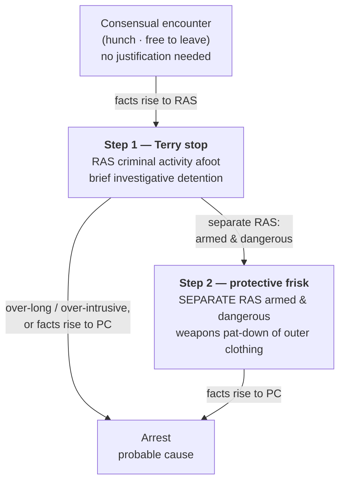

---
aliases:
  - "Stop and Frisk"
  - "Reasonable Suspicion"
  - "Terry Stop"
  - "Terry Stops and Reasonable Suspicion"
title: "Terry Stops and Reasonable Suspicion"
topic: Terry Stops and Reasonable Suspicion
type: doctrine
amendment: "U.S. Const. amend. IV"
jurisdiction: "Federal (U.S. Const. amend. IV); SCOTUS baseline"
status: verified
related: ["[[Seizure of the Person]]", "[[Traffic Stops]]", "[[Probable Cause and Reasonable Suspicion]]", "[[Consent Searches]]", "[[Plain View Doctrine]]", "[[Use of Force]]", "[[Fourth Amendment Analysis Checklist]]"]
---

## The Brief

**Field-decisive question:** *Do I have reasonable suspicion to **stop** — and, separately, reasonable suspicion the person is **armed and dangerous**, to **frisk**?* These are **two** calls, not one. Clearing the stop does not clear the frisk.

**The black-letter rule — two separate showings.** On **reasonable, articulable suspicion (RAS)** that criminal activity is afoot, an officer may make a **brief investigative stop**; and on **separate** RAS that the person is **armed and presently dangerous**, may conduct a **limited protective frisk** — a pat-down of the **outer clothing for weapons**. To justify the stop, "the police officer must be able to point to specific and articulable facts which, taken together with rational inferences from those facts, reasonably warrant that intrusion." [[Terry v. Ohio#^pin-21|*Terry v. Ohio*, 392 U.S. 1, 21 (1968)]]. The frisk is authorized only where the officer "observes unusual conduct which leads him reasonably to conclude in light of his experience that criminal activity may be afoot and that the persons with whom he is dealing may be armed and presently dangerous … he is entitled … to conduct a carefully limited search of the outer clothing of such persons in an attempt to discover weapons which might be used to assault him." [[Terry v. Ohio#^pin-30|*Id.* at 30]]. A reliable informant's tip — not just the officer's own observation — can supply the suspicion for both. [[Adams v. Williams#^pin-147|*Adams v. Williams*, 407 U.S. 143, 147 (1972)]].

**Reasonable suspicion vs. probable cause — the middle rung.** RAS is **more than an inchoate hunch but less than probable cause**, judged on the **totality of the circumstances** on a **particularized and objective** basis: "the totality of the circumstances—the whole picture—must be taken into account. Based upon that whole picture the detaining officers must have a particularized and objective basis for suspecting the particular person stopped of criminal activity." [[United States v. Cortez#^pin-417|*United States v. Cortez*, 449 U.S. 411, 417–18 (1981)]]. Factors each individually consistent with innocence can combine: "Any one of these factors is not by itself proof of any illegal conduct … But we think taken together they amount to reasonable suspicion." [[United States v. Sokolow#^pin-9|*United States v. Sokolow*, 490 U.S. 1, 9 (1989)]]. And a reviewing court may not pick the facts apart one by one — "*Terry* … precludes this sort of divide-and-conquer analysis." [[United States v. Arvizu#^pin-274|*United States v. Arvizu*, 534 U.S. 266, 274 (2002)]]. This is the rung **above** a hunch (a consensual encounter, where the person is free to leave and no justification is needed — see [[Seizure of the Person]]) and **below** an arrest on probable cause (see [[Probable Cause and Reasonable Suspicion]]).

**The frisk is for WEAPONS, not evidence.** A frisk is a pat-down of the outer clothing to find weapons, and it needs its **own** armed-and-dangerous suspicion grounded in particular facts: "he must be able to point to particular facts from which he reasonably inferred that the individual was armed and dangerous." [[Sibron v. New York#^pin-64|*Sibron v. New York*, 392 U.S. 40, 64 (1968)]]. Reaching past that purpose is unlawful — in *Sibron* the officer "thrust his hand into Sibron's pocket" for narcotics without first patting down for weapons, and the search was "not reasonably limited in scope." [[Sibron v. New York#^pin-65|*Id.* at 65–66]]. Contraband whose incriminating character is **immediately apparent by touch** during a lawful weapons pat-down may be seized ("plain feel," no further manipulation) — [[Minnesota v. Dickerson]]; see [[Plain View Doctrine]]. The armed-and-dangerous suspicion must be **particularized to the person**: an officer may not frisk everyone present, because "mere propinquity to others independently suspected of criminal activity does not, without more," justify it. [[Ybarra v. Illinois#^pin-92|*Ybarra v. Illinois*, 444 U.S. 85, 92–93 (1979)]].

**Scope and duration — brief, diligent, least-intrusive.** A *Terry* stop must be **temporary** and use "the least intrusive means reasonably available to verify or dispel the officer's suspicion in a short period of time." [[Florida v. Royer#^pin-500|*Florida v. Royer*, 460 U.S. 491, 500 (1983)]] (plurality). There is **no rigid time limit** — "our cases impose no rigid time limitation on *Terry* stops" — and the test is **diligence**, "whether the police diligently pursued a means of investigation that was likely to confirm or dispel their suspicions quickly." [[United States v. Sharpe#^pin-685|*United States v. Sharpe*, 470 U.S. 675, 685–86 (1985)]]. But an over-intrusive or over-long detention becomes a **de facto arrest requiring probable cause**: in *Royer*, holding the suspect's ticket and ID in a small room meant "[a]s a practical matter, Royer was under arrest" ([[Florida v. Royer#^pin-503|460 U.S. at 503]]), and a 90-minute seizure of luggage "exceeded the permissible limits of a *Terry*-type investigative stop" ([[United States v. Place#^pin-709|*United States v. Place*, 462 U.S. 696, 709 (1983)]]). For the duration/diligence rule in the traffic setting (no prolonging beyond the stop's mission), see [[Traffic Stops]] (*[[Rodriguez v. United States|Rodriguez]]*).

**Stop-and-identify — name yes, but not without suspicion, and not under a vague statute.** During a **valid** stop a State may, by stop-and-identify statute, require the suspect to give his name: "A state law requiring a suspect to disclose his name in the course of a valid Terry stop is consistent with Fourth Amendment prohibitions against unreasonable searches and seizures." [[Hiibel v. Sixth Judicial Dist. Court#^pin-188|*Hiibel v. Sixth Judicial Dist. Court*, 542 U.S. 177, 188 (2004)]]. (That is the **federal** holding; whether a given statute reaches further is a state-law question — *Hiibel* arose under a Nevada statute.) Two limits bracket it: officers may **not** stop and demand identification **without** reasonable suspicion ([[Brown v. Texas#^pin-51|*Brown v. Texas*, 443 U.S. 47, 51 (1979)]] — suspicionless seizures fail the balancing test), and a stop-and-identify statute is **void for vagueness** if it requires "credible and reliable" identification without a standard, because it "vests virtually complete discretion in the hands of the police." [[Kolender v. Lawson#^pin-358|*Kolender v. Lawson*, 461 U.S. 352, 358 (1983)]].

**Tips — a reliability spectrum.** A **known reliable informant's** tip can support a stop and frisk ([[Adams v. Williams#^pin-147|*Adams*, 407 U.S. at 147]]). A **corroborated anonymous** tip can suffice, though it is "a close case … the anonymous tip, as corroborated, exhibited sufficient indicia of reliability to justify the investigatory stop." [[Alabama v. White#^pin-332|*Alabama v. White*, 496 U.S. 325, 332 (1990)]]. But a **bare anonymous** gun tip does **not**: an accurate description of "readily observable location and appearance … does not show that the tipster has knowledge of concealed criminal activity." [[Florida v. J.L.#^pin-272|*Florida v. J.L.*, 529 U.S. 266, 272 (2000)]]. A **911 call** bearing adequate indicia of reliability can supply RAS — "the call bore adequate indicia of reliability for the officer to credit the caller's account." [[Navarette v. California#^pin-398|*Navarette v. California*, 572 U.S. 393, 398–99 (2014)]].

**Flight in a high-crime area.** "Headlong flight—wherever it occurs—is the consummate act of evasion: It is not necessarily indicative of wrongdoing, but it is certainly suggestive of such." [[Illinois v. Wardlow#^pin-124|*Illinois v. Wardlow*, 528 U.S. 119, 124 (2000)]]. What mattered was **context plus flight**: "it was not merely respondent's presence in an area of heavy narcotics trafficking … but his unprovoked flight upon noticing the police." *Id.* A **high-crime area alone is not enough**.

**Burden · standard of review · remedy.** The **government** bears the burden of pointing to specific, articulable facts establishing RAS; a bare "I had a hunch" will not do. On appeal, reasonable suspicion (and probable cause) are reviewed **de novo**, giving due weight to inferences drawn by local officers — see *[[Ornelas v. United States|Ornelas]]* and [[Probable Cause and Reasonable Suspicion]]. The **remedy** for a stop or frisk made without the requisite suspicion (or one that ripened into an unlawful de facto arrest) is **suppression** of the evidence and its fruits — see [[The Exclusionary Rule]].

**Pitfalls.**

- **Treating a lawful stop as automatic authority to frisk.** The frisk needs its **own** armed-and-dangerous RAS — two separate showings. *[[Terry v. Ohio|Terry]]* · *[[Sibron v. New York|Sibron]]*.
- **Frisking for evidence rather than weapons.** The pat-down is for weapons; only contraband immediately apparent by plain feel may be seized. *[[Sibron v. New York|Sibron]]* · *[[Minnesota v. Dickerson|Dickerson]]*.
- **Frisking everyone present.** Armed-and-dangerous suspicion must be particularized to the person — mere proximity is not enough. *[[Ybarra v. Illinois|Ybarra]]*.
- **Relying on a bare anonymous tip.** Without corroboration or reliability indicia, an anonymous gun tip is not RAS. *[[Florida v. J.L.|J.L.]]*.
- **"High-crime area" alone = RAS.** No — *[[Illinois v. Wardlow|Wardlow]]* required unprovoked flight **plus** the high-crime context.
- **Prolonging the stop past its purpose.** A diligence-less or over-intrusive detention becomes a de facto arrest needing probable cause. *[[Florida v. Royer|Royer]]* · *[[United States v. Place|Place]]*; in traffic, *[[Rodriguez v. United States|Rodriguez]]* ([[Traffic Stops]]).
- **Demanding ID with no suspicion.** A name may be compelled only during a **valid** stop. *[[Brown v. Texas|Brown v. Texas]]* · *[[Kolender v. Lawson|Kolender]]*.
- **Calling RAS a mere "hunch" or conflating it with probable cause.** RAS is *more than* a hunch and *less than* PC — articulable, particularized, objective. *[[United States v. Cortez|Cortez]]*.

**Field framing (the "apply it" angle).** Make and articulate the **two** calls separately, in order. First: *what specific facts + rational inferences make me reasonably suspect criminal activity by this person?* — that justifies the **stop**. Then, independently: *what specific facts make me reasonably suspect this person is armed and dangerous?* — only that justifies the **frisk**, and only as a weapons pat-down of the outer clothing. Keep the stop **brief and diligent**; the moment you hold someone longer or more intrusively than the investigation needs, you risk converting a lawful *Terry* stop into an arrest you cannot support without probable cause.

## Key cases

| Case (Bluebook) | Holding in one line | Weight | Treatment | CourtListener |
|---|---|---|---|---|
| *[[Terry v. Ohio]]*, 392 U.S. 1 (1968) | Foundation: on RAS criminal activity is afoot an officer may make a brief stop, and on RAS the person is **armed and presently dangerous** may conduct a protective pat-down of the outer clothing for weapons. | Binding — SCOTUS | good *(2026-06-30)* | [link](https://www.courtlistener.com/opinion/107729/terry-v-ohio/) |
| *[[Adams v. Williams]]*, 407 U.S. 143 (1972) | RAS (and a frisk) may rest on a **reliable informant's tip**, not only the officer's own observation. | Binding — SCOTUS | good *(2026-06-30)* | [link](https://www.courtlistener.com/opinion/108571/adams-v-williams/) |
| *[[United States v. Cortez]]*, 449 U.S. 411 (1981) | RAS = a **particularized and objective basis** on the **totality of the circumstances** (the "whole picture"). | Binding — SCOTUS | good *(2026-06-30)* | [link](https://www.courtlistener.com/opinion/110377/united-states-v-cortez/) |
| *[[United States v. Sokolow]]*, 490 U.S. 1 (1989) | Factors **each individually consistent with innocence** can, taken together, amount to RAS. | Binding — SCOTUS | good *(2026-06-30)* | [link](https://www.courtlistener.com/opinion/112239/united-states-v-sokolow/) |
| *[[United States v. Arvizu]]*, 534 U.S. 266 (2002) | Totality governs; reviewing courts may **not** use a **divide-and-conquer** analysis of each factor. | Binding — SCOTUS | good *(2026-06-30)* | [link](https://www.courtlistener.com/opinion/118474/united-states-v-arvizu/) |
| *[[United States v. Sharpe]]*, 470 U.S. 675 (1985) | **No rigid time limit** on a *Terry* stop; a ~20-minute detention was reasonable where police **diligently** pursued an investigation likely to confirm or dispel suspicion quickly. | Binding — SCOTUS | good *(2026-06-30)* | [link](https://www.courtlistener.com/opinion/111378/united-states-v-sharpe/) |
| *[[Brown v. Texas]]*, 443 U.S. 47 (1979) | Police may **not** stop a person and demand identification **without** RAS; suspicionless seizures fail the balancing test. | Binding — SCOTUS | good *(2026-06-30)* | [link](https://www.courtlistener.com/opinion/110128/brown-v-texas/) |
| *[[Hiibel v. Sixth Judicial Dist. Court]]*, 542 U.S. 177 (2004) | A state stop-and-identify law compelling a name during a **valid Terry stop** is consistent with the 4A. | Binding — SCOTUS | good *(2026-06-30)* | [link](https://www.courtlistener.com/opinion/136990/hiibel-v-sixth-judicial-dist-court-of-nev-humboldt-cty/) |
| *[[Alabama v. White]]*, 496 U.S. 325 (1990) | An **anonymous tip sufficiently corroborated** by police work can supply RAS (a "close case"). | Binding — SCOTUS | good *(2026-06-30)* | [link](https://www.courtlistener.com/opinion/112454/alabama-v-white/) |
| *[[Florida v. J.L.]]*, 529 U.S. 266 (2000) | A **bare anonymous tip** that a person is carrying a gun, without more, is **not** RAS. | Binding — SCOTUS | good *(2026-06-30)* | [link](https://www.courtlistener.com/opinion/118352/florida-v-jl/) |
| *[[Illinois v. Wardlow]]*, 528 U.S. 119 (2000) | **Unprovoked headlong flight** in a high-crime area can furnish RAS. | Binding — SCOTUS | good *(2026-06-30)* | [link](https://www.courtlistener.com/opinion/118326/illinois-v-wardlow/) |
| *[[Navarette v. California]]*, 572 U.S. 393 (2014) | A **911 caller's tip** bearing adequate indicia of reliability can supply RAS for a stop. | Binding — SCOTUS | good *(2026-06-30)* | [link](https://www.courtlistener.com/opinion/2670795/prado-navarette-v-california/) |
| *[[Sibron v. New York]]*, 392 U.S. 40 (1968) | **Scope limit:** a frisk is a limited pat-down of outer clothing for weapons on particular armed-and-dangerous facts; thrusting a hand into a pocket to search for narcotics **exceeds** what *Terry* allows. | Binding — SCOTUS | good *(2026-06-30)* | [link](https://www.courtlistener.com/opinion/107730/sibron-v-new-york/) |
| *[[United States v. Place]]*, 462 U.S. 696 (1983) | **Duration limit:** a 90-minute investigative seizure of luggage exceeded the permissible limits of a *Terry* stop (the dog-sniff "not a search" holding homes to [[Two Definitions of Search]]). | Binding — SCOTUS | good *(2026-06-30)* | [link](https://www.courtlistener.com/opinion/110979/united-states-v-place/) |

## Related cases across doctrines

These cases are treated in full on other pages but bear directly on Terry stops and reasonable suspicion; each row frames the holding for this doctrine.

| Case (Bluebook) | Relevance to Terry stops & reasonable suspicion (framed here) | Primary home | Weight · Treatment | CourtListener |
|---|---|---|---|---|
| *[[Michigan v. Long]]*, 463 U.S. 1032 (1983) | *[[Terry v. Ohio\|Terry]]*'s protective-frisk rationale extends to a vehicle: on specific articulable facts giving a reasonable belief the suspect is dangerous and may gain immediate control of weapons, an officer may frisk the areas of the passenger compartment where a weapon could be hidden — a "frisk" of the car, not just the person. | [[Traffic Stops]] | Binding — SCOTUS · good | [opinion](https://www.courtlistener.com/opinion/111020/michigan-v-long/) |
| *[[Arizona v. Johnson]]*, 555 U.S. 323 (2009) | In a traffic stop the **first *Terry* condition** (a lawful stop) is met for **passengers** without separate suspicion of their criminal activity; an officer may frisk a passenger on RAS the passenger **is armed and dangerous** — the two-condition rule applied to vehicles. | [[Traffic Stops]] | Binding — SCOTUS · good | [opinion](https://www.courtlistener.com/opinion/145912/arizona-v-johnson/) |
| *[[Ybarra v. Illinois]]*, 444 U.S. 85 (1979) | A premises search warrant does **not** authorize frisking persons merely present; a frisk needs RAS **particularized to that person** that he is armed and dangerous — you cannot pat down everyone in the room. | [[Securing the Scene]] | Binding — SCOTUS · good | [opinion](https://www.courtlistener.com/opinion/110158/ybarra-v-illinois/) |
| *[[Florida v. Royer]]*, 460 U.S. 491 (1983) | A *Terry* detention must use the **least intrusive means** and stay brief; holding the suspect's ticket and ID in a small room turned the stop into a **de facto arrest** requiring probable cause. | [[Seizure of the Person]] | Binding — SCOTUS · good | [opinion](https://www.courtlistener.com/opinion/110890/florida-v-royer/) |
| *[[Davis v. Mississippi]]*, 394 U.S. 721 (1969) | Detaining and transporting a suspect to the station for fingerprinting **without probable cause** is an unreasonable seizure — a limit on how far an investigative detention may go before it needs PC. | [[Seizure of the Person]] | Binding — SCOTUS · good | [opinion](https://www.courtlistener.com/opinion/107912/davis-v-mississippi/) |
| *[[Peters v. New York]]*, 392 U.S. 40 (1968) | The *Sibron* companion: deliberately furtive conduct and **flight** ripened suspicion into **probable cause**, so grabbing the suspect was an arrest and the search was valid **as incident to arrest**, not as a frisk — marks the stop→arrest line. | [[Search Incident to Arrest]] | Binding — SCOTUS · good | [opinion](https://www.courtlistener.com/opinion/107730/sibron-v-new-york/) |
| *[[United States v. Van Leeuwen]]*, 397 U.S. 249 (1970) | First-class mail may be **briefly detained on reasonable suspicion** while officers diligently pursue a warrant; the detention invades no privacy interest until the package is opened under the warrant — *Terry*-style detention of property. | [[Two Definitions of Search]] | Binding — SCOTUS · good | [opinion](https://www.courtlistener.com/opinion/108099/united-states-v-van-leeuwen/) |
| *[[Kolender v. Lawson]]*, 461 U.S. 352 (1983) | A stop-and-identify statute requiring "credible and reliable" identification is **void for vagueness** (Due Process), because it leaves standardless discretion to the police — the outer bound on compelled identification during a stop. | Due Process — void-for-vagueness (stop-and-identify) | Binding — SCOTUS · good | [opinion](https://www.courtlistener.com/opinion/110926/kolender-v-lawson/) |
| *[[United States v. Hensley]]*, 469 U.S. 221 (1985) | An officer may make a *[[Terry v. Ohio\|Terry]]* stop in objective reliance on a **wanted flyer/bulletin** from another department if the issuing department had RAS — RAS to stop can rest on **collective knowledge**, not just the stopping officer's observation. | [[Collective Knowledge and the Fellow-Officer Rule]] | Binding — SCOTUS · good | [opinion](https://www.courtlistener.com/opinion/111294/united-states-v-hensley/) |
| *[[Whiteley v. Warden]]*, 401 U.S. 560 (1971) | An officer may act on a police radio bulletin and assume the issuing officer had the requisite suspicion; but if the originating officer in fact **lacked** RAS/PC, the stop is not saved by good-faith reliance — the suspicion must exist **somewhere in the chain**. | [[Collective Knowledge and the Fellow-Officer Rule]] | Binding — SCOTUS · good | [opinion](https://www.courtlistener.com/opinion/108297/whiteley-v-warden-wyoming-state-penitentiary/) |
| *[[United States v. Brignoni-Ponce]]*, 422 U.S. 873 (1975) | Roving Border Patrol may stop a vehicle to question occupants only on **reasonable suspicion** based on specific articulable facts — an early application of *Terry* to vehicle stops that enumerates permissible RAS factors and forbids reliance on apparent ancestry alone. | [[Border Searches]] | Binding — SCOTUS · good | [opinion](https://www.courtlistener.com/opinion/109311/united-states-v-brignoni-ponce/) |
| *[[Ornelas v. United States]]*, 517 U.S. 690 (1996) | Reasonable suspicion (and probable cause) are reviewed **de novo** on appeal, with due weight to inferences drawn by local officers — the standard of review that governs how RAS rulings are tested in the suppression courts. | [[Probable Cause and Reasonable Suspicion]] | Binding — SCOTUS · good | [opinion](https://www.courtlistener.com/opinion/118030/ornelas-v-united-states/) |
| *[[Rodriguez v. United States]]*, 575 U.S. 348 (2015) | A detention may last no longer than necessary to complete its mission; absent independent reasonable suspicion, an officer may not **prolong** a stop (e.g., for a dog sniff) beyond the time needed for its purpose — the duration/diligence limit that turns an over-long stop into an unlawful seizure. | [[Traffic Stops]] | Binding — SCOTUS · good | [opinion](https://www.courtlistener.com/opinion/2795278/rodriguez-v-united-states/) |
| *[[Delaware v. Prouse]]*, 440 U.S. 648 (1979) | Random, suspicionless stops to check license and registration are unreasonable; an officer needs at least articulable, reasonable suspicion — confirming RAS is the **floor** for an individualized investigative stop. | [[Traffic Stops]] | Binding — SCOTUS · good | [opinion](https://www.courtlistener.com/opinion/110045/delaware-v-prouse/) |
| *[[United States v. Vinton]]*, 594 F.3d 14 (D.C. Cir. 2010) | *[[Michigan v. Long\|Long]]*'s protective vehicle frisk survives *[[Arizona v. Gant\|Gant]]*: even where *Gant* bars a search-incident, an officer with RAS that a stopped occupant is dangerous and may access a weapon may conduct a *Terry* frisk of the passenger compartment. | [[Traffic Stops]] | Binding in-circuit — D.C. Cir. · good | [opinion](https://www.courtlistener.com/opinion/187527/united-states-v-vinton/) |

## Recent developments

The SCOTUS framework is stable, but the circuits continue to police its edges — tightening the *[[Florida v. J.L.|J.L.]]*/*[[Navarette v. California|Navarette]]* tip line against vague, lawful-sounding reports, and dividing over whether the frisk branch requires "armed **and** dangerous" or collapses into "armed" alone in jurisdictions that permit gun carry. The decisions below are circuit law — **binding in their own circuit, persuasive (outside circuit)** elsewhere, never nationwide rules.

- **United States v. Daniels (10th Cir. 2024)** — *role: narrows / tightens the tip line.* A near-anonymous 911 tip (three men in dark hoodies near an idling SUV, reporting no actual illegality) plus the suspect's presence did not amount to reasonable suspicion on de novo totality review; overly generic tips give police excessive discretion and fall below the reasonable-suspicion floor, so suppression was affirmed. Tightens the *[[Florida v. J.L.|J.L.]]*/*[[Navarette v. California|Navarette]]* line by stressing that vague, uncorroborated tips reporting lawful-sounding conduct fall short of RAS. **Binding in-circuit — 10th Cir.** ⚖ Circuit split *(doctrinal-tightening signal — the panel applies and tightens existing doctrine rather than recognizing an opinion-level conflict).* [opinion](https://www.courtlistener.com/opinion/9500360/united-states-v-daniels/)
- **United States v. Robinson (4th Cir. 2017) (en banc)** — *role: illustrates the split (armed-alone frisk).* Once a lawful stop has occurred, reasonable suspicion that the person is **armed** is, by itself, enough to frisk — collapsing "armed and dangerous" into a single inquiry on the theory that a forcibly-stopped armed person is necessarily dangerous; the presumptive lawfulness of gun possession under state law does not negate the officer-safety basis, and denial of suppression was affirmed. "[A]n officer who makes a lawful traffic stop and who has a reasonable suspicion that one of the automobile's occupants is armed may frisk that individual for the officer's protection and the safety of everyone on the scene." 846 F.3d at 696. **Binding in-circuit — 4th Cir. (en banc).** ⚖ Circuit split. *(This is the 4th Cir. en banc decision; not to be confused with the SCOTUS search-incident case [[United States v. Robinson|*United States v. Robinson*, 414 U.S. 218 (1973)]].)* [opinion](https://www.courtlistener.com/opinion/4340460/united-states-v-shaquille-robinson/)
- **United States v. Black (4th Cir. 2013)** — *role: illustrates the split (open-carry).* Where a State permits open carry, the exercise of that right "without more" cannot justify an investigatory detention; the court rejected stacking innocent, suspicion-free facts (high-crime area, late hour, a companion's minor record, an out-of-district ID) and demanded something substantial beyond the gun, warranting suppression. "[W]here a state permits individuals to openly carry firearms, the exercise of this right, without more, cannot justify an investigatory detention." 707 F.3d at 540. **Binding in-circuit — 4th Cir.** ⚖ Circuit split. [opinion](https://www.courtlistener.com/opinion/821235/united-states-v-nathaniel-black/)

## Visual

## Sources

- *Terry v. Ohio*, 392 U.S. 1 (1968) — https://www.courtlistener.com/opinion/107729/terry-v-ohio/ — pinpoints: 21, 30.
- *Adams v. Williams*, 407 U.S. 143 (1972) — https://www.courtlistener.com/opinion/108571/adams-v-williams/ — pinpoint: 147.
- *United States v. Cortez*, 449 U.S. 411 (1981) — https://www.courtlistener.com/opinion/110377/united-states-v-cortez/ — pinpoints: 417–18.
- *United States v. Sokolow*, 490 U.S. 1 (1989) — https://www.courtlistener.com/opinion/112239/united-states-v-sokolow/ — pinpoint: 9.
- *United States v. Arvizu*, 534 U.S. 266 (2002) — https://www.courtlistener.com/opinion/118474/united-states-v-arvizu/ — pinpoint: 274.
- *United States v. Sharpe*, 470 U.S. 675 (1985) — https://www.courtlistener.com/opinion/111378/united-states-v-sharpe/ — pinpoints: 685–86.
- *Florida v. Royer*, 460 U.S. 491 (1983) — https://www.courtlistener.com/opinion/110890/florida-v-royer/ — pinpoints: 500, 503.
- *United States v. Place*, 462 U.S. 696 (1983) — https://www.courtlistener.com/opinion/110979/united-states-v-place/ — pinpoint: 709.
- *Sibron v. New York*, 392 U.S. 40 (1968) — https://www.courtlistener.com/opinion/107730/sibron-v-new-york/ — pinpoints: 64, 65–66 *(Peters v. New York is the companion decided in this opinion)*.
- *Ybarra v. Illinois*, 444 U.S. 85 (1979) — https://www.courtlistener.com/opinion/110158/ybarra-v-illinois/ — pinpoints: 91, 92–93.
- *Hiibel v. Sixth Judicial Dist. Court of Nev.*, 542 U.S. 177 (2004) — https://www.courtlistener.com/opinion/136990/hiibel-v-sixth-judicial-dist-court-of-nev-humboldt-cty/ — pinpoint: 188.
- *Brown v. Texas*, 443 U.S. 47 (1979) — https://www.courtlistener.com/opinion/110128/brown-v-texas/ — pinpoint: 51.
- *Kolender v. Lawson*, 461 U.S. 352 (1983) — https://www.courtlistener.com/opinion/110926/kolender-v-lawson/ — pinpoint: 358.
- *Alabama v. White*, 496 U.S. 325 (1990) — https://www.courtlistener.com/opinion/112454/alabama-v-white/ — pinpoint: 332.
- *Florida v. J.L.*, 529 U.S. 266 (2000) — https://www.courtlistener.com/opinion/118352/florida-v-jl/ — pinpoint: 272.
- *Illinois v. Wardlow*, 528 U.S. 119 (2000) — https://www.courtlistener.com/opinion/118326/illinois-v-wardlow/ — pinpoint: 124.
- *Navarette v. California*, 572 U.S. 393 (2014) — https://www.courtlistener.com/opinion/2670795/prado-navarette-v-california/ — pinpoints: 398–99.
- *Davis v. Mississippi*, 394 U.S. 721 (1969) — https://www.courtlistener.com/opinion/107912/davis-v-mississippi/ — pinpoints: 726–27.
- *United States v. Van Leeuwen*, 397 U.S. 249 (1970) — https://www.courtlistener.com/opinion/108099/united-states-v-van-leeuwen/ — pinpoints: 252–53.
- *Minnesota v. Dickerson*, 508 U.S. 366 (1993) — https://www.courtlistener.com/opinion/112879/minnesota-v-dickerson/ *(plain-feel; home = [[Plain View Doctrine]])*.
- *Michigan v. Long*, 463 U.S. 1032 (1983) — https://www.courtlistener.com/opinion/111020/michigan-v-long/ *(home = [[Traffic Stops]])*.
- *Arizona v. Johnson*, 555 U.S. 323 (2009) — https://www.courtlistener.com/opinion/145912/arizona-v-johnson/ *(home = [[Traffic Stops]])*.
- *United States v. Hensley*, 469 U.S. 221 (1985) — https://www.courtlistener.com/opinion/111294/united-states-v-hensley/ *(home = [[Collective Knowledge and the Fellow-Officer Rule]])*.
- *Whiteley v. Warden*, 401 U.S. 560 (1971) — https://www.courtlistener.com/opinion/108297/whiteley-v-warden-wyoming-state-penitentiary/ *(home = [[Collective Knowledge and the Fellow-Officer Rule]])*.
- *United States v. Brignoni-Ponce*, 422 U.S. 873 (1975) — https://www.courtlistener.com/opinion/109311/united-states-v-brignoni-ponce/ *(home = [[Border Searches]])*.
- *Ornelas v. United States*, 517 U.S. 690 (1996) — https://www.courtlistener.com/opinion/118030/ornelas-v-united-states/ *(home = [[Probable Cause and Reasonable Suspicion]])*.
- *Rodriguez v. United States*, 575 U.S. 348 (2015) — https://www.courtlistener.com/opinion/2795278/rodriguez-v-united-states/ *(home = [[Traffic Stops]])*.
- *Delaware v. Prouse*, 440 U.S. 648 (1979) — https://www.courtlistener.com/opinion/110045/delaware-v-prouse/ *(home = [[Traffic Stops]])*.
- *United States v. Vinton*, 594 F.3d 14 (D.C. Cir. 2010) — https://www.courtlistener.com/opinion/187527/united-states-v-vinton/ *(Binding in-circuit — D.C. Cir.; home = [[Traffic Stops]])*.
- *United States v. Daniels*, 101 F.4th 770 (10th Cir. 2024) — https://www.courtlistener.com/opinion/9500360/united-states-v-daniels/ *(no standalone case page; named in prose with circuit)*.
- *United States v. Robinson*, 846 F.3d 694 (4th Cir. 2017) (en banc) — https://www.courtlistener.com/opinion/4340460/united-states-v-shaquille-robinson/ *(no standalone case page; distinct from the SCOTUS SITA case)*.
- *United States v. Black*, 707 F.3d 531 (4th Cir. 2013) — https://www.courtlistener.com/opinion/821235/united-states-v-nathaniel-black/ *(no standalone case page; named in prose with circuit)*.
