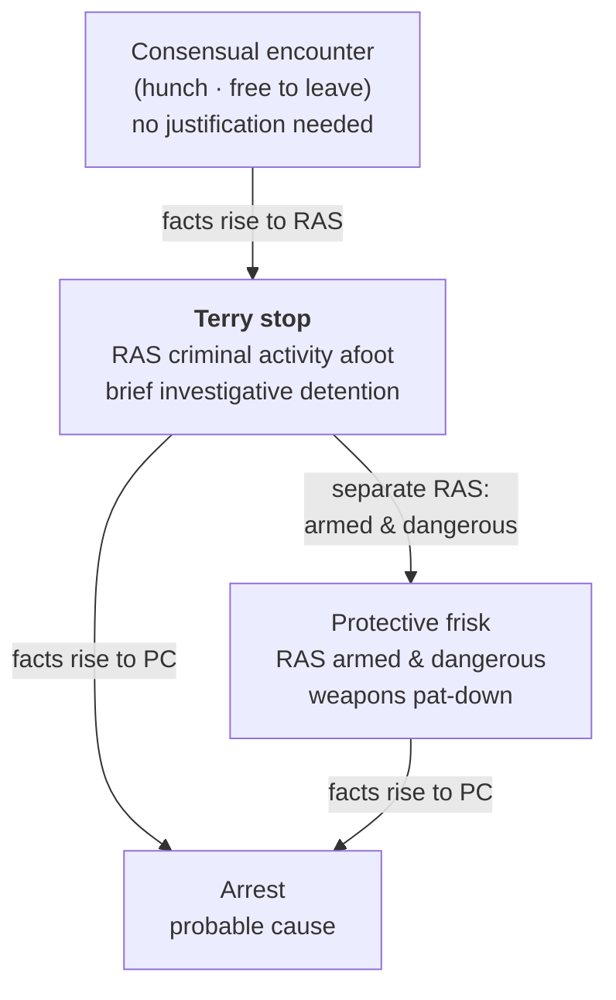

## Rule
On **reasonable, articulable suspicion (RAS)** that criminal activity is afoot, an officer may make a **brief investigative stop**; and on RAS that the person is **armed and dangerous**, may conduct a **limited protective frisk** — a pat-down of the outer clothing for weapons. RAS is **more than an inchoate hunch but less than probable cause**, judged on the **totality of the circumstances** on a **particularized and objective** basis. To justify the intrusion "the police officer must be able to point to specific and articulable facts which, taken together with rational inferences from those facts, reasonably warrant that intrusion." *Terry v. Ohio*, 392 U.S. 1, 21 (1968); *United States v. Cortez*, 449 U.S. 411, 417-18 (1981). This is the rung above a hunch (consensual encounter — see [[Seizure of the Person]]) and below an arrest on probable cause.

## Key cases
| Case (Bluebook) | Holding in one line | Weight | CourtListener |
|---|---|---|---|
| *Terry v. Ohio*, 392 U.S. 1 (1968) | Foundation: on RAS criminal activity is afoot an officer may make a brief stop, and on RAS the person is **armed and presently dangerous** may conduct a protective frisk of the outer clothing for weapons. | SCOTUS — binding | [link](https://www.courtlistener.com/opinion/107729/terry-v-ohio/) |
| *Adams v. Williams*, 407 U.S. 143 (1972) | RAS (and a frisk) may rest on a **reliable informant's tip**, not only the officer's own observation. | SCOTUS — binding | [link](https://www.courtlistener.com/opinion/108571/adams-v-williams/) |
| *United States v. Cortez*, 449 U.S. 411 (1981) | RAS = a **particularized and objective basis** on the **totality of the circumstances** (the "whole picture"). | SCOTUS — binding | [link](https://www.courtlistener.com/opinion/110377/united-states-v-cortez/) |
| *United States v. Sokolow*, 490 U.S. 1 (1989) | Factors **each individually consistent with innocence** can, taken together, amount to RAS. | SCOTUS — binding | [link](https://www.courtlistener.com/opinion/112239/united-states-v-sokolow/) |
| *Alabama v. White*, 496 U.S. 325 (1990) | An anonymous tip **sufficiently corroborated** by police work can supply RAS (a "close case"). | SCOTUS — binding | [link](https://www.courtlistener.com/opinion/112454/alabama-v-white/) |
| *Florida v. J.L.*, 529 U.S. 266 (2000) | A **bare anonymous tip** that a person is carrying a gun, without more, is **not** RAS. | SCOTUS — binding | [link](https://www.courtlistener.com/opinion/118352/florida-v-jl/) |
| *Illinois v. Wardlow*, 528 U.S. 119 (2000) | **Unprovoked headlong flight** in a high-crime area can furnish RAS. | SCOTUS — binding | [link](https://www.courtlistener.com/opinion/118326/illinois-v-wardlow/) |
| *United States v. Arvizu*, 534 U.S. 266 (2002) | Totality governs; reviewing courts may **not** use a **divide-and-conquer** analysis of each factor. | SCOTUS — binding | [link](https://www.courtlistener.com/opinion/118474/united-states-v-arvizu/) |
| *Hiibel v. Sixth Judicial Dist. Court*, 542 U.S. 177 (2004) | A state stop-and-identify law compelling a name during a **valid Terry stop** is consistent with the 4A. | SCOTUS — binding | [link](https://www.courtlistener.com/opinion/136990/hiibel-v-sixth-judicial-dist-court-of-nev-humboldt-cty/) |
| *Navarette v. California*, 572 U.S. 393 (2014) | A **911 caller's tip** bearing adequate indicia of reliability can supply RAS for a stop. | SCOTUS — binding | [link](https://www.courtlistener.com/opinion/2670795/prado-navarette-v-california/) |

## Related cases across doctrines
These cases are treated in full on other pages but bear directly on Terry stops and reasonable suspicion; each row frames the holding for this doctrine.

| Case | Relevance to Terry stops & reasonable suspicion | Primary treatment | CourtListener |
|---|---|---|---|
| *Michigan v. Long*, 463 U.S. 1032 (1983) | *Terry*'s protective-frisk rationale extends to the passenger compartment of a vehicle: on specific and articulable facts giving a reasonable belief the suspect is dangerous and may gain immediate control of weapons, an officer may frisk the areas of the car where a weapon could be hidden — a "frisk" of the car, not just the person. | [[Traffic Stops]] | [opinion](https://www.courtlistener.com/opinion/111020/michigan-v-long/) |
| *United States v. Hensley*, 469 U.S. 221 (1985) | An officer may make a *Terry* investigatory stop in objective reliance on a wanted flyer or bulletin issued by another department, if the issuing department had RAS to issue it — RAS to stop can rest on collective knowledge, not just the stopping officer's own observation. | [[Collective Knowledge and the Fellow-Officer Rule]] | [opinion](https://www.courtlistener.com/opinion/111294/united-states-v-hensley/) |
| *Whiteley v. Warden*, 401 U.S. 560 (1971) | An officer may act on a police radio bulletin and assume the issuing officer had the requisite suspicion; but if the originating officer in fact lacked RAS/PC, the stop is not saved by the responding officer's good-faith reliance — the suspicion must exist somewhere in the chain. | [[Collective Knowledge and the Fellow-Officer Rule]] | [opinion](https://www.courtlistener.com/opinion/108297/whiteley-v-warden-wyoming-state-penitentiary/) |
| *United States v. Brignoni-Ponce*, 422 U.S. 873 (1975) | Roving Border Patrol may stop a vehicle to question occupants only on reasonable suspicion based on specific articulable facts — an early application of *Terry* to vehicle stops that enumerates permissible RAS factors and forbids reliance on apparent ancestry alone. | [[Border Searches]] | [opinion](https://www.courtlistener.com/opinion/109311/united-states-v-brignoni-ponce/) |
| *Ornelas v. United States*, 517 U.S. 690 (1996) | Determinations of reasonable suspicion (and probable cause) are reviewed de novo on appeal, with due weight to inferences drawn by local officers — the standard of review that governs how RAS rulings are tested in the suppression courts. | [[Probable Cause and Reasonable Suspicion]] | [opinion](https://www.courtlistener.com/opinion/118030/ornelas-v-united-states/) |
| *Rodriguez v. United States*, 575 U.S. 348 (2015) | A detention may last no longer than necessary to complete its mission; absent independent reasonable suspicion, an officer may not prolong a stop (e.g., for a dog sniff) beyond the time needed to pursue its purpose — the duration/diligence limit that turns an over-long *Terry* stop into an unlawful seizure. | [[Traffic Stops]] | [opinion](https://www.courtlistener.com/opinion/2795278/rodriguez-v-united-states/) |
| *Delaware v. Prouse*, 440 U.S. 648 (1979) | Random, suspicionless stops to check license and registration are unreasonable; an officer needs at least articulable, reasonable suspicion — confirming RAS is the floor for an individualized investigative stop. | [[Traffic Stops]] | [opinion](https://www.courtlistener.com/opinion/110045/delaware-v-prouse/) |
| *United States v. Vinton*, 594 F.3d 14 (D.C. Cir. 2010) | *Michigan v. Long*'s protective vehicle frisk survives *Arizona v. Gant*: even where *Gant* bars a search-incident, an officer with RAS that a stopped occupant is dangerous and may access a weapon may conduct a *Terry* frisk of the passenger compartment. **(D.C. Cir. — persuasive, not binding.)** | [[Traffic Stops]] | [opinion](https://www.courtlistener.com/opinion/187527/united-states-v-vinton/) |

## Nuances & limits
- **Two separate RAS showings — a lawful stop does not auto-authorize a frisk.** RAS-to-STOP (criminal activity afoot) is distinct from RAS-to-FRISK (armed and dangerous); the frisk needs its own armed-and-dangerous suspicion. *Terry* authorizes the frisk only "where a police officer observes unusual conduct which leads him reasonably to conclude in light of his experience that criminal activity may be afoot and that the persons with whom he is dealing may be armed and presently dangerous … he is entitled for the protection of himself and others in the area to conduct a carefully limited search of the outer clothing of such persons in an attempt to discover weapons which might be used to assault him." *Terry*, 392 U.S. at 30.
- **The frisk is for WEAPONS, not evidence.** It is a pat-down of outer clothing to find weapons, not a search for contraband — though contraband whose incriminating nature is immediately apparent by touch may be seized ("plain feel," no further manipulation). (Cross-reference [[Plain View Doctrine]].)
- **The RAS standard.** The "whole picture" controls: "the totality of the circumstances—the whole picture—must be taken into account. Based upon that whole picture the detaining officers must have a particularized and objective basis for suspecting the particular person stopped of criminal activity." *Cortez*, 449 U.S. at 417-18. Individually innocent factors can combine: "Any one of these factors is not by itself proof of any illegal conduct and is quite consistent with innocent travel. But we think taken together they amount to reasonable suspicion." *Sokolow*, 490 U.S. at 9. And reviewing courts may not parse each factor in isolation — "*Terry* … precludes this sort of divide-and-conquer analysis." *Arvizu*, 534 U.S. at 274.
- **Tips spectrum.** A known **reliable informant's** tip can support a stop and frisk: "we reject respondent's argument that reasonable cause for a stop and frisk can only be based on the officer's personal observation, rather than on information supplied by another person." *Adams*, 407 U.S. at 147. A **corroborated anonymous** tip can suffice, though "[a]lthough it is a close case … the anonymous tip, as corroborated, exhibited sufficient indicia of reliability to justify the investigatory stop of respondent's car." *White*, 496 U.S. at 332. But a **bare anonymous** gun tip does not: an accurate description of "readily observable location and appearance … does not show that the tipster has knowledge of concealed criminal activity." *J.L.*, 529 U.S. at 272. A **911 call** with adequate indicia of reliability can supply RAS — "the call bore adequate indicia of reliability for the officer to credit the caller's account." *Navarette*, 572 U.S. at 398-99.
- **Flight + high-crime area.** "Headlong flight—wherever it occurs—is the consummate act of evasion: It is not necessarily indicative of wrongdoing, but it is certainly suggestive of such." *Wardlow*, 528 U.S. at 124. Context plus flight is what mattered: "it was not merely respondent's presence in an area of heavy narcotics trafficking that aroused the officers' suspicion, but his unprovoked flight upon noticing the police." *Id.* (High-crime area alone is not enough.)
- **Compelled identification.** During a valid stop a State may, by stop-and-identify statute, require the suspect to give his name: "A state law requiring a suspect to disclose his name in the course of a valid Terry stop is consistent with Fourth Amendment prohibitions against unreasonable searches and seizures." *Hiibel*, 542 U.S. at 188. (This is the **federal** holding; whether any given statute reaches further is a state-law question — *Hiibel* arose under a Nevada statute.)
- **Duration and scope.** A Terry stop must be **brief and diligently pursued**; an officer may not prolong it beyond the time needed to pursue its purpose, and an over-intrusive detention becomes a **de facto arrest requiring probable cause**. (Cross-reference [[Traffic Stops]] for diligence/duration — *Rodriguez*/*Sharpe* — and the vehicle-frisk and traffic application of Terry.)
- **Burden.** The government bears the burden of pointing to specific, articulable facts establishing RAS; a bare conclusory 'I had a hunch' will not do.

## Common pitfalls
- **Treating a lawful stop as automatic authority to frisk.** The frisk needs its own armed-and-dangerous RAS — two separate showings.
- **Frisking for evidence rather than weapons.** The pat-down is for weapons; only contraband immediately apparent by plain feel may be seized.
- **Relying on a bare anonymous tip.** Without corroboration or reliability indicia, an anonymous gun tip is not RAS. (*J.L.*)
- **"High-crime area" alone = RAS.** No — *Wardlow* required unprovoked flight *plus* the high-crime context.
- **Prolonging the stop past its purpose.** A diligence-less or overlong detention becomes a de facto arrest needing probable cause. (Cross-reference [[Traffic Stops]] — *Rodriguez*.)
- **Calling RAS a mere "hunch" or conflating it with probable cause.** RAS is *more than* a hunch and *less than* PC — articulable, particularized, objective.

## Visual

## Recent developments & subsequent treatment
The SCOTUS framework is stable, but the circuits continue to police its edges — tightening the *J.L.*/*Navarette* tip line against vague, lawful-sounding reports, and dividing over whether the frisk branch requires "armed **and** dangerous" or collapses into "armed" alone in jurisdictions that permit gun carry. The decisions below are circuit law: **persuasive, not binding**, and never nationwide rules.

- **United States v. Daniels, 101 F.4th 770 (10th Cir. 2024)** — A near-anonymous 911 tip (three Black men in dark hoodies near an idling SUV, reporting no actual illegality at issue) plus the suspect's presence did not amount to reasonable suspicion on de novo totality-of-the-circumstances review; overly generic tips give police excessive discretion and fall below the reasonable-suspicion floor, so suppression was affirmed. This tightens the *Florida v. J.L.*/*Navarette* line by stressing that vague, uncorroborated tips reporting lawful-sounding conduct fall short of RAS. **Tenth Circuit — persuasive, not binding.** ⚖ Circuit split. (The panel applies and tightens existing doctrine; treat the split flag as a doctrinal-tightening signal, not an opinion-recognized conflict.) [opinion](https://www.courtlistener.com/opinion/9500360/united-states-v-daniels/)
- **United States v. Robinson (4th Cir. 2017)** (en banc) — Once a lawful stop has occurred, reasonable suspicion that the person is **armed** is, by itself, enough to frisk — collapsing "armed and dangerous" into a single inquiry on the theory that the risk of danger is created simply because a forcibly-stopped person is armed; the presumptive lawfulness of gun possession under state law does not negate the officer-safety basis for the frisk, and denial of suppression was affirmed. **Fourth Circuit (en banc) — persuasive, not binding.** ⚖ Circuit split. "[A]n officer who makes a lawful traffic stop and who has a reasonable suspicion that one of the automobile's occupants is armed may frisk that individual for the officer's protection and the safety of everyone on the scene." 846 F.3d at 696. [opinion](https://www.courtlistener.com/opinion/4340460/united-states-v-shaquille-robinson/)
- **United States v. Black (4th Cir. 2013)** — Where a State permits open carry, the exercise of that right "without more" cannot justify an investigatory detention; the court rejected stacking innocent, suspicion-free facts (high-crime area, late hour, a companion's minor record, an out-of-district ID) and demanded something substantial beyond the gun, warranting suppression. **Fourth Circuit — persuasive, not binding.** ⚖ Circuit split. "[W]here a state permits individuals to openly carry firearms, the exercise of this right, without more, cannot justify an investigatory detention." 707 F.3d at 540. [opinion](https://www.courtlistener.com/opinion/821235/united-states-v-nathaniel-black/)

## Sources
- *Terry v. Ohio*, 392 U.S. 1 (1968) — https://www.courtlistener.com/opinion/107729/terry-v-ohio/
- *Adams v. Williams*, 407 U.S. 143 (1972) — https://www.courtlistener.com/opinion/108571/adams-v-williams/
- *United States v. Cortez*, 449 U.S. 411 (1981) — https://www.courtlistener.com/opinion/110377/united-states-v-cortez/
- *United States v. Sokolow*, 490 U.S. 1 (1989) — https://www.courtlistener.com/opinion/112239/united-states-v-sokolow/
- *Alabama v. White*, 496 U.S. 325 (1990) — https://www.courtlistener.com/opinion/112454/alabama-v-white/
- *Florida v. J.L.*, 529 U.S. 266 (2000) — https://www.courtlistener.com/opinion/118352/florida-v-jl/
- *Illinois v. Wardlow*, 528 U.S. 119 (2000) — https://www.courtlistener.com/opinion/118326/illinois-v-wardlow/
- *United States v. Arvizu*, 534 U.S. 266 (2002) — https://www.courtlistener.com/opinion/118474/united-states-v-arvizu/
- *Hiibel v. Sixth Judicial Dist. Court of Nev.*, 542 U.S. 177 (2004) — https://www.courtlistener.com/opinion/136990/hiibel-v-sixth-judicial-dist-court-of-nev-humboldt-cty/
- *Navarette v. California*, 572 U.S. 393 (2014) — https://www.courtlistener.com/opinion/2670795/prado-navarette-v-california/
