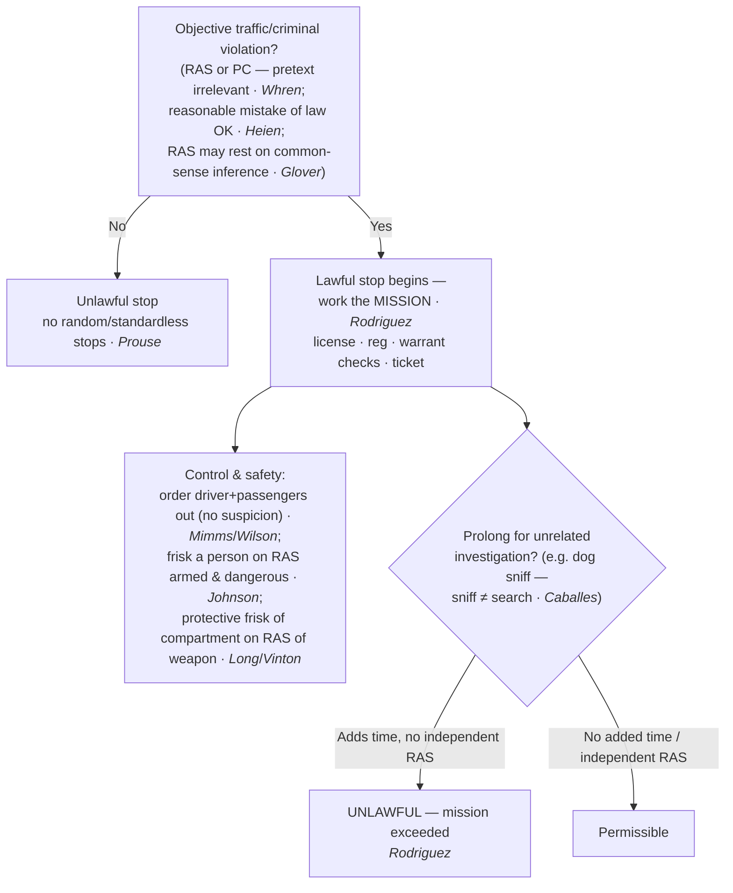

---
aliases:
  - "Traffic Stops"
title: "Traffic Stops"
topic: Traffic Stops
type: doctrine
jurisdiction: Federal (U.S. Const. amend. IV); SCOTUS baseline
status: verified
related: ["[[Search Incident to Arrest]]", "[[Automobile Exception]]", "[[Seizure of the Person]]", "[[Terry Stops and Reasonable Suspicion]]"]
---

## Rule
A traffic stop is a Fourth Amendment **seizure** of the vehicle's occupants, justified — like a *Terry* stop — by reasonable articulable suspicion (or probable cause) of a traffic or criminal violation; random, standardless stops are forbidden. *Terry v. Ohio*, 392 U.S. 1, 21 (1968); *Delaware v. Prouse*, 440 U.S. 648, 663 (1979). The bar on random, individualized stops does not forbid *suspicionless checkpoints* operated on a programmatic, non-individualized basis. Sobriety checkpoints are permissible where the program's primary purpose is highway safety, *Michigan Dep't of State Police v. Sitz*, 496 U.S. 444 (1990), but a checkpoint whose primary purpose is general crime control (e.g., interdicting narcotics) is unconstitutional, *City of Indianapolis v. Edmond*, 531 U.S. 32 (2000). An information-seeking checkpoint that briefly stops motorists to ask for help solving a recent crime is reasonable, *Illinois v. Lidster*, 540 U.S. 419 (2004). The officer's **subjective motive is irrelevant**: an objectively valid violation makes the stop reasonable even if pretextual. *Whren v. United States*, 517 U.S. 806, 813 (1996). The stop's **mission** governs its lawful duration — police may address the violation and conduct ordinary incidents (license, registration, warrant checks) but may **not prolong** the stop, even briefly, for unrelated investigation absent independent reasonable suspicion. *Rodriguez v. United States*, 575 U.S. 348, 350–51 (2015). During a lawful stop officers may order the **driver and passengers** out of the car, and may conduct a **protective search of the passenger compartment** on reasonable suspicion a weapon is present. *Pennsylvania v. Mimms*, 434 U.S. 106 (1977); *Maryland v. Wilson*, 519 U.S. 408 (1997); *Michigan v. Long*, 463 U.S. 1032 (1983).

## Key cases
| Case (Bluebook) | Holding in one line | Weight | CourtListener |
|---|---|---|---|
| *Terry v. Ohio*, 392 U.S. 1 (1968) | An investigative detention needs specific, articulable reasonable suspicion — not an inchoate "hunch." | SCOTUS — binding (predicate) | [link](https://www.courtlistener.com/opinion/107729/terry-v-ohio/) |
| *Delaware v. Prouse*, 440 U.S. 648 (1979) | No random, suspicionless license/registration stops; an officer needs at least articulable reasonable suspicion. | SCOTUS — binding | [link](https://www.courtlistener.com/opinion/110045/delaware-v-prouse/) |
| *Kansas v. Glover*, 589 U.S. 376 (2020) | Reasonable suspicion may rest on a **common-sense inference** (registered owner with a revoked license is likely the driver). | SCOTUS — binding | [link](https://www.courtlistener.com/opinion/9231313/kansas-v-glover/) |
| *Pennsylvania v. Mimms*, 434 U.S. 106 (1977) | Officer may order the **driver** out of a lawfully stopped car as a matter of course. | SCOTUS — binding | [link](https://www.courtlistener.com/opinion/109751/pennsylvania-v-mimms/) |
| *Maryland v. Wilson*, 519 U.S. 408 (1997) | Officer may order **passengers** out too, pending completion of the stop. | SCOTUS — binding | [link](https://www.courtlistener.com/opinion/118086/maryland-v-wilson/) |
| *Brendlin v. California*, 551 U.S. 249 (2007) | A **passenger is also seized** by the stop and so may challenge its constitutionality (standing to suppress). | SCOTUS — binding | [link](https://www.courtlistener.com/opinion/145712/brendlin-v-california/) |
| *Arizona v. Johnson*, 555 U.S. 323 (2009) | An officer may **frisk a passenger** only on reasonable suspicion the person is **armed and dangerous**. | SCOTUS — binding | [link](https://www.courtlistener.com/opinion/145912/arizona-v-johnson/) |
| *Whren v. United States*, 517 U.S. 806 (1996) | **Pretext is irrelevant**; an objective traffic violation / probable cause justifies the stop. | SCOTUS — binding | [link](https://www.courtlistener.com/opinion/118036/whren-v-united-states/) |
| *Heien v. North Carolina*, 574 U.S. 54 (2014) | An **objectively reasonable mistake of law** can supply the reasonable suspicion for a stop. | SCOTUS — binding | [link](https://www.courtlistener.com/opinion/2760668/heien-v-north-carolina/) |
| *Rodriguez v. United States*, 575 U.S. 348 (2015) | No prolonging beyond the stop's **mission** without independent reasonable suspicion; diligence is the measure. | SCOTUS — binding | [link](https://www.courtlistener.com/opinion/2795278/rodriguez-v-united-states/) |
| *United States v. Sharpe*, 470 U.S. 675 (1985) | Duration is a **diligence** test (confirm or dispel suspicion quickly) — no rigid time limit. | SCOTUS — binding | [link](https://www.courtlistener.com/opinion/111378/united-states-v-sharpe/) |
| *Illinois v. Caballes*, 543 U.S. 405 (2005) | A **dog sniff** during a lawful stop is **not a search**; the only defect is added time. | SCOTUS — binding | [link](https://www.courtlistener.com/opinion/137742/illinois-v-caballes/) |
| *Michigan v. Long*, 463 U.S. 1032 (1983) | **Protective vehicle frisk** of the passenger compartment on reasonable suspicion of a weapon (*Terry* for cars). | SCOTUS — binding | [link](https://www.courtlistener.com/opinion/111020/michigan-v-long/) |
| *United States v. Vinton*, 594 F.3d 14 (D.C. Cir. 2010) | The *Long* protective search is **not abated** by handcuffing / removing the detainee. | Circuit (D.C.) — persuasive | [link](https://www.courtlistener.com/opinion/187527/united-states-v-vinton/) |
| *Berkemer v. McCarty*, 468 U.S. 420 (1984) | *(5A / Miranda cross-doctrine)* An ordinary traffic stop is *Terry*-like and is **not** Miranda "custody." | SCOTUS — binding | [link](https://www.courtlistener.com/opinion/111249/berkemer-v-mccarty/) |
| *New York v. Belton*, 453 U.S. 454 (1981) | *(cross-ref — SITA)* Scope of vehicle search incident to arrest = passenger compartment + containers (automatic-vehicle-SITA scope narrowed for vehicles by *Gant* — see next row). | SCOTUS — binding | [link](https://www.courtlistener.com/opinion/110559/new-york-v-belton/) |
| *Arizona v. Gant*, 556 U.S. 332 (2009) | *(cross-ref — SITA)* When vehicle SITA is allowed (two prongs). | SCOTUS — binding | [link](https://www.courtlistener.com/opinion/145887/arizona-v-gant/) |

## Related cases across doctrines
These cases are treated in full elsewhere but bear on the law of traffic stops; each holding is framed below for this doctrine.

| Case | Relevance to traffic stops | Primary treatment | CourtListener |
|---|---|---|---|
| *Navarette v. California*, 572 U.S. 393 (2014) | A 911 call reporting a specific dangerous-driving incident, with adequate indicia of reliability, can itself supply the reasonable suspicion to initiate the traffic stop. | [[Probable Cause and Reasonable Suspicion]] | [opinion](https://www.courtlistener.com/opinion/2670795/prado-navarette-v-california/) |
| *Florida v. Harris*, 568 U.S. 237 (2013) | A trained/certified dog's alert during the stop furnishes probable cause to search the vehicle — the back end of the *Caballes*/*Rodriguez* dog-sniff sequence (sniff is not a search; a positive alert is PC). | [[Probable Cause and Reasonable Suspicion]] | [opinion](https://www.courtlistener.com/opinion/820744/florida-v-harris/) |
| *Maryland v. Pringle*, 540 U.S. 366 (2003) | When drugs/cash are found in a stopped car and no occupant claims them, the officer has probable cause to arrest every occupant — the arrest authority that can follow a lawful stop. | [[Probable Cause and Reasonable Suspicion]] | [opinion](https://www.courtlistener.com/opinion/131150/maryland-v-pringle/) |
| *Devenpeck v. Alford*, 543 U.S. 146 (2004) | Reinforces *Whren*'s objective rule: an arrest (or stop) is valid so long as the known facts give probable cause for SOME offense — the officer's stated or subjective reason is irrelevant. | [[Probable Cause and Reasonable Suspicion]] | [opinion](https://www.courtlistener.com/opinion/137733/devenpeck-v-alford/) |
| *Illinois v. Wardlow*, 528 U.S. 119 (2000) | Unprovoked headlong flight in a high-crime area can supply the reasonable suspicion that justifies a *Terry*-type detention — the RAS predicate a stop turns on. | [[Probable Cause and Reasonable Suspicion]] | [opinion](https://www.courtlistener.com/opinion/118326/illinois-v-wardlow/) |
| *United States v. Hensley*, 469 U.S. 221 (1985) | An officer may make a *Terry*/traffic-type investigatory stop in objective reliance on a wanted flyer or bulletin from another department, if the issuing agency had reasonable suspicion — supplies the RAS basis for a stop via collective knowledge. | [[Collective Knowledge and the Fellow-Officer Rule]] | [opinion](https://www.courtlistener.com/opinion/111294/united-states-v-hensley/) |
| *Whiteley v. Warden*, 401 U.S. 560 (1971) | An officer may stop/arrest on the strength of a radio bulletin assuming the issuer had cause — but if the originating agency lacked it, the stop is invalid; the limit on bulletin-based stops. | [[Collective Knowledge and the Fellow-Officer Rule]] | [opinion](https://www.courtlistener.com/opinion/108297/whiteley-v-warden-wyoming-state-penitentiary/) |
| *Riley v. California*, 573 U.S. 373 (2014) | If a stop ripens into an arrest and a phone is seized, its digital contents may NOT be searched incident to that arrest — a warrant is required; the digital limit on what the stop-then-arrest authorizes. | [[Search Incident to Arrest]] | [opinion](https://www.courtlistener.com/opinion/2680439/riley-v-cal-united-states/) |
| *Utah v. Strieff*, 579 U.S. 232 (2016) | Discovery of a valid pre-existing arrest warrant during an UNLAWFUL stop is an intervening circumstance that can attenuate the taint — the suppression backstop when a stop is bad. | [[The Exclusionary Rule]] | [opinion](https://www.courtlistener.com/opinion/8176208/utah-v-strieff/) |

## Nuances & limits
- **Pretext doesn't matter — the test is objective (*Whren*).** The officer's real reason for the stop is constitutionally beside the point:
  > "We think these cases foreclose any argument that the constitutional reasonableness of traffic stops depends on the actual motivations of the individual officers involved. … Subjective intentions play no role in ordinary, probable-cause Fourth Amendment analysis." — *Whren*, 517 U.S. at 813.

  Critical teaching point: this is **not** a green light for profiling. Race-based selective enforcement is unconstitutional — but it is policed under the **Equal Protection Clause, not the Fourth Amendment**. Don't conflate the two doctrines.
- **RAS may rest on a common-sense inference (*Glover*).** The reasonable-suspicion predicate need not come from direct observation of the driver:
  > "This case presents the question whether a police officer violates the Fourth Amendment by initiating an investigative traffic stop after running a vehicle's license plate and learning that the registered owner has a revoked driver's license. We hold that when the officer lacks information negating an inference that the owner is the driver of the vehicle, the stop is reasonable." — *Glover*, 589 U.S. at 376–77.

  Pairs with *Prouse*'s RAS floor and *Terry*'s "not a hunch": officers may draw reasonable inferences from probabilities, so long as nothing on hand negates them.
- **The mission, and the bar on prolonging it (*Rodriguez*).** The stop's duration is tethered to its purpose:
  > "[A] police stop exceeding the time needed to handle the matter for which the stop was made violates the Constitution's shield against unreasonable seizures. A seizure justified only by a police-observed traffic violation … 'become[s] unlawful if it is prolonged beyond the time reasonably required to complete th[e] mission' of issuing a ticket for the violation." — *Rodriguez*, 575 U.S. at 350–51.

  The measure is **diligence** — a test, not a stopwatch (*Sharpe*): "we consider it appropriate to examine whether the police diligently pursued a means of investigation that was likely to confirm or dispel their suspicions quickly." *United States v. Sharpe*, 470 U.S. 675, 686 (1985); see *Rodriguez*, 575 U.S. at 357 (quoting *Sharpe*). Practical corollary: questions on unrelated matters and unavoidable downtime are fine **so long as they do not add time** to the stop — multitasking during the mission is permissible; **adding time is not.**
- **The dog sniff is not a search — only the added time is (*Caballes*).** A canine sniff during a lawful stop does not itself implicate the Fourth Amendment:
  > "A dog sniff conducted during a concededly lawful traffic stop that reveals no information other than the location of a substance that no individual has any right to possess does not violate the Fourth Amendment." — *Caballes*, 543 U.S. at 409.

  So the constitutional question is never the sniff itself but whether it **prolonged** the stop beyond the mission (*Rodriguez*). A positive alert supplies probable cause to search the vehicle under the [[Automobile Exception]]. *Caballes* is the antecedent the *Rodriguez* mission rule polices.
- **Reasonable mistake of law (*Heien*).** A stop can survive even where the officer was wrong about the law, provided the error was reasonable:
  > "There is no reason, under the text of the Fourth Amendment or our precedents, why this same result should be acceptable when reached by way of a reasonable mistake of fact, but not when reached by way of a similarly reasonable mistake of law." — *Heien*, 574 U.S. at 61.

  Cabined: the mistake must itself be **objectively reasonable** — *Heien* is not a license to be ignorant of clear law.
- **Who is seized — the passenger too (*Brendlin*).** A stop seizes everyone in the car, not just the driver:
  > "When a police officer makes a traffic stop, the driver of the car is seized within the meaning of the Fourth Amendment. … We hold that a passenger is seized as well and so may challenge the constitutionality of the stop." — *Brendlin*, 551 U.S. at 251.

  Load-bearing for suppression: a passenger has **standing** to move to suppress the fruits of an unlawful stop. (See [[Seizure of the Person]] / [[Terry Stops and Reasonable Suspicion]].)
- **Ordering occupants out vs. frisking them (*Mimms* / *Wilson* / *Johnson*).** Driver: "once a motor vehicle has been lawfully detained for a traffic violation, the police officers may order the driver to get out of the vehicle without violating the Fourth Amendment's proscription of unreasonable searches and seizures." *Mimms*, 434 U.S. at 111 n.6. Passengers: "an officer making a traffic stop may order passengers to get out of the car pending completion of the stop." *Wilson*, 519 U.S. at 415. Ordering occupants out is a **control measure**, not a search, and needs **no** separate suspicion. A **frisk** is different — it requires reasonable suspicion the person is armed:
  > "To justify a patdown of the driver or a passenger during a traffic stop, however, just as in the case of a pedestrian reasonably suspected of criminal activity, the police must harbor reasonable suspicion that the person subjected to the frisk is armed and dangerous." — *Johnson*, 555 U.S. at 327.

  *Johnson* needs no separate suspicion that the passenger is engaged in crime — only that the person frisked is armed and dangerous. Triad: *Mimms*/*Wilson* (order out, no suspicion) + *Johnson* (frisk the person, RAS armed+dangerous) + *Long* (frisk the car, RAS of a weapon).
- **Protective vehicle frisk (*Long*).** *Terry*'s frisk rationale reaches the car's interior:
  > "[T]he search of the passenger compartment of an automobile, limited to those areas in which a weapon may be placed or hidden, is permissible if the police officer possesses a reasonable belief based on 'specific and articulable facts which, taken together with the rational inferences from those facts, reasonably warrant' the officer in believing that the suspect is dangerous and the suspect may gain immediate control of weapons." — *Long*, 463 U.S. at 1049.

  **Scope is tied to the weapon** — every area (and container) where the weapon could be, but no further. This is a *Terry* frisk **for cars**; it requires reasonable suspicion of a weapon, not an arrest.
- **No "search incident to citation" (*Knowles*).** *Knowles v. Iowa*, 525 U.S. 113 (1998) — there is **no "search incident to citation."** When an officer issues a citation rather than making a custodial arrest, that citation does **not** authorize a full search of the driver or vehicle incident to arrest; the search-incident-to-arrest rationale (officer safety + evidence preservation) does not extend to the mere issuance of a citation. [opinion](https://www.courtlistener.com/opinion/118250/knowles-v-iowa/).
- **The frisk survives handcuffing (*Vinton* — persuasive).** The D.C. Circuit "decline[d] to read *Gant* so expansively," holding that *Gant*'s secured-arrestee limit does not govern a *Long*/*Terry* protective search: "In the no-arrest case, the possibility of access to weapons in the vehicle always exists, since the driver or passenger will be allowed to return to the vehicle when the interrogation is completed." *Vinton*, 594 F.3d at 24–25 n.3 (quoting *Gant*, 556 U.S. at 360 (Scalia, J., concurring)). **Persuasive D.C. Circuit only**, and the point rests in a footnote — pair it with binding *Long*; do not assert it as settled across all circuits.
- **The reasonable-suspicion predicate (*Terry*).** Everything above that turns on reasonable suspicion traces to *Terry*: weight goes "not to [the officer's] inchoate and unparticularized suspicion or 'hunch,' but to the specific reasonable inferences which he is entitled to draw from the facts in light of his experience." *Terry*, 392 U.S. at 27. (See the hunches material on [[Seizure of the Person]]; full RAS treatment on [[Terry Stops and Reasonable Suspicion]].)
- **Cross-doctrine clarifier — a traffic stop is NOT Miranda "custody" (*Berkemer*; 5A point, not 4A).** Because an ordinary stop is brief and *Terry*-like — "the usual traffic stop is more analogous to a so-called 'Terry stop' … than to a formal arrest," *Berkemer*, 468 U.S. at 439 — roadside questioning during a routine stop does not require Miranda warnings. This is a **Fifth Amendment / Miranda** point, included only to reinforce the seizure framing; it is not a Fourth Amendment reasonableness holding.

## Common pitfalls
- **Conflating pretext with race.** *Whren* blesses a pretextual stop built on an objective violation — but race-based enforcement remains unconstitutional under **Equal Protection**. Don't teach *Whren* as cover for profiling.
- **The "de minimis" extension myth.** After *Rodriguez*, even a brief dog-sniff delay tacked on once the mission is complete is unlawful without independent reasonable suspicion. The question is not "how long" but "did it add time beyond the diligently-pursued mission."
- **"The dog sniff is the violation."** Wrong: *Caballes* — the sniff itself is **not a search**. The only constitutional defect is *added time* (*Rodriguez*).
- **"Clock thinking" about duration.** Wrong: *Sharpe* — the test is **diligence** (did police pursue a means likely to confirm or dispel suspicion quickly), not a fixed number of minutes. "The stop took X minutes, therefore unlawful" is not the standard.
- **"Ordering a passenger out = authority to frisk."** Wrong: *Wilson* lets you order a passenger out with **no** suspicion; *Johnson* requires reasonable suspicion the passenger is **armed and dangerous** before any pat-down. Two different thresholds.
- **Treating the *Long* frisk as a search incident to arrest.** The protective vehicle search needs reasonable suspicion of a **weapon** and is **scope-limited to weapon-sized areas**. It is not the broader *Belton*/*Gant* search incident to arrest and requires no arrest at all. (See [[Search Incident to Arrest]].)
- **Assuming handcuffs end the weapon threat.** For a *Terry* protective search (*Vinton*) they don't — the detainee may be released back to the car. Contrast SITA, where *Gant*'s secured-arrestee limit **does** apply.
- **Mistake-of-law overreach.** *Heien* is narrow: only **objectively reasonable** legal mistakes count. An officer's ignorance of clear, settled law does not validate the stop.

## Recent developments & subsequent treatment
The *Rodriguez* "mission" framework continues to drive the modern caselaw, with the live battleground being how strictly the lower courts police "mission creep" — when unrelated questioning or checks add time to a stop. The Supreme Court has also recently sharpened the reasonableness inquiry that governs force used to effect a seizure. Persuasive circuit law below illustrates the divide but does not bind nationally.

- **Barnes v. Felix (SCOTUS 2025)** — Rejects the Fifth Circuit's "moment of threat" rule: the reasonableness of force used to effect a seizure is judged on the totality of the circumstances, an inquiry that "has no time limit" and may consider the events leading up to the use of force, not just the isolated instant of danger. Unanimously vacated the Fifth Circuit's moment-of-threat doctrine, so courts may consider earlier facts bearing on how a reasonable officer would respond. ⚖ Circuit split (resolved). "Most notable here, the 'totality of the circumstances' inquiry into a use of force has no time limit." 605 U.S. at 80. [opinion](https://www.courtlistener.com/opinion/10584846/barnes-v-felix/).
- **United States v. Cole (7th Cir. 2021) (en banc)** — En banc Seventh Circuit holds that travel-plan questions ordinarily fall WITHIN the "mission" of a traffic stop under *Rodriguez*, so asking them does not by itself unlawfully prolong the stop; affirmed denial of suppression. The decision both resolves an intra-circuit conflict and confirms a genuine post-*Rodriguez* split over how strictly to police "mission creep": circuits divide on whether brief travel-plan/itinerary questioning is within the stop's mission (permissive: 7th/3d/5th/9th/11th, per the *Cole* majority's survey) vs. a stricter reading requiring that the questioning not add any time absent independent RAS (the *Cole* dissent and some state high courts). *Rodriguez*, 575 U.S. 348 (2015), remains the controlling anchor and good law. **Persuasive Seventh Circuit only, not binding.** ⚖ Circuit split. [opinion](https://www.courtlistener.com/opinion/5307612/united-states-v-janhoi-cole/).
- **United States v. Mayville (10th Cir. 2020)** — A Triple-I criminal-history check during a speeding stop is a "negligibly burdensome" officer-safety inquiry within the stop's mission under *Rodriguez*, so it did not unlawfully prolong the stop; denial of suppression AFFIRMED. Reasonableness, not efficiency, is the touchstone. **Persuasive Tenth Circuit only, not binding.** [opinion](https://www.courtlistener.com/opinion/4742862/united-states-v-mayville/).

## Visual

## Sources
- *Terry v. Ohio*, 392 U.S. 1 (1968) — https://www.courtlistener.com/opinion/107729/terry-v-ohio/
- *Delaware v. Prouse*, 440 U.S. 648 (1979) — https://www.courtlistener.com/opinion/110045/delaware-v-prouse/
- *Kansas v. Glover*, 589 U.S. 376 (2020) — https://www.courtlistener.com/opinion/9231313/kansas-v-glover/
- *Pennsylvania v. Mimms*, 434 U.S. 106 (1977) — https://www.courtlistener.com/opinion/109751/pennsylvania-v-mimms/
- *Maryland v. Wilson*, 519 U.S. 408 (1997) — https://www.courtlistener.com/opinion/118086/maryland-v-wilson/
- *Brendlin v. California*, 551 U.S. 249 (2007) — https://www.courtlistener.com/opinion/145712/brendlin-v-california/
- *Arizona v. Johnson*, 555 U.S. 323 (2009) — https://www.courtlistener.com/opinion/145912/arizona-v-johnson/
- *Whren v. United States*, 517 U.S. 806 (1996) — https://www.courtlistener.com/opinion/118036/whren-v-united-states/
- *Heien v. North Carolina*, 574 U.S. 54 (2014) — https://www.courtlistener.com/opinion/2760668/heien-v-north-carolina/
- *Rodriguez v. United States*, 575 U.S. 348 (2015) — https://www.courtlistener.com/opinion/2795278/rodriguez-v-united-states/
- *United States v. Sharpe*, 470 U.S. 675 (1985) — https://www.courtlistener.com/opinion/111378/united-states-v-sharpe/
- *Illinois v. Caballes*, 543 U.S. 405 (2005) — https://www.courtlistener.com/opinion/137742/illinois-v-caballes/
- *Michigan v. Long*, 463 U.S. 1032 (1983) — https://www.courtlistener.com/opinion/111020/michigan-v-long/
- *United States v. Vinton*, 594 F.3d 14 (D.C. Cir. 2010) — https://www.courtlistener.com/opinion/187527/united-states-v-vinton/ *(persuasive; protective-search point in footnote — pair with Long)*
- *Berkemer v. McCarty*, 468 U.S. 420 (1984) — https://www.courtlistener.com/opinion/111249/berkemer-v-mccarty/ *(5A / Miranda cross-doctrine clarifier — traffic stop is not custody; not a 4A holding)*
- *New York v. Belton*, 453 U.S. 454 (1981) — https://www.courtlistener.com/opinion/110559/new-york-v-belton/ *(vehicle SITA scope; cross-reference — see [[Search Incident to Arrest]])*
- *Arizona v. Gant*, 556 U.S. 332 (2009) — https://www.courtlistener.com/opinion/145887/arizona-v-gant/ *(vehicle SITA trigger; cross-reference — see [[Search Incident to Arrest]])*
