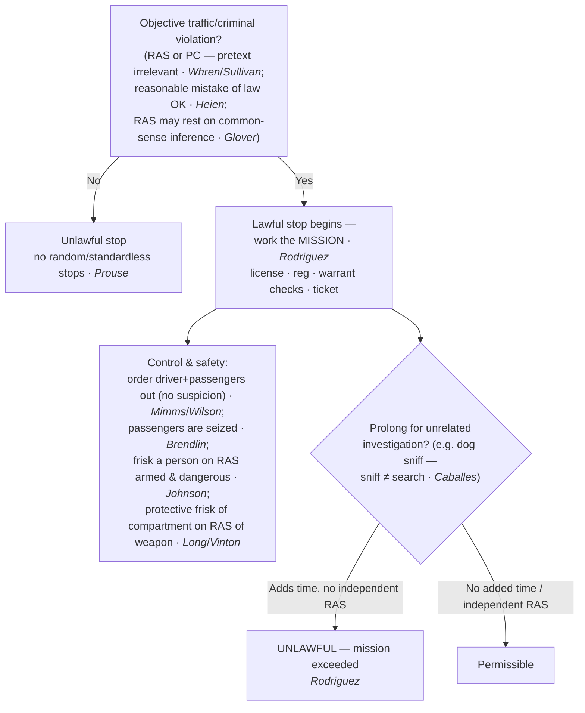

---
aliases:
  - "Traffic Stops"
title: "Traffic Stops"
topic: Traffic Stops
type: doctrine
amendment: "U.S. Const. amend. IV"
jurisdiction: Federal (U.S. Const. amend. IV); SCOTUS baseline
status: verified
related:
  - "[[Search Incident to Arrest]]"
  - "[[Automobile Exception]]"
  - "[[Seizure of the Person]]"
  - "[[Terry Stops and Reasonable Suspicion]]"
  - "[[Special Needs and Administrative Searches]]"
---

# Traffic Stops

## The Brief

**Field-decisive question:** *What may I do during a traffic stop, and how long may it last?*

**Black-letter rule.** A traffic stop is a Fourth Amendment **seizure of everyone in the vehicle**, justified — like a [[Terry v. Ohio|*Terry*]] stop — by **reasonable articulable suspicion (RAS) or probable cause of a traffic or criminal violation**. Random, standardless stops are forbidden: [[Delaware v. Prouse|*Delaware v. Prouse*]] holds an officer needs at least articulable reasonable suspicion before stopping a car to check a license or registration. The RAS predicate need not come from watching the driver — it may rest on a **common-sense inference**: in [[Kansas v. Glover|*Kansas v. Glover*]] the Court held that "when the officer lacks information negating an inference that the owner is the driver of the vehicle, the stop is reasonable," 589 U.S. at 376–77 (registered owner with a revoked license is probably the one driving). That pairs with *Prouse*'s RAS floor and [[Terry v. Ohio|*Terry*]]'s command that the stop rest on "specific reasonable inferences," not an "inchoate and unparticularized suspicion or 'hunch.'" *Terry v. Ohio*, 392 U.S. 1, 27 (1968).

**Pretext is irrelevant — the test is objective.** The officer's real reason for the stop is constitutionally beside the point. [[Whren v. United States|*Whren v. United States*]]: "Subjective intentions play no role in ordinary, probable-cause Fourth Amendment analysis." 517 U.S. at 813. An objectively valid violation makes the stop reasonable even if the officer's motive was pretextual. [[Arkansas v. Sullivan|*Arkansas v. Sullivan*]] extends *Whren* from stops to **arrests**: a probable-cause arrest is valid regardless of pretextual or subjective motive, and a State "may not impose ... greater restrictions as a matter of *federal* constitutional law" by inquiring into motive, 532 U.S. at 772. **Reasonable mistakes of law** also count: an objectively reasonable mistake of law can supply the suspicion for a stop, [[Heien v. North Carolina|*Heien v. North Carolina*]], 574 U.S. at 61 — but only an **objectively reasonable** one; *Heien* is not a license to be ignorant of clear law.

**Mission and duration — the stop is tethered to its purpose.** The stop's **mission** governs its lawful length. Police may address the violation and its ordinary incidents — checking license, registration, and warrants, and writing the ticket — but may **not prolong** the stop, even briefly, for unrelated investigation absent independent reasonable suspicion. [[Rodriguez v. United States|*Rodriguez v. United States*]]: a stop "become[s] unlawful if it is prolonged beyond the time reasonably required to complete th[e] mission" of issuing the ticket, 575 U.S. at 350–51. The measure is **diligence, not a stopwatch**: courts ask "whether the police diligently pursued a means of investigation that was likely to confirm or dispel their suspicions quickly," [[United States v. Sharpe|*United States v. Sharpe*]], 470 U.S. 675, 686 (1985). So unrelated questions and unavoidable downtime are fine **so long as they add no time** to the stop — multitasking during the mission is permitted; adding time is not. The recurring example is the **dog sniff**: a canine sniff during a lawful stop "does not violate the Fourth Amendment" because it "reveals no information other than the location of a substance that no individual has any right to possess," [[Illinois v. Caballes|*Illinois v. Caballes*]], 543 U.S. 405, 409 (2005) — the sniff is **not a search**, so the only constitutional defect is the **added time** *Rodriguez* polices. A positive alert then supplies probable cause to search the vehicle under the [[Automobile Exception]].

**Control measures — who may be moved, and who may be frisked.** During a lawful stop the officer may, **as a control measure needing no separate suspicion**, order the **driver** out, [[Pennsylvania v. Mimms|*Pennsylvania v. Mimms*]], 434 U.S. at 111 n.6, and the **passengers** out "pending completion of the stop," [[Maryland v. Wilson|*Maryland v. Wilson*]], 519 U.S. at 415. Everyone in the car is **seized** — including a passenger, who therefore has **standing** to challenge the stop, [[Brendlin v. California|*Brendlin v. California*]], 551 U.S. at 251. Ordering occupants out is **not a search**; a **frisk is different**. To pat down a driver or passenger the officer must "harbor reasonable suspicion that the person subjected to the frisk is armed and dangerous," [[Arizona v. Johnson|*Arizona v. Johnson*]], 555 U.S. at 327 — *Johnson* requires no separate suspicion of crime, only that the person frisked is armed and dangerous. The **car's interior** may be frisked too: a protective search of the passenger compartment, "limited to those areas in which a weapon may be placed or hidden," is permissible on a reasonable belief "that the suspect is dangerous and ... may gain immediate control of weapons," [[Michigan v. Long|*Michigan v. Long*]], 463 U.S. at 1049 — a *Terry* frisk **for cars**, scope-tied to the weapon and requiring no arrest. That protective search is **not abated by handcuffing or removing** the detainee, who may be returned to the car, [[United States v. Vinton|*United States v. Vinton*]], 594 F.3d at 24–25 (Binding in-circuit — D.C. Cir.; persuasive elsewhere; the point rests in a footnote — pair it with binding *Long*).

**Checkpoints — the suspicionless exception (cross-doctrine).** The bar on random, *individualized* stops does **not** forbid **suspicionless checkpoints** run on a programmatic, non-individualized basis. A sobriety checkpoint whose primary purpose is highway safety is permissible, [[Michigan Dept. of State Police v. Sitz|*Michigan Dep't of State Police v. Sitz*]]; a checkpoint whose primary purpose is **general crime control** (e.g., narcotics interdiction) is not, [[City of Indianapolis v. Edmond|*City of Indianapolis v. Edmond*]]; and a brief **information-seeking** checkpoint to ask motorists for help solving a recent crime is reasonable, [[Illinois v. Lidster|*Illinois v. Lidster*]]. Checkpoints are treated in full under [[Special Needs and Administrative Searches]].

**Burden, standard of review, and remedy.** On a motion to suppress, the **defendant/movant** bears the initial burden of showing a Fourth Amendment seizure; because a traffic stop is warrantless, the **government** must then justify it by showing RAS or PC of a violation (and, for any prolongation, independent RAS). The existence of reasonable suspicion or probable cause is reviewed **de novo**, with the underlying historical facts reviewed for **clear error**, [[Ornelas v. United States|*Ornelas v. United States*]], 517 U.S. 690, 699 (1996). **Remedy:** an unlawful stop (or unlawful prolongation) leads to **suppression** of its fruits unless an exclusionary-rule exception applies — and note that a **valid pre-existing warrant** discovered mid-stop can attenuate the taint, [[Utah v. Strieff|*Utah v. Strieff*]] (see [[The Exclusionary Rule]]).

**Pitfalls.**

- **Conflating pretext with race.** *[[Whren v. United States|Whren]]* blesses a pretextual stop built on an objective violation — but race-based selective enforcement remains unconstitutional under the **Equal Protection Clause, not the Fourth Amendment**. Don't teach *Whren* as cover for profiling.
- **The "de minimis" extension myth.** After *[[Rodriguez v. United States|Rodriguez]]*, even a brief dog-sniff delay tacked on once the mission is complete is unlawful without independent reasonable suspicion. The question is never "how long" but "did it add time beyond the diligently-pursued mission."
- **"The dog sniff is the violation."** Wrong — *[[Illinois v. Caballes|Caballes]]*: the sniff is **not a search**; the only defect is added time.
- **"Clock thinking" about duration.** Wrong — *[[United States v. Sharpe|Sharpe]]*: the test is **diligence**, not a fixed number of minutes.
- **"Ordering a passenger out = authority to frisk."** Two different thresholds: *[[Maryland v. Wilson|Wilson]]* lets you order a passenger out with **no** suspicion; *[[Arizona v. Johnson|Johnson]]* requires reasonable suspicion the person is **armed and dangerous** before any pat-down.
- **Treating the *Long* frisk as a search incident to arrest.** The protective vehicle search needs reasonable suspicion of a **weapon** and is **scope-limited to weapon-sized areas**; it is not the broader *Belton*/*Gant* [[Search Incident to Arrest|search incident to arrest]] and requires no arrest. And handcuffs do **not** end the weapon threat for a *[[Michigan v. Long|Long]]* / *[[United States v. Vinton|Vinton]]* protective search.
- **Mistake-of-law overreach.** *[[Heien v. North Carolina|Heien]]* is narrow — only **objectively reasonable** legal mistakes validate a stop; ignorance of clear, settled law does not.
- **No "search incident to citation."** Issuing a citation rather than making a custodial arrest does **not** authorize a full search of the driver or car, *[[Knowles v. Iowa|Knowles v. Iowa]]* — the search-incident-to-arrest rationale does not extend to a mere citation.

**Cross-doctrine clarifier (Fifth Amendment, not Fourth).** An ordinary traffic stop is brief and *Terry*-like — "the usual traffic stop is more analogous to a so-called 'Terry stop' ... than to a formal arrest," [[Berkemer v. McCarty|*Berkemer v. McCarty*]], 468 U.S. at 439 — so roadside questioning during a routine stop is **not** Miranda "custody." This is a **Fifth Amendment / Miranda** point, included only to reinforce the seizure framing; it is not a Fourth Amendment reasonableness holding.

## Key cases

| Case (Bluebook) | Holding (one line) | Weight | Treatment | CourtListener | Case page |
|---|---|---|---|---|---|
| *Whren v. United States*, 517 U.S. 806 (1996) | **Pretext is irrelevant**; an objective traffic violation / probable cause justifies the stop — subjective motive plays no role. | Binding — SCOTUS | good *(2026-06-30)* | [opinion](https://www.courtlistener.com/opinion/118036/whren-v-united-states/) | [[Whren v. United States]] |
| *Arkansas v. Sullivan*, 532 U.S. 769 (2001) | Extends *Whren* to **arrests**: a probable-cause arrest is valid regardless of pretextual/subjective motive, and a State may not read the federal Constitution to forbid pretextual arrests. | Binding — SCOTUS | good *(2026-06-30)* | [opinion](https://www.courtlistener.com/opinion/2620699/arkansas-v-sullivan/) | [[Arkansas v. Sullivan]] |
| *Delaware v. Prouse*, 440 U.S. 648 (1979) | No random, suspicionless license/registration stops; an officer needs at least articulable reasonable suspicion. | Binding — SCOTUS | good *(2026-06-30)* | [opinion](https://www.courtlistener.com/opinion/110045/delaware-v-prouse/) | [[Delaware v. Prouse]] |
| *Kansas v. Glover*, 589 U.S. 376 (2020) | Reasonable suspicion may rest on a **common-sense inference** (registered owner with a revoked license is likely the driver) absent information negating it. | Binding — SCOTUS | good *(2026-06-30)* | [opinion](https://www.courtlistener.com/opinion/9231313/kansas-v-glover/) | [[Kansas v. Glover]] |
| *Heien v. North Carolina*, 574 U.S. 54 (2014) | An **objectively reasonable mistake of law** can supply the reasonable suspicion for a stop. | Binding — SCOTUS | good *(2026-06-30)* | [opinion](https://www.courtlistener.com/opinion/2760668/heien-v-north-carolina/) | [[Heien v. North Carolina]] |
| *Rodriguez v. United States*, 575 U.S. 348 (2015) | No prolonging beyond the stop's **mission** without independent reasonable suspicion; diligence is the measure. | Binding — SCOTUS | good *(2026-06-30)* | [opinion](https://www.courtlistener.com/opinion/2795278/rodriguez-v-united-states/) | [[Rodriguez v. United States]] |
| *Illinois v. Caballes*, 543 U.S. 405 (2005) | A **dog sniff** during a lawful stop is **not a search**; the only defect is added time. | Binding — SCOTUS | good *(2026-06-30)* | [opinion](https://www.courtlistener.com/opinion/137742/illinois-v-caballes/) | [[Illinois v. Caballes]] |
| *Pennsylvania v. Mimms*, 434 U.S. 106 (1977) | Officer may order the **driver** out of a lawfully stopped car as a matter of course. | Binding — SCOTUS | good *(2026-06-30)* | [opinion](https://www.courtlistener.com/opinion/109751/pennsylvania-v-mimms/) | [[Pennsylvania v. Mimms]] |
| *Maryland v. Wilson*, 519 U.S. 408 (1997) | Officer may order **passengers** out too, pending completion of the stop. | Binding — SCOTUS | good *(2026-06-30)* | [opinion](https://www.courtlistener.com/opinion/118086/maryland-v-wilson/) | [[Maryland v. Wilson]] |
| *Arizona v. Johnson*, 555 U.S. 323 (2009) | A **frisk** of a driver or passenger requires reasonable suspicion the person is **armed and dangerous**. | Binding — SCOTUS | good *(2026-06-30)* | [opinion](https://www.courtlistener.com/opinion/145912/arizona-v-johnson/) | [[Arizona v. Johnson]] |
| *Michigan v. Long*, 463 U.S. 1032 (1983) | **Protective vehicle frisk** of the passenger compartment on reasonable suspicion of a weapon (*Terry* for cars). | Binding — SCOTUS | good *(2026-06-30)* | [opinion](https://www.courtlistener.com/opinion/111020/michigan-v-long/) | [[Michigan v. Long]] |
| *United States v. Vinton*, 594 F.3d 14 (D.C. Cir. 2010) | The *Long* protective search is **not abated** by handcuffing / removing the detainee. | Binding in-circuit — D.C. Cir. (persuasive elsewhere) | good *(2026-06-30)* | [opinion](https://www.courtlistener.com/opinion/187527/united-states-v-vinton/) | [[United States v. Vinton]] |

## Related cases across doctrines

These cases are treated in full on other doctrine pages but bear on the law of traffic stops; each is framed here for this doctrine.

| Case (Bluebook) | Relevance to traffic stops | Primary home (doctrine) | Treatment | CourtListener | Case page |
|---|---|---|---|---|---|
| *Terry v. Ohio*, 392 U.S. 1 (1968) | The reasonable-suspicion predicate a stop turns on; a traffic stop is a *Terry*-type seizure needing specific, articulable facts — not a hunch. | [[Terry Stops and Reasonable Suspicion]] | good *(2026-06-30)* | [opinion](https://www.courtlistener.com/opinion/107729/terry-v-ohio/) | [[Terry v. Ohio]] |
| *Brendlin v. California*, 551 U.S. 249 (2007) | A **passenger is also seized** by the stop and so has **standing** to challenge its constitutionality. | [[Standing to Challenge a Search]] | good *(2026-06-30)* | [opinion](https://www.courtlistener.com/opinion/145712/brendlin-v-california/) | [[Brendlin v. California]] |
| *United States v. Sharpe*, 470 U.S. 675 (1985) | Duration is a **diligence** test (confirm or dispel suspicion quickly) — no rigid time limit. | [[Terry Stops and Reasonable Suspicion]] | good *(2026-06-30)* | [opinion](https://www.courtlistener.com/opinion/111378/united-states-v-sharpe/) | [[United States v. Sharpe]] |
| *Knowles v. Iowa*, 525 U.S. 113 (1998) | No "**search incident to citation**"; issuing a ticket instead of arresting does not authorize a full search. | [[Search Incident to Arrest]] | good *(2026-06-30)* | [opinion](https://www.courtlistener.com/opinion/118250/knowles-v-iowa/) | [[Knowles v. Iowa]] |
| *New York v. Belton*, 453 U.S. 454 (1981) | Vehicle-SITA scope = passenger compartment + containers — **limited by** [[Arizona v. Gant]] for vehicles. | [[Search Incident to Arrest]] | limited *(2026-06-30)* | [opinion](https://www.courtlistener.com/opinion/110559/new-york-v-belton/) | [[New York v. Belton]] |
| *Arizona v. Gant*, 556 U.S. 332 (2009) | When a vehicle search incident to arrest is allowed (two prongs); narrows *Belton*. | [[Search Incident to Arrest]] | good *(2026-06-30)* | [opinion](https://www.courtlistener.com/opinion/145887/arizona-v-gant/) | [[Arizona v. Gant]] |
| *New York v. Class*, 475 U.S. 106 (1986) | No reasonable expectation of privacy in a legally visible **VIN**; a minimal reach-in to read it during a lawful stop is reasonable. | [[Two Definitions of Search]] | good *(2026-06-30)* | [opinion](https://www.courtlistener.com/opinion/111600/new-york-v-class/) | [[New York v. Class]] |
| *Berkemer v. McCarty*, 468 U.S. 420 (1984) | *(5A / Miranda)* An ordinary traffic stop is *Terry*-like and is **not** Miranda "custody." | [[Miranda and Custodial Interrogation]] | good *(2026-06-30)* | [opinion](https://www.courtlistener.com/opinion/111249/berkemer-v-mccarty/) | [[Berkemer v. McCarty]] |
| *Navarette v. California*, 572 U.S. 393 (2014) | A 911 tip with adequate indicia of reliability can supply the reasonable suspicion to **initiate** the stop. | [[Probable Cause and Reasonable Suspicion]] | good *(2026-06-30)* | [opinion](https://www.courtlistener.com/opinion/2670795/prado-navarette-v-california/) | [[Navarette v. California]] |
| *Florida v. Harris*, 568 U.S. 237 (2013) | A trained dog's **alert** furnishes probable cause to search the vehicle — the back end of the *Caballes*/*Rodriguez* sniff sequence. | [[Probable Cause and Reasonable Suspicion]] | good *(2026-06-30)* | [opinion](https://www.courtlistener.com/opinion/820744/florida-v-harris/) | [[Florida v. Harris]] |
| *Maryland v. Pringle*, 540 U.S. 366 (2003) | When contraband is found and no occupant claims it, PC to **arrest every occupant** — arrest authority that can follow a lawful stop. | [[Probable Cause and Reasonable Suspicion]] | good *(2026-06-30)* | [opinion](https://www.courtlistener.com/opinion/131150/maryland-v-pringle/) | [[Maryland v. Pringle]] |
| *Devenpeck v. Alford*, 543 U.S. 146 (2004) | Reinforces *Whren*'s objective rule: a stop/arrest is valid if the known facts give PC for **some** offense, whatever the stated reason. | [[Probable Cause and Reasonable Suspicion]] | good *(2026-06-30)* | [opinion](https://www.courtlistener.com/opinion/137733/devenpeck-v-alford/) | [[Devenpeck v. Alford]] |
| *Illinois v. Wardlow*, 528 U.S. 119 (2000) | Unprovoked **headlong flight** in a high-crime area can supply the reasonable suspicion for a *Terry*-type detention. | [[Probable Cause and Reasonable Suspicion]] | good *(2026-06-30)* | [opinion](https://www.courtlistener.com/opinion/118326/illinois-v-wardlow/) | [[Illinois v. Wardlow]] |
| *United States v. Hensley*, 469 U.S. 221 (1985) | An officer may stop in objective reliance on another department's **wanted flyer** if the issuer had reasonable suspicion (collective knowledge). | [[Collective Knowledge and the Fellow-Officer Rule]] | good *(2026-06-30)* | [opinion](https://www.courtlistener.com/opinion/111294/united-states-v-hensley/) | [[United States v. Hensley]] |
| *Whiteley v. Warden*, 401 U.S. 560 (1971) | A bulletin-based stop/arrest is valid only if the **originating agency** had cause; otherwise it is invalid — the limit on bulletin-based stops. | [[Collective Knowledge and the Fellow-Officer Rule]] | good *(2026-06-30)* | [opinion](https://www.courtlistener.com/opinion/108297/whiteley-v-warden-wyoming-state-penitentiary/) | [[Whiteley v. Warden]] |
| *Riley v. California*, 573 U.S. 373 (2014) | If a stop ripens into arrest and a phone is seized, its **digital contents** may not be searched incident to arrest — a warrant is required. | [[Search Incident to Arrest]] | good *(2026-06-30)* | [opinion](https://www.courtlistener.com/opinion/2680439/riley-v-cal-united-states/) | [[Riley v. California]] |
| *Utah v. Strieff*, 579 U.S. 232 (2016) | A valid pre-existing arrest warrant discovered during an **unlawful** stop can **attenuate** the taint — the suppression backstop. | [[The Exclusionary Rule]] | good *(2026-06-30)* | [opinion](https://www.courtlistener.com/opinion/8176208/utah-v-strieff/) | [[Utah v. Strieff]] |
| *Barnes v. Felix*, 605 U.S. 73 (2025) | Force used to effect a seizure is judged on the **totality of the circumstances** ("no time limit"); rejects the Fifth Circuit's "moment of threat" rule. A SCOTUS holding — homed in the case tables, **not** Recent developments (N5). | [[Use of Force]] | good *(2026-06-30)* | [opinion](https://www.courtlistener.com/opinion/10584846/barnes-v-felix/) | [[Barnes v. Felix]] |

## Recent developments

The *Rodriguez* "mission" framework drives the modern caselaw; the live battleground is how strictly the lower courts police "**mission creep**" — when unrelated questioning or checks add time to a stop. The decisions below are circuit law — **binding only within their own circuits, persuasive elsewhere** — and none states nationwide law. Neither has a standalone case page (page-less; named in plain text). *Rodriguez* remains the controlling anchor and good law.

- **United States v. Cole (7th Cir. 2021) (en banc)** — *Binding in-circuit — 7th Cir.* (persuasive elsewhere). The en banc court held that **travel-plan questions ordinarily fall within the "mission"** of a traffic stop under *[[Rodriguez v. United States|Rodriguez]]*, so asking them does not by itself unlawfully prolong the stop; affirmed denial of suppression. The decision both resolves an intra-circuit conflict and confirms a genuine post-*Rodriguez* split over how strictly to police "mission creep" (the *Cole* majority's survey groups the 7th/3d/5th/9th/11th on the permissive side; the dissent and some state high courts read it more strictly). ⚖ **Circuit split** (role: **split / expand — travel-plan questioning within the mission**). [opinion](https://www.courtlistener.com/opinion/5307612/united-states-v-janhoi-cole/)
- **United States v. Mayville (10th Cir. 2020)** — *Binding in-circuit — 10th Cir.* (persuasive elsewhere). A Triple-I criminal-history check during a speeding stop is a "negligibly burdensome" officer-safety inquiry **within the stop's mission** under *Rodriguez*, so it did not unlawfully prolong the stop; denial of suppression affirmed. Reasonableness, not efficiency, is the touchstone (role: **expand — criminal-history check within the mission**). [opinion](https://www.courtlistener.com/opinion/4742862/united-states-v-mayville/)

## Visual

## Sources

- *Terry v. Ohio*, 392 U.S. 1 (1968) — https://www.courtlistener.com/opinion/107729/terry-v-ohio/ — pinpoint: 27 *(home = [[Terry Stops and Reasonable Suspicion]])*.
- *Delaware v. Prouse*, 440 U.S. 648 (1979) — https://www.courtlistener.com/opinion/110045/delaware-v-prouse/
- *Kansas v. Glover*, 589 U.S. 376 (2020) — https://www.courtlistener.com/opinion/9231313/kansas-v-glover/ — pinpoint: 376–77.
- *Whren v. United States*, 517 U.S. 806 (1996) — https://www.courtlistener.com/opinion/118036/whren-v-united-states/ — pinpoint: 813.
- *Arkansas v. Sullivan*, 532 U.S. 769 (2001) — https://www.courtlistener.com/opinion/2620699/arkansas-v-sullivan/ — pinpoint: 772.
- *Heien v. North Carolina*, 574 U.S. 54 (2014) — https://www.courtlistener.com/opinion/2760668/heien-v-north-carolina/ — pinpoint: 61.
- *Rodriguez v. United States*, 575 U.S. 348 (2015) — https://www.courtlistener.com/opinion/2795278/rodriguez-v-united-states/ — pinpoint: 350–51.
- *United States v. Sharpe*, 470 U.S. 675 (1985) — https://www.courtlistener.com/opinion/111378/united-states-v-sharpe/ — pinpoint: 686 *(home = [[Terry Stops and Reasonable Suspicion]])*.
- *Illinois v. Caballes*, 543 U.S. 405 (2005) — https://www.courtlistener.com/opinion/137742/illinois-v-caballes/ — pinpoint: 409.
- *Pennsylvania v. Mimms*, 434 U.S. 106 (1977) — https://www.courtlistener.com/opinion/109751/pennsylvania-v-mimms/ — pinpoint: 111 n.6.
- *Maryland v. Wilson*, 519 U.S. 408 (1997) — https://www.courtlistener.com/opinion/118086/maryland-v-wilson/ — pinpoint: 415.
- *Brendlin v. California*, 551 U.S. 249 (2007) — https://www.courtlistener.com/opinion/145712/brendlin-v-california/ — pinpoint: 251 *(home = [[Standing to Challenge a Search]])*.
- *Arizona v. Johnson*, 555 U.S. 323 (2009) — https://www.courtlistener.com/opinion/145912/arizona-v-johnson/ — pinpoint: 327.
- *Michigan v. Long*, 463 U.S. 1032 (1983) — https://www.courtlistener.com/opinion/111020/michigan-v-long/ — pinpoint: 1049.
- *United States v. Vinton*, 594 F.3d 14 (D.C. Cir. 2010) — https://www.courtlistener.com/opinion/187527/united-states-v-vinton/ — pinpoint: 24–25 *(Binding in-circuit — D.C. Cir.; persuasive elsewhere; protective-search point in footnote — pair with Long)*.
- *Ornelas v. United States*, 517 U.S. 690 (1996) — https://www.courtlistener.com/opinion/118030/ornelas-v-united-states/ — pinpoint: 699 *(de novo / clear-error standard of review; home = [[Probable Cause and Reasonable Suspicion]])*.
- *Knowles v. Iowa*, 525 U.S. 113 (1998) — https://www.courtlistener.com/opinion/118250/knowles-v-iowa/ *(home = [[Search Incident to Arrest]])*.
- *New York v. Belton*, 453 U.S. 454 (1981) — https://www.courtlistener.com/opinion/110559/new-york-v-belton/ *(limited by [[Arizona v. Gant]]; home = [[Search Incident to Arrest]])*.
- *Arizona v. Gant*, 556 U.S. 332 (2009) — https://www.courtlistener.com/opinion/145887/arizona-v-gant/ *(home = [[Search Incident to Arrest]])*.
- *New York v. Class*, 475 U.S. 106 (1986) — https://www.courtlistener.com/opinion/111600/new-york-v-class/ *(home = [[Two Definitions of Search]])*.
- *Berkemer v. McCarty*, 468 U.S. 420 (1984) — https://www.courtlistener.com/opinion/111249/berkemer-v-mccarty/ — pinpoint: 439 *(5A / Miranda cross-doctrine clarifier — not a 4A holding; home = [[Miranda and Custodial Interrogation]])*.
- *Michigan Dep't of State Police v. Sitz*, 496 U.S. 444 (1990) — https://www.courtlistener.com/opinion/112459/michigan-department-of-state-police-v-sitz/ *(home = [[Special Needs and Administrative Searches]])*.
- *City of Indianapolis v. Edmond*, 531 U.S. 32 (2000) — https://www.courtlistener.com/opinion/118391/city-of-indianapolis-v-edmond/ *(home = [[Special Needs and Administrative Searches]])*.
- *Illinois v. Lidster*, 540 U.S. 419 (2004) — https://www.courtlistener.com/opinion/131154/illinois-v-lidster/ *(home = [[Special Needs and Administrative Searches]])*.
- *Navarette v. California*, 572 U.S. 393 (2014) — https://www.courtlistener.com/opinion/2670795/prado-navarette-v-california/ *(home = [[Probable Cause and Reasonable Suspicion]])*.
- *Florida v. Harris*, 568 U.S. 237 (2013) — https://www.courtlistener.com/opinion/820744/florida-v-harris/ *(home = [[Probable Cause and Reasonable Suspicion]])*.
- *Maryland v. Pringle*, 540 U.S. 366 (2003) — https://www.courtlistener.com/opinion/131150/maryland-v-pringle/ *(home = [[Probable Cause and Reasonable Suspicion]])*.
- *Devenpeck v. Alford*, 543 U.S. 146 (2004) — https://www.courtlistener.com/opinion/137733/devenpeck-v-alford/ *(home = [[Probable Cause and Reasonable Suspicion]])*.
- *Illinois v. Wardlow*, 528 U.S. 119 (2000) — https://www.courtlistener.com/opinion/118326/illinois-v-wardlow/ *(home = [[Probable Cause and Reasonable Suspicion]])*.
- *United States v. Hensley*, 469 U.S. 221 (1985) — https://www.courtlistener.com/opinion/111294/united-states-v-hensley/ *(home = [[Collective Knowledge and the Fellow-Officer Rule]])*.
- *Whiteley v. Warden*, 401 U.S. 560 (1971) — https://www.courtlistener.com/opinion/108297/whiteley-v-warden-wyoming-state-penitentiary/ *(home = [[Collective Knowledge and the Fellow-Officer Rule]])*.
- *Riley v. California*, 573 U.S. 373 (2014) — https://www.courtlistener.com/opinion/2680439/riley-v-cal-united-states/ *(home = [[Search Incident to Arrest]])*.
- *Utah v. Strieff*, 579 U.S. 232 (2016) — https://www.courtlistener.com/opinion/8176208/utah-v-strieff/ *(home = [[The Exclusionary Rule]])*.
- *Barnes v. Felix*, 605 U.S. 73 (2025) — https://www.courtlistener.com/opinion/10584846/barnes-v-felix/ — pinpoint: 80 *(home = [[Use of Force]])*.
- *United States v. Cole* (7th Cir. 2021) (en banc) — https://www.courtlistener.com/opinion/5307612/united-states-v-janhoi-cole/ *(Binding in-circuit — 7th Cir.; page-less)*.
- *United States v. Mayville* (10th Cir. 2020) — https://www.courtlistener.com/opinion/4742862/united-states-v-mayville/ *(Binding in-circuit — 10th Cir.; page-less)*.
