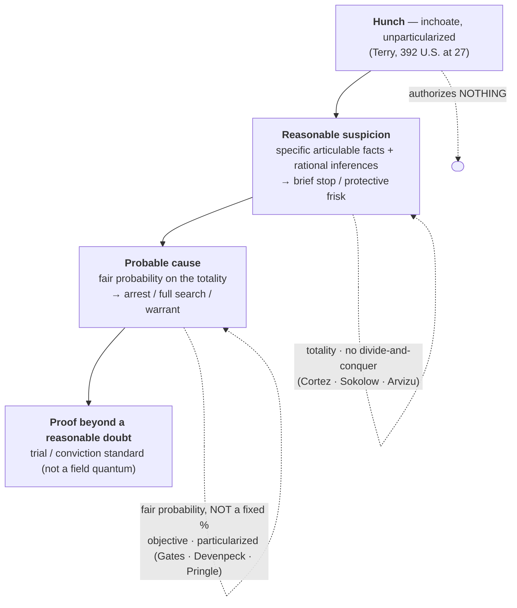

---
aliases:
  - "Probable Cause and Reasonable Suspicion"
title: "Probable Cause and Reasonable Suspicion"
topic: Probable Cause and Reasonable Suspicion
type: doctrine
amendment: "U.S. Const. amend. IV"
jurisdiction: "Federal (U.S. Const. amend. IV); SCOTUS baseline"
status: verified
related:
  - "[[Fourth Amendment Framework]]"
  - "[[Fourth Amendment Analysis Checklist]]"
  - "[[Terry Stops and Reasonable Suspicion]]"
  - "[[The Warrant Requirement]]"
  - "[[Collective Knowledge and the Fellow-Officer Rule]]"
  - "[[CREW]]"
---

# Probable Cause and Reasonable Suspicion

## The Brief

**Field-decisive question:** *Which level of suspicion do I actually have — reasonable suspicion or probable cause — and is it enough for what I want to do (stop, frisk, arrest, search, or get a warrant)?* Naming the rung is the whole game: the same facts that lawfully support a brief *[[Terry v. Ohio|Terry]]* stop will not support an arrest, and an officer who reaches for the wrong rung loses the evidence.

**The suspicion ladder — state it up front.** Fourth Amendment proof runs on a ladder of escalating certainty, and each rung unlocks a different power:

1. **Hunch** — a bare "inchoate and unparticularized suspicion or 'hunch.'" Authorizes **nothing**. *[[Terry v. Ohio|Terry]]*, 392 U.S. 1, 27 (1968).
2. **Reasonable, articulable suspicion** — specific facts plus the rational inferences an experienced officer draws from them; **more than a hunch, well short of probable cause**. Authorizes a **brief investigative stop and protective frisk**. See [[Terry Stops and Reasonable Suspicion]].
3. **Probable cause** — a *fair probability*, judged on the totality, that a crime has occurred or that evidence will be found in a particular place. Authorizes an **arrest, a full search, or a warrant**. See [[The Warrant Requirement]].
4. **Proof beyond a reasonable doubt** — the **trial / conviction** standard, *not* a field standard; shown here only to mark the top of the ladder. <!-- NEW-ASSERTION (gate/R13): "beyond a reasonable doubt" = the conviction standard (In re Winship, 397 U.S. 358 (1970)); added as the ladder's top rung for pedagogical contrast only, not asserted as a Fourth Amendment field quantum on this page. Route to serial-CL confirmation if retained. -->

The quantum **climbs with the intrusion** — the greater the government's intrusion on liberty or privacy, the more proof it takes. Both **field** standards are measured by the **totality of the circumstances**, through the eyes of a **reasonable, experienced officer**, and **neither reduces to a percentage**. This page owns the two standards themselves; [[Fourth Amendment Framework]] and [[Fourth Amendment Analysis Checklist]] point here for "how much proof," [[Terry Stops and Reasonable Suspicion]] owns stop-and-frisk scope and duration, and [[The Warrant Requirement]] owns presenting probable cause to a magistrate.

**Probable cause — totality and "fair probability."** Probable cause is the practical, non-technical quantum required for an arrest, a full search, or a warrant. It "deal[s] with probabilities" — "the factual and practical considerations of everyday life on which reasonable and prudent men, not legal technicians, act." *[[Brinegar v. United States|Brinegar]]*, 338 U.S. 160, 175 (1949). *[[Illinois v. Gates|Gates]]* fixes the operative test: "[t]he task of the issuing magistrate is simply to make a practical, common-sense decision whether, given all the circumstances . . . there is a **fair probability** that contraband or evidence of a crime will be found in a particular place." *[[Illinois v. Gates|Gates]]*, 462 U.S. 213, 238 (1983). Three corollaries the field must hold together:

- **It is objective.** Probable cause turns on the facts known to the officer, *not* on his stated charge or subjective theory: an arrest stands if those facts support *some* offense, "even though the offense the officer thought existed was not the one for which the suspect was eventually charged" and need not be closely related to it. *[[Devenpeck v. Alford|Devenpeck]]*, 543 U.S. 146, 153–55 (2004).
- **No divide-and-conquer.** Courts and magistrates weigh the **whole picture**; they may not evaluate each fact in isolation and discard the innocent-looking ones. *[[District of Columbia v. Wesby|Wesby]]*, 583 U.S. 48, 60–61 (2018); *[[United States v. Arvizu|Arvizu]]*, 534 U.S. 266, 274 (2002).
- **It is measured at the moment of the seizure, on probabilities — not certainty.** Probable cause "must precede the seizure" and rests on the facts then known; "an arrest is not justified by what the subsequent search discloses," and "suspicion is not enough for an officer to lay hands on a citizen." *[[Henry v. United States (1959)#^pin-104|Henry v. United States]]*, 361 U.S. 98, 104 (1959). But certainty is not required: "sufficient probability, not certainty, is the touchstone of reasonableness under the Fourth Amendment," so a reasonable, good-faith **mistake of identity** (arresting the wrong man on probable cause to arrest the right one) does not defeat the arrest. *[[Hill v. California#^pin-804|Hill v. California]]*, 401 U.S. 797, 804 (1971); cf. *[[Heien v. North Carolina|Heien]]* (reasonable mistake of *law*).

**Particularized to the person — but a common enterprise can reach a group.** Probable cause "must be particularized with respect to the person to be searched or seized." *[[Ybarra v. Illinois|Ybarra]]*, 444 U.S. 85, 91 (1979). *[[Maryland v. Pringle|Pringle]]* shows how that requirement is satisfied for several suspects at once: where cocaine and rolled cash were found in a car and no occupant admitted ownership, an officer could reasonably infer a **"common enterprise among the three men,"** giving probable cause to arrest each. *[[Maryland v. Pringle|Pringle]]*, 540 U.S. 366, 371–74 (2003). *[[Maryland v. Pringle|Pringle]]* aggregates **facts about suspects** to find individualized probable cause; it is **not** a collective-knowledge / fellow-officer case (that doctrine pools knowledge **across officers** — see [[Collective Knowledge and the Fellow-Officer Rule]]). Keep the two ideas distinct: *[[Maryland v. Pringle|Pringle]]* is an **aggregate / particularized-probable-cause** holding, not horizontal pooling.

**Reasonable suspicion — articulable facts and rational inferences.** Reasonable suspicion is the **less demanding** standard authorizing only a brief stop and protective frisk. *[[Terry v. Ohio|Terry]]* demands "specific reasonable inferences which [the officer] is entitled to draw from the facts in light of his experience," not "an inchoate and unparticularized suspicion or 'hunch.'" *[[Terry v. Ohio|Terry]]*, 392 U.S. at 27. The measure is a **"particularized and objective basis"** drawn from **"the whole picture."** *[[United States v. Cortez#^pin-417|Cortez]]*, 449 U.S. 411, 417–18 (1981). Two operating rules follow:

- **Innocent factors can combine.** "Any one of these factors is not by itself proof of any illegal conduct and is quite consistent with innocent travel. But . . . taken together they amount to reasonable suspicion." *[[United States v. Sokolow#^pin-9|Sokolow]]*, 490 U.S. 1, 9 (1989). The court does not sort the facts into innocent and guilty piles and throw the innocent ones out. *[[United States v. Arvizu|Arvizu]]*, 534 U.S. at 274.
- **Commonsense field examples.** Unprovoked **headlong flight** in a high-crime area counts toward suspicion. *[[Illinois v. Wardlow|Wardlow]]*, 528 U.S. 119, 124 (2000). And an officer who learns the **registered owner's license is revoked** may stop the car on the commonsense inference that the owner is driving — "absent information negating" it (a "narrow" holding that dissolves once the officer sees the driver plainly is not the owner). *[[Kansas v. Glover|Glover]]*, 589 U.S. 376 (2020).

**Informants and tips — the *[[Illinois v. Gates|Gates]]* totality replaced the rigid two-prong test.** Before 1983, an informant's tip had to clear a rigid **two-prong** hurdle — the informant's **basis of knowledge** *and* his **veracity** — each independently, under *[[Aguilar v. Texas#^pin-114|Aguilar]]* and *[[Spinelli v. United States#^pin-418|Spinelli]]*. *[[Illinois v. Gates|Gates]]* **abandoned** that framework for the totality test: veracity, reliability, and basis of knowledge "are better understood as relevant considerations in the totality-of-the-circumstances analysis . . . not [as] entirely separate and independent requirements to be rigidly exacted in every case." *[[Illinois v. Gates|Gates]]*, 462 U.S. at 233. Under that umbrella:

- **Corroboration.** Where police personally **corroborate the innocent details** of a reliable informant's detailed tip, they may infer the remaining incriminating detail is also true — probable cause. *[[Draper v. United States#^pin-313|Draper]]*, 358 U.S. 307, 313 (1959).
- **Penal interest.** A tip is more credible when the informant **admits a crime**: "[a]dmissions of crime . . . carry their own indicia of credibility — sufficient at least to support a finding of probable cause." *[[United States v. Harris (1971)#^pin-583|United States v. Harris]]*, 403 U.S. 573, 583 (1971).
- **Known vs. anonymous informant.** A **known**, face-to-face informant (accountable if he lies) can supply reasonable suspicion on his word alone. *[[Adams v. Williams|Adams v. Williams]]*, 407 U.S. 143, 147 (1972). **Anonymous** tips fall on a spectrum: a **bare** anonymous tip that a person is armed is **not** enough (*[[Florida v. J.L.|Florida v. J.L.]]*, 529 U.S. 266, 272 (2000)); but a tip whose **prediction of future conduct** police corroborate (*[[Alabama v. White|Alabama v. White]]*, 496 U.S. 325, 332 (1990)), or a **reliable, contemporaneous, traceable 911 report** of dangerous driving (*[[Navarette v. California|Navarette]]*, 572 U.S. 393, 398–99 (2014)), **can**. A trained drug dog's alert can supply full **probable cause** under the totality. *[[Florida v. Harris|Florida v. Harris]]*, 568 U.S. 237, 244–48 (2013).

**Who decides — and the standard of review.** In the field the call is the **officer's**, drawing on training and experience; for a warrant it is a **neutral magistrate**, whose probable-cause finding gets **deferential** review — affidavits are read "in a commonsense and realistic," not "hypertechnical," manner, and "doubtful or marginal cases . . . [are] largely determined by the preference to be accorded to warrants." *[[United States v. Ventresca#^pin-109b|Ventresca]]*, 380 U.S. 102, 108–09 (1965). On appeal the **ultimate** questions of reasonable suspicion and probable cause are reviewed **de novo**, while the trial court's **historical facts** are reviewed only for **clear error**. *[[Ornelas v. United States|Ornelas]]*, 517 U.S. 690, 691, 699 (1996).

**Burden of proof — it tracks the warrant line.** For a **warrantless** search, seizure, or arrest, the **government** bears the burden of justifying it under a recognized exception — "the burden is on those seeking the exemption to show the need for it." *[[Coolidge v. New Hampshire|Coolidge]]*, 403 U.S. 443, 455 (1971). Under a **warrant**, the search or arrest is **presumed valid** and the **defendant** bears the burden of overcoming it — e.g., to win a *[[Franks v. Delaware|Franks]]* hearing he must make a "substantial preliminary showing" of a knowing or reckless falsehood material to probable cause. *[[Franks v. Delaware|Franks]]*, 438 U.S. 154, 155–56 (1978).

**Remedy.** The consequence of acting on the wrong rung is **suppression** of the evidence and its fruits under the exclusionary rule. See [[The Exclusionary Rule]].

**Pitfalls to flag for the field.**
- **Treating reasonable suspicion and probable cause as interchangeable.** They are different rungs: reasonable suspicion buys a brief stop and frisk; it does **not** buy an arrest or a full search. Articulate **which one** the facts actually support.
- **"Possibilities, not probabilities."** Both standards turn on **probabilities**, not bare possibility (one of the [[CREW|Three Golden Rules]] maxims). A fact that merely makes crime *possible* is not enough — *[[Terry v. Ohio|Terry]]* requires "specific reasonable inferences," not a hunch.
- **Quantifying the standard as a fixed percentage.** Neither standard reduces to a number; an instructor who says "probable cause is 51%" is inventing a rule the Court has never adopted (*[[Brinegar v. United States|Brinegar]]* / *[[Illinois v. Gates|Gates]]* speak of practical, common-sense probabilities).
- **Divide-and-conquer.** Do not pick the facts apart and explain each away — the test is the **whole picture**. *[[District of Columbia v. Wesby|Wesby]]*; *[[United States v. Arvizu|Arvizu]]*.
- **Locking onto the charge you named.** Probable cause is **objective**; it survives even if the eventual charge differs from the one you had in mind. *[[Devenpeck v. Alford|Devenpeck]]*.

## Key cases

| Case | Holding in one line | Weight | Treatment | CourtListener |
|---|---|---|---|---|
| *[[Brinegar v. United States]]*, 338 U.S. 160 (1949) | Classic probable-cause statement: practical, non-technical **probabilities** on which reasonable people act — not technical certainty. | Binding — SCOTUS | good *(2026-06-30)* | [opinion](https://www.courtlistener.com/opinion/104716/brinegar-v-united-states/) |
| *[[Terry v. Ohio]]*, 392 U.S. 1 (1968) | A brief investigative stop and protective frisk require **reasonable, articulable suspicion** — specific inferences, not an inchoate hunch. | Binding — SCOTUS | good *(2026-06-30)* | [opinion](https://www.courtlistener.com/opinion/107729/terry-v-ohio/) |
| *[[Illinois v. Gates]]*, 462 U.S. 213 (1983) | Probable cause is judged by the **totality of the circumstances** — a fair-probability inquiry; **abandons** the rigid *[[Aguilar v. Texas|Aguilar]]*–*[[Spinelli v. United States|Spinelli]]* two-prong informant test. | Binding — SCOTUS | good *(2026-06-30)* | [opinion](https://www.courtlistener.com/opinion/110959/illinois-v-gates/) |
| *[[Henry v. United States (1959)]]*, 361 U.S. 98 (1959) | Probable cause is measured **at the moment of arrest** on the facts then known; outwardly innocent conduct is not enough and "an arrest is not justified by what the subsequent search discloses." | Binding — SCOTUS | good *(2026-06-30)* | [opinion](https://www.courtlistener.com/opinion/105963/henry-v-united-states/) |
| *[[Maryland v. Pringle]]*, 540 U.S. 366 (2003) | Drugs/cash in a car with no claimant give probable cause to arrest **all** occupants on a **common-enterprise** inference — particularized PC reaching a group (aggregate PC, **not** horizontal pooling). | Binding — SCOTUS | good *(2026-06-30)* | [opinion](https://www.courtlistener.com/opinion/131150/maryland-v-pringle/) |
| *[[Devenpeck v. Alford]]*, 543 U.S. 146 (2004) | Probable cause is **objective**; the offense need not be the one the officer named or closely related to it. | Binding — SCOTUS | good *(2026-06-30)* | [opinion](https://www.courtlistener.com/opinion/137733/devenpeck-v-alford/) |
| *[[Hill v. California]]*, 401 U.S. 797 (1971) | "Sufficient probability, not certainty, is the touchstone" — a reasonable, good-faith **mistaken-identity** arrest (right PC, wrong man) is valid, as is the search incident to it. | Binding — SCOTUS | good *(2026-06-30)* | [opinion](https://www.courtlistener.com/opinion/108305/hill-v-california/) |
| *[[District of Columbia v. Wesby]]*, 583 U.S. 48 (2018) | Probable cause is a totality inquiry; courts must **not divide-and-conquer** the facts. | Binding — SCOTUS | good *(2026-06-30)* | [opinion](https://www.courtlistener.com/opinion/4460854/district-of-columbia-v-wesby/) |
| *[[United States v. Arvizu]]*, 534 U.S. 266 (2002) | Reasonable suspicion is judged on the **whole picture**; no divide-and-conquer of individual factors. | Binding — SCOTUS | good *(2026-06-30)* | [opinion](https://www.courtlistener.com/opinion/118474/united-states-v-arvizu/) |
| *[[Illinois v. Wardlow]]*, 528 U.S. 119 (2000) | Unprovoked **headlong flight** in a high-crime area can furnish reasonable suspicion for a *[[Terry v. Ohio|Terry]]* stop. | Binding — SCOTUS | good *(2026-06-30)* | [opinion](https://www.courtlistener.com/opinion/118326/illinois-v-wardlow/) |
| *[[Alabama v. White]]*, 496 U.S. 325 (1990) | An **anonymous tip** can supply reasonable suspicion when police corroborate its **prediction of future conduct**. | Binding — SCOTUS | good *(2026-06-30)* | [opinion](https://www.courtlistener.com/opinion/112454/alabama-v-white/) |
| *[[Florida v. J.L.]]*, 529 U.S. 266 (2000) | A **bare** anonymous tip that a person has a gun, without more, is **not** reasonable suspicion. | Binding — SCOTUS | good *(2026-06-30)* | [opinion](https://www.courtlistener.com/opinion/118352/florida-v-jl/) |
| *[[Navarette v. California]]*, 572 U.S. 393 (2014) | A **reliable, contemporaneous 911 report** of dangerous driving can supply reasonable suspicion. | Binding — SCOTUS | good *(2026-06-30)* | [opinion](https://www.courtlistener.com/opinion/2670795/prado-navarette-v-california/) |
| *[[Florida v. Harris]]*, 568 U.S. 237 (2013) | A trained dog's alert can supply **probable cause** under the totality — no rigid field-record checklist. | Binding — SCOTUS | good *(2026-06-30)* | [opinion](https://www.courtlistener.com/opinion/820744/florida-v-harris/) |
| *[[Draper v. United States]]*, 358 U.S. 307 (1959) | Police **corroboration of the innocent details** of a reliable informant's detailed tip furnishes probable cause to arrest. | Binding — SCOTUS | good *(2026-06-30)* | [opinion](https://www.courtlistener.com/opinion/105820/draper-v-united-states/) |
| *[[United States v. Harris (1971)]]*, 403 U.S. 573 (1971) | An informant's statement **against penal interest** carries its own indicia of credibility, supporting probable cause; reputation may be considered. | Binding — SCOTUS | good *(2026-06-30)* | [opinion](https://www.courtlistener.com/opinion/108379/united-states-v-harris/) |
| *[[Ornelas v. United States]]*, 517 U.S. 690 (1996) | Reasonable-suspicion and probable-cause determinations are reviewed **de novo**; historical facts for clear error. | Binding — SCOTUS | good *(2026-06-30)* | [opinion](https://www.courtlistener.com/opinion/118030/ornelas-v-united-states/) |
| *[[Aguilar v. Texas]]*, 378 U.S. 108 (1964) | **Historical foil** — the rigid two-prong (basis-of-knowledge + veracity) informant test, **abandoned** by *[[Illinois v. Gates|Gates]]* for the totality approach. | Historical | abrogated *(by [[Illinois v. Gates|Gates]])* | [opinion](https://www.courtlistener.com/opinion/106865/aguilar-v-texas/) |
| *[[Spinelli v. United States]]*, 393 U.S. 410 (1969) | **Historical foil** — refined *[[Aguilar v. Texas|Aguilar]]*'s two prongs (innocent corroboration could not cure a deficient tip); **abandoned** by *[[Illinois v. Gates|Gates]]*. | Historical | abrogated *(by [[Illinois v. Gates|Gates]])* | [opinion](https://www.courtlistener.com/opinion/107831/spinelli-v-united-states/) |

## Related cases across doctrines

These cases are treated in full on other doctrine pages but bear directly on the probable-cause / reasonable-suspicion **quantum-of-proof** inquiry, framed here for it.

| Case | Relevance to probable cause / reasonable suspicion (framed here) | Primary home | Weight · Treatment | CourtListener |
|---|---|---|---|---|
| *[[Adams v. Williams]]*, 407 U.S. 143 (1972) | A **known**, face-to-face informant's tip carries enough reliability to furnish reasonable suspicion for a stop and frisk — RS need not rest on the officer's own observation. The foil for the anonymous-tip line. | [[Terry Stops and Reasonable Suspicion]] | Binding — SCOTUS · good | [opinion](https://www.courtlistener.com/opinion/108571/adams-v-williams/) |
| *[[Kansas v. Glover]]*, 589 U.S. 376 (2020) | Reasonable suspicion permits **commonsense inferences**: a revoked-license registered owner is presumptively the driver — a "narrow" holding defeated by facts negating the inference. | [[Traffic Stops]] | Binding — SCOTUS · good | [opinion](https://www.courtlistener.com/opinion/9231313/kansas-v-glover/) |
| *[[United States v. Ventresca]]*, 380 U.S. 102 (1965) | Warrant affidavits are read **commonsensically**, not hypertechnically, and **doubtful PC cases favor the warrant** — the deferential posture behind *[[Illinois v. Gates|Gates]]*. | [[The Warrant Requirement]] | Binding — SCOTUS · good | [opinion](https://www.courtlistener.com/opinion/106990/united-states-v-ventresca/) |
| *[[Franks v. Delaware]]*, 438 U.S. 154 (1978) | The defendant may attack the PC **showing itself**: on a substantial preliminary showing of a knowing/reckless material falsehood, the false statement is set aside and PC re-evaluated on what remains. Sets the warrant-side burden. | [[The Warrant Requirement]] · [[The Exclusionary Rule]] | Binding — SCOTUS · good | [opinion](https://www.courtlistener.com/opinion/109925/franks-v-delaware/) |
| *[[Whiteley v. Warden]]*, 401 U.S. 560 (1971) | An officer may stop/arrest on a bulletin assuming the issuer had PC — but if the **issuer in fact lacked PC**, the stop is invalid: the quantum is measured **at the source**. | [[Collective Knowledge and the Fellow-Officer Rule]] | Binding — SCOTUS · good | [opinion](https://www.courtlistener.com/opinion/108297/whiteley-v-warden-wyoming-state-penitentiary/) |
| *[[United States v. Hensley]]*, 469 U.S. 221 (1985) | Reasonable suspicion may rest on a **wanted flyer/bulletin** from another department, so long as the issuing agency had the articulable facts — RS assessed on the collective knowledge. | [[Collective Knowledge and the Fellow-Officer Rule]] | Binding — SCOTUS · good | [opinion](https://www.courtlistener.com/opinion/111294/united-states-v-hensley/) |
| *[[Heien v. North Carolina]]*, 574 U.S. 54 (2014) | RS/PC may rest on an officer's **objectively reasonable mistake of law** as well as fact — reasonableness, not perfect legal accuracy, is the touchstone. | [[Traffic Stops]] | Binding — SCOTUS · good | [opinion](https://www.courtlistener.com/opinion/2760668/heien-v-north-carolina/) |
| *[[Delaware v. Prouse]]*, 440 U.S. 648 (1979) | A discretionary stop requires **at least reasonable, articulable suspicion**; random suspicionless stops fail the standard — the floor for any investigative seizure. | [[Traffic Stops]] | Binding — SCOTUS · good | [opinion](https://www.courtlistener.com/opinion/110045/delaware-v-prouse/) |
| *[[Michigan v. Long]]*, 463 U.S. 1032 (1983) | A protective **vehicle frisk** requires reasonable suspicion the suspect is dangerous and may access weapons — the same RS quantum as a *[[Terry v. Ohio|Terry]]* frisk, extended to the passenger compartment. | [[Traffic Stops]] | Binding — SCOTUS · good | [opinion](https://www.courtlistener.com/opinion/111020/michigan-v-long/) |
| *[[United States v. Brignoni-Ponce]]*, 422 U.S. 873 (1975) | A roving border-area stop requires reasonable suspicion on **specific articulable facts**; apparent ancestry alone cannot supply it — an early gloss on the **content** of RS. | [[Border Searches]] | Binding — SCOTUS · good | [opinion](https://www.courtlistener.com/opinion/109311/united-states-v-brignoni-ponce/) |
| *[[Maryland v. Buie]]*, 494 U.S. 325 (1990) | A protective sweep beyond the spaces immediately adjoining an arrest requires **reasonable, articulable suspicion** the area harbors a dangerous person — the *[[Terry v. Ohio|Terry]]* RS quantum imported into the in-home arrest. | [[Securing the Scene]] | Binding — SCOTUS · good | [opinion](https://www.courtlistener.com/opinion/112384/maryland-v-buie/) |
| *[[Case v. Montana]]*, 607 U.S. ___ (2026) | **Probable cause is the criminal-investigative quantum and is not transplanted** to non-investigative contexts: a warrantless **emergency-aid** home entry needs only *[[Brigham City v. Stuart|Brigham City]]*'s "objectively reasonable basis," not PC. Marks the boundary of where this page's standards apply. | [[Emergency Aid]] | Binding — SCOTUS · good | [opinion](https://www.courtlistener.com/opinion/10774335/case-v-montana/) |

## Recent developments

Role-based, **circuit/state only (no SCOTUS)**. The core probable-cause and reasonable-suspicion standards are stable; the circuits continue to police the **reasonable-suspicion floor** against vague, uncorroborated tips. A circuit decision is **binding in its own circuit** and **persuasive (outside circuit)** elsewhere.

- **United States v. Daniels (10th Cir. 2024)** — *role: narrows / tightens the RS floor.* On de novo totality review, a **near-anonymous 911 tip** (three men in dark hoodies near an idling SUV, reporting no actual illegality) plus the suspect's mere presence did **not** amount to reasonable suspicion; overly generic tips reporting lawful-sounding conduct give police excessive discretion and fall **below** the RS floor. Tightens the *[[Florida v. J.L.|J.L.]]* / *[[Navarette v. California|Navarette]]* line. **Binding in-circuit — 10th Cir.** · good *(2026-06-30)*. *(No standalone case page — named in prose with circuit.)* [opinion](https://www.courtlistener.com/opinion/9500360/united-states-v-daniels/)

## Visual

## Sources

- *Brinegar v. United States*, 338 U.S. 160 (1949) — https://www.courtlistener.com/opinion/104716/brinegar-v-united-states/
- *Terry v. Ohio*, 392 U.S. 1 (1968) — https://www.courtlistener.com/opinion/107729/terry-v-ohio/
- *Illinois v. Gates*, 462 U.S. 213 (1983) — https://www.courtlistener.com/opinion/110959/illinois-v-gates/
- *Henry v. United States*, 361 U.S. 98 (1959) — https://www.courtlistener.com/opinion/105963/henry-v-united-states/
- *Maryland v. Pringle*, 540 U.S. 366 (2003) — https://www.courtlistener.com/opinion/131150/maryland-v-pringle/
- *Devenpeck v. Alford*, 543 U.S. 146 (2004) — https://www.courtlistener.com/opinion/137733/devenpeck-v-alford/
- *Hill v. California*, 401 U.S. 797 (1971) — https://www.courtlistener.com/opinion/108305/hill-v-california/
- *District of Columbia v. Wesby*, 583 U.S. 48 (2018) — https://www.courtlistener.com/opinion/4460854/district-of-columbia-v-wesby/
- *United States v. Arvizu*, 534 U.S. 266 (2002) — https://www.courtlistener.com/opinion/118474/united-states-v-arvizu/
- *Illinois v. Wardlow*, 528 U.S. 119 (2000) — https://www.courtlistener.com/opinion/118326/illinois-v-wardlow/
- *Alabama v. White*, 496 U.S. 325 (1990) — https://www.courtlistener.com/opinion/112454/alabama-v-white/
- *Florida v. J.L.*, 529 U.S. 266 (2000) — https://www.courtlistener.com/opinion/118352/florida-v-jl/
- *Navarette v. California*, 572 U.S. 393 (2014) — https://www.courtlistener.com/opinion/2670795/prado-navarette-v-california/
- *Florida v. Harris*, 568 U.S. 237 (2013) — https://www.courtlistener.com/opinion/820744/florida-v-harris/
- *Draper v. United States*, 358 U.S. 307 (1959) — https://www.courtlistener.com/opinion/105820/draper-v-united-states/
- *United States v. Harris*, 403 U.S. 573 (1971) — https://www.courtlistener.com/opinion/108379/united-states-v-harris/
- *Ornelas v. United States*, 517 U.S. 690 (1996) — https://www.courtlistener.com/opinion/118030/ornelas-v-united-states/
- *Aguilar v. Texas*, 378 U.S. 108 (1964) — https://www.courtlistener.com/opinion/106865/aguilar-v-texas/ *(Historical; abrogated by Gates)*
- *Spinelli v. United States*, 393 U.S. 410 (1969) — https://www.courtlistener.com/opinion/107831/spinelli-v-united-states/ *(Historical; abrogated by Gates)*
- *United States v. Cortez*, 449 U.S. 411 (1981) — https://www.courtlistener.com/opinion/110377/united-states-v-cortez/
- *United States v. Sokolow*, 490 U.S. 1 (1989) — https://www.courtlistener.com/opinion/112239/united-states-v-sokolow/
- *Ybarra v. Illinois*, 444 U.S. 85 (1979) — https://www.courtlistener.com/opinion/110158/ybarra-v-illinois/
- *Adams v. Williams*, 407 U.S. 143 (1972) — https://www.courtlistener.com/opinion/108571/adams-v-williams/
- *Kansas v. Glover*, 589 U.S. 376 (2020) — https://www.courtlistener.com/opinion/9231313/kansas-v-glover/
- *United States v. Ventresca*, 380 U.S. 102 (1965) — https://www.courtlistener.com/opinion/106990/united-states-v-ventresca/
- *Franks v. Delaware*, 438 U.S. 154 (1978) — https://www.courtlistener.com/opinion/109925/franks-v-delaware/
- *Whiteley v. Warden*, 401 U.S. 560 (1971) — https://www.courtlistener.com/opinion/108297/whiteley-v-warden-wyoming-state-penitentiary/
- *United States v. Hensley*, 469 U.S. 221 (1985) — https://www.courtlistener.com/opinion/111294/united-states-v-hensley/
- *Heien v. North Carolina*, 574 U.S. 54 (2014) — https://www.courtlistener.com/opinion/2760668/heien-v-north-carolina/
- *Delaware v. Prouse*, 440 U.S. 648 (1979) — https://www.courtlistener.com/opinion/110045/delaware-v-prouse/
- *Michigan v. Long*, 463 U.S. 1032 (1983) — https://www.courtlistener.com/opinion/111020/michigan-v-long/
- *United States v. Brignoni-Ponce*, 422 U.S. 873 (1975) — https://www.courtlistener.com/opinion/109311/united-states-v-brignoni-ponce/
- *Maryland v. Buie*, 494 U.S. 325 (1990) — https://www.courtlistener.com/opinion/112384/maryland-v-buie/
- *Coolidge v. New Hampshire*, 403 U.S. 443 (1971) — https://www.courtlistener.com/opinion/108377/coolidge-v-new-hampshire/
- *Case v. Montana*, 607 U.S. ___ (2026) (No. 24-624) — https://www.courtlistener.com/opinion/10774335/case-v-montana/
- *United States v. Daniels* (10th Cir. 2024) — https://www.courtlistener.com/opinion/9500360/united-states-v-daniels/ *(no standalone case page; circuit development)*
