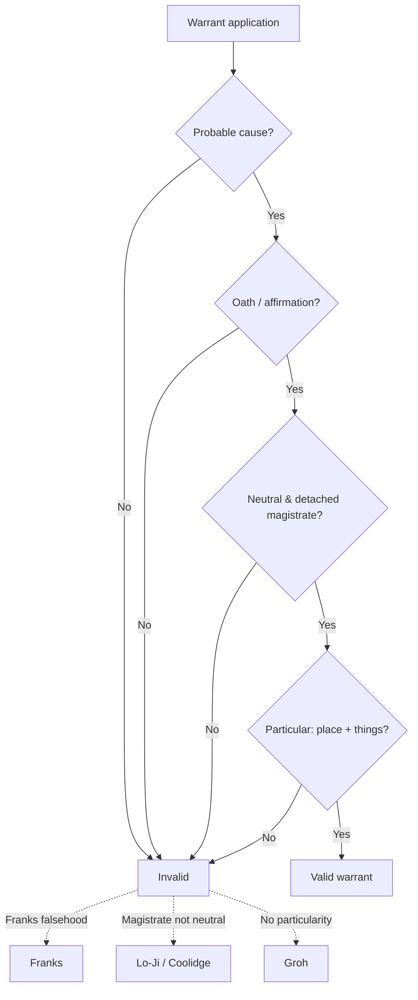

---
aliases:
  - "The Warrant Requirement"
topic: The Warrant Requirement
type: doctrine
jurisdiction: Federal (U.S. Const. amend. IV); SCOTUS baseline
status: verified
related:
  - "[[Probable Cause and Reasonable Suspicion]]"
  - "[[The Exclusionary Rule]]"
  - "[[Plain View Doctrine]]"
  - "[[Securing the Scene]]"
  - "[[Legal Research and Case Citations]]"
---

# The Warrant Requirement

## Rule

A valid Fourth Amendment warrant has four parts: **probable cause**, supported by **oath or affirmation**, presented to a **neutral and detached magistrate**, and **particularly describing the place to be searched and the persons or things to be seized.** The Constitution's protection lies in requiring "that those inferences be drawn by a neutral and detached magistrate instead of being judged by the officer engaged in the often competitive enterprise of ferreting out crime." *Johnson v. United States*, 333 U.S. at 13-14. A warrant fails when any element collapses — a falsehood corrupts the probable-cause showing (*Franks*), the magistrate abandons neutrality (*Lo-Ji*, *Coolidge*), or the description is open-ended or absent (*Groh*).

## Key cases

| Case | Holding (one line) | Weight | CourtListener |
| --- | --- | --- | --- |
| *Johnson v. United States*, 333 U.S. 10 (1948) | Probable-cause inferences must be drawn by a neutral magistrate, not the officer hunting for crime. | SCOTUS — binding | [opinion](https://www.courtlistener.com/opinion/104504/johnson-v-united-states/) |
| *Illinois v. Gates*, 462 U.S. 213 (1983) | The magistrate weighs the **totality of the circumstances** for a fair probability of crime; veracity and basis of knowledge are factors, not separate hurdles. | SCOTUS — binding | [opinion](https://www.courtlistener.com/opinion/110959/illinois-v-gates/) |
| *Franks v. Delaware*, 438 U.S. 154 (1978) | A warrant may be voided where a knowing/reckless material falsehood in the affidavit is necessary to probable cause. | SCOTUS — binding | [opinion](https://www.courtlistener.com/opinion/109925/franks-v-delaware/) |
| *Maryland v. Garrison*, 480 U.S. 79 (1987) | Validity is judged on what officers reasonably knew when they sought the warrant; a reasonable mistake about the premises does not invalidate it. | SCOTUS — binding | [opinion](https://www.courtlistener.com/opinion/111823/maryland-v-garrison/) |
| *Groh v. Ramirez*, 540 U.S. 551 (2004) | A warrant that utterly fails to describe the things to be seized is **facially invalid**, even if the affidavit is particular. | SCOTUS — binding | [opinion](https://www.courtlistener.com/opinion/131161/groh-v-ramirez/) |
| *Andresen v. Maryland*, 427 U.S. 463 (1976) | A particularized warrant for business records, and their use in evidence, does **not** violate the Fifth Amendment — the accused is not compelled. | SCOTUS — binding | [opinion](https://www.courtlistener.com/opinion/109522/andresen-v-maryland/) |
| *Wilson v. Arkansas*, 514 U.S. 927 (1995) | **Knock-and-announce** is part of the Fourth Amendment reasonableness inquiry, but yields to countervailing law-enforcement interests. | SCOTUS — binding | [opinion](https://www.courtlistener.com/opinion/117936/wilson-v-arkansas/) |
| *Richards v. Wisconsin*, 520 U.S. 385 (1997) | **No blanket exception** by crime category; a no-knock entry needs **reasonable suspicion** of danger, futility, or destruction of evidence. | SCOTUS — binding | [opinion](https://www.courtlistener.com/opinion/118103/richards-v-wisconsin/) |
| *United States v. Grubbs*, 547 U.S. 90 (2006) | **Anticipatory warrants** are valid where the magistrate finds it now probable the triggering condition will occur and contraband will then be present. | SCOTUS — binding | [opinion](https://www.courtlistener.com/opinion/145670/united-states-v-grubbs/) |
| *Lo-Ji Sales, Inc. v. New York*, 442 U.S. 319 (1979) | An open-ended warrant executed by a magistrate who leads the search is a forbidden general warrant; the search is invalid. | SCOTUS — binding | [opinion](https://www.courtlistener.com/opinion/110100/lo-ji-sales-inc-v-new-york/) |
| *Coolidge v. New Hampshire*, 403 U.S. 443 (1971) | A warrant issued by the State Attorney General — the chief investigator/prosecutor — is invalid because he is not neutral and detached. | SCOTUS — binding | [opinion](https://www.courtlistener.com/opinion/108377/coolidge-v-new-hampshire/) |
| *Hudson v. Michigan*, 547 U.S. 586 (2006) | A knock-and-announce violation does **not** trigger suppression of the evidence found inside. | SCOTUS — binding | [opinion](https://www.courtlistener.com/opinion/145646/hudson-v-michigan/) |
| *United States v. Leon*, 468 U.S. 897 (1984) | A facially-deficient warrant may still be saved by objectively reasonable good-faith reliance — see [[The Exclusionary Rule]]. | SCOTUS — binding | [opinion](https://www.courtlistener.com/opinion/111262/united-states-v-leon/) |

## Related cases across doctrines

These cases are treated in full elsewhere but bear directly on the warrant requirement, framed here for it.

| Case | Relevance to the warrant requirement | Primary treatment | CourtListener |
| --- | --- | --- | --- |
| *Massachusetts v. Sheppard*, 468 U.S. 981 (1984) | A warrant defective on its face (wrong pre-printed form, failing to describe the things to be seized) was nonetheless executed in objectively reasonable good faith — the *Leon* companion showing a particularity defect that good faith rescues. | [[The Exclusionary Rule]] | [opinion](https://www.courtlistener.com/opinion/111263/massachusetts-v-sheppard/) |
| *United States v. Leary*, 846 F.2d 592 (10th Cir. 1988) | A warrant authorizing seizure of records "relating to" export-law violations, with no limiting standard, is a facially overbroad general warrant that fails the Particularity Clause — and is so plainly deficient that no good-faith reliance was reasonable. | [[The Exclusionary Rule]] | [opinion](https://www.courtlistener.com/opinion/505922/united-states-v-richard-j-leary-and-fl-kleinberg-co/) |
| *Aguilar v. Texas*, 378 U.S. 108 (1964) | The original two-pronged test for what a warrant affidavit must show the magistrate (informant's basis of knowledge + veracity) before probable cause may issue — abrogated by *Gates*' totality approach but the historical backbone of the affidavit/probable-cause element. | [[Probable Cause and Reasonable Suspicion]] | [opinion](https://www.courtlistener.com/opinion/106865/aguilar-v-texas/) |
| *Steagald v. United States*, 451 U.S. 204 (1981) | An arrest warrant does not authorize entry into a third party's home to seize the subject; absent exigency or consent, officers need a separate search warrant particularly describing that residence. | [[Arrest in the Home]] | [opinion](https://www.courtlistener.com/opinion/110464/steagald-v-united-states/) |
| *Payton v. New York*, 445 U.S. 573 (1980) | A warrant requirement attaches to home entry to arrest: an arrest warrant founded on probable cause implicitly carries the limited authority to enter the suspect's own dwelling to execute it, but warrantless nonconsensual entry is presumptively unreasonable. | [[Arrest in the Home]] | [opinion](https://www.courtlistener.com/opinion/110235/payton-v-new-york/) |
| *Riley v. California*, 573 U.S. 373 (2014) | For the digital contents of a phone the categorical answer is "get a warrant" — the decision that funnels modern cell-phone and device searches into the warrant process and drives the particularity demands now litigated for digital warrants. | [[Search Incident to Arrest]] | [opinion](https://www.courtlistener.com/opinion/2680439/riley-v-cal-united-states/) |

## Nuances & limits

- **Neutral and detached magistrate.** This is the heart of the requirement. *Johnson* puts the inference in judicial hands, not the officer's. The magistrate loses that status by becoming part of the operation — in *Lo-Ji*, the issuing judge "allowed himself to become a member, if not the leader, of the search party ... he was not acting as a judicial officer but as an adjunct law enforcement officer" (442 U.S. at 327) — or by being the prosecutor himself, as the State Attorney General was in *Coolidge*. See [[Probable Cause and Reasonable Suspicion]] for what the magistrate must find. A duly issued warrant carries a presumption of validity; the challenger bears the burden of overcoming it (e.g., the Franks substantial-preliminary-showing, then proof by a preponderance), in contrast to warrantless action, which the government must justify under a recognized exception.
- **Probable cause is a totality call.** Under *Gates*, the magistrate makes a practical, common-sense judgment of a fair probability of crime; an informant's veracity, reliability, and basis of knowledge inform that judgment but are not rigid, independent tests.
- **Standard of review.** A reviewing court does **not** make a de novo probable-cause determination; it gives the issuing magistrate's decision **great deference** and asks only whether the magistrate had a **"substantial basis for ... concluding"** that probable cause existed. *Illinois v. Gates*, 462 U.S. 213, 236, 238-39 (1983).
- **Franks challenges.** A defendant who makes a substantial preliminary showing of a knowing/reckless material falsehood gets a hearing; if the falsity is proven by a preponderance and the affidavit's remaining content "is insufficient to establish probable cause, the search warrant must be voided and the fruits of the search excluded" (438 U.S. at 155-156). Franks is also the first hole in *Leon*'s good-faith shield.
- **Particularity / overbreadth.** The warrant itself must describe the things to be seized; a particular affidavit cannot rescue a blank warrant (*Groh*). For business records, a particularized warrant is permissible and raises no Fifth Amendment compulsion problem because nothing is extracted from the accused (*Andresen*, 427 U.S. at 477). Particularity also limits what officers may seize on sight; items not described come in, if at all, under the [[Plain View Doctrine]].
- **Reasonable mistakes about the premises.** *Garrison* judges the warrant on the facts reasonably available when officers applied — a good-faith error (one apartment thought to fill the floor) does not void a search conducted before the mistake became apparent.
- **Knock-and-announce.** Announcement is part of reasonableness (*Wilson*), but there is no categorical drug-case exception (*Richards*) — a no-knock entry needs case-specific **reasonable suspicion** of danger, futility, or evidence destruction. Critically, a knock-and-announce violation does **not** suppress the evidence (*Hudson*); the remedy is civil, not exclusionary. See [[The Exclusionary Rule]].
- **Anticipatory warrants.** Valid under *Grubbs*: the magistrate must find it presently probable both that the triggering condition will occur and that, once it does, the contraband will be at the place to be searched.
- **Once inside the dwelling.** A valid warrant authorizes entry and the search it describes, but securing the premises during execution — detentions, protective sweeps, and evidence freezes — runs on its own reasonableness rules. See [[Securing the Scene]]. For Bluebook form on the cites used here, see [[Legal Research and Case Citations]].

## Common pitfalls

- **Acting as your own magistrate.** Drawing the probable-cause inference yourself, or having the issuing judge ride along on the search, destroys neutrality (*Johnson*; *Lo-Ji*). The reviewing official must be detached from the investigation (*Coolidge*).
- **General or overbroad descriptions.** "All evidence of crime" or a warrant blank as to the things to be seized is facially invalid no matter how detailed the affidavit (*Groh*; *Lo-Ji*). Particularity lives on the face of the warrant.
- **Assuming a knock-and-announce violation suppresses evidence.** It does not (*Hudson*). Officers and instructors routinely overstate the remedy — the entry may be unlawful for civil purposes while the seized evidence stays in.

## Visual

## Recent developments & subsequent treatment

The warrant requirement's particularity and search-threshold rules are being tested hardest right now in the digital arena — geofence ("reverse-location") warrants and computer searches. The Supreme Court has taken up whether executing a geofence warrant is even a "search," and the circuits have already split on that question and on whether such warrants are categorical general warrants. The federal appellate decisions below are **persuasive, not binding** outside their own circuits.

- **Chatrie v. United States** — *pending before the Supreme Court* (question: whether executing a geofence warrant for Google Location History data is a Fourth Amendment "search"). Cert granted; argued Apr. 27, 2026 (docket 25-112); not yet decided. ⚖ Circuit split. [oral argument](https://www.courtlistener.com/audio/104529/okello-t-chatrie-petitioner-v-united-states/).
- **United States v. Holcomb (9th Cir. 2025)** — a computer-search warrant's "dominion and control" provision was both overbroad and insufficiently particular — and thus invalid — because, unlike the warrant's other clauses, it carried no temporal limitation and authorized opening any file from any time period; the good-faith exception did not save the examiner's search, and plain view did not independently justify seizure of the videos. Conviction vacated; remanded. As a Ninth Circuit decision this is **persuasive, not binding** elsewhere. [opinion](https://www.courtlistener.com/opinion/10365516/united-states-v-holcomb/).
- **United States v. Chatrie (4th Cir. 2024, panel + en banc)** — the panel (Richardson, J., joined by Wilkinson, J.; Wynn, J. dissenting) held that obtaining a short window (~2 hours) of Google Location History was NOT a Fourth Amendment search — the data is voluntarily shared (Location History is off by default/opt-in; third-party doctrine) and *Carpenter* does not extend. On rehearing en banc, the court affirmed on other grounds while fracturing on whether a search occurred (equally divided), teeing up the SCOTUS question. As a Fourth Circuit decision this is **persuasive, not binding** elsewhere. ⚖ Circuit split. [opinion](https://www.courtlistener.com/opinion/10265776/united-states-v-okello-chatrie/).
- **United States v. Smith (5th Cir. 2024)** — obtaining Google Location History via a geofence invades a reasonable expectation of privacy and is a Fourth Amendment search; geofence warrants are "modern-day general warrants" and categorically unconstitutional under the Fourth Amendment regardless of probable cause — though the evidence was not suppressed here under the *Leon* good-faith exception given the novelty of the technology. As a Fifth Circuit decision this is **persuasive, not binding** elsewhere. ⚖ Circuit split. "We hold that geofence warrants are modern-day general warrants and are unconstitutional under the Fourth Amendment. However, considering law enforcement's reasonable conduct in this case in light of the novelty of this type of warrant, we uphold the district court's determination that suppression was unwarranted under the good-faith exception." 110 F.4th at 838. [opinion](https://www.courtlistener.com/opinion/10036119/united-states-v-smith/).

## Sources

- [Johnson v. United States, 333 U.S. 10 (1948)](https://www.courtlistener.com/opinion/104504/johnson-v-united-states/)
- [Illinois v. Gates, 462 U.S. 213 (1983)](https://www.courtlistener.com/opinion/110959/illinois-v-gates/)
- [Franks v. Delaware, 438 U.S. 154 (1978)](https://www.courtlistener.com/opinion/109925/franks-v-delaware/)
- [Maryland v. Garrison, 480 U.S. 79 (1987)](https://www.courtlistener.com/opinion/111823/maryland-v-garrison/)
- [Groh v. Ramirez, 540 U.S. 551 (2004)](https://www.courtlistener.com/opinion/131161/groh-v-ramirez/)
- [Andresen v. Maryland, 427 U.S. 463 (1976)](https://www.courtlistener.com/opinion/109522/andresen-v-maryland/)
- [Wilson v. Arkansas, 514 U.S. 927 (1995)](https://www.courtlistener.com/opinion/117936/wilson-v-arkansas/)
- [Richards v. Wisconsin, 520 U.S. 385 (1997)](https://www.courtlistener.com/opinion/118103/richards-v-wisconsin/)
- [United States v. Grubbs, 547 U.S. 90 (2006)](https://www.courtlistener.com/opinion/145670/united-states-v-grubbs/)
- [Lo-Ji Sales, Inc. v. New York, 442 U.S. 319 (1979)](https://www.courtlistener.com/opinion/110100/lo-ji-sales-inc-v-new-york/)
- [Coolidge v. New Hampshire, 403 U.S. 443 (1971)](https://www.courtlistener.com/opinion/108377/coolidge-v-new-hampshire/)
- [Hudson v. Michigan, 547 U.S. 586 (2006)](https://www.courtlistener.com/opinion/145646/hudson-v-michigan/)
- [United States v. Leon, 468 U.S. 897 (1984)](https://www.courtlistener.com/opinion/111262/united-states-v-leon/)
