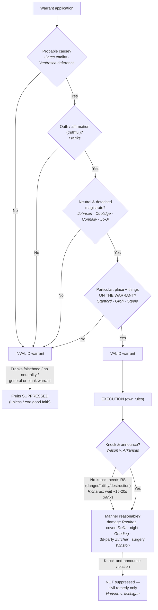

---
aliases:
  - "The Warrant Requirement"
title: "The Warrant Requirement"
topic: The Warrant Requirement
type: doctrine
amendment: "U.S. Const. amend. IV"
jurisdiction: "Federal (U.S. Const. amend. IV); SCOTUS baseline"
status: verified
related:
  - "[[Probable Cause and Reasonable Suspicion]]"
  - "[[The Exclusionary Rule]]"
  - "[[Plain View Doctrine]]"
  - "[[Securing the Scene]]"
  - "[[Arrest in the Home]]"
  - "[[Reading and Citing Cases]]"
---

# The Warrant Requirement

## The Brief

**Field-decisive question:** *Do I have a valid warrant — and did I get and execute it right?* A warrant is the Fourth Amendment's default; the named exceptions are the deviation. When you proceed by warrant, two separate things have to be true: the warrant has to be **validly issued**, and it has to be **validly executed**. A defect in either one is a Fourth Amendment problem, though — as the remedy section shows — the two defects do not carry the same consequence.

**The four pillars — state them up front.** A valid Fourth Amendment warrant has four parts, all four required:

1. **Probable cause** — a fair probability of crime, judged on the totality (*[[Illinois v. Gates|Illinois v. Gates]]*), the magistrate's call given deferential review (*[[United States v. Ventresca|United States v. Ventresca]]*).
2. **Particularity** — the warrant must, on its own face, **particularly describe the place to be searched and the persons or things to be seized** (*[[Stanford v. Texas|Stanford v. Texas]]*, *[[Groh v. Ramirez|Groh v. Ramirez]]*); a reasonable mistake about the premises does not void it (*[[Maryland v. Garrison|Maryland v. Garrison]]*).
3. **A neutral and detached magistrate** — the inference is drawn by a judicial officer, not a rubber stamp and not someone with a stake in the outcome (*[[Johnson v. United States|Johnson v. United States]]*, *[[Coolidge v. New Hampshire|Coolidge v. New Hampshire]]*, *[[Connally v. Georgia|Connally v. Georgia]]*, *[[Lo-Ji Sales, Inc. v. New York|Lo-Ji Sales, Inc. v. New York]]*).
4. **Supported by oath or affirmation** — a truthful sworn affidavit; a deliberate or reckless falsehood material to probable cause unravels it (*[[Franks v. Delaware|Franks v. Delaware]]*).

**Probable cause — totality, and a deferential look on review.** The magistrate makes "a practical, common-sense decision" whether there is a **fair probability** that evidence of crime will be found at the place described. *[[Illinois v. Gates#^pin-238|Illinois v. Gates]]*, 462 U.S. 213, 238 (1983); see [[Probable Cause and Reasonable Suspicion]] for the quantum itself. The **standard of review** is the field's friend: a reviewing court does **not** re-decide probable cause [[Common Legal Terms#de-novo|de novo]] — it gives the issuing magistrate **great deference** and asks only whether there was a **"substantial basis for . . . concluding"** that probable cause existed. *[[Illinois v. Gates|Gates]]*, 462 U.S. at 238–39. Affidavits are read "in a commonsense and realistic fashion," not hypertechnically, and "doubtful or marginal" cases are resolved by "the preference accorded police action taken under a warrant." *[[United States v. Ventresca#^pin-106|United States v. Ventresca]]*, 380 U.S. 102, 106–08 (1965). That deference is exactly why getting a warrant is the safer play.

**Particularity — it lives on the face of the warrant.** The warrant itself must describe the **place** and the **things**. For place, the test is practical: the description suffices if the executing officer can, with reasonable effort, ascertain and identify the place intended. *[[Steele v. United States|Steele v. United States]]*, 267 U.S. 498 (1925). For things, generality is the vice the clause was written against — a warrant authorizing seizure of all materials "concerning" a subject is an unconstitutional general warrant, and where **expressive materials** (books, papers) are targeted the particularity demand applies with the most scrupulous exactitude. *[[Stanford v. Texas|Stanford v. Texas]]*, 379 U.S. 476 (1965). Critically, a **particular affidavit cannot rescue a blank warrant**: a warrant that utterly fails to describe the things to be seized is **facially invalid** even if the supporting affidavit is meticulous. *[[Groh v. Ramirez#^pin-557|Groh v. Ramirez]]*, 540 U.S. 551, 557–58 (2004). A particularized warrant for **business records** raises no Fifth Amendment compulsion problem, because nothing is extracted from the accused. *[[Andresen v. Maryland|Andresen v. Maryland]]*, 427 U.S. 463 (1976). Particularity also caps what officers may seize on sight — items not described come in, if at all, under the [[Plain View Doctrine]], and even there the incriminating nature must be **immediately apparent**, with no further searching to develop probable cause (*[[Arizona v. Hicks|Arizona v. Hicks]]*). A **reasonable mistake** about the premises does not defeat the warrant: validity is judged on the facts reasonably available when officers applied, so a good-faith error (one apartment believed to fill the floor) does not void a search conducted before the mistake became apparent. *[[Maryland v. Garrison#^pin-88|Maryland v. Garrison]]*, 480 U.S. 79, 88 (1987).

**Neutral and detached magistrate — the heart of the requirement.** The whole point of a warrant is to put the inference in judicial hands: the protection lies in requiring "that those inferences be drawn by a neutral and detached magistrate instead of being judged by the officer engaged in the often competitive enterprise of ferreting out crime." *[[Johnson v. United States#^pin-13|Johnson v. United States]]*, 333 U.S. 10, 13–14 (1948). The magistrate loses that status two ways. By **joining the operation** — in *Lo-Ji* the issuing judge led the search party and "was not acting as a judicial officer but as an adjunct law enforcement officer." *[[Lo-Ji Sales, Inc. v. New York#^pin-327|Lo-Ji Sales, Inc. v. New York]]*, 442 U.S. 319, 327 (1979). Or by **having a stake** — the State Attorney General, the chief prosecutor, is not neutral (*[[Coolidge v. New Hampshire|Coolidge v. New Hampshire]]*), and neither is an unsalaried justice of the peace **paid a fee for issuing a warrant but nothing for denying one**, who has a direct, personal, pecuniary interest in saying yes. *[[Connally v. Georgia|Connally v. Georgia]]*, 429 U.S. 245 (1977). The magistrate need not be a lawyer or a judge, but must be neutral and capable of the probable-cause judgment.

**Oath or affirmation — and the *[[Franks v. Delaware|Franks]]* exception.** The affidavit must be sworn and truthful; a bare, conclusory affidavit has never been enough to support a warrant (a principle as old as *[[Byars v. United States|Byars v. United States]]*, 273 U.S. 28 (1927)). A defendant who makes a **substantial preliminary showing** that the affiant included a **knowing or reckless falsehood** that was **material** (necessary) to probable cause earns a hearing; if he proves the falsity by a preponderance and the affidavit's remaining content "is insufficient to establish probable cause, the search warrant must be voided and the fruits of the search excluded." *[[Franks v. Delaware#^pin-156|Franks v. Delaware]]*, 438 U.S. 154, 156 (1978). *[[Franks v. Delaware|Franks]]* is also the **first hole** in the good-faith shield (below): you cannot rely in good faith on a warrant you lied to get.

**Burden and standard of review — they track the warrant line.** A duly issued warrant carries a **presumption of validity**, and the **challenger** bears the burden of overcoming it (the *[[Franks v. Delaware|Franks]]* substantial-preliminary-showing, then proof by a preponderance). This is the mirror image of warrantless action, which the **government** must justify under a recognized exception. On appeal, the magistrate's probable-cause finding gets the deferential "substantial basis" look (*[[Illinois v. Gates|Gates]]*); historical facts are reviewed for [[Common Legal Terms#clear-error|clear error]] and the ultimate reasonableness questions de novo.

**Knock-and-announce — required, but not absolute, and not exclusion-backed.** Before forcing entry, officers must ordinarily **announce their presence and authority**; the common-law knock-and-announce principle is **part of the Fourth Amendment reasonableness inquiry**. *[[Wilson v. Arkansas|Wilson v. Arkansas]]*, 514 U.S. 927 (1995). It bends to **case-specific** countervailing interests, but there is **no blanket exception by crime category**: a **no-knock** entry needs **reasonable suspicion** that announcing would be dangerous, futile, or invite the destruction of evidence — not a categorical "it's a drug case" rule. *[[Richards v. Wisconsin|Richards v. Wisconsin]]*, 520 U.S. 385 (1997). The wait must be **reasonable for the exigency**, measured by how long disposal of the evidence would take, not how long the occupant needs to reach the door — **15 to 20 seconds** before breaking in on a felony drug warrant is reasonable. *[[United States v. Banks|United States v. Banks]]*, 540 U.S. 31 (2003). A no-knock or forced entry is judged by *[[Richards v. Wisconsin|Richards]]*' reasonable-suspicion standard **even when it causes property damage** — breaking a window to deter a rush to weapons does not raise the bar — though **excessive or unnecessary destruction** can independently violate the Fourth Amendment. *[[United States v. Ramirez|United States v. Ramirez]]*, 523 U.S. 65 (1998). And "breaking" is not just force: **opening a closed but unlocked door** without first announcing is an unannounced intrusion. *[[Sabbath v. United States|Sabbath v. United States]]*, 391 U.S. 585 (1968). **The pivotal pitfall:** a knock-and-announce violation does **NOT** trigger the exclusionary rule — the evidence found inside stays in, and the remedy is civil, not suppression. *[[Hudson v. Michigan|Hudson v. Michigan]]*, 547 U.S. 586 (2006). Officers and instructors routinely overstate this; the entry may be unlawful for civil purposes while the seized evidence is admitted.

**Anticipatory warrants — valid on a double finding.** A warrant that takes effect only on a future **triggering condition** (e.g., a controlled-delivery package is received and taken inside) is constitutional, so long as the magistrate finds it presently probable **both** that the triggering condition will occur **and** that, once it does, contraband will be at the place to be searched. *[[United States v. Grubbs#^pin-96|United States v. Grubbs]]*, 547 U.S. 90, 96 (2006). The triggering condition is part of the probable-cause showing; it need not be set out on the face of the warrant itself.

**Execution — manner, timing, place, and third parties.** A valid warrant authorizes entry and the search it describes, but **how** it is carried out has its own rules. A warrant **need not specify its manner of execution**, and a wiretap order implicitly authorizes the **covert entry** needed to install the device. *[[Dalia v. United States|Dalia v. United States]]*, 441 U.S. 238 (1979). **Timing matters two ways.** A warrant must be executed within its life; one that has gone **stale** or lapsed cannot be revived by redating — reissuance requires a fresh, contemporaneous probable-cause finding. *[[Sgro v. United States|Sgro v. United States]]*, 287 U.S. 206 (1932). **Nighttime** execution of a narcotics warrant needs no special showing beyond probable cause that the contraband is on the premises (*[[Gooding v. United States|Gooding v. United States]]*, 416 U.S. 430 (1974)). **Whose** premises can be searched does not depend on suspicion of the occupant: a warrant may search the premises of an **innocent third party** — even a newspaper — wherever there is probable cause that evidence is there. *[[Zurcher v. Stanford Daily|Zurcher v. Stanford Daily]]*, 436 U.S. 547 (1978). (Entering a **third party's home to arrest** the subject of an arrest warrant is the separate *[[Steagald v. United States|Steagald]]* problem — that needs a search warrant for the home; see [[Arrest in the Home]].) Bringing the **media or other third parties** into a home during execution, when not in aid of the warrant, **violates** the Fourth Amendment. *[[Wilson v. Layne|Wilson v. Layne]]*, 526 U.S. 603 (1999). Even with a warrant and probable cause, the **manner of an intrusion can be unreasonable** — compelled **surgery** under general anesthesia to recover a bullet is an unreasonable search where the bodily-integrity intrusion outweighs the State's need. *[[Winston v. Lee|Winston v. Lee]]*, 470 U.S. 753 (1985). Once lawfully inside, **securing** the premises — detentions, protective sweeps, evidence freezes — runs on its own reasonableness rules; see [[Securing the Scene]].

**The good-faith backstop — a remedy doctrine, not a fifth pillar.** A facially deficient warrant can still spare the evidence from suppression if officers relied on it in **objectively reasonable good faith**. *[[United States v. Leon|United States v. Leon]]*, 468 U.S. 897 (1984); and a wrong pre-printed form that failed to describe the things to be seized was nonetheless executed in good faith in *[[Massachusetts v. Sheppard|Massachusetts v. Sheppard]]*, 468 U.S. 981 (1984). But good faith has floors: it does **not** rescue a warrant procured by a *[[Franks v. Delaware|Franks]]* falsehood, one issued by a non-neutral magistrate, or one **so facially deficient** (e.g., a standardless "records relating to" general warrant) that no officer could reasonably presume it valid — *[[United States v. Leary|United States v. Leary]]*, 846 F.2d 592 (10th Cir. 1988). The civil-liability mirror: an officer who seeks a warrant on an affidavit so lacking in probable cause that no reasonably competent officer would have applied **loses qualified immunity** (*[[Malley v. Briggs|Malley v. Briggs]]*, 475 U.S. 335 (1986)), but that is a **high** threshold — reasonable reliance on a magistrate's approval of even an overbroad warrant usually keeps immunity (*[[Messerschmidt v. Millender|Messerschmidt v. Millender]]*, 565 U.S. 535 (2012)). Good faith is treated in full at [[The Exclusionary Rule]].

**Remedy.** A defect in *issuance* that goes to probable cause or particularity — a *[[Franks v. Delaware|Franks]]* falsehood, a non-neutral magistrate, a general/blank warrant — voids the warrant and **suppresses** the fruits (subject only to *[[United States v. Leon|Leon]]* good faith). A defect in *execution* is different: a **knock-and-announce** violation is **not** remedied by suppression at all (*[[Hudson v. Michigan|Hudson]]*), and a reasonable-mistake-of-premises search (*[[Maryland v. Garrison|Garrison]]*) is not a violation in the first place. Match the defect to its remedy before you concede or claim suppression.

**Pitfalls to flag for the field.**

- **Acting as your own magistrate.** Drawing the probable-cause inference yourself — or letting the issuing judge ride along on the search — destroys neutrality (*[[Johnson v. United States|Johnson]]*; *[[Lo-Ji Sales, Inc. v. New York|Lo-Ji]]*). The reviewing official must be detached from the investigation (*[[Coolidge v. New Hampshire|Coolidge]]*; *[[Connally v. Georgia|Connally]]*).
- **Thinking a great affidavit cures a blank warrant.** It does not — particularity lives **on the face of the warrant**, and a warrant blank as to the things to be seized is facially invalid no matter how detailed the affidavit (*[[Groh v. Ramirez|Groh]]*).
- **Assuming a knock-and-announce violation suppresses evidence.** It does **not** (*[[Hudson v. Michigan|Hudson]]*). The remedy is civil; the evidence stays in. This is the single most over-stated rule in this doctrine.
- **Treating "drug case" as an automatic no-knock.** There is **no** categorical exception; a no-knock entry needs case-specific reasonable suspicion of danger, futility, or destruction (*[[Richards v. Wisconsin|Richards]]*).
- **Forgetting an arrest warrant ≠ a search warrant for a third party's home.** To arrest the subject inside someone else's home you need a search warrant for that home (*[[Steagald v. United States|Steagald]]*; see [[Arrest in the Home]]).
- **Assuming a warrant makes any intrusion reasonable.** The **manner** can still be unconstitutional — bodily-intrusion surgery is the classic example (*[[Winston v. Lee|Winston]]*).
- **Letting a warrant go stale.** A lapsed or stale warrant cannot be redated back to life; you need a fresh probable-cause finding (*[[Sgro v. United States|Sgro]]*).

**A note on the digital frontier.** The hardest particularity and search-threshold fights now are over **geofence ("reverse-location") warrants** and **computer searches**, where the question is whether a warrant for a place/time window is a forbidden general warrant and whether obtaining the data is even a "search." The threshold "is it a search" question for geofence location data is **pending at the Supreme Court** (argued April 2026, undecided as of this writing), and the circuits have split on the merits — see **Recent developments** for the circuit posture.

## Key cases

| Case (Bluebook) | Holding in one line | Authority weight | Treatment | CourtListener |
|---|---|---|---|---|
| *[[Johnson v. United States]]*, 333 U.S. 10 (1948) | The probable-cause inference must be drawn by a **neutral and detached magistrate**, not the officer "engaged in the often competitive enterprise of ferreting out crime." | Binding — SCOTUS | good *(2026-06-30)* | [opinion](https://www.courtlistener.com/opinion/104504/johnson-v-united-states/) |
| *[[Connally v. Georgia]]*, 429 U.S. 245 (1977) | A magistrate **paid a fee for issuing** a warrant but nothing for denying one has a direct pecuniary interest and is **not neutral and detached**. | Binding — SCOTUS | good *(2026-06-30)* | [opinion](https://www.courtlistener.com/opinion/109572/connally-v-georgia/) |
| *[[Lo-Ji Sales, Inc. v. New York]]*, 442 U.S. 319 (1979) | An open-ended warrant executed by the **issuing magistrate who leads the search** is a forbidden general warrant; the judge became "an adjunct law enforcement officer." | Binding — SCOTUS | good *(2026-06-30)* | [opinion](https://www.courtlistener.com/opinion/110100/lo-ji-sales-inc-v-new-york/) |
| *[[Stanford v. Texas]]*, 379 U.S. 476 (1965) | Where **expressive materials** are targeted, particularity applies with the most scrupulous exactitude; a warrant for all materials "concerning" a subject is a general warrant. | Binding — SCOTUS | good *(2026-06-30)* | [opinion](https://www.courtlistener.com/opinion/106964/stanford-v-texas/) |
| *[[Steele v. United States]]*, 267 U.S. 498 (1925) | **Particularity of place** is satisfied if the executing officer can, **with reasonable effort, ascertain and identify** the place intended to be searched. | Binding — SCOTUS | good *(2026-06-30)* | [opinion](https://www.courtlistener.com/opinion/100621/steele-v-united-states-no-1/) |
| *[[Groh v. Ramirez]]*, 540 U.S. 551 (2004) | A warrant that **utterly fails to describe the things to be seized** is **facially invalid** — a particular affidavit cannot cure a blank warrant. | Binding — SCOTUS | good *(2026-06-30)* | [opinion](https://www.courtlistener.com/opinion/131161/groh-v-ramirez/) |
| *[[Maryland v. Garrison]]*, 480 U.S. 79 (1987) | Validity is judged on what officers **reasonably knew** when they applied; a **reasonable mistake** about the premises (wrong-apartment) does not invalidate the search. | Binding — SCOTUS | good *(2026-06-30)* | [opinion](https://www.courtlistener.com/opinion/111823/maryland-v-garrison/) |
| *[[Andresen v. Maryland]]*, 427 U.S. 463 (1976) | A **particularized warrant for business records**, and their use in evidence, does **not** violate the Fifth Amendment — nothing is compelled from the accused. | Binding — SCOTUS | good *(2026-06-30)* | [opinion](https://www.courtlistener.com/opinion/109522/andresen-v-maryland/) |
| *[[United States v. Ventresca]]*, 380 U.S. 102 (1965) | Affidavits are read **commonsensically, not hypertechnically**, and "doubtful or marginal" cases favor the warrant — the **deferential review** posture. | Binding — SCOTUS | good *(2026-06-30)* | [opinion](https://www.courtlistener.com/opinion/106990/united-states-v-ventresca/) |
| *[[Franks v. Delaware]]*, 438 U.S. 154 (1978) | A **knowing/reckless falsehood material to probable cause** voids the warrant; on the requisite showing the fruits are excluded. The first hole in *[[United States v. Leon|Leon]]* good faith. | Binding — SCOTUS | good *(2026-06-30)* | [opinion](https://www.courtlistener.com/opinion/109925/franks-v-delaware/) |
| *[[Wilson v. Arkansas]]*, 514 U.S. 927 (1995) | **Knock-and-announce** is part of the Fourth Amendment reasonableness inquiry, but yields to case-specific countervailing law-enforcement interests. | Binding — SCOTUS | good *(2026-06-30)* | [opinion](https://www.courtlistener.com/opinion/117936/wilson-v-arkansas/) |
| *[[Richards v. Wisconsin]]*, 520 U.S. 385 (1997) | **No blanket exception** by crime category; a no-knock entry needs **reasonable suspicion** of danger, futility, or evidence destruction. | Binding — SCOTUS | good *(2026-06-30)* | [opinion](https://www.courtlistener.com/opinion/118103/richards-v-wisconsin/) |
| *[[United States v. Banks]]*, 540 U.S. 31 (2003) | A **15–20-second wait** before forcing entry on a felony drug warrant is reasonable; the clock measures **disposal time**, not time to reach the door. | Binding — SCOTUS | good *(2026-06-30)* | [opinion](https://www.courtlistener.com/opinion/131146/united-states-v-banks/) |
| *[[United States v. Ramirez]]*, 523 U.S. 65 (1998) | **Property damage** does not raise the no-knock standard (judged by *[[Richards v. Wisconsin|Richards]]*), though **excessive/unnecessary** destruction can itself violate the Fourth Amendment. | Binding — SCOTUS | good *(2026-06-30)* | [opinion](https://www.courtlistener.com/opinion/118180/united-states-v-ramirez/) |
| *[[Sabbath v. United States]]*, 391 U.S. 585 (1968) | An unannounced **"breaking"** includes **opening a closed but unlocked door** without first announcing authority and purpose. | Binding — SCOTUS | good *(2026-06-30)* | [opinion](https://www.courtlistener.com/opinion/107718/sabbath-v-united-states/) |
| *[[Hudson v. Michigan]]*, 547 U.S. 586 (2006) | A **knock-and-announce violation does NOT trigger suppression** of the evidence found inside; the remedy is civil, not exclusionary. | Binding — SCOTUS | good *(2026-06-30)* | [opinion](https://www.courtlistener.com/opinion/145646/hudson-v-michigan/) |
| *[[United States v. Grubbs]]*, 547 U.S. 90 (2006) | **Anticipatory warrants** are valid where the magistrate finds it presently probable that the **triggering condition** will occur and contraband will then be present. | Binding — SCOTUS | good *(2026-06-30)* | [opinion](https://www.courtlistener.com/opinion/145670/united-states-v-grubbs/) |
| *[[Dalia v. United States]]*, 441 U.S. 238 (1979) | A warrant **need not specify its manner of execution**; a surveillance order implicitly authorizes the **covert entry** needed to install the device. | Binding — SCOTUS | good *(2026-06-30)* | [opinion](https://www.courtlistener.com/opinion/110061/dalia-v-united-states/) |
| *[[Sgro v. United States]]*, 287 U.S. 206 (1932) | A warrant void for **non-execution within its life cannot be revived by redating** — reissuance demands a fresh, contemporaneous probable-cause finding (**staleness**). | Binding — SCOTUS | good *(2026-06-30)* | [opinion](https://www.courtlistener.com/opinion/101970/sgro-v-united-states/) |
| *[[Zurcher v. Stanford Daily]]*, 436 U.S. 547 (1978) | A warrant may search an **innocent third party's** premises — even a newspaper — wherever there is probable cause that evidence is located there. | Binding — SCOTUS | good *(2026-06-30)* | [opinion](https://www.courtlistener.com/opinion/109876/zurcher-v-stanford-daily/) |
| *[[Winston v. Lee]]*, 470 U.S. 753 (1985) | Even with probable cause and a court order, the **manner** of intrusion can be unreasonable — compelled **surgery** to recover a bullet fails the *[[Schmerber v. California|Schmerber]]* balance. *(Limits — a warrant is not a blank check on manner.)* | Binding — SCOTUS | good *(2026-06-30)* | [opinion](https://www.courtlistener.com/opinion/111380/winston-v-lee/) |

## Related cases across doctrines

These cases are treated in full on other doctrine pages but bear directly on the warrant requirement, framed here for it.

| Case | Relevance to the warrant requirement (framed here) | Primary home | Weight · Treatment | CourtListener |
|---|---|---|---|---|
| *[[Illinois v. Gates]]*, 462 U.S. 213 (1983) | Supplies the **probable-cause test** the magistrate applies — [[Common Legal Terms#totality-of-the-circumstances|totality of the circumstances]], "fair probability" — and the **"substantial basis"** deference on review. | [[Probable Cause and Reasonable Suspicion]] | Binding — SCOTUS · good | [opinion](https://www.courtlistener.com/opinion/110959/illinois-v-gates/) |
| *[[United States v. Harris (1971)]]*, 403 U.S. 573 (1971) | What the **affidavit** may rest on: an informant's statement against penal interest carries its own indicia of credibility supporting probable cause. | [[Probable Cause and Reasonable Suspicion]] | Binding — SCOTUS · good | [opinion](https://www.courtlistener.com/opinion/108379/united-states-v-harris/) |
| *[[Spinelli v. United States]]*, 393 U.S. 410 (1969) | The pre-*[[Illinois v. Gates|Gates]]* rigid two-prong affidavit test — the historical backbone of the probable-cause showing, **abrogated** by *[[Illinois v. Gates|Gates]]*' totality approach. | [[Probable Cause and Reasonable Suspicion]] | Historical · abrogated *(by [[Illinois v. Gates|Gates]])* | [opinion](https://www.courtlistener.com/opinion/107831/spinelli-v-united-states/) |
| *[[Coolidge v. New Hampshire]]*, 403 U.S. 443 (1971) | The **non-neutral magistrate** exemplar — a warrant signed by the State Attorney General (chief investigator/prosecutor) is invalid; also states the warrantless-action **burden** rule. | [[Plain View Doctrine]] | Binding — SCOTUS · limited *(inadvertence prong)* | [opinion](https://www.courtlistener.com/opinion/108377/coolidge-v-new-hampshire/) |
| *[[See v. City of Seattle]]*, 387 U.S. 541 (1967) | Extends the **warrant** requirement to **administrative** inspection of commercial premises; a business owner may refuse a warrantless regulatory entry. | [[Special Needs and Administrative Searches]] | Binding — SCOTUS · good | [opinion](https://www.courtlistener.com/opinion/107474/see-v-city-of-seattle/) |
| *[[United States v. Leon]]*, 468 U.S. 897 (1984) | The **good-faith** backstop: a facially deficient warrant may still spare the evidence from suppression on objectively reasonable reliance. | [[The Exclusionary Rule]] | Binding — SCOTUS · good | [opinion](https://www.courtlistener.com/opinion/111262/united-states-v-leon/) |
| *[[Malley v. Briggs]]*, 475 U.S. 335 (1986) | The civil mirror of the warrant duty: an officer who applies on an affidavit no reasonable officer would present **loses qualified immunity** — the outer bound of *[[United States v. Leon|Leon]]* reliance. | [[Section 1983 Liability and Qualified Immunity]] | Binding — SCOTUS · good | [opinion](https://www.courtlistener.com/opinion/111611/malley-v-briggs/) |
| *[[Messerschmidt v. Millender]]*, 565 U.S. 535 (2012) | Reasonable reliance on a magistrate's approval of even an **overbroad** warrant usually **keeps** qualified immunity — *[[Malley v. Briggs|Malley]]* is a high threshold. | [[Section 1983 Liability and Qualified Immunity]] | Binding — SCOTUS · good | [opinion](https://www.courtlistener.com/opinion/623242/messerschmidt-v-millender/) |
| *[[Wilson v. Layne]]*, 526 U.S. 603 (1999) | An **execution** limit: bringing **media or other third parties** into a home during a warrant's execution, when not in aid of the warrant, violates the Fourth Amendment. | [[Section 1983 Liability and Qualified Immunity]] | Binding — SCOTUS · good | [opinion](https://www.courtlistener.com/opinion/118289/wilson-v-layne/) |
| *[[Entick v. Carrington]]*, 19 How. St. Tr. 1029 (C.P. 1765) | Founding-era condemnation of **general warrants** and indiscriminate seizure of papers — the historical taproot of the particularity command. | [[Common Law Origins]] | Historical · good | *(English authority; no CL record)* |
| *[[Wilkes v. Wood]]*, 19 How. St. Tr. 1153 (C.P. 1763) | The companion general-warrant case the Framers had in mind — a general warrant to seize the authors/printers of an unnamed paper was unlawful. | [[Common Law Origins]] | Historical · good | *(English authority; no CL record)* |
| *[[Byars v. United States]]*, 273 U.S. 28 (1927) | Early statement that a **bare, conclusory affidavit cannot support a warrant** (core holding survives); its silver-platter/federal-participation framework is now of historical interest only. | [[The Exclusionary Rule]] | Binding — SCOTUS · good | [opinion](https://www.courtlistener.com/opinion/100980/byars-v-united-states/) |

## Recent developments

Role-based, **circuit/state only (no SCOTUS — the pending geofence-threshold question is noted in the brief)**. The warrant requirement's particularity and search-threshold rules are being tested hardest in the **digital** arena — geofence ("reverse-location") warrants and computer searches — where the circuits have split. A circuit decision is **Binding in-circuit** within its own circuit and **Persuasive (outside circuit)** elsewhere.

- **United States v. Smith (5th Cir. 2024)** — *role: first-impression / split.* Obtaining Google Location History via a **geofence** invades a reasonable expectation of privacy and **is** a Fourth Amendment search; geofence warrants are "modern-day general warrants" and **categorically unconstitutional** regardless of probable cause — though the evidence was not suppressed here under *[[United States v. Leon|Leon]]* good faith given the novelty of the technology. ⚖ Circuit split. **Binding in-circuit — 5th Cir.; Persuasive (outside circuit).** *(No standalone case page — named in prose with circuit.)* [opinion](https://www.courtlistener.com/opinion/10036119/united-states-v-smith/)
- **United States v. Chatrie (4th Cir. 2024, panel + en banc)** — *role: split (contra 5th Cir.).* The panel held that obtaining a short (~2-hour) window of Google Location History was **not** a search — the data is voluntarily shared (Location History is opt-in; third-party doctrine) and *[[Carpenter v. United States|Carpenter]]* does not extend; on rehearing **en banc** the court affirmed on other grounds while fracturing (equally divided) on whether a search occurred, teeing up the threshold question. ⚖ Circuit split. **Binding in-circuit — 4th Cir.; Persuasive (outside circuit).** *(No standalone case page — named in prose with circuit.)* [opinion](https://www.courtlistener.com/opinion/10265776/united-states-v-okello-chatrie/)
- **United States v. Holcomb (9th Cir. 2025)** — *role: narrows / particularity refinement.* A computer-search warrant's **"dominion and control" clause** was overbroad and insufficiently particular — and thus invalid — because, unlike the warrant's other clauses, it carried **no temporal limitation** and authorized opening any file from any period; **good faith did not save it**, and plain view did not independently justify seizing the videos. Conviction vacated; remanded. **Binding in-circuit — 9th Cir.; Persuasive (outside circuit).** *(No standalone case page — named in prose with circuit.)* [opinion](https://www.courtlistener.com/opinion/10365516/united-states-v-holcomb/)

## Visual

## Sources

- *Johnson v. United States*, 333 U.S. 10 (1948) — https://www.courtlistener.com/opinion/104504/johnson-v-united-states/ — pinpoints: 13–14.
- *Illinois v. Gates*, 462 U.S. 213 (1983) — https://www.courtlistener.com/opinion/110959/illinois-v-gates/ — pinpoints: 238, 238–39.
- *United States v. Ventresca*, 380 U.S. 102 (1965) — https://www.courtlistener.com/opinion/106990/united-states-v-ventresca/ — pinpoints: 106–08.
- *Franks v. Delaware*, 438 U.S. 154 (1978) — https://www.courtlistener.com/opinion/109925/franks-v-delaware/ — pinpoints: 155–56.
- *Stanford v. Texas*, 379 U.S. 476 (1965) — https://www.courtlistener.com/opinion/106964/stanford-v-texas/
- *Steele v. United States*, 267 U.S. 498 (1925) — https://www.courtlistener.com/opinion/100621/steele-v-united-states-no-1/
- *Groh v. Ramirez*, 540 U.S. 551 (2004) — https://www.courtlistener.com/opinion/131161/groh-v-ramirez/ — pinpoints: 557–58.
- *Maryland v. Garrison*, 480 U.S. 79 (1987) — https://www.courtlistener.com/opinion/111823/maryland-v-garrison/ — pinpoint: 88.
- *Andresen v. Maryland*, 427 U.S. 463 (1976) — https://www.courtlistener.com/opinion/109522/andresen-v-maryland/ — pinpoint: 477.
- *Johnson*/neutral magistrate · *Lo-Ji Sales, Inc. v. New York*, 442 U.S. 319 (1979) — https://www.courtlistener.com/opinion/110100/lo-ji-sales-inc-v-new-york/ — pinpoint: 327.
- *Coolidge v. New Hampshire*, 403 U.S. 443 (1971) — https://www.courtlistener.com/opinion/108377/coolidge-v-new-hampshire/
- *Connally v. Georgia*, 429 U.S. 245 (1977) — https://www.courtlistener.com/opinion/109572/connally-v-georgia/
- *Wilson v. Arkansas*, 514 U.S. 927 (1995) — https://www.courtlistener.com/opinion/117936/wilson-v-arkansas/
- *Richards v. Wisconsin*, 520 U.S. 385 (1997) — https://www.courtlistener.com/opinion/118103/richards-v-wisconsin/
- *United States v. Banks*, 540 U.S. 31 (2003) — https://www.courtlistener.com/opinion/131146/united-states-v-banks/
- *United States v. Ramirez*, 523 U.S. 65 (1998) — https://www.courtlistener.com/opinion/118180/united-states-v-ramirez/
- *Sabbath v. United States*, 391 U.S. 585 (1968) — https://www.courtlistener.com/opinion/107718/sabbath-v-united-states/
- *Hudson v. Michigan*, 547 U.S. 586 (2006) — https://www.courtlistener.com/opinion/145646/hudson-v-michigan/
- *United States v. Grubbs*, 547 U.S. 90 (2006) — https://www.courtlistener.com/opinion/145670/united-states-v-grubbs/ — pinpoint: 96.
- *Dalia v. United States*, 441 U.S. 238 (1979) — https://www.courtlistener.com/opinion/110061/dalia-v-united-states/
- *Sgro v. United States*, 287 U.S. 206 (1932) — https://www.courtlistener.com/opinion/101970/sgro-v-united-states/
- *Gooding v. United States*, 416 U.S. 430 (1974) — https://www.courtlistener.com/opinion/109017/gooding-v-united-states/
- *Zurcher v. Stanford Daily*, 436 U.S. 547 (1978) — https://www.courtlistener.com/opinion/109876/zurcher-v-stanford-daily/
- *Winston v. Lee*, 470 U.S. 753 (1985) — https://www.courtlistener.com/opinion/111380/winston-v-lee/
- *United States v. Leon*, 468 U.S. 897 (1984) — https://www.courtlistener.com/opinion/111262/united-states-v-leon/
- *Massachusetts v. Sheppard*, 468 U.S. 981 (1984) — https://www.courtlistener.com/opinion/111263/massachusetts-v-sheppard/
- *United States v. Leary*, 846 F.2d 592 (10th Cir. 1988) — https://www.courtlistener.com/opinion/505922/united-states-v-richard-j-leary-and-fl-kleinberg-co/
- *Malley v. Briggs*, 475 U.S. 335 (1986) — https://www.courtlistener.com/opinion/111611/malley-v-briggs/
- *Messerschmidt v. Millender*, 565 U.S. 535 (2012) — https://www.courtlistener.com/opinion/623242/messerschmidt-v-millender/
- *Wilson v. Layne*, 526 U.S. 603 (1999) — https://www.courtlistener.com/opinion/118289/wilson-v-layne/
- *See v. City of Seattle*, 387 U.S. 541 (1967) — https://www.courtlistener.com/opinion/107474/see-v-city-of-seattle/
- *Spinelli v. United States*, 393 U.S. 410 (1969) — https://www.courtlistener.com/opinion/107831/spinelli-v-united-states/ *(Historical; abrogated by Gates)*
- *United States v. Harris*, 403 U.S. 573 (1971) — https://www.courtlistener.com/opinion/108379/united-states-v-harris/
- *Byars v. United States*, 273 U.S. 28 (1927) — https://www.courtlistener.com/opinion/100980/byars-v-united-states/
- *Entick v. Carrington*, 19 How. St. Tr. 1029 (C.P. 1765) — English authority; no CourtListener record.
- *Wilkes v. Wood*, 19 How. St. Tr. 1153 (C.P. 1763) — English authority; no CourtListener record.
- *Arizona v. Hicks*, 480 U.S. 321 (1987) — https://www.courtlistener.com/opinion/111831/arizona-v-hicks/ *(scope/plain-view limit; primary home [[Plain View Doctrine]]).*
- *Steagald v. United States*, 451 U.S. 204 (1981) — https://www.courtlistener.com/opinion/110464/steagald-v-united-states/ *(third-party home entry; primary home [[Arrest in the Home]]).*
- *Brief-mention (good-law, niche; no case page):* *G. M. Leasing Corp. v. United States*, 429 U.S. 338 (1977) (IRS tax-levy entry context); *A Quantity of Copies of Books v. Kansas*, 378 U.S. 205 (1964) (First-Amendment-sensitive seizure overlay on particularity).
