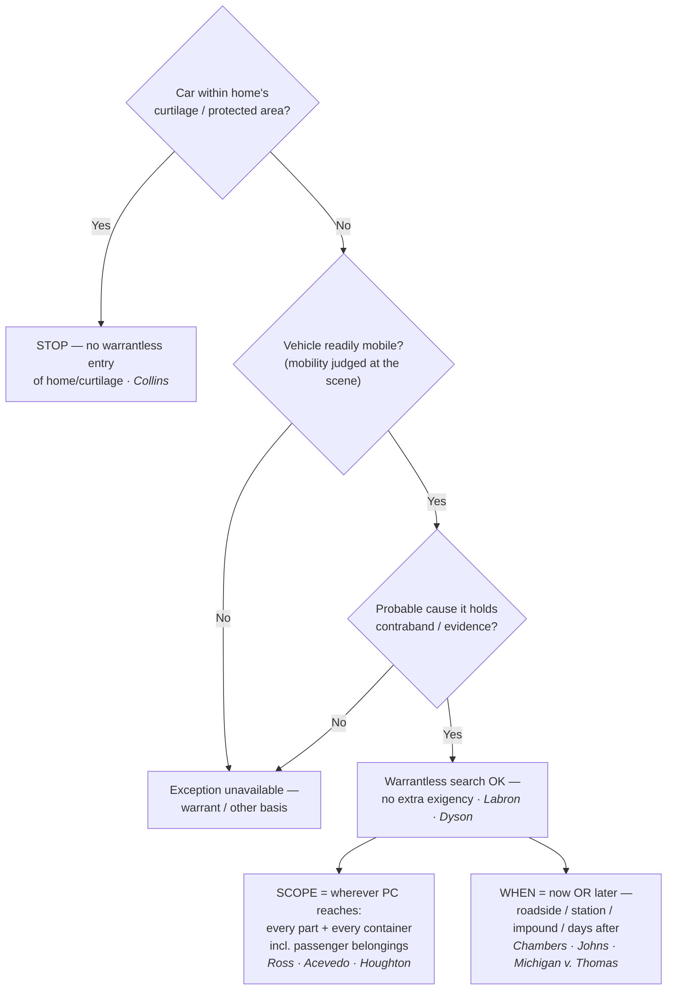

---
aliases:
  - "Automobile Exception"
title: "Automobile Exception"
topic: Automobile Exception
type: doctrine
jurisdiction: Federal (U.S. Const. amend. IV); SCOTUS baseline
status: verified
related: ["[[Traffic Stops]]", "[[Search Incident to Arrest]]", "[[Special Needs and Administrative Searches]]", "[[Curtilage]]"]
---

## The Brief

**Field-decisive question:** *Can I search this vehicle right now without a warrant — and if so, how far does the search reach?* One fact decides it: **probable cause** to believe a **readily mobile** vehicle contains evidence or contraband. If you have it, you may search the car on the spot — or later, at the station, after impoundment — **without a warrant and without any separate showing of exigency**, and the search reaches every part of the car and every container in it where the object of your probable cause could be hidden. If you don't have PC, the exception gives you nothing.

**The black-letter rule + the two-element test (stated up front).** Under the **automobile exception**, a warrantless search of a vehicle is permitted when **(1)** the vehicle is **readily mobile** and **(2)** the officer has **probable cause** to believe it contains contraband or evidence — and on those two facts the Fourth Amendment "permits police to search the vehicle without more." *[[Pennsylvania v. Labron#^pin-940|Labron]]*, 518 U.S. 938, 940 (1996) (per curiam); see *[[United States v. Morley|Morley]]*, 99 F.4th 1328, 1338 (11th Cir. 2024) (reciting the modern two-element formulation). The exception traces to *[[Carroll v. United States#^pin-p37|Carroll]]*, 267 U.S. 132 (1925), which excused the warrant for a vehicle "where it is not practicable to secure a warrant, because the vehicle can be quickly moved out of the locality or jurisdiction in which the warrant must be sought." 267 U.S. at 153. The car's capacity to disappear — not its label as a "car" — is what excuses the warrant.

**Two rationales, both load-bearing.** Modern doctrine rests on a pair of justifications, and you should be able to articulate both:

> "First, the vehicle is obviously readily mobile by the turn of an ignition key, if not actually moving. Second, there is a reduced expectation of privacy stemming from its use as a licensed motor vehicle subject to a range of police regulation inapplicable to a fixed dwelling." — *[[California v. Carney#^pin-393|Carney]]*, 471 U.S. 386, 393 (1985).

*[[California v. Carney|Carney]]* also confirms the exception covers a **motor home** in use as a vehicle, not just an ordinary car; the reduced-privacy rationale also explains why merely examining a car's **exterior** on PC (paint scrapings, a tire-tread cast) invades no protected interest at all. *[[Cardwell v. Lewis|Cardwell]]*, 417 U.S. 583 (1974).

**Scope tracks probable cause — and it reaches containers, including a passenger's.** "If probable cause justifies the search of a lawfully stopped vehicle, it justifies the search of every part of the vehicle and its contents that may conceal the object of the search." *[[United States v. Ross#^pin-825|Ross]]*, 456 U.S. 798, 825 (1982). *[[California v. Acevedo|Acevedo]]* then collapsed the old container/vehicle distinction into a single rule: "We therefore interpret *Carroll* as providing one rule to govern all automobile searches. The police may search an automobile and the containers within it where they have probable cause to believe contraband or evidence is contained." *[[California v. Acevedo#^pin-580|Acevedo]]*, 500 U.S. 565, 580 (1991) — overruling *Arkansas v. Sanders*, 442 U.S. 753 (1979) (the last survivor of the old container rule; **Historical**, overruled), just as *[[United States v. Ross|Ross]]* had earlier swept away *Robbins v. California*, 453 U.S. 420 (1981) (**Historical**, overruled). The "every container" reach is not limited to the driver's: with PC to search the car, officers may inspect "passengers' belongings found in the car that are capable of concealing the object of the search." *[[Wyoming v. Houghton#^pin-307|Houghton]]*, 526 U.S. 295, 307 (1999) — a non-suspect passenger's ownership of a purse or bag is no shield (though *[[Wyoming v. Houghton|Houghton]]* reaches a passenger's **belongings**, not the passenger's **person/body**, which needs its own PC or a search incident to arrest). The high-privacy rule for personal **luggage** — that a double-locked footlocker reduced to exclusive police control may not be searched without a warrant, *[[United States v. Chadwick|Chadwick]]*, 433 U.S. 1, 11, 13 (1977) — survives outside the vehicle context but is **limited by [[California v. Acevedo|Acevedo]]** for a container found **in a car**: there, PC as to the container is searched on the spot. Scope is **object-limited**: PC to find a stolen flat-screen does not justify opening a pill bottle, and PC as to one container is not PC to dismantle the whole car.

**No separate exigency beyond mobility + PC.** *[[Pennsylvania v. Labron|Labron]]* reversed a state rule demanding proof of *additional* exigent circumstances; mobility plus PC is the whole showing, reaffirmed per curiam in *[[Maryland v. Dyson|Dyson]]*, 527 U.S. 465, 466–67 (1999), which held the exception "has no separate exigency requirement" even when officers had ample time to get a warrant.

**Delay and immobilization do not defeat the exception (the delayed-search rule).** Because the justification does not evaporate when the car is immobilized, the search may be conducted later. "Given probable cause to search, either course [immediate search or seizing and holding the car] is reasonable under the Fourth Amendment." *[[Chambers v. Maroney#^pin-52|Chambers]]*, 399 U.S. 42, 52 (1970). *[[United States v. Johns|Johns]]* upheld a search of packages **three days** after they were removed from the truck. 469 U.S. 478, 487 (1985). The same logic validates a warrantless search of an **impounded** car at the station (*[[Michigan v. Thomas|Michigan v. Thomas]]*, 458 U.S. 259 (1982) (per curiam)) and even a **second** search of an already-impounded car hours later (*[[Florida v. Meyers|Meyers]]*, 466 U.S. 380 (1984) (per curiam)). As a vivid in-circuit illustration, *[[United States v. Gastiaburo|Gastiaburo]]* (4th Cir.) pushes the point to **38 days** — "the passage of time between the seizure and the search... is legally irrelevant." 16 F.3d 582, 587 (4th Cir. 1994). Mobility is judged **at the scene**; don't assume a warrant is suddenly required merely because the car is now immobilized or impounded.

**The curtilage limit (cross-link [[Curtilage]]).** The exception reaches the *vehicle*, not the constitutionally protected ground it sits on: "the automobile exception does not permit an officer without a warrant to enter a home or its curtilage in order to search a vehicle therein." *[[Collins v. Virginia#^pin-op14|Collins]]*, 584 U.S. 586 (2018) (slip op., at 14). A car parked in a driveway within the curtilage is off-limits without a warrant or a separate exception — the most common overreach in the field.

**Keep it separate from the neighboring vehicle theories.** The auto exception is **not** a search incident to arrest, and confusing the two is a recurring error. SITA cannot justify a search of a car already removed to the station with the arrestee in custody (*[[Preston v. United States|Preston]]*, 376 U.S. 364 (1964)) — that gap is precisely what the auto exception fills — and the SITA vehicle rule is the **narrow, arrest-tethered** *[[Arizona v. Gant|Gant]]* rule (search only if the arrestee is unsecured and within reach, or it is reasonable to believe evidence of the arrest offense is in the car), not the PC-driven whole-car reach of the auto exception. Nor is it the **inventory** route: a lawful impound supports a standardized inventory of the car with **no PC at all** (*[[South Dakota v. Opperman|Opperman]]* / *[[Colorado v. Bertine|Bertine]]* — see [[Special Needs and Administrative Searches]]), but only where it is not a ruse for general rummaging (*[[Florida v. Wells|Wells]]*). And it is neither the **community-caretaking** basis for entering a disabled or impounded vehicle (*[[Cady v. Dombrowski|Cady]]*) nor the Terry-level **protective sweep** of the passenger compartment for weapons on reasonable suspicion the driver is dangerous (*[[Michigan v. Long|Long]]*).

**Burden · standard of review · remedy.** Because this is a **warrantless** search, the **government** bears the burden of bringing it within the exception — i.e., of showing ready mobility and probable cause. Whether PC existed is reviewed **de novo** on appeal, with the historical facts taken for **clear error**. Cf. *[[Ornelas v. United States|Ornelas]]*, 517 U.S. 690, 699 (1996). The **remedy** for a search that falls outside the exception is suppression of the evidence and its fruits under the exclusionary rule ([[The Exclusionary Rule]]).

**Pitfalls to flag for the field.** (1) Treating **"automobile" as the magic word** — *[[California v. Carney|Carney]]*'s reduced-privacy rationale lowers the bar, it never eliminates the **PC** requirement. (2) **Searching beyond the object's likely location** — PC defines the *scope* (*[[United States v. Ross|Ross]]*/*[[California v. Acevedo|Acevedo]]*); PC to find a rifle does not justify opening a jewelry box, and PC as to one closed container is not PC to tear the car apart; conversely, don't assume a **passenger's** bag is off-limits (*[[Wyoming v. Houghton|Houghton]]*). (3) **Assuming you must search *now*** — you don't (*[[Chambers v. Maroney|Chambers]]* / *[[United States v. Johns|Johns]]*); and the converse trap, assuming immobilization revives the warrant requirement, is just as common (it doesn't). (4) **Driveway / curtilage overreach** — *[[Collins v. Virginia|Collins]]* forbids walking onto protected ground to reach the car. (5) **Over-relying on *[[United States v. Anchondo|Anchondo]]*** — frequently cited in the field as auto-exception authority, it is not: the defendant **conceded** vehicle PC and the cocaine was upheld as a **search incident to arrest** of his person, not under the auto exception (see [[Search Incident to Arrest]]). Do not anchor any auto-exception rule to it.

## Key cases

| Case | Holding in one line | Weight | Treatment | CourtListener |
|---|---|---|---|---|
| *[[Carroll v. United States]]*, 267 U.S. 132 (1925) | **Origin (Anchor):** a vehicle may be searched warrantless on PC because, unlike a fixed structure, it can be quickly moved out of the jurisdiction before a warrant issues (ready mobility). | Binding — SCOTUS | good *(2026-06-30)* | [link](https://www.courtlistener.com/opinion/100567/carroll-v-united-states/) |
| *[[United States v. Ross]]*, 456 U.S. 798 (1982) | **Anchor (scope):** PC to search the vehicle justifies a search of **every part of it and every container within** that may conceal the object of the search. | Binding — SCOTUS | good *(2026-06-30)* | [link](https://www.courtlistener.com/opinion/110719/united-states-v-ross/) |
| *[[Chambers v. Maroney]]*, 399 U.S. 42 (1970) | Where PC + mobility existed at the scene, a **station-house search** is as reasonable as a roadside one; immobilization until a warrant issues is no better. | Binding — SCOTUS | good *(2026-06-30)* | [link](https://www.courtlistener.com/opinion/108184/chambers-v-maroney/) |
| *[[California v. Carney]]*, 471 U.S. 386 (1985) | Applies to a **motor home** in use as a vehicle; states the **two rationales** — ready mobility + reduced expectation of privacy from pervasive regulation. | Binding — SCOTUS | good *(2026-06-30)* | [link](https://www.courtlistener.com/opinion/111423/california-v-carney/) |
| *[[California v. Acevedo]]*, 500 U.S. 565 (1991) | **One unified container rule:** police may search a container in a car on PC it holds contraband; overruled *Arkansas v. Sanders*. | Binding — SCOTUS | good *(2026-06-30)* | [link](https://www.courtlistener.com/opinion/112608/california-v-acevedo/) |
| *[[Wyoming v. Houghton]]*, 526 U.S. 295 (1999) | With PC to search a car, officers may search a **passenger's belongings** capable of concealing the object; a non-suspect passenger's ownership is no shield. | Binding — SCOTUS | good *(2026-06-30)* | [link](https://www.courtlistener.com/opinion/118277/wyoming-v-houghton/) |
| *[[Pennsylvania v. Labron]]*, 518 U.S. 938 (1996) (per curiam) | **No separate exigency:** readily mobile + PC permits a warrantless search "without more." | Binding — SCOTUS | good *(2026-06-30)* | [link](https://www.courtlistener.com/opinion/118063/pennsylvania-v-labron/) |
| *[[Maryland v. Dyson]]*, 527 U.S. 465 (1999) (per curiam) | Reaffirms the exception **has no separate exigency requirement** — valid even with ample time to obtain a warrant. | Binding — SCOTUS | good *(2026-06-30)* | [link](https://www.courtlistener.com/opinion/2621047/maryland-v-dyson/) |
| *[[United States v. Johns]]*, 469 U.S. 478 (1985) | **Delayed search** of packages lawfully removed from a vehicle (three days later) is valid; immobilization does not end the justification. | Binding — SCOTUS | good *(2026-06-30)* | [link](https://www.courtlistener.com/opinion/111305/united-states-v-johns/) |
| *[[Michigan v. Thomas]]*, 458 U.S. 259 (1982) (per curiam) | Warrantless search of an **impounded** car at the station is valid on PC; the justification does not vanish once the car is immobilized, and no separate exigency is required. | Binding — SCOTUS | good *(2026-06-30)* | [link](https://www.courtlistener.com/opinion/110776/michigan-v-thomas/) |
| *[[United States v. Chadwick]]*, 433 U.S. 1 (1977) | **Limit (historical):** personal **luggage** (a double-locked footlocker) reduced to exclusive police control may not be searched without a warrant — high privacy, no auto-exception/SITA shortcut. **Limited by [[California v. Acevedo]]** for containers found in a car. | Binding — SCOTUS | limited *(2026-06-30)* | [link](https://www.courtlistener.com/opinion/109714/united-states-v-chadwick/) |
| *[[Collins v. Virginia]]*, 584 U.S. 586 (2018) | **Curtilage limit:** the exception does **not** reach a vehicle parked within the home's curtilage; no warrantless entry of home/curtilage to search a car. | Binding — SCOTUS | good *(2026-06-30)* | [link](https://www.courtlistener.com/opinion/4501697/collins-v-virginia/) |
| *[[United States v. Gastiaburo]]*, 16 F.3d 582 (4th Cir. 1994) | No temporal limit; a **38-day** gap between seizure and search is "legally irrelevant." | Binding in-circuit — 4th Cir. | good *(2026-06-30)* | [link](https://www.courtlistener.com/opinion/7027957/united-states-v-gastiaburo/) |

## Related cases across doctrines

These are treated in full elsewhere (or on their own case page) but bear on the automobile exception, framed for it here.

| Case | Relevance to the automobile exception (framed here) | Weight · Treatment | Treated in full · CourtListener |
|---|---|---|---|
| *[[Cardwell v. Lewis]]*, 417 U.S. 583 (1974) | Anchors the **reduced-expectation-of-privacy** rationale: examining a car's **exterior** (paint scrapings, tire tread) on PC in a public lot invades no protected interest. | Binding — SCOTUS · good | [[Two Definitions of Search]] · [CL](https://www.courtlistener.com/opinion/109069/cardwell-v-lewis/) |
| *[[Cooper v. California]]*, 386 U.S. 58 (1967) | A warrantless search of a car **lawfully held in custody** (there, for forfeiture) is reasonable where closely related to the reason for the seizure — reasonableness, not state-law authorization, is the test. | Binding — SCOTUS · good | [CL](https://www.courtlistener.com/opinion/107360/cooper-v-california/) |
| *[[Florida v. White]]*, 526 U.S. 559 (1999) | Where police have PC the **vehicle is itself forfeitable contraband**, the Fourth Amendment does not require a warrant to **seize** the car from a public place. | Binding — SCOTUS · good | [CL](https://www.courtlistener.com/opinion/118287/florida-v-white/) |
| *[[Harris v. United States (1968)]]*, 390 U.S. 234 (1968) | Objects in **plain view** of an officer rightfully positioned (here, a protective measure securing a lawfully impounded car) are subject to seizure; the protective step was not a search. | Binding — SCOTUS · good | [[Plain View Doctrine]] · [CL](https://www.courtlistener.com/opinion/107625/harris-v-united-states/) |
| *[[Preston v. United States]]*, 376 U.S. 364 (1964) | The **SITA limit** that made the auto exception necessary: a warrantless car search is **not** incident to arrest once the arrestee is in custody and the car removed. | Binding — SCOTUS · good | [[Search Incident to Arrest]] · [CL](https://www.courtlistener.com/opinion/106771/preston-v-united-states/) |
| *[[Arizona v. Gant]]*, 556 U.S. 332 (2009) | The **other** vehicle-search theory and its sharp contrast: SITA reaches the car only if the arrestee is unsecured and within reach, OR evidence of the arrest offense may be inside — far narrower than the PC-driven auto exception. Don't conflate the two. | Binding — SCOTUS · good | [[Search Incident to Arrest]] · [CL](https://www.courtlistener.com/opinion/145887/arizona-v-gant/) |
| *[[Thornton v. United States]]*, 541 U.S. 615 (2004) | Extended the *Belton* SITA vehicle rule to a "recent occupant" who had already exited — **limited by [[Arizona v. Gant]]**'s two-justification test; a SITA case, not auto-exception authority. | Binding — SCOTUS · limited | [[Search Incident to Arrest]] · [CL](https://www.courtlistener.com/opinion/134746/thornton-v-united-states/) |
| *[[Maryland v. Pringle]]*, 540 U.S. 366 (2003) | Supplies the **PC predicate** that triggers the exception: drugs and cash in a car with no occupant claiming them give PC as to the car (and all occupants) — the "PC it contains contraband" element. | Binding — SCOTUS · good | [[Probable Cause and Reasonable Suspicion]] · [CL](https://www.courtlistener.com/opinion/131150/maryland-v-pringle/) |
| *[[South Dakota v. Opperman]]*, 428 U.S. 364 (1976) | The **inventory alternative** — a warrantless search of a lawfully impounded car under standardized procedures, a SEPARATE basis needing **no PC**; invoke it when auto-exception PC is thin but the car is lawfully impounded. | Binding — SCOTUS · good | [[Special Needs and Administrative Searches]] · [CL](https://www.courtlistener.com/opinion/109537/south-dakota-v-opperman/) |
| *[[Colorado v. Bertine]]*, 479 U.S. 367 (1987) | Inventory of an impounded car may include opening **closed containers** under standardized criteria — the no-PC route to a container the auto exception reaches only with PC. | Binding — SCOTUS · good | [[Special Needs and Administrative Searches]] · [CL](https://www.courtlistener.com/opinion/111788/colorado-v-bertine/) |
| *[[Florida v. Wells]]*, 495 U.S. 1 (1990) | Marks the inventory boundary: an inventory cannot be a ruse for **general rummaging** — when officers really hunt evidence without PC, neither inventory nor the auto exception saves the search. | Binding — SCOTUS · good | [[Special Needs and Administrative Searches]] · [CL](https://www.courtlistener.com/opinion/112412/florida-v-wells/) |
| *[[Cady v. Dombrowski]]*, 413 U.S. 433 (1973) | Origin of **community caretaking** with vehicles — a distinct, non-investigatory warrantless basis to enter a car (disabled/impounded) that does not require the PC the auto exception demands. | Binding — SCOTUS · good | [[Community Caretaking]] · [CL](https://www.courtlistener.com/opinion/108850/cady-v-dombrowski/) |
| *[[Michigan v. Long]]*, 463 U.S. 1032 (1983) | The Terry-based **protective sweep** to contrast: on reasonable suspicion the driver is dangerous, officers may sweep the passenger compartment for weapons — a suspicion-level search distinct from the PC-driven auto exception. | Binding — SCOTUS · good | [[Traffic Stops]] · [CL](https://www.courtlistener.com/opinion/111020/michigan-v-long/) |
| *[[Byrd v. United States]]*, 584 U.S. 395 (2018) | **Standing predicate:** a driver in lawful possession/control of a rental car has a reasonable expectation of privacy even if not on the rental agreement — so he can challenge an auto-exception search. | Binding — SCOTUS · good | [[Standing to Challenge a Search]] · [CL](https://www.courtlistener.com/opinion/4497658/byrd-v-united-states/) |
| *[[Riley v. California]]*, 573 U.S. 373 (2014) | The **digital frontier:** *Riley*'s logic (a phone's data implicates privacy "far beyond" physical effects) drives the open question whether the exception reaches the **data** on a phone found in a car, or only the device — treat phone contents as warrant-required. | Binding — SCOTUS · good | [[Search Incident to Arrest]] · [CL](https://www.courtlistener.com/opinion/2680439/riley-v-cal-united-states/) |
| *[[United States v. Anchondo]]*, 156 F.3d 1043 (10th Cir. 1998) | **Pitfall, not authority:** often miscited for the auto exception — the defendant **conceded** vehicle PC and the cocaine was upheld as a **search incident to arrest** of his person, not under the auto exception. | Binding in-circuit — 10th Cir. · good | [[Search Incident to Arrest]] · [CL](https://www.courtlistener.com/opinion/758111/united-states-v-erick-anchondo/) |

## Recent developments

Role-based, circuit/state only (no SCOTUS). The core rule (mobility + PC, no separate exigency, object-limited scope reaching containers) is SCOTUS-settled and stable; the live edge is **digital**.

**The digital frontier — does the exception reach a phone's *data*?** The open question is whether the "every container" reach extends to the **data** on a cell phone found in a car, with *[[Riley v. California|Riley]]*'s privacy logic pulling courts toward a warrant requirement for phone contents. Largely unlitigated post-*Riley*, with no circuit yet squarely holding the auto exception reaches phone **data**.

- **United States v. Camou, 773 F.3d 932, 943 (9th Cir. 2014)** — *first-impression / digital-limit.* Holds the automobile exception does **not** authorize a warrantless search of the **data** on a cell phone found in a vehicle: a phone is **not a "container"** for auto-exception purposes, and *[[Riley v. California|Riley]]*'s reasoning applies a fortiori because the auto exception's scope is even broader than a search incident to arrest. "[C]ell phones are non-containers for purposes of the vehicle exception to the warrant requirement, and the search of Camou's cell phone cannot be justified under that exception." 773 F.3d at 943. **Binding in-circuit — 9th Cir.** (persuasive outside the 9th) · good. *(No standalone case page — named in prose with circuit.)* [opinion](https://www.courtlistener.com/opinion/2759861/united-states-v-chad-camou/)
- ***[[United States v. Morley|Morley]]*, 99 F.4th 1328, 1338 (11th Cir. 2024)** — *recent restatement (no split).* Distills the doctrine to the clean two-element test — a warrantless vehicle search is permitted "if (1) the vehicle is readily mobile and (2) law enforcement has probable cause to search it" — a recent in-circuit articulation of the settled rule, applying rather than extending it. **Binding in-circuit — 11th Cir.** · good. [opinion](https://www.courtlistener.com/opinion/9498175/united-states-v-derrick-alfondso-morley/)

## Visual

## Sources

- *Carroll v. United States*, 267 U.S. 132 (1925) — https://www.courtlistener.com/opinion/100567/carroll-v-united-states/
- *Chambers v. Maroney*, 399 U.S. 42 (1970) — https://www.courtlistener.com/opinion/108184/chambers-v-maroney/
- *United States v. Ross*, 456 U.S. 798 (1982) — https://www.courtlistener.com/opinion/110719/united-states-v-ross/
- *California v. Carney*, 471 U.S. 386 (1985) — https://www.courtlistener.com/opinion/111423/california-v-carney/
- *United States v. Johns*, 469 U.S. 478 (1985) — https://www.courtlistener.com/opinion/111305/united-states-v-johns/
- *California v. Acevedo*, 500 U.S. 565 (1991) — https://www.courtlistener.com/opinion/112608/california-v-acevedo/
- *Wyoming v. Houghton*, 526 U.S. 295 (1999) — https://www.courtlistener.com/opinion/118277/wyoming-v-houghton/
- *Pennsylvania v. Labron*, 518 U.S. 938 (1996) (per curiam) — https://www.courtlistener.com/opinion/118063/pennsylvania-v-labron/
- *Maryland v. Dyson*, 527 U.S. 465 (1999) (per curiam) — https://www.courtlistener.com/opinion/2621047/maryland-v-dyson/
- *Michigan v. Thomas*, 458 U.S. 259 (1982) (per curiam) — https://www.courtlistener.com/opinion/110776/michigan-v-thomas/
- *United States v. Chadwick*, 433 U.S. 1 (1977) *(limited by California v. Acevedo for containers in a car)* — https://www.courtlistener.com/opinion/109714/united-states-v-chadwick/
- *Collins v. Virginia*, 584 U.S. 586 (2018) — https://www.courtlistener.com/opinion/4501697/collins-v-virginia/
- *Cardwell v. Lewis*, 417 U.S. 583 (1974) — https://www.courtlistener.com/opinion/109069/cardwell-v-lewis/
- *Cooper v. California*, 386 U.S. 58 (1967) — https://www.courtlistener.com/opinion/107360/cooper-v-california/
- *Florida v. Meyers*, 466 U.S. 380 (1984) (per curiam) — https://www.courtlistener.com/opinion/111157/florida-v-meyers/
- *Florida v. White*, 526 U.S. 559 (1999) — https://www.courtlistener.com/opinion/118287/florida-v-white/
- *Harris v. United States*, 390 U.S. 234 (1968) — https://www.courtlistener.com/opinion/107625/harris-v-united-states/
- *Preston v. United States*, 376 U.S. 364 (1964) — https://www.courtlistener.com/opinion/106771/preston-v-united-states/
- *Arizona v. Gant*, 556 U.S. 332 (2009) — https://www.courtlistener.com/opinion/145887/arizona-v-gant/
- *Thornton v. United States*, 541 U.S. 615 (2004) — https://www.courtlistener.com/opinion/134746/thornton-v-united-states/
- *Maryland v. Pringle*, 540 U.S. 366 (2003) — https://www.courtlistener.com/opinion/131150/maryland-v-pringle/
- *South Dakota v. Opperman*, 428 U.S. 364 (1976) — https://www.courtlistener.com/opinion/109537/south-dakota-v-opperman/
- *Colorado v. Bertine*, 479 U.S. 367 (1987) — https://www.courtlistener.com/opinion/111788/colorado-v-bertine/
- *Florida v. Wells*, 495 U.S. 1 (1990) — https://www.courtlistener.com/opinion/112412/florida-v-wells/
- *Cady v. Dombrowski*, 413 U.S. 433 (1973) — https://www.courtlistener.com/opinion/108850/cady-v-dombrowski/
- *Michigan v. Long*, 463 U.S. 1032 (1983) — https://www.courtlistener.com/opinion/111020/michigan-v-long/
- *Byrd v. United States*, 584 U.S. 395 (2018) — https://www.courtlistener.com/opinion/4497658/byrd-v-united-states/
- *Riley v. California*, 573 U.S. 373 (2014) — https://www.courtlistener.com/opinion/2680439/riley-v-cal-united-states/
- *United States v. Gastiaburo*, 16 F.3d 582 (4th Cir. 1994) — https://www.courtlistener.com/opinion/7027957/united-states-v-gastiaburo/
- *United States v. Morley*, 99 F.4th 1328 (11th Cir. 2024) — https://www.courtlistener.com/opinion/9498175/united-states-v-derrick-alfondso-morley/
- *United States v. Camou*, 773 F.3d 932 (9th Cir. 2014) *(no standalone case page)* — https://www.courtlistener.com/opinion/2759861/united-states-v-chad-camou/
- *United States v. Anchondo*, 156 F.3d 1043 (10th Cir. 1998) *(pitfall — SITA case, NOT auto-exception authority)* — https://www.courtlistener.com/opinion/758111/united-states-v-erick-anchondo/
- *Arkansas v. Sanders*, 442 U.S. 753 (1979) *(overruled by California v. Acevedo; Historical — brief-mention, no case page)*
- *Robbins v. California*, 453 U.S. 420 (1981) *(overruled by United States v. Ross; Historical — brief-mention, no case page)*
