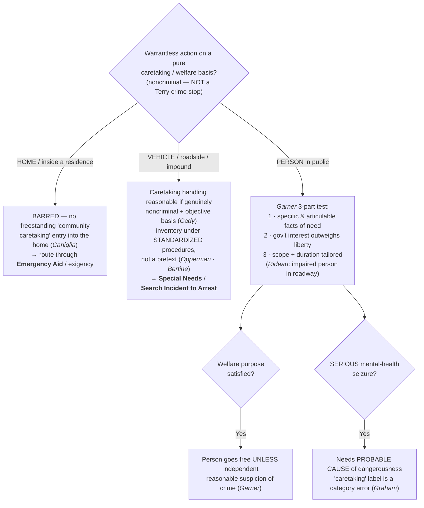

# Community Caretaking

## The Brief

**Field-decisive question:** *This is not a crime stop and I am not entering a home — may I act on a pure safety/welfare basis: handle this disabled or impounded **vehicle**, or briefly stop and check on this **person in public**?* Community caretaking is the cluster of **noncriminal, public-safety** functions police perform that are "totally divorced from the detection, investigation, or acquisition of evidence relating to the violation of a criminal statute." *[[Cady v. Dombrowski#^pin-441|Cady v. Dombrowski]]*, 413 U.S. 433, 441 (1973).

**Scope — stated explicitly (this is the whole point of the doctrine).** Community caretaking is a **NON-HOME** doctrine with **two labeled strands**: **(a) vehicles / roadside / impound** and **(b) caretaking & welfare seizures of *persons* in public**. The **home is barred**: there is **no freestanding "community caretaking" exception** authorizing a warrantless entry into the **home**. *[[Caniglia v. Strom#^pin-op3|Caniglia v. Strom]]*, 593 U.S. 194 (2021) (slip op., at 3). A welfare or safety **entry of a residence** is not a caretaking question at all — it routes through [[Emergency Aid]] or a genuine exigency. The caretaking label is for the **car at the roadside** and the **person in public**, not the front door.

These are **caretaking-justified seizures, placed by holding** — they are **not** crime-suspicion *[[Terry v. Ohio|Terry]]* stops. The justification is safety/welfare, not articulable suspicion of crime; the two are kept distinct on [[Seizure of the Person]], where caretaking seizures sit beside (and apart from) the *[[Terry v. Ohio|Terry]]*/probable-cause continuum.

### Strand (a) — Vehicles / roadside / impound

Community caretaking was **born in the vehicle**. "Local police officers . . . frequently investigate vehicle accidents in which there is no claim of criminal liability and engage in what, for want of a better term, may be described as **community caretaking functions**, totally divorced from the detection, investigation, or acquisition of evidence relating to the violation of a criminal statute." *[[Cady v. Dombrowski#^pin-441|Cady]]*, 413 U.S. at 441. On the facts, a warrantless caretaking search of a disabled, towed car's trunk for the off-duty officer's service revolver — undertaken to keep the gun from the wrong hands, not to investigate crime — was reasonable: "[w]here, as here, the trunk of an automobile, which the officer reasonably believed to contain a gun, was vulnerable to intrusion by vandals," the search was not unreasonable. *[[Cady v. Dombrowski#^pin-448|Id.]]* at 448. The doctrine grew out of the **ambulatory character of vehicles** and their lesser expectation of privacy — the constitutional difference between a car and a home that *[[Caniglia v. Strom|Caniglia]]* later held was the reason caretaking could **not** cross a home's threshold.

The downstream of *[[Cady v. Dombrowski|Cady]]*'s vehicle-caretaking rationale is the **inventory** line — caretaking handling of a lawfully impounded car under **standardized procedures**, not as an investigatory pretext. A routine inventory under standard procedures is reasonable where there is "no suggestion whatever that this standard procedure . . . was a pretext concealing an investigatory police motive." *[[South Dakota v. Opperman#^pin-376|South Dakota v. Opperman]]*, 428 U.S. 364, 376 (1976). Police may even open closed containers, but only where discretion is cabined: "reasonable police regulations relating to inventory procedures administered in good faith satisfy the Fourth Amendment," and discretion is permissible "so long as that discretion is exercised according to standard criteria and on the basis of something other than suspicion of evidence of criminal activity." *[[Colorado v. Bertine#^pin-374|Colorado v. Bertine]]*, 479 U.S. 367, 374–75 (1987). The inventory doctrine is treated in full as an administrative/booking search — cross-link **[[Special Needs and Administrative Searches]]** and **[[Search Incident to Arrest]]**.

### Strand (b) — Caretaking & welfare seizures of persons in public

**State the scope honestly: this strand is circuit law.** There is **no Supreme Court holding** squarely governing a caretaking **seizure of a person** in public; the doctrine is developed by the **circuits**, binding in their own circuits and persuasive elsewhere, and the circuits are named below.

**The controlling test, up front — the *[[United States v. Garner|Garner]]* (10th Cir.) three-part caretaking-detention test.** An officer exercising community-caretaking functions "may . . . properly detain a person," subject to three requirements:

1. **Articulable need** — the detention "must be based upon 'specific and articulable facts which . . . reasonably warrant [an] intrusion' into the individual's liberty." *[[United States v. Garner#^pin-1213|United States v. Garner]]*, 416 F.3d 1208, 1213 (10th Cir. 2005).
2. **Interest-balancing** — "the government's interest must outweigh the individual's interest in being free from arbitrary governmental interference." *[[United States v. Garner#^pin-1213|Id.]]*
3. **Tailoring (scope + duration)** — "the detention must last no longer than is necessary to effectuate its purpose, and its scope must be carefully tailored to its underlying justification." *[[United States v. Garner#^pin-1213|Id.]]*

And the **independent-justification backstop**: once the caretaking purpose is satisfied, the welfare concern can no longer hold the person — "[o]nce the officer has completed the inquiry necessary to satisfy the purpose of the initial detention, he or she must allow the person to proceed **unless the officer has a reasonable suspicion of criminal conduct**." *[[United States v. Garner#^pin-1213c|Id.]]* (Applied: officers could direct a man reported unconscious in a field for hours to return for a fire-department check; when that exam ended, his continuing evasive, nervous conduct supplied independent reasonable suspicion to extend the stop.)

***[[United States v. Rideau|Rideau]]* (5th Cir., en banc) — the impaired person in the roadway.** Caring for an apparently impaired person on the public streets is a recognized **public-welfare / community-caretaking** function. "Police have long served the public welfare by removing intoxicated people from the public streets, where they pose a hazard to themselves and others," so "Officer Ellison was warranted in stopping to investigate the situation and check on the man's condition." *[[United States v. Rideau#^pin-1574|United States v. Rideau]]*, 969 F.2d 1572, 1574 (5th Cir. 1992) (en banc) (citing *[[Cady v. Dombrowski|Cady]]*'s "community caretaking functions"). A lawful caretaking detention is **not** a license to frisk — a protective patdown still needs "specific and articulable facts indicating that their safety is in danger," *[[United States v. Rideau#^pin-1576|id.]]* at 1576 — but on these facts (a man stumbling in a roadway at night who backed away when asked his name) the single, tailored touch of the front pocket was reasonable.

***[[Graham v. Barnette|Graham v. Barnette]]* (8th Cir.) — the label is a "category error," and a serious mental-health seizure needs probable cause of dangerousness.** Decided on remand in light of *[[Caniglia v. Strom|Caniglia]]*, the Eighth Circuit held that post-*[[Caniglia v. Strom|Caniglia]]* the "community caretaking" **label** does not fit a psychiatric seizure: "[n]ow that *[[Caniglia v. Strom|Caniglia]]* has made clear that 'there is no overarching "community caretaking" doctrine,' . . . our use of that label seems to be a **category error**." *[[Graham v. Barnette#^pin-op10|Graham v. Barnette]]*, 5 F.4th 872 (8th Cir. 2021) (slip op., at 10). The governing measure is higher than a brief caretaking detention: "**probable cause of dangerousness** is the standard that must be met for a warrantless mental-health seizure to be reasonable," *[[Graham v. Barnette#^pin-op10a|id.]]*, and "[a]t least nine of our sister circuits have held that the Fourth Amendment requires **probable cause that a person is mentally ill and dangerous** to herself or others" for an emergency mental-health seizure, *[[Graham v. Barnette#^pin-op10b|id.]]* (slip op., at 10–11). So a *brief* welfare detention of an impaired person (*[[United States v. Garner|Garner]]*/*[[United States v. Rideau|Rideau]]*) and a *serious psychiatric seizure* (*[[Graham v. Barnette|Graham]]*) are different objects: the former rides the *[[United States v. Garner|Garner]]* test, the latter ratchets up to **PC of dangerousness**.

**The *[[Caniglia v. Strom|Caniglia]]* caveat on the label.** *[[Caniglia v. Strom|Caniglia]]* held there is no *freestanding* community-caretaking exception for the **home**, and the Court "refrain[ed]" from addressing the standards for emergency psychiatric seizures — so its holding is **home-limited** and does **not** disturb *[[United States v. Garner|Garner]]*'s or *[[United States v. Rideau|Rideau]]*'s rule for caretaking detentions of persons **in public**. But *[[Caniglia v. Strom|Caniglia]]*'s rejection of an "overarching" caretaking doctrine is what makes *[[Graham v. Barnette|Graham]]* treat the **label** as a category error for psychiatric seizures. The takeaway: caretaking of persons in public survives *[[Caniglia v. Strom|Caniglia]]* as a bounded, circuit-developed power; the **label** is contested, and for serious mental-health seizures the operative standard is probable cause of dangerousness, not "caretaking."

**Burden · standard of review · remedy.** A warrantless caretaking action is justified only if the **government** carries it: for a **vehicle**, that the handling was genuinely **noncriminal** and reasonable on objective facts (*[[Cady v. Dombrowski|Cady]]*) — and, for an inventory, that it followed **standardized criteria** and was not an investigatory pretext (*[[South Dakota v. Opperman|Opperman]]*; *[[Colorado v. Bertine|Bertine]]*); for a **person**, that the *[[United States v. Garner|Garner]]* three-part test is met and, once the welfare purpose is spent, that **independent reasonable suspicion** supports any further detention; for a **serious mental-health seizure**, **probable cause of dangerousness** (*[[Graham v. Barnette|Graham]]*). The **remedy** for an action that flunks the applicable measure — or a "caretaking" entry of a **home** — is **suppression** under the exclusionary rule ([[The Exclusionary Rule]]).

**Pitfalls to flag for the field.** (1) **Using "community caretaking" to enter a home.** Barred — caretaking justifies handling a car at the roadside or a person in public, not walking into a house; to cross a threshold you need consent, a warrant, or a genuine emergency/exigency ([[Emergency Aid]]; *[[Caniglia v. Strom]]*). (2) **Labeling a serious psychiatric seizure "community caretaking."** Post-*[[Caniglia v. Strom|Caniglia]]* that is a **category error**; a serious mental-health seizure needs **probable cause of dangerousness** (*[[Graham v. Barnette]]*). (3) **Treating a caretaking stop of a person as a license to investigate crime.** Once the welfare concern is resolved, the person goes free **unless** you have independent reasonable suspicion (*[[United States v. Garner]]*). (4) **Confusing a caretaking seizure with a *[[Terry v. Ohio|Terry]]* stop.** Different justification — safety/welfare, not crime suspicion; placed by holding ([[Seizure of the Person]]). (5) **A caretaking detention is not an automatic frisk.** A patdown still needs specific, articulable safety facts (*[[United States v. Rideau]]*). (6) **Letting a vehicle inventory become a rummage.** It must follow standardized criteria and rest on something other than suspicion of evidence (*[[South Dakota v. Opperman]]*; *[[Colorado v. Bertine]]*).

## Key cases

| Case | Holding in one line | Weight | Treatment | CourtListener |
|---|---|---|---|---|
| *[[Cady v. Dombrowski]]*, 413 U.S. 433 (1973) | **Anchor (vehicles)** — coins "community caretaking functions" in the **vehicle** context; a warrantless caretaking search of an impounded car for a firearm, divorced from criminal investigation, was reasonable (the car/home distinction). | Binding — SCOTUS | good *(2026-06-30)* | [link](https://www.courtlistener.com/opinion/108850/cady-v-dombrowski/) |
| *[[United States v. Garner]]*, 416 F.3d 1208 (10th Cir. 2005) | **Anchor (persons)** — a community-caretaking **detention of a person** is valid under a **three-part test** (articulable facts · interest-balance · scope/duration tailored); once the caretaking purpose is met, further detention needs **independent reasonable suspicion**. | Binding in-circuit — 10th Cir. | good *(2026-06-30)* | [link](https://www.courtlistener.com/opinion/166206/united-states-v-garner/) |
| *[[United States v. Rideau]]*, 969 F.2d 1572 (5th Cir. 1992) (en banc) | Removing an apparently intoxicated person from the public streets is a **public-welfare / caretaking** function warranting a stop to check on him; a protective patdown still needs specific, articulable safety facts. | Binding in-circuit — 5th Cir. | good *(2026-06-30)* | [link](https://www.courtlistener.com/opinion/587275/united-states-v-izeal-rideau-jr/) |
| *[[Graham v. Barnette]]*, 5 F.4th 872 (8th Cir. 2021) | **Progeny / Limit** — post-*[[Caniglia v. Strom|Caniglia]]* the "community caretaking" **label** for psychiatric seizures is a **"category error"**; a warrantless **serious mental-health seizure** is reasonable only on **probable cause of dangerousness**. | Binding in-circuit — 8th Cir. | good *(2026-06-30)* | [link](https://www.courtlistener.com/opinion/4900401/teresa-graham-v-shannon-barnette/) |
| *[[Caniglia v. Strom]]*, 593 U.S. 194 (2021) | **Limit** — there is **no freestanding "community caretaking" exception** for the **home**; *[[Cady v. Dombrowski|Cady]]*'s rationale was vehicle-specific ("a constitutional difference"). Home-limited — does **not** disturb caretaking of persons in public. | Binding — SCOTUS | good *(2026-06-30)* | [link](https://www.courtlistener.com/opinion/4883694/caniglia-v-strom/) |

## Related cases across doctrines

These are treated in full elsewhere but bear on the vehicle-caretaking / inventory strand, framed for it here.

| Case | Relevance to community caretaking (framed here) | Weight · Treatment | Treated in full · CourtListener |
|---|---|---|---|
| *[[South Dakota v. Opperman]]*, 428 U.S. 364 (1976) | The vehicle-**inventory** case directly downstream of *[[Cady v. Dombrowski|Cady]]*'s caretaking rationale: a standardized inventory of a lawfully impounded car, not as an investigatory pretext, is reasonable. | Binding — SCOTUS · good | [[Special Needs and Administrative Searches]] · [CL](https://www.courtlistener.com/opinion/109537/south-dakota-v-opperman/) |
| *[[Colorado v. Bertine]]*, 479 U.S. 367 (1987) | Extends the *[[Cady v. Dombrowski|Cady]]*/*[[South Dakota v. Opperman|Opperman]]* caretaking-inventory line: police may open **closed containers** during an impound inventory **when discretion is cabined by standardized criteria** — illustrating lawful vehicle caretaking in practice. | Binding — SCOTUS · good | [[Search Incident to Arrest]] · [[Special Needs and Administrative Searches]] · [CL](https://www.courtlistener.com/opinion/111788/colorado-v-bertine/) |

## Recent developments

Role-based circuit/state developments only — **no SCOTUS** (any Supreme Court holding, including *[[Caniglia v. Strom]]*, homes to Key cases regardless of date). The persons-in-public strand **is largely circuit law**, and the live movement is at that level:

- **Post-*[[Caniglia v. Strom|Caniglia]]* re-labeling (8th Cir.).** *[[Graham v. Barnette]]* (8th Cir. 2021), on remand from the Supreme Court, recast warrantless **psychiatric seizures** away from the "community caretaking" label (a "category error") and onto **probable cause of dangerousness** — *role: narrows / re-frames.* It reports a **broad circuit consensus**: "at least nine of [its] sister circuits" require probable cause that a person is mentally ill and dangerous for an emergency mental-health seizure — a still-circuit-level agreement with **no Supreme Court holding** squarely adopting it. ⚖ Caretaking *label* contested; PC-of-dangerousness standard converging.
- **The persons-in-public caretaking detention remains circuit-developed.** *[[United States v. Garner]]* (10th Cir.) and *[[United States v. Rideau]]* (5th Cir., en banc) are the in-circuit-controlling anchors for a brief caretaking detention of a person; the Supreme Court has not decided the question, so outside those circuits the test is **persuasive**, and the precise contours (when a welfare check ripens into a seizure; how far the *[[United States v. Garner|Garner]]* tailoring prong reaches) are worked out fact-by-fact in the circuits.

## Visual

## Sources

- *Cady v. Dombrowski*, 413 U.S. 433 (1973) — pinpoints 441, 448 — https://www.courtlistener.com/opinion/108850/cady-v-dombrowski/
- *United States v. Garner*, 416 F.3d 1208 (10th Cir. 2005) — pinpoint 1213 — https://www.courtlistener.com/opinion/166206/united-states-v-garner/
- *United States v. Rideau*, 969 F.2d 1572 (5th Cir. 1992) (en banc) — pinpoints 1574, 1576 — https://www.courtlistener.com/opinion/587275/united-states-v-izeal-rideau-jr/
- *Graham v. Barnette*, 5 F.4th 872 (8th Cir. 2021) — pinpoints slip op. at 10, 10–11 — https://www.courtlistener.com/opinion/4900401/teresa-graham-v-shannon-barnette/
- *Caniglia v. Strom*, 593 U.S. 194 (2021) — pinpoints slip op. at 3, 4 — https://www.courtlistener.com/opinion/4883694/caniglia-v-strom/
- *South Dakota v. Opperman*, 428 U.S. 364 (1976) — pinpoint 376 — https://www.courtlistener.com/opinion/109537/south-dakota-v-opperman/
- *Colorado v. Bertine*, 479 U.S. 367 (1987) — pinpoints 374, 375 — https://www.courtlistener.com/opinion/111788/colorado-v-bertine/
