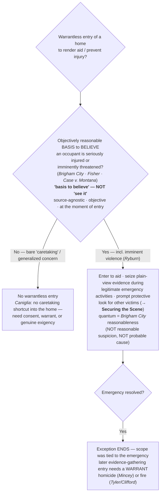

# Emergency Aid

## The Brief

**Field-decisive question:** *Someone inside may be hurt — may I enter?* This page governs the warrantless **entry of a home** (or other protected premises) **to render emergency aid** or head off imminent injury. It does **not** ask whether a crime is afoot; the entry is a non-criminal, life-safety justification, judged by its own objective-reasonableness measure.

**The black-letter rule — the emergency-aid exception (stated up front).** Police "may enter a home without a warrant when they have an **objectively reasonable basis** for believing that an occupant is seriously injured or imminently threatened with such injury." *[[Brigham City v. Stuart#^pin-400|Brigham City v. Stuart]]*, 547 U.S. 398, 400 (2006). The standard is **purely objective**, and the officer's purpose is beside the point: "An action is 'reasonable' under the Fourth Amendment, regardless of the individual officer's state of mind . . . . The officer's subjective motivation is irrelevant." *[[Brigham City v. Stuart#^pin-404|Id.]]* at 404. A bad or mixed motive does not defeat an objectively reasonable entry, and a pure good-faith hunch with no objective basis does not create one.

**Read the standard exactly — "basis to believe," not "see it."** The trigger is an **objectively reasonable basis to believe** an occupant is injured or imminently threatened — it is **source-agnostic**. A 911 hang-up, a credible report of a suicide in progress, the sounds of a violent struggle, blood or a collapsed person glimpsed through a window — any of these can supply the objective basis. The rule is **not** narrowed to "the officer must *see* the injury"; the Court imposed no visual-observation requirement, and narrowing "basis to believe" into "see it" would shrink a source-agnostic standard into one the Court never wrote.

**No ironclad proof; judged at the moment of entry.** Officers "do not need ironclad proof of 'a likely serious, life-threatening' injury to invoke the emergency aid exception." *[[Michigan v. Fisher#^pin-48|Michigan v. Fisher]]*, 558 U.S. 45, 48 (2009) ([[Common Legal Terms#per-curiam|per curiam]]). The inquiry is the objective reasonableness of the belief **at the moment of entry**, not the officer's certainty about what is happening inside and not a hindsight test of whether the officer turned out to be right — a residence in chaos (a wrecked truck, broken windows, fresh blood, a man screaming and hurling objects) gave an objectively reasonable basis even though the blood was "mere drops" and the occupant seemed able to tend to himself.

**No "murder-scene exception"; the scope is tied to the emergency.** The seriousness of a suspected crime does **not** by itself create exigency: "the Fourth Amendment does not bar police officers from making warrantless entries and searches when they reasonably believe that a person within is in need of immediate aid," *[[Mincey v. Arizona#^pin-392|Mincey v. Arizona]]*, 437 U.S. 385, 392 (1978), and "the police may seize any evidence that is in plain view during the course of their legitimate emergency activities," *[[Mincey v. Arizona#^pin-393|id.]]* at 393 — but the warrantless activity must be **strictly circumscribed by the emergency that justifies it**. *[[Mincey v. Arizona|Mincey]]* rejected a four-day warrantless search of a homicide scene on exactly that ground: there is no murder-scene exception, and once the injured are aided and the danger resolved, continued searching needs its own justification. The affirmative side of the same limit is the **prompt protective look for other victims or a perpetrator still on scene** — the scope limit forbids a *general crime-scene search*, not the immediate rescue/protective sweep itself (the protective-sweep mechanics are developed on [[Securing the Scene]]).

**The dissipation rule is general — fire scenes show it too.** The "the emergency-entry justification ends when the emergency ends" principle is not homicide-only. "A burning building clearly presents an exigency of sufficient proportions to render a warrantless entry 'reasonable,'" and "officials need no warrant to remain in a building for a reasonable time to investigate the cause of a blaze after it has been extinguished," but "[t]hereafter, additional entries to investigate the cause of the fire must be made pursuant to the warrant procedures governing administrative searches." *[[Michigan v. Tyler#^pin-509|Michigan v. Tyler]]*, 436 U.S. 499, 509–11 (1978). Where reasonable privacy interests remain, the later search needs a warrant — administrative to determine cause and origin, **criminal on probable cause** if "the primary object of the search is to gather evidence of criminal activity." *[[Michigan v. Clifford#^pin-294|Michigan v. Clifford]]*, 464 U.S. 287, 294 (1984) (plurality). Whether the scene is a homicide (*[[Mincey v. Arizona|Mincey]]*) or a fire (*[[Michigan v. Tyler|Tyler]]*/*[[Michigan v. Clifford|Clifford]]*), a lawful initial emergency entry does not bless a later evidence-gathering one.

**The controlling home-entry LIMIT — there is no caretaking shortcut into the home.** A welfare-check or safety entry must route through emergency aid or a genuine exigency; it may **not** rest on a freestanding "community caretaking" theory. The lower court's caretaking rule "goes beyond anything this Court has recognized," *[[Caniglia v. Strom#^pin-op3|Caniglia v. Strom]]*, 593 U.S. 194 (2021) (slip op., at 3), because *[[Cady v. Dombrowski|Cady]]*'s rationale was vehicle-specific — "the location of that search was an impounded vehicle — not a home — 'a constitutional difference' that the opinion repeatedly stressed," *[[Caniglia v. Strom#^pin-op4|id.]]* (slip op., at 4). *[[Caniglia v. Strom|Caniglia]]* **cabins** caretaking to the vehicle and **leaves the emergency-aid and exigency home-entry exceptions intact**: it polices the *label*, not the underlying emergency power. Operationally, the move *[[Caniglia v. Strom|Caniglia]]* forecloses is invoking "caretaking" at the front door; the move it preserves is articulating a *[[Brigham City v. Stuart|Brigham City]]* emergency. (The non-home caretaking doctrine — vehicles and persons in public — lives on [[Community Caretaking]].)

**Imminent violence is an emergency too — judged from the on-scene perspective.** The exception is not limited to a victim already bleeding; an **objectively reasonable basis to fear imminent violence** supports entry. "[T]he Fourth Amendment permits an officer to enter a residence if the officer has a reasonable basis for concluding that there is an imminent threat of violence." *[[Ryburn v. Huff#^pin-476|Ryburn v. Huff]]*, 565 U.S. 469, 476 (2012) (per curiam). Reasonableness is judged from a reasonable officer's on-scene perspective, not with hindsight, and "a combination of events each of which is mundane when viewed in isolation may paint an alarming picture": where a mother fled back into the house after refusing to say whether there were guns inside, entry on an "objectively reasonable basis for fearing that violence was imminent" was reasonable. *[[Ryburn v. Huff#^pin-477|Id.]]* at 477.

**The quantum is *[[Brigham City v. Stuart|Brigham City]]* reasonableness — neither reasonable suspicion nor probable cause.** The Supreme Court has now confirmed that the emergency-aid standard applies "with no further gloss." It is **not lowered** to *[[Terry v. Ohio|Terry]]* reasonable suspicion: "*[[Brigham City v. Stuart|Brigham City]]* did not adopt *[[Terry v. Ohio|Terry]]*'s reasonable-suspicion standard for home entries. . . . Rather, *[[Brigham City v. Stuart|Brigham City]]* formulated its own standard for dealing with household emergencies." *[[Case v. Montana#^pin-slip7|Case v. Montana]]*, 607 U.S. ___ (2026) (slip op., at 7). And it is **not raised** to probable cause: "We decline Case's invitation to put a new probable-cause spin onto *[[Brigham City v. Stuart|Brigham City]]*. . . . [W]e asked simply whether an officer had 'an objectively reasonable basis for believing' that his entry was direly needed to prevent or deal with serious harm." *[[Case v. Montana#^pin-slip8|Id.]]* (slip op., at 8). Probable cause "is rooted in, and derives its meaning from, the criminal context, and we decline to transplant it to this different one." The entry is also **scope-limited**: "an emergency-aid entry provides no basis to search the premises beyond what is reasonably needed to deal with the emergency while maintaining the officers' safety," assessed "on its own terms, rather than through the lens generally used to consider investigative activity." *[[Case v. Montana#^pin-slip9|Id.]]* (slip op., at 9).

**Burden · standard of review · remedy.** A warrantless entry of a home is **presumptively unreasonable**, so the **government** bears the burden of establishing that the emergency-aid exception justified it. The substantive inquiry is **objective** and **totality-based**, fixed **at the moment of entry**; the reasonableness of the limited entry is assessed "on its own terms," not through the investigative-probable-cause lens. *[[Case v. Montana#^pin-slip9|Case v. Montana]]* (slip op., at 9). The **remedy** for an entry (or a search exceeding the emergency's scope) that flunks the test is **suppression** of the evidence and its fruits under the exclusionary rule ([[The Exclusionary Rule]]).

**Pitfalls to flag for the field.** (1) **Narrowing "basis to believe" into "see it."** The standard is source-agnostic — a report, a 911 call, sounds, or observations can all supply the objective basis; do not tell the field they must visually confirm an injury (*[[Brigham City v. Stuart]]*). (2) **Invoking "community caretaking" at the front door.** Post-*[[Caniglia v. Strom|Caniglia]]* this is the headline error — articulate the *[[Brigham City v. Stuart|Brigham City]]* emergency; a generalized concern for someone's wellbeing, an unanswered door, or a bare "caretaking" rationale will not do (*[[Caniglia v. Strom]]*). (3) **Reading *[[Caniglia v. Strom|Caniglia]]* as abolishing emergency-aid entries.** It does not — it rejects only a *freestanding* caretaking exception for the home. (4) **Treating a serious crime as automatic exigency.** No murder-scene exception (*[[Mincey v. Arizona]]*). (5) **Overstaying the emergency.** The exception ends when the emergency ends; later evidence-gathering needs a warrant, and that dissipation rule reaches fire scenes too (*[[Mincey v. Arizona]]*; *[[Michigan v. Tyler]]*/*[[Michigan v. Clifford]]*). (6) **Relying on good intentions or grading in hindsight.** The test is objective and judged at the moment of entry; a subjective hunch is not enough and a bad motive does not defeat an objectively justified entry (*[[Brigham City v. Stuart]]*; *[[Michigan v. Fisher]]*).

## Key cases

| Case | Holding in one line | Weight | Treatment | CourtListener |
|---|---|---|---|---|
| *[[Brigham City v. Stuart]]*, 547 U.S. 398 (2006) | **Anchor** — emergency-aid entry of a home is lawful on an **objectively reasonable basis** to believe an occupant is seriously injured or imminently threatened; the officer's subjective motivation is irrelevant. | Binding — SCOTUS | good *(2026-06-30)* | [link](https://www.courtlistener.com/opinion/145654/brigham-city-v-stuart/) |
| *[[Michigan v. Fisher]]*, 558 U.S. 45 (2009) (per curiam) | Applies *[[Brigham City v. Stuart|Brigham City]]*: officers need **no ironclad proof** of serious injury and need not be right in hindsight — the test is objective reasonableness **at the moment of entry**. | Binding — SCOTUS | good *(2026-06-30)* | [link](https://www.courtlistener.com/opinion/1755/michigan-v-fisher/) |
| *[[Mincey v. Arizona]]*, 437 U.S. 385 (1978) | **No "murder-scene" exception** — seriousness alone is not exigency; warrantless entry to render **immediate aid** (and seize plain-view evidence during legitimate emergency activities) is allowed, but the activity is **strictly circumscribed by the emergency**. | Binding — SCOTUS | good *(2026-06-30)* | [link](https://www.courtlistener.com/opinion/109905/mincey-v-arizona/) |
| *[[Case v. Montana]]*, 607 U.S. ___ (2026) | *[[Brigham City v. Stuart|Brigham City]]*'s objective-reasonableness standard governs emergency-aid home entries "with no further gloss" — **neither lowered to reasonable suspicion nor raised to probable cause**; PC is "peculiarly related to criminal investigations" and is not transplanted here. *(Re-homed from Recent developments to Key — a SCOTUS holding homes to Key regardless of date, N5.)* | Binding — SCOTUS | good *(2026-06-30)* | [link](https://www.courtlistener.com/opinion/10774335/case-v-montana/) |
| *[[Ryburn v. Huff]]*, 565 U.S. 469 (2012) (per curiam) | An **objectively reasonable basis to fear imminent violence** supports a warrantless home entry; judged from the reasonable officer's on-scene perspective, where a combination of individually mundane events can paint an alarming picture. | Binding — SCOTUS | good *(2026-06-30)* | [link](https://www.courtlistener.com/opinion/622303/ryburn-v-huff/) |
| *[[Caniglia v. Strom]]*, 593 U.S. 194 (2021) | **Limit** — there is **no freestanding "community caretaking" exception** authorizing warrantless entry into the **home**; welfare/safety entries must route through emergency aid or a genuine exigency. Cabins *[[Cady v. Dombrowski|Cady]]* to vehicles; leaves emergency aid intact. | Binding — SCOTUS | good *(2026-06-30)* | [link](https://www.courtlistener.com/opinion/4883694/caniglia-v-strom/) |

## Related cases across doctrines

These are treated in full elsewhere but bear on the emergency-aid scope/dissipation line, framed for it here.

| Case | Relevance to emergency aid (framed here) | Weight · Treatment | Treated in full · CourtListener |
|---|---|---|---|
| *[[Michigan v. Tyler]]*, 436 U.S. 499 (1978) | The dissipation rule outside homicide: a burning building is an exigency needing no warrant, and officials may remain a reasonable time to investigate cause — but **later investigative entries, once the exigency has ended, need a warrant**. | Binding — SCOTUS · good | [[Special Needs and Administrative Searches]] · [CL](https://www.courtlistener.com/opinion/109874/michigan-v-tyler/) |
| *[[Michigan v. Clifford]]*, 464 U.S. 287 (1984) (plurality) | Where reasonable privacy interests remain in fire-damaged property, a post-fire investigative search requires a warrant — **administrative** for cause/origin, **criminal on probable cause** if the object is evidence of crime. Refines *[[Michigan v. Tyler|Tyler]]*'s dissipation line for the home. | Binding — SCOTUS · good | [[Special Needs and Administrative Searches]] · [CL](https://www.courtlistener.com/opinion/111057/michigan-v-clifford/) |

## Recent developments

Role-based circuit/state developments only — **no SCOTUS** (the controlling Supreme Court cases, including the 2026 decision in *[[Case v. Montana]]*, home to Key cases regardless of date, per the no-SCOTUS-in-recent-developments rule). The principal recent movement at this level was a **circuit split over whether courts could graft a probable-cause gloss onto emergency-aid entries** — the Second, Eleventh, and D.C. Circuits had read in a probable-cause requirement, while the First and Eighth Circuits had not. ⚖ **Circuit split (now resolved).** *[[Case v. Montana]]* (2026) settled it **against** the probable-cause gloss, holding *[[Brigham City v. Stuart|Brigham City]]*'s reasonableness standard applies "with no further gloss." With the quantum-of-suspicion question settled, the open line-drawing in the lower courts concerns the **articulable, objective basis** a welfare-check entry must show and the **scope** of the post-entry protective look once aid is rendered.

## Visual

## Sources

- *Brigham City v. Stuart*, 547 U.S. 398 (2006) — pinpoints 400, 404 — https://www.courtlistener.com/opinion/145654/brigham-city-v-stuart/
- *Michigan v. Fisher*, 558 U.S. 45 (2009) (per curiam) — pinpoint 48 — https://www.courtlistener.com/opinion/1755/michigan-v-fisher/
- *Mincey v. Arizona*, 437 U.S. 385 (1978) — pinpoints 392, 393 — https://www.courtlistener.com/opinion/109905/mincey-v-arizona/
- *Case v. Montana*, 607 U.S. ___ (2026) (No. 24-624) — pinpoints slip op. at 7, 8, 9, 10–11 — https://www.courtlistener.com/opinion/10774335/case-v-montana/
- *Ryburn v. Huff*, 565 U.S. 469 (2012) (per curiam) — pinpoints 476, 477 — https://www.courtlistener.com/opinion/622303/ryburn-v-huff/
- *Caniglia v. Strom*, 593 U.S. 194 (2021) — pinpoints slip op. at 3, 4 — https://www.courtlistener.com/opinion/4883694/caniglia-v-strom/
- *Michigan v. Tyler*, 436 U.S. 499 (1978) — pinpoints 509, 510, 511 — https://www.courtlistener.com/opinion/109874/michigan-v-tyler/
- *Michigan v. Clifford*, 464 U.S. 287 (1984) (plurality) — pinpoints 293, 294, 295 — https://www.courtlistener.com/opinion/111057/michigan-v-clifford/
