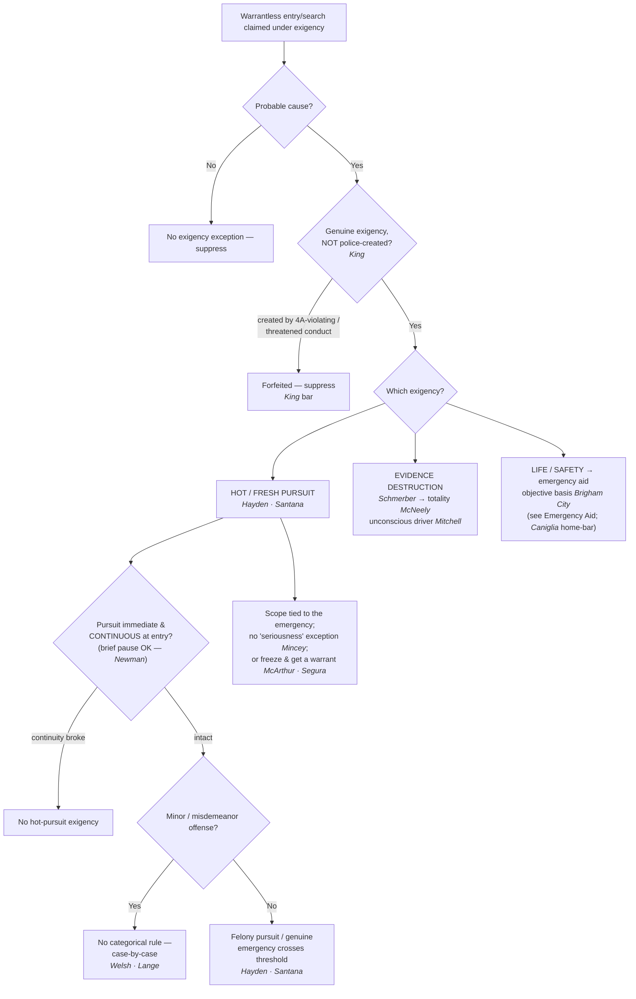

---
aliases:
  - "Exigent Circumstances and Hot Pursuit"
title: "Exigent Circumstances and Hot Pursuit"
topic: Exigent Circumstances and Hot Pursuit
type: doctrine
jurisdiction: Federal (U.S. Const. amend. IV); SCOTUS baseline
status: verified
related: ["[[Arrest in the Home]]", "[[Emergency Aid]]", "[[Securing the Scene]]", "[[Automobile Exception]]", "[[Search Incident to Arrest]]", "[[The Warrant Requirement]]", "[[Knock and Talk]]"]
---

## The Brief

**Field-decisive question:** *Is there a true emergency that lets me act now without a warrant — and how far does it go?* The exception turns on two things in tandem: a **genuine exigency** that makes getting a warrant impracticable, and a **scope** no wider than the emergency that justified acting.

**The black-letter rule.** Exigent circumstances are a recognized exception to [[The Warrant Requirement]]: where police have **probable cause**, a warrantless entry and search is **reasonable** when "the exigencies of the situation make[] that course imperative." *[[Warden v. Hayden#^pin-298|Warden v. Hayden]]*, 387 U.S. 294, 298 (1967). The exigency must be **genuine**, judged on the **totality of the circumstances** — there is no per-se exigency category that fires automatically. Three exigencies are recognized, stated up front: **(1) hot (and fresh) pursuit** of a fleeing suspect; **(2) the imminent destruction of evidence**; and **(3) a risk to life or safety / the need to render emergency aid**. Two outer limits run through all three at once — the **gravity of the offense** (*Welsh*) and the **no-police-created-exigency** rule (*King*) — and the permissible scope is always tethered to the emergency.

**Burden · standard of review.** Because a warrantless home entry is presumptively unreasonable, the **government bears the burden** of proving a recognized exigency justified it; the defendant need not disprove one. That burden is heavy: the police "bear a heavy burden when attempting to demonstrate an urgent need that might justify warrantless searches or arrests." *[[Welsh v. Wisconsin|Welsh v. Wisconsin]]*, 466 U.S. 740, 749–50 (1984); *[[Mincey v. Arizona|Mincey v. Arizona]]*, 437 U.S. 385, 390–91 (1978) (the State bears the burden of showing the emergency). On appeal, suppression rulings get a **mixed standard of review** — historical facts for **clear error**, the ultimate reasonableness/exigency question **de novo** — and the **remedy** for an unjustified warrantless entry is suppression of the evidence and its fruits under [[The Exclusionary Rule]].

**(1) Hot pursuit — and the hot-vs-fresh line.** Hot pursuit of a fleeing suspect into a dwelling is valid where the emergency leaves no time for a warrant. In *[[Warden v. Hayden|Hayden]]* officers entered a house minutes behind an armed robber reported to have just gone in; "neither the entry without warrant to search for the robber, nor the search for him without warrant was invalid," because "the exigencies of the situation made that course imperative," and "[t]he Fourth Amendment does not require police officers to delay … if to do so would gravely endanger their lives or the lives of others." *[[Warden v. Hayden#^pin-299|Id.]]* at 298–99. *[[United States v. Santana|Santana]]* extends the principle to a suspect who retreats from her own threshold: a doorway is a "public" place, and "a suspect may not defeat an arrest which has been set in motion in a public place … by the expedient of escaping to a private place." *[[United States v. Santana#^pin-43|United States v. Santana]]*, 427 U.S. 38, 43 (1976). That the "pursuit here ended almost as soon as it began did not render it any the less a 'hot pursuit.'" *Id.*

*Santana* is **limited by *[[Lange v. California]]*** (N4). *Lange* holds that "pursuit of a fleeing misdemeanor suspect" does not "categorically … qualif[y] as an exigent circumstance. We hold it does not." *[[Lange v. California#^pin-op1|Lange v. California]]*, 594 U.S. 295 (2021) (slip op., at 1); whether a given misdemeanor chase carries an exigency "turns on the particular facts of the case," decided by a "case-by-case assessment." *[[Lange v. California#^pin-op1a|Id.]]* **Why this changes the field call:** before *Lange*, *Santana*'s broad fleeing-suspect language was read to take any pursuit across the threshold; after *Lange*, a chase into the home behind a fleeing **misdemeanant** is no longer automatically lawful — the officer must articulate an actual exigency (escape, imminent harm, or evidence loss). *Santana*'s threshold/**felony** hot-pursuit holding is undisturbed; the misdemeanor automatic-entry reading is gone.

**Teaching line (Bandiero) — "hot on the tail, fresh on the trail."** The mnemonic captures a distinction worth keeping straight in the field. **Hot pursuit** is an **immediate and continuous** pursuit of a suspect from the scene of the crime, ongoing at the moment of entry — the *[[Warden v. Hayden|Hayden]]*/*[[United States v. Santana|Santana]]* situation. **Fresh pursuit** is a **promptly-resumed** pursuit after a brief interruption (and, in its common-law/statutory cross-jurisdictional sense, a pursuit an officer may carry across jurisdictional lines). The dividing question is **continuity**: a short pause does not necessarily break the chase. *[[Newman v. Underhill|Newman v. Underhill]]* (9th Cir. 2025) is the illustration — the exception applies "only if the 'officers [were] in 'immediate' and 'continuous' pursuit of a suspect from the scene of the crime' at the moment they made entry," and a decision to wait for backup "delay[s], but [does] not br[eak]," the "'continuity' of the chase." *[[Newman v. Underhill#^pin-op10|Id.]]* (slip op., at 10, 12). A roughly **nine-minute** gap — "far shorter than the 30-minute period" that had broken continuity in circuit precedent — did **not** break the pursuit where the deputy "had a reasonably good idea where [the suspect] was hiding" and spent the time "actively working to find and apprehend" him. *[[Newman v. Underhill#^pin-op13|Id.]]* (slip op., at 13). Because the underlying offense (felony evasion) was a felony, the categorical hot-pursuit reasoning applied and *Lange*'s misdemeanor limit was not implicated.

**(2) Imminent destruction of evidence.** The anchor is *[[Schmerber v. California|Schmerber]]*: a warrantless blood draw on probable cause is reasonable where dissipating evidence and time already lost leave "no time to seek out a magistrate and secure a warrant." *[[Schmerber v. California#^pin-770|Schmerber v. California]]*, 384 U.S. 757, 770–71 (1966). But dissipation is **not automatic**. *[[Missouri v. McNeely|McNeely]]* rejects a per-se rule: "the natural dissipation of alcohol in the bloodstream does not constitute an exigency in every case sufficient to justify … a blood test without a warrant"; the totality controls. *[[Missouri v. McNeely#^pin-156|Missouri v. McNeely]]*, 569 U.S. 141, 156 (2013). *[[Mitchell v. Wisconsin|Mitchell]]* (a **plurality**) carves out the unconscious-driver scenario: when an unconscious or stuporous DUI suspect must be hospitalized before a breath test, officers "may almost always order a warrantless blood test … without offending the Fourth Amendment," subject to the defendant's chance to show his was the unusual case. *[[Mitchell v. Wisconsin#^pin-2539|Mitchell v. Wisconsin]]*, 588 U.S. 840 (2019) (plurality), 139 S. Ct. 2525, 2539. The dissipation branch is not limited to blood: *[[Cupp v. Murphy|Cupp v. Murphy]]* upheld the "very limited search necessary to preserve … highly evanescent evidence" (fingernail scrapings) on probable cause even without a formal arrest, on a narrowed *[[Chimel v. California|Chimel]]* rationale — while expressly declining to authorize a full search. *[[Cupp v. Murphy#^pin-296|Cupp v. Murphy]]*, 412 U.S. 291, 296 (1973). (Note the cross-doctrine wrinkle from [[Search Incident to Arrest]]: after *[[Birchfield v. North Dakota|Birchfield]]*, a warrantless **blood** draw can no longer be justified as a search incident to a DUI arrest — only a **breath** test can — so a blood draw must rest on **exigency** or a warrant.)

**(3) Risk of harm / emergency aid.** The life-safety branch shades into **emergency aid**, governed by an objective standard: police "may enter a home without a warrant when they have an objectively reasonable basis for believing that an occupant is seriously injured or imminently threatened with such injury," and "[t]he officer's subjective motivation is irrelevant." *[[Brigham City v. Stuart#^pin-400|Brigham City v. Stuart]]*, 547 U.S. 398, 400, 404 (2006). Note the standard is a **basis to believe** an occupant is injured — not a requirement that officers **see** the injury. Develop these entries on [[Emergency Aid]]; note that there is **no** freestanding "community caretaking" power to cross a home's threshold — such safety/welfare entries must be justified, if at all, under this exigency/emergency-aid analysis. *[[Caniglia v. Strom|Caniglia v. Strom]]*, 593 U.S. 194 (2021).

**The outer limit on all three: no police-created exigency.** Officers may rely on an exigency their own conduct prompted **unless** "the police … create[d] the exigency by engaging or threatening to engage in conduct that violates the Fourth Amendment." *[[Kentucky v. King#^pin-op8|Kentucky v. King]]*, 563 U.S. 452 (2011) (slip op., at 8). Lawful knock-and-announce — conduct any private citizen may do — does **not** manufacture the exigency, even when it prompts occupants to start destroying evidence; that lawful knock at the door is the [[Knock and Talk]] approach. What forfeits the exception is creating the emergency through an actual or threatened **constitutional violation** (e.g., announcing an imminent unlawful entry to provoke destruction).

**The other outer limit: gravity of the offense.** "[A]n important factor … is the gravity of the underlying offense," and the exception "should rarely be sanctioned when there is probable cause to believe that only a minor offense … has been committed." *[[Welsh v. Wisconsin#^pin-753|Welsh v. Wisconsin]]*, 466 U.S. 740, 753 (1984) — a warrantless home arrest for such an offense is "clearly prohibited by the special protection afforded the individual in his home." *[[Welsh v. Wisconsin#^pin-755|Id.]]* at 755. A minor offense drags the whole exigency analysis toward *unreasonable*, and reinforces *Lange*'s caution about misdemeanor pursuits.

**Scope is tethered to the exigency — and there is no "seriousness" exception.** The search a true exigency authorizes is bounded by the emergency that justified entering: in *[[Warden v. Hayden|Hayden]]* the search reached only the robber and his weapons. The gravity of the suspected crime never substitutes for a real emergency — there is no "murder scene" exigency exception, so warrantless entry must rest on a genuine emergency and any further search needs a warrant. *[[Mincey v. Arizona|Mincey v. Arizona]]*, 437 U.S. 385 (1978). And where the need is to **preserve** evidence rather than search now, the measured response is the **less-intrusive freeze**: with PC that a home holds contraband and a genuine risk of destruction, officers may temporarily restrain a resident from re-entering, or secure the premises from within, **while they get a warrant**. *[[Illinois v. McArthur|Illinois v. McArthur]]*, 531 U.S. 326 (2001); *[[Segura v. United States|Segura v. United States]]*, 468 U.S. 796 (1984). *See* [[Securing the Scene]].

**Pitfalls to flag for the field.** (1) **Treating any fleeing suspect as automatic entry.** After *[[Lange v. California|Lange]]* and *[[Welsh v. Wisconsin|Welsh]]*, flight — especially for a minor or misdemeanor offense — does not by itself open the door; articulate the specific exigency. (2) **Manufacturing the exigency.** Under *[[Kentucky v. King|King]]*, an exigency created by threatening to breach the Fourth Amendment cannot justify the entry; lawful knock-and-announce can. (3) **Assuming dissipation alone is exigent.** *[[Missouri v. McNeely|McNeely]]* forecloses a reflexive "the alcohol is leaving the blood" justification; confine the near-automatic rule to *[[Mitchell v. Wisconsin|Mitchell]]*'s unconscious-driver facts and build the totality. (4) **Letting a brief interruption fool you.** Whether a pause **breaks** a pursuit is about **continuity** (did officers keep a fix on the suspect and keep working?), not a stopwatch — *[[Newman v. Underhill|Newman]]*. (5) **Conflating emergency aid with criminal exigency.** Entry to render aid is a **non-criminal**, objective-reasonableness justification (*[[Brigham City v. Stuart|Brigham City]]*); do not borrow it to justify an arrest entry, and remember the home gets no freestanding caretaking entry (*[[Caniglia v. Strom|Caniglia]]*). (6) **Forgetting the boundaries:** authority to enter to **arrest on a warrant** is *Payton*/*Steagald* territory ([[Arrest in the Home]]); what officers may do once lawfully inside (sweeps, freezes) is [[Securing the Scene]]; vehicle mobility is the [[Automobile Exception]]; the search of the arrestee and grab area is [[Search Incident to Arrest]].

## Key cases

| Case | Holding in one line | Authority weight | Treatment | CourtListener |
|---|---|---|---|---|
| *[[Warden v. Hayden]]*, 387 U.S. 294 (1967) | **Anchors hot pursuit:** warrantless entry and search of a house in immediate pursuit of a fleeing armed robber is reasonable where "the exigencies … made that course imperative"; scope follows the emergency (suspect + weapons). | Binding — SCOTUS | good *(2026-06-30)* | [link](https://www.courtlistener.com/opinion/107465/warden-maryland-penitentiary-v-hayden/) |
| *[[United States v. Santana]]*, 427 U.S. 38 (1976) | A suspect in her own doorway is in a **public** place; she cannot defeat a public-place arrest by retreating inside, and **hot pursuit** justifies the warrantless entry that follows. | Binding — SCOTUS | good; **limited by *[[Lange v. California]]*** (misdemeanor pursuit no longer categorical) | [link](https://www.courtlistener.com/opinion/109504/united-states-v-santana/) |
| *[[Lange v. California]]*, 594 U.S. 295 (2021) | Pursuit of a fleeing **misdemeanor** suspect does **not categorically** justify warrantless home entry; courts apply a **case-by-case** exigency assessment. | Binding — SCOTUS | good *(2026-06-30)* | [link](https://www.courtlistener.com/opinion/4894407/lange-v-california/) |
| *[[Welsh v. Wisconsin]]*, 466 U.S. 740 (1984) | The **gravity of the offense** is a key exigency factor; warrantless home entry for a minor, nonjailable offense should "rarely be sanctioned." | Binding — SCOTUS | good *(2026-06-30)* | [link](https://www.courtlistener.com/opinion/111173/welsh-v-wisconsin/) |
| *[[Kentucky v. King]]*, 563 U.S. 452 (2011) | Police may rely on a self-created exigency **unless** they created it by engaging or threatening conduct that itself **violates** the Fourth Amendment; lawful knock-and-announce does not. | Binding — SCOTUS | good *(2026-06-30)* | [link](https://www.courtlistener.com/opinion/216733/kentucky-v-king/) |
| *[[Schmerber v. California]]*, 384 U.S. 757 (1966) | **Anchors evidence-dissipation:** a warrantless blood draw on PC is reasonable where dissipating alcohol plus time lost left no time to get a warrant. | Binding — SCOTUS | good *(2026-06-30)* | [link](https://www.courtlistener.com/opinion/107262/schmerber-v-california/) |
| *[[Missouri v. McNeely]]*, 569 U.S. 141 (2013) | Natural metabolization of alcohol is **not** a per-se exigency for a warrantless DUI blood draw; decide case-by-case on the totality. | Binding — SCOTUS | good *(2026-06-30)* | [link](https://www.courtlistener.com/opinion/858288/missouri-v-mcneely/) |
| *[[Mitchell v. Wisconsin]]*, 588 U.S. 840 (2019) (plurality) | Where a DUI driver's unconsciousness forces hospitalization, police may **almost always** order a warrantless blood draw under exigency (defendant may rebut). | Binding — SCOTUS | good *(2026-06-30)* (plurality) | [link](https://www.courtlistener.com/opinion/9231242/mitchell-v-wisconsin/) |

## Related cases across doctrines

These cases are treated in full elsewhere but bear on the exigent-circumstances / hot-pursuit analysis, framed here for it.

| Case | Relevance to exigent circumstances / hot pursuit | Primary treatment | CourtListener |
|---|---|---|---|
| *[[Brigham City v. Stuart]]*, 547 U.S. 398 (2006) | The **emergency-aid** branch: warrantless home entry is reasonable on an **objectively reasonable basis to believe** an occupant is seriously injured or imminently threatened — subjective motive irrelevant. The aid template the third exigency runs through. | [[Emergency Aid]] | [opinion](https://www.courtlistener.com/opinion/145654/brigham-city-v-stuart/) |
| *[[Michigan v. Fisher]]*, 558 U.S. 45 (2009) (per curiam) | Applies the life-and-safety branch: a warrantless entry is reasonable where it is objectively reasonable to believe an occupant is injured or imminently threatened — no ironclad proof of injury required. | [[Emergency Aid]] | [opinion](https://www.courtlistener.com/opinion/1755/michigan-v-fisher/) |
| *[[Caniglia v. Strom]]*, 593 U.S. 194 (2021) | **No** freestanding "community caretaking" exception for the home; safety/welfare entries must be justified, if at all, under the exigent-circumstances/emergency-aid doctrine — channeling these entries into this analysis. | [[Emergency Aid]] | [opinion](https://www.courtlistener.com/opinion/4883694/caniglia-v-strom/) |
| *[[Mincey v. Arizona]]*, 437 U.S. 385 (1978) | **No "murder scene" exigency exception:** the seriousness of the offense does not by itself create exigency; warrantless entry must rest on a genuine emergency, and any further search needs a warrant. The seriousness-cuts-both-ways companion to *Welsh*. | [[Emergency Aid]] | [opinion](https://www.courtlistener.com/opinion/109905/mincey-v-arizona/) |
| *[[Cupp v. Murphy]]*, 412 U.S. 291 (1973) | A **limited** warrantless seizure of highly destructible evidence (fingernail scrapings) on PC is reasonable even without a formal arrest (narrowed *Chimel* rationale) — the evidence-dissipation exigency at its edge; not a full search. | [[Search Incident to Arrest]] | [opinion](https://www.courtlistener.com/opinion/108801/cupp-v-murphy/) |
| *[[Birchfield v. North Dakota]]*, 579 U.S. 438 (2016) | After *Birchfield*, a warrantless **blood** draw is **not** justified as a search incident to a DUI arrest (a breath test is) — so post-*Birchfield* a warrantless blood draw must rest on **exigency** or a warrant. | [[Search Incident to Arrest]] | [opinion](https://www.courtlistener.com/opinion/3216497/birchfield-v-north-dakota/) |
| *[[Payton v. New York]]*, 445 U.S. 573 (1980) | Warrantless, nonconsensual entry into a suspect's **own** home for a routine felony arrest is presumptively unreasonable — the baseline the exigency exception must overcome; absent a warrant, only a genuine exigency (or consent) justifies the entry. | [[Arrest in the Home]] | [opinion](https://www.courtlistener.com/opinion/110235/payton-v-new-york/) |
| *[[Steagald v. United States]]*, 451 U.S. 204 (1981) | To enter a **third party's** home to seize the subject of an arrest warrant, police need a search warrant "absent exigent circumstances or consent" — the case that expressly carves out exigency as the alternative to the warrant. | [[Arrest in the Home]] | [opinion](https://www.courtlistener.com/opinion/110464/steagald-v-united-states/) |
| *[[Illinois v. McArthur]]*, 531 U.S. 326 (2001) | **Exigency short of full entry:** with PC a home contains contraband and a genuine risk of destruction, police may temporarily restrain a resident from re-entering while they obtain a warrant — a measured response to the evidence-destruction exigency. | [[Securing the Scene]] | [opinion](https://www.courtlistener.com/opinion/118405/illinois-v-mcarthur/) |
| *[[Segura v. United States]]*, 468 U.S. 796 (1984) | Officers may secure premises from within pending a warrant where evidence may be destroyed or removed — exigency justifying a temporary occupation/freeze rather than an immediate full search. | [[Securing the Scene]] | [opinion](https://www.courtlistener.com/opinion/111259/segura-v-united-states/) |

## Recent developments

Role-based, circuit/state only (**no SCOTUS** — a Supreme Court holding belongs in Key cases regardless of date). The cases below are **Binding in-circuit** within their own circuit and **Persuasive (outside circuit)** elsewhere; none states nationwide law. Recent circuit law continues to apply the *[[Warden v. Hayden|Hayden]]*/*[[United States v. Santana|Santana]]* continuity requirement and *[[Kentucky v. King|King]]*'s no-manufactured-exigency rule on a fact-specific basis.

- ***[[Newman v. Underhill|Newman v. Underhill]]* (9th Cir. 2025)** — *applies / illustrates the continuity-of-pursuit (hot-vs-fresh) requirement.* A roughly **nine-minute** delay and loss of sight, during which the deputy waited for backup, did **not** break the continuity of an "immediate and continuous" hot pursuit of a felony evader, where the deputy kept "a reasonably good idea" of the suspect's location and spent the time "actively working to find and apprehend" him — "far shorter than the 30-minute period" that had broken continuity in circuit precedent. Warrantless entry into the home where the suspect was reasonably believed to be was a valid exigent hot-pursuit entry; summary judgment for the deputies affirmed. Because the offense was a **felony**, *Lange*'s misdemeanor limit was not implicated. **Binding in-circuit — 9th Cir.** · good. [opinion](https://www.courtlistener.com/opinion/10382777/newman-v-underhill/)
- **United States v. Meyer (8th Cir. 2021)** — *applies *King* (no police-created exigency) in the knock-and-talk setting.* When a suspect's evasive conduct during a consensual knock-and-talk ("need to clean up," "check my email") created a risk of evidence destruction, officers did **not** impermissibly manufacture the exigency: "[j]ust because asking tough questions and closely scrutinizing the answers could lead a suspect to destroy evidence does not mean that someone else created the exigency." Warrantless entry/seizure of devices upheld. **Binding in-circuit — 8th Cir.**; **Persuasive (outside circuit)** · good. *(No standalone case page — named in prose with circuit.)* [opinion](https://www.courtlistener.com/opinion/5302394/united-states-v-william-meyer/)

## Visual

## Sources

- *Warden v. Hayden*, 387 U.S. 294 (1967) — https://www.courtlistener.com/opinion/107465/warden-maryland-penitentiary-v-hayden/ — pinpoints: 298, 298–99.
- *United States v. Santana*, 427 U.S. 38 (1976) — https://www.courtlistener.com/opinion/109504/united-states-v-santana/ — pinpoints: 42, 43.
- *Lange v. California*, 594 U.S. 295 (2021) — https://www.courtlistener.com/opinion/4894407/lange-v-california/ — pinpoint: slip op. at 1.
- *Welsh v. Wisconsin*, 466 U.S. 740 (1984) — https://www.courtlistener.com/opinion/111173/welsh-v-wisconsin/ — pinpoints: 749–50, 753, 755.
- *Kentucky v. King*, 563 U.S. 452 (2011) — https://www.courtlistener.com/opinion/216733/kentucky-v-king/ — pinpoint: slip op. at 8.
- *Schmerber v. California*, 384 U.S. 757 (1966) — https://www.courtlistener.com/opinion/107262/schmerber-v-california/ — pinpoints: 761, 770–71.
- *Missouri v. McNeely*, 569 U.S. 141 (2013) — https://www.courtlistener.com/opinion/858288/missouri-v-mcneely/ — pinpoint: 156.
- *Mitchell v. Wisconsin*, 588 U.S. 840 (2019) (plurality) — https://www.courtlistener.com/opinion/9231242/mitchell-v-wisconsin/ — pinpoint: 139 S. Ct. 2539.
- *Brigham City v. Stuart*, 547 U.S. 398 (2006) — https://www.courtlistener.com/opinion/145654/brigham-city-v-stuart/ — pinpoints: 400, 404.
- *Michigan v. Fisher*, 558 U.S. 45 (2009) (per curiam) — https://www.courtlistener.com/opinion/1755/michigan-v-fisher/.
- *Caniglia v. Strom*, 593 U.S. 194 (2021) — https://www.courtlistener.com/opinion/4883694/caniglia-v-strom/.
- *Mincey v. Arizona*, 437 U.S. 385 (1978) — https://www.courtlistener.com/opinion/109905/mincey-v-arizona/ — pinpoints: 390–91.
- *Cupp v. Murphy*, 412 U.S. 291 (1973) — https://www.courtlistener.com/opinion/108801/cupp-v-murphy/ — pinpoint: 296.
- *Birchfield v. North Dakota*, 579 U.S. 438 (2016) — https://www.courtlistener.com/opinion/3216497/birchfield-v-north-dakota/.
- *Payton v. New York*, 445 U.S. 573 (1980) — https://www.courtlistener.com/opinion/110235/payton-v-new-york/.
- *Steagald v. United States*, 451 U.S. 204 (1981) — https://www.courtlistener.com/opinion/110464/steagald-v-united-states/.
- *Illinois v. McArthur*, 531 U.S. 326 (2001) — https://www.courtlistener.com/opinion/118405/illinois-v-mcarthur/.
- *Segura v. United States*, 468 U.S. 796 (1984) — https://www.courtlistener.com/opinion/111259/segura-v-united-states/.
- *Newman v. Underhill*, 134 F.4th 1025 (9th Cir. 2025) — https://www.courtlistener.com/opinion/10382777/newman-v-underhill/ — pinpoints: slip op. at 10, 12, 13.
- *United States v. Meyer*, 8th Cir. 2021 *(no standalone case page; named with circuit)* — https://www.courtlistener.com/opinion/5302394/united-states-v-william-meyer/.
