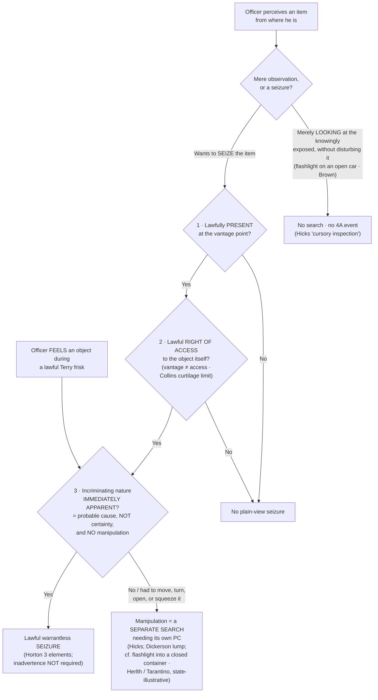

---
aliases:
  - "Plain View Doctrine"
title: "Plain View Doctrine"
topic: Plain View Doctrine
type: doctrine
amendment: "U.S. Const. amend. IV"
jurisdiction: "Federal (U.S. Const. amend. IV); SCOTUS baseline"
status: verified
related: ["[[Two Definitions of Search]]", "[[Curtilage]]", "[[Knock and Talk]]", "[[Search Incident to Arrest]]", "[[Terry Stops and Reasonable Suspicion]]"]
---

# Plain View Doctrine

## The Brief

**Field-decisive question:** *May I seize this item I can see, right now, without a warrant?*

**Keep two ideas apart first.** **Plain view as observation** is not a Fourth Amendment event at all: an officer who merely *looks* at what a person has knowingly exposed conducts no search, because "a truly cursory inspection — one that involves merely looking at what is already exposed to view, without disturbing it — is not a 'search.'" *[[Arizona v. Hicks|Hicks]]*, 480 U.S. 321, 328 (1987). **The plain-view *doctrine*** is something different — a recognized exception that justifies a warrantless **seizure** of an item the officer comes across. Conflating the free observation with the doctrine is the cardinal error on this page.

**The black-letter rule — the three *[[Horton v. California|Horton]]* elements (stated up front).** To seize an item in plain view without a warrant, **all three** of these must be met:

1. **Lawfully present at the vantage point.** "[A]n essential predicate to any valid warrantless seizure of incriminating evidence" is "that the officer did not violate the Fourth Amendment in arriving at the place from which the evidence could be plainly viewed." *[[Horton v. California#^pin-136|Horton]]*, 496 U.S. 128, 136 (1990).
2. **Lawful right of access to the object itself.** "[N]ot only must the officer be lawfully located in a place from which the object can be plainly seen, but he or she must also have a lawful right of access to the object itself." *[[Horton v. California#^pin-137|Horton]]*, 496 U.S. at 137. A lawful *vantage* is **not** the same as a lawful *right of access* — an officer may see contraband through a window from the sidewalk and still lack authority to enter and seize it.
3. **Incriminating character "immediately apparent."** "[N]ot only must the item be in plain view; its incriminating character must also be 'immediately apparent.'" *[[Horton v. California#^pin-136a|Horton]]*, 496 U.S. at 136. "Immediately apparent" means **probable cause**, reached **without manipulating** the item.

The classic articulation is older still: "objects falling in the plain view of an officer who has a right to be in the position to have that view are subject to seizure and may be introduced in evidence." *[[Harris v. United States (1968)#^pin-236a|Harris v. United States]]*, 390 U.S. 234, 236 (1968) ([[Common Legal Terms#per-curiam|per curiam]]) (registration card seen in plain view while lawfully securing an impounded car — "a measure taken to protect the car," not a search, *[[Harris v. United States (1968)#^pin-236|id.]]*).

**"Immediately apparent" = probable cause, not certainty — and no manipulation.** *[[Arizona v. Hicks|Hicks]]* settled the standard: "We now hold that probable cause is required. To say otherwise would be to cut the 'plain view' doctrine loose from its theoretical and practical moorings." *[[Arizona v. Hicks#^pin-326|Hicks]]*, 480 U.S. at 326. But probable cause is the **floor**, not certainty — the *[[Texas v. Brown|Brown]]* plurality warned that "immediately apparent" "was very likely an unhappy choice of words, since it can be taken to imply that an unduly high degree of certainty … is necessary," when in fact a "'practical, nontechnical' probability that incriminating evidence is involved is all that is required." *[[Texas v. Brown#^pin-741|Texas v. Brown]]*, 460 U.S. 730, 741–42 (1983) (plurality). A hunch will not do; certainty is not demanded. And **the moment an officer manipulates an item to develop that probable cause, he has crossed from observation into search**: *Hicks* held that an officer's "moving of the equipment … did constitute a 'search' separate and apart from" the lawful entry — "[a] search is a search, even if it happens to disclose nothing but the bottom of a turntable." *[[Arizona v. Hicks#^pin-324|Hicks]]*, 480 U.S. at 324–25. Plain view must be apparent *as the officer already lawfully stands*, without turning, lifting, or opening.

**Inadvertence is dead — *[[Coolidge v. New Hampshire|Coolidge]]* limited by *[[Horton v. California|Horton]]*.** The doctrine originates in *[[Coolidge v. New Hampshire|Coolidge]]*, whose plurality required that the discovery be **inadvertent** and that plain view "may not be used to extend a general exploratory search from one object to another until something incriminating at last emerges." *[[Coolidge v. New Hampshire#^pin-466a|Coolidge v. New Hampshire]]*, 403 U.S. 443, 466–67 (1971). *[[Horton v. California|Horton]]* **abandoned the inadvertence prong**: "even though inadvertence is a characteristic of most legitimate 'plain-view' seizures, it is not a necessary condition." *[[Horton v. California#^pin-130|Horton]]*, 496 U.S. at 130. An officer who fully **expects** to find an item, and finds it in plain view with the three elements satisfied, may seize it. *Coolidge*'s surviving contributions — the prior-justification requirement and the anti-general-warrant principle — remain good law.

**Plain *feel* — the tactile twin (*[[Minnesota v. Dickerson|Dickerson]]*).** The same logic governs touch. During a lawful *[[Terry Stops and Reasonable Suspicion|Terry]]* frisk, "[i]f a police officer … feels an object whose contour or mass makes its identity immediately apparent … its warrantless seizure would be justified by the same practical considerations that inhere in the plain-view context." *[[Minnesota v. Dickerson#^pin-375|Minnesota v. Dickerson]]*, 508 U.S. 366, 375–76 (1993). But the seizure failed in *Dickerson* itself because the officer determined the lump was contraband only after "squeezing, sliding and otherwise manipulating the contents" — manipulation beyond the weapons frisk, the direct touch-analog of *[[Arizona v. Hicks|Hicks]]*: develop probable cause by manipulating, and you have searched.

**Lawful vantage is bounded by the home and its curtilage (*[[Collins v. Virginia|Collins]]*).** Because the access prong is independent, a warrant exception that authorizes reaching *one* thing does not license the separate trespass of entering protected ground to get there. *[[Collins v. Virginia|Collins]]* held "the automobile exception does not permit an officer without a warrant to enter a home or its curtilage in order to search a vehicle therein." *[[Collins v. Virginia#^pin-op14|Collins v. Virginia]]*, 584 U.S. 586 (2018) (slip op., at 14). The same limit caps the knock-and-talk approach: from the lawful front-door vantage an officer may use what is in plain view, but the approach authorizes **no** entry into curtilage and **no** seizure (cross-reference [[Knock and Talk]] and [[Curtilage]]).

**Controlled deliveries — a lawfully extinguished privacy interest is not revived (*[[Illinois v. Andreas|Andreas]]*).** Plain-view reasoning extends to resealed containers: "No protected privacy interest remains in contraband in a container once government officers lawfully have opened that container and identified its contents as illegal. The simple act of resealing the container to enable the police to make a controlled delivery does not operate to revive or restore the lawfully invaded privacy rights." *[[Illinois v. Andreas#^pin-771|Illinois v. Andreas]]*, 463 U.S. 765, 771 (1983). The operative test is "whether there is a substantial likelihood that the contents of the container have been changed during the gap in surveillance" — absent such a likelihood, reopening works no new search. *[[Illinois v. Andreas#^pin-773|Id.]]* at 773.

**Enhanced or probing observation can itself become a search (state — illustrative).** The federal line runs through *exposure*: a flashlight on what is *already exposed* (an open car interior) is no search — the officer's "action in shining his flashlight to illuminate the interior of Brown's car trenched upon no right secured … by the Fourth Amendment," *[[Texas v. Brown#^pin-739|Brown]]*, 460 U.S. at 739–40 — but a flashlight used to *probe into the concealed* is a different matter. Two state cases illustrate the line (pair them with *Hicks*/*Brown*; they do not bind):

- *[[State v. Tarantino|State v. Tarantino]]* (N.C.): small gaps don't surrender privacy — "[t]he presence of tiny cracks … is not the kind of exposure which serves to eliminate a reasonable expectation of privacy," 368 S.E.2d 588, 593; where the cracks "required him to make a probing examination in order to see inside … defendant's reasonable expectation of privacy remained intact," *id.* at 595.
- *[[Commonwealth v. Herlth|Commonwealth v. Herlth]]* (Pa. Super., en banc): "Trooper Adams' act of shining a flashlight into the hole of the closed shoebox was a search," slip op. at 7; the trooper's "use of an artificial aid to 'brighten' the shoebox interior still constituted an unlawful search," slip op. at 22 — adopting *Tarantino* and distinguishing *[[United States v. Dunn|United States v. Dunn]]* (an open, fully exposed barn). The instructor's tidy illustration — tip-toeing to look over a fence is fine, but bending to peer under a cracked garage door is not — captures the same open-view-versus-enhanced-observation line. (Cross-reference [[Curtilage]].)

**The digital frontier — where plain view is most unsettled.** The premise is *[[Riley v. California|Riley]]*: digital **is** different, so physical-world categorical exceptions do not transfer automatically to a phone — "[o]ur answer … is accordingly simple — get a warrant." *[[Riley v. California|Riley v. California]]*, 573 U.S. 373, 403 (2014). *[[Carpenter v. United States|Carpenter]]* reinforces the premise (digital data gets distinct treatment given "the seismic shifts in digital technology") but is CSLI/third-party law, **not** plain-view authority. The mechanical problem: because responsive data can hide anywhere on a device — mislabeled, in any folder or file type — a broad search may be practically necessary, which threatens to turn a particular warrant into a roving license. That is the **digital general-warrant danger**, and *Coolidge*'s anti-exploratory-search principle is the guardrail. SCOTUS has not resolved it, and courts have spread across an **approach spectrum** (treat it as that, not a clean circuit-vs-circuit conflict). The particularity pole is well stated by the Michigan Supreme Court in *[[People v. Hughes|People v. Hughes]]*, which "decline[d] to adopt a rule that it is always reasonable for an officer to review the entirety of the digital data seized … on the basis of the mere possibility that evidence may conceivably be found anywhere on the device," because such a [[Common Legal Terms#per-se|per se]] rule "would effectively nullify the particularity requirement of the Fourth Amendment in the context of cell-phone data." 958 N.W.2d 98, 117 (Mich. 2020). The full circuit/state spread is catalogued under **Recent developments** below.

**Burden · standard of review · remedy.** As with every warrant exception, the **government bears the burden** of establishing that a warrantless plain-view seizure was justified. On appeal, the suppression court's historical findings of fact are reviewed for **[[Common Legal Terms#clear-error|clear error]]** and the ultimate reasonableness / probable-cause determination **[[Common Legal Terms#de-novo|de novo]]**. The **remedy** for an unjustified plain-view seizure is suppression of the item and its fruits under the exclusionary rule ([[The Exclusionary Rule]]).

**Pitfalls to flag for the field.** (1) **Conflating the observation with the doctrine** — seeing the exposed is free; *seizing* needs all three *[[Horton v. California|Horton]]* elements. (2) **Seizing on a hunch** — "immediately apparent" means **probable cause** (*[[Arizona v. Hicks|Hicks]]*); reasonable suspicion is not enough. (3) **Over-reading "immediately apparent" as certainty** — it demands probable cause, not near-certainty (the phrase was "an unhappy choice of words," *[[Texas v. Brown|Brown]]*). (4) **Manipulating to create plain view** — moving, turning, or opening an item to develop its incriminating character is a **search** (*[[Arizona v. Hicks|Hicks]]*), as is using a flashlight to peer into a closed container (*[[Commonwealth v. Herlth|Herlth]]*/*[[State v. Tarantino|Tarantino]]*, illustrative). (5) **Squeezing or sliding a lump during a frisk** — manipulating an object felt in a *Terry* frisk to develop probable cause exceeds the weapons frisk and is a search (*[[Minnesota v. Dickerson|Dickerson]]*). (6) **Thinking inadvertence still matters** — *[[Horton v. California|Horton]]* dropped it. (7) **Treating a phone warrant as a license to roam and keep whatever turns up** — that is the digital general-warrant trap; when unsure, get a narrower warrant, or a second warrant for a newly discovered offense. (8) **Citing *[[Commonwealth v. Herlth|Herlth]]*/*[[State v. Tarantino|Tarantino]]* as the federal rule** — they are **state, illustrative**; always pair them with *Hicks*/*Horton*/*Brown*.

## Key cases

| Case (Bluebook) | Holding in one line | Weight | Treatment | CourtListener |
|---|---|---|---|---|
| *[[Horton v. California]]*, 496 U.S. 128 (1990) | **The modern plain-view *seizure* test (the anchor):** lawful vantage + lawful right of access + immediately apparent (probable cause, no manipulation). **Inadvertence is NOT required.** | Binding — SCOTUS | good *(2026-06-30)* | [link](https://www.courtlistener.com/opinion/112448/horton-v-california/) |
| *[[Arizona v. Hicks]]*, 480 U.S. 321 (1987) | **Moving** a stereo to read its serial number was a separate **search**; "immediately apparent" requires **probable cause**, not mere suspicion; pure observation of the exposed is not a search. | Binding — SCOTUS | good *(2026-06-30)* | [link](https://www.courtlistener.com/opinion/111834/arizona-v-hicks/) |
| *[[Coolidge v. New Hampshire]]*, 403 U.S. 443 (1971) | Origin of the modern doctrine (plurality); plain view "may not be used to extend a general exploratory search." Originally required inadvertent discovery — **limited by [[Horton v. California]]** (inadvertence prong abandoned). | Binding — SCOTUS | limited *(2026-06-30)* — inadvertence prong abandoned by *[[Horton v. California|Horton]]* | [link](https://www.courtlistener.com/opinion/108377/coolidge-v-new-hampshire/) |
| *[[Texas v. Brown]]*, 460 U.S. 730 (1983) (plurality) | "Immediately apparent" means **probable cause, not certainty** — the phrase was "an unhappy choice of words"; shining a flashlight into a car interior is **not** a search. | Binding — SCOTUS | good *(2026-06-30)* | [link](https://www.courtlistener.com/opinion/110901/texas-v-brown/) |
| *[[Minnesota v. Dickerson]]*, 508 U.S. 366 (1993) | **Plain-feel corollary**: contraband whose identity is immediately apparent by touch during a lawful *Terry* frisk may be seized — but **not** where the officer "squeez[ed], slid[] and otherwise manipulat[ed]" it to ID it (the touch analog of *[[Arizona v. Hicks|Hicks]]*). | Binding — SCOTUS | good *(2026-06-30)* | [link](https://www.courtlistener.com/opinion/112873/minnesota-v-dickerson/) |
| *[[Harris v. United States (1968)]]*, 390 U.S. 234 (1968) | "[O]bjects falling in the plain view of an officer who has a right to be in the position to have that view are subject to seizure" — the registration card seen while lawfully securing an impounded car; a protective measure is not a search. | Binding — SCOTUS | good *(2026-06-30)* | [link](https://www.courtlistener.com/opinion/107625/harris-v-united-states/) |
| *[[State v. Tarantino]]*, 322 N.C. 386, 368 S.E.2d 588 (1988) | Tiny cracks don't surrender REP; an officer who must "bend and peer with a flashlight" through them to see inside conducts a **search**. | Persuasive — state, illustrative | good *(2026-06-30)* | [link](https://www.courtlistener.com/opinion/1294594/state-v-tarantino/) |
| *[[Commonwealth v. Herlth]]*, 2026 PA Super 114 (en banc) | Closed shoebox with a one-inch hole, inside a home, retains REP; shining a flashlight through the hole was a **search** that plain view did not justify. | Persuasive — state, illustrative | good *(2026-06-30)* | [link](https://www.courtlistener.com/opinion/10870804/com-v-herlth-j/) |
| *[[People v. Hughes]]*, 506 Mich. 512, 958 N.W.2d 98 (2020) | Declines a per se rule that whole-device review is always reasonable; particularity limits digital-search scope. | Persuasive — state, illustrative | good *(2026-06-30)* | [link](https://www.courtlistener.com/opinion/4843477/people-of-michigan-v-kristopher-allen-hughes/) |

## Related cases across doctrines

These cases are treated in full on their own case pages, but they bear directly on the plain-view doctrine and are framed for it here.

| Case (Bluebook) | Relevance to plain view (framed here) | Primary home (doctrine) | Treatment | CourtListener |
|---|---|---|---|---|
| *[[Maryland v. Buie]]*, 494 U.S. 325 (1990) | Supplies the **lawful-vantage** prong in the in-home arrest context: officers conducting a permissible protective sweep are "lawfully present," so contraband they observe from places a person could hide is in plain view and seizable; the sweep cannot become a general search to manufacture that vantage. | [[Securing the Scene]] | good *(2026-06-30)* | [opinion](https://www.courtlistener.com/opinion/112384/maryland-v-buie/) |
| *[[Michigan v. Long]]*, 463 U.S. 1032 (1983) | A lawful *Terry* protective sweep of a vehicle's passenger compartment supplies the lawful vantage and right of access: contraband "in plain view" the officer comes upon during the limited weapons search may be seized (the *[[Arizona v. Hicks|Hicks]]* no-manipulation limit still caps how far he may go to develop probable cause). | [[Traffic Stops]] | good *(2026-06-30)* | [opinion](https://www.courtlistener.com/opinion/111020/michigan-v-long/) |
| *[[Illinois v. Andreas]]*, 463 U.S. 765 (1983) | Extends plain-view reasoning to **controlled deliveries**: a privacy interest lawfully extinguished when officers first opened a container is not revived by resealing it, absent a substantial likelihood the contents changed. | [[Plain View Doctrine]] (controlled-delivery extension) | good *(2026-06-30)* | [opinion](https://www.courtlistener.com/opinion/111013/illinois-v-andreas/) |
| *[[Riley v. California]]*, 573 U.S. 373 (2014) | Digital **is** different — physical-world exceptions do not transfer automatically to cell-phone data; to search a phone, "get a warrant." The premise the digital-plain-view frontier builds on. | [[Search Incident to Arrest]] | good *(2026-06-30)* | [opinion](https://www.courtlistener.com/opinion/2680439/riley-v-cal-united-states/) |
| *[[Carpenter v. United States]]*, 585 U.S. 296 (2018) | Digital-era data (CSLI) gets **distinct** Fourth Amendment treatment given "the seismic shifts in digital technology." *Context only — NOT plain-view authority.* | [[Two Definitions of Search]] | good *(2026-06-30)* | [opinion](https://www.courtlistener.com/opinion/4510032/carpenter-v-united-states/) |

## Recent developments

Role-based, circuit/state only (no SCOTUS). Lower courts have applied and stress-tested *[[Horton v. California|Horton]]* on two fronts: the classic "immediately apparent" prong in physical/vehicle searches, and the unresolved digital frontier where plain view collides with computer-warrant scope and bulk data.

**Line A — "Immediately apparent" applied strictly in physical/vehicle searches (faithful modern *[[Arizona v. Hicks|Hicks]]*).**

- ***United States v. Loines* (6th Cir. 2023)** — *narrowing application.* A Black & Mild cigar wrapper and a folded lottery ticket visible from outside the car were "lawful and innocuous items," not intrinsically incriminating; because the officer had to enter the car and closely examine the center console to perceive contraband, plain view failed and that inspection was a separate search unsupported by probable cause — develop PC by closer examination and you have searched. **Binding in-circuit — 6th Cir.** · good. *(No standalone case page — named in prose with circuit.)* [opinion](https://www.courtlistener.com/opinion/9357039/united-states-v-aaron-loines/)

**Line B — The digital frontier: computer-warrant scope and plain view of non-responsive data.** An approach **spectrum**, not a clean circuit conflict; SCOTUS has not resolved it. ⚖ **Unsettled / circuit divergence.**

- **Search-latitude pole** — relevant data may be anywhere, so broad review is permissible, *but* the seizure must stay tethered. ***United States v. Burgess* (10th Cir. 2009)**: "It is unrealistic to expect a warrant to prospectively restrict the scope of a search by directory, filename or extension … that process must remain dynamic," 576 F.3d 1078, 1093–94, though "that is not to say methodology is irrelevant," *id.* at 1094. **Binding in-circuit — 10th Cir.** · good. *(No standalone case page — named in prose with circuit.)* The state echo is ***[[State v. Volle|State v. Volle]]* (Kan. 2025)**: relevant data "may be stored anywhere," yet "the warrant must still include a meaningful limiting principle tying the authorized seizure to evidence of a specified offense," 580 P.3d 1223, 1233. **Persuasive — state, illustrative** · good.
- **Particularity / no-per-se pole** — reject any rule that whole-device review is always reasonable. Carried by ***[[People v. Hughes|People v. Hughes]]*** (Mich. 2020) (Key cases, above): a per se whole-device rule "would effectively nullify the particularity requirement … in the context of cell-phone data," 958 N.W.2d at 117. **Persuasive — state, illustrative** · good.
- **Use-restriction pole** — limit or decline plain view for non-responsive data, and/or bar its *use*. ***[[State v. Mansor|State v. Mansor]]* (Or. 2018)**: "the state should not be permitted to use information obtained in a computer search if the warrant did not authorize the search for that information," 421 P.3d 323, 363 (decided under the **Oregon Constitution** → persuasive only). **Persuasive — state, illustrative** · good.
- **Over-retention axis** — what happens to retained mirror copies over time. ***United States v. Ganias* (2d Cir. 2016) (en banc)** confronted years-long retention of forensic mirror images of non-responsive data but **resolved on the good-faith exception**, leaving the constitutional question OPEN: "we do not reach the specific Fourth Amendment question posed to us today," 824 F.3d 199, 225 (the 2014 panel had found a violation). **Binding in-circuit — 2d Cir.** · good. *(No standalone case page — named in prose with circuit.)*
- **General-warrant flag** — ***[[United States v. Morton|United States v. Morton]]* (5th Cir. 2022) (en banc)** (resolving on good-faith grounds) mused in [[Common Legal Terms#concurring-opinion|concurrence]] that "it would be unsurprising if the Court … recognized an exception to another longstanding Fourth Amendment doctrine, this time plain view," 46 F.4th 331, 341 — raised, not decided. **Binding in-circuit — 5th Cir.** · good. ***United States v. Loera* (10th Cir. 2019)** governs plain-view discovery of incriminating non-responsive data by reasonableness, articulating a four-factor test (time spent on non-responsive material · segregation · manner of discovery · breadth of method): agents could keep searching for the warrant-specified evidence after stumbling on child pornography so long as the forensic steps stayed directed at the authorized target, but a later search navigating exclusively toward such files was unreasonable. **Binding in-circuit — 10th Cir.** · good. *(No standalone case page — named in prose with circuit.)*
- **Geofence sub-line** — the location-data split now teed up for SCOTUS. ***United States v. Smith* (5th Cir. 2024)** held geofence warrants are "modern-day general warrants … unconstitutional under the Fourth Amendment" (though the *Leon* good-faith exception saved the evidence given the technology's novelty), 110 F.4th 817, 838. **Binding in-circuit — 5th Cir.** · good. ***United States v. Chatrie* (4th Cir.)** divided the other way (panel: a short window of Google Location History was *not* a search under the third-party doctrine; en banc affirmed on other grounds while splitting on whether a search occurred). **Binding in-circuit — 4th Cir.** · good. ⚖ **Circuit split** (now under Supreme Court review). *(Neither has a standalone case page — named in prose with circuit.)*
- **Pole-camera / mosaic axis** — ***[[United States v. Tuggle|United States v. Tuggle]]* (7th Cir. 2021)**: ~18 months of warrantless pole-camera surveillance of a home's exterior was not a search "under the current understanding of the Fourth Amendment," 4 F.4th 505, 512, while warning that "it might soon be time to revisit the Fourth Amendment test established in *Katz*," *id.* at 527 (cross-reference [[Curtilage]] for the pole-camera split). **Binding in-circuit — 7th Cir.** · good.

The throughline of Line B: keep digital warrants from becoming general warrants.

## Visual

## Sources

- *Coolidge v. New Hampshire*, 403 U.S. 443 (1971) — https://www.courtlistener.com/opinion/108377/coolidge-v-new-hampshire/ — pinpoint: 466 *(limited by Horton — inadvertence prong abandoned)*.
- *Harris v. United States*, 390 U.S. 234 (1968) (per curiam) — https://www.courtlistener.com/opinion/107625/harris-v-united-states/ — pinpoint: 236.
- *Texas v. Brown*, 460 U.S. 730 (1983) (plurality) — https://www.courtlistener.com/opinion/110901/texas-v-brown/ — pinpoints: 739–40, 741, 742.
- *Illinois v. Andreas*, 463 U.S. 765 (1983) — https://www.courtlistener.com/opinion/111013/illinois-v-andreas/ — pinpoints: 771, 773.
- *Michigan v. Long*, 463 U.S. 1032 (1983) — https://www.courtlistener.com/opinion/111020/michigan-v-long/ *(lawful-vantage / right-of-access via a Terry vehicle sweep; home = [[Traffic Stops]])*.
- *Arizona v. Hicks*, 480 U.S. 321 (1987) — https://www.courtlistener.com/opinion/111834/arizona-v-hicks/ — pinpoints: 324, 325, 326.
- *Maryland v. Buie*, 494 U.S. 325 (1990) — https://www.courtlistener.com/opinion/112384/maryland-v-buie/ *(lawful-vantage prong via a protective sweep; home = [[Securing the Scene]])*.
- *Horton v. California*, 496 U.S. 128 (1990) — https://www.courtlistener.com/opinion/112448/horton-v-california/ — pinpoints: 130, 136, 137.
- *Minnesota v. Dickerson*, 508 U.S. 366 (1993) — https://www.courtlistener.com/opinion/112873/minnesota-v-dickerson/ — pinpoints: 375–376.
- *Riley v. California*, 573 U.S. 373 (2014) — https://www.courtlistener.com/opinion/2680439/riley-v-cal-united-states/ *(digital ≠ physical; home = [[Search Incident to Arrest]])*.
- *Carpenter v. United States*, 585 U.S. 296 (2018) — https://www.courtlistener.com/opinion/4510032/carpenter-v-united-states/ *(digital context only — not plain-view authority; home = [[Two Definitions of Search]])*.
- *Collins v. Virginia*, 584 U.S. 586 (2018) — https://www.courtlistener.com/opinion/4501697/collins-v-virginia/ — pinpoint: slip op., at 14 *(curtilage limit on lawful access; home = [[Automobile Exception]])*.
- *State v. Tarantino*, 322 N.C. 386, 368 S.E.2d 588 (1988) *(persuasive — state, illustrative)* — https://www.courtlistener.com/opinion/1294594/state-v-tarantino/
- *Commonwealth v. Herlth*, 2026 PA Super 114 (en banc) *(persuasive — state, illustrative)* — https://www.courtlistener.com/opinion/10870804/com-v-herlth-j/
- *People v. Hughes*, 506 Mich. 512, 958 N.W.2d 98 (2020) *(persuasive — state, illustrative)* — https://www.courtlistener.com/opinion/4843477/people-of-michigan-v-kristopher-allen-hughes/
- *State v. Volle*, 580 P.3d 1223 (Kan. 2025) *(persuasive — state, illustrative)* — https://www.courtlistener.com/opinion/10811858/state-v-volle/
- *State v. Mansor*, 363 Or. 185, 421 P.3d 323 (2018) *(persuasive — state, illustrative; Oregon Constitution)* — https://www.courtlistener.com/opinion/6656738/state-v-mansor/
- *United States v. Morton*, 46 F.4th 331 (5th Cir. 2022) (en banc) *(Binding in-circuit — 5th Cir.)* — https://www.courtlistener.com/opinion/7859188/united-states-v-morton/
- *United States v. Tuggle*, 4 F.4th 505 (7th Cir. 2021) *(Binding in-circuit — 7th Cir.)* — https://www.courtlistener.com/opinion/4899735/united-states-v-travis-tuggle/
- *United States v. Burgess*, 576 F.3d 1078 (10th Cir. 2009) *(Binding in-circuit — 10th Cir.; no standalone case page)* — https://www.courtlistener.com/opinion/172511/united-states-v-burgess/
- *United States v. Ganias*, 824 F.3d 199 (2d Cir. 2016) (en banc) *(Binding in-circuit — 2d Cir.; no standalone case page)* — https://www.courtlistener.com/opinion/3207604/united-states-v-ganias/
- *United States v. Loera*, 923 F.3d 907 (10th Cir. 2019) *(Binding in-circuit — 10th Cir.; no standalone case page)* — https://www.courtlistener.com/opinion/4619076/united-states-v-loera/
- *United States v. Loines*, 56 F.4th 1099 (6th Cir. 2023) *(Binding in-circuit — 6th Cir.; no standalone case page)* — https://www.courtlistener.com/opinion/9357039/united-states-v-aaron-loines/
- *United States v. Smith*, 110 F.4th 817 (5th Cir. 2024) *(Binding in-circuit — 5th Cir.; no standalone case page)* — https://www.courtlistener.com/opinion/10036119/united-states-v-smith/
- *United States v. Chatrie*, 4th Cir. (geofence / Google Location History; en banc) *(Binding in-circuit — 4th Cir.; no standalone case page)* — https://www.courtlistener.com/opinion/10265776/united-states-v-okello-chatrie/
