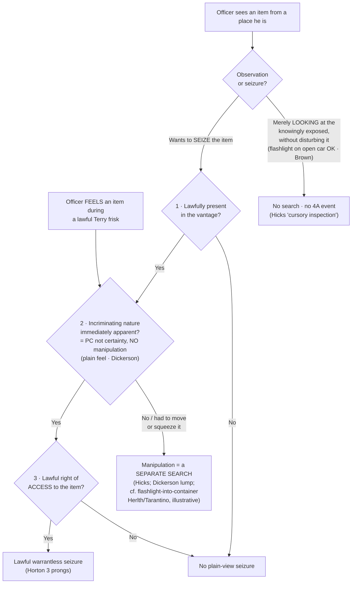

---
aliases:
  - "Plain View Doctrine"
title: "Plain View Doctrine"
topic: Plain View Doctrine
type: doctrine
jurisdiction: Federal (U.S. Const. amend. IV); SCOTUS baseline
status: verified
related: ["[[Two Definitions of Search]]", "[[Curtilage]]", "[[Search Incident to Arrest]]", "[[Terry Stops and Reasonable Suspicion]]"]
---

## Rule
Keep two ideas apart. **Plain view as observation** is not a Fourth Amendment event at all: an officer who merely *looks* at what a person has knowingly exposed conducts no search, because there is no reasonable expectation of privacy in the knowingly exposed — "a truly cursory inspection—one that involves merely looking at what is already exposed to view, without disturbing it—is not a 'search.'" *Arizona v. Hicks*, 480 U.S. 321, 328 (1987). **The plain-view *doctrine*** is something different — a recognized exception that justifies a warrantless **seizure** of an item the officer comes across. To seize in plain view, all **three *Horton* prongs** must be met: (1) the officer is **lawfully in the position** from which the item is plainly seen; (2) the item's **incriminating character is "immediately apparent"** — meaning **probable cause**, reached **without manipulating** the item (*Hicks*); and (3) the officer has a **lawful right of access** to the item itself. *Horton v. California*, 496 U.S. 128, 136–37 (1990). The doctrine originates in *Coolidge v. New Hampshire*, 403 U.S. 443 (1971), and may **not** be used to extend a general exploratory search. *Id.* at 466–67. As with every warrant exception, the **government bears the burden** of establishing that a warrantless plain-view seizure was justified; on appeal, the suppression court's historical findings are reviewed for clear error and the ultimate reasonableness/probable-cause determination de novo.

## Key cases
| Case (Bluebook) | Holding in one line | Weight | CourtListener |
|---|---|---|---|
| *Coolidge v. New Hampshire*, 403 U.S. 443 (1971) | Origin of the modern doctrine (plurality); plain view "may not be used to extend a general exploratory search." Originally required inadvertent discovery — later abandoned in *Horton*. | SCOTUS — binding (plurality on plain view) | [link](https://www.courtlistener.com/opinion/108377/coolidge-v-new-hampshire/) |
| *Texas v. Brown*, 460 U.S. 730 (1983) (plurality) | "Immediately apparent" means **probable cause, not certainty** — the phrase was "an unhappy choice of words"; shining a flashlight into a car interior is **not** a search. | SCOTUS — binding (plurality) | [link](https://www.courtlistener.com/opinion/110901/texas-v-brown/) |
| *Arizona v. Hicks*, 480 U.S. 321 (1987) | **Moving** a stereo to read its serial number was a separate **search**; "immediately apparent" requires **probable cause**, not mere suspicion; pure observation of the exposed is not a search. | SCOTUS — binding | [link](https://www.courtlistener.com/opinion/111834/arizona-v-hicks/) |
| *Horton v. California*, 496 U.S. 128 (1990) | The modern plain-view **seizure** test: lawful vantage + immediately apparent (PC, no manipulation) + lawful right of access. **Inadvertence is NOT required.** | SCOTUS — binding | [link](https://www.courtlistener.com/opinion/112448/horton-v-california/) |
| *Minnesota v. Dickerson*, 508 U.S. 366 (1993) | **Plain-feel corollary**: contraband whose identity is immediately apparent by touch during a lawful *Terry* frisk may be seized — but **not** where the officer "squeez[ed], slid[] and otherwise manipulat[ed]" it to ID it (the touch analog of *Hicks*). | SCOTUS — binding | [link](https://www.courtlistener.com/opinion/112873/minnesota-v-dickerson/) |
| *Riley v. California*, 573 U.S. 373 (2014) | Digital **is** different — physical-world exceptions do not transfer automatically to cell-phone data; to search a phone, "get a warrant." | SCOTUS — binding | [link](https://www.courtlistener.com/opinion/2680439/riley-v-cal-united-states/) |
| *Carpenter v. United States*, 585 U.S. 296 (2018) | Digital-era data (CSLI) gets **distinct** Fourth Amendment treatment given "the seismic shifts in digital technology." *Context only — NOT plain-view authority.* | SCOTUS — binding (digital context) | [link](https://www.courtlistener.com/opinion/4510032/carpenter-v-united-states/) |
| *State v. Tarantino*, 322 N.C. 386, 368 S.E.2d 588 (1988) | Tiny cracks don't surrender REP; an officer who must "bend and peer with a flashlight" through them to see inside conducts a **search**. | State — illustrative, non-binding | [link](https://www.courtlistener.com/opinion/1294594/state-v-tarantino/) |
| *Commonwealth v. Herlth*, 2026 PA Super 114 (en banc) | Closed shoebox with a one-inch hole, inside a home, retains REP; shining a flashlight through the hole was a **search** that plain view did not justify. | State — illustrative, non-binding (Pa. Super.) | [link](https://www.courtlistener.com/opinion/10870804/com-v-herlth-j/) |
| *United States v. Burgess*, 576 F.3d 1078 (10th Cir. 2009) | Search-latitude (federal): "unrealistic to expect a warrant to prospectively restrict the scope of a [computer] search … that process must remain dynamic" — though "methodology is [not] irrelevant." | Persuasive (10th Cir.) | [link](https://www.courtlistener.com/opinion/172511/united-states-v-burgess/) |
| *People v. Hughes*, 506 Mich. 512, 958 N.W.2d 98 (2020) | Declines a per se rule that whole-device review is always reasonable; particularity limits digital-search scope. | Persuasive (state high court) | [link](https://www.courtlistener.com/opinion/4843477/people-of-michigan-v-kristopher-allen-hughes/) |
| *State v. Volle*, 580 P.3d 1223 (Kan. 2025) | Relevant data may be **anywhere**, so broad searching may be needed — but the **seizure** must stay tied to the offense by a meaningful limiting principle. | Persuasive (state high court) | [link](https://www.courtlistener.com/opinion/10811858/state-v-volle/) |
| *State v. Mansor*, 363 Or. 185, 421 P.3d 323 (2018) | **Use restriction**: the State may not *use* nonresponsive data the warrant did not authorize the search to find. (Oregon Constitution → persuasive only.) | Persuasive (state constitution) | [link](https://www.courtlistener.com/opinion/6656738/state-v-mansor/) |
| *United States v. Ganias*, 824 F.3d 199 (2d Cir. 2016) (en banc) | **Over-retention** axis: years-long retention of forensic mirror copies of nonresponsive data — en banc resolved on **good faith**, leaving the 4A retention question OPEN (the 2014 panel had found a violation). | Persuasive (2d Cir. en banc) | [link](https://www.courtlistener.com/opinion/3207604/united-states-v-ganias/) |
| *United States v. Morton*, 46 F.4th 331 (5th Cir. 2022) (en banc) | Flags the digital **general-warrant** problem; concurrence muses the Court may someday recognize a digital exception to plain view. Raised, not decided. | Persuasive (5th Cir. en banc) | [link](https://www.courtlistener.com/opinion/7859188/united-states-v-morton/) |

## Related cases across doctrines
These cases are treated in full on other pages, but they bear directly on the plain-view doctrine and are framed for it here.

| Case | Relevance to plain view | Primary treatment | CourtListener |
|---|---|---|---|
| *Maryland v. Buie*, 494 U.S. 325 (1990) | Establishes the lawful-vantage prong in the in-home arrest context: officers conducting a permissible protective sweep are "lawfully present," so contraband they observe from places a person could hide is in plain view and seizable; the sweep cannot become a general search to manufacture that vantage. | [[Securing the Scene]] | [opinion](https://www.courtlistener.com/opinion/112384/maryland-v-buie/) |
| *Michigan v. Long*, 463 U.S. 1032 (1983) | A lawful *Terry* protective sweep of a vehicle's passenger compartment supplies the lawful vantage and right of access for plain-view seizure: contraband "in plain view" that the officer comes upon during the limited weapons search may be seized (the *Hicks* no-manipulation limit still caps how far the officer may go to develop probable cause). | [[Traffic Stops]] | [opinion](https://www.courtlistener.com/opinion/111020/michigan-v-long/) |

## Nuances & limits
- **Two things, not one.** *Seeing* the exposed is free and triggers no Fourth Amendment scrutiny — there is no privacy interest in what is knowingly held out to public view. *Hicks*, 480 U.S. at 328. *Seizing* an item is a separate intrusion that the plain-view **doctrine** must justify, and it carries all three *Horton* prongs. Conflating the observation with the doctrine is the cardinal error on this page. (Cross-reference [[Two Definitions of Search]].)
- **The *Horton* prongs, verbatim.** Prong 2: "not only must the item be in plain view; its incriminating character must also be 'immediately apparent.'" *Horton*, 496 U.S. at 136. Prongs 1 and 3 travel together:
  > "[N]ot only must the officer be lawfully located in a place from which the object can be plainly seen, but he or she must also have a lawful right of access to the object itself." — *Horton*, 496 U.S. at 137.

  A lawful *vantage* is not the same as a lawful *right of access* — an officer may see contraband through a window from the sidewalk and still lack authority to enter and seize it.
- **"Immediately apparent" means probable cause — not certainty, and no manipulation.** *Hicks* settled the standard: "We now hold that probable cause is required. To say otherwise would be to cut the 'plain view' doctrine loose from its theoretical and practical moorings." 480 U.S. at 326. But probable cause is the *floor*, not certainty: the *Brown* plurality warned that "immediately apparent" "was very likely an unhappy choice of words, since it can be taken to imply that an unduly high degree of certainty … is necessary," when in fact "probable cause is a flexible, common-sense standard." *Texas v. Brown*, 460 U.S. at 741–42. A hunch will not do — but neither is certainty demanded. And the moment an officer *manipulates* an item to develop that probable cause, he has crossed from observation into search: "Officer Nelson's moving of the equipment … did constitute a 'search' separate and apart from" the lawful entry. *Hicks*, 480 U.S. at 324–25. Plain view must be apparent *as the officer already lawfully stands*, without turning, lifting, or opening.
- **Plain *feel* — the tactile twin.** The same logic governs touch. During a lawful *Terry* frisk, "[i]f a police officer … feels an object whose contour or mass makes its identity immediately apparent … its warrantless seizure would be justified by the same practical considerations that inhere in the plain-view context." *Minnesota v. Dickerson*, 508 U.S. at 375–76. But the seizure failed in *Dickerson* itself because "the officer determined that the lump was contraband only after 'squeezing, sliding and otherwise manipulating the contents of the defendant's pocket'" — manipulation beyond the weapons frisk. *Id.* at 378. That is the direct touch-analog of *Hicks*: develop PC by manipulating, and you have searched. (Cross-reference [[Terry Stops and Reasonable Suspicion]] for the frisk's scope.)
- **Inadvertence is dead.** *Coolidge*'s plurality required that the discovery be *inadvertent*; *Horton* expressly abandoned that condition. An officer who fully expects to find an item, and does find it in plain view with the three prongs satisfied, may seize it — the prior expectation does not defeat the seizure.
- **No general exploratory search (the throughline to digital).** Plain view "may not be used to extend a general exploratory search from one object to another until something incriminating at last emerges." *Coolidge*, 403 U.S. at 466–67. This anti-general-warrant principle is the spine that the digital cases below build on.
- **Enhanced or probing observation can itself become a search (state — illustrative, non-binding).** Pair these with *Hicks*/*Brown* (federal); they illustrate the line, they do not bind. The federal line runs through exposure: a flashlight on what is *already exposed* (an open car interior) is no search, *Brown*, 460 U.S. at 739–40; a flashlight used to *probe into the concealed* is a different matter.
  - *State v. Tarantino* (N.C. — illustrative, non-binding): small gaps don't surrender privacy — "[t]he presence of tiny cracks … is not the kind of exposure which serves to eliminate a reasonable expectation of privacy," 368 S.E.2d at 593; where the cracks "required him to make a probing examination in order to see inside … defendant's reasonable expectation of privacy remained intact," *id.* at 595.
  - *Commonwealth v. Herlth* (Pa. Super., en banc — illustrative, non-binding): "Trooper Adams' act of shining a flashlight into the hole of the closed shoebox was a search," slip op. at 7; the trooper's "use of an artificial aid to 'brighten' the shoebox interior still constituted an unlawful search," slip op. at 22. *Herlth* adopts *Tarantino* and distinguishes *United States v. Dunn* (an open, fully exposed barn). The instructor's tidy illustration — tip-toeing to look over a fence is fine, but bending down to peer under a cracked garage door is not — captures the same open-view-versus-enhanced-observation line. (Cross-reference [[Curtilage]] on lawful vantage.)

### Digital Searches & Plain View — the frontier
This is where plain view is most unsettled, and all of the circuit/state law in this subsection is **persuasive or illustrative**, not binding. The premise is *Riley*: digital **is** different. Physical-world categorical exceptions do not transfer automatically to a phone, because "[o]ur answer … is accordingly simple—get a warrant." *Riley*, 573 U.S. at 403. *Carpenter* reinforces the premise — digital data gets distinct treatment given "the seismic shifts in digital technology," 585 U.S. at 313–16 — though *Carpenter* is CSLI/third-party law, **not** plain-view authority. (Cross-reference [[Search Incident to Arrest]], where *Riley* arose.)

The problem is mechanical. Two questions split apart on a device: *whether* the device can be seized and searched at all (generally yes, if it could house the evidence sought), and *where within the device* officers may look. Because responsive data can be hidden anywhere — mislabeled, in any folder, in any file type — a broad search may be practically necessary, which threatens to turn a particular warrant into a roving license. That is the digital general-warrant danger, and *Coolidge*'s anti-exploratory-search principle is the guardrail.

**FLAG — courts diverge sharply; SCOTUS has not resolved it.** Treat this as an approach **spectrum**, not a clean circuit-vs-circuit conflict — do not anchor to one circuit. Courts diverge on the *scope* of a digital-warrant search and on whether plain view sweeps in **non-responsive** data:
- **Search-latitude pole** — relevant data may be anywhere, so broad review is permissible, *but* the seizure must stay tethered. The federal exemplar is *Burgess* (10th Cir.): "It is unrealistic to expect a warrant to prospectively restrict the scope of a search by directory, filename or extension … that process must remain dynamic," 576 F.3d at 1093–94, though "that is not to say methodology is irrelevant," *id.* at 1094. The state echo is *Volle*: "Because relevant information may be stored anywhere on such a device, it is ordinarily impractical … for a warrant to prescribe in advance how officers must locate that data," yet "the warrant must still include a meaningful limiting principle tying the authorized seizure to evidence of a specified offense." 580 P.3d at 1233.
- **Particularity / no-per-se pole** — reject any rule that whole-device review is always reasonable. *Hughes*: "we decline to adopt a rule that it is always reasonable for an officer to review the entirety of the digital data seized pursuant to a warrant on the basis of the mere possibility that evidence may conceivably be found anywhere on the device," because such a per se rule "would effectively nullify the particularity requirement of the Fourth Amendment in the context of cell-phone data." 958 N.W.2d at 117.
- **Use-restriction pole** — limit or decline plain view for nonresponsive data, and/or bar its *use*. *Mansor* (decided under the **Oregon Constitution** → persuasive only): "the state should not be permitted to use information obtained in a computer search if the warrant did not authorize the search for that information, unless some other warrant exception applies." 421 P.3d at 363.
- **Over-retention axis** — what happens to retained mirror copies over time. *Ganias* (2d Cir., en banc) confronted years-long retention of forensic mirror images of nonresponsive data, but **resolved on the good-faith exception** without deciding the constitutional question: "we need not decide whether retention of the forensic mirrors violated the Fourth Amendment, and we affirm the judgment of the district court" — and, for the "left open" point, "we do not reach the specific Fourth Amendment question posed to us today." *United States v. Ganias*, 824 F.3d 199, 221, 225 (2d Cir. 2016) (en banc). The 2014 panel had found a violation; the 2016 en banc court left the over-retention question OPEN.

The federal en banc voice flags the same worry without deciding it. *Morton* (5th Cir. en banc, resolving on good-faith grounds) suggests in concurrence that "it would be unsurprising if the Court … recognized an exception to another longstanding Fourth Amendment doctrine, this time plain view." 46 F.4th at 341. And the Seventh Circuit, upholding long-term pole-camera surveillance under current doctrine, warned that "it might soon be time to revisit the Fourth Amendment test established in Katz." *United States v. Tuggle*, 4 F.4th 505, 527 (7th Cir. 2021). The throughline: keep digital warrants from becoming general warrants.

## Common pitfalls
- **Conflating the observation with the doctrine.** Seeing the exposed is free; **seizing** needs all three *Horton* prongs.
- **Seizing on a hunch.** "Immediately apparent" means **probable cause** (*Hicks*) — reasonable suspicion is not enough.
- **Over-reading "immediately apparent" as requiring certainty.** It demands probable cause, not near-certainty — the phrase was "an unhappy choice of words" (*Brown*); a "flexible, common-sense" probability suffices.
- **Manipulating to create plain view.** Moving, turning, or opening an item to develop its incriminating character is a **search** (*Hicks*) — and using a flashlight to peer into a closed container can be too (*Herlth*/*Tarantino*, illustrative).
- **Squeezing or sliding a lump during a frisk.** Manipulating an object felt in a *Terry* frisk to develop PC exceeds the weapons frisk and is a search (*Dickerson*) — the touch-analog of moving the stereo (*Hicks*).
- **Thinking inadvertence still matters.** *Horton* dropped it; expecting to find the item does not defeat a plain-view seizure when the prongs are met.
- **Treating a phone warrant as a license to roam and keep whatever turns up.** That is the digital general-warrant trap; scope, use, and retention are contested (*Burgess*/*Hughes*/*Volle*/*Mansor*/*Ganias*/*Morton*) and unresolved at SCOTUS. When unsure, get a narrower warrant — or a second warrant for a newly discovered offense.
- **Citing *Herlth*/*Tarantino* as the federal rule.** They are **state, illustrative** — always pair them with *Hicks*/*Horton*/*Brown*.

## Visual

## Recent developments & subsequent treatment
SCOTUS has not revisited the *Horton* framework, but the lower courts have applied and stress-tested it on two fronts: the classic "immediately apparent" prong in physical/vehicle searches, and the unresolved digital frontier where plain view collides with bulk-location data and computer-warrant scope. The circuit decisions below are **persuasive, not binding**; the geofence question they split on is now squarely before the Supreme Court.

- **United States v. Chatrie (4th Cir. 2024)** — A divided panel held that obtaining a short window (~2 hours) of Google Location History was *not* a Fourth Amendment search, treating the data as voluntarily shared under the third-party doctrine (Location History is off by default/opt-in) and declining to extend *Carpenter*; on rehearing en banc the court affirmed on other grounds while fracturing (equally divided) on whether a search occurred, teeing up the SCOTUS question. As a Fourth Circuit decision this is **persuasive, not binding**. ⚖ Circuit split. The panel is superseded by the en banc judgment, and the en banc affirmance is now under Supreme Court review (*Chatrie*, No. 25-112, argued Apr. 27, 2026). [opinion](https://www.courtlistener.com/opinion/10265776/united-states-v-okello-chatrie/).
- **United States v. Smith (5th Cir. 2024)** — Held that obtaining Google Location History via a geofence invades a reasonable expectation of privacy and is a Fourth Amendment search, and that geofence warrants are "modern-day general warrants" and categorically unconstitutional regardless of probable cause — though the evidence was not suppressed under the *Leon* good-faith exception given the novelty of the technology. As a Fifth Circuit decision this is **persuasive, not binding**. ⚖ Circuit split. "We hold that geofence warrants are modern-day general warrants and are unconstitutional under the Fourth Amendment. However, considering law enforcement's reasonable conduct in this case in light of the novelty of this type of warrant, we uphold the district court's determination that suppression was unwarranted under the good-faith exception." 110 F.4th at 838. [opinion](https://www.courtlistener.com/opinion/10036119/united-states-v-smith/).
- **United States v. Loines (6th Cir. 2023)** — Applies the "immediately apparent" prong strictly in the vehicle/physical context: a Black & Mild cigar wrapper and a folded lottery ticket visible from outside the car were "lawful and innocuous items," not intrinsically incriminating, and because the officer had to enter the car and closely examine the center console to perceive contraband, plain view failed and that inspection was a separate search unsupported by probable cause. A faithful modern *Hicks* application — develop PC by closer examination and you have searched. As a Sixth Circuit decision this is **persuasive, not binding**. [opinion](https://www.courtlistener.com/opinion/9357039/united-states-v-aaron-loines/).
- **United States v. Loera (10th Cir. 2019)** — Rejects a bright-line rule and instead governs plain-view discovery of incriminating nonresponsive data during a computer-warrant search by Fourth Amendment reasonableness, articulating a four-factor test: (1) time spent looking at nonresponsive material, (2) whether nonresponsive files were segregated, (3) the manner of discovery (navigating toward versus away), and (4) the breadth of the search method. Agents could keep searching for warrant-specified evidence after stumbling on child pornography so long as the forensic steps stayed directed at the authorized target, but a later search that navigated exclusively toward such files was unreasonable. As a Tenth Circuit decision this is **persuasive, not binding**. [opinion](https://www.courtlistener.com/opinion/4619076/united-states-v-loera/).

## Sources
- *Coolidge v. New Hampshire*, 403 U.S. 443 (1971) — https://www.courtlistener.com/opinion/108377/coolidge-v-new-hampshire/
- *Texas v. Brown*, 460 U.S. 730 (1983) (plurality) — https://www.courtlistener.com/opinion/110901/texas-v-brown/
- *Arizona v. Hicks*, 480 U.S. 321 (1987) — https://www.courtlistener.com/opinion/111834/arizona-v-hicks/
- *Horton v. California*, 496 U.S. 128 (1990) — https://www.courtlistener.com/opinion/112448/horton-v-california/
- *Minnesota v. Dickerson*, 508 U.S. 366 (1993) — https://www.courtlistener.com/opinion/112873/minnesota-v-dickerson/
- *Riley v. California*, 573 U.S. 373 (2014) — https://www.courtlistener.com/opinion/2680439/riley-v-cal-united-states/ *(digital ≠ physical; cross-reference)*
- *Carpenter v. United States*, 585 U.S. 296 (2018) — https://www.courtlistener.com/opinion/4510032/carpenter-v-united-states/ *(digital context only — not plain-view authority)*
- *State v. Tarantino*, 322 N.C. 386, 368 S.E.2d 588 (1988) — https://www.courtlistener.com/opinion/1294594/state-v-tarantino/ *(state — illustrative, non-binding)*
- *Commonwealth v. Herlth*, 2026 PA Super 114 (en banc) — https://www.courtlistener.com/opinion/10870804/com-v-herlth-j/ *(state — illustrative, non-binding)*
- *United States v. Burgess*, 576 F.3d 1078 (10th Cir. 2009) — https://www.courtlistener.com/opinion/172511/united-states-v-burgess/ *(persuasive)*
- *United States v. Tuggle*, 4 F.4th 505 (7th Cir. 2021) — https://www.courtlistener.com/opinion/4899735/united-states-v-travis-tuggle/ *(persuasive)*
- *People v. Hughes*, 506 Mich. 512, 958 N.W.2d 98 (2020) — https://www.courtlistener.com/opinion/4843477/people-of-michigan-v-kristopher-allen-hughes/ *(persuasive)*
- *State v. Volle*, 580 P.3d 1223 (Kan. 2025) — https://www.courtlistener.com/opinion/10811858/state-v-volle/ *(persuasive)*
- *State v. Mansor*, 363 Or. 185, 421 P.3d 323 (2018) — https://www.courtlistener.com/opinion/6656738/state-v-mansor/ *(persuasive — state constitution)*
- *United States v. Ganias*, 824 F.3d 199 (2d Cir. 2016) (en banc) — https://www.courtlistener.com/opinion/3207604/united-states-v-ganias/ *(persuasive)*
- *United States v. Morton*, 46 F.4th 331 (5th Cir. 2022) (en banc) — https://www.courtlistener.com/opinion/7859188/united-states-v-morton/ *(persuasive)*
