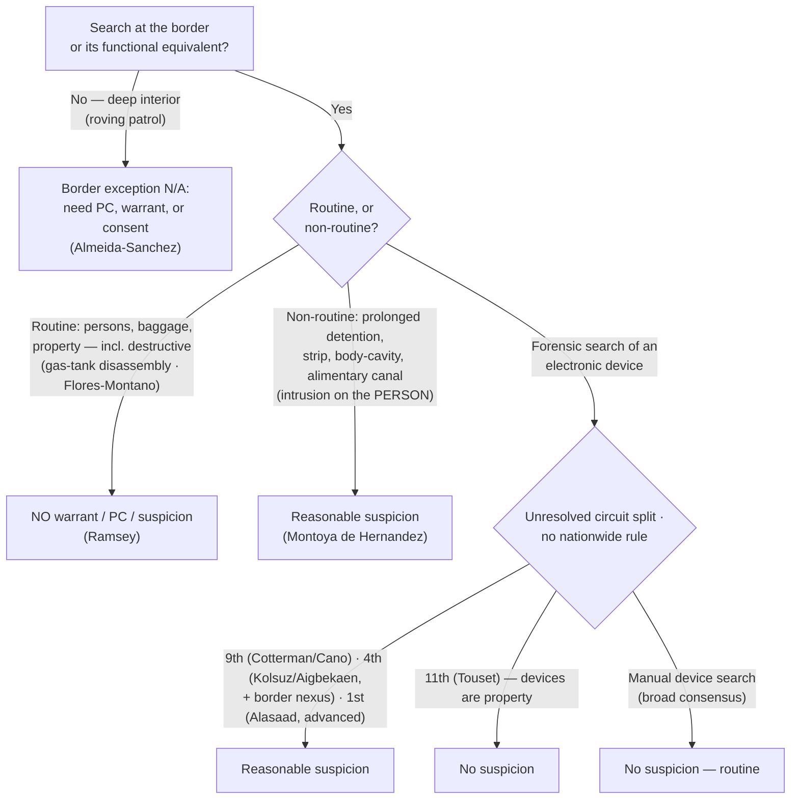

---
aliases:
  - "Border Searches"
title: "Border Searches"
topic: Border Searches
type: doctrine
amendment: "U.S. Const. amend. IV"
jurisdiction: "Federal (U.S. Const. amend. IV); SCOTUS baseline"
status: verified
related: ["[[Special Needs and Administrative Searches]]", "[[Search Incident to Arrest]]", "[[The Warrant Requirement]]", "[[Two Definitions of Search]]", "[[Plain View Doctrine]]"]
---

# Border Searches

## The Brief

**Field-decisive question:** *Is this a border search — and if so, is it **routine** (no suspicion needed) or **non-routine / highly intrusive** (reasonable suspicion needed)?*

**Ask the threshold question first.** Whether the government action is a "search" at all is still the opening move (cross-reference [[Two Definitions of Search]]); once it is a search, the border-search exception governs the *reasonableness* question. At the international border and its functional equivalent, the sovereign's interest in protecting itself is at its zenith, so the Fourth Amendment's ordinary expectations are relaxed — this is a categorical exception to [[The Warrant Requirement]], like [[Search Incident to Arrest]].

**The black-letter rule — the routine / non-routine split (stated up front).** Border searches are "reasonable simply by virtue of the fact that they occur at the border." *[[United States v. Ramsey#^pin-616|Ramsey]]*, 431 U.S. 606, 616 (1977). That reasonableness comes in **two tiers**:

1. **Routine** searches of persons, baggage, and property require **no warrant, no probable cause, and no individualized suspicion.** *[[United States v. Ramsey|Ramsey]]* extended this even to opening incoming international mail (the statutory "reasonable cause to suspect" standard being "a less stringent requirement than that of 'probable cause,'" *[[United States v. Ramsey#^pin-612|id.]]* at 612–13). *[[United States v. Flores-Montano|Flores-Montano]]* confirms the reach over vehicles: "We hold that the search in question did not require reasonable suspicion," and "[t]he Government's interest in preventing the entry of unwanted persons and effects is at its zenith at the international border" — so **even removing, disassembling, and reassembling a gas tank is routine.** *[[United States v. Flores-Montano#^pin-150|Flores-Montano]]*, 541 U.S. 149, 150, 152–53, 155 (2004).
2. **Non-routine, highly intrusive** intrusions — **prolonged detention, strip, body-cavity, and alimentary-canal searches** — require **reasonable suspicion.** *[[United States v. Montoya de Hernandez#^pin-541|Montoya de Hernandez]]* sets that floor: "the detention of a traveler at the border, beyond the scope of a routine customs search and inspection, is justified at its inception if customs agents, considering all the facts surrounding the traveler and her trip, reasonably suspect that the traveler is smuggling contraband in her alimentary canal." 473 U.S. 531, 541 (1985). The detention may last "as long as is reasonably necessary" to verify or dispel the suspicion. *[[United States v. Montoya de Hernandez#^pin-544|Id.]]* at 544.

**What bumps a search into the non-routine tier is intrusion on the *person* — not property damage.** The dignity-and-bodily-integrity line, not the value of what is broken, drives the reasonable-suspicion requirement. *[[United States v. Flores-Montano|Flores-Montano]]* is explicit: "Complex balancing tests to determine what is a 'routine' search of a vehicle, as opposed to a more 'intrusive' search of a person, have no place in border searches of vehicles." *[[United States v. Flores-Montano#^pin-152a|Id.]]* at 152. Disassembling the gas tank stayed routine; the Court reserved only that "some searches of property [may be] so destructive as to require a different result," but this was not one.

**The exception is geographic, not portable — the extended-border, roving-patrol, and checkpoint lines.** The power applies at the actual border **and its functional equivalents** (an established checkpoint at a confluence of border roads, or an airport receiving a nonstop foreign flight), *[[Almeida-Sanchez v. United States#^pin-272|Almeida-Sanchez]]*, 413 U.S. 266, 272 (1973), but it does **not** float free into the deep interior. A roving-patrol *search* well inland, without probable cause or consent, violates the Fourth Amendment: the search of a car "at all points at least 20 miles north of the Mexican border … [i]n the absence of probable cause or consent … violated the petitioner's Fourth Amendment right." *[[Almeida-Sanchez v. United States#^pin-273|Id.]]* at 273.

**Do not conflate the checkpoint *seizure* power with the border *search* power.** Fixed interior immigration checkpoints and roving-patrol stops near the border are **seizure / special-needs** doctrines (see [[Special Needs and Administrative Searches]]), not the border-search power:

- A roving-patrol **stop** to question occupants needs **reasonable suspicion** — "specific articulable facts, together with rational inferences," and **apparent ancestry alone is not enough.** *[[United States v. Brignoni-Ponce#^pin-884|Brignoni-Ponce]]*, 422 U.S. 873, 884, 886–87 (1975). (The holding is good law; the opinion's treatment of apparent Mexican ancestry as a relevant factor is widely criticized and given little practical weight.)
- A brief **stop** at a **fixed, permanent** interior checkpoint is **suspicionless** — "stops for brief questioning routinely conducted at permanent checkpoints are consistent with the Fourth Amendment," "in the absence of any individualized suspicion." *[[United States v. Martinez-Fuerte#^pin-566|Martinez-Fuerte]]*, 428 U.S. 543, 562, 566 (1976).
- The outer limit of that checkpoint power is *[[City of Indianapolis v. Edmond|Edmond]]*: a fixed checkpoint whose **primary purpose is ordinary crime control** (drug interdiction) is unconstitutional — interior crime-control stops cannot be bootstrapped onto the suspicionless border/checkpoint rationale.

**The digital-device frontier — an unresolved circuit split (annotate; circuits named).** The live question is what standard governs a search of an electronic device at the border, and the circuits **fracture** — a scope boundary that is an *assertion*, so state it precisely and name the circuits (never a nationwide device rule). A broad cross-circuit **consensus** holds a brief, *manual* device search remains **routine** (no individualized suspicion). The split is over *forensic* (Cellebrite-type) searches: the **Ninth Circuit** (*[[United States v. Cotterman|Cotterman]]* / *[[United States v. Cano|Cano]]*) and the **Fourth Circuit** (*Kolsuz* / *Aigbekaen*) require **reasonable suspicion** (the Fourth Circuit adding a "border nexus" limit); the **Eleventh Circuit** (*[[United States v. Touset|Touset]]*) requires **no suspicion at all**, treating devices as property; the **First Circuit** (*Alasaad*) requires reasonable suspicion for advanced searches but, splitting from the Ninth, does **not** confine them to digital contraband. **SCOTUS has not resolved this split — there is no nationwide device rule.** The full circuit/state spread is catalogued under **Recent developments** below. (The related digital **over-retention / computer-search-particularity** overlay — *United States v. Ganias* (2d Cir.); *United States v. Burgess* (10th Cir.) — is treated on [[Plain View Doctrine]].)

**Burden · standard of review · remedy.** The **government** bears the burden of justifying a warrantless border search; the defendant bears the threshold burden of showing a search/seizure and standing. *Routine* searches (luggage, ordinary personal effects, vehicles) require **no individualized suspicion**; *non-routine, highly intrusive* intrusions require **reasonable suspicion**. *[[United States v. Montoya de Hernandez#^pin-541|Montoya de Hernandez]]*, 473 U.S. at 541. On appeal, the existence of reasonable suspicion is reviewed **[[Common Legal Terms#de-novo|de novo]]** and the underlying historical facts for **[[Common Legal Terms#clear-error|clear error]]**. *[[Ornelas v. United States#^pin-699|Ornelas v. United States]]*, 517 U.S. 690, 699 (1996). The **remedy** for an unjustified border search is suppression of the evidence and its fruits ([[The Exclusionary Rule]]).

**Pitfalls to flag for the field.** (1) **Assuming the exception reaches the deep interior** — a suspicionless roving-patrol *search* miles inland is not a "border search" (*[[Almeida-Sanchez v. United States|Almeida-Sanchez]]*); interior searches need probable cause, a warrant, or consent. (2) **Stating a nationwide device rule** — there is none; "forensic device searches always need reasonable suspicion" overstates the Ninth/Fourth Circuits, and "they never do" overstates the Eleventh — **label the circuit and flag the split.** (3) **Conflating immigration checkpoints with the search power** — *[[United States v. Martinez-Fuerte|Martinez-Fuerte]]* upholds suspicionless checkpoint *stops*; it is not authority to *search* without suspicion away from the border. (4) **Treating destructive property searches as "non-routine"** — per *[[United States v. Flores-Montano|Flores-Montano]]*, dignity-intrusion on the **person**, not property damage, drives the reasonable-suspicion tier.

## Key cases

| Case (Bluebook) | Holding in one line | Weight | Treatment | CourtListener |
|---|---|---|---|---|
| *[[United States v. Ramsey]]*, 431 U.S. 606 (1977) | **The anchor:** routine border searches (here, incoming international mail) need no warrant or probable cause; rests on the sovereign's inherent self-protective authority — reasonable "simply by virtue of the fact that they occur at the border." | Binding — SCOTUS | good *(2026-06-30)* | [opinion](https://www.courtlistener.com/opinion/109675/united-states-v-ramsey/) |
| *[[United States v. Montoya de Hernandez]]*, 473 U.S. 531 (1985) | **Sets the non-routine floor:** prolonged detention of a suspected alimentary-canal smuggler is reasonable on **reasonable suspicion** the traveler is smuggling internally, for as long as needed to verify or dispel it. | Binding — SCOTUS | good *(2026-06-30)* | [opinion](https://www.courtlistener.com/opinion/111509/united-states-v-montoya-de-hernandez/) |
| *[[United States v. Flores-Montano]]*, 541 U.S. 149 (2004) | Suspicionless authority over vehicles at the border includes **removing, disassembling, and reassembling a gas tank**; this property search is routine — "no reasonable suspicion" required. Intrusiveness balancing is for the *person*, not vehicles. | Binding — SCOTUS | good *(2026-06-30)* | [opinion](https://www.courtlistener.com/opinion/134729/united-states-v-flores-montano/) |
| *[[United States v. Martinez-Fuerte]]*, 428 U.S. 543 (1976) | Brief stops at **fixed/permanent** interior immigration checkpoints are constitutional **without individualized suspicion** (a checkpoint *seizure* power, distinct from the border *search* power). | Binding — SCOTUS | good *(2026-06-30)* | [opinion](https://www.courtlistener.com/opinion/109541/united-states-v-martinez-fuerte/) |
| *[[Almeida-Sanchez v. United States]]*, 413 U.S. 266 (1973) | **The geographic limit:** a **roving-patrol** vehicle search ~20 miles inside the border, without PC or consent, violates the Fourth Amendment — the exception does not reach the deep interior; introduces "functional equivalent of the border." | Binding — SCOTUS | good *(2026-06-30)* | [opinion](https://www.courtlistener.com/opinion/108845/almeida-sanchez-v-united-states/) |
| *[[United States v. Brignoni-Ponce]]*, 422 U.S. 873 (1975) | A **roving patrol** may stop a vehicle near the border to question occupants only on **reasonable suspicion**; apparent Mexican ancestry **alone** is not enough. | Binding — SCOTUS | good *(2026-06-30)* — holding controlling; ancestry-factor dictum widely criticized | [opinion](https://www.courtlistener.com/opinion/109311/united-states-v-brignoni-ponce/) |

## Related cases across doctrines

These cases are treated in full on their own case pages, but they bear directly on border searches and are framed for that doctrine here.

| Case (Bluebook) | Relevance to border searches (framed here) | Primary home (doctrine) | Treatment | CourtListener |
|---|---|---|---|---|
| *[[Riley v. California]]*, 573 U.S. 373 (2014) | **The analytic engine of the device split:** *Riley*'s holding that a cell phone's vast digital contents are categorically different — "get a warrant" — is what every circuit reasons from when deciding whether a forensic device search at the border is "routine" (no suspicion) or "non-routine" (reasonable suspicion). | [[Search Incident to Arrest]] | good *(2026-06-30)* | [opinion](https://www.courtlistener.com/opinion/2680439/riley-v-cal-united-states/) |
| *[[City of Indianapolis v. Edmond]]*, 531 U.S. 32 (2000) | **Marks the outer limit of the checkpoint power** that borders this doctrine: a fixed checkpoint whose primary purpose is ordinary crime control (drug interdiction) is unconstitutional — contrast *[[United States v. Martinez-Fuerte|Martinez-Fuerte]]* immigration checkpoints; interior crime-control stops cannot ride the suspicionless border/checkpoint rationale. | [[Special Needs and Administrative Searches]] | good *(2026-06-30)* | [opinion](https://www.courtlistener.com/opinion/118391/city-of-indianapolis-v-edmond/) |

## Recent developments

Role-based, circuit/state only (no SCOTUS). The live frontier since *[[Riley v. California|Riley]]* (2014) is the standard for searching electronic devices at the border. A broad cross-circuit **consensus** holds a brief, *manual* device search remains **routine** and needs no individualized suspicion; the circuits **split** over whether a *forensic* (Cellebrite-type) search demands reasonable suspicion — and, if so, its scope. **SCOTUS has not resolved the device split; there is no nationwide device rule.** Each decision below binds only in its own circuit (persuasive outside it). ⚖ **Circuit split.**

**Reasonable-suspicion camp — a forensic device search is non-routine.**

- ***[[United States v. Cotterman|United States v. Cotterman]]* (9th Cir. 2013) (en banc)** — *illustrates a circuit split.* Forensic examination of a device seized at the border requires reasonable suspicion; "[i]t is the comprehensive and intrusive nature of a forensic examination—not the location of the examination—that is the key factor triggering the requirement of reasonable suspicion here." *[[United States v. Cotterman#^pin-op17|Cotterman]]*, 709 F.3d 952 (slip op., at 17). **Binding in-circuit — 9th Cir.** · good.
- ***[[United States v. Cano|United States v. Cano]]* (9th Cir. 2019)** — *illustrates a circuit split (clarifying Cotterman).* Manual phone searches need no suspicion; forensic searches require reasonable suspicion — and "reasonable suspicion … means that officials must reasonably suspect that the cell phone contains digital contraband," with all border phone searches "limited in scope to a search for digital contraband." *[[United States v. Cano#^pin-op5|Cano]]*, 934 F.3d 1002 (slip op., at 5). **Binding in-circuit — 9th Cir.** · good.
- **United States v. Kolsuz (4th Cir. 2018)** — *first-impression / illustrates a circuit split.* First post-*Riley* federal appellate decision to hold a forensic (off-site, month-long Cellebrite-type) device search at the border is non-routine and requires individualized suspicion: "After *Riley*, we think it is clear that a forensic search of a digital phone must be treated as a nonroutine border search, requiring some form of individualized suspicion," 890 F.3d 133, 146. **Binding in-circuit — 4th Cir.** · good. *(No standalone case page — named in prose with circuit.)*
- **United States v. Aigbekaen (4th Cir. 2019)** — *narrowing / adds a border-nexus limit.* Where a border search is intrusive enough to require individualized suspicion, the suspected offense must bear a **nexus** to the border-search exception's purposes (national security, duties, contraband, excluding persons) — not a purely domestic investigation: "where a search at the border is so intrusive as to require some level of individualized suspicion, the object of that suspicion must bear some nexus to the purposes of the border search exception in order for the exception to apply," 943 F.3d 713, 721. Suspicion of purely domestic crimes lacked that nexus (though good-faith saved the evidence). **Binding in-circuit — 4th Cir.** · good. *(No standalone case page — named in prose with circuit.)*

**No-suspicion camp — devices are property.**

- ***[[United States v. Touset|United States v. Touset]]* (11th Cir. 2018)** — *recent development / illustrates a circuit split.* **No suspicion — not even reasonable suspicion — is required** for a forensic device search: "the Fourth Amendment does not require any suspicion for forensic searches of electronic devices at the border." *[[United States v. Touset#^pin-IIIa|Touset]]*, 890 F.3d 1227 (Part III.A). Devices are property, and reasonable suspicion is reserved for intrusive searches of the **body**; declines to follow *[[United States v. Cotterman|Cotterman]]*. **Binding in-circuit — 11th Cir.** · good.

**Contra-scope position — advanced searches need reasonable suspicion, but not confined to contraband.**

- **Alasaad v. Mayorkas (1st Cir. 2021)** — *illustrates a circuit split (expands scope).* Civil challenge to CBP/ICE device-search policies: neither manual ("basic") nor forensic ("advanced") searches require a warrant or probable cause, and advanced searches need only reasonable suspicion — but, expressly splitting from the Ninth Circuit, the searches need **not** be limited to digital contraband: "the border search exception is not limited to searches for contraband itself rather than evidence of contraband or a border-related crime," 988 F.3d 8, 21–22. **Binding in-circuit — 1st Cir.** · good. *(The CourtListener caption reads* Alasaad v. Wolf *— a benign official-substitution artifact, Wolf → Mayorkas.) (No standalone case page — named in prose with circuit.)*

**Manual-search consensus (reserving the forensic question).**

- **United States v. Mendez (7th Cir. 2024)** — *joins the consensus.* Border device searches require neither a warrant nor probable cause, and a routine, manual cell-phone search needs no individualized suspicion; reserves whether intrusive forensic searches require reasonable suspicion. **Binding in-circuit — 7th Cir.** · good. *(No standalone case page — named in prose with circuit.)*
- **United States v. Castillo (5th Cir. 2023)** — *joins the consensus.* No individualized suspicion is required for a routine manual cell-phone search at the border; the court noted the circuits are divided over the forensic standard but did not decide it. **Binding in-circuit — 5th Cir.** · good. *(No standalone case page — named in prose with circuit.)*
- **United States v. Xiang (8th Cir. 2023)** — *reserves the question.* Affirmed denial of suppression of a forensic border search of digital devices but **expressly declined** to decide whether reasonable suspicion is even required for an advanced/forensic search; it assumed-without-deciding the standard and held reasonable suspicion was satisfied on economic-espionage facts. **Binding in-circuit — 8th Cir.** · good. *(No standalone case page — named in prose with circuit.)*

## Visual

## Sources

- *United States v. Ramsey*, 431 U.S. 606 (1977) — https://www.courtlistener.com/opinion/109675/united-states-v-ramsey/ — pinpoints: 612–13, 616.
- *Almeida-Sanchez v. United States*, 413 U.S. 266 (1973) — https://www.courtlistener.com/opinion/108845/almeida-sanchez-v-united-states/ — pinpoints: 272, 273.
- *United States v. Brignoni-Ponce*, 422 U.S. 873 (1975) — https://www.courtlistener.com/opinion/109311/united-states-v-brignoni-ponce/ — pinpoints: 884, 886–87.
- *United States v. Martinez-Fuerte*, 428 U.S. 543 (1976) — https://www.courtlistener.com/opinion/109541/united-states-v-martinez-fuerte/ — pinpoints: 562, 563, 566.
- *United States v. Montoya de Hernandez*, 473 U.S. 531 (1985) — https://www.courtlistener.com/opinion/111509/united-states-v-montoya-de-hernandez/ — pinpoints: 541, 544.
- *Ornelas v. United States*, 517 U.S. 690 (1996) — https://www.courtlistener.com/opinion/118030/ornelas-v-united-states/ — pinpoint: 699 *(standard of review; home = [[Probable Cause and Reasonable Suspicion]])*.
- *City of Indianapolis v. Edmond*, 531 U.S. 32 (2000) — https://www.courtlistener.com/opinion/118391/city-of-indianapolis-v-edmond/ *(crime-control checkpoint limit; home = [[Special Needs and Administrative Searches]])*.
- *United States v. Flores-Montano*, 541 U.S. 149 (2004) — https://www.courtlistener.com/opinion/134729/united-states-v-flores-montano/ — pinpoints: 150, 152–53, 155.
- *Riley v. California*, 573 U.S. 373 (2014) — https://www.courtlistener.com/opinion/2680439/riley-v-cal-united-states/ *(digital ≠ physical; home = [[Search Incident to Arrest]])*.
- *United States v. Cotterman*, 709 F.3d 952 (9th Cir. 2013) (en banc) *(Binding in-circuit — 9th Cir.)* — https://www.courtlistener.com/opinion/854692/united-states-v-howard-cotterman/ — pinpoint: slip op., at 17.
- *United States v. Cano*, 934 F.3d 1002 (9th Cir. 2019) *(Binding in-circuit — 9th Cir.)* — https://www.courtlistener.com/opinion/4649091/united-states-v-miguel-cano/ — pinpoints: slip op., at 5, 29.
- *United States v. Touset*, 890 F.3d 1227 (11th Cir. 2018) *(Binding in-circuit — 11th Cir.)* — https://www.courtlistener.com/opinion/4500452/united-states-v-karl-touset/ — pinpoint: Part III.A.
- *United States v. Kolsuz*, 890 F.3d 133 (4th Cir. 2018) *(Binding in-circuit — 4th Cir.; no standalone case page)* — https://www.courtlistener.com/opinion/4496513/united-states-v-hamza-kolsuz/ — pinpoint: 146.
- *United States v. Aigbekaen*, 943 F.3d 713 (4th Cir. 2019) *(Binding in-circuit — 4th Cir.; no standalone case page)* — https://www.courtlistener.com/opinion/4680725/united-states-v-raymond-aigbekaen/ — pinpoint: 721.
- *Alasaad v. Mayorkas*, 988 F.3d 8 (1st Cir. 2021) *(Binding in-circuit — 1st Cir.; no standalone case page; CL caption* Alasaad v. Wolf*)* — https://www.courtlistener.com/opinion/4855246/alasaad-v-wolf/ — pinpoint: 21–22.
- *United States v. Castillo*, (5th Cir. 2023) *(Binding in-circuit — 5th Cir.; no standalone case page)* — https://www.courtlistener.com/opinion/9407477/united-states-v-castillo/
- *United States v. Xiang*, (8th Cir. 2023) *(Binding in-circuit — 8th Cir.; no standalone case page)* — https://www.courtlistener.com/opinion/9397097/united-states-v-haitao-xiang/
- *United States v. Mendez*, (7th Cir. 2024) *(Binding in-circuit — 7th Cir.; no standalone case page)* — https://www.courtlistener.com/opinion/9524074/united-states-v-marcos-mendez/
