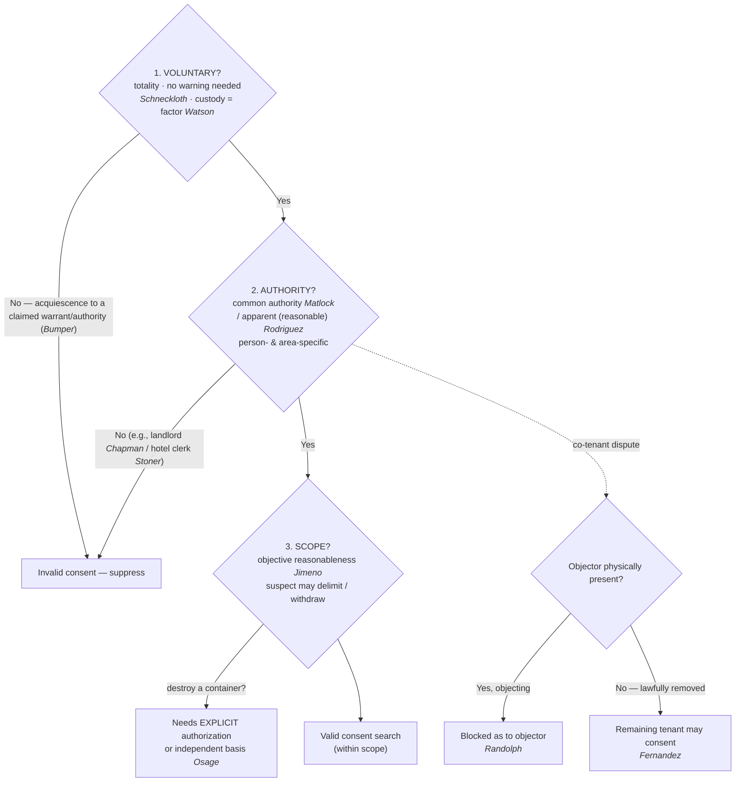

---
aliases:
  - "Consent Searches"
title: "Consent Searches"
topic: Consent Searches
type: doctrine
jurisdiction: Federal (U.S. Const. amend. IV); SCOTUS baseline
status: verified
related: ["[[Abandonment]]", "[[CREW]]", "[[Fourth Amendment Analysis Checklist]]", "[[Knock and Talk]]", "[[Traffic Stops]]", "[[Seizure of the Person]]", "[[Terry Stops and Reasonable Suspicion]]"]
---

## The Brief

**Field-decisive question:** *Do I have valid consent — from someone who can give it, and how far does it reach?* Consent is the "C" of CREW — a **recognized, warrant-free justification** for a search that needs **no warrant and no probable cause**. But a consent search is valid only when **three prongs all line up**, and the burden of proving each is the government's.

**The black-letter rule · burden · standard of review · remedy.** On all three prongs the **government bears the burden** of proving valid consent by a **preponderance of the evidence**; that burden "cannot be discharged by showing no more than acquiescence to a claim of lawful authority," *[[Bumper v. North Carolina#^pin-548|Bumper v. North Carolina]]*, 391 U.S. 543, 548–549 (1968), and is judged on the **[[Common Legal Terms#totality-of-the-circumstances|totality of the circumstances]]**, *[[United States v. Matlock|United States v. Matlock]]*, 415 U.S. 164, 177 & n.14 (1974). Voluntariness (and the historical facts underlying every prong) is a **question of fact** — reviewed for [[Common Legal Terms#clear-error|clear error]], with the ultimate reasonableness reviewed [[Common Legal Terms#de-novo|de novo]] — and the **remedy** for a search that exceeds valid consent is **suppression** of the evidence and its fruits under [[The Exclusionary Rule]]. The three prongs, stated up front:

- **1. Voluntariness** — the consent must be a **free and voluntary** choice under the **totality of the circumstances**. There is **no** Miranda-style requirement that the person be warned of, or know, the right to refuse (*[[Schneckloth v. Bustamonte|Schneckloth v. Bustamonte]]*), though knowledge of that right is a **factor**. Voluntariness has a **floor**: mere **acquiescence to a claim of lawful authority** — e.g., an officer's assertion that he already has a warrant — is **not** consent (*[[Bumper v. North Carolina|Bumper v. North Carolina]]*).
- **2. Authority** — the consenter must have **actual common authority** over the place or effects — mutual use / joint access, *not* title (*[[United States v. Matlock|United States v. Matlock]]*) — **or apparent authority** a reasonable officer would credit (*[[Illinois v. Rodriguez|Illinois v. Rodriguez]]*). A **physically present, objecting** co-tenant's refusal **defeats** another occupant's consent (*[[Georgia v. Randolph|Georgia v. Randolph]]*), but **only while he is present** (*[[Fernandez v. California|Fernandez v. California]]* confines *Randolph* to a present-and-objecting occupant).
- **3. Scope** — the search may go no further than what a **reasonable person would understand the exchange to authorize** (*[[Florida v. Jimeno|Florida v. Jimeno]]*), and the suspect may **delimit** — or **withdraw** — that consent. Critically, general consent to search a car does **not** authorize an officer to **destroy** it or its contents without explicit authorization (*[[United States v. Osage|United States v. Osage]]*).

**Prong 1 — voluntariness is the whole ballgame, and no warning is required.** Whether consent was "voluntary" or "the product of duress or coercion, express or implied, is a question of fact to be determined from the totality of all the circumstances." *[[Schneckloth v. Bustamonte#^pin-227|Schneckloth v. Bustamonte]]*, 412 U.S. 218, 227 (1973). Knowledge of the right to refuse is merely a factor: "[w]hile knowledge of the right to refuse consent is one factor to be taken into account, the government need not establish such knowledge as the *sine qua non* of an effective consent." *[[Schneckloth v. Bustamonte#^pin-227a|Id.]]* Unlike *Miranda*, there is **no consent-search warning** — and no "free to refuse / free to go" advisory either. The Court "rejected in specific terms the suggestion that police officers must always inform citizens of their right to refuse when seeking permission to conduct a warrantless consent search." *[[United States v. Drayton#^pin-206|United States v. Drayton]]*, 536 U.S. 194, 206 (2002). Same for a stopped motorist: it would be "unrealistic to require police officers to always inform detainees that they are free to go before a consent to search may be deemed voluntary." *[[Ohio v. Robinette#^pin-39|Ohio v. Robinette]]*, 519 U.S. 33, 39–40 (1996). (*Robinette* arises in the stop context — see [[Traffic Stops]]; for the consent↔seizure boundary and when an encounter is consensual vs. a seizure, see [[Seizure of the Person]] and [[Terry Stops and Reasonable Suspicion]].)

**But there is a floor — acquiescence to claimed authority is not consent.** When the government relies on consent, "he has the burden of proving that the consent was, in fact, freely and voluntarily given. This burden cannot be discharged by showing no more than acquiescence to a claim of lawful authority." *[[Bumper v. North Carolina#^pin-548|Bumper v. North Carolina]]*, 391 U.S. at 548–549. An officer who claims a warrant "announces in effect that the occupant has no right to resist the search. The situation is instinct with coercion — albeit colorably lawful coercion. Where there is coercion there cannot be consent." *[[Bumper v. North Carolina#^pin-550|Id.]]* at 550. So prong one is a spectrum: no warning is required (*Schneckloth* / *Drayton* / *Robinette*), but a false or bare assertion of authority converts "yes" into mere submission (*Bumper*).

**Custody is a factor, not a veto.** Detained — even handcuffed — people **can** consent. In *[[United States v. Watson|Watson]]*, "[h]e had been arrested and was in custody, but his consent was given while on a public street, not in the confines of the police station. Moreover, the fact of custody alone has never been enough in itself to demonstrate a coerced confession or consent to search." *[[United States v. Watson#^pin-424|United States v. Watson]]*, 423 U.S. 411, 424 (1976); ignorance of the right to refuse "may be a factor in the overall judgment," but "is not to be given controlling significance." *[[United States v. Watson#^pin-424a|Id.]]* **Caveat on setting:** *Watson*'s consent arose on a public street; consent obtained from a person held **at the station** is a question *Schneckloth* expressly **reserved** (412 U.S. at 240–41 & n.29). The more custodial and coercive the setting, the heavier the government's burden on the totality.

**Prong 2 — authority means actual common authority, or a reasonable belief in it.** Common authority "rests . . . on mutual use of the property by persons generally having joint access or control for most purposes, so that it is reasonable to recognize that any of the co-inhabitants has the right to permit the inspection in his own right and that the others have assumed the risk that one of their number might permit the common area to be searched." *[[United States v. Matlock#^pin-171a|United States v. Matlock]]*, 415 U.S. at 171 n.7. It is **mutual use, not property title** — which is why "[t]he consent of one who possesses common authority over premises or effects is valid as against the absent, nonconsenting person with whom that authority is shared." *[[United States v. Matlock#^pin-170|Id.]]* at 170. (The assumption-of-risk logic links to [[Abandonment]] and predates *Matlock*: in *[[Frazier v. Cupp|Frazier v. Cupp]]* a joint user of a duffel bag was taken to have assumed the risk his co-user would let police look inside.)

**Authority is person- and area-specific.** Because authority flows from what the consenter actually shares, a driver's general consent to search "the car" does **not** automatically reach a **passenger's personal bag** the driver has no common authority over. Frame it as objective reasonableness plus common authority, not a bright line: would a reasonable officer understand the consent — and the consenter's authority — to extend to that item?

**Apparent authority must be objectively reasonable.** *[[Illinois v. Rodriguez|Rodriguez]]* validates a warrantless entry on the consent of a third party the police reasonably believe has common authority, even if in fact he does not — judged "against an objective standard: would the facts available to the officer at the moment . . . 'warrant a man of reasonable caution in the belief'" that the consenting party had authority over the premises? *[[Illinois v. Rodriguez#^pin-188|Illinois v. Rodriguez]]*, 497 U.S. 177, 188 (1990). If a reasonable officer would **doubt** the authority, "warrantless entry without further inquiry is unlawful" — ambiguity triggers a **duty to inquire further** before relying on the consent. *[[Illinois v. Rodriguez#^pin-188a|Id.]]* at 188–189.

**Third-party limits — the classic "cannot consent" cases.** Apparent authority does not rescue a consent from someone the officer has **no basis** to think is authorized. A **landlord cannot** consent to a search of premises currently leased to a tenant — to hold otherwise "would reduce the [Fourth] Amendment to a nullity and leave [tenants'] homes secure only in the discretion of [landlords]." *[[Chapman v. United States (1961)#^pin-617|Chapman v. United States]]*, 365 U.S. 610, 616–617 (1961). Likewise a **hotel desk clerk cannot** consent to a search of a current guest's room; "the rights protected by the Fourth Amendment are not to be eroded by strained applications of the law of agency or by unrealistic doctrines of 'apparent authority,'" and here the police had no basis to believe the clerk was the guest's authorized agent. *[[Stoner v. California#^pin-488|Stoner v. California]]*, 376 U.S. 483, 488–490 (1964). *Chapman* and *Stoner* survive *Rodriguez*: apparent authority still requires facts that would warrant a reasonable officer's belief — a landlord's or clerk's mere say-so is not enough.

**Co-occupants — present objector wins; removed objector loses the veto.** When co-tenants disagree, "a warrantless search of a shared dwelling for evidence over the express refusal of consent by a physically present resident cannot be justified as reasonable as to him on the basis of consent given to the police by another resident." *[[Georgia v. Randolph#^pin-120|Georgia v. Randolph]]*, 547 U.S. 103, 120 (2006). But that rule operates **only while the objector is physically present**: "an occupant who is absent due to a lawful detention or arrest stands in the same shoes as an occupant who is absent for any other reason," so once the objector is lawfully gone the remaining occupant may validly consent. *[[Fernandez v. California#^pin-303|Fernandez v. California]]*, 571 U.S. 292, 303 (2014). A **lawful** arrest is fine; a **staged** removal engineered to manufacture a "yes" is not — the test asks whether the removal was objectively reasonable, not the officers' subjective motive.

**Prong 3 — scope is objective, and the suspect controls it.** "The standard for measuring the scope of a suspect's consent under the Fourth Amendment is that of 'objective' reasonableness — what would the typical reasonable person have understood by the exchange between the officer and the suspect?" *[[Florida v. Jimeno#^pin-251|Florida v. Jimeno]]*, 500 U.S. 248, 251 (1991). "The scope of a search is generally defined by its expressed object," so a general consent to search a car **for drugs** reasonably reaches closed containers inside that might hold drugs. *[[Florida v. Jimeno#^pin-251a|Id.]]* But the consenter sets the limits: "[a] suspect may of course delimit as he chooses the scope of the search to which he consents." *Id.* at 252.

**Scope has a hard outer edge: general consent does not authorize destruction.** *Jimeno*'s objective-reasonableness rule cuts both ways. The Court drew the line by illustration — a general consent to search a car reaches a closed paper bag inside that might hold the drugs, but a reasonable person would **not** understand that same consent to authorize breaking open a locked briefcase within. Building on that distinction, *[[United States v. Osage|United States v. Osage]]* drew the bright line for containers an officer would ruin: general consent reaches containers that might hold contraband, "[h]owever, we do not read that authority to permit the destruction of such containers." *[[United States v. Osage#^pin-521|United States v. Osage]]*, 235 F.3d 518, 521 (10th Cir. 2000). The rule: "before an officer may actually destroy or render completely useless a container which would otherwise be within the scope of a permissive search, the officer must obtain explicit authorization, or have some other, lawful, basis upon which to proceed." *[[United States v. Osage#^pin-522|Id.]]* at 522. Cutting open a sealed can was "more like breaking open a locked briefcase than opening the folds of a paper bag" and exceeded the consent. **The field lesson (the "knife-through-the-seat" / slashing-upholstery move):** a general "sure, search the car" lets you *look inside* containers that could hold the object, but **slashing a seat, prying open a welded compartment, or destroying a sealed container needs explicit authorization or an independent basis** (probable cause / a warrant).

**Scope, exhaustively — duration, manner, and digital devices.** Beyond containers, scope also bounds **how long** and **how far** a consent search may run. A voluntary consent to search a vehicle can support a prolonged search and a canine sniff so long as a reasonable person would understand it to reach that far and the suspect does not unambiguously withdraw or narrow it (see *United States v. Carlton Williams* under **Recent developments**). And scope is **object- and place-specific in the digital age**: an on-the-spot consent to "preview" a phone or laptop does not necessarily authorize a later off-site, comprehensive **forensic** examination — that is a different search in kind and degree, and needs its own justification (see *United States v. Lewis* (6th Cir.) under **Recent developments**).

**The right to limit — and to withdraw — consent.** The right to **limit** scope at the outset is settled SCOTUS law (*[[Florida v. Jimeno|Jimeno]]*'s "delimit as he chooses," 500 U.S. at 252). Federal circuits broadly recognize the corollary that consent, **once given, may be withdrawn or revoked** before the search concludes, at which point the officer must **stop** absent an independent justification (probable cause, a warrant, or evidence already lawfully developed, e.g. plain view). Two operational rules travel with it: (1) the withdrawal (or mid-search narrowing) must be **unequivocal** — an ambiguous grumble, a nervous question, or hesitation is generally **not** an effective revocation, measured by the same *Jimeno* reasonable-person standard; and (2) withdrawal is **prospective** — it does not retroactively taint what officers already lawfully found. **Flag:** this **withdrawal corollary is circuit-developed and Persuasive-tier — it is not a SCOTUS holding** — present it as a recognized principle anchored in *Jimeno*'s scope-control language, not as settled Supreme Court doctrine.

**Consent to *enter and transact* is not consent to *search*.** A person who invites an undercover officer in to do business assumes the risk of that misplaced trust — an invited undercover entry to buy contraband is **no Fourth Amendment search at all** (*[[Lewis v. United States (1966)|Lewis v. United States]]*), and an undercover over-the-counter **purchase** of publicly displayed wares is **neither a search nor a seizure** (*[[Maryland v. Macon|Maryland v. Macon]]*). But the invitation is itself bounded: it "does not mean that . . . an agent is authorized to conduct a general search for incriminating materials." *[[Lewis v. United States (1966)#^pin-211b|Lewis v. United States]]*, 385 U.S. 206, 211 (1966). The agent may do only what the occupant invited — the same scope logic as *Jimeno*, applied to an invitation rather than an express "search my car."

**Pitfalls to flag for the field.** (1) **Thinking you must Mirandize or warn before asking to search** — *[[Schneckloth v. Bustamonte|Schneckloth]]*: no warning required, but voluntariness is still scrutinized on the totality. (2) **Believing you must say "free to leave / free to refuse" first** — *[[United States v. Drayton|Drayton]]* / *[[Ohio v. Robinette|Robinette]]*: no such advisory is required. (3) **Claiming a warrant (or asserting a right to search) to pressure a "yes"** — *[[Bumper v. North Carolina|Bumper]]*: acquiescence to claimed authority is invalid. (4) **Assuming handcuffs or arrest automatically void consent** — *[[United States v. Watson|Watson]]*: custody is a factor, not per se coercion. (5) **Treating any closed container as off-limits under a general consent** — *[[Florida v. Jimeno|Jimeno]]*: a general car-for-drugs consent reaches containers that might hold drugs, unless the suspect limited it. (6) **Destroying to search under a general consent** — *[[United States v. Osage|Osage]]*: slashing/breaking a container or the vehicle needs **explicit** authorization or independent justification. (7) **Letting a driver consent away a passenger's effects** — authority is person-/area-specific (*[[United States v. Matlock|Matlock]]* common authority). (8) **Relying on "apparent authority" when a reasonable officer would doubt it** — *[[Illinois v. Rodriguez|Rodriguez]]* requires the belief to be objectively reasonable and imposes a duty to inquire; a landlord (*[[Chapman v. United States (1961)|Chapman]]*) or hotel clerk (*[[Stoner v. California|Stoner]]*) still cannot consent for a tenant/guest. (9) **Searching over a present co-tenant's objection — or manufacturing his removal** — *[[Georgia v. Randolph|Randolph]]*: the present objector's "no" controls; *[[Fernandez v. California|Fernandez]]*: removal must be objectively reasonable, not staged. (10) **Pressing on after the suspect pulls consent** — once consent is unequivocally withdrawn, stop unless you have an independent basis.

## Key cases

| Case | Holding in one line | Authority weight | Treatment | CourtListener |
|---|---|---|---|---|
| *[[Schneckloth v. Bustamonte]]*, 412 U.S. 218 (1973) | **Voluntariness anchor:** consent voluntariness is a **totality-of-the-circumstances** question of fact; the government need **not** prove the person knew of the right to refuse (no Miranda-style warning). | Binding — SCOTUS | good *(2026-06-30)* | [link](https://www.courtlistener.com/opinion/108800/schneckloth-v-bustamonte/) |
| *[[Bumper v. North Carolina]]*, 391 U.S. 543 (1968) | **Voluntariness floor:** consent that is mere **acquiescence to a claim of lawful authority** (officer asserts a warrant) is **invalid** — the government cannot carry its burden by showing submission to claimed authority. | Binding — SCOTUS | good *(2026-06-30)* | [link](https://www.courtlistener.com/opinion/107716/bumper-v-north-carolina/) |
| *[[United States v. Watson]]*, 423 U.S. 411 (1976) | **Custody alone** never demonstrates coerced consent; being under arrest is one **factor** in the voluntariness totality, not per se coercion. | Binding — SCOTUS | good *(2026-06-30)* | [link](https://www.courtlistener.com/opinion/109352/united-states-v-watson/) |
| *[[United States v. Drayton]]*, 536 U.S. 194 (2002) | **No-warning rule:** officers need **not** advise of the right to refuse a search for consent to be voluntary; the totality controls. | Binding — SCOTUS | good *(2026-06-30)* | [link](https://www.courtlistener.com/opinion/121153/united-states-v-drayton/) |
| *[[Ohio v. Robinette]]*, 519 U.S. 33 (1996) | **No "free to go" advisory:** a lawfully stopped motorist need not be told he is free to leave before his consent to search is voluntary. | Binding — SCOTUS | good *(2026-06-30)* | [link](https://www.courtlistener.com/opinion/118066/ohio-v-robinette/) |
| *[[United States v. Matlock]]*, 415 U.S. 164 (1974) | **Common-authority anchor:** mutual use / joint access (not property title) lets a co-occupant consent against an **absent** co-occupant who assumed the risk. | Binding — SCOTUS | good *(2026-06-30)* | [link](https://www.courtlistener.com/opinion/108967/united-states-v-matlock/) |
| *[[Illinois v. Rodriguez]]*, 497 U.S. 177 (1990) | **Apparent authority:** a reasonable, even if mistaken, belief that the consenter had common authority validates the entry — judged by an objective standard; ambiguity triggers a duty to inquire. | Binding — SCOTUS | good *(2026-06-30)* | [link](https://www.courtlistener.com/opinion/112475/illinois-v-rodriguez/) |
| *[[Chapman v. United States (1961)]]*, 365 U.S. 610 (1961) | **Third-party limit:** a **landlord** cannot consent to a search of premises currently leased to and occupied by a tenant. | Binding — SCOTUS | good *(2026-06-30)* | [link](https://www.courtlistener.com/opinion/106197/chapman-v-united-states/) |
| *[[Stoner v. California]]*, 376 U.S. 483 (1964) | **Third-party limit:** a **hotel clerk** cannot consent to a search of a current guest's room; "apparent authority" cannot be conjured from agency law absent a basis to believe the consenter was authorized. | Binding — SCOTUS | good *(2026-06-30)* | [link](https://www.courtlistener.com/opinion/106777/stoner-v-california/) |
| *[[Georgia v. Randolph]]*, 547 U.S. 103 (2006) | A **physically present, expressly objecting** co-occupant's refusal prevails over another tenant's consent — invalid as to the objector. | Binding — SCOTUS | good *(2026-06-30)* | [link](https://www.courtlistener.com/opinion/145669/georgia-v-randolph/) |
| *[[Fernandez v. California]]*, 571 U.S. 292 (2014) | *Randolph* applies only while the objector is **present**; once **objectively-reasonably removed** (e.g., arrested), the remaining occupant may validly consent. | Binding — SCOTUS | good *(2026-06-30)* | [link](https://www.courtlistener.com/opinion/2654534/fernandez-v-california/) |
| *[[Florida v. Jimeno]]*, 500 U.S. 248 (1991) | **Scope anchor:** consent scope = **objective reasonableness** measured by the expressed object; general car-for-drugs consent reaches containers that could hold drugs; the suspect may **delimit** it. | Binding — SCOTUS | good *(2026-06-30)* | [link](https://www.courtlistener.com/opinion/112595/florida-v-jimeno/) |
| *[[United States v. Osage]]*, 235 F.3d 518 (10th Cir. 2000) | **Scope limit — no destruction:** general consent does **not** authorize destroying a container; before rendering one useless the officer must get **explicit authorization** or have another lawful basis. Cabins *Jimeno*. | Binding in-circuit — 10th Cir.; Persuasive (outside circuit) | good *(2026-06-30)* | [link](https://www.courtlistener.com/opinion/160502/united-states-v-osage/) |

## Related cases across doctrines

These cases are treated in full on other doctrine pages, but they bear directly on consent searches and are framed for that doctrine here.

| Case | Relevance to consent searches | Primary treatment | CourtListener |
|---|---|---|---|
| *[[Frazier v. Cupp]]*, 394 U.S. 731 (1969) | A joint user of an effect may consent against the absent co-user: the defendant who let his cousin use and store the duffel bag "assumed the risk" the cousin would let police look inside — the **assumption-of-risk root** of common-authority consent that predates *Matlock*. | [[Due-Process Voluntariness of Confessions]] | [opinion](https://www.courtlistener.com/opinion/107913/frazier-v-cupp/) |
| *[[United States v. Conner]]*, 127 F.3d 663 (8th Cir. 1997) | **Voluntariness floor / *Bumper* applied:** where police under color of authority demand that occupants open a motel-room door and an occupant opens it in submission rather than as a free choice, that is mere acquiescence to claimed authority, not valid consent. | [[Securing the Scene]] | [opinion](https://www.courtlistener.com/opinion/747208/united-states-v-larry-duane-conner-united-states-of-america-v-john/) |
| *[[Florida v. Bostick]]*, 501 U.S. 429 (1991) | **Consent-encounter boundary:** bus-sweep consent can be voluntary even where the passenger is not free to leave; voluntariness turns on whether a reasonable person would feel free to decline the officers' requests and terminate the encounter — the totality test that requires no "free to refuse" advisory (cf. *Drayton*). | [[Knock and Talk]] | [opinion](https://www.courtlistener.com/opinion/112631/florida-v-bostick/) |
| *[[Lewis v. United States (1966)]]*, 385 U.S. 206 (1966) | **Consent-to-transact ≠ consent-to-search:** an occupant who invites an undercover agent in to buy contraband suffers no Fourth Amendment search, but the invitation does not license a "general search for incriminating materials" — the agent's authority is bounded by what was invited (the *Jimeno* scope logic applied to an invitation). | [[Two Definitions of Search]] | [opinion](https://www.courtlistener.com/opinion/107312/lewis-v-united-states/) |
| *[[Maryland v. Macon]]*, 472 U.S. 463 (1985) | Undercover **purchase** of publicly displayed wares is **neither a search nor a seizure** — no reasonable expectation of privacy in goods exposed for public sale, and the seller voluntarily transfers possession; the public-marketplace edge of the consent/invited-entry line. | [[Two Definitions of Search]] | [opinion](https://www.courtlistener.com/opinion/111477/maryland-v-macon/) |

## Recent developments

Role-based, circuit/state only (**no SCOTUS** — a Supreme Court holding belongs in Key cases regardless of date). The federal courts of appeals have applied the SCOTUS consent framework — especially *[[Florida v. Jimeno|Jimeno]]*'s objective-scope rule — to new settings including digital devices and prolonged vehicle searches. The decisions below are **Binding in-circuit** within their own circuit and **Persuasive (outside circuit)** elsewhere; none states nationwide law, and no SCOTUS consent-search case is currently pending. Newest first:

- **United States v. Lewis (6th Cir. 2023)** — *applies / refines *Jimeno* objective-scope to digital devices.* A suspect's in-home consent to an officer's on-the-spot "preview" search of his laptop and phone did **not** extend to the later off-site seizure and comprehensive forensic (lab) examination of those devices — the forensic exam exceeded the scope of consent and needed an independent Fourth Amendment justification (and the court rejected a plain-view rationale for opening the seized "containers"). **Binding in-circuit — 6th Cir.**; **Persuasive (outside circuit)** · good. *(No standalone case page — named in prose with circuit. This 6th Cir. consent-scope case is distinct from [[Lewis v. United States (1966)]], the SCOTUS undercover-entry case in the Related table above.)* [opinion](https://www.courtlistener.com/opinion/9424185/united-states-v-edward-leonidas-lewis/)
- **United States v. Carlton Williams (3d Cir. 2018)** — *applies the *Jimeno* reasonable-person standard to scope duration / withdrawal.* Williams's voluntary consent to search his car authorized the ~71-minute search and a canine sniff; his statements did **not** unambiguously withdraw or limit consent, so the denial of suppression was affirmed (along with a career-offender sentencing enhancement). **Binding in-circuit — 3d Cir.**; **Persuasive (outside circuit)** · good. *(No standalone case page — named in prose with circuit.)* [opinion](https://www.courtlistener.com/opinion/4522771/united-states-v-carlton-williams/)

## Visual

## Sources

- *Schneckloth v. Bustamonte*, 412 U.S. 218 (1973) — https://www.courtlistener.com/opinion/108800/schneckloth-v-bustamonte/ — pinpoint: 227.
- *Bumper v. North Carolina*, 391 U.S. 543 (1968) — https://www.courtlistener.com/opinion/107716/bumper-v-north-carolina/ — pinpoints: 548–549, 550.
- *United States v. Watson*, 423 U.S. 411 (1976) — https://www.courtlistener.com/opinion/109352/united-states-v-watson/ — pinpoint: 424.
- *United States v. Drayton*, 536 U.S. 194 (2002) — https://www.courtlistener.com/opinion/121153/united-states-v-drayton/ — pinpoints: 202, 206.
- *Ohio v. Robinette*, 519 U.S. 33 (1996) — https://www.courtlistener.com/opinion/118066/ohio-v-robinette/ — pinpoints: 39–40, 40.
- *United States v. Matlock*, 415 U.S. 164 (1974) — https://www.courtlistener.com/opinion/108967/united-states-v-matlock/ — pinpoints: 170, 171, 171 n.7, 177 & n.14.
- *Illinois v. Rodriguez*, 497 U.S. 177 (1990) — https://www.courtlistener.com/opinion/112475/illinois-v-rodriguez/ — pinpoints: 188, 188–189.
- *Chapman v. United States*, 365 U.S. 610 (1961) — https://www.courtlistener.com/opinion/106197/chapman-v-united-states/ — pinpoints: 616–617, 618.
- *Stoner v. California*, 376 U.S. 483 (1964) — https://www.courtlistener.com/opinion/106777/stoner-v-california/ — pinpoints: 488, 489, 490.
- *Georgia v. Randolph*, 547 U.S. 103 (2006) — https://www.courtlistener.com/opinion/145669/georgia-v-randolph/ — pinpoint: 120.
- *Fernandez v. California*, 571 U.S. 292 (2014) — https://www.courtlistener.com/opinion/2654534/fernandez-v-california/ — pinpoint: 303.
- *Florida v. Jimeno*, 500 U.S. 248 (1991) — https://www.courtlistener.com/opinion/112595/florida-v-jimeno/ — pinpoints: 251, 252.
- *United States v. Osage*, 235 F.3d 518 (10th Cir. 2000) — https://www.courtlistener.com/opinion/160502/united-states-v-osage/ — pinpoints: 520, 521, 522.
- *Frazier v. Cupp*, 394 U.S. 731 (1969) — https://www.courtlistener.com/opinion/107913/frazier-v-cupp/ — pinpoint: 740.
- *United States v. Conner*, 127 F.3d 663 (8th Cir. 1997) — https://www.courtlistener.com/opinion/747208/united-states-v-larry-duane-conner-united-states-of-america-v-john/ — pinpoint: 666.
- *Florida v. Bostick*, 501 U.S. 429 (1991) — https://www.courtlistener.com/opinion/112631/florida-v-bostick/ — pinpoints: 436, 439.
- *Lewis v. United States*, 385 U.S. 206 (1966) — https://www.courtlistener.com/opinion/107312/lewis-v-united-states/ — pinpoints: 210, 211.
- *Maryland v. Macon*, 472 U.S. 463 (1985) — https://www.courtlistener.com/opinion/111477/maryland-v-macon/ — pinpoint: 469.
- *United States v. Lewis*, 6th Cir. 2023 *(no standalone case page; named with circuit)* — https://www.courtlistener.com/opinion/9424185/united-states-v-edward-leonidas-lewis/.
- *United States v. Carlton Williams*, 3d Cir. 2018 *(no standalone case page; named with circuit)* — https://www.courtlistener.com/opinion/4522771/united-states-v-carlton-williams/.
