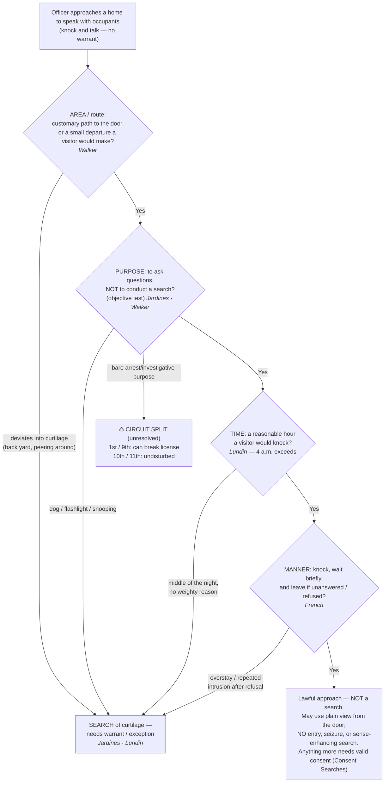

---
aliases:
  - "Knock and Talk"
title: "Knock and Talk"
topic: Knock and Talk
type: doctrine
jurisdiction: Federal (U.S. Const. amend. IV); SCOTUS baseline
status: verified
related: ["[[Consent Searches]]", "[[Curtilage]]", "[[Plain View Doctrine]]", "[[Arrest in the Home]]", "[[Emergency Aid]]", "[[Exigent Circumstances and Hot Pursuit]]", "[[Seizure of the Person]]", "[[Two Definitions of Search]]"]
---

## The Brief

**Field-decisive question:** *Am I within the implied license a private visitor would have — in area, purpose, time, and manner?* A "knock and talk" is **not** a standalone warrant exception. It is lawful only so far as an officer stays inside the same **implied license** that society extends to **any** visitor who walks up to a home to speak with the occupants. Step outside that license in any of four dimensions — **area · purpose · time · manner** — and the very same approach becomes a Fourth Amendment **search** of the home's [[Curtilage]], which needs a warrant or another exception.

**The black-letter rule.** The knock-and-talk rests on the "implicit license" recognized in *[[Florida v. Jardines|Jardines]]*: an officer, like any private citizen, may "approach the home by the front path, knock promptly, wait briefly to be received, and then (absent invitation to linger longer) leave" — a license "generally managed without incident by the Nation's Girl Scouts and trick-or-treaters." *[[Florida v. Jardines|Jardines]]*, 569 U.S. 1, 8 (2013). The test is **objective**: the exception "ceases where an officer's behavior 'objectively reveals a purpose to conduct a search,'" and it is "geographically limited to the front door or a 'minor departure' from it." *[[United States v. Walker#^pin-1363|United States v. Walker]]*, 799 F.3d 1361, 1363 (11th Cir. 2015) (quoting *Jardines*). Because a physical intrusion onto curtilage to gather evidence is itself a search, exceeding the license in area, purpose, time, or manner turns a lawful approach into an unlawful one. *[[Florida v. Jardines#^pin-6|Jardines]]*, 569 U.S. at 6.

**It authorizes an approach, not a search.** The knock-and-talk obtains nothing by itself. Any entry or search still needs valid **consent** ([[Consent Searches]]) or an independent exception; treat the doctrine as a lawful *approach*, never a lawful *search*.

**Burden · standard of review · remedy.** Because the fruit of a knock-and-talk is almost always consent, when the government relies on consent obtained at the door it bears the burden of proving the consent was **freely and voluntarily** given on the [[Common Legal Terms#totality-of-the-circumstances|totality of the circumstances]] — a burden not met by showing mere acquiescence to a claim of lawful authority. *[[Bumper v. North Carolina|Bumper v. North Carolina]]*, 391 U.S. 543, 548–49 (1968); *[[Schneckloth v. Bustamonte|Schneckloth v. Bustamonte]]*, 412 U.S. 218 (1973) (most courts apply a preponderance standard). If instead the defendant contends the approach itself exceeded the implied license, the government must show the officers stayed within it. On appeal, historical facts are reviewed for **[[Common Legal Terms#clear-error|clear error]]** and the ultimate reasonableness/scope question **[[Common Legal Terms#de-novo|de novo]]**; the **remedy** for exceeding the license (or for an involuntary consent) is suppression of the evidence and its fruits under [[The Exclusionary Rule]].

**Area / route — the customary path, plus a "small departure."** The license follows the route a visitor would use: the front walk, the driveway, and the porch that lead to the customary point of entry. A **"small departure" from the front door** — stepping to a side or back door a normal visitor would try after getting no answer, or approaching the occupant where he plainly is — stays within the geographic limit. *[[United States v. Walker#^pin-1364|Walker]]*, 799 F.3d at 1364 (approaching the occupant's car in an open-sided carport, "instead of going to his front door, did not exceed the geographic limit on the knock and talk exception"; "[a] 'small departure from the front door . . . when seeking to contact the occupants' is permissible"). But **deviating to explore the curtilage** — cutting into the back yard, peering around the side, treating the approach as a chance to snoop — exceeds it. *[[Florida v. Jardines#^pin-9|Jardines]]*, 569 U.S. at 9; *[[United States v. Lundin|Lundin]]*, 817 F.3d 1151 (9th Cir. 2016). Where there is no usable front door, or visitors customarily use a side door, the license follows that route. **Front-vs-other-door line-drawing is circuit-developed and fact-specific** — a marker to apply, not a national bright line (see Recent developments).

**Purpose — the "talk," not a search.** The customary license "is generally limited to the 'purpose of asking questions of the occupants,'" and officers "who knock on the door of a home for other purposes generally exceed the scope of the customary license." *[[United States v. Lundin#^pin-1159a|Lundin]]*, 817 F.3d at 1159. The test is **objective** — whether "behavior objectively reveals a purpose to conduct a search." *[[United States v. Walker#^pin-1363|Walker]]*, 799 F.3d at 1363 (quoting *Jardines*). Deploying a **drug dog** on the porch, **peering with a flashlight**, or otherwise snooping crosses the line: "introducing a trained police dog to explore the area around the home in hopes of discovering incriminating evidence . . . There is no customary invitation to do that." *[[Florida v. Jardines#^pin-9|Jardines]]*, 569 U.S. at 9. By contrast, a **subjective** intent to arrest does not, standing alone, void an otherwise-ordinary knock: reasonableness is judged objectively, and lawful knocking is conduct "any private citizen may do." *[[Kentucky v. King#^pin-op8|Kentucky v. King]]*, 563 U.S. 452 (2011) (slip op., at 8). **⚖ Circuit split (annotated, not resolved).** Whether a **bare investigative or arrest purpose** — no dog, no snooping — is itself enough to break the license divides the circuits: the **First** (*[[French v. Merrill|French]]*) and **Ninth** (*[[United States v. Lundin|Lundin]]*) say it **can** (especially paired with an intrusive manner or an unreasonable hour), while the **Tenth** (*[[United States v. Carloss|Carloss]]*) and **Eleventh** (*[[United States v. Walker|Walker]]*) treat ordinary knock-and-talks as **undisturbed** by *Jardines*. The circuits are **named** and the split is left **open** — no Supreme Court holding since *Jardines* resolves it (developed in Recent developments).

**Time / reasonableness — normal waking hours.** The implied license runs to the hours a visitor would ordinarily knock: "unexpected visitors are customarily expected to knock on the front door of a home only during normal waking hours." *[[United States v. Lundin#^pin-1159|Lundin]]*, 817 F.3d at 1159. A **4 a.m.** knock-and-talk — with no evidence the resident accepted visitors at that hour and no reason "sufficiently weighty to justify the disturbance" — **exceeded** the license. *Id.* The hour is weighed with the rest of the circumstances, not by the clock alone: the Eleventh Circuit upheld a **5 a.m.** approach where two earlier visits and lights inside made it reasonable, and an early-morning knock-and-talk "is not considered a search." *[[United States v. Walker#^pin-1364a|Walker]]*, 799 F.3d at 1364.

**Manner — knock, wait briefly, and (absent invitation) leave.** The hard line to leave is part of the license itself. Overstaying, or **repeated** intrusion after a refusal, exceeds it. In *[[French v. Merrill|French]]* officers returned to the curtilage again and again and, on a final pre-dawn visit, knocked on the bedroom window, peered through a drawn covering, and shined a flashlight inside — "intrusive conduct that no reasonable visitor could have understood as impliedly authorized by a resident." *[[French v. Merrill#^pin-op39a|French]]*, 15 F.4th 116 (1st Cir. 2021) (slip op., at 39). The license "is limited not only to a particular area but also to a specific purpose, both of which are defined by what a homeowner might reasonably expect from a private citizen on the homeowner's curtilage." *[[French v. Merrill#^pin-op39|Id.]]*

**"No Trespassing" signs — generally do not revoke the license.** On the Tenth Circuit's view, posted "No Trespassing" signs — even one on the front door — do **not**, by themselves, tell an objective officer he may not approach and knock; whether signage revokes the license "has to be measured, not by what the resident subjectively intended, but instead by what an objective officer would have perceived," and such signs lack any "talismanic" revoking power. *[[United States v. Carloss#^pin-op10|Carloss]]*, 818 F.3d 988 (10th Cir. 2016) (slip op., at 10–11). This is **circuit-developed** and sits on the permissive side of the split (then-Judge Gorsuch [[Common Legal Terms#dissenting-opinion|dissented]] the other way) — **Persuasive (outside circuit)**, not a national rule.

**Plain-view limits — see, but do not enter, seize, or enhance.** From the **lawful front-door vantage**, officers may use what they observe in **plain view** ([[Plain View Doctrine]]) — but the approach authorizes **no** entry into the [[Curtilage]], **no** seizure, and **no** sense-enhancing/instrument search. The curtilage's home-level protection does not yield merely because officers are lawfully near it, and an officer may not use a warrant **exception** to justify the separate trespass of stepping onto protected ground. *[[Collins v. Virginia#^pin-op14|Collins v. Virginia]]*, 584 U.S. 586 (2018) (slip op., at 14) (the automobile exception "does not permit an officer without a warrant to enter a home or its curtilage" to reach a vehicle).

**Staying consensual (the encounter itself).** Whether the exchange remains a mere knock-and-talk — rather than a seizure — turns on the *[[Florida v. Bostick|Bostick]]*/*[[United States v. Drayton|Drayton]]* test: whether "a reasonable person would feel free to decline the officers' requests or otherwise terminate the encounter." *[[Florida v. Bostick#^pin-436|Bostick]]*, 501 U.S. 429, 436 (1991). Officers need **not** advise the resident of the right to refuse. *[[United States v. Drayton#^pin-206|Drayton]]*, 536 U.S. 194, 206 (2002). A knock-and-talk that turns coercive — a show of authority demanding that occupants open the door — becomes a **seizure**, and any "consent" it produces is invalid. *[[United States v. Conner|United States v. Conner]]*, 127 F.3d 663 (8th Cir. 1997).

**The hard backstop, and no caretaking bootstrap.** Two limits sit at the threshold. First, the license **ends at the door**: officers may approach and knock, but a warrantless, nonconsensual crossing of the threshold to arrest inside the home is presumptively unreasonable. *[[Payton v. New York|Payton v. New York]]*, 445 U.S. 573 (1980); see [[Arrest in the Home]]. Second, there is **no** freestanding community-caretaking power to enter the home — officers who knock cannot bootstrap a warrantless entry on caretaking grounds; they need consent or a recognized exception. *[[Caniglia v. Strom|Caniglia v. Strom]]*, 593 U.S. 194 (2021); see [[Emergency Aid]].

**You may knock; you may not manufacture exigency.** Lawful knock-and-announce does not "create" an exigency, even when it prompts occupants to begin destroying evidence — that lawful knock *is* the knock-and-talk approach. *[[Kentucky v. King#^pin-op8|King]]*, 563 U.S. 452 (slip op., at 8). What forfeits the exception is creating the emergency through an actual or threatened **Fourth Amendment violation** (e.g., announcing an imminent unlawful entry to provoke destruction). Circuit courts apply the same rule in the knock-and-talk setting — pressing a hesitant occupant with tough questions does not manufacture the exigency. *United States v. Meyer* (8th Cir. 2021). *(No standalone case page — named with circuit.)* The manufactured-exigency limit is developed on [[Exigent Circumstances and Hot Pursuit]].

**Do not confuse it with knock-and-announce.** The knock-and-talk (a consensual **approach**, no warrant) is a different creature from the **knock-and-announce** rule that governs how officers **execute a warrant** — where the question is how long to wait before forcing entry. *[[United States v. Banks|United States v. Banks]]*, 540 U.S. 31 (2003) (15–20-second wait reasonable in a felony drug case); see [[The Warrant Requirement]]. Do not import one doctrine's rules into the other.

**Articulation — the field checklist.** The officer must be able to articulate that the approach stayed within **area · purpose · time · manner**: the customary route (or a small departure), a purpose to ask questions rather than to search, a reasonable hour, and a brief, non-intrusive knock followed by leaving if unanswered or refused. That articulable checklist is the field-decisive question the doctrine leads with.

**Pitfalls to flag for the field.** (1) **Treating "knock and talk" as its own warrant exception** — it is not; without consent or another exception, nothing inside the home is fair game. (2) **Straying off the customary route** — cutting to a back yard, lingering in the curtilage, or bringing a dog or flashlight onto the porch breaks the license (*[[Florida v. Jardines|Jardines]]*; [[Curtilage]]). (3) **Knocking in the dead of night** — a middle-of-the-night approach without a weighty, resident-acceptable reason exceeds the license (*[[United States v. Lundin|Lundin]]*). (4) **Overstaying a refusal** — once a resident declines or says leave, continued or repeated intrusion converts the approach into a search (*[[French v. Merrill|French]]*). (5) **Using the knock to manufacture exigency** — threatening a Fourth Amendment violation taints any "emergency" that follows (*[[Kentucky v. King|King]]*). (6) **Assuming signage or bare purpose settles it** — "No Trespassing" signs generally do not revoke the license (*[[United States v. Carloss|Carloss]]*), but whether an arrest/investigative purpose alone breaks it is a **live circuit split**; do not state a back-door or bare-purpose rule as settled national law.

## Key cases

| Case | Holding in one line | Weight | Treatment | CourtListener |
|---|---|---|---|---|
| *[[Florida v. Jardines]]*, 569 U.S. 1 (2013) | **Anchors the implied-license limit:** bringing a drug dog onto the front porch to investigate exceeded the license to approach and knock — a trespassory search of curtilage; the license is bounded by **area *and* purpose**, judged objectively. | Binding — SCOTUS | good *(2026-06-30)* | [link](https://www.courtlistener.com/opinion/856347/florida-v-jardines/) |
| *[[Kentucky v. King]]*, 563 U.S. 452 (2011) | A lawful knock-and-announce — conduct any private citizen may do — does **not** manufacture an exigency; reasonableness is objective, so an officer's subjective intent does not, standing alone, void an otherwise-ordinary knock. *(Primary home [[Exigent Circumstances and Hot Pursuit]].)* | Binding — SCOTUS | good *(2026-06-30)* | [link](https://www.courtlistener.com/opinion/216733/kentucky-v-king/) |

## Related cases across doctrines

These cases are treated in full on other doctrine pages but bear on the knock-and-talk, framed here for it.

| Case | Relevance to knock and talk (framed here) | Primary treatment | CourtListener |
|---|---|---|---|
| *[[Florida v. Bostick]]*, 501 U.S. 429 (1991) | The **stays-consensual** test: an encounter is a seizure only if a reasonable person would not feel free to decline the officers' requests or terminate the encounter — the standard that separates a knock-and-talk from a seizure. | [[Seizure of the Person]] | [opinion](https://www.courtlistener.com/opinion/112631/florida-v-bostick/) |
| *[[United States v. Drayton]]*, 536 U.S. 194 (2002) | Applies *Bostick*: consent to a request at the door can be voluntary even though officers never advised the person of the right to refuse — no per-se warning requirement. | [[Seizure of the Person]] · [[Consent Searches]] | [opinion](https://www.courtlistener.com/opinion/121153/united-states-v-drayton/) |
| *[[Collins v. Virginia]]*, 584 U.S. 586 (2018) | The **curtilage backstop:** officers may walk the customary front path, but may not stray into curtilage — or use a warrant exception to justify that trespass — to search a vehicle parked there. | [[Automobile Exception]] · [[Curtilage]] | [opinion](https://www.courtlistener.com/opinion/4501697/collins-v-virginia/) |

## Recent developments

Role-based, circuit/state only (**no SCOTUS** — a Supreme Court holding belongs in Key cases regardless of date). Since *[[Florida v. Jardines|Jardines]]* and *[[Kentucky v. King|King]]*, the circuits have done most of the work of mapping the implied license, and they **divide** on how far a bare investigative or arrest purpose can shrink it. ⚖ **Circuit split — annotated, not resolved:** no Supreme Court holding since *Jardines* settles whether an arrest/investigative purpose alone (no dog, no snooping) breaks the license. Each case below is **Binding in-circuit** within its own circuit and **Persuasive (outside circuit)** elsewhere; none states nationwide law.

**Permissive pole — ordinary knock-and-talks undisturbed by *Jardines*.**

- ***[[United States v. Carloss|Carloss]]* (10th Cir. 2016)** — *illustrates the split (permissive side); "No Trespassing" signage does not revoke the license.* Multiple "No Trespassing" signs, including one on the front door, did **not** revoke the implied license to approach and knock for a consensual conversation; whether signage revokes the license turns on "what an objective officer would have perceived," not the resident's subjective intent, and a sign alone lacks any "talismanic" revoking power. *Carloss*, 818 F.3d 988 (slip op., at 10–11). Then-Judge **Gorsuch dissented**, arguing the signs (and the officers' purpose) withdrew the license — illustrating the internal divide. **Binding in-circuit — 10th Cir.** · good. [opinion](https://www.courtlistener.com/opinion/3184928/united-states-v-carloss/)
- ***[[United States v. Walker|Walker]]* (11th Cir. 2015)** — *applies the geographic scope + permissive side.* A **"small departure"** from the front door — approaching the occupant's car in an open-sided carport when seeking to contact him — stayed within the license, and a **5 a.m.** knock-and-talk was reasonable on the facts (two earlier visits, lights on); an early-morning knock-and-talk "is not considered a search," so it needs no exigency. *Walker*, 799 F.3d at 1364. An investigatory purpose in the sense of finding someone to talk to does not objectively reveal a purpose to conduct a search. **Binding in-circuit — 11th Cir.** · good. [opinion](https://www.courtlistener.com/opinion/2844024/united-states-v-wayne-walker/)

**Narrowing pole — purpose / manner / hour can take the approach outside the license.**

- ***[[United States v. Lundin|Lundin]]* (9th Cir. 2016)** — *narrows the license (time + purpose).* A **4 a.m.** knock, with no evidence the resident accepted visitors at that hour and undertaken with the **intent to arrest** rather than to ask questions, exceeded the license; after *Jardines*, the exception "does not apply when officers encroach upon the curtilage of a home with the intent to arrest the occupant," *Lundin*, 817 F.3d at 1160, making the officer's subjective purpose relevant — the approach that divides the circuits. Because the officers' own unlawful knock caused the noises they then used to justify a search, *[[Kentucky v. King|King]]* barred reliance on that self-created exigency. **Binding in-circuit — 9th Cir.** · good. [opinion](https://www.courtlistener.com/opinion/3187682/united-states-v-eric-lundin/)
- ***[[French v. Merrill|French]]* (1st Cir. 2021)** — *narrows the license (repeated / intrusive manner).* Repeated entries onto the curtilage culminating in a pre-dawn visit — knocking on the bedroom window, peering through a drawn covering, shining a flashlight inside — exceeded the area-and-purpose-limited license and violated clearly established law (officers denied qualified immunity); the license is "limited not only to a particular area but also to a specific purpose." *French*, 15 F.4th 116 (slip op., at 39). **Binding in-circuit — 1st Cir.** · good. [opinion](https://www.courtlistener.com/opinion/5273192/french-v-merrill/)

## Visual

## Sources

- *Florida v. Jardines*, 569 U.S. 1 (2013) — https://www.courtlistener.com/opinion/856347/florida-v-jardines/ — pinpoints: 6, 8, 9.
- *Kentucky v. King*, 563 U.S. 452 (2011) — https://www.courtlistener.com/opinion/216733/kentucky-v-king/ — pinpoint: slip op. at 8.
- *United States v. Carloss*, 818 F.3d 988 (10th Cir. 2016) — https://www.courtlistener.com/opinion/3184928/united-states-v-carloss/ — pinpoints: slip op. at 10–11 (Gorsuch, J., dissenting).
- *United States v. Lundin*, 817 F.3d 1151 (9th Cir. 2016) — https://www.courtlistener.com/opinion/3187682/united-states-v-eric-lundin/ — pinpoints: 1159, 1160.
- *United States v. Walker*, 799 F.3d 1361 (11th Cir. 2015) — https://www.courtlistener.com/opinion/2844024/united-states-v-wayne-walker/ — pinpoints: 1363, 1364.
- *French v. Merrill*, 15 F.4th 116 (1st Cir. 2021) — https://www.courtlistener.com/opinion/5273192/french-v-merrill/ — pinpoint: slip op. at 39.
- *Florida v. Bostick*, 501 U.S. 429 (1991) — https://www.courtlistener.com/opinion/112631/florida-v-bostick/ — pinpoint: 436.
- *United States v. Drayton*, 536 U.S. 194 (2002) — https://www.courtlistener.com/opinion/121153/united-states-v-drayton/ — pinpoint: 206.
- *Collins v. Virginia*, 584 U.S. 586 (2018) — https://www.courtlistener.com/opinion/4501697/collins-v-virginia/ — pinpoint: slip op. at 14.
- *Payton v. New York*, 445 U.S. 573 (1980) — https://www.courtlistener.com/opinion/110235/payton-v-new-york/
- *Caniglia v. Strom*, 593 U.S. 194 (2021) — https://www.courtlistener.com/opinion/4883694/caniglia-v-strom/
- *United States v. Conner*, 127 F.3d 663 (8th Cir. 1997) — https://www.courtlistener.com/opinion/747208/united-states-v-larry-duane-conner-united-states-of-america-v-john/
- *Bumper v. North Carolina*, 391 U.S. 543 (1968) — https://www.courtlistener.com/opinion/107716/bumper-v-north-carolina/ — pinpoint: 548–49.
- *Schneckloth v. Bustamonte*, 412 U.S. 218 (1973) — https://www.courtlistener.com/opinion/108800/schneckloth-v-bustamonte/
- *United States v. Banks*, 540 U.S. 31 (2003) — https://www.courtlistener.com/opinion/131146/united-states-v-banks/
- *United States v. Meyer*, 8th Cir. 2021 *(no standalone case page; named with circuit)* — https://www.courtlistener.com/opinion/5302394/united-states-v-william-meyer/
