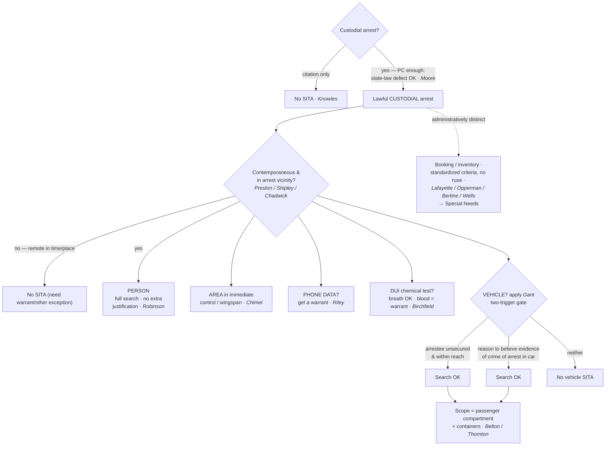

---
aliases:
  - "Search Incident to Arrest"
  - "SITA"
title: "Search Incident to Arrest"
topic: Search Incident to Arrest
type: doctrine
jurisdiction: Federal (U.S. Const. amend. IV); SCOTUS baseline
status: verified
related: ["[[Traffic Stops]]", "[[Automobile Exception]]", "[[Seizure of the Person]]", "[[Special Needs and Administrative Searches]]", "[[Arrest in the Home]]"]
---

# Search Incident to Arrest

## The Brief

**Field-decisive question:** *I've made a lawful custodial arrest — what may I search, and how far?*

On a lawful **custodial** arrest, an officer may search — **without a warrant and without any separate probable cause** — (1) the **arrestee's person**, a *full* search that needs no case-by-case justification (*[[United States v. Robinson|Robinson]]*, 414 U.S. 218, 235 (1973)), and (2) the **area within the arrestee's immediate control**, the "grabbing area" or wingspan from which he might seize a weapon or destroy evidence (*[[Chimel v. California|Chimel]]*, 395 U.S. 752, 763 (1969)). The two engines that both justify and *cabin* the doctrine are **officer safety** and **evidence preservation** — every limit below traces back to them. Because SITA is an **exception** to the warrant requirement, the **government bears the burden** of bringing the search within it; on review, historic facts are taken as found and the ultimate reasonableness is a legal question reviewed [[Common Legal Terms#de-novo|de novo]]; the **remedy** for exceeding SITA is suppression under [[The Exclusionary Rule]] (subject to good-faith / inevitable-discovery).

**The predicate is a *custodial* arrest.** A citation in lieu of custody does **not** trigger SITA — there is no "search incident to citation" (*[[Knowles v. Iowa|Knowles]]*, 525 U.S. 113 (1998)). But the arrest need not be perfect in every respect: an arrest that breaks a *state* arrest statute yet rests on **probable cause** still satisfies the Fourth Amendment, and the SITA is valid (*[[Virginia v. Moore|Moore]]*, 553 U.S. 164 (2008)) — **state law does not define Fourth Amendment reasonableness**. The offense supplying PC need not be the one the officer named (*[[Devenpeck v. Alford|Devenpeck]]*), and a reasonable, good-faith arrest of the **wrong person** still supports the incident search (*[[Hill v. California|Hill]]*). Even a fine-only misdemeanor arrest, if custodial and PC-backed, carries the search-incident authority (*[[Atwater v. City of Lago Vista|Atwater]]*).

**The person is searched in full — no extra showing (*Robinson*).** "It is the fact of the lawful arrest which establishes the authority to search, and we hold that in the case of a lawful custodial arrest a full search of the person is not only an exception to the warrant requirement of the Fourth Amendment, but is also a 'reasonable' search under that Amendment." *[[United States v. Robinson#^pin-235|Robinson, 414 U.S. at 235]]*. Unlike a *[[Terry v. Ohio|Terry]]* frisk (see [[Terry Stops and Reasonable Suspicion]]), the search of the person on a custodial arrest needs **no** case-by-case suspicion that weapons or evidence are present — the arrest alone is enough. *Knowles* holds the line the other way: once a driver is "stopped for speeding and issued a citation, all the evidence necessary to prosecute that offense had been obtained," so neither rationale supports a full search. *[[Knowles v. Iowa#^pin-118|Knowles, 525 U.S. at 118]]*.

**Wingspan is the engine (*Chimel*).** The arrest justifies "a search of the arrestee's person and the area 'within his immediate control' — construing that phrase to mean the area from within which he might gain possession of a weapon or destructible evidence." *[[Chimel v. California#^pin-763|Chimel, 395 U.S. at 763]]*. There is "no comparable justification … for routinely searching any room other than that in which an arrest occurs." *Id.* (*Chimel* itself was a home arrest; cf. [[Arrest in the Home]] for how wingspan plays out indoors.) This immediate-control limit is the modern successor to the founding-era rule that a search incident to arrest reaches **the person and the place of arrest**, never a "general exploratory search" of separate premises (*[[Agnello v. United States|Agnello]]*; *[[Go-Bart Importing Co. v. United States|Go-Bart]]*). The older, broader premises-search line (e.g., *Trupiano v. United States*, 334 U.S. 699 (1948), abrogated by *Rabinowitz*) was superseded by *Chimel*'s immediate-control limit; teach the SITA scope through *Chimel*, not the dead pre-*Chimel* cases.

**The search must be roughly contemporaneous and confined to the arrest vicinity.** A search "remote in time or place from the arrest" cannot be justified as incident to it (*[[Preston v. United States|Preston]]*), and a home cannot be searched as incident to an arrest made **outside** it (*[[Shipley v. California|Shipley]]*; *[[Vale v. Louisiana|Vale]]* — a street arrest is not its own exigency). Once effects are reduced to **exclusive police control** with no exigency, the search-incident theory is spent (*[[United States v. Chadwick|Chadwick]]* — a seized footlocker needs a warrant). The one recognized stretch in *time* is at the stationhouse: clothing and effects searchable at the moment of arrest may be searched after a reasonable booking delay (*[[United States v. Edwards|Edwards]]*).

**Digital is different — get a warrant (*Riley*).** The bright-line rule does **not** reach the **digital contents** of a cell phone. "Our answer to the question of what police must do before searching a cell phone seized incident to an arrest is accordingly simple — get a warrant." *[[Riley v. California#^pin-403|Riley, 573 U.S. at 403]]*. The *Chimel* rationales do not transfer: phone **data** "cannot itself be used as a weapon … or to effectuate the arrestee's escape." *Id.* at 387. Officers may still **seize** the phone and inspect the **physical** handset (e.g., for a razor blade in the case); they may not browse its **data** without a warrant.

**DUI chemical testing — breath yes, blood no (*Birchfield*).** "[A] breath test, but not a blood test, may be administered as a search incident to a lawful arrest for drunk driving." *[[Birchfield v. North Dakota|Birchfield]]*, 579 U.S. 438, 474 (2016). A warrantless **blood** draw is not SITA — get a warrant or rely on another exception (dissipating-BAC exigency under *[[Schmerber v. California|Schmerber]]* / *[[Missouri v. McNeely|McNeely]]*; and *[[Cupp v. Murphy|Cupp]]* allows the very limited preservation of *readily destructible* evidence on the *Chimel* rationale). See [[Exigent Circumstances and Hot Pursuit]].

**Vehicles — the *Gant* two-justification gate (*Belton* is the room, *Gant* is the gate).** *[[New York v. Belton|Belton]]* fixes the **scope** of a vehicle SITA — the **passenger compartment and any containers in it** (*[[New York v. Belton#^pin-460|Belton, 453 U.S. at 460]]*) — and *[[Thornton v. United States|Thornton]]* extends the reach to a **"recent occupant"** who has already stepped out (*[[Thornton v. United States#^pin-623|Thornton, 541 U.S. at 623–24]]*). But scope is not a trigger: *[[Arizona v. Gant|Gant]]* re-tethered *Belton* to *Chimel* and set the **trigger** — a vehicle SITA is lawful **only** when **(a)** the arrestee is **unsecured and within reaching distance** of the passenger compartment, **or (b)** it is **reasonable to believe evidence of the offense of arrest** is in the vehicle. *Gant*, 556 U.S. 332, 343 (2009). If neither prong is met you never reach *Belton*'s scope. Cross-link the [[Automobile Exception]], which is a **separate** theory (PC that the vehicle contains contraband) that does **not** depend on an arrest. **Pitfall:** *Belton* is not automatic — routinely cuffing and securing the arrestee usually **kills prong 1**, leaving only the evidence-of-the-offense prong (which an arrest for, e.g., driving on a suspended license rarely supplies). The Fourth Circuit has extended *Gant* prong 1's reachability limit **outside** the vehicle to non-vehicular containers — a secured arrestee's out-of-reach backpack cannot be searched as SITA (*[[United States v. Howard Davis|Davis]]*) — but that is a **developing circuit split** (below), not a SCOTUS rule.

**Booking and inventory are a *different* exception — keep them separate.** A stationhouse/booking inventory of an arrestee's effects (*[[Illinois v. Lafayette|Lafayette]]*) and a vehicle inventory (*[[South Dakota v. Opperman|Opperman]]* / *[[Colorado v. Bertine|Bertine]]* / *[[Florida v. Wells|Wells]]*) are **administrative caretaking**, justified by a **standardized procedure** and *not* by the arrest — they collapse the moment they become investigatory. Booking DNA swabs (*[[Maryland v. King|King]]*) and jail strip searches of arrestees entering the general population (*[[Florence v. County of Burlington|Florence]]*) ride the same booking-reasonableness track, **not** SITA-of-the-person. The full inventory / special-needs doctrine is taught on [[Special Needs and Administrative Searches]]; the field trap is that a **written policy is not a safe harbor** — compliance alone will not save an unjustified impoundment where a reasonable **alternative to impoundment** existed (the *[[United States v. Braxton|Braxton]]* trap). Do **not** let a failed SITA be rescued by an inventory theory unless the **predicate impoundment** is itself valid.

**Field pitfalls, in one place.** (1) Running a "search incident to citation" (no custody, no SITA — *Knowles*). (2) Arguing suppression on a *state-law* arrest defect alone (*Moore*). (3) Treating a vehicle search as automatic after arrest (satisfy a *Gant* prong first). (4) Taking a warrantless **blood** draw as SITA on a DUI (*Birchfield* — get a warrant). (5) Browsing phone **data** on the arrest alone (*Riley* — seize, then warrant). (6) A delayed, remote rummage untethered from the arrest (contemporaneity — *Preston*/*Shipley*). (7) Over-reading *Davis* as a national rule (it is in-circuit only). (8) Conflating SITA with inventory when the impoundment was never proper (*Braxton*).

## Key cases

| Case | Role | Holding in one line | Weight · treatment |
|---|---|---|---|
| [[Chimel v. California]] | Key — Anchor | SITA scope = the arrestee's person **plus** the "immediate control"/wingspan area; rationales are officer safety and evidence preservation. | Binding — SCOTUS · good |
| [[United States v. Robinson]] | Key — Anchor | A lawful custodial arrest categorically permits a **full search of the person** — no separate showing of weapons/evidence. | Binding — SCOTUS · good |
| [[Arizona v. Gant]] | Key — Anchor | Vehicle SITA **trigger**: arrestee unsecured & within reach, **or** reason to believe evidence of the offense of arrest is in the car. | Binding — SCOTUS · good |
| [[Riley v. California]] | Key — Progeny | The bright-line rule does **not** extend to the **digital data** on a cell phone — get a warrant. | Binding — SCOTUS · good |
| [[Birchfield v. North Dakota]] | Key — Progeny | SITA-DUI: warrantless **breath** test OK incident to arrest; warrantless **blood** test is **not**. | Binding — SCOTUS · good |
| [[New York v. Belton]] | Key — Progeny (scope) | Vehicle SITA **scope** = passenger compartment + containers in it. *Trigger* **limited by [[Arizona v. Gant]]**. | Binding — SCOTUS · limited |
| [[Thornton v. United States]] | Key — Progeny | *Belton* reaches **"recent occupants,"** not just those inside; Scalia's [[Common Legal Terms#concurring-opinion|concurrence]] floats the evidence-of-offense rationale *Gant* adopts. **Limited by [[Arizona v. Gant]]**. | Binding — SCOTUS · limited |
| [[Knowles v. Iowa]] | Limiting | No "search incident to **citation**" — a ticket in lieu of custody does not trigger SITA. | Binding — SCOTUS · good |
| [[Virginia v. Moore]] | Progeny | An arrest violating **state law** but on PC does not violate the 4A; the SITA is valid (state law ≠ 4A standard). | Binding — SCOTUS · good |
| [[Vale v. Louisiana]] | Limiting | A house cannot be searched as incident to an arrest made **outside** it; a street arrest is not its own exigency. | Binding — SCOTUS · good |
| [[Preston v. United States]] | Historical (contemporaneity) | A search **remote in time or place** from the arrest cannot be justified as incident to it. | Binding — SCOTUS · good |
| [[Agnello v. United States]] | Key — Foundational | SITA reaches the person and place of arrest, **not** a separate house entered after the suspects are in custody elsewhere. | Binding — SCOTUS · good |
| [[Go-Bart Importing Co. v. United States]] | Key — Foundational | SITA may not become a **general exploratory search** of the premises. | Binding — SCOTUS · good |
| [[United States v. Edwards]] | Progeny | SITA may extend in **time**: effects searchable at arrest may be examined at the jail after a reasonable delay. | Binding — SCOTUS · good |
| [[Peters v. New York]] | Progeny | Where PC to arrest existed, the search was valid as incident to arrest even though the formal arrest followed the seizure. | Binding — SCOTUS · good |
| [[Illinois v. Lafayette]] | Key — Progeny (booking) | A **booking/stationhouse inventory** of an arrestee's effects per established procedures is reasonable — *administratively distinct* from SITA. | Binding — SCOTUS · good |
| [[Colorado v. Bertine]] | Key — Progeny (inventory) | Inventory discretion is permissible only if exercised by **standardized criteria**, not by suspicion of evidence. | Binding — SCOTUS · good |
| [[United States v. Evans]] | Key — Progeny (inventory) | **Valid** inventory: officer followed policy, no PC, no ruse — the textbook good example. | Binding in-circuit — 10th Cir. · good |
| [[Florence v. County of Burlington]] | Progeny (booking) | A close visual **strip search** of every arrestee entering the general jail population is reasonable without individualized suspicion. | Binding — SCOTUS · good |
| [[United States v. Howard Davis]] | Key — Progeny | *Gant*'s reachability prong extends to **non-vehicular containers** — a secured arrestee's out-of-reach backpack cannot be SITA'd (developing split). | Binding in-circuit — 4th Cir. · good |

*Booking/inventory rows (Lafayette, Bertine, Evans, Florence, and the Related-table inventory cases) are homed here but are administratively distinct from SITA; the full doctrine is taught on [[Special Needs and Administrative Searches]]. [[Maryland v. King]] (booking DNA) is a special-needs booking procedure, not SITA — named here only as a contrast.*

## Related cases across doctrines
These cases are treated in full on other doctrine pages, but each bears on search incident to arrest and is framed for it here.

| Case | Relevance to search incident to arrest | Primary home | Weight · treatment |
|---|---|---|---|
| [[Atwater v. City of Lago Vista]] | A custodial arrest for a **fine-only** misdemeanor on PC is constitutional — so the search-incident authority attaches even to trivial offenses. | [[Seizure of the Person]] | Binding — SCOTUS · good |
| [[Devenpeck v. Alford]] | The SITA predicate is met so long as the known facts give PC for **some** offense; the offense need not be the one the officer named. | [[Probable Cause and Reasonable Suspicion]] | Binding — SCOTUS · good |
| [[Hill v. California]] | A reasonable, good-faith arrest of the **wrong person** is valid — and so is the search incident to it. | [[Probable Cause and Reasonable Suspicion]] | Binding — SCOTUS · good |
| [[Schmerber v. California]] | Warrantless **blood** draw on PC is reasonable only where dissipating-BAC **exigency** leaves no time for a warrant — the theory that fills the gap *Birchfield* leaves for blood. | [[Exigent Circumstances and Hot Pursuit]] | Binding — SCOTUS · good |
| [[Cupp v. Murphy]] | The very limited preservation of **readily destructible** evidence (fingernail scrapings) is reasonable on the *Chimel* rationale even without a full arrest search. | [[Exigent Circumstances and Hot Pursuit]] | Binding — SCOTUS · good |
| [[Shipley v. California]] | A search is incident to arrest only if **substantially contemporaneous** with it and confined to the **immediate vicinity** — no home search on an outside arrest. | SITA (contemporaneity limit) | Binding — SCOTUS · good |
| [[United States v. Chadwick]] | Once luggage is seized and in **exclusive police control** with no exigency, it may not be searched as SITA. *Auto-container aspect* **limited by [[California v. Acevedo]]**. | [[Automobile Exception]] | Binding — SCOTUS · limited |
| [[South Dakota v. Opperman]] | A vehicle **inventory** under standard procedures, not a pretext, is reasonable — the caretaking track that parallels (not extends) SITA. | [[Special Needs and Administrative Searches]] | Binding — SCOTUS · good |
| [[Florida v. Wells]] | An inventory must **not be a ruse** for general rummaging; the policy must be designed to produce an inventory. | [[Special Needs and Administrative Searches]] | Binding — SCOTUS · good |
| [[United States v. Vinton]] | *Gant*'s "secured arrestee" limit on vehicle SITA does **not** shrink a separate [[Michigan v. Long]] protective (*[[Terry v. Ohio\|Terry]]*) vehicle search — keep the two theories distinct. | [[Traffic Stops]] | Binding in-circuit — D.C. Cir. · good |
| [[United States v. Anchondo]] | Drugs found on the arrestee's body were the fruit of a lawful search of the **person** incident to arrest — SITA-of-the-person stands apart from any vehicle theory. | [[Automobile Exception]] | Binding in-circuit — 10th Cir. · good |

## Recent developments
The binding SCOTUS framework (*Chimel* / *Robinson* / *Gant* / *Riley*) is stable; the live action is in the circuits. **No SCOTUS case has resolved these questions**, so everything below is circuit authority — binding only in its own circuit and persuasive elsewhere.

- **Does *Gant* prong 1's reaching-distance limit reach *outside* the vehicle to non-vehicular containers?** ⚖ **Developing circuit split.** *[[United States v. Howard Davis|Davis]]* (**Binding in-circuit — 4th Cir.**) says **yes** — a secured arrestee's out-of-reach backpack cannot be searched as SITA — joined by *Knapp* (10th Cir.), *Cook* (9th Cir.), and *Shakir* (3d Cir.). The other way: *United States v. Perez* (1st Cir. 2023) **declined** to extend *Gant* prong 1 to a bag, relying on pre-*Gant* circuit precedent (*Eatherton*) and upholding the warrantless search of a backpack already removed from the fleeing arrestee and secured on a cruiser — squarely rejecting *Davis*; *Curtis* (5th Cir.) and *Perdoma* (8th Cir.) are contrary or reserved. Treat "does *Gant* prong 1 apply outside vehicles?" as **unsettled** (circuits named). [Perez opinion](https://www.courtlistener.com/opinion/9456060/united-states-v-perez/).
- **Inventory / impoundment validity.** *[[United States v. Braxton|Braxton]]* (**Binding in-circuit — 10th Cir.**, 2023) reversed and **suppressed**: the Government conceded the backpack search was not a valid SITA and fell back on **inevitable discovery** (it would have impounded and inventoried per policy), but the court rejected the workaround because the **impoundment itself** was not reasonable — a companion had arrived at the arrestee's request and repeatedly asked to take the bag, a reasonable **alternative to impoundment**. Policy compliance alone "does not by itself establish a reasonable community-caretaking rationale." 61 F.4th at 838.

## Visual

## Sources
- *Chimel v. California*, 395 U.S. 752 (1969) — https://www.courtlistener.com/opinion/107979/chimel-v-california/ — pinpoint: 763.
- *United States v. Robinson*, 414 U.S. 218 (1973) — https://www.courtlistener.com/opinion/108893/united-states-v-robinson/ — pinpoint: 235.
- *Knowles v. Iowa*, 525 U.S. 113 (1998) — https://www.courtlistener.com/opinion/118250/knowles-v-iowa/ — pinpoint: 118–119.
- *Virginia v. Moore*, 553 U.S. 164 (2008) — https://www.courtlistener.com/opinion/145814/virginia-v-moore/ — pinpoint: 178.
- *Riley v. California*, 573 U.S. 373 (2014) — https://www.courtlistener.com/opinion/2680439/riley-v-california/ — pinpoint: 387, 403.
- *Birchfield v. North Dakota*, 579 U.S. 438 (2016) — https://www.courtlistener.com/opinion/3216497/birchfield-v-n-dakota-william-robert-bernard/ — pinpoint: 474.
- *New York v. Belton*, 453 U.S. 454 (1981) — https://www.courtlistener.com/opinion/110559/new-york-v-belton/ — pinpoint: 460. *(scope only; vehicle SITA trigger limited by* Gant *(2009))*
- *Thornton v. United States*, 541 U.S. 615 (2004) — https://www.courtlistener.com/opinion/134746/thornton-v-united-states/ — pinpoint: 623–624, 632 (Scalia, J., concurring). *(limited by* Gant*)*
- *Arizona v. Gant*, 556 U.S. 332 (2009) — https://www.courtlistener.com/opinion/145887/arizona-v-gant/ — pinpoint: 343–344.
- *Agnello v. United States*, 269 U.S. 20 (1925) — https://www.courtlistener.com/opinion/100711/agnello-v-united-states/
- *Go-Bart Importing Co. v. United States*, 282 U.S. 344 (1931) — https://www.courtlistener.com/opinion/101643/go-bart-importing-co-v-united-states/
- *United States v. Edwards*, 415 U.S. 800 (1974) — https://www.courtlistener.com/opinion/108995/united-states-v-edwards/
- *Peters v. New York* (decided with *Sibron v. New York*), 392 U.S. 40 (1968) — https://www.courtlistener.com/opinion/107730/sibron-v-new-york/
- *Vale v. Louisiana*, 399 U.S. 30 (1970) — https://www.courtlistener.com/opinion/108183/vale-v-louisiana/
- *Preston v. United States*, 376 U.S. 364 (1964) — https://www.courtlistener.com/opinion/106771/preston-v-united-states/
- *Shipley v. California*, 395 U.S. 818 (1969) — https://www.courtlistener.com/opinion/107982/shipley-v-california/
- *United States v. Chadwick*, 433 U.S. 1 (1977) — https://www.courtlistener.com/opinion/109714/united-states-v-chadwick/ *(auto-container aspect limited by* Acevedo*)*
- *Atwater v. City of Lago Vista*, 532 U.S. 318 (2001) — https://www.courtlistener.com/opinion/2620702/atwater-v-city-of-lago-vista/
- *Devenpeck v. Alford*, 543 U.S. 146 (2004) — https://www.courtlistener.com/opinion/137733/devenpeck-v-alford/
- *Hill v. California*, 401 U.S. 797 (1971) — https://www.courtlistener.com/opinion/108305/hill-v-california/
- *Schmerber v. California*, 384 U.S. 757 (1966) — https://www.courtlistener.com/opinion/107262/schmerber-v-california/
- *Cupp v. Murphy*, 412 U.S. 291 (1973) — https://www.courtlistener.com/opinion/108801/cupp-v-murphy/
- *Illinois v. Lafayette*, 462 U.S. 640 (1983) — https://www.courtlistener.com/opinion/110976/illinois-v-lafayette/ *(booking inventory — administratively distinct from SITA)*
- *Maryland v. King*, 569 U.S. 435 (2013) — https://www.courtlistener.com/opinion/873669/maryland-v-king/ *(booking DNA — special-needs procedure, not SITA-of-the-person)*
- *Florence v. County of Burlington*, 566 U.S. 318 (2012) — https://www.courtlistener.com/opinion/626454/florence-v-board-of-chosen-freeholders-of-county-of-burlington/ *(jail strip search — booking track)*
- *South Dakota v. Opperman*, 428 U.S. 364 (1976) — https://www.courtlistener.com/opinion/109537/south-dakota-v-opperman/
- *Colorado v. Bertine*, 479 U.S. 367 (1987) — https://www.courtlistener.com/opinion/111788/colorado-v-bertine/
- *Florida v. Wells*, 495 U.S. 1 (1990) — https://www.courtlistener.com/opinion/112412/florida-v-wells/
- *United States v. Evans*, 937 F.2d 1534 (10th Cir. 1991) — https://www.courtlistener.com/opinion/564407/united-states-v-daryl-lee-evans/ *(Binding in-circuit — 10th Cir.; the valid-inventory example)*
- *United States v. Davis*, 997 F.3d 191 (4th Cir. 2021) — https://www.courtlistener.com/opinion/4881258/united-states-v-howard-davis/ *(Binding in-circuit — 4th Cir.; Gant prong-1 extended to non-vehicular containers)*
- *United States v. Braxton*, 61 F.4th 830 (10th Cir. 2023) — https://www.courtlistener.com/opinion/9381854/united-states-v-braxton/ *(Binding in-circuit — 10th Cir.; suppression — the impoundment-validity case)*
- *United States v. Vinton*, 594 F.3d 14 (D.C. Cir. 2010) — https://www.courtlistener.com/opinion/187527/united-states-v-vinton/
- *United States v. Anchondo*, 156 F.3d 1043 (10th Cir. 1998) — https://www.courtlistener.com/opinion/758111/united-states-v-erick-anchondo/
- *United States v. Perez*, 89 F.4th 247 (1st Cir. 2023) — https://www.courtlistener.com/opinion/9456060/united-states-v-perez/ *(Binding in-circuit — 1st Cir.; declines to extend* Gant *prong 1 outside vehicles)*
