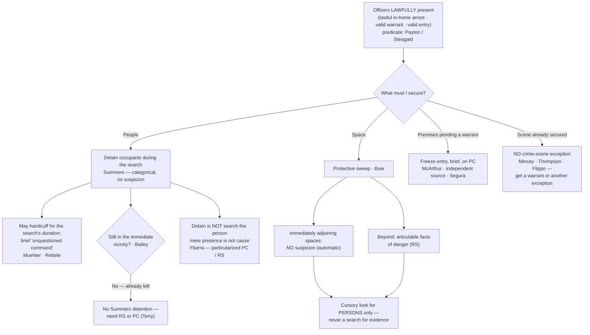

# Securing the Scene

## The Brief

**Field-decisive question:** *How may I secure a scene, sweep for danger, and detain people — without a full search?*

This page governs the limited, warrantless authority to **secure a place** once officers are lawfully there: to sweep for a hidden danger, to detain and briefly hold the people present, and to freeze premises while a warrant is obtained. Each tool is separately bounded, and **none is a license to search for evidence** — securing a scene is not the same as searching it.

**Protective sweep — the two tiers of *[[Maryland v. Buie|Buie]]* (stated up front).** Incident to a lawful in-home arrest, officers may, "as a precautionary matter and **without probable cause or reasonable suspicion**, look in closets and other spaces immediately adjoining the place of arrest from which an attack could be immediately launched." *[[Maryland v. Buie#^pin-334|Maryland v. Buie]]*, 494 U.S. 325, 334 (1990). That first-tier look at **immediately adjoining spaces is automatic**. A sweep **beyond** those spaces needs individualized justification: "there must be articulable facts which, taken together with the rational inferences from those facts, would warrant a reasonably prudent officer in believing that the area to be swept harbors an individual posing a danger to those on the arrest scene." *[[Maryland v. Buie#^pin-334|Id.]]* Either way the sweep stays narrow: it "may extend only to a **cursory inspection of those spaces where a person may be found**," not a search for evidence. *[[Maryland v. Buie#^pin-335|Id.]]* at 335.

**Detaining occupants during warrant execution — *[[Michigan v. Summers|Summers]]* / *[[Muehler v. Mena|Muehler]]* / *[[Bailey v. United States|Bailey]]*.** A premises search warrant "founded on probable cause implicitly carries with it the **limited authority to detain the occupants** of the premises while a proper search is conducted." *[[Michigan v. Summers#^pin-705|Michigan v. Summers]]*, 452 U.S. 692, 705 (1981). That authority is **categorical** — it rides on the warrant and needs no individualized suspicion of the occupant: "[a]n officer's authority to detain incident to a search is categorical." *[[Muehler v. Mena#^pin-98|Muehler v. Mena]]*, 544 U.S. 93, 98 (2005). Officers may use reasonable force to effect it — **handcuffing occupants for the search's duration** where officer-safety interests justify it — and incidental questioning that does not prolong the detention is not a fresh seizure. *[[Muehler v. Mena#^pin-101|Id.]]* at 101. Executing a valid warrant, officers may briefly hold occupants and "exercise **unquestioned command of the situation**" while securing the room — even ordering unclothed occupants out of bed for a few minutes — so long as the detention is not prolonged. *[[Los Angeles County v. Rettele#^pin-1993|Los Angeles County v. Rettele]]*, 550 U.S. 609 (2007) ([[Common Legal Terms#per-curiam|per curiam]]). But the detention power is **spatially bounded**: "[a] spatial constraint defined by the **immediate vicinity of the premises** to be searched is therefore required for detentions incident to the execution of a search warrant." *[[Bailey v. United States#^pin-201|Bailey v. United States]]*, 568 U.S. 186, 201 (2013). Once an occupant has left and is stopped away from the premises, *[[Michigan v. Summers|Summers]]* is gone; any stop then needs its own reasonable suspicion or probable cause.

**Freezing the premises pending a warrant — *[[Illinois v. McArthur|McArthur]]* (and the *[[Segura v. United States|Segura]]* corollary).** With probable cause to believe a home holds contraband, officers may impose a **brief, limited restraint** — barring a resident from entering unaccompanied — while they diligently obtain a warrant. The Court found a two-hour restriction "**reasonable, and hence lawful, in light of** . . . circumstances, which we consider **in combination**": probable cause, a real risk the evidence would be destroyed, a restraint rather than a warrantless search, and a limited duration. *[[Illinois v. McArthur#^pin-331|Illinois v. McArthur]]*, 531 U.S. 326, 331 (2001). The freeze is a temporary **seizure, not a search**. And securing premises pending a warrant does not, by itself, taint what is later lawfully seized: where the warrant rests on "**an independent source**," the earlier entry "is **irrelevant to the admissibility** of the challenged evidence." *[[Segura v. United States#^pin-814|Segura v. United States]]*, 468 U.S. 796, 814 (1984).

**Mere presence is not authority to search a person — *[[Ybarra v. Illinois|Ybarra]]*.** Detaining the people at a scene is **not** searching them. A premises warrant confers no authority over the persons of those who merely happen to be present: "a person's **mere propinquity** to others independently suspected of criminal activity does not, without more, give rise to probable cause to search that person," and "a search or seizure of a person must be supported by **probable cause particularized with respect to that person**." *[[Ybarra v. Illinois#^pin-91|Ybarra v. Illinois]]*, 444 U.S. 85, 91 (1979). A protective frisk of a bystander likewise demands individualized reasonable suspicion "that he was **armed and presently dangerous**." *[[Ybarra v. Illinois#^pin-92|Id.]]* at 92–93. So *[[Michigan v. Summers|Summers]]* / *[[Bailey v. United States|Bailey]]* let officers **detain** the people present; *[[Ybarra v. Illinois|Ybarra]]* forbids treating that detention as authority to **search or frisk** them.

**No crime-scene / murder-scene exception.** Securing a scene never becomes a warrant to search it. "[T]he Fourth Amendment does not bar police officers from making warrantless entries and searches when they reasonably believe that a person within is in need of **immediate aid**," and "the police may seize any evidence that is in plain view during the course of their **legitimate emergency activities**" — but the activity must be **strictly circumscribed by the emergency**. *[[Mincey v. Arizona#^pin-392|Mincey v. Arizona]]*, 437 U.S. 385, 392–93 (1978). There is **no** "murder scene" or general "crime-scene" exception: a two-hour warrantless general search of a homicide scene "remains a significant intrusion" and is unreasonable, *[[Thompson v. Louisiana#^pin-21|Thompson v. Louisiana]]*, 469 U.S. 17, 21 (1984), and a search of an already-secured homicide scene "is invalid unless it falls within one of the narrow and well-delineated exceptions to the warrant requirement" — "*[[Mincey v. Arizona|Mincey]]* controls." *[[Flippo v. West Virginia#^pin-13|Flippo v. West Virginia]]*, 528 U.S. 11, 13–14 (1999). The lawful move at a scene is the **immediate rescue and the prompt *[[Maryland v. Buie|Buie]]* protective look** for other victims or a perpetrator still present — not a general evidentiary search (the entry-to-aid mechanics live on [[Emergency Aid]]).

**The entry predicate — none of this exists until officers are lawfully present.** Every authority above presupposes a **lawful presence**. An arrest warrant plus reason to believe the suspect is home authorizes entry into his **own** dwelling — the Fourth Amendment "has drawn a firm line at the entrance to the house," *[[Payton v. New York#^pin-590|Payton v. New York]]*, 445 U.S. 573, 590 (1980) — but entering a **third party's** home to arrest the warrant's subject requires a **separate search warrant** absent exigency or consent, *[[Steagald v. United States#^pin-205|Steagald v. United States]]*, 451 U.S. 204, 205–06 (1981). Where the premises belong to someone other than the arrestee, the search-warrant predicate, not the arrest warrant, governs whether officers may be there at all (see [[Arrest in the Home]]).

**Burden · standard of review · remedy.** Because a protective sweep and a freeze are warrantless intrusions, the **government bears the burden** of justifying them — articulable facts of danger for a beyond-adjoining-spaces *[[Maryland v. Buie|Buie]]* sweep, and probable cause plus reasonable temporariness for a *[[Illinois v. McArthur|McArthur]]* freeze. On a suppression appeal, the trial court's historical fact findings are reviewed for **[[Common Legal Terms#clear-error|clear error]]** and the ultimate reasonableness determination **[[Common Legal Terms#de-novo|de novo]]**. The **remedy** for exceeding these bounds is **suppression** of the evidence and its fruits ([[The Exclusionary Rule]]).

**Pitfalls to flag for the field.** (1) **Treating a protective sweep as a full search.** A *[[Maryland v. Buie|Buie]]* sweep is a quick look for *people* where a person could hide; the adjoining-spaces look is automatic, anything beyond it demands articulable facts of danger, and opening drawers or "sweeping" for contraband converts it into an unlawful search. (2) **Detaining people who already left.** *[[Michigan v. Summers|Summers]]* does not reach a former occupant stopped down the block — past the immediate vicinity, officers need independent reasonable suspicion or probable cause (*[[Bailey v. United States|Bailey]]*). (3) **Frisking or searching everyone present.** Mere presence at a searched place is not individualized cause; a frisk needs reasonable suspicion the person is armed and dangerous (*[[Ybarra v. Illinois|Ybarra]]*). (4) **Believing a secured scene may be searched.** There is no crime-scene exception; once the injured are aided and the danger resolved, continued searching needs a warrant or another recognized exception (*[[Mincey v. Arizona|Mincey]]* · *[[Thompson v. Louisiana|Thompson]]* · *[[Flippo v. West Virginia|Flippo]]*). (5) **Mislabeling a forced-door entry as consent.** Commanding occupants to open up under color of authority and treating the opened door as a knock-and-talk consent is a **constructive entry**, not consent (*[[United States v. Conner|Conner]]*, 8th Cir.); its lawfulness turns on the entry rules ([[Arrest in the Home]]), not consent doctrine. (6) **Forgetting the entry predicate.** A third party's home needs its own search warrant before officers are lawfully present to detain or sweep at all (*[[Steagald v. United States|Steagald]]*).

## Key cases

| Case | Holding in one line | Weight | Treatment | CourtListener |
|---|---|---|---|---|
| *[[Maryland v. Buie]]*, 494 U.S. 325 (1990) | **Anchor — protective sweep.** Incident to an in-home arrest, officers may look in immediately adjoining spaces with **no** suspicion; a broader sweep needs **articulable facts** of danger; either way it is only a **cursory look for persons**, never a search for evidence. | Binding — SCOTUS | good *(2026-06-30)* | [link](https://www.courtlistener.com/opinion/112384/maryland-v-buie/) |
| *[[Michigan v. Summers]]*, 452 U.S. 692 (1981) | **Anchor — detain occupants.** A premises search warrant founded on probable cause implicitly carries the **limited, categorical authority to detain the occupants** while the search is conducted (no individualized suspicion needed). | Binding — SCOTUS | good *(2026-06-30)* — detention authority spatially limited by *[[Bailey v. United States|Bailey]]* | [link](https://www.courtlistener.com/opinion/110534/michigan-v-summers/) |
| *[[Muehler v. Mena]]*, 544 U.S. 93 (2005) | **Progeny.** The *[[Michigan v. Summers|Summers]]* detention authority is **categorical**; officers may **handcuff** occupants for the search's duration where justified, and incidental questioning that does not prolong the detention is **not a separate seizure**. | Binding — SCOTUS | good *(2026-06-30)* | [link](https://www.courtlistener.com/opinion/142878/muehler-v-mena/) |
| *[[Bailey v. United States]]*, 568 U.S. 186 (2013) | **Progeny — the spatial leash.** *[[Michigan v. Summers|Summers]]* detention is **confined to the immediate vicinity** of the premises; it cannot reach a former occupant stopped a mile away. | Binding — SCOTUS | good *(2026-06-30)* | [link](https://www.courtlistener.com/opinion/820749/bailey-v-united-states/) |
| *[[Los Angeles County v. Rettele]]*, 550 U.S. 609 (2007) (per curiam) | **Progeny.** Executing a valid warrant, officers may briefly detain occupants and "exercise unquestioned command of the situation" — including ordering unclothed occupants out of bed for a few minutes — provided the detention is **not prolonged**. | Binding — SCOTUS | good *(2026-06-30)* | [link](https://www.courtlistener.com/opinion/145728/los-angeles-county-california-v-rettele/) |
| *[[Illinois v. McArthur]]*, 531 U.S. 326 (2001) | **Anchor — freeze pending a warrant.** With probable cause, officers may impose a **brief, limited restraint** (barring a resident from entering unaccompanied) to prevent destruction of evidence while they diligently obtain a warrant. | Binding — SCOTUS | good *(2026-06-30)* | [link](https://www.courtlistener.com/opinion/118405/illinois-v-mcarthur/) |
| *[[Segura v. United States]]*, 468 U.S. 796 (1984) | **Anchor — securing premises ≠ taint.** Securing/occupying premises pending a warrant does not itself require suppression; evidence later seized under a warrant resting on a genuinely **independent source** is admissible despite a prior illegal entry. | Binding — SCOTUS | good *(2026-06-30)* | [link](https://www.courtlistener.com/opinion/111259/segura-v-united-states/) |
| *[[Ybarra v. Illinois]]*, 444 U.S. 85 (1979) | **Limits / Narrows — mere presence.** A premises warrant confers **no** authority to search or frisk persons merely present; a search needs **particularized** probable cause, and a frisk needs individualized reasonable suspicion the person is armed and dangerous. | Binding — SCOTUS | good *(2026-06-30)* | [link](https://www.courtlistener.com/opinion/110158/ybarra-v-illinois/) |

## Related cases across doctrines

These are treated in full on their own case pages, but they bear directly on securing the scene and are framed for it here.

| Case | Relevance to securing the scene (framed here) | Primary home (doctrine) | Treatment | CourtListener |
|---|---|---|---|---|
| *[[Payton v. New York]]*, 445 U.S. 573 (1980) | The **entry predicate** for the suspicionless *[[Maryland v. Buie|Buie]]* sweep: an arrest warrant plus reason to believe the suspect is home authorizes entry into his **own** dwelling, and that lawful in-home arrest is what triggers the protective-sweep authority. | [[Arrest in the Home]] | good *(2026-06-30)* | [opinion](https://www.courtlistener.com/opinion/110235/payton-v-new-york/) |
| *[[Steagald v. United States]]*, 451 U.S. 204 (1981) | Where the premises are a **third party's** home, the arrest warrant is not enough — officers need a **search warrant** to be lawfully present before they may detain occupants or sweep. | [[Arrest in the Home]] | good *(2026-06-30)* | [opinion](https://www.courtlistener.com/opinion/110464/steagald-v-united-states/) |
| *[[Brigham City v. Stuart]]*, 547 U.S. 398 (2006) | A lawful warrantless **emergency-aid entry** makes officers lawfully present, so they may then secure the scene with a *[[Maryland v. Buie|Buie]]* protective sweep; the sweep authority rides on the **lawfulness of the entry**, not on an arrest alone. | [[Emergency Aid]] | good *(2026-06-30)* | [opinion](https://www.courtlistener.com/opinion/145654/brigham-city-v-stuart/) |
| *[[Kentucky v. King]]*, 563 U.S. 452 (2011) | Police may **secure a residence and act on an exigency** to prevent destruction of evidence even where their own lawful conduct (a knock-and-announce) precipitated it — complementing the *[[Illinois v. McArthur|McArthur]]* freeze as the exigency basis for holding premises pending a warrant. | [[Exigent Circumstances and Hot Pursuit]] | good *(2026-06-30)* | [opinion](https://www.courtlistener.com/opinion/216733/kentucky-v-king/) |
| *[[Murray v. United States]]*, 487 U.S. 533 (1988) | **Independent-source companion to *[[Segura v. United States|Segura]]*:** where officers freeze premises and observe evidence during an unlawful entry, that evidence is still admissible if later seized under a warrant supported by genuinely independent information. | [[The Exclusionary Rule]] | good *(2026-06-30)* | [opinion](https://www.courtlistener.com/opinion/112136/murray-v-united-states/) |
| *[[Michigan v. Long]]*, 463 U.S. 1032 (1983) | The **vehicular analogue** of the *[[Maryland v. Buie|Buie]]* sweep: on specific, articulable facts that a suspect is dangerous and may reach weapons, officers may make a limited protective search of the passenger compartment to secure a stop. | [[Traffic Stops]] | good *(2026-06-30)* | [opinion](https://www.courtlistener.com/opinion/111020/michigan-v-long/) |
| *[[Mincey v. Arizona]]*, 437 U.S. 385 (1978) | The anchor of the **no-murder-scene rule**: warrantless entry to render immediate aid (and seize plain-view evidence during legitimate emergency activities) is allowed, but the activity is **strictly circumscribed by the emergency** — no general crime-scene search. | [[Emergency Aid]] | good *(2026-06-30)* | [opinion](https://www.courtlistener.com/opinion/109905/mincey-v-arizona/) |
| *[[Thompson v. Louisiana]]*, 469 U.S. 17 (1984) | Reaffirms *[[Mincey v. Arizona|Mincey]]*: even a **two-hour** general search of a homicide scene is unreasonable — brevity does not save it, and a victim's call for help does not diminish the home's privacy. | [[Emergency Aid]] | good *(2026-06-30)* | [opinion](https://www.courtlistener.com/opinion/111282/thompson-v-louisiana/) |
| *[[Flippo v. West Virginia]]*, 528 U.S. 11 (1999) | There is **no general "crime-scene exception"**: a warrantless search of a secured homicide scene (including opening a closed briefcase) is invalid unless a recognized exception applies — "*[[Mincey v. Arizona|Mincey]]* controls." | [[Emergency Aid]] | good *(2026-06-30)* | [opinion](https://www.courtlistener.com/opinion/1854815/flippo-v-west-virginia/) |

## Recent developments

Role-based circuit developments only — **no SCOTUS** (the controlling Supreme Court cases home to Key cases regardless of date). Two published circuit decisions stress-test the scene-securing authorities at the margins.

- **Extending the protective sweep beyond the in-home arrest — *[[United States v. August]]* (5th Cir. 2025).** *Doctrinal-extension flag.* The Fifth Circuit articulated a **four-part** protective-sweep test and, by bracketing "[or curtilage]" into its first prong, applied it to a **non-arrest, investigatory** backyard entry: "A protective sweep is lawful if: (1) the government agents have a legitimate law enforcement purpose for being in the house [or curtilage]; (2) the sweep is supported by a reasonable, articulable suspicion that the area to be swept harbors an individual posing a danger to those on the scene; (3) the sweep is no more than a cursory inspection of those spaces where a person may be found; and (4) the sweep lasts no longer than is necessary to dispel the reasonable suspicion of danger and lasts no longer than the police are justified in remaining on the premises." *[[United States v. August#^pin-op5|August]]*, 136 F.4th 595 (5th Cir. 2025) (slip op., at 5). This pushes *[[Maryland v. Buie|Buie]]*'s officer-safety rationale outward from its in-home-arrest core to curtilage and investigatory entries. **Binding in-circuit — 5th Cir.** · good. ⚖ Treat as a doctrinal-extension flag (*Buie* outside arrest / into curtilage), not an opinion-recognized circuit split.
- **Constructive entry — a coerced door is not consent — *[[United States v. Conner]]* (8th Cir. 1997).** *Applying the entry predicate.* Massing at a door and demanding entry under color of authority is not a consensual encounter: "an unconstitutional search occurs when officers gain visual or physical access to a motel room after an occupant opens the door **not voluntarily, but in response to a demand under color of authority**." *[[United States v. Conner#^pin-666|Conner]]*, 127 F.3d 663, 666 (8th Cir. 1997). The surround-and-call-out maneuver is therefore an **entry** question governed by the warrant rules ([[Arrest in the Home]]), not consent doctrine. **Binding in-circuit — 8th Cir.** · good.

## Visual

## Sources

- *Maryland v. Buie*, 494 U.S. 325 (1990) — pinpoints 334, 335 — https://www.courtlistener.com/opinion/112384/maryland-v-buie/
- *Michigan v. Summers*, 452 U.S. 692 (1981) — pinpoint 705 *(detention authority spatially limited by Bailey)* — https://www.courtlistener.com/opinion/110534/michigan-v-summers/
- *Muehler v. Mena*, 544 U.S. 93 (2005) — pinpoints 98, 101 — https://www.courtlistener.com/opinion/142878/muehler-v-mena/
- *Bailey v. United States*, 568 U.S. 186 (2013) — pinpoints 199, 201 (slip op. 11, 13) — https://www.courtlistener.com/opinion/820749/bailey-v-united-states/
- *Los Angeles County v. Rettele*, 550 U.S. 609 (2007) (per curiam) — pinpoint 1993 (S. Ct. reporter, per CL copy) — https://www.courtlistener.com/opinion/145728/los-angeles-county-california-v-rettele/
- *Illinois v. McArthur*, 531 U.S. 326 (2001) — pinpoints 331, 334 — https://www.courtlistener.com/opinion/118405/illinois-v-mcarthur/
- *Segura v. United States*, 468 U.S. 796 (1984) — pinpoint 814 — https://www.courtlistener.com/opinion/111259/segura-v-united-states/
- *Ybarra v. Illinois*, 444 U.S. 85 (1979) — pinpoints 91, 92–93 — https://www.courtlistener.com/opinion/110158/ybarra-v-illinois/
- *Payton v. New York*, 445 U.S. 573 (1980) — pinpoint 590 *(entry predicate; home = [[Arrest in the Home]])* — https://www.courtlistener.com/opinion/110235/payton-v-new-york/
- *Steagald v. United States*, 451 U.S. 204 (1981) — pinpoint 205–206 *(third-party home; home = [[Arrest in the Home]])* — https://www.courtlistener.com/opinion/110464/steagald-v-united-states/
- *Brigham City v. Stuart*, 547 U.S. 398 (2006) *(lawful-entry predicate for the sweep; home = [[Emergency Aid]])* — https://www.courtlistener.com/opinion/145654/brigham-city-v-stuart/
- *Kentucky v. King*, 563 U.S. 452 (2011) *(exigency to secure premises; home = [[Exigent Circumstances and Hot Pursuit]])* — https://www.courtlistener.com/opinion/216733/kentucky-v-king/
- *Murray v. United States*, 487 U.S. 533 (1988) *(independent-source companion to Segura; home = [[The Exclusionary Rule]])* — https://www.courtlistener.com/opinion/112136/murray-v-united-states/
- *Michigan v. Long*, 463 U.S. 1032 (1983) *(vehicular analogue of the Buie sweep; home = [[Traffic Stops]])* — https://www.courtlistener.com/opinion/111020/michigan-v-long/
- *Mincey v. Arizona*, 437 U.S. 385 (1978) — pinpoints 392, 393 *(no murder-scene exception; home = [[Emergency Aid]])* — https://www.courtlistener.com/opinion/109905/mincey-v-arizona/
- *Thompson v. Louisiana*, 469 U.S. 17 (1984) (per curiam) — pinpoint 21 *(home = [[Emergency Aid]])* — https://www.courtlistener.com/opinion/111282/thompson-v-louisiana/
- *Flippo v. West Virginia*, 528 U.S. 11 (1999) (per curiam) — pinpoints 13, 14 *(no crime-scene exception; home = [[Emergency Aid]])* — https://www.courtlistener.com/opinion/1854815/flippo-v-west-virginia/
- *United States v. August*, 136 F.4th 595 (5th Cir. 2025) — pinpoint slip op., at 5 *(Binding in-circuit — 5th Cir.)* — https://www.courtlistener.com/opinion/10574922/united-states-v-august/
- *United States v. Conner*, 127 F.3d 663 (8th Cir. 1997) — pinpoint 666 *(Binding in-circuit — 8th Cir.)* — https://www.courtlistener.com/opinion/747208/united-states-v-larry-duane-conner-united-states-of-america-v-john/
