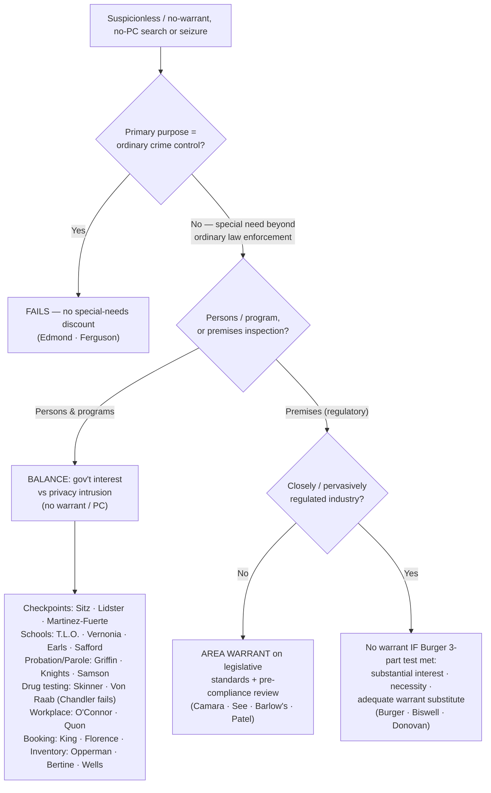

---
aliases:
  - "Special Needs and Administrative Searches"
topic: Special Needs and Administrative Searches
type: doctrine
jurisdiction: Federal (U.S. Const. amend. IV); SCOTUS baseline
status: verified
related:
  - "[[Traffic Stops]]"
  - "[[Search Incident to Arrest]]"
  - "[[The Warrant Requirement]]"
  - "[[Consent Searches]]"
  - "[[Border Searches]]"
---

# Special Needs and Administrative Searches

## The Brief

**Field-decisive question:** *Is this a "special needs" or administrative search that can proceed on a standard **other than** individualized probable cause and a warrant — because it serves a need beyond ordinary law enforcement — or is it really ordinary crime control dressed up, which gets **no** discount?* The same officer, the same intrusion: whether a recognized special need is present decides whether reasonableness is measured by a **balance** instead of by warrant-and-PC.

**The black-letter rule + the balancing test (up front).** When a search or seizure serves a **"special need, beyond the normal need for law enforcement,"** the Fourth Amendment is satisfied **not** by a warrant and probable cause but by a **reasonableness balance**: the government's special interest weighed against the individual's privacy intrusion. When that balance favors the program, it can sustain **suspicionless** or **reduced-suspicion** action in defined contexts — sobriety checkpoints, schools, probation/parole, government employment, closely regulated industries, and administrative inspections. This is a **free-standing reasonableness inquiry**, not an ordinary warrant exception under [[The Warrant Requirement]]: do not analyze it as if probable cause is required, and keep it distinct from voluntariness-based [[Consent Searches]] and the sovereignty-based rules of [[Border Searches]].

**The threshold purpose gate — *[[City of Indianapolis v. Edmond|Edmond]]*, and it comes first.** Before any balancing, ask what the program is *for*. A program whose **primary purpose is ordinary crime control fails**, however brief or orderly it is: "Because the primary purpose of the Indianapolis narcotics checkpoint program is to uncover evidence of ordinary criminal wrongdoing, the program contravenes the Fourth Amendment." *[[City of Indianapolis v. Edmond|Edmond]]*, 531 U.S. 32, 41–42 (2000). Contrast the two poles the officer must be able to name:

- ***[[Michigan Dept. of State Police v. Sitz|Sitz]]*** — a **sobriety** checkpoint (immediate highway-safety purpose) is valid. 496 U.S. 444 (1990).
- ***[[Illinois v. Lidster|Lidster]]*** — an **information-seeking** checkpoint asking motorists about a crime committed by *someone else* is valid. 540 U.S. 419 (2004).
- ***[[City of Indianapolis v. Edmond|Edmond]]*** — a checkpoint whose primary purpose is **drug interdiction** (ordinary crime control) is unconstitutional. 531 U.S. 32 (2000).

*[[Ferguson v. City of Charleston|Ferguson]]* applies the same purpose test off the road: covertly testing pregnant patients to **generate evidence for police** is **not** a special need, because "the immediate objective of the searches was to generate evidence for law enforcement purposes." 532 U.S. 67 (2001). (For the seizure-of-the-driver angle at a checkpoint, see [[Traffic Stops]].)

**Two regimes — keep them separate.** The page spans two related but distinct lines that share one root (reasonableness without a traditional warrant on PC) but diverge on **what** is searched and **what substitutes** for the warrant:

- **"Special needs"** — searches of **persons** serving a government interest beyond ordinary law enforcement, where warrant/PC is impracticable; the court drops warrant + PC and **balances**, which can sustain suspicionless testing. The phrase is Justice Blackmun's *[[New Jersey v. T.L.O.|T.L.O.]]* concurrence — "special needs, beyond the normal need for law enforcement," 469 U.S. 325, 351 (1985) — **not** the majority (a common miscredit).
- **"Administrative"** — inspections of **premises** to enforce a *regulatory scheme* (housing, fire, safety codes), not to gather criminal evidence. The default is **not** "no warrant" but a warrant of a special kind: an **area warrant** on neutral, legislatively fixed criteria (*[[Camara v. Municipal Court|Camara]]*; extended to commercial premises in *[[See v. City of Seattle|See]]*; reaffirmed for OSHA in *[[Marshall v. Barlow's Inc|Barlow's]]*). A **narrow** closely-regulated-industry exception (*[[New York v. Burger|Burger]]*) dispenses with the warrant when its three-part test is met.

### Scope stated explicitly — by category, each with its standard

Special needs is not one rule but a family of context-specific standards. State which box you are in first; the standard follows the box.

**Checkpoints — *[[Michigan Dept. of State Police v. Sitz|Sitz]]* / *[[City of Indianapolis v. Edmond|Edmond]]* / *[[Illinois v. Lidster|Lidster]]* / *[[United States v. Martinez-Fuerte|Martinez-Fuerte]]*.** Brief, suspicionless, **systematic** stops on a programmatic balance of public interest vs. minimal intrusion are valid *if* the primary purpose is not ordinary crime control. *[[United States v. Martinez-Fuerte|Martinez-Fuerte]]* (fixed interior immigration checkpoints, 428 U.S. 543 (1976)) is the doctrinal ancestor and the model for the **no-individualized-suspicion, no-officer-discretion** checkpoint; *[[Michigan Dept. of State Police v. Sitz|Sitz]]* imported it to DUI; *[[Illinois v. Lidster|Lidster]]* to witness information; *[[City of Indianapolis v. Edmond|Edmond]]* marks the outer bound (drug-interdiction purpose fails). The floor these must clear is *[[Delaware v. Prouse|Prouse]]*, which struck random, discretionary license/registration stops but signaled that a neutral, systematic checkpoint could pass (see [[Traffic Stops]]).

**Schools — *[[New Jersey v. T.L.O.|T.L.O.]]* reasonable suspicion; *[[Vernonia School District 47J v. Acton|Vernonia]]* / *[[Board of Education v. Earls|Earls]]* suspicionless drug testing; *[[Safford Unified School District v. Redding|Safford]]* strip-search needs more.** An ordinary school search runs on the ***[[New Jersey v. T.L.O.|T.L.O.]]* two-part test**: "first, one must consider whether the . . . action was justified at its inception; second, one must determine whether the search as actually conducted was reasonably related in scope to the circumstances which justified the interference in the first place." 469 U.S. at 341. No warrant, no PC — reasonable suspicion, reasonably scoped. Suspicionless *drug testing* is a narrower line tied to reduced privacy: student **athletes** (*[[Vernonia School District 47J v. Acton|Vernonia]]*, 515 U.S. 646 (1995)) and **extracurricular** participants (*[[Board of Education v. Earls|Earls]]*, 536 U.S. 822 (2002)). But intrusiveness must match the suspicion: *[[Safford Unified School District v. Redding|Safford]]* held a **strip search** of a 13-year-old for common pain relievers — with no reason to think them dangerous or hidden in her underwear — unreasonable under *[[New Jersey v. T.L.O.|T.L.O.]]* (though officials had qualified immunity). 557 U.S. 364 (2009).

**Probation / Parole — different floors.** Supervision is itself a special need, but the *[[Griffin v. Wisconsin|Griffin]]*/*[[United States v. Knights|Knights]]*/*[[Samson v. California|Samson]]* line sets **different** minimum suspicion levels — do not assume parole rules govern probationers or vice versa. *[[Griffin v. Wisconsin|Griffin]]* allows a warrantless search of a **probationer's home** on "reasonable grounds" under a valid regulation. 483 U.S. 868 (1987). *[[United States v. Knights|Knights]]* upholds a probation search on **reasonable suspicion** even for an investigatory purpose: "the warrantless search of Knights, supported by reasonable suspicion and authorized by a condition of probation, was reasonable within the meaning of the Fourth Amendment." 534 U.S. 112, 122 (2001). *[[Samson v. California|Samson]]* goes further for **parolees**, who may be searched with **no individualized suspicion** at all given especially diminished privacy. 547 U.S. 843 (2006).

**Administrative / regulatory inspections — a warrant is still the default.** For routine code inspections the rule is *[[Camara v. Municipal Court|Camara]]*: a warrant is required, but an **area warrant** on reasonable legislative standards, not individualized PC. 387 U.S. 523 (1967). Its companion *[[See v. City of Seattle|See]]* extends the rule to **commercial** premises (387 U.S. 541 (1967)); *[[Marshall v. Barlow's Inc|Barlow's]]* applies it to **OSHA workplace** inspections (436 U.S. 307 (1978)). Modern *[[City of Los Angeles v. Patel|Patel]]* polices the regime: it must allow **pre-compliance review**, and ordinary businesses like **hotels are not "closely regulated."** 576 U.S. 409 (2015). Fire scenes run on the same administrative-warrant logic — firefighting is an exigency, but once the blaze is out and the scene secured, further investigative entry needs an **administrative** warrant (cause and origin) or, if the object is criminal evidence, a **criminal** warrant on PC (*[[Michigan v. Tyler|Tyler]]*, 436 U.S. 499 (1978); *[[Michigan v. Clifford|Clifford]]*, 464 U.S. 287 (1984)). The old warrantless-health-inspection rule of *Frank v. Maryland*, 359 U.S. 360 (1959), was **overruled** by *[[Camara v. Municipal Court|Camara]]*/*[[See v. City of Seattle|See]]* — it is history, not law. A separate welfare-administration niche survives: *Wyman v. James*, 400 U.S. 309 (1971), treated a caseworker's home visit as a reasonable condition of benefits rather than a criminal-law "search" (good law, narrow).

*The narrow closely-regulated-industry carve-out — the ***[[New York v. Burger|Burger]]*** three-part test (the warrant *substitute*).* A warrantless inspection of a closely regulated business is reasonable **only** if all three are met: (1) a **substantial government interest** informs the regulatory scheme; (2) warrantless inspection is **necessary** to further that scheme; and (3) the scheme is a **constitutionally adequate substitute for a warrant** — giving the owner notice and limiting the inspectors' discretion in time, place, and scope. 482 U.S. 691, 702–03 (1987). This is a narrow carve-out for genuinely pervasively regulated trades — **firearms** dealers (*[[United States v. Biswell|Biswell]]*, 406 U.S. 311 (1972)), **mines** (*[[Donovan v. Dewey|Donovan]]*, 452 U.S. 594 (1981)), liquor, junkyards/vehicle dismantlers — **not** a license to inspect any regulated business at will (*[[Marshall v. Barlow's Inc|Barlow's]]*; *[[City of Los Angeles v. Patel|Patel]]*).

**Inventory — caretaking, not investigation (primary home: [[Search Incident to Arrest]]).** Inventories (*[[South Dakota v. Opperman|Opperman]]*, 428 U.S. 364 (1976); *[[Colorado v. Bertine|Bertine]]*, 479 U.S. 367 (1987); *[[Florida v. Wells|Wells]]*, 495 U.S. 1 (1990); and the stationhouse-booking version *[[Illinois v. Lafayette|Lafayette]]*, 462 U.S. 640 (1983)) are a **caretaking**, not investigatory, function. They turn on **standardized procedures**, not officer discretion: an inventory "must not be a ruse for a general rummaging in order to discover incriminating evidence," *[[Florida v. Wells|Wells]]*, 495 U.S. at 4, and closed containers may be opened only where "discretion is exercised according to standard criteria and on the basis of something other than suspicion of evidence of criminal activity," *[[Colorado v. Bertine|Bertine]]*, 479 U.S. at 375–76.

**Drug / alcohol testing (safety-and-security roles) — *[[Skinner v. Railway Labor Executives' Ass'n|Skinner]]* / *[[National Treasury Employees Union v. Von Raab|Von Raab]]* yes; *[[Chandler v. Miller|Chandler]]* no.** Suspicionless testing is reasonable where a concrete safety or integrity interest supports it: railway employees after major accidents or specified rule violations (*[[Skinner v. Railway Labor Executives' Ass'n|Skinner]]*, 489 U.S. 602 (1989)) and Customs employees seeking interdiction or firearm-carrying posts (*[[National Treasury Employees Union v. Von Raab|Von Raab]]*, 489 U.S. 656 (1989)). But the need must be **real and concrete**, not symbolic: *[[Chandler v. Miller|Chandler]]* struck down suspicionless drug testing of candidates for state office as a **symbolic** gesture without a demonstrated problem. 520 U.S. 305 (1997).

**Workplace (public employer) — *[[O'Connor v. Ortega|O'Connor]]* / *[[City of Ontario v. Quon|Quon]]*.** A public employee **can** have a reasonable expectation of privacy in an office, desk, or files, but a public employer's **work-related** search — to retrieve materials or investigate work misconduct — is judged by **reasonableness under all the circumstances**, no warrant or PC. *[[O'Connor v. Ortega|O'Connor]]*, 480 U.S. 709 (1987). *[[City of Ontario v. Quon|Quon]]* applied that to **electronic** communications: an employer's review of an employee's text messages on an employer-issued pager was reasonable because work-motivated and not excessive in scope (the Court **assumed** a privacy expectation without deciding it). 560 U.S. 746 (2010).

**Booking-process balancing — *[[Maryland v. King|King]]*; jail intake — *[[Florence v. County of Burlington|Florence]]*.** These are not checkpoints or testing programs but **custodial-intake** balances. *[[Maryland v. King|King]]* upholds a **buccal DNA cheek-swab** of a serious-offense arrestee held in custody as a reasonable booking procedure. 569 U.S. 435 (2013). *[[Florence v. County of Burlington|Florence]]* upholds a **close visual strip search** of every arrestee admitted to a jail's general population, without individualized suspicion, even for a minor offense. 566 U.S. 318 (2012).

**Burden & standard of review.** The **government** bears the burden of justifying a warrantless/suspicionless search by establishing that a recognized special-needs/administrative exception applies (a "special need, beyond the normal need for law enforcement") and that, on balance, its interest outweighs the individual's privacy intrusion. *[[Vernonia School District 47J v. Acton|Vernonia]]*, 515 U.S. 646, 652–53 (1995); cf. *[[New Jersey v. T.L.O.|T.L.O.]]*, 469 U.S. 325 (1985). On review, the reasonableness balancing is a question of law reviewed **de novo**, with underlying facts for **clear error**. The **remedy** for an unjustified search is suppression under the exclusionary rule ([[The Exclusionary Rule]]) — except that suppression does **not** reach a **parole-revocation** hearing (*[[Pennsylvania Board of Probation and Parole v. Scott|Scott]]*, 524 U.S. 357 (1998)).

**Pitfalls to flag for the field.** (1) **Treating any checkpoint as automatically valid** — *[[City of Indianapolis v. Edmond|Edmond]]* makes the program's **primary purpose dispositive**; a "drug checkpoint" is unconstitutional even if run exactly like a lawful *[[Michigan Dept. of State Police v. Sitz|Sitz]]* sobriety checkpoint. Articulate the special purpose first. (2) **Importing probable cause** — special needs is a **balance**; but "reasonableness" is not a blank check (*[[Chandler v. Miller|Chandler]]*, *[[Ferguson v. City of Charleston|Ferguson]]* demand a real, concrete, non-law-enforcement need). (3) **Calling it a warrant exception in the usual sense** — some sub-areas (administrative inspections under *[[Camara v. Municipal Court|Camara]]*) still require a warrant of a special kind; others (testing, parole searches) require none. Match the rule to the sub-area. (4) **Treating the closely-regulated carve-out as the general admin rule** — *[[Marshall v. Barlow's Inc|Barlow's]]* and *[[New York v. Burger|Burger]]* make it **narrow**; most businesses default to a *[[Camara v. Municipal Court|Camara]]*/*[[See v. City of Seattle|See]]* area warrant. (5) **Crediting the "special needs" label to the *[[New Jersey v. T.L.O.|T.L.O.]]* majority** — it is Blackmun's concurrence, 469 U.S. at 351. (6) **Using inventory authority as an investigative tool** — deviating from the standardized policy, or using it as a pretext to hunt for evidence, voids the inventory (*[[Florida v. Wells|Wells]]*, *[[Colorado v. Bertine|Bertine]]*).

## Key cases

| Case | Holding in one line | Weight | Treatment | CourtListener |
|---|---|---|---|---|
| *[[City of Indianapolis v. Edmond]]*, 531 U.S. 32 (2000) | The **purpose gate**: a checkpoint whose primary purpose is ordinary crime control (drug interdiction) is unconstitutional, however brief or orderly. | Binding — SCOTUS | good *(2026-06-30)* | [link](https://www.courtlistener.com/opinion/118391/city-of-indianapolis-v-edmond/) |
| *[[Michigan Dept. of State Police v. Sitz]]*, 496 U.S. 444 (1990) | Suspicionless DUI **sobriety checkpoints** are constitutional; the State's interest in combating drunk driving outweighs the brief, minimal intrusion. | Binding — SCOTUS | good *(2026-06-30)* | [link](https://www.courtlistener.com/opinion/112459/michigan-department-of-state-police-v-sitz/) |
| *[[Illinois v. Lidster]]*, 540 U.S. 419 (2004) | An **information-seeking** checkpoint asking motorists about a crime committed by someone else is constitutional. | Binding — SCOTUS | good *(2026-06-30)* | [link](https://www.courtlistener.com/opinion/131154/illinois-v-lidster/) |
| *[[Ferguson v. City of Charleston]]*, 532 U.S. 67 (2001) | Covertly testing pregnant patients to **generate evidence for police** is NOT a special need — the immediate objective was law enforcement. | Binding — SCOTUS | good *(2026-06-30)* | [link](https://www.courtlistener.com/opinion/118414/ferguson-v-city-of-charleston/) |
| *[[New Jersey v. T.L.O.]]*, 469 U.S. 325 (1985) | A public-school official may search a student on **reasonableness alone** — justified at inception, reasonable in scope — no warrant or PC. | Binding — SCOTUS | good *(2026-06-30)* | [link](https://www.courtlistener.com/opinion/111301/new-jersey-v-t-l-o/) |
| *[[Vernonia School District 47J v. Acton]]*, 515 U.S. 646 (1995) | Suspicionless random **drug testing of student athletes** is reasonable under the special-needs doctrine. | Binding — SCOTUS | good *(2026-06-30)* | [link](https://www.courtlistener.com/opinion/117964/vernonia-school-district-47j-v-acton/) |
| *[[Board of Education v. Earls]]*, 536 U.S. 822 (2002) | Extends *[[Vernonia School District 47J v. Acton|Vernonia]]*: suspicionless testing of all students in competitive **extracurriculars** is reasonable. | Binding — SCOTUS | good *(2026-06-30)* | [link](https://www.courtlistener.com/opinion/121171/board-of-education-of-independent-school-district-no-92-of-pottawatomie/) |
| *[[Safford Unified School District v. Redding]]*, 557 U.S. 364 (2009) | A **strip search** must match its intrusiveness to the suspicion; strip-searching a 13-year-old for common pain relievers was unreasonable (officials had qualified immunity). | Binding — SCOTUS | good *(2026-06-30)* | [link](https://www.courtlistener.com/opinion/145852/safford-unified-school-district-1-v-redding/) |
| *[[Griffin v. Wisconsin]]*, 483 U.S. 868 (1987) | A **probationer's home** may be searched without a warrant, on "reasonable grounds," under a valid regulation; probation is a special need. | Binding — SCOTUS | good *(2026-06-30)* | [link](https://www.courtlistener.com/opinion/111959/griffin-v-wisconsin/) |
| *[[United States v. Knights]]*, 534 U.S. 112 (2001) | A **probation search on reasonable suspicion**, authorized by a search condition, is reasonable even for a law-enforcement purpose. | Binding — SCOTUS | good *(2026-06-30)* | [link](https://www.courtlistener.com/opinion/118468/united-states-v-knights/) |
| *[[Samson v. California]]*, 547 U.S. 843 (2006) | A **suspicionless** search of a **parolee** subject to a search condition is reasonable; parolees have severely diminished privacy expectations. | Binding — SCOTUS | good *(2026-06-30)* | [link](https://www.courtlistener.com/opinion/145640/samson-v-california/) |
| *[[Skinner v. Railway Labor Executives' Ass'n]]*, 489 U.S. 602 (1989) | Suspicionless **drug/alcohol testing of railway employees** after major accidents or specified rule violations is reasonable (safety special need). | Binding — SCOTUS | good *(2026-06-30)* | [link](https://www.courtlistener.com/opinion/112219/skinner-v-railway-labor-executives-assn/) |
| *[[National Treasury Employees Union v. Von Raab]]*, 489 U.S. 656 (1989) | Suspicionless **drug testing of Customs employees** seeking interdiction or firearm-carrying posts is reasonable. | Binding — SCOTUS | good *(2026-06-30)* | [link](https://www.courtlistener.com/opinion/112220/national-treasury-employees-union-v-von-raab/) |
| *[[Chandler v. Miller]]*, 520 U.S. 305 (1997) | **Symbolic** suspicionless drug testing of candidates for state office **fails** — no concrete special need. | Binding — SCOTUS | good *(2026-06-30)* | [link](https://www.courtlistener.com/opinion/118100/chandler-v-miller/) |
| *[[Camara v. Municipal Court]]*, 387 U.S. 523 (1967) | Administrative code inspections generally need a warrant — but an **"area warrant"** on reasonable legislative standards, not individualized PC. | Binding — SCOTUS | good *(2026-06-30)* | [link](https://www.courtlistener.com/opinion/107473/camara-v-municipal-court-of-city-and-county-of-san-francisco/) |
| *[[See v. City of Seattle]]*, 387 U.S. 541 (1967) | Extends *[[Camara v. Municipal Court|Camara]]* to **commercial premises**: a business owner may insist on a warrant before inspection of non-public areas. | Binding — SCOTUS | good *(2026-06-30)* | [link](https://www.courtlistener.com/opinion/107474/see-v-city-of-seattle/) |
| *[[Marshall v. Barlow's Inc]]*, 436 U.S. 307 (1978) | **OSHA** may not conduct warrantless inspections of business premises; an administrative inspection warrant is required (subject to the closely-regulated carve-out). | Binding — SCOTUS | good *(2026-06-30)* | [link](https://www.courtlistener.com/opinion/109866/marshall-v-barlows-inc/) |
| *[[New York v. Burger]]*, 482 U.S. 691 (1987) | Warrantless inspection of a **closely regulated** business is reasonable under a three-part test (substantial interest + necessity + adequate warrant substitute). | Binding — SCOTUS | good *(2026-06-30)* | [link](https://www.courtlistener.com/opinion/111927/new-york-v-burger/) |
| *[[United States v. Biswell]]*, 406 U.S. 311 (1972) | Warrantless inspection of a **federally licensed firearms dealer** is reasonable — a pervasively regulated business; unannounced inspection is essential to enforcement. | Binding — SCOTUS | good *(2026-06-30)* | [link](https://www.courtlistener.com/opinion/108533/united-states-v-biswell/) |
| *[[Donovan v. Dewey]]*, 452 U.S. 594 (1981) | Warrantless inspection of **mines** is reasonable where a comprehensive statutory scheme (certainty, regularity, frequency, scope) is a constitutionally adequate warrant substitute. | Binding — SCOTUS | good *(2026-06-30)* | [link](https://www.courtlistener.com/opinion/110530/donovan-v-dewey/) |
| *[[City of Los Angeles v. Patel]]*, 576 U.S. 409 (2015) | An admin-inspection regime is **facially invalid absent pre-compliance review**; hotels are **not** closely regulated. | Binding — SCOTUS | good *(2026-06-30)* | [link](https://www.courtlistener.com/opinion/2810524/los-angeles-v-patel/) |
| *[[South Dakota v. Opperman]]*, 428 U.S. 364 (1976) | A vehicle **inventory** under standard procedures, not a pretext for investigation, is reasonable. | Binding — SCOTUS | good *(2026-06-30)* | [link](https://www.courtlistener.com/opinion/109537/south-dakota-v-opperman/) |
| *[[Florida v. Wells]]*, 495 U.S. 1 (1990) | An inventory must follow **standardized procedures**; unbridled discretion to rummage for evidence is invalid. | Binding — SCOTUS | good *(2026-06-30)* | [link](https://www.courtlistener.com/opinion/112412/florida-v-wells/) |
| *[[O'Connor v. Ortega]]*, 480 U.S. 709 (1987) | A **public employee** may have a REP in office/desk/files, but a public employer's **work-related** search is judged by reasonableness — no warrant/PC. | Binding — SCOTUS | good *(2026-06-30)* | [link](https://www.courtlistener.com/opinion/111851/oconnor-v-ortega/) |
| *[[City of Ontario v. Quon]]*, 560 U.S. 746 (2010) | A government employer's review of an employee's **text messages** on an employer pager is reasonable where work-motivated and not excessive in scope. | Binding — SCOTUS | good *(2026-06-30)* | [link](https://www.courtlistener.com/opinion/148797/city-of-ontario-v-quon/) |
| *[[Maryland v. King]]*, 569 U.S. 435 (2013) | A buccal **DNA cheek-swab** of a serious-offense arrestee held in custody is a reasonable **booking** procedure. | Binding — SCOTUS | good *(2026-06-30)* | [link](https://www.courtlistener.com/opinion/873669/maryland-v-king/) |

## Related cases across doctrines

These are treated in full elsewhere but bear directly on the special-needs / administrative-search line, framed for this doctrine here.

| Case | Relevance to special needs & administrative searches (framed here) | Weight · Treatment | Treated in full · CourtListener |
|---|---|---|---|
| *[[Delaware v. Prouse]]*, 440 U.S. 648 (1979) | Random, discretionary license/registration stops are unreasonable — but a neutral, **systematic** checkpoint (no officer discretion) could pass; the floor the checkpoint cases (*[[Michigan Dept. of State Police v. Sitz|Sitz]]*, *[[City of Indianapolis v. Edmond|Edmond]]*) must clear. | Binding — SCOTUS · good | [[Traffic Stops]] · [CL](https://www.courtlistener.com/opinion/110045/delaware-v-prouse/) |
| *[[United States v. Martinez-Fuerte]]*, 428 U.S. 543 (1976) | Brief, suspicionless stops at fixed interior immigration checkpoints are reasonable on a programmatic balance — the doctrinal ancestor of *[[Michigan Dept. of State Police v. Sitz|Sitz]]* and the model for the no-individualized-suspicion checkpoint. | Binding — SCOTUS · good | [[Border Searches]] · [CL](https://www.courtlistener.com/opinion/109541/united-states-v-martinez-fuerte/) |
| *[[Colorado v. Bertine]]*, 479 U.S. 367 (1987) | **Inventory** may open closed containers where discretion follows standardized criteria, not suspicion of evidence — the standardized-criteria core of the caretaking inventory line. | Binding — SCOTUS · good | [[Search Incident to Arrest]] · [CL](https://www.courtlistener.com/opinion/111788/colorado-v-bertine/) |
| *[[Illinois v. Lafayette]]*, 462 U.S. 640 (1983) | Stationhouse **booking inventory** of an arrestee's effects (including containers) is a reasonable administrative/caretaking process — extends the inventory line from vehicles to booking. | Binding — SCOTUS · good | [[Search Incident to Arrest]] · [CL](https://www.courtlistener.com/opinion/110976/illinois-v-lafayette/) |
| *[[Florence v. County of Burlington]]*, 566 U.S. 318 (2012) | A close visual **jail-intake strip search** of every arrestee admitted to the general population is reasonable without individualized suspicion, even for a minor offense — custodial-intake balancing. | Binding — SCOTUS · good | [[Search Incident to Arrest]] · [CL](https://www.courtlistener.com/opinion/626454/florence-v-board-of-chosen-freeholders-of-county-of-burlington/) |
| *[[Michigan v. Tyler]]*, 436 U.S. 499 (1978) | Firefighting is an exigency, but continued **fire-scene investigation** after the blaze is out needs a warrant — an administrative warrant for cause/origin, a criminal warrant if the object is arson evidence. | Binding — SCOTUS · good | [[Emergency Aid]] · [CL](https://www.courtlistener.com/opinion/109874/michigan-v-tyler/) |
| *[[Michigan v. Clifford]]*, 464 U.S. 287 (1984) | Refines *[[Michigan v. Tyler|Tyler]]*: where privacy interests remain in fire-damaged property, a post-fire search once the scene is secured needs a warrant; **administrative** warrant for cause, **criminal** warrant if the primary object is crime evidence. | Binding — SCOTUS · good | [[Emergency Aid]] · [CL](https://www.courtlistener.com/opinion/111057/michigan-v-clifford/) |
| *[[Pennsylvania Board of Probation and Parole v. Scott]]*, 524 U.S. 357 (1998) | The exclusionary rule does **not** apply at a **parole-revocation** hearing — the special-needs supervision context limits the suppression remedy. | Binding — SCOTUS · good | [[The Exclusionary Rule]] · [CL](https://www.courtlistener.com/opinion/118235/pennsylvania-bd-of-probation-and-parole-v-scott/) |
| *[[United States v. Evans]]*, 937 F.2d 1534 (10th Cir. 1991) | Circuit application of the **inventory** rule: a bus-station inventory of a carry-on bag was valid because the officer followed standardized procedure — illustrates the *[[Colorado v. Bertine|Bertine]]*/*[[Florida v. Wells|Wells]]* standardized-criteria requirement. | Binding in-circuit — 10th Cir. · good | [[Search Incident to Arrest]] · [CL](https://www.courtlistener.com/opinion/564407/united-states-v-daryl-lee-evans/) |

## Recent developments

Role-based, circuit/state only (no SCOTUS). The special-needs and supervision-search rules continue to be applied and extended in the courts of appeals — especially as the *[[United States v. Knights|Knights]]*/*[[Samson v. California|Samson]]* line meets digital devices and as circuits police how much record support a suspicionless supervised-release condition needs.

- **United States v. Payne (9th Cir. 2024)** — *expands the supervision-search line to digital devices.* A California parolee's cell phone may be searched without individualized cause under his suspicionless parole search condition (analyzed under a *[[Samson v. California|Samson]]*/*[[United States v. Knights|Knights]]* totality), and officers may compel use of his thumbprint to unlock it because the compelled biometric unlock is non-testimonial under the Fifth Amendment, akin to a fingerprint or blood draw. **Binding in-circuit — 9th Cir.** · good. *(No standalone case page — named in prose with circuit.)* [opinion](https://www.courtlistener.com/opinion/9494371/united-states-v-jeremy-payne/)
- **United States v. Oliveras (2d Cir. 2024)** — *narrows / demands record support.* The special-needs doctrine can support a suspicionless search condition of supervised release (diminished privacy + effective administration of supervision as a special need), **but only when supported by the record**; the court vacated the condition and remanded for an individualized assessment with on-the-record reasons under 18 U.S.C. § 3553(a). **Binding in-circuit — 2d Cir.** · good. *(No standalone case page — named in prose with circuit.)* [opinion](https://www.courtlistener.com/opinion/9484364/united-states-v-oliveras/)

## Visual

## Sources

- *City of Indianapolis v. Edmond*, 531 U.S. 32 (2000) — https://www.courtlistener.com/opinion/118391/city-of-indianapolis-v-edmond/
- *Michigan Dept. of State Police v. Sitz*, 496 U.S. 444 (1990) — https://www.courtlistener.com/opinion/112459/michigan-department-of-state-police-v-sitz/
- *Illinois v. Lidster*, 540 U.S. 419 (2004) — https://www.courtlistener.com/opinion/131154/illinois-v-lidster/
- *Ferguson v. City of Charleston*, 532 U.S. 67 (2001) — https://www.courtlistener.com/opinion/118414/ferguson-v-city-of-charleston/
- *New Jersey v. T.L.O.*, 469 U.S. 325 (1985) — https://www.courtlistener.com/opinion/111301/new-jersey-v-t-l-o/
- *Vernonia School District 47J v. Acton*, 515 U.S. 646 (1995) — https://www.courtlistener.com/opinion/117964/vernonia-school-district-47j-v-acton/
- *Board of Education v. Earls*, 536 U.S. 822 (2002) — https://www.courtlistener.com/opinion/121171/board-of-education-of-independent-school-district-no-92-of-pottawatomie/
- *Safford Unified School District v. Redding*, 557 U.S. 364 (2009) — https://www.courtlistener.com/opinion/145852/safford-unified-school-district-1-v-redding/
- *Griffin v. Wisconsin*, 483 U.S. 868 (1987) — https://www.courtlistener.com/opinion/111959/griffin-v-wisconsin/
- *United States v. Knights*, 534 U.S. 112 (2001) — https://www.courtlistener.com/opinion/118468/united-states-v-knights/
- *Samson v. California*, 547 U.S. 843 (2006) — https://www.courtlistener.com/opinion/145640/samson-v-california/
- *Skinner v. Railway Labor Executives' Ass'n*, 489 U.S. 602 (1989) — https://www.courtlistener.com/opinion/112219/skinner-v-railway-labor-executives-assn/
- *National Treasury Employees Union v. Von Raab*, 489 U.S. 656 (1989) — https://www.courtlistener.com/opinion/112220/national-treasury-employees-union-v-von-raab/
- *Chandler v. Miller*, 520 U.S. 305 (1997) — https://www.courtlistener.com/opinion/118100/chandler-v-miller/
- *Camara v. Municipal Court*, 387 U.S. 523 (1967) — https://www.courtlistener.com/opinion/107473/camara-v-municipal-court-of-city-and-county-of-san-francisco/
- *See v. City of Seattle*, 387 U.S. 541 (1967) — https://www.courtlistener.com/opinion/107474/see-v-city-of-seattle/
- *Marshall v. Barlow's, Inc.*, 436 U.S. 307 (1978) — https://www.courtlistener.com/opinion/109866/marshall-v-barlows-inc/
- *New York v. Burger*, 482 U.S. 691 (1987) — https://www.courtlistener.com/opinion/111927/new-york-v-burger/
- *United States v. Biswell*, 406 U.S. 311 (1972) — https://www.courtlistener.com/opinion/108533/united-states-v-biswell/
- *Donovan v. Dewey*, 452 U.S. 594 (1981) — https://www.courtlistener.com/opinion/110530/donovan-v-dewey/
- *City of Los Angeles v. Patel*, 576 U.S. 409 (2015) — https://www.courtlistener.com/opinion/2810524/los-angeles-v-patel/
- *South Dakota v. Opperman*, 428 U.S. 364 (1976) — https://www.courtlistener.com/opinion/109537/south-dakota-v-opperman/
- *Colorado v. Bertine*, 479 U.S. 367 (1987) — https://www.courtlistener.com/opinion/111788/colorado-v-bertine/
- *Florida v. Wells*, 495 U.S. 1 (1990) — https://www.courtlistener.com/opinion/112412/florida-v-wells/
- *Illinois v. Lafayette*, 462 U.S. 640 (1983) — https://www.courtlistener.com/opinion/110976/illinois-v-lafayette/
- *O'Connor v. Ortega*, 480 U.S. 709 (1987) — https://www.courtlistener.com/opinion/111851/oconnor-v-ortega/
- *City of Ontario v. Quon*, 560 U.S. 746 (2010) — https://www.courtlistener.com/opinion/148797/city-of-ontario-v-quon/
- *Maryland v. King*, 569 U.S. 435 (2013) — https://www.courtlistener.com/opinion/873669/maryland-v-king/
- *Florence v. County of Burlington*, 566 U.S. 318 (2012) — https://www.courtlistener.com/opinion/626454/florence-v-board-of-chosen-freeholders-of-county-of-burlington/
- *Michigan v. Tyler*, 436 U.S. 499 (1978) — https://www.courtlistener.com/opinion/109874/michigan-v-tyler/
- *Michigan v. Clifford*, 464 U.S. 287 (1984) — https://www.courtlistener.com/opinion/111057/michigan-v-clifford/
- *Pennsylvania Board of Probation and Parole v. Scott*, 524 U.S. 357 (1998) — https://www.courtlistener.com/opinion/118235/pennsylvania-bd-of-probation-and-parole-v-scott/
- *Delaware v. Prouse*, 440 U.S. 648 (1979) — https://www.courtlistener.com/opinion/110045/delaware-v-prouse/
- *United States v. Martinez-Fuerte*, 428 U.S. 543 (1976) — https://www.courtlistener.com/opinion/109541/united-states-v-martinez-fuerte/
- *United States v. Evans*, 937 F.2d 1534 (10th Cir. 1991) — https://www.courtlistener.com/opinion/564407/united-states-v-daryl-lee-evans/
- *United States v. Payne*, No. 23-50048 (9th Cir. 2024) — https://www.courtlistener.com/opinion/9494371/united-states-v-jeremy-payne/
- *United States v. Oliveras*, No. 22-1249 (2d Cir. 2024) — https://www.courtlistener.com/opinion/9484364/united-states-v-oliveras/
- *Frank v. Maryland*, 359 U.S. 360 (1959) *(overruled by Camara/See; no standalone case page — brief-mention)*
- *Wyman v. James*, 400 U.S. 309 (1971) *(good-law welfare-administration niche; no standalone case page — brief-mention)*
