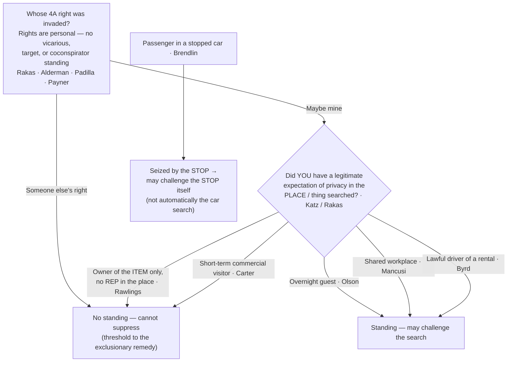

# Standing to Challenge a Search

## The Brief

**Field-decisive question:** *Can THIS defendant challenge the search — were HIS OWN Fourth Amendment rights violated?*

**"Standing" is not a separate doctrine — it is the merits.** The question is never "was the search illegal for someone"; it is whether *this* defendant had a **personal, legitimate expectation of privacy** in the place or thing searched. Fourth Amendment rights are personal and cannot be borrowed: "Fourth Amendment rights are personal rights which, like some other constitutional rights, may not be vicariously asserted." *[[Rakas v. Illinois#^pin-133|Rakas v. Illinois]]*, 439 U.S. 128, 133–34 (1978). *[[Rakas v. Illinois|Rakas]]* folded the old "standing" label into the substantive inquiry: "capacity to claim the protection of the Fourth Amendment depends not upon a property right in the invaded place but upon whether the person who claims the protection of the Amendment has a **legitimate expectation of privacy in the invaded place**." *[[Rakas v. Illinois#^pin-143|Id.]]* at 143. The measure of that expectation is the *[[Katz v. United States|Katz]]* test — an "actual (subjective) expectation of privacy" that "society is prepared to recognize as 'reasonable.'" *[[Katz v. United States#^pin-361|Katz v. United States]]*, 389 U.S. 347, 361 (1967) (Harlan, J., concurring). The rule that suppression is personal predates the merger and survives it: "suppression of the product of a Fourth Amendment violation can be successfully urged only by those whose rights were violated by the search itself, not by those who are aggrieved solely by the introduction of damaging evidence. Coconspirators and codefendants have been accorded no special standing." *[[Alderman v. United States#^pin-171|Alderman v. United States]]*, 394 U.S. 165, 171–72 (1969).

**The old automatic / "target" standing is gone — treat it as history.** *[[Jones v. United States|Jones (1960)]]* once gave a defendant charged with a possessory offense "**automatic standing**," *[[Jones v. United States#^pin-264|Jones v. United States]]*, 362 U.S. 257, 264 (1960), and gave standing to "**anyone legitimately on premises** where a search occurs," *[[Jones v. United States#^pin-267|Id.]]* at 267. Both grounds are **overruled**. *[[United States v. Salvucci|Salvucci]]* abolished automatic standing: "defendants charged with crimes of possession may only claim the benefits of the exclusionary rule if their own Fourth Amendment rights have in fact been violated. The automatic standing rule of *Jones v. United States* . . . is therefore overruled." *[[United States v. Salvucci#^pin-85|United States v. Salvucci]]*, 448 U.S. 83, 85 (1980). *[[Rakas v. Illinois|Rakas]]* disavowed the broad "legitimately on premises" test. So there is **no vicarious, target, or derivative standing**: a co-defendant or co-conspirator gains nothing from the label. *[[United States v. Padilla|Padilla]]* rejected a "coconspirator exception" — "Participants in a criminal conspiracy may have such expectations or interests, but the conspiracy itself **neither adds to nor detracts from** them." *[[United States v. Padilla#^pin-82|United States v. Padilla]]*, 508 U.S. 77, 82 (1993). And *[[United States v. Payner|Payner]]* held a court may not use its supervisory power as a back door around the requirement: "the interest in deterring illegal searches does not justify the exclusion of tainted evidence at the instance of a party who was not the victim of the challenged practices." *[[United States v. Payner#^pin-735|United States v. Payner]]*, 447 U.S. 727, 735 (1980).

**Place searched ≠ item seized.** Owning the *thing seized* is not the same as a privacy interest in the *place searched*. After *[[Rakas v. Illinois|Rakas]]*, "the two inquiries merge into one: whether governmental officials violated any **legitimate expectation of privacy** held by petitioner," and ownership "is undoubtedly one fact to be considered" but does not control. *[[Rawlings v. Kentucky#^pin-106|Rawlings v. Kentucky]]*, 448 U.S. 98, 105–06 (1980). A defendant who dumped his drugs into a companion's purse he had no right to control could not challenge its search, even though the drugs were his. Establish a privacy or possessory interest in the **place**, not the loot.

**Status on the premises decides house cases.** An **overnight guest** has a reasonable expectation of privacy in the host's home: "society recognizes that a houseguest has a legitimate expectation of privacy in his host's home." *[[Minnesota v. Olson#^pin-98|Minnesota v. Olson]]*, 495 U.S. 91, 98 (1990). A **short-term visitor there for a purely commercial errand** does not: "an overnight guest in a home may claim the protection of the Fourth Amendment, but one who is **merely present with the consent of the householder** may not." *[[Minnesota v. Carter#^pin-90|Minnesota v. Carter]]*, 525 U.S. 83, 90 (1998) (visitor present a few hours only to bag cocaine, no prior relationship). The line is one of duration, relationship to the householder, and purpose. Privacy in a shared **workplace** can also suffice: an employee sharing an office had standing because "the area was one in which there was a reasonable expectation of freedom from governmental intrusion." *[[Mancusi v. DeForte#^pin-368|Mancusi v. DeForte]]*, 392 U.S. 364, 368 (1968). The same place-based inquiry reaches a **tent** used as a temporary dwelling — even on public land (see [[Tents]]; *[[United States v. Sandoval]]*, **Binding in-circuit — 9th Cir.**, good).

**Vehicles — keep the driver and the passenger straight.** A driver in **lawful possession and control of a rental car** generally has a reasonable expectation of privacy in it "even if the rental agreement does not list him or her as an authorized driver." *[[Byrd v. United States#^pin-op2|Byrd v. United States]]*, 584 U.S. 395 (2018) (slip op., at 2). That is the threshold *before* any [[Automobile Exception]] question about the lawfulness of the search itself. A mere **passenger** is different: under *[[Rakas v. Illinois|Rakas]]* a passenger with no possessory or privacy interest cannot challenge a **search** of the car — but a passenger *is* **seized** by the stop and so "may challenge the constitutionality of the **stop**." *[[Brendlin v. California#^pin-251b|Brendlin v. California]]*, 551 U.S. 249, 251 (2007). Challenge-the-stop ([[Traffic Stops]] / [[Seizure of the Person]]) and challenge-the-search are two different keys — keep them crisp.

**Burden · standard of review · remedy.** The proponent of suppression — the **defendant-movant** — bears the burden of establishing a **legitimate expectation of privacy** (or possessory interest) in the place or thing searched, by a **preponderance of the evidence**. *[[Rakas v. Illinois]]*, 439 U.S. at 130–31 n.1; *[[Rawlings v. Kentucky]]*, 448 U.S. at 104–05. On appeal from a suppression ruling, the trial court's historical fact findings are reviewed for **clear error** and the ultimate expectation-of-privacy / standing determination **de novo**. The **remedy** for a defendant who carries the burden is **suppression** of the evidence and its fruits ([[The Exclusionary Rule]]); standing is the **threshold** to that remedy — without it, even a plainly unlawful search yields no suppression for *this* defendant. A companion protection keeps the threshold from becoming a trap: testimony a defendant gives at a suppression hearing to establish standing "may not thereafter be admitted against him at trial on the issue of guilt." *[[Simmons v. United States#^pin-394|Simmons v. United States]]*, 390 U.S. 377, 394 (1968).

**Pitfalls to flag for the field.** (1) **Treating ownership of the item as standing.** "It's his dope, so he can't complain it was found" is backwards — *[[United States v. Salvucci|Salvucci]]* / *[[Rawlings v. Kentucky|Rawlings]]*: owning the seized item neither defeats nor establishes standing; the question is the expectation of privacy in the **place** searched. (2) **Reaching for "automatic standing."** It is gone — cite *[[Jones v. United States|Jones]]* only as history. (3) **Confusing constructive possession with 4A standing.** Constructive possession (and willful blindness) go to **guilt / mens rea**, not privacy; a defendant can constructively possess contraband yet have no expectation of privacy where it was found, and vice versa. (4) **Letting a passenger challenge the *search* off the *stop*.** *[[Brendlin v. California|Brendlin]]* gives a passenger the **stop**, not automatically the car search (still *[[Rakas v. Illinois|Rakas]]*). (5) **Forgetting that disclaiming an interest forfeits standing.** Denying ownership or walking away can extinguish the very expectation of privacy the defendant later needs (see [[Abandonment]]).

## Key cases

| Case | Holding in one line | Weight | Treatment | CourtListener |
|---|---|---|---|---|
| *[[Rakas v. Illinois]]*, 439 U.S. 128 (1978) | **Anchor.** Fourth Amendment rights are **personal**; "standing" merges into the merits — the question is whether **your own** legitimate expectation of privacy in the place searched was infringed. Passengers with no possessory/privacy interest cannot challenge a car search. | Binding — SCOTUS | good *(2026-06-30)* | [link](https://www.courtlistener.com/opinion/109953/rakas-v-illinois/) |
| *[[Katz v. United States]]*, 389 U.S. 347 (1967) | **Anchor.** Fourth Amendment protects **people, not places**; supplies the reasonable-expectation-of-privacy test (Harlan: subjective expectation + one society recognizes as reasonable) that measures whose rights were invaded. | Binding — SCOTUS | good *(2026-06-30)* | [link](https://www.courtlistener.com/opinion/107564/katz-v-united-states/) |
| *[[Alderman v. United States]]*, 394 U.S. 165 (1969) | **Anchor — no vicarious assertion.** Suppression may be urged only by those whose **own** rights the search violated; co-defendants and co-conspirators get **no special standing**. | Binding — SCOTUS | good *(2026-06-30)* | [link](https://www.courtlistener.com/opinion/107872/alderman-v-united-states/) |
| *[[Jones v. United States]]*, 362 U.S. 257 (1960) | **Historical foil.** Created "automatic standing" for possessory charges and "legitimately on premises" standing — **both later overruled**; cite only as history. | Historical | **overruled** *(2026-06-30)* — automatic standing overruled by *[[United States v. Salvucci|Salvucci]]*; "legitimately on premises" disavowed by *[[Rakas v. Illinois|Rakas]]* | [link](https://www.courtlistener.com/opinion/106022/jones-v-united-states/) |
| *[[United States v. Salvucci]]*, 448 U.S. 83 (1980) | **Progeny.** Abolished **automatic standing**; a defendant charged with a possessory crime must show **his own** Fourth Amendment rights were violated — possession of the goods is not enough. | Binding — SCOTUS | good *(2026-06-30)* | [link](https://www.courtlistener.com/opinion/110325/united-states-v-salvucci/) |
| *[[Rawlings v. Kentucky]]*, 448 U.S. 98 (1980) | **Progeny — place ≠ item.** Owning the drugs seized from a companion's purse gave **no** reasonable expectation of privacy in the purse; the two inquiries merge into whether **your** REP in the place was invaded. | Binding — SCOTUS | good *(2026-06-30)* | [link](https://www.courtlistener.com/opinion/110326/rawlings-v-kentucky/) |
| *[[Minnesota v. Olson]]*, 495 U.S. 91 (1990) | **Progeny.** An **overnight guest** has a reasonable expectation of privacy in the host's home and may challenge a warrantless entry. | Binding — SCOTUS | good *(2026-06-30)* — bounded by *[[Minnesota v. Carter|Carter]]* | [link](https://www.courtlistener.com/opinion/112416/minnesota-v-olson/) |
| *[[Minnesota v. Carter]]*, 525 U.S. 83 (1998) | **Progeny — the boundary of *Olson*.** A **short-term commercial visitor** (bagging drugs a few hours, no prior relationship, no overnight stay) has **no** reasonable expectation of privacy in the home. | Binding — SCOTUS | good *(2026-06-30)* | [link](https://www.courtlistener.com/opinion/118249/minnesota-v-carter/) |
| *[[Byrd v. United States]]*, 584 U.S. 395 (2018) | **Progeny.** A driver in **lawful possession and control** of a rental car generally has a reasonable expectation of privacy in it, even if not listed on the rental agreement. | Binding — SCOTUS | good *(2026-06-30)* | [link](https://www.courtlistener.com/opinion/4497658/byrd-v-united-states/) |
| *[[Brendlin v. California]]*, 551 U.S. 249 (2007) | **Progeny — challenge the stop.** When a car is stopped, a **passenger is seized** just as the driver is, and may challenge the constitutionality of the **stop** (distinct from standing to challenge a search of the car). | Binding — SCOTUS | good *(2026-06-30)* | [link](https://www.courtlistener.com/opinion/145712/brendlin-v-california/) |
| *[[Mancusi v. DeForte]]*, 392 U.S. 364 (1968) | **Progeny — shared workplace.** An employee can have a reasonable expectation of privacy in a **shared office** and standing to challenge its search; capacity turns on REP in the area, not a property right. | Binding — SCOTUS | good *(2026-06-30)* | [link](https://www.courtlistener.com/opinion/107745/mancusi-v-deforte/) |
| *[[Simmons v. United States]]*, 390 U.S. 377 (1968) | **Progeny — the standing companion.** Testimony a defendant gives at a **suppression hearing** to establish standing may **not** be used against him at trial on guilt (no forced trade of one constitutional right for another). | Binding — SCOTUS | good *(2026-06-30)* | [link](https://www.courtlistener.com/opinion/107636/simmons-v-united-states/) |
| *[[United States v. Padilla]]*, 508 U.S. 77 (1993) | **Progeny — no coconspirator exception.** A supervisory role in or joint control over a conspiracy does not by itself confer standing; the conspiracy "neither adds to nor detracts from" a defendant's personal privacy/property interest. | Binding — SCOTUS | good *(2026-06-30)* | [link](https://www.courtlistener.com/opinion/112856/united-states-v-padilla/) |
| *[[United States v. Payner]]*, 447 U.S. 727 (1980) | **Progeny — no back door.** A federal court may **not** use its supervisory power to suppress evidence seized in the deliberate violation of a **third party's** rights at the instance of a defendant whose own rights were not violated. | Binding — SCOTUS | good *(2026-06-30)* | [link](https://www.courtlistener.com/opinion/110317/united-states-v-payner/) |

## Related cases across doctrines

These are treated in full on other doctrine pages but bear directly on standing here — the reasonable-expectation-of-privacy that grounds standing can be shrunk (or preserved) by status, and framed for this page.

| Case | Relevance to standing (framed here) | Primary home (doctrine) | Treatment | CourtListener |
|---|---|---|---|---|
| *[[Samson v. California]]*, 547 U.S. 843 (2006) | A **parolee** subject to a search condition has a severely diminished (near-zero) reasonable expectation of privacy — the REP that defines standing can be reduced to almost nothing by status. | [[Special Needs and Administrative Searches]] | good *(2026-06-30)* | [opinion](https://www.courtlistener.com/opinion/145640/samson-v-california/) |
| *[[United States v. Knights]]*, 534 U.S. 112 (2001) | A **probationer's** expectation of privacy is significantly diminished by a valid search condition; supervision status shrinks the REP that grounds any standing to object. | [[Special Needs and Administrative Searches]] | good *(2026-06-30)* | [opinion](https://www.courtlistener.com/opinion/118468/united-states-v-knights/) |
| *[[Collins v. Virginia]]*, 584 U.S. 586 (2018) | A resident retains a **full** reasonable expectation of privacy in the **curtilage** where his vehicle is parked — the home/curtilage REP that confers standing is not dissolved by the automobile exception. | [[Automobile Exception]] | good *(2026-06-30)* | [opinion](https://www.courtlistener.com/opinion/4501697/collins-v-virginia/) |

## Recent developments

Role-based circuit developments only — **no SCOTUS** (the controlling Supreme Court cases home to Key cases regardless of date). The standing inquiry — *whose* reasonable expectation of privacy was invaded — is being worked out at the circuit level for traditional places (hotels, rental cars) and, at the frontier, for the digital data *[[Carpenter v. United States|Carpenter]]* opened up. Note: the geofence cases below are decided on the **search-definition threshold** (*whether* obtaining bulk location data is a search), reached through the same reasonable-expectation-of-privacy inquiry that grounds standing — they are **not** standing holdings about *whose* expectation was invaded (see [[Two Definitions of Search]]).

- **Status-on-the-premises extended to hotel checkout — *United States v. Mendoza* (3d Cir. 2026).** *Doctrine-extension flag.* In a precedential opinion the Third Circuit held a hotel guest has **no** objectively reasonable expectation of privacy in the room roughly five hours after the posted noon checkout, absent any late-checkout arrangement — lawful occupancy (and thus standing) ends when the right to occupy ends, extending the *[[Minnesota v. Olson|Olson]]* / *[[Minnesota v. Carter|Carter]]* "status on the premises" line into the checkout context. The panel did **not** adopt checkout as a bright line for all cases; it noted circuits disagree on a "grace period" for stragglers and held only that this unambiguous five-hour case "does not raise a close question." **Binding in-circuit — 3d Cir.** · good. [opinion](https://www.courtlistener.com/opinion/10771114/united-states-v-ryan-mendoza/)
- **Narrowing *Byrd*'s "lawful possession" — *United States v. Lyle* (2d Cir. 2019).** *Limits / narrows flag.* An **unlicensed** driver operating a rental car without the rental company's permission is, like a car thief, unlawfully in possession and has **no** reasonable expectation of privacy — so no standing — even though the authorized renter (his girlfriend) let him drive. Reads *[[Byrd v. United States|Byrd]]*'s lawful-possession requirement narrowly; the court expressly declined to decide whether an unauthorized-but-**licensed** driver alone would have standing. **Binding in-circuit — 2d Cir.** · good. [opinion](https://www.courtlistener.com/opinion/8443943/united-states-v-lyle/)
- **Geofence / bulk-location split — *United States v. Chatrie* (4th Cir. 2024).** *Circuit split — first impression.* The panel held that obtaining a short (~2-hour) window of Google Location History was **not** a Fourth Amendment search (voluntarily shared, opt-in; third-party doctrine; *[[Carpenter v. United States|Carpenter]]* does not extend). On rehearing en banc the court affirmed on other grounds while fracturing (equally divided) on whether a search occurred. **Binding in-circuit — 4th Cir.** · good. ⚖ Circuit split with the Fifth Circuit. [opinion](https://www.courtlistener.com/opinion/10265776/united-states-v-okello-chatrie/)
- **Geofence warrants unconstitutional — *United States v. Smith* (5th Cir. 2024).** *Circuit split — first impression.* Obtaining Google Location History via a geofence **invades** a reasonable expectation of privacy and **is** a Fourth Amendment search; geofence warrants are "modern-day general warrants" and categorically unconstitutional — though evidence was not suppressed under the *[[United States v. Leon|Leon]]* good-faith exception given the novelty of the technology. Squarely conflicts with the en banc *[[Two Definitions of Search|Chatrie]]* outcome. **Binding in-circuit — 5th Cir.** · good. ⚖ Circuit split with the Fourth Circuit. [opinion](https://www.courtlistener.com/opinion/10036119/united-states-v-smith/)

## Visual

## Sources

- *Rakas v. Illinois*, 439 U.S. 128 (1978) — pinpoints 130–31 n.1, 133–34, 143 — https://www.courtlistener.com/opinion/109953/rakas-v-illinois/
- *Katz v. United States*, 389 U.S. 347 (1967) — pinpoints 351, 361 (Harlan, J., concurring) — https://www.courtlistener.com/opinion/107564/katz-v-united-states/
- *Alderman v. United States*, 394 U.S. 165 (1969) — pinpoints 171–72, 174 — https://www.courtlistener.com/opinion/107872/alderman-v-united-states/
- *Jones v. United States*, 362 U.S. 257 (1960) — pinpoints 264, 267 *(overruled by Rakas & Salvucci; Historical)* — https://www.courtlistener.com/opinion/106022/jones-v-united-states/
- *United States v. Salvucci*, 448 U.S. 83 (1980) — pinpoint 85 — https://www.courtlistener.com/opinion/110325/united-states-v-salvucci/
- *Rawlings v. Kentucky*, 448 U.S. 98 (1980) — pinpoints 104–05, 105, 106 — https://www.courtlistener.com/opinion/110326/rawlings-v-kentucky/
- *Minnesota v. Olson*, 495 U.S. 91 (1990) — pinpoint 98 — https://www.courtlistener.com/opinion/112416/minnesota-v-olson/
- *Minnesota v. Carter*, 525 U.S. 83 (1998) — pinpoint 90 — https://www.courtlistener.com/opinion/118249/minnesota-v-carter/
- *Byrd v. United States*, 584 U.S. 395 (2018) — pinpoint slip op., at 2 — https://www.courtlistener.com/opinion/4497658/byrd-v-united-states/
- *Brendlin v. California*, 551 U.S. 249 (2007) — pinpoint 251 — https://www.courtlistener.com/opinion/145712/brendlin-v-california/
- *Mancusi v. DeForte*, 392 U.S. 364 (1968) — pinpoints 368, 369 — https://www.courtlistener.com/opinion/107745/mancusi-v-deforte/
- *Simmons v. United States*, 390 U.S. 377 (1968) — pinpoint 394 — https://www.courtlistener.com/opinion/107636/simmons-v-united-states/
- *United States v. Padilla*, 508 U.S. 77 (1993) — pinpoint 82 — https://www.courtlistener.com/opinion/112856/united-states-v-padilla/
- *United States v. Payner*, 447 U.S. 727 (1980) — pinpoints 735, 736 — https://www.courtlistener.com/opinion/110317/united-states-v-payner/
- *Samson v. California*, 547 U.S. 843 (2006) *(REP diminished by parole status; home = [[Special Needs and Administrative Searches]])* — https://www.courtlistener.com/opinion/145640/samson-v-california/
- *United States v. Knights*, 534 U.S. 112 (2001) *(REP diminished by probation condition; home = [[Special Needs and Administrative Searches]])* — https://www.courtlistener.com/opinion/118468/united-states-v-knights/
- *Collins v. Virginia*, 584 U.S. 586 (2018) *(full curtilage REP retained; home = [[Automobile Exception]])* — https://www.courtlistener.com/opinion/4501697/collins-v-virginia/
- *United States v. Mendoza*, 3d Cir. 2026 *(Binding in-circuit — 3d Cir.; hotel-checkout REP)* — https://www.courtlistener.com/opinion/10771114/united-states-v-ryan-mendoza/
- *United States v. Lyle*, 2d Cir. 2019 *(Binding in-circuit — 2d Cir.; narrows Byrd lawful-possession)* — https://www.courtlistener.com/opinion/8443943/united-states-v-lyle/
- *United States v. Chatrie*, 4th Cir. 2024 (en banc) *(Binding in-circuit — 4th Cir.; geofence search-threshold; ⚖ split — see [[Two Definitions of Search]])* — https://www.courtlistener.com/opinion/10265776/united-states-v-okello-chatrie/
- *United States v. Smith*, 5th Cir. 2024 *(Binding in-circuit — 5th Cir.; geofence search-threshold; ⚖ split — see [[Two Definitions of Search]])* — https://www.courtlistener.com/opinion/10036119/united-states-v-smith/
