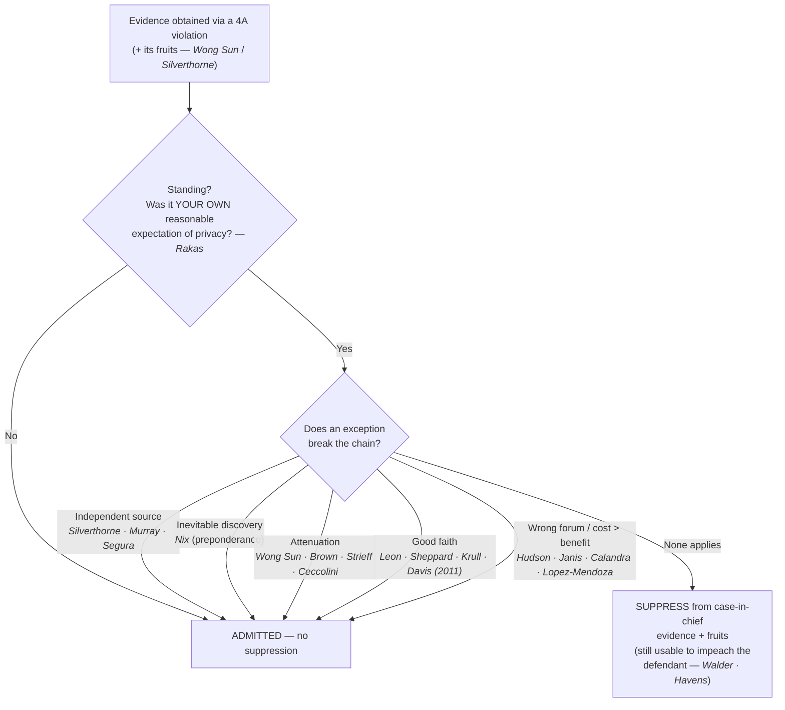

# The Exclusionary Rule

## The Brief

**Field-decisive question — *Will this evidence be suppressed, or does an exception save it?*** When a Fourth Amendment violation produces evidence, the fight is rarely "was there a violation" alone — it is whether the remedy of **exclusion** actually follows. It usually does not follow automatically. Run the evidence through the sequence: **standing gate → fruit-of-the-poisonous-tree reach → four escape hatches → cost-benefit boundaries**, and only if it survives all four is it suppressed.

**The rule.** The exclusionary rule bars the prosecution from using, in its **case-in-chief**, evidence obtained in violation of the Fourth Amendment **and the "fruits" of that violation** (derivative evidence). It is **not a personal constitutional right** — it is a **judicially created remedy** whose primary modern justification is **deterring police misconduct**. *[[United States v. Calandra#Rule|Calandra]]*: the rule is "a judicially created remedy designed to safeguard Fourth Amendment rights generally through its deterrent effect, rather than a personal constitutional right of the party aggrieved." 414 U.S. at 348. It began as a **federal** rule in *[[Weeks v. United States#Rule|Weeks]]* (1914) and was extended to the **states** through the Fourteenth Amendment in *[[Mapp v. Ohio#Rule|Mapp]]* (1961), which overruled *[[Wolf v. Colorado|Wolf v. Colorado]]* on the remedy. The engine is **deterrence**, not "judicial integrity": *[[Elkins v. United States#Rule|Elkins]]* abolished the "silver-platter doctrine" and framed the rule's purpose as "to deter — to compel respect for the constitutional guaranty in the only effectively available way — by removing the incentive to disregard it." 364 U.S. at 217.

Because it is a deterrent remedy and not a right, the modern Court applies a **cost-benefit test**: suppression follows **only** where its deterrence benefits **outweigh** its substantial social costs, and only for conduct culpable enough that exclusion can meaningfully deter it. *[[Herring v. United States#Rule|Herring]]*: "To trigger the exclusionary rule, police conduct must be sufficiently deliberate that exclusion can meaningfully deter it, and sufficiently culpable that such deterrence is worth the price paid by the justice system." 555 U.S. at 144.

**Fruit of the poisonous tree (how far suppression reaches).** Suppression is not limited to the evidence seized in the unlawful act; it reaches **derivative** evidence — the "fruit of the poisonous tree." The doctrine originates in *[[Silverthorne Lumber Co. v. United States#Rule|Silverthorne Lumber]]* ("the knowledge gained by the Government's own wrong cannot be used by it," 251 U.S. at 392) and was named in *[[Nardone v. United States|Nardone]]*. But the fruits doctrine is **not** but-for causation. *[[Wong Sun v. United States#Rule|Wong Sun]]* sets the test: the question is "whether, granting establishment of the primary illegality, the evidence to which instant objection is made has been come at by exploitation of that illegality or instead by means sufficiently distinguishable to be purged of the primary taint." 371 U.S. at 487–88. Evidence merely traceable "but for" the illegality is not automatically suppressed.

**The four escape hatches (stated up front).** Even where a violation and its fruits are established, the evidence still comes in if **any one** of these applies — and the **government bears the burden** of establishing the exception:

1. **Independent source** — the evidence *was in fact* also obtained through a lawful source genuinely independent of the illegality. *[[Murray v. United States#Rule|Murray]]*: admissible if "the search pursuant to warrant was in fact a genuinely independent source," but **not** if the decision to seek the warrant "was prompted by what they had seen during the initial entry." 487 U.S. at 542. Companion: *[[Segura v. United States|Segura]]* (valid warrant resting wholly on pre-entry information); applied to an in-court identification with independent origins in *[[United States v. Crews|Crews]]*.
2. **Inevitable discovery** — the evidence *would* have been found anyway by lawful means. *[[Nix v. Williams#Rule|Nix]]*: admissible if the prosecution "establish[es] by a preponderance of the evidence that the information ultimately or inevitably would have been discovered by lawful means." 467 U.S. at 444.
3. **Attenuation** — the causal chain is so weakened that the taint is purged. Governed by the *[[Brown v. Illinois#Rule|Brown]]* factors: **(a) temporal proximity · (b) intervening circumstances · (c) — most important — the purpose and flagrancy of the misconduct.** 422 U.S. at 603–04. *Miranda* warnings **alone** do not purge the taint (*Brown*). A valid **pre-existing arrest warrant** discovered mid-stop is an intervening circumstance that attenuates (*[[Utah v. Strieff#Rule|Strieff]]*, 579 U.S. at 241). Live-witness testimony is suppressed only on a **much closer** connection to the illegality than an object (*[[United States v. Ceccolini#Rule|Ceccolini]]*, 435 U.S. at 280). Contrast the attenuation-**failed** cases: a confession following a warrantless, probable-cause-less arrest is ordinarily **not** purged (*[[Taylor v. Alabama|Taylor v. Alabama]]*; *[[Dunaway v. New York|Dunaway]]*; *[[Kaupp v. Texas|Kaupp]]*).
4. **Good faith** — objectively reasonable reliance on an authority later found invalid deters nothing, so exclusion is unwarranted. *[[United States v. Leon#Rule|Leon]]*: reliance on a warrant later found to lack probable cause (468 U.S. at 922); *[[Massachusetts v. Sheppard|Sheppard]]* (warrant defective **in form**); *[[Illinois v. Krull|Krull]]* (reliance on a **statute** later held unconstitutional); *[[Michigan v. DeFillippo|DeFillippo]]* (a presumptively valid **ordinance**); *[[Arizona v. Evans|Evans]]* (court-clerk **clerical error**); and *[[Davis v. United States (2011)#Rule|Davis (2011)]]* (reliance on **binding appellate precedent** later overturned). Good faith **FAILS** in *Leon*'s four situations (468 U.S. at 923): (1) a knowing/reckless **false affidavit** (*[[Franks v. Delaware|Franks]]*); (2) a magistrate who **wholly abandoned the neutral-and-detached role** (*[[Lo-Ji Sales, Inc. v. New York|Lo-Ji Sales]]*); (3) a **bare-bones affidavit** "so lacking in indicia of probable cause" that official belief is unreasonable; and (4) a **facially overbroad / general warrant** (*[[United States v. Leary|Leary]]*, 10th Cir.). Circuit applications where good faith held: *[[United States v. Mathis|Mathis]]* (11th Cir., arguable probable cause) and *[[United States v. Jackson|Jackson]]* (8th Cir., probable-cause-deficient application).

**Cost-benefit boundaries — where the rule does not reach.** Its deterrence logic keeps it out of many settings entirely:
- A **knock-and-announce** violation does **not** trigger suppression — those interests "have nothing to do with the seizure of the evidence." *[[Hudson v. Michigan#Rule|Hudson]]*, 547 U.S. at 594.
- It does not apply to **grand-jury** questioning (*[[United States v. Calandra|Calandra]]*), to a **federal civil** (tax) proceeding on state-seized evidence (*[[United States v. Janis#Rule|Janis]]*), to **civil deportation** hearings (*[[Immigration & Naturalization Service v. Lopez-Mendoza#Rule|Lopez-Mendoza]]*), or to **parole-revocation** hearings (*[[Pennsylvania Board of Probation and Parole v. Scott|Pennsylvania Bd. of Probation & Parole v. Scott]]*).
- A violation of **state law** is not, for that reason, a Fourth Amendment violation, so it triggers **no federal suppression** (*[[Virginia v. Moore|Virginia v. Moore]]* — cross-link [[Search Incident to Arrest]]). Always separate the **constitutional** question from the state-law question.

**The impeachment exception.** Suppression bars the prosecution's **case-in-chief**, not the truth-testing of a defendant who takes the stand and lies. Illegally seized evidence and *Miranda*-defective statements may be used to **impeach the defendant's own testimony**: *[[Walder v. United States#Rule|Walder]]* (physical evidence), *[[United States v. Havens#Rule|Havens]]* (statements on cross reasonably suggested by the direct), and *[[Harris v. New York|Harris v. New York]]* (*Miranda*-defective statements — cross-link [[Miranda Waiver and Invocation]]). But the exception is **confined to the defendant himself**: it may not impeach **other defense witnesses** (*[[James v. Illinois#Rule|James v. Illinois]]*), and a genuinely **coerced/involuntary** statement is barred even for impeachment.

**The threshold gate — standing.** Before any of this, suppression is available **only** to a defendant whose **own** Fourth Amendment rights were violated — rights are personal and "may not be vicariously asserted." *[[Rakas v. Illinois#Rule|Rakas]]*, 439 U.S. at 133–34. **No standing → no suppression**, even where officers plainly violated *someone's* rights. Standing is now taught in full on **[[Standing to Challenge a Search]]**; this page keeps it only as the threshold to the remedy.

**Burden · standard of review · remedy.** The **defendant/movant** bears the burden of showing a violation and standing (his own reasonable expectation of privacy, by a preponderance — see [[Standing to Challenge a Search]]); once a violation is shown, the **government** bears the burden of proving an **exception** (e.g., inevitable discovery "by a preponderance," *Nix*). On appeal, a suppression ruling's **historical facts** are reviewed for **clear error** and the **ultimate constitutional/reasonableness** determinations **de novo** (*[[Ornelas v. United States|Ornelas]]* — cross-link [[Probable Cause and Reasonable Suspicion]]). The **remedy** is exclusion of the evidence and its fruits from the prosecution's case-in-chief — **not** dismissal of the prosecution, and subject to the impeachment use above.

**Pitfalls.** Treating exclusion as a personal "right" — it is a **deterrent remedy** (*Calandra*), which is exactly why the exceptions and cost-benefit analysis exist. Assuming any 4A violation automatically suppresses — it follows only where **deterrence benefits outweigh costs** (*Herring*), and only after you clear standing and the exceptions. Forgetting standing is a threshold (**no standing = no suppression**, *Rakas*). Thinking good faith cures everything — it does **not** rescue a bare-bones or facially overbroad warrant, a dishonest affidavit, or a biased magistrate (*Leon*'s four limits). **Confusing inevitable discovery with independent source** — *Nix* is what **would** have happened lawfully; *Murray* is a lawful source that **actually** produced the evidence, untainted. And presenting a **state** independent-source case (*[[State v. Mitcham|Mitcham]]*, Ariz.) as the federal rule — pair it with *Murray*, never cite it as the controlling federal standard.

## Key cases

**Foundations & rationale (why the rule exists)**

| Case | Holding (one line) | Weight | Treatment | CourtListener |
|---|---|---|---|---|
| *[[Weeks v. United States]]*, 232 U.S. 383 (1914) | **Origin** of the federal exclusionary rule — 4A-violative evidence is inadmissible in federal court. | Binding — SCOTUS | good | [opinion](https://www.courtlistener.com/opinion/98094/weeks-v-united-states/) |
| *[[Wolf v. Colorado]]*, 338 U.S. 25 (1949) | The 4A binds the states, but its federal exclusionary **remedy** did not — **overruled on the remedy by *Mapp***. | Historical | overruled (*Mapp*, 1961) | [opinion](https://www.courtlistener.com/opinion/104709/wolf-v-colorado/) |
| *[[Mapp v. Ohio]]*, 367 U.S. 643 (1961) | Applies the exclusionary rule **to the states** through the Fourteenth Amendment. | Binding — SCOTUS | good | [opinion](https://www.courtlistener.com/opinion/106285/mapp-v-ohio/) |
| *[[Elkins v. United States]]*, 364 U.S. 206 (1960) | Abolished the **"silver-platter" doctrine**; the rule's purpose is **deterrence** ("removing the incentive to disregard" the guaranty). | Binding — SCOTUS | good | [opinion](https://www.courtlistener.com/opinion/106107/elkins-v-united-states/) |
| *[[United States v. Calandra]]*, 414 U.S. 338 (1974) | The rule is a **judicially-created deterrent remedy, not a personal right**; it does **not** apply to grand-jury questioning. | Binding — SCOTUS | good | [opinion](https://www.courtlistener.com/opinion/108898/united-states-v-calandra/) |
| *[[Herring v. United States]]*, 555 U.S. 135 (2009) | **Cost-benefit / culpability** — suppression only where deterrence benefits outweigh costs; isolated, attenuated negligence does not trigger exclusion. | Binding — SCOTUS | good | [opinion](https://www.courtlistener.com/opinion/145922/herring-v-united-states/) |

**Fruit of the poisonous tree & the four escape hatches**

| Case | Holding (one line) | Weight | Treatment | CourtListener |
|---|---|---|---|---|
| *[[Silverthorne Lumber Co. v. United States]]*, 251 U.S. 385 (1920) | **FOTPT origin** — illegally obtained evidence "shall not be used at all," but knowledge from a genuinely **independent source** may still be proved. | Binding — SCOTUS | good | [opinion](https://www.courtlistener.com/opinion/99506/silverthorne-lumber-co-v-united-states/) |
| *[[Nardone v. United States]]*, 308 U.S. 338 (1939) | Named **"fruit of the poisonous tree"**; derivative use is barred unless the taint is attenuated or independently sourced. | Binding — SCOTUS | good | [opinion](https://www.courtlistener.com/opinion/103259/nardone-v-united-states/) |
| *[[Wong Sun v. United States]]*, 371 U.S. 471 (1963) | **FOTPT test** — suppress fruits "come at by **exploitation**" of the illegality, not on mere but-for causation. | Binding — SCOTUS | good | [opinion](https://www.courtlistener.com/opinion/106515/wong-sun-v-united-states/) |
| *[[Murray v. United States]]*, 487 U.S. 533 (1988) | **Independent source** — evidence first seen in an unlawful entry is admissible if later acquired through a **genuinely independent** lawful source. | Binding — SCOTUS | good | [opinion](https://www.courtlistener.com/opinion/112136/murray-v-united-states/) |
| *[[United States v. Crews]]*, 445 U.S. 463 (1980) | Independent source — an in-court identification whose elements antedate / are independent of the illegal arrest is admissible. | Binding — SCOTUS | good | [opinion](https://www.courtlistener.com/opinion/110230/united-states-v-crews/) |
| *[[Nix v. Williams]]*, 467 U.S. 431 (1984) | **Inevitable discovery** — admissible if the government proves by a **preponderance** it would inevitably have been found by lawful means. | Binding — SCOTUS | good | [opinion](https://www.courtlistener.com/opinion/111204/nix-v-williams/) |
| *[[Brown v. Illinois]]*, 422 U.S. 590 (1975) | Supplies the **attenuation factors**: temporal proximity · intervening circumstances · **purpose & flagrancy**; *Miranda* warnings alone do not purge. | Binding — SCOTUS | good | [opinion](https://www.courtlistener.com/opinion/109304/brown-v-illinois/) |
| *[[Utah v. Strieff]]*, 579 U.S. 232 (2016) | **Attenuation** — a valid pre-existing **arrest warrant** found during an unlawful stop is an intervening circumstance that purges the taint. | Binding — SCOTUS | good | [opinion](https://www.courtlistener.com/opinion/8176208/utah-v-strieff/) |
| *[[United States v. Ceccolini]]*, 435 U.S. 268 (1978) | Attenuation — **live-witness** testimony is suppressed only on a much closer connection to the illegality than an inanimate object. | Binding — SCOTUS | good | [opinion](https://www.courtlistener.com/opinion/109816/united-states-v-ceccolini/) |
| *[[Taylor v. Alabama]]*, 457 U.S. 687 (1982) | Attenuation **failed** — a confession after a warrantless, PC-less arrest was not purged; suppressed. | Binding — SCOTUS | good | [opinion](https://www.courtlistener.com/opinion/110760/taylor-v-alabama/) |
| *[[United States v. Leon]]*, 468 U.S. 897 (1984) | **Good-faith exception** — objectively reasonable reliance on a warrant later found to lack PC; lists the **four** situations where good faith fails (at 923). | Binding — SCOTUS | good | [opinion](https://www.courtlistener.com/opinion/111262/united-states-v-leon/) |
| *[[Massachusetts v. Sheppard]]*, 468 U.S. 981 (1984) | *Leon*'s companion — good faith applies where the warrant was defective **in form** but officers reasonably relied on the judge. | Binding — SCOTUS | good | [opinion](https://www.courtlistener.com/opinion/111263/massachusetts-v-sheppard/) |
| *[[Illinois v. Krull]]*, 480 U.S. 340 (1987) | Good-faith reliance on a **statute** later held unconstitutional does not trigger exclusion. | Binding — SCOTUS | good | [opinion](https://www.courtlistener.com/opinion/111835/illinois-v-krull/) |
| *[[Michigan v. DeFillippo]]*, 443 U.S. 31 (1979) | Arrest under a presumptively valid **ordinance** later voided was valid; the search-incident evidence is admissible. | Binding — SCOTUS | good | [opinion](https://www.courtlistener.com/opinion/110127/michigan-v-defillippo/) |
| *[[Arizona v. Evans]]*, 514 U.S. 1 (1995) | Good faith extends to a mistaken arrest record from **court-employee clerical error**. | Binding — SCOTUS | good | [opinion](https://www.courtlistener.com/opinion/117905/arizona-v-evans/) |
| *[[Davis v. United States (2011)]]*, 564 U.S. 229 (2011) | Good faith extends to reliance on **binding appellate precedent** later overturned. | Binding — SCOTUS | good | [opinion](https://www.courtlistener.com/opinion/218926/davis-v-united-states/) |
| *[[United States v. Mathis]]*, 767 F.3d 1264 (11th Cir. 2014) | Good faith **applied** — objectively reasonable belief in PC even assuming the warrant lacked it. | Binding in-circuit — 11th Cir. | good | [opinion](https://www.courtlistener.com/opinion/2736649/united-states-v-arnold-maurice-mathis/) |
| *[[United States v. Jackson]]*, 784 F.3d 1227 (8th Cir. 2015) | Good faith **applied** — deputy relied in objectively reasonable good faith despite a PC-deficient warrant application. | Binding in-circuit — 8th Cir. | good | [opinion](https://www.courtlistener.com/opinion/2798587/united-states-v-ac-jackson/) |
| *[[United States v. Leary]]*, 846 F.2d 592 (10th Cir. 1988) | Good faith **unavailable** — a **facially overbroad / general warrant** is too deficient for objectively reasonable reliance (*Leon* limit 4). | Binding in-circuit — 10th Cir. | good | [opinion](https://www.courtlistener.com/opinion/505922/united-states-v-richard-j-leary-and-fl-kleinberg-co/) |

**Cost-benefit boundaries & the impeachment exception**

| Case | Holding (one line) | Weight | Treatment | CourtListener |
|---|---|---|---|---|
| *[[United States v. Janis]]*, 428 U.S. 433 (1976) | **Limit** — the rule does not bar state-seized evidence in a **federal civil** (tax) proceeding; deterrence benefit does not outweigh the cost. | Binding — SCOTUS | good | [opinion](https://www.courtlistener.com/opinion/109539/united-states-v-janis/) |
| *[[Immigration & Naturalization Service v. Lopez-Mendoza]]*, 468 U.S. 1032 (1984) | **Limit** — the rule generally does **not** apply in **civil removal/deportation** proceedings. | Binding — SCOTUS | good | [opinion](https://www.courtlistener.com/opinion/111265/immigration-naturalization-service-v-lopez-mendoza/) |
| *[[Pennsylvania Board of Probation and Parole v. Scott]]*, 524 U.S. 357 (1998) | **Limit** — the federal exclusionary rule does not bar evidence at **parole-revocation** hearings. | Binding — SCOTUS | good | [opinion](https://www.courtlistener.com/opinion/118235/pennsylvania-bd-of-probation-and-parole-v-scott/) |
| *[[Walder v. United States]]*, 347 U.S. 62 (1954) | **Impeachment exception** — illegally seized evidence may be used to impeach the **defendant's own** false testimony. | Binding — SCOTUS | good | [opinion](https://www.courtlistener.com/opinion/105188/walder-v-united-states/) |
| *[[United States v. Havens]]*, 446 U.S. 620 (1980) | Impeachment reaches the defendant's statements on **cross** reasonably suggested by his direct examination. | Binding — SCOTUS | good | [opinion](https://www.courtlistener.com/opinion/110267/united-states-v-havens/) |
| *[[James v. Illinois]]*, 493 U.S. 307 (1990) | **Limit** — the impeachment exception is **confined to the defendant's own testimony**; it may not impeach other defense witnesses. | Binding — SCOTUS | good | [opinion](https://www.courtlistener.com/opinion/112350/james-v-illinois/) |

## Related cases across doctrines

These cases are treated in full on other doctrine pages but bear directly on the exclusionary rule; each is framed below for its bearing on suppression.

| Case | Relevance to the exclusionary rule | Primary treatment | CourtListener |
|---|---|---|---|
| *[[Hudson v. Michigan]]*, 547 U.S. 586 (2006) | A **knock-and-announce** violation does **not** trigger suppression — the interests it protects are not served by exclusion (causation / cost-benefit limit). | [[The Warrant Requirement]] | [opinion](https://www.courtlistener.com/opinion/145646/hudson-v-michigan/) |
| *[[Segura v. United States]]*, 468 U.S. 796 (1984) | **Independent source** — evidence seized under a valid warrant resting wholly on **pre-entry** information is admissible despite an earlier illegal entry; the companion to *Murray*. | [[Securing the Scene]] | [opinion](https://www.courtlistener.com/opinion/111259/segura-v-united-states/) |
| *[[Franks v. Delaware]]*, 438 U.S. 154 (1978) | Good faith **fails** (*Leon* limit 1) — a knowing/reckless **false affidavit** voids the warrant and excludes the fruits. | [[The Warrant Requirement]] | [opinion](https://www.courtlistener.com/opinion/109925/franks-v-delaware/) |
| *[[Lo-Ji Sales, Inc. v. New York]]*, 442 U.S. 319 (1979) | Good faith **fails** (*Leon* limit 2) — a magistrate who **abandons the neutral-and-detached role** is no valid warrant-issuer. | [[The Warrant Requirement]] | [opinion](https://www.courtlistener.com/opinion/110100/lo-ji-sales-inc-v-new-york/) |
| *[[Rakas v. Illinois]]*, 439 U.S. 128 (1978) | The **standing** threshold — 4A rights are personal; a defendant must show **his own** legitimate expectation of privacy. No standing → no suppression. | [[Standing to Challenge a Search]] | [opinion](https://www.courtlistener.com/opinion/109953/rakas-v-illinois/) |
| *[[Dunaway v. New York]]*, 442 U.S. 200 (1979) | **Attenuation** — involuntary station-house detention without PC; the confession that followed was suppressed under the *Brown* factors. | [[Seizure of the Person]] | [opinion](https://www.courtlistener.com/opinion/110096/dunaway-v-new-york/) |
| *[[Kaupp v. Texas]]*, 538 U.S. 626 (2003) | **Attenuation failed** — a 3 a.m. warrantless removal without PC; the confession was not sufficiently purged of the taint. | [[Seizure of the Person]] | [opinion](https://www.courtlistener.com/opinion/127919/kaupp-v-texas/) |
| *[[New York v. Harris]]*, 495 U.S. 14 (1990) | A ***[[Payton v. New York|Payton]]*** violation does **not** require suppressing a later **out-of-home** statement where police had PC to arrest — a fruits/attenuation limit. | [[Arrest in the Home]] | [opinion](https://www.courtlistener.com/opinion/112413/new-york-v-harris/) |
| *[[Harris v. New York]]*, 401 U.S. 222 (1971) | **Impeachment** — *Miranda*-defective statements may impeach the defendant's own conflicting trial testimony. | [[Miranda Waiver and Invocation]] | [opinion](https://www.courtlistener.com/opinion/108272/harris-v-new-york/) |
| *[[Almeida-Sanchez v. United States]]*, 413 U.S. 266 (1973) | A roving-patrol vehicle search without warrant or PC **violated** the 4A — an illustration of the underlying violation to which the remedy attaches. | [[Border Searches]] | [opinion](https://www.courtlistener.com/opinion/108845/almeida-sanchez-v-united-states/) |
| *[[Byars v. United States]]*, 273 U.S. 28 (1927) | Early **federal-participation** case barring use of evidence from an unlawful federally-assisted search — a foundation to the *Weeks*/*Elkins* deterrence line. | [[The Warrant Requirement]] | [opinion](https://www.courtlistener.com/opinion/100980/byars-v-united-states/) |
| *[[Virginia v. Moore]]*, 553 U.S. 164 (2008) | A **state-law** violation is not a Fourth Amendment violation → no federal suppression. | [[Search Incident to Arrest]] | [opinion](https://www.courtlistener.com/opinion/145814/virginia-v-moore/) |

## Recent developments

Role-based, circuit/state only (no SCOTUS). Two threads: **circuit/state applications of the exceptions**, and the **good-faith exception carrying the load in the digital arena**, where the antecedent-search split for geofence / location-history data is now before the Supreme Court.

- **Inevitable discovery — *applied* · *[[United States v. Soto-Peguero]]* (1st Cir. 2020)** `Binding in-circuit — 1st Cir.` The court affirmed admission because the agent would have sought and obtained a warrant regardless: "Because Soto-Peguero has not succeeded in establishing that the United States failed to meet the requirements for applying the inevitable discovery doctrine, we affirm the District Court's denial of his motion to suppress." 978 F.3d at 21. [opinion](https://www.courtlistener.com/opinion/4798028/united-states-v-soto-peguero/)
- **Inevitable discovery — *failed* (narrowing) · *[[United States v. Neugin]]* (10th Cir. 2020)** `Binding in-circuit — 10th Cir.` A counter-example: the chain to discovery was too speculative, so suppression was required and the denial was **reversed**. "Without the violation … Mr. Neugin would not inevitably have been arrested. And without the arrest, the truck would not inevitably have been impounded and searched. … The inevitable discovery exception thus does not apply." 958 F.3d at 933–34. Inevitable discovery demands a **real, lawful route** to the evidence — not a speculative one. [opinion](https://www.courtlistener.com/opinion/4750564/united-states-v-neugin/)
- **Independent source — *state illustration* · *[[State v. Mitcham]]* (Ariz. 2024)** `Persuasive — state, illustrative` "The 'independent source' exception permits the admission of evidence discovered during or because of an unlawful search if the evidence was also obtained independently from activities that were tainted by the illegality." ¶ 34. Treat as a persuasive illustration of the federal *Murray* principle, not as the rule itself. [opinion](https://www.courtlistener.com/opinion/10293607/state-of-arizona-v-ian-mitcham/)
- **Good faith in the digital arena — *split* · *United States v. Chatrie* (4th Cir. 2024)** `Binding in-circuit — 4th Cir.` The panel (Richardson, J., joined by Wilkinson, J.; Wynn, J., dissenting) held that obtaining a short (~2-hour) window of Google Location History was **not** a Fourth Amendment search — voluntarily shared, third-party doctrine, *[[Carpenter v. United States|Carpenter]]* not extended. On rehearing en banc the court affirmed on other grounds while fracturing (equally divided) on whether a search occurred, teeing up the question now before the Supreme Court (*Chatrie*, No. 25-112). ⚖ Circuit split. *(No standalone case page — annotate-only; circuit named.)* [opinion](https://www.courtlistener.com/opinion/10265776/united-states-v-okello-chatrie/)
- **Good faith in the digital arena — *split* · *United States v. Smith* (5th Cir. 2024)** `Binding in-circuit — 5th Cir.` Obtaining Google Location History via a geofence **is** a Fourth Amendment search; geofence warrants are "modern-day general warrants" and categorically unconstitutional — **but the evidence was not suppressed** under the *Leon* good-faith exception given the novelty of the technology: "we uphold the district court's determination that suppression was unwarranted under the good-faith exception." 110 F.4th at 838. Splits squarely with en banc *Chatrie*. ⚖ Circuit split. *(No standalone case page — annotate-only; circuit named.)* [opinion](https://www.courtlistener.com/opinion/10036119/united-states-v-smith/)
- **Good faith on remand — *[[Carpenter v. United States|United States v. Carpenter]]* (6th Cir. 2019)** `Binding in-circuit — 6th Cir.` On remand from the Supreme Court's *Carpenter*, the Sixth Circuit held that although warrantless acquisition of CSLI violated the 4A, the FBI relied in good faith on a Stored Communications Act § 2703(d) order; under *Leon* as extended by *Krull* (reliance on a statute), suppression was properly denied. The deterrence rationale fails where officers followed then-valid statutory process. *(This is the 6th Cir. remand opinion, distinct from the SCOTUS [[Carpenter v. United States]] merits decision.)* [opinion](https://www.courtlistener.com/opinion/4628336/united-states-v-timothy-carpenter/)

## Visual

## Sources

- *Weeks v. United States*, 232 U.S. 383 (1914) — https://www.courtlistener.com/opinion/98094/weeks-v-united-states/ — pinpoints: 393, 398.
- *Wolf v. Colorado*, 338 U.S. 25 (1949) — https://www.courtlistener.com/opinion/104709/wolf-v-colorado/ *(Historical — overruled on the remedy by Mapp)* — pinpoints: 27–28, 33.
- *Mapp v. Ohio*, 367 U.S. 643 (1961) — https://www.courtlistener.com/opinion/106285/mapp-v-ohio/ — pinpoint: 655.
- *Elkins v. United States*, 364 U.S. 206 (1960) — https://www.courtlistener.com/opinion/106107/elkins-v-united-states/ — pinpoints: 208, 217, 223.
- *United States v. Calandra*, 414 U.S. 338 (1974) — https://www.courtlistener.com/opinion/108898/united-states-v-calandra/ — pinpoint: 348.
- *Herring v. United States*, 555 U.S. 135 (2009) — https://www.courtlistener.com/opinion/145922/herring-v-united-states/ — pinpoint: 144.
- *Silverthorne Lumber Co. v. United States*, 251 U.S. 385 (1920) — https://www.courtlistener.com/opinion/99506/silverthorne-lumber-co-v-united-states/ — pinpoint: 392.
- *Nardone v. United States*, 308 U.S. 338 (1939) — https://www.courtlistener.com/opinion/103259/nardone-v-united-states/ — pinpoints: 340–41.
- *Wong Sun v. United States*, 371 U.S. 471 (1963) — https://www.courtlistener.com/opinion/106515/wong-sun-v-united-states/ — pinpoints: 487–88, 491.
- *Murray v. United States*, 487 U.S. 533 (1988) — https://www.courtlistener.com/opinion/112136/murray-v-united-states/ — pinpoint: 542.
- *Segura v. United States*, 468 U.S. 796 (1984) — https://www.courtlistener.com/opinion/111259/segura-v-united-states/ — pinpoint: 814.
- *United States v. Crews*, 445 U.S. 463 (1980) — https://www.courtlistener.com/opinion/110230/united-states-v-crews/ — pinpoints: 471–74.
- *Nix v. Williams*, 467 U.S. 431 (1984) — https://www.courtlistener.com/opinion/111204/nix-v-williams/ — pinpoint: 444.
- *Brown v. Illinois*, 422 U.S. 590 (1975) — https://www.courtlistener.com/opinion/109304/brown-v-illinois/ — pinpoints: 603–04.
- *Utah v. Strieff*, 579 U.S. 232 (2016) — https://www.courtlistener.com/opinion/8176208/utah-v-strieff/ — pinpoint: 241 (136 S. Ct. at 2061–62).
- *United States v. Ceccolini*, 435 U.S. 268 (1978) — https://www.courtlistener.com/opinion/109816/united-states-v-ceccolini/ — pinpoints: 279–80.
- *Taylor v. Alabama*, 457 U.S. 687 (1982) — https://www.courtlistener.com/opinion/110760/taylor-v-alabama/
- *United States v. Leon*, 468 U.S. 897 (1984) — https://www.courtlistener.com/opinion/111262/united-states-v-leon/ — pinpoints: 922, 923.
- *Massachusetts v. Sheppard*, 468 U.S. 981 (1984) — https://www.courtlistener.com/opinion/111263/massachusetts-v-sheppard/ — pinpoints: 989–90.
- *Illinois v. Krull*, 480 U.S. 340 (1987) — https://www.courtlistener.com/opinion/111835/illinois-v-krull/ — pinpoints: 349–50.
- *Michigan v. DeFillippo*, 443 U.S. 31 (1979) — https://www.courtlistener.com/opinion/110127/michigan-v-defillippo/ — pinpoint: 40.
- *Arizona v. Evans*, 514 U.S. 1 (1995) — https://www.courtlistener.com/opinion/117905/arizona-v-evans/ — pinpoints: 14, 16.
- *Davis v. United States*, 564 U.S. 229 (2011) — https://www.courtlistener.com/opinion/218926/davis-v-united-states/ — pinpoints: 232, 249–50.
- *United States v. Mathis*, 767 F.3d 1264 (11th Cir. 2014) — https://www.courtlistener.com/opinion/2736649/united-states-v-arnold-maurice-mathis/ *(Binding in-circuit — 11th Cir.; good faith applied)* — pinpoint: 1277.
- *United States v. Jackson*, 784 F.3d 1227 (8th Cir. 2015) — https://www.courtlistener.com/opinion/2798587/united-states-v-ac-jackson/ *(Binding in-circuit — 8th Cir.; good faith applied)*
- *United States v. Leary*, 846 F.2d 592 (10th Cir. 1988) — https://www.courtlistener.com/opinion/505922/united-states-v-richard-j-leary-and-fl-kleinberg-co/ *(Binding in-circuit — 10th Cir.; facially overbroad warrant — good faith unavailable)* — pinpoints: 605–06.
- *United States v. Janis*, 428 U.S. 433 (1976) — https://www.courtlistener.com/opinion/109539/united-states-v-janis/ — pinpoint: 454.
- *INS v. Lopez-Mendoza*, 468 U.S. 1032 (1984) — https://www.courtlistener.com/opinion/111265/immigration-naturalization-service-v-lopez-mendoza/ — pinpoints: 1039, 1050.
- *Pennsylvania Bd. of Probation & Parole v. Scott*, 524 U.S. 357 (1998) — https://www.courtlistener.com/opinion/118235/pennsylvania-bd-of-probation-and-parole-v-scott/ — pinpoint: 364.
- *Hudson v. Michigan*, 547 U.S. 586 (2006) — https://www.courtlistener.com/opinion/145646/hudson-v-michigan/ — pinpoint: 594.
- *Walder v. United States*, 347 U.S. 62 (1954) — https://www.courtlistener.com/opinion/105188/walder-v-united-states/ — pinpoint: 65.
- *United States v. Havens*, 446 U.S. 620 (1980) — https://www.courtlistener.com/opinion/110267/united-states-v-havens/ — pinpoints: 627–28.
- *Harris v. New York*, 401 U.S. 222 (1971) — https://www.courtlistener.com/opinion/108272/harris-v-new-york/ — pinpoints: 225–26.
- *James v. Illinois*, 493 U.S. 307 (1990) — https://www.courtlistener.com/opinion/112350/james-v-illinois/ — pinpoints: 313–14, 317, 320.
- *Rakas v. Illinois*, 439 U.S. 128 (1978) — https://www.courtlistener.com/opinion/109953/rakas-v-illinois/ — pinpoints: 133–34, 143.
- *Franks v. Delaware*, 438 U.S. 154 (1978) — https://www.courtlistener.com/opinion/109925/franks-v-delaware/
- *Lo-Ji Sales, Inc. v. New York*, 442 U.S. 319 (1979) — https://www.courtlistener.com/opinion/110100/lo-ji-sales-inc-v-new-york/ — pinpoints: 326–27.
- *Dunaway v. New York*, 442 U.S. 200 (1979) — https://www.courtlistener.com/opinion/110096/dunaway-v-new-york/
- *Kaupp v. Texas*, 538 U.S. 626 (2003) — https://www.courtlistener.com/opinion/127919/kaupp-v-texas/
- *New York v. Harris*, 495 U.S. 14 (1990) — https://www.courtlistener.com/opinion/112413/new-york-v-harris/
- *Almeida-Sanchez v. United States*, 413 U.S. 266 (1973) — https://www.courtlistener.com/opinion/108845/almeida-sanchez-v-united-states/
- *Byars v. United States*, 273 U.S. 28 (1927) — https://www.courtlistener.com/opinion/100980/byars-v-united-states/
- *Virginia v. Moore*, 553 U.S. 164 (2008) — https://www.courtlistener.com/opinion/145814/virginia-v-moore/
- *Ornelas v. United States*, 517 U.S. 690 (1996) — https://www.courtlistener.com/opinion/118030/ornelas-v-united-states/ *(standard of review — clear error / de novo)*
- *United States v. Soto-Peguero*, 978 F.3d 13 (1st Cir. 2020) — https://www.courtlistener.com/opinion/4798028/united-states-v-soto-peguero/ *(Binding in-circuit — 1st Cir.; inevitable discovery applied)* — pinpoint: 21.
- *United States v. Neugin*, 958 F.3d 924 (10th Cir. 2020) — https://www.courtlistener.com/opinion/4750564/united-states-v-neugin/ *(Binding in-circuit — 10th Cir.; inevitable discovery failed)* — pinpoints: 933–34.
- *State v. Mitcham*, 559 P.3d 1099 (Ariz. 2024) — https://www.courtlistener.com/opinion/10293607/state-of-arizona-v-ian-mitcham/ *(Persuasive — state, illustrative)* — pinpoint: ¶ 34.
- *United States v. Chatrie*, 4th Cir. 2024 — https://www.courtlistener.com/opinion/10265776/united-states-v-okello-chatrie/ *(Binding in-circuit — 4th Cir.; ⚖ split; no standalone page)*.
- *United States v. Smith*, 110 F.4th 817 (5th Cir. 2024) — https://www.courtlistener.com/opinion/10036119/united-states-v-smith/ *(Binding in-circuit — 5th Cir.; ⚖ split; no standalone page)* — pinpoint: 838.
- *United States v. Carpenter*, 926 F.3d 313 (6th Cir. 2019) — https://www.courtlistener.com/opinion/4628336/united-states-v-timothy-carpenter/ *(Binding in-circuit — 6th Cir.; good faith on remand; distinct from the SCOTUS merits opinion)*.
