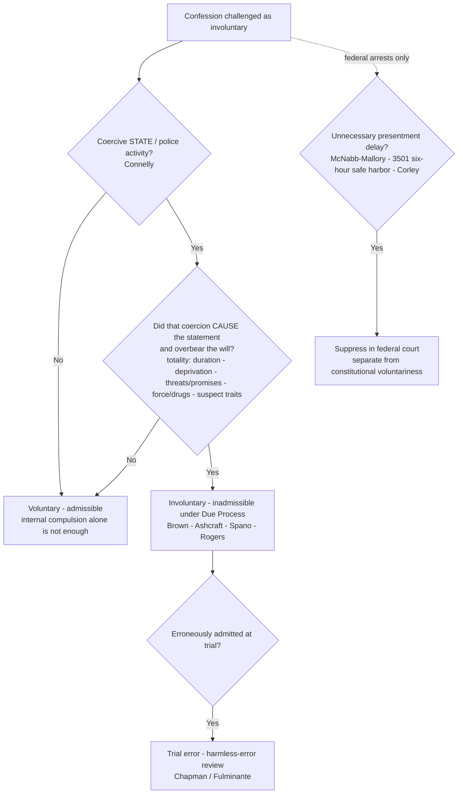

---
aliases:
  - "Due-Process Voluntariness of Confessions"
topic: Due-Process Voluntariness of Confessions
type: doctrine
jurisdiction: Federal (U.S. Const. amends. V & XIV — due process); SCOTUS baseline
status: verified
related:
  - "[[Miranda and Custodial Interrogation]]"
  - "[[Miranda Waiver and Invocation]]"
  - "[[Sixth Amendment Right to Counsel]]"
  - "[[The Exclusionary Rule]]"
---

# Due-Process Voluntariness of Confessions

## The Brief
<!-- S6-REFORMAT FLAGS (route through R13 find→adjudicate→fix / SR-1 live-verify at EXECUTE; NO CL calls made here — all case content restated from CL-verified content/cases/* pages):
  (1) N9 field-decisive question + the synthesized 3-element framing (coercion · causation · will-overborne) are AUTHORED teaching, grounded in Connelly (state-action) + Rogers (coercion-not-reliability). Instructor-review (SR-2) pending.
  (2) The McNabb-Mallory prompt-presentment overlay (McNabb / Mallory / Corley · §3501) is NEWLY ADDED doctrinal cross-material on this page — a federal-court evidentiary rule, NOT a constitutional command; framed here as the prompt-presentment companion to voluntariness (grounded in Corley's own treatment note).
  (3) Malloy v. Hogan incorporation framing and Chavez v. Martinez (Related, cross-doctrine) are newly woven from their verified case pages.
  Page-less cases kept plain text (no wikilink): Chapman v. California (harmless-error standard); United States v. Young (10th Cir. 2020, recent-developments).
-->

**Field-decisive question:** *Was this confession voluntary — or did coercion overbear the suspect's will?*

**The rule, up front.** A confession is inadmissible under the **Due Process Clause** (Fourteenth Amendment against the States; Fifth against the federal government) if, under the **totality of the circumstances**, official **coercion** overbore the defendant's will. The inquiry weighs interrogation length, deprivation of sleep/food/outside contact, threats or promises, use of force or drugs, and the suspect's individual characteristics (age, intelligence, mental state) — **no single factor is dispositive**. The doctrine grew case by case from the extreme to the subtle: physical torture ([[Brown v. Mississippi]]); prolonged incommunicado interrogation of helpless prisoners ([[Chambers v. Florida]]); thirty-six hours of continuous relay questioning without sleep, deemed *inherently coercive* ([[Ashcraft v. Tennessee]]); psychological overbearing — a friend's feigned distress plus persistent overnight questioning ([[Spano v. New York]]); threats and promises — cutting off a mother's welfare and threatening to take her children ([[Lynumn v. Illinois]]), or trading family contact for a signature after incommunicado detention ([[Haynes v. Washington]]); a confession taken at gunpoint from a wounded man plus a later statement signed while drugged on morphine ([[Beecher v. Alabama]]); and a statement produced by a drug with truth-serum effect ([[Townsend v. Sain]]).

**The elements.** Distilled to its operative parts, the test asks for **(1) coercion that is *official* — state action; (2) a *causal* link between that coercion and the statement; and (3) a *will that was actually overborne***. Two cases fix the boundaries. **State action is required:** in [[Colorado v. Connelly]] the Court held that "coercive police activity is a necessary predicate to the finding that a confession is not 'voluntary' within the meaning of the Due Process Clause of the Fourteenth Amendment" ([[Colorado v. Connelly#^pin-167|479 U.S. at 167]]) — a confession prompted by mental illness or internal compulsion alone, without police overreaching, is **voluntary**, however unreliable it may be. And **coercion, not reliability, is the measure:** [[Rogers v. Richmond]] holds voluntariness turns *solely* on whether coercion overbore the will, "not because such confessions are unlikely to be true but because the methods used to extract them offend an underlying principle . . . that ours is an accusatorial and not an inquisitorial system" ([[Rogers v. Richmond#^pin-540|365 U.S. at 540–541]]); a standard that takes the confession's probable truth into account is invalid.

**Burden and standard.** When a confession is challenged as involuntary, the **prosecution** bears the burden of proving voluntariness, and must do so by at least a **preponderance of the evidence** ([[Lego v. Twomey]]); States may, as a matter of their own law, impose a higher standard. **Remedy / standard of review:** suppression is the remedy, but erroneous admission of a coerced confession is **trial error subject to harmless-error review** under *Chapman v. California* — not automatic reversal ([[Arizona v. Fulminante]]) (on those facts the error was *not* harmless and the conviction was reversed).

**Relationship to Miranda.** This due-process line **predates and runs parallel to** [[Miranda and Custodial Interrogation|Miranda]]: it is the constitutional **floor** that governed confessions long before 1966 and still governs independently. [[Malloy v. Hogan]] made the Fifth Amendment privilege against self-incrimination enforceable against the States by federal standards, but the voluntariness test remains its own inquiry — a confession can be **voluntary yet inadmissible** for a Miranda defect, or **Miranda-compliant yet still involuntary** and barred by due process. Warnings do not cure coercion.

**The federal prompt-presentment overlay (McNabb-Mallory).** Separate from — and narrower than — the constitutional voluntariness rule, a **federal-court evidentiary rule** bars confessions obtained during *unnecessary delay* in bringing a federal arrestee before a magistrate: [[McNabb v. United States]] (federal supervisory power, independent of the Constitution) and [[Mallory v. United States]] (Fed. R. Crim. P. 5(a); delay used to extract a confession is "unnecessary delay"). Congress responded with 18 U.S.C. §3501; [[Corley v. United States]] holds §3501 **modified but did not supplant** McNabb-Mallory — a federal confession made before presentment and beyond a **six-hour safe harbor** is suppressed if the presentment delay was unreasonable or unnecessary. This is a **federal-court** rule, **not** a constitutional command binding the States; it is taught here as the prompt-presentment companion to due-process voluntariness.

**Nuances, limits, and pitfalls.**
- **Totality, not any single factor.** Duration and sustained pressure can overbear the will without physical force ([[Ashcraft v. Tennessee|Ashcraft]]; [[Spano v. New York|Spano]]); [[Brown v. Mississippi|Brown]] and [[Chambers v. Florida|Chambers]] mark the extreme end (torture, incommunicado compulsion).
- **Deception is not automatically coercion.** Falsely telling a suspect his codefendant had confessed did not, standing alone, render the confession involuntary ([[Frazier v. Cupp]]); deception is one factor in the totality, not a per se rule.
- **The stakes are constitutional, not merely evidentiary.** Allowing convictions on confessions so obtained "would make of the constitutional requirement of due process of law a meaningless symbol" ([[Chambers v. Florida#^pin-240|309 U.S. at 240]]).
- **Pitfall — thinking Miranda warnings cure an involuntary confession.** They do not; voluntariness is a separate, freestanding test from the [[Miranda and Custodial Interrogation|Miranda]] inquiry.
- **Pitfall — ignoring the state-action requirement.** After [[Colorado v. Connelly|Connelly]], there is no due-process voluntariness problem without coercive police activity — an "unreliable" or "compelled-feeling" statement is not enough by itself.
- **Pitfall — treating any lie as coercive.** Per [[Frazier v. Cupp|Frazier]], lawful factual deception is weighed in the totality; it is not per se coercion.
- This inquiry is **distinct from** [[Miranda Waiver and Invocation|Miranda waiver]] and the [[Sixth Amendment Right to Counsel]]; suppression of an involuntary confession is independent of the [[The Exclusionary Rule|exclusionary]] analyses tied to those doctrines.

## Key cases

| Case | Holding (one line) | Role | Weight | Treatment | CL |
|------|--------------------|------|--------|-----------|----|
| [[Brown v. Mississippi]], 297 U.S. 278 (1936) | A confession extracted by physical torture is involuntary; using it to convict violates Fourteenth Amendment due process (the founding case). | Key — Anchor | Binding — SCOTUS | good · 2026-06-30 | [opinion](https://www.courtlistener.com/opinion/102604/brown-v-mississippi/) |
| [[Chambers v. Florida]], 309 U.S. 227 (1940) | Confessions wrung from helpless prisoners by prolonged, incommunicado interrogation are the product of compulsion and violate due process. | Key — Progeny | Binding — SCOTUS | good · 2026-06-30 | [opinion](https://www.courtlistener.com/opinion/103301/chambers-v-florida/) |
| [[Ashcraft v. Tennessee]], 322 U.S. 143 (1944) | Thirty-six hours of continuous relay questioning without sleep is inherently coercive, rendering the confession involuntary. | Key — Anchor | Binding — SCOTUS | good · 2026-06-30 | [opinion](https://www.courtlistener.com/opinion/103981/ashcraft-v-tennessee/) |
| [[Spano v. New York]], 360 U.S. 315 (1959) | Psychological overbearing — a friend's feigned distress plus persistent overnight questioning — made the confession involuntary; the will was overborne. | Key — Progeny | Binding — SCOTUS | good · 2026-06-30 | [opinion](https://www.courtlistener.com/opinion/105917/spano-v-new-york/) |
| [[Rogers v. Richmond]], 365 U.S. 534 (1961) | Voluntariness turns solely on whether coercion overbore the will; the confession's probable truth/reliability is constitutionally irrelevant, and a reliability-based standard is invalid. | Key — Progeny | Binding — SCOTUS | good · 2026-06-30 | [opinion](https://www.courtlistener.com/opinion/106192/rogers-v-richmond/) |
| [[Lynumn v. Illinois]], 372 U.S. 528 (1963) | A confession coerced by threats to cut off state financial aid and take away the suspect's children — extracted from an inexperienced person encircled by officers — is involuntary. | Key — Progeny | Binding — SCOTUS | good · 2026-06-30 | [opinion](https://www.courtlistener.com/opinion/106558/lynumn-v-illinois/) |
| [[Haynes v. Washington]], 373 U.S. 503 (1963) | Incommunicado detention plus threats of continued isolation and a promise of family contact conditioned on signing render a confession involuntary under the totality. | Key — Progeny | Binding — SCOTUS | good · 2026-06-30 | [opinion](https://www.courtlistener.com/opinion/106625/haynes-v-washington/) |
| [[Beecher v. Alabama]], 389 U.S. 35 (1967) | A confession taken at gunpoint from a wounded suspect, and a later statement signed while drugged on morphine, are the product of gross coercion and involuntary. | Key — Progeny | Binding — SCOTUS | good · 2026-06-30 | [opinion](https://www.courtlistener.com/opinion/107526/beecher-v-alabama/) |
| [[Townsend v. Sain]], 372 U.S. 293 (1963) | A confession produced by a drug with truth-serum effect is involuntary if not the product of a rational intellect and free will — regardless of reliability or the questioners' knowledge of the drug. | Key — Progeny | Binding — SCOTUS | good · 2026-06-30 | [opinion](https://www.courtlistener.com/opinion/106544/townsend-v-sain/) |
| [[Frazier v. Cupp]], 394 U.S. 731 (1969) | Police misrepresentation (falsely claiming a codefendant had confessed) did not, by itself, render the confession involuntary; deception is one factor in the totality. | Key — Progeny | Binding — SCOTUS | good · 2026-06-30 | [opinion](https://www.courtlistener.com/opinion/107913/frazier-v-cupp/) |
| [[Colorado v. Connelly]], 479 U.S. 157 (1986) | Coercive police activity is a necessary predicate to involuntariness; a mentally ill suspect's internal compulsion ("voices") does not make a confession involuntary. | Key — Progeny | Binding — SCOTUS | good · 2026-06-30 | [opinion](https://www.courtlistener.com/opinion/111779/colorado-v-connelly/) |
| [[Arizona v. Fulminante]], 499 U.S. 279 (1991) | Erroneous admission of a coerced confession is trial error subject to harmless-error analysis under *Chapman* (here the error was not harmless; conviction reversed). | Key — Progeny | Binding — SCOTUS | good · 2026-06-30 | [opinion](https://www.courtlistener.com/opinion/112566/arizona-v-fulminante/) |
| [[Lego v. Twomey]], 404 U.S. 477 (1972) | The prosecution must prove voluntariness by a preponderance of the evidence, not beyond a reasonable doubt; States may adopt a higher standard. | Key — Progeny | Binding — SCOTUS | good · 2026-06-30 | [opinion](https://www.courtlistener.com/opinion/108429/lego-v-twomey/) |
| [[Malloy v. Hogan]], 378 U.S. 1 (1964) | The Fifth Amendment privilege against self-incrimination is enforceable against the States through the Fourteenth Amendment by the same standards; *Twining* and *Adamson* overruled to that extent. | Key — Anchor | Binding — SCOTUS | good · 2026-06-30 | [opinion](https://www.courtlistener.com/opinion/106862/malloy-v-hogan/) |
| [[McNabb v. United States]], 318 U.S. 332 (1943) | Under the federal supervisory power, confessions taken during detention that flouts the duty of prompt presentment are inadmissible — independent of the Constitution. | Key — Anchor | Binding — SCOTUS | good · 2026-06-30 | [opinion](https://www.courtlistener.com/opinion/103791/mcnabb-v-united-states/) |
| [[Mallory v. United States]], 354 U.S. 449 (1957) | A confession obtained during unnecessary delay in presenting a federal arrestee to a magistrate (Fed. R. Crim. P. 5(a)) is inadmissible; delay to extract a confession is "unnecessary delay." | Key — Anchor | Binding — SCOTUS | good · 2026-06-30 | [opinion](https://www.courtlistener.com/opinion/105545/mallory-v-united-states/) |
| [[Corley v. United States]], 556 U.S. 303 (2009) | 18 U.S.C. §3501 modified but did not supplant McNabb-Mallory: a federal confession made before presentment and beyond a six-hour safe harbor is suppressed if the delay was unreasonable. | Key — Progeny | Binding — SCOTUS | good · 2026-06-30 | [opinion](https://www.courtlistener.com/opinion/145888/corley-v-united-states/) |

## Related cases across doctrines
These cases are treated in full on other doctrine pages but bear directly on due-process voluntariness, framed here for that inquiry.

| Case | Relevance to due-process voluntariness | Primary treatment | Weight | Treatment | CL |
|------|----------------------------------------|-------------------|--------|-----------|----|
| [[Chavez v. Martinez]], 538 U.S. 760 (2003) | Coercive police questioning that produces **no statement used against the suspect in a criminal case** is not itself a completed Fifth Amendment violation; any remedy for the coercion lies (if at all) in **substantive due process** — the doctrinal seam between compelled-statement and due-process voluntariness analysis. | [[Miranda and Custodial Interrogation]] | Binding — SCOTUS | good · 2026-06-30 | [opinion](https://www.courtlistener.com/opinion/127927/chavez-v-martinez/) |
| [[Oregon v. Elstad]], 470 U.S. 298 (1985) | Voluntariness is freestanding: an initial un-warned but *actually voluntary* statement does not coerce or taint a later warned confession — only genuine coercion (not a mere Miranda omission) triggers the due-process bar. | [[Miranda Waiver and Invocation]] | Binding — SCOTUS | good · 2026-06-30 | [opinion](https://www.courtlistener.com/opinion/111364/oregon-v-elstad/) |
| [[United States v. Patane]], 542 U.S. 630 (2004) | An un-warned but voluntary statement involves no due-process coercion; physical fruit is admissible because there was no compelled/involuntary statement, only a prophylactic Miranda lapse. | [[Miranda Waiver and Invocation]] | Binding — SCOTUS | good · 2026-06-30 | [opinion](https://www.courtlistener.com/opinion/137003/united-states-v-patane/) |
| [[Missouri v. Seibert]], 542 U.S. 600 (2004) | A question-first / warn-later case decided on **Miranda** prophylactic grounds — offered only as an instructive parallel to the due-process concern with intentionally undermining free choice; the two tests remain doctrinally distinct. | [[Miranda Waiver and Invocation]] | Binding — SCOTUS | good · 2026-06-30 | [opinion](https://www.courtlistener.com/opinion/137002/missouri-v-seibert/) |
| [[Schneckloth v. Bustamonte]], 412 U.S. 218 (1973) | The canonical statement of the **totality-of-the-circumstances** test this doctrine uses: consent voluntariness is judged by the same framework the Court built from the due-process confession cases (*Brown*, *Chambers*, *Ashcraft*, *Spano*). | [[Consent Searches]] | Binding — SCOTUS | good · 2026-06-30 | [opinion](https://www.courtlistener.com/opinion/108800/schneckloth-v-bustamonte/) |
| [[Brewer v. Williams]], 430 U.S. 387 (1977) | The "Christian burial speech" — the classic example of psychological pressure short of force; though decided on Sixth Amendment grounds, it illustrates the same overbearing-the-will concern (cf. *Spano*) animating voluntariness review. | [[Sixth Amendment Right to Counsel]] | Binding — SCOTUS | good · 2026-06-30 | [opinion](https://www.courtlistener.com/opinion/109624/brewer-v-williams/) |

## Recent developments
Role-based, **circuit/state only** — any SCOTUS holding lives in **Key cases** regardless of date (N5). The [[Colorado v. Connelly|Connelly]] state-action predicate and the [[Frazier v. Cupp|Frazier]] "deception is not per se coercion" rule remain the SCOTUS baseline; lower federal courts continue to police where lawful technique tips into overbearing the will — distinguishing tolerated deception *about facts* from intolerable **misrepresentations of law** and **false promises of leniency**.

- ***United States v. Young*** (10th Cir. 2020) — **Binding in-circuit — 10th Cir.; Persuasive (outside circuit)** · *role: application/refinement of the totality test.* Applying the *Connelly*/totality framework, the court found a confession involuntary where an FBI agent falsely claimed to have spoken with the federal judge about the case and falsely promised the suspect could "buy down"/shorten his sentence with each truthful answer. While deception about facts is tolerated, misrepresentations of law and false promises of sentencing leniency critically impaired the suspect's capacity for self-determination and overbore his will; conviction reversed, judgment vacated, and remanded. *(No CSSI case page — cited plain.)* [opinion](https://www.courtlistener.com/opinion/4766220/united-states-v-young/)

## Visual

## Sources
- [Brown v. Mississippi, 297 U.S. 278 (1936)](https://www.courtlistener.com/opinion/102604/brown-v-mississippi/)
- [Chambers v. Florida, 309 U.S. 227 (1940)](https://www.courtlistener.com/opinion/103301/chambers-v-florida/) — pinpoint: 240
- [McNabb v. United States, 318 U.S. 332 (1943)](https://www.courtlistener.com/opinion/103791/mcnabb-v-united-states/)
- [Ashcraft v. Tennessee, 322 U.S. 143 (1944)](https://www.courtlistener.com/opinion/103981/ashcraft-v-tennessee/)
- [Mallory v. United States, 354 U.S. 449 (1957)](https://www.courtlistener.com/opinion/105545/mallory-v-united-states/)
- [Spano v. New York, 360 U.S. 315 (1959)](https://www.courtlistener.com/opinion/105917/spano-v-new-york/)
- [Rogers v. Richmond, 365 U.S. 534 (1961)](https://www.courtlistener.com/opinion/106192/rogers-v-richmond/) — pinpoint: 540–541
- [Lynumn v. Illinois, 372 U.S. 528 (1963)](https://www.courtlistener.com/opinion/106558/lynumn-v-illinois/)
- [Townsend v. Sain, 372 U.S. 293 (1963)](https://www.courtlistener.com/opinion/106544/townsend-v-sain/)
- [Haynes v. Washington, 373 U.S. 503 (1963)](https://www.courtlistener.com/opinion/106625/haynes-v-washington/)
- [Malloy v. Hogan, 378 U.S. 1 (1964)](https://www.courtlistener.com/opinion/106862/malloy-v-hogan/)
- [Beecher v. Alabama, 389 U.S. 35 (1967)](https://www.courtlistener.com/opinion/107526/beecher-v-alabama/)
- [Frazier v. Cupp, 394 U.S. 731 (1969)](https://www.courtlistener.com/opinion/107913/frazier-v-cupp/)
- [Lego v. Twomey, 404 U.S. 477 (1972)](https://www.courtlistener.com/opinion/108429/lego-v-twomey/)
- [Colorado v. Connelly, 479 U.S. 157 (1986)](https://www.courtlistener.com/opinion/111779/colorado-v-connelly/) — pinpoint: 167
- [Arizona v. Fulminante, 499 U.S. 279 (1991)](https://www.courtlistener.com/opinion/112566/arizona-v-fulminante/)
- [Chavez v. Martinez, 538 U.S. 760 (2003)](https://www.courtlistener.com/opinion/127927/chavez-v-martinez/)
- [Corley v. United States, 556 U.S. 303 (2009)](https://www.courtlistener.com/opinion/145888/corley-v-united-states/)
- [United States v. Young (10th Cir. 2020)](https://www.courtlistener.com/opinion/4766220/united-states-v-young/)
</content>
</invoke>
