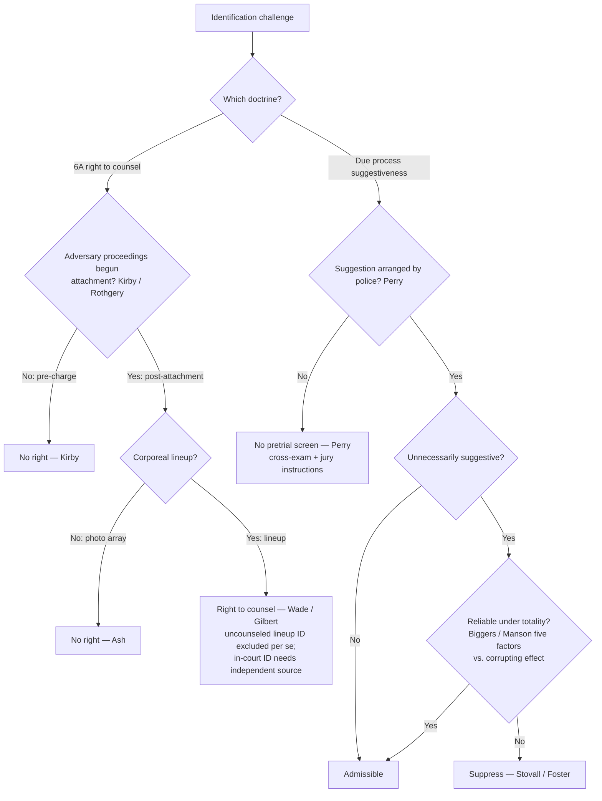

# Eyewitness Identification

## The Brief

**Field-decisive question:** *Is this identification admissible — was it unnecessarily suggestive, and is it nonetheless reliable?* The admissibility of an eyewitness identification runs through **two independent federal doctrines**, and an identification can pass one and fail the other. Keep them separate: **(1)** a **Due-Process** attack on the *reliability* of a **suggestive** procedure (Fourteenth Amendment), and **(2)** a **Sixth Amendment** right to *counsel* at a **post-attachment corporeal lineup**. The first asks whether the identification is trustworthy enough to go to the jury; the second asks whether the accused was entitled to a lawyer at the confrontation. Neither turns on the other.

**(1) Due-process reliability — the suggestiveness/reliability screen (stated up front).** An identification produced by an **unnecessarily suggestive** police procedure is **excluded only if it is unreliable** under the [[Common Legal Terms#totality-of-the-circumstances|totality of the circumstances]]; suggestiveness alone is not enough. The origin is *[[Stovall v. Denno#^pin-302|Stovall v. Denno]]*, 388 U.S. 293, 302 (1967), which recognized that a confrontation "so unnecessarily suggestive and conducive to irreparable mistaken identification" can deny due process — "a recognized ground of attack upon a conviction independent of any right to counsel claim" — and that the claim "depends on the totality of the circumstances surrounding it." *[[Stovall v. Denno#^pin-302a|Id.]]* *[[Neil v. Biggers#^pin-199|Neil v. Biggers]]*, 409 U.S. 188, 199 (1972), made **reliability**, not suggestiveness, the controlling question — "whether under the 'totality of the circumstances' the identification was reliable even though the confrontation procedure was suggestive" — and supplied the **five reliability factors** stated explicitly here:

1. the **opportunity of the witness to view** the criminal at the time of the crime;
2. the witness's **degree of attention**;
3. the **accuracy of the witness's prior description** of the criminal;
4. the **level of certainty** demonstrated at the confrontation; and
5. the **length of time between the crime and the confrontation**.

*[[Neil v. Biggers#^pin-199b|Id.]]* at 199–200. *[[Manson v. Brathwaite#^pin-114|Manson v. Brathwaite]]*, 432 U.S. 98, 114 (1977), rejected any **[[Common Legal Terms#per-se|per se]]** exclusion for suggestive procedures and made the point the linchpin: "reliability is the linchpin in determining the admissibility of identification testimony for both pre- and post-*Stovall* confrontations," with the *Biggers* factors weighed against "the corrupting effect of the suggestive identification itself." *[[Manson v. Brathwaite#^pin-114a|Id.]]* The threshold that switches this screen **on** is police conduct: *[[Perry v. New Hampshire#^pin-op18|Perry v. New Hampshire]]*, 565 U.S. 228 (2012), holds that "the Due Process Clause does not require a preliminary judicial inquiry into the reliability of an eyewitness identification when the identification was not procured under unnecessarily suggestive circumstances **arranged by law enforcement**." *[[Perry v. New Hampshire#^pin-op2|Id.]]* (slip op., at 2). Absent improper police arrangement, reliability is tested through "vigorous cross-examination, protective rules of evidence, and jury instructions" — not pretrial exclusion. Suppression is the exception: *[[Foster v. California#^pin-442|Foster v. California]]*, 394 U.S. 440, 442 (1969), is the **rare** case in which a pretrial procedure was suggestive enough to require reversal — a lineup that made the suspect stand out, then a one-on-one showup, then a repeat lineup in which he was the only carryover, so that "in effect, the police repeatedly said to the witness, 'This is the man.'" *[[Foster v. California#^pin-443|Id.]]* at 443. For **photographic** procedures the same due-process standard applies: a conviction following a photo identification is set aside "only if the photographic identification procedure was so impermissibly suggestive as to give rise to a very substantial likelihood of irreparable misidentification." *[[Simmons v. United States#^pin-384|Simmons v. United States]]*, 390 U.S. 377, 384 (1968).

**(2) Sixth Amendment counsel at post-attachment lineups (stated up front).** A **post-attachment corporeal lineup** is a **critical stage** at which the accused has a Sixth Amendment right to counsel: *[[United States v. Wade#^pin-237|United States v. Wade]]*, 388 U.S. 218, 237 (1967) ("the post-indictment lineup was a critical stage of the prosecution at which he was 'as much entitled to such aid [of counsel] . . . as at the trial itself'"). Its companion, *[[Gilbert v. California#^pin-273|Gilbert v. California]]*, 388 U.S. 263, 273 (1967), attaches a **per se** exclusionary rule to testimony that the witness identified the accused **at** an uncounseled lineup — there is no reliability cure for that defect — while an **in-court** identification survives only if the prosecution shows it rests on an **independent source** untainted by the lineup (*[[United States v. Wade#^pin-242|Wade]]*, 388 U.S. at 242). Two limits define the reach of this right. First, it does **not** attach **pre-charge**: *[[Kirby v. Illinois#^pin-689|Kirby v. Illinois]]*, 406 U.S. 682, 689 (1972) (plurality), confines the right to "points of time at or after the initiation of adversary judicial criminal proceedings — whether by way of formal charge, preliminary hearing, indictment, information, or arraignment." Second, there is **no** counsel right at a **photographic array**: *[[United States v. Ash#^pin-321|United States v. Ash]]*, 413 U.S. 300, 321 (1973) ("the Sixth Amendment does not grant the right to counsel at photographic displays conducted by the Government"), because a photo display is not a trial-like confrontation — the accused is not present.

**Show-up vs. lineup vs. photo array — map the procedure first, because the two doctrines sort by procedure.** A **corporeal lineup** conducted **after attachment** is the one procedure that triggers the *Wade/Gilbert* counsel right; a **photo array** never does (*Ash*); and a **showup** (a one-on-one confrontation) is **not categorically a Sixth Amendment critical stage** — the canonical showup, *[[Stovall v. Denno|Stovall]]*, was analyzed under **due process**, not the counsel right, so classify showups on the suggestiveness/reliability branch, not as a categorical 6A critical stage. Every procedure — lineup, showup, or photo array — is separately subject to the due-process suggestiveness/reliability screen when police arranged the suggestion (*Perry*).

**Attachment is not the same as the "critical stage" question — do not conflate them.** The Sixth Amendment **attaches** at the initial appearance/arraignment (*[[Rothgery v. Gillespie County]]*, 554 U.S. 191 (2008)), but *Rothgery* expressly did **not** decide which post-attachment events are critical stages requiring counsel (554 U.S. at 211–13 & nn. 15–16). It is *Wade/Gilbert* that supplies the holding that a **post-charge corporeal lineup** *is* a critical stage. A lineup conducted after attachment is therefore a critical stage under *Wade*; events before attachment are not (*Kirby*). The right is also **offense-specific**: counsel is required only for a lineup concerning the **charged** offense, so a post-charge lineup investigating a different, uncharged offense is not a *Wade/Gilbert* critical stage (*[[Texas v. Cobb]]*, 532 U.S. 162 (2001)).

**Burden · standard of review · remedy.** On the **Sixth Amendment** (*Wade/Gilbert*) branch: once the defendant shows a lineup conducted without counsel after attachment, the **prosecution** must establish by **clear and convincing evidence** that any in-court identification rests on an **independent source** — the witness's observations apart from the tainted lineup (*[[United States v. Wade]]*, 388 U.S. at 240). The **remedy** is *per se* exclusion of the uncounseled-lineup identification testimony (*[[Gilbert v. California|Gilbert]]*), with the in-court identification admitted only on a proven independent source (*[[United States v. Wade|Wade]]*). On the **due-process** branch: the **defendant** bears the initial burden of showing the procedure was **unnecessarily suggestive** (and, after *[[Perry v. New Hampshire|Perry]]*, **arranged by police**); if met, reliability is assessed under the *[[Neil v. Biggers|Biggers]]* totality, weighed against the corrupting effect of the suggestion (*[[Manson v. Brathwaite|Manson]]*), and only an **unreliable** identification is suppressed. Appellate review treats the subsidiary historical facts for [[Common Legal Terms#clear-error|clear error]] and the ultimate constitutional questions — unnecessary suggestiveness and reliability — as mixed questions reviewed **[[Common Legal Terms#de-novo|de novo]]**. *[FLAG — completeness add: the appellate standard-of-review line is not pinpointed to an ingested case page; route to the R13 serial-CL gate.]*

**Pitfalls to flag for the field.** (1) **Assuming counsel attaches at every identification.** The *Wade/Gilbert* right reaches only **post-charge corporeal** confrontations — **not** pre-charge showups (*[[Kirby v. Illinois|Kirby]]*) and **not** photo arrays (*[[United States v. Ash|Ash]]*). A pre-charge field showup needs no defense counsel. (2) **Treating any suggestive procedure as automatically fatal.** Under *[[Neil v. Biggers|Biggers]]*/*[[Manson v. Brathwaite|Manson]]*, a suggestive identification is still admissible if **reliable** under the five-factor totality — suppression is the exception, not the rule. (3) **Applying the due-process screen to suggestion the police did not arrange.** Per *[[Perry v. New Hampshire|Perry]]*, chance or private suggestiveness (a witness's own spontaneous viewing) triggers **no** pretrial screen; the safeguard is cross-examination and jury instruction, not a suppression remedy through [[The Exclusionary Rule|the exclusionary rule]]. (4) **Confusing *Gilbert*'s per se rule with the due-process branch.** A *Gilbert* violation excludes the lineup-identification testimony outright — there is **no** reliability cure — whereas on the due-process branch reliability *rescues*. (5) **Forgetting the independent source.** Even after a tainted lineup, an in-court identification comes in if the prosecution proves the witness's identification has a source independent of the illegal procedure (*[[United States v. Wade|Wade]]*; and see the fruit-of-the-poisonous-tree analog in *[[United States v. Crews|Crews]]*). The due-process suggestiveness inquiry is the sibling of the due-process attack on confessions ([[Due-Process Voluntariness of Confessions]]); the counsel-at-lineup rule is a piece of the broader [[Sixth Amendment Right to Counsel]].

## Key cases

| Case | Holding in one line | Weight | Treatment | CourtListener |
|---|---|---|---|---|
| *[[United States v. Wade]]*, 388 U.S. 218 (1967) | **Anchor (6A)** — a **post-indictment lineup** is a **critical stage** with a right to counsel; an uncounseled lineup may taint a later in-court ID absent an **independent source**. | Binding — SCOTUS | good *(2026-06-30)* | [link](https://www.courtlistener.com/opinion/107486/united-states-v-wade/) |
| *[[Gilbert v. California]]*, 388 U.S. 263 (1967) | **Anchor (6A)** — testimony that the witness identified the accused at an **uncounseled post-charge lineup** is excluded **per se** — no harmless-error or reliability cure. | Binding — SCOTUS | good *(2026-06-30)* | [link](https://www.courtlistener.com/opinion/107487/gilbert-v-california/) |
| *[[Stovall v. Denno]]*, 388 U.S. 293 (1967) | **Anchor (DP)** — an **unnecessarily suggestive** confrontation conducive to irreparable misidentification can violate **due process**; admissibility turns on the **totality of the circumstances**. | Binding — SCOTUS | good *(2026-06-30)* | [link](https://www.courtlistener.com/opinion/107488/stovall-v-denno/) |
| *[[Neil v. Biggers]]*, 409 U.S. 188 (1972) | **Progeny / Refinement (DP)** — even an unnecessarily suggestive ID is admissible if **reliable** under the totality; reliability judged by the **five factors**. | Binding — SCOTUS | good *(2026-06-30)* | [link](https://www.courtlistener.com/opinion/108639/neil-v-biggers/) |
| *[[Manson v. Brathwaite]]*, 432 U.S. 98 (1977) | **Anchor (DP)** — **no per se** exclusion for suggestive procedures; **reliability is the linchpin** under the *Biggers* factors, weighed against the corrupting effect of the suggestion. | Binding — SCOTUS | good *(2026-06-30)* | [link](https://www.courtlistener.com/opinion/109693/manson-v-brathwaite/) |
| *[[Perry v. New Hampshire]]*, 565 U.S. 228 (2012) | **Progeny / Refinement (DP)** — due-process reliability screening applies **only** when police **arranged** the suggestive circumstances; otherwise the jury and cross-examination are the safeguards. | Binding — SCOTUS | good *(2026-06-30)* | [link](https://www.courtlistener.com/opinion/620671/perry-v-new-hampshire/) |
| *[[Foster v. California]]*, 394 U.S. 440 (1969) | **Progeny (DP)** — the **rare** reversal: cumulative suggestiveness (standout lineup → showup → repeat lineup) made identification "all but inevitable" and denied due process. | Binding — SCOTUS | good *(2026-06-30)* | [link](https://www.courtlistener.com/opinion/107890/foster-v-california/) |
| *[[Simmons v. United States]]*, 390 U.S. 377 (1968) | **Progeny (DP — photo array)** — a **photographic** identification denies due process only if "so impermissibly suggestive as to give rise to a very substantial likelihood of irreparable misidentification." | Binding — SCOTUS | good *(2026-06-30)* | [link](https://www.courtlistener.com/opinion/107636/simmons-v-united-states/) |
| *[[Kirby v. Illinois]]*, 406 U.S. 682 (1972) (plurality) | **Progeny / Refinement (6A)** — the counsel right attaches only **at/after** the initiation of adversary judicial proceedings; a **pre-charge** ID is not a critical stage. | Binding — SCOTUS | good *(2026-06-30)* | [link](https://www.courtlistener.com/opinion/108554/kirby-v-illinois/) |
| *[[United States v. Ash]]*, 413 U.S. 300 (1973) | **Progeny / Refinement (6A)** — **no** right to counsel at a **post-indictment photographic display** — no trial-like confrontation because the accused is not present. | Binding — SCOTUS | good *(2026-06-30)* | [link](https://www.courtlistener.com/opinion/108846/united-states-v-ash/) |

## Related cases across doctrines

These cases are treated in full elsewhere but bear on this doctrine; each holding is framed below for the eyewitness-identification context.

| Case | Relevance to eyewitness identification (framed here) | Weight · Treatment | Treated in full · CourtListener |
|---|---|---|---|
| *[[Rothgery v. Gillespie County]]*, 554 U.S. 191 (2008) | Fixes **when** the *Wade/Kirby* counsel right can attach: the 6A **attaches** at the initial appearance/arraignment — but **attachment is distinct from the "critical stage" question**. *Rothgery* expressly did **not** decide which post-attachment events require counsel (554 U.S. at 211–13 & nn. 15–16); it is *Wade/Gilbert* that makes a **post-charge corporeal lineup** a critical stage. | Binding — SCOTUS · good | [[Sixth Amendment Right to Counsel]] · [CL](https://www.courtlistener.com/opinion/145785/rothgery-v-gillespie-county/) |
| *[[Texas v. Cobb]]*, 532 U.S. 162 (2001) | The *Wade* counsel-at-lineup right is **offense-specific**: counsel is required only for a lineup concerning the **charged** offense; a post-charge lineup investigating a different, uncharged offense triggers no *Wade/Gilbert* right. | Binding — SCOTUS · good | [[Sixth Amendment Right to Counsel]] · [CL](https://www.courtlistener.com/opinion/118417/texas-v-cobb/) |
| *[[United States v. Crews]]*, 445 U.S. 463 (1980) | The **independent-source** principle applied to identifications: a victim's **in-court** identification is **not** a suppressible fruit of an illegal arrest where her presence and ability to identify have a source **predating** the misconduct — the fruit-of-the-poisonous-tree analog to the *Wade/Gilbert* independent-source test. | Binding — SCOTUS · good | [[The Exclusionary Rule]] · [CL](https://www.courtlistener.com/opinion/110230/united-states-v-crews/) |

## Recent developments

Role-based **circuit/state** developments only — **no SCOTUS**. The controlling Supreme Court authorities — *[[United States v. Wade|Wade]]*, *[[Gilbert v. California|Gilbert]]*, *[[Stovall v. Denno|Stovall]]*, *[[Neil v. Biggers|Biggers]]*, *[[Manson v. Brathwaite|Manson]]*, *[[Kirby v. Illinois|Kirby]]*, *[[United States v. Ash|Ash]]*, and *[[Perry v. New Hampshire|Perry]]* — home to **Key cases** regardless of date, per the no-SCOTUS-in-recent-developments rule; *[[Perry v. New Hampshire|Perry]]* (2012) is the most recent SCOTUS word and belongs in Key, not here. The federal two-track framework is stable, and the live line-drawing at the lower-court/state level tracks a few recurring frontiers: (a) **state high courts** that have **supplemented or replaced** the *[[Manson v. Brathwaite|Manson]]* reliability test with a scientifically-informed, expert-guided reliability framework as a matter of **state** constitutional or evidence law, departing upward from the federal floor; (b) lower-court application of *[[Perry v. New Hampshire|Perry]]*'s **police-arrangement threshold** to private/accidental suggestiveness; and (c) treatment of **modern procedures** — double-blind and sequential lineups, and body-camera field showups. *Specific circuit and state authority developing these frontiers is a live-verify addition (serial CL, L2/L4) deferred to the standing find→adjudicate→fix gate (R13) and S9 — no new case holding is asserted here.*

## Visual

## Sources

- *United States v. Wade*, 388 U.S. 218 (1967) — pinpoints 237, 240, 242 — https://www.courtlistener.com/opinion/107486/united-states-v-wade/
- *Gilbert v. California*, 388 U.S. 263 (1967) — pinpoint 273 — https://www.courtlistener.com/opinion/107487/gilbert-v-california/
- *Stovall v. Denno*, 388 U.S. 293 (1967) — pinpoint 302 — https://www.courtlistener.com/opinion/107488/stovall-v-denno/
- *Neil v. Biggers*, 409 U.S. 188 (1972) — pinpoints 199, 199–200 — https://www.courtlistener.com/opinion/108639/neil-v-biggers/
- *Manson v. Brathwaite*, 432 U.S. 98 (1977) — pinpoint 114 — https://www.courtlistener.com/opinion/109693/manson-v-brathwaite/
- *Perry v. New Hampshire*, 565 U.S. 228 (2012) — pinpoints slip op., at 2, 18–19 — https://www.courtlistener.com/opinion/620671/perry-v-new-hampshire/
- *Foster v. California*, 394 U.S. 440 (1969) — pinpoints 442, 443 — https://www.courtlistener.com/opinion/107890/foster-v-california/
- *Simmons v. United States*, 390 U.S. 377 (1968) — pinpoint 384 — https://www.courtlistener.com/opinion/107636/simmons-v-united-states/
- *Kirby v. Illinois*, 406 U.S. 682 (1972) — pinpoint 689 (plurality) — https://www.courtlistener.com/opinion/108554/kirby-v-illinois/
- *United States v. Ash*, 413 U.S. 300 (1973) — pinpoint 321 — https://www.courtlistener.com/opinion/108846/united-states-v-ash/
- *Rothgery v. Gillespie County*, 554 U.S. 191 (2008) (cross-doctrine) — https://www.courtlistener.com/opinion/145785/rothgery-v-gillespie-county/
- *Texas v. Cobb*, 532 U.S. 162 (2001) (cross-doctrine) — https://www.courtlistener.com/opinion/118417/texas-v-cobb/
- *United States v. Crews*, 445 U.S. 463 (1980) (cross-doctrine) — https://www.courtlistener.com/opinion/110230/united-states-v-crews/
