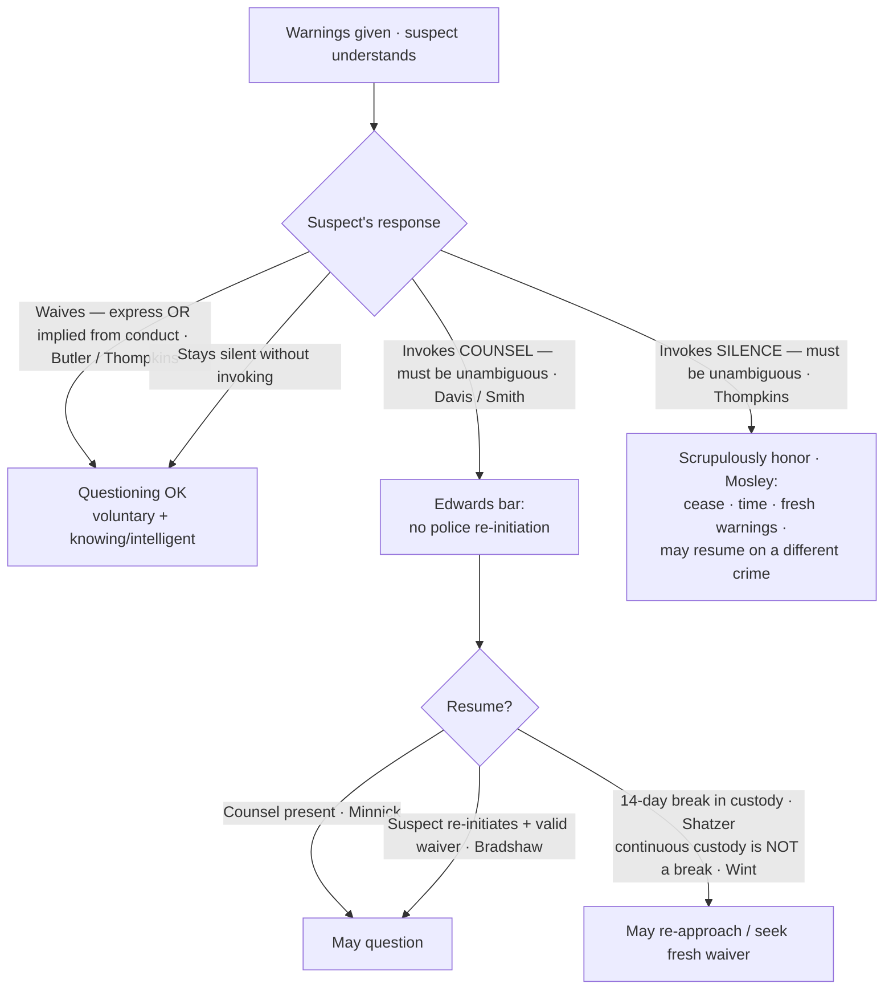

# Miranda: Waiver and Invocation

## The Brief

**Field-decisive question:** *Did the suspect validly **waive**, or **unambiguously invoke** — and what must I do either way?*

This page picks up **after** the warnings are given; whether warnings were required at all is governed by [[Miranda and Custodial Interrogation]]. Once a suspect has been warned, everything turns on his response — he may **waive** and be questioned, or **invoke** and stop it. Get the branch wrong and an otherwise-good confession is suppressed.

**Waiver — the default path.** A valid *Miranda* waiver has two components: it must be **(1) voluntary** — the product of a free and deliberate choice rather than coercion — **and (2) knowing and intelligent** — made with awareness of the nature of the right and the consequences of abandoning it. A waiver need **not be express**: it may be **inferred from the suspect's words and conduct** after he receives and understands the warnings, though **silence alone is never a waiver** and the burden of proving waiver stays on the government ([[North Carolina v. Butler#Rule|*Butler*]]). *Thompkins* applies this in the field — a suspect who stays largely silent through a long interrogation and then answers a question has **impliedly waived**, because "a suspect who has received and understood the *Miranda* warnings, and has not invoked his *Miranda* rights, waives the right to remain silent by making an uncoerced statement to the police" ([[Berghuis v. Thompkins#^pin-388|*Berghuis v. Thompkins*]]). The flip side of that same holding is the invocation rule below: **silence is not an invocation.**

**What the suspect need not know.** The "knowing" component tests the suspect's understanding of the **right**, not the police's candor about the investigation. A waiver is knowing and intelligent even though officers did not disclose **every crime or subject** the questioning would cover — "a suspect's awareness of all the possible subjects of questioning in advance of interrogation is not relevant" ([[Colorado v. Spring#^pin-577|*Colorado v. Spring*]]) — and even though police **failed to tell him an attorney was trying to reach him**; events outside the suspect's awareness do not bear on his own knowing, voluntary choice ([[Moran v. Burbine#Rule|*Moran v. Burbine*]]). For **juveniles**, there is no special per-se rule: a juvenile's request for a probation officer is **not** a per-se invocation, and the validity of a juvenile's waiver is judged by the **[[Common Legal Terms#totality-of-the-circumstances|totality of the circumstances]]** — age, experience, education, background, and capacity to understand ([[Fare v. Michael C#^pin-725|*Fare v. Michael C.*]]).

**A partial invocation is honored as made.** A suspect may draw his own line. One who refuses to give a **written** statement without counsel but **agrees to talk orally** has invoked only as to the writing; his oral statements are admissible, because authorities may honor "the tenor or sense of a defendant's response to the[] warnings" ([[Connecticut v. Barrett#^pin-528|*Connecticut v. Barrett*]]). Scope is set by the suspect's own words.

**Invocation runs on two distinct tracks.** An invocation of **counsel** and an invocation of **silence** trigger different rules — confusing them is the classic field error.

**Track 1 — the right to counsel and the *Edwards* rule.** Once a suspect **invokes counsel**, all interrogation must **cease** and may not resume until **counsel has been made available**, *unless the suspect himself initiates* further communication ([[Edwards v. Arizona#Rule|*Edwards v. Arizona*]]). This is a rigid, prophylactic bright line:
- **Re-initiation** requires more than a routine request (for water, a phone). The suspect must say something evincing "a willingness and a desire for a generalized discussion about the investigation"; even then, the statement is admissible **only if** he **also validly waived** counsel under the totality — the two-step *Edwards* analysis ([[Oregon v. Bradshaw#^pin-1046|*Oregon v. Bradshaw*]]).
- The bar is **not offense-specific**: it blocks questioning about **any** offense, even an unrelated one, and a second officer's ignorance of the invocation is no excuse ([[Arizona v. Roberson#Rule|*Arizona v. Roberson*]]). (Contrast the offense-**specific** Sixth Amendment right — a different regime that must be kept distinct, treated on [[Sixth Amendment Right to Counsel]]; invoking one is not invoking the other, [[McNeil v. Wisconsin#^pin-175|*McNeil v. Wisconsin*]].)
- Counsel must be **present** for any police-initiated re-questioning — the bar is **not** lifted merely because the suspect already **consulted** a lawyer ([[Minnick v. Mississippi#Rule|*Minnick v. Mississippi*]]).
- The bar is **not permanent**: a **14-day break in *Miranda* custody** ends *Edwards* protection, after which police may re-approach and seek a fresh waiver; release back into the general prison population can itself be that break ([[Maryland v. Shatzer#Rule|*Maryland v. Shatzer*]]).

**The invocation of counsel must be unambiguous.** *Edwards* protects only a **clear** request. An **equivocal** reference to counsel ("Maybe I should talk to a lawyer") does **not** require officers to stop, or even to ask clarifying questions ([[Davis v. United States#Rule|*Davis v. United States*]]). But officers may **not** manufacture ambiguity after the fact: once a suspect has clearly requested counsel, his **post-request answers** to continued (improper) questioning may **not** be used to cast retrospective doubt on the clarity of the request — they bear only on the separate question of waiver ([[Smith v. Illinois#^pin-100|*Smith v. Illinois*]]).

**Track 2 — the right to silence.** An invocation of **silence** is governed by a **softer** standard than *Edwards*: police need only **"scrupulously honor"** it. Where officers **stopped** questioning on the suspect's assertion of silence, let a significant time pass, gave **fresh warnings**, and then questioned about a **different crime**, the later statements were admissible ([[Michigan v. Mosley#Rule|*Michigan v. Mosley*]]). But the **same unambiguity gate** applies at the threshold: a suspect who wants questioning to stop must say so **unambiguously** — merely falling silent neither invokes the right nor blocks waiver ([[Berghuis v. Thompkins#^pin-382|*Thompkins*]], carrying the *Davis* standard into the silence track).

**Impeachment and the use of silence.** Suppression in the case-in-chief does not always keep a statement out entirely:
- An **un-warned but voluntary** statement — inadmissible as affirmative proof — may still be used to **impeach** the defendant if he takes the stand and testifies inconsistently; *Miranda*'s shield "cannot be perverted into a license to use perjury by way of a defense" ([[Harris v. New York#^pin-226|*Harris v. New York*]]).
- But **post-arrest, post-*Miranda* silence** may **not** be used to impeach an exculpatory story offered at trial — the warnings carry an implicit assurance that silence carries no penalty, so using it is a **due-process** violation ([[Doyle v. Ohio#^pin-618|*Doyle v. Ohio*]]).
- And **pre-custody, pre-*Miranda* silence** during voluntary questioning is **unprotected unless the suspect expressly invokes** the privilege — a suspect who simply goes quiet without claiming the Fifth may have that silence used against him ([[Salinas v. Texas#Rule|*Salinas v. Texas*]]).

**Fruits of a *Miranda* lapse.** A bare warnings lapse is a departure from a **prophylactic** rule, not itself a Fifth Amendment violation, so the strict fruit-of-the-poisonous-tree doctrine does not automatically apply ([[Michigan v. Tucker#^pin-446|*Michigan v. Tucker*]]). Concretely: an earlier **un-warned but voluntary** statement does **not** automatically taint a later, properly warned and waived confession ([[Oregon v. Elstad#Rule|*Oregon v. Elstad*]], *limited by* [[Missouri v. Seibert|*Seibert*]]); the **physical fruits** of an un-warned voluntary statement are **admissible** ([[United States v. Patane#Rule|*United States v. Patane*]]); but a **deliberate** "question-first, warn-later" **two-step** engineered to circumvent *Miranda* invalidates the warned second statement — *Elstad*'s safe harbor does not cover bad-faith end-runs ([[Missouri v. Seibert#Rule|*Missouri v. Seibert*]]). The line between them is **deliberateness plus nexus**: absent a deliberate two-step and any link between the unwarned and warned statements, *Elstad* controls ([[Bobby v. Dixon#^pin-31|*Bobby v. Dixon*]]). (Fourth Amendment fruit-of-the-poisonous-tree analysis lives on [[The Exclusionary Rule]]; separate due-process coercion claims go to [[Due-Process Voluntariness of Confessions]].)

**Elements · burden · standard of review · remedy.**
- **Elements of a valid waiver:** (1) **voluntary** (free, uncoerced choice) **and** (2) **knowing and intelligent** (aware of the right and the consequences of abandoning it); **express or implied** from a course of conduct after warnings ([[North Carolina v. Butler]]; [[Berghuis v. Thompkins]]).
- **Elements of an effective invocation:** an **unambiguous** assertion of counsel **or** silence ([[Davis v. United States]]; [[Berghuis v. Thompkins]]); an invocation of counsel triggers the *Edwards* bar, an invocation of silence the *Mosley* "scrupulously honor" duty.
- **Burden:** the **prosecution** proves a valid waiver by a **preponderance of the evidence** ([[Colorado v. Connelly]]); the suspect need not prove his invocation, but it must have been unambiguous to count.
- **Standard of review:** waiver and invocation are assessed on the **totality of the circumstances** — the whole course of conduct, not a single formula ([[North Carolina v. Butler]]; [[Fare v. Michael C]]).
- **Remedy:** **exclusion from the prosecution's case-in-chief** of statements taken in violation of the waiver/invocation rules — subject to the **impeachment** use of voluntary un-warned statements ([[Harris v. New York]]) and the **fruits** limits above ([[Oregon v. Elstad]]; [[United States v. Patane]]).

**Watch the common pitfalls.**
- **Treating silence as an invocation.** Staying quiet neither invokes the right to silence nor blocks waiver; to stop questioning, the suspect must invoke **unambiguously** ([[Berghuis v. Thompkins]]).
- **Treating an ambiguous lawyer reference as an invocation.** Officers may keep questioning after an equivocal statement and need not even ask clarifying questions ([[Davis v. United States]]) — the much-discussed "lawyer dog" anecdote (*State v. Demesme*, La. — a [[Common Legal Terms#concurring-opinion|concurrence]] to a writ denial treating "why don't you just give me a lawyer dog" as too ambiguous to invoke) shows how literally some courts apply this. *(State — illustrative; no case page.)*
- **Confusing the two tracks.** Invoking **silence** (scrupulously honor; re-questioning on a different crime can be permissible under *Mosley*) is not the same as invoking **counsel** (the rigid, offense-blind *Edwards* bar). Treat them identically and you either over- or under-protect the suspect.
- **Misreading *Shatzer* as a 14-day *waiting period*.** *Shatzer* requires a genuine **break in *Miranda* custody** plus 14 days — **not** 14 days of waiting while the suspect stays in custody. A suspect in **continuous** custody never gets a *Shatzer* break, so *Edwards* still bars police-initiated re-questioning (see the *Wint* illustration under Recent developments).

> **Scope note.** This page governs everything *after* the warnings — **waiver, invocation (counsel and silence), the *Edwards* bar, and the *Miranda*-fruits / impeachment lines**. Whether warnings were owed at all (custody + interrogation) is on [[Miranda and Custodial Interrogation]]; due-process coercion independent of *Miranda* is on [[Due-Process Voluntariness of Confessions]]; the offense-specific Sixth Amendment right that attaches at charging is on [[Sixth Amendment Right to Counsel]]; Fourth Amendment fruit-of-the-poisonous-tree is on [[The Exclusionary Rule]].

## Key cases

| Case | Holding (one line) | Weight | Treatment | CourtListener |
| --- | --- | --- | --- | --- |
| [[Edwards v. Arizona]] | Once counsel is invoked, police may not re-initiate interrogation until counsel is made available, unless the accused himself initiates. | Binding — SCOTUS | good | [opinion](https://www.courtlistener.com/opinion/110475/edwards-v-arizona/) |
| [[Berghuis v. Thompkins]] | Silence alone does not invoke; the right must be invoked unambiguously, and a suspect who answers after understanding the warnings impliedly waives. | Binding — SCOTUS | good | [opinion](https://www.courtlistener.com/opinion/147529/berghuis-v-thompkins/) |
| [[North Carolina v. Butler]] | Waiver need not be express — it may be inferred from words and conduct — but silence alone is never enough and the burden stays on the government. | Binding — SCOTUS | good | [opinion](https://www.courtlistener.com/opinion/110065/north-carolina-v-butler/) |
| [[Colorado v. Spring]] | A waiver is knowing and intelligent even though police did not disclose every crime or subject the questioning would cover. | Binding — SCOTUS | good | [opinion](https://www.courtlistener.com/opinion/111798/colorado-v-spring/) |
| [[Moran v. Burbine]] | Waiver is valid even though police failed to tell the suspect an attorney was trying to reach him; events outside his knowledge do not bear on waiver. | Binding — SCOTUS | good | [opinion](https://www.courtlistener.com/opinion/111614/moran-v-burbine/) |
| [[Fare v. Michael C]] | A juvenile's request for a probation officer is not a per-se invocation; juvenile waiver is judged by the totality of the circumstances. | Binding — SCOTUS | good | [opinion](https://www.courtlistener.com/opinion/110117/fare-v-michael-c/) |
| [[Connecticut v. Barrett]] | A limited invocation is honored as made — refusing a written statement without counsel while agreeing to talk orally does not bar oral questioning. | Binding — SCOTUS | good | [opinion](https://www.courtlistener.com/opinion/111796/connecticut-v-barrett/) |
| [[Oregon v. Bradshaw]] | After invoking counsel, a suspect "re-initiates" only by evincing a desire for a generalized discussion of the investigation — and must still validly waive. | Binding — SCOTUS | good | [opinion](https://www.courtlistener.com/opinion/110987/oregon-v-bradshaw/) |
| [[Arizona v. Roberson]] | The Edwards bar is not offense-specific — invocation blocks questioning on any offense, and a second officer's ignorance is no excuse. | Binding — SCOTUS | good | [opinion](https://www.courtlistener.com/opinion/112100/arizona-v-roberson/) |
| [[Minnick v. Mississippi]] | Edwards is not satisfied by a prior consultation with counsel; counsel must be present for police-initiated re-questioning. | Binding — SCOTUS | good | [opinion](https://www.courtlistener.com/opinion/112513/minnick-v-mississippi/) |
| [[Maryland v. Shatzer]] | A 14-day break in Miranda custody ends Edwards protection; release into the general prison population counts as a break. | Binding — SCOTUS | good | [opinion](https://www.courtlistener.com/opinion/1734/maryland-v-shatzer/) |
| [[Davis v. United States]] | An invocation of counsel must be unambiguous; an equivocal reference does not require police to stop or to ask clarifying questions. | Binding — SCOTUS | good | [opinion](https://www.courtlistener.com/opinion/117863/davis-v-united-states/) |
| [[Smith v. Illinois]] | Post-request answers to continued questioning may not be used to cast doubt on the clarity of an initial invocation; they bear only on waiver. | Binding — SCOTUS | good | [opinion](https://www.courtlistener.com/opinion/111288/smith-v-illinois/) |
| [[Michigan v. Mosley]] | After an invocation of silence, later statements are admissible if the invocation was "scrupulously honored." | Binding — SCOTUS | good | [opinion](https://www.courtlistener.com/opinion/109336/michigan-v-mosley/) |
| [[Michigan v. Tucker]] | The fruits of a mere prophylactic Miranda lapse (a witness's identity) need not be suppressed where the statement was voluntary and uncompelled. | Binding — SCOTUS | good | [opinion](https://www.courtlistener.com/opinion/109063/michigan-v-tucker/) |
| [[Oregon v. Elstad]] | An earlier un-warned but voluntary statement does not taint a later, properly warned and waived confession. | Binding — SCOTUS | limited — *limited by* [[Missouri v. Seibert]] | [opinion](https://www.courtlistener.com/opinion/111364/oregon-v-elstad/) |
| [[Missouri v. Seibert]] | A deliberate "question-first, warn-later" two-step interrogation is invalid. | Binding — SCOTUS | good | [opinion](https://www.courtlistener.com/opinion/137002/missouri-v-seibert/) |
| [[United States v. Patane]] | Physical fruits of an un-warned but voluntary statement are admissible. | Binding — SCOTUS | good | [opinion](https://www.courtlistener.com/opinion/137003/united-states-v-patane/) |
| [[Harris v. New York]] | An un-warned but voluntary statement, inadmissible in the case-in-chief, may be used to impeach the defendant's contrary trial testimony (*limiting*). | Binding — SCOTUS | good | [opinion](https://www.courtlistener.com/opinion/108272/harris-v-new-york/) |
| [[Doyle v. Ohio]] | Post-arrest, post-Miranda silence may not be used to impeach an exculpatory trial account — the warnings implicitly assure silence carries no penalty. | Binding — SCOTUS | good | [opinion](https://www.courtlistener.com/opinion/109491/doyle-v-ohio/) |
| [[Salinas v. Texas]] | Pre-custody, pre-Miranda silence during voluntary questioning is unprotected unless the suspect expressly invokes the privilege. | Binding — SCOTUS | good | [opinion](https://www.courtlistener.com/opinion/903977/salinas-v-texas/) |

## Related cases across doctrines

These cases are treated in full on other pages (or, for *Bobby v. Dixon*, mark a boundary within this doctrine) but bear directly on Miranda waiver and invocation, framed here for that doctrine.

| Case | Relevance to Miranda waiver and invocation | Primary treatment | Weight | Treatment | CourtListener |
| --- | --- | --- | --- | --- | --- |
| [[Montejo v. Louisiana]] | A suspect may validly waive and submit to police-initiated interrogation even after counsel has been appointed; the rigid *Edwards*/Miranda bar runs off the suspect's own invocation, not the mere existence of a lawyer. | [[Sixth Amendment Right to Counsel]] | Binding — SCOTUS | good | [opinion](https://www.courtlistener.com/opinion/145873/montejo-v-louisiana/) |
| [[Patterson v. Illinois]] | The standard Miranda warnings themselves convey enough for a knowing and intelligent waiver — the same warnings that waive the Fifth Amendment rights also suffice to waive the post-charge Sixth Amendment right to counsel for questioning. | [[Sixth Amendment Right to Counsel]] | Binding — SCOTUS | good | [opinion](https://www.courtlistener.com/opinion/112127/patterson-v-illinois/) |
| [[Texas v. Cobb]] | The Sixth Amendment right to counsel is offense-specific — a sharp contrast to the offense-blind *Edwards*/*Roberson* bar that follows a Miranda invocation; keep the two invocation regimes distinct. | [[Sixth Amendment Right to Counsel]] | Binding — SCOTUS | good | [opinion](https://www.courtlistener.com/opinion/118417/texas-v-cobb/) |
| [[McNeil v. Wisconsin]] | Invoking the offense-specific **Sixth Amendment** right (e.g., at a bail hearing) is **not** an invocation of the distinct **Fifth Amendment** *Miranda*-*Edwards* counsel right; the two are separate regimes. | [[Sixth Amendment Right to Counsel]] | Binding — SCOTUS | good | [opinion](https://www.courtlistener.com/opinion/112622/mcneil-v-wisconsin/) |
| [[Colorado v. Connelly]] | A Miranda waiver is involuntary only where there is coercive police activity (a mentally ill suspect's "voices" do not undercut waiver); the government's burden to prove waiver is a preponderance of the evidence. | [[Due-Process Voluntariness of Confessions]] | Binding — SCOTUS | good | [opinion](https://www.courtlistener.com/opinion/111779/colorado-v-connelly/) |
| [[Bobby v. Dixon]] | Marks the *Elstad*/*Seibert* line: absent a deliberate two-step **and** a nexus between an earlier unwarned statement and a later warned confession, *Elstad* (not *Seibert*) controls. | *This page — fruits / two-step line* | Binding — SCOTUS | good | [opinion](https://www.courtlistener.com/opinion/616807/bobby-v-dixon/) |

## Recent developments

Circuit/state authority only; no SCOTUS. The SCOTUS framework above remains the controlling law; the live action sits in two places — how the circuits apply *Seibert*'s fractured opinion to the deliberate two-step, and how far *Shatzer*'s "break in custody" reaches.

- **United States v. Capers, 627 F.3d 470 (2d Cir. 2010) / United States v. Williams, 435 F.3d 1148 (9th Cir. 2006)** — role: **illustrates-a-split**. Because *Seibert* produced no majority rationale, lower courts run it through the *Marks* narrowest-holding rule and have not agreed. *Williams* (9th Cir.) treats as "*Seibert*'s holding" a **combined** test drawn from both the plurality and Justice Kennedy: a court suppresses a postwarning confession only where (1) officers **deliberately** used the two-step strategy (Kennedy's intent-based narrowing) **and** (2) the midstream *Miranda* warning, judged objectively, "did not effectively apprise the suspect of his rights" (the plurality's effectiveness inquiry). *Capers* (2d Cir.) is in accord, treating Kennedy's intent-based concurrence as controlling. **Binding in-circuit — 2d Cir. / 9th Cir.**; Persuasive (outside those circuits). ⚖ Circuit split, with no SCOTUS case pending to resolve it. *(No case pages — named in prose.)* [opinion (Capers)](https://www.courtlistener.com/opinion/180156/united-states-v-capers/) · [opinion (Williams)](https://www.courtlistener.com/opinion/793121/united-states-v-tashiri-wayne-williams/)
- **State v. Wint, 236 N.J. 174, 198 A.3d 963 (2018)** — role: **clarifies / narrows application**. Continuous pre-indictment pretrial detention is **not** a *Shatzer* break in custody: a suspect held ~6 months after invoking counsel could not be re-interrogated (even on an unrelated out-of-state murder), and repeated fresh warnings did not cure the *Edwards* violation — because the coercive *Miranda*-custody pressure never let up. **Persuasive — state, illustrative** (N.J. Supreme Court). *(No case page — named in prose.)* [opinion](https://www.courtlistener.com/opinion/8267547/state-v-wint/)

## Visual



## Sources

- [Edwards v. Arizona, 451 U.S. 477 (1981)](https://www.courtlistener.com/opinion/110475/edwards-v-arizona/)
- [Berghuis v. Thompkins, 560 U.S. 370 (2010)](https://www.courtlistener.com/opinion/147529/berghuis-v-thompkins/)
- [North Carolina v. Butler, 441 U.S. 369 (1979)](https://www.courtlistener.com/opinion/110065/north-carolina-v-butler/)
- [Colorado v. Spring, 479 U.S. 564 (1987)](https://www.courtlistener.com/opinion/111798/colorado-v-spring/)
- [Moran v. Burbine, 475 U.S. 412 (1986)](https://www.courtlistener.com/opinion/111614/moran-v-burbine/)
- [Fare v. Michael C., 442 U.S. 707 (1979)](https://www.courtlistener.com/opinion/110117/fare-v-michael-c/)
- [Connecticut v. Barrett, 479 U.S. 523 (1987)](https://www.courtlistener.com/opinion/111796/connecticut-v-barrett/)
- [Oregon v. Bradshaw, 462 U.S. 1039 (1983)](https://www.courtlistener.com/opinion/110987/oregon-v-bradshaw/)
- [Arizona v. Roberson, 486 U.S. 675 (1988)](https://www.courtlistener.com/opinion/112100/arizona-v-roberson/)
- [Minnick v. Mississippi, 498 U.S. 146 (1990)](https://www.courtlistener.com/opinion/112513/minnick-v-mississippi/)
- [Maryland v. Shatzer, 559 U.S. 98 (2010)](https://www.courtlistener.com/opinion/1734/maryland-v-shatzer/)
- [Davis v. United States, 512 U.S. 452 (1994)](https://www.courtlistener.com/opinion/117863/davis-v-united-states/)
- [Smith v. Illinois, 469 U.S. 91 (1984)](https://www.courtlistener.com/opinion/111288/smith-v-illinois/)
- [Michigan v. Mosley, 423 U.S. 96 (1975)](https://www.courtlistener.com/opinion/109336/michigan-v-mosley/)
- [Michigan v. Tucker, 417 U.S. 433 (1974)](https://www.courtlistener.com/opinion/109063/michigan-v-tucker/)
- [Oregon v. Elstad, 470 U.S. 298 (1985)](https://www.courtlistener.com/opinion/111364/oregon-v-elstad/)
- [Missouri v. Seibert, 542 U.S. 600 (2004)](https://www.courtlistener.com/opinion/137002/missouri-v-seibert/)
- [United States v. Patane, 542 U.S. 630 (2004)](https://www.courtlistener.com/opinion/137003/united-states-v-patane/)
- [Harris v. New York, 401 U.S. 222 (1971)](https://www.courtlistener.com/opinion/108272/harris-v-new-york/)
- [Doyle v. Ohio, 426 U.S. 610 (1976)](https://www.courtlistener.com/opinion/109491/doyle-v-ohio/)
- [Salinas v. Texas, 570 U.S. 178 (2013)](https://www.courtlistener.com/opinion/903977/salinas-v-texas/)
- [Montejo v. Louisiana, 556 U.S. 778 (2009)](https://www.courtlistener.com/opinion/145873/montejo-v-louisiana/)
- [Patterson v. Illinois, 487 U.S. 285 (1988)](https://www.courtlistener.com/opinion/112127/patterson-v-illinois/)
- [Texas v. Cobb, 532 U.S. 162 (2001)](https://www.courtlistener.com/opinion/118417/texas-v-cobb/)
- [McNeil v. Wisconsin, 501 U.S. 171 (1991)](https://www.courtlistener.com/opinion/112622/mcneil-v-wisconsin/)
- [Colorado v. Connelly, 479 U.S. 157 (1986)](https://www.courtlistener.com/opinion/111779/colorado-v-connelly/)
- [Bobby v. Dixon, 565 U.S. 23 (2011)](https://www.courtlistener.com/opinion/616807/bobby-v-dixon/)
- [United States v. Capers, 627 F.3d 470 (2d Cir. 2010)](https://www.courtlistener.com/opinion/180156/united-states-v-capers/) *(circuit — no case page)*
- [United States v. Williams, 435 F.3d 1148 (9th Cir. 2006)](https://www.courtlistener.com/opinion/793121/united-states-v-tashiri-wayne-williams/) *(circuit — no case page)*
- [State v. Wint, 236 N.J. 174, 198 A.3d 963 (2018)](https://www.courtlistener.com/opinion/8267547/state-v-wint/) *(Persuasive — state, illustrative; no case page)*
- [State v. Demesme, 228 So. 3d 1206 (La. 2017)](https://www.courtlistener.com/opinion/5035127/state-v-demesme/) *(Persuasive — state, illustrative; no case page)*
```
