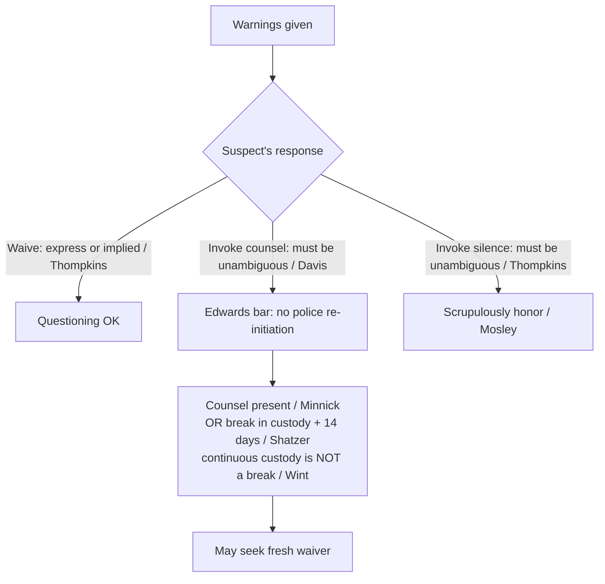

# Miranda: Waiver and Invocation

## Rule

This page picks up *after* the warnings are given — whether warnings were required in the first place is governed by [[Miranda and Custodial Interrogation]]. Once warned, a suspect may **waive** his rights (the waiver must be knowing, intelligent, and voluntary, and it may be express or inferred from conduct) or **invoke** them. Invocation runs on two distinct tracks: an invocation of **counsel** must be unambiguous and triggers the *Edwards* bright-line bar on police-initiated re-questioning, while an invocation of **silence** need only be "scrupulously honored." Miranda-statement fruits (a warned second statement, physical evidence, the deliberate two-step) are governed here; note that Fourth Amendment fruit-of-the-poisonous-tree analysis lives on [[The Exclusionary Rule]].

## Key cases

| Case | Holding (one line) | Weight | CourtListener |
|------|--------------------|--------|---------------|
| *North Carolina v. Butler*, 441 U.S. 369 (1979) | Waiver need not be express; it may be inferred from words and conduct, but silence alone is never enough and the burden stays on the government. | SCOTUS — binding | [opinion](https://www.courtlistener.com/opinion/110065/north-carolina-v-butler/) |
| *Edwards v. Arizona*, 451 U.S. 477 (1981) | Once counsel is invoked, police may not re-initiate interrogation until counsel is made available, unless the accused himself initiates. | SCOTUS — binding | [opinion](https://www.courtlistener.com/opinion/110475/edwards-v-arizona/) |
| *Michigan v. Mosley*, 423 U.S. 96 (1975) | After an invocation of silence, later statements are admissible if the invocation was "scrupulously honored." | SCOTUS — binding | [opinion](https://www.courtlistener.com/opinion/109336/michigan-v-mosley/) |
| *Berghuis v. Thompkins*, 560 U.S. 370 (2010) | Silence alone does not invoke; the right to silence must be invoked unambiguously, and a suspect who answers after a long silence has impliedly waived. | SCOTUS — binding | [opinion](https://www.courtlistener.com/opinion/147529/berghuis-v-thompkins/) |
| *Arizona v. Roberson*, 486 U.S. 675 (1988) | The Edwards bar is not offense-specific — invocation blocks questioning on any offense, and a second officer's ignorance is no excuse. | SCOTUS — binding | [opinion](https://www.courtlistener.com/opinion/112100/arizona-v-roberson/) |
| *Minnick v. Mississippi*, 498 U.S. 146 (1990) | Edwards is not satisfied merely because the suspect already consulted a lawyer; counsel must be present for police-initiated re-questioning. | SCOTUS — binding | [opinion](https://www.courtlistener.com/opinion/112513/minnick-v-mississippi/) |
| *Oregon v. Elstad*, 470 U.S. 298 (1985) | An earlier un-warned but voluntary statement does not taint a later, properly warned and waived confession. | SCOTUS — binding | [opinion](https://www.courtlistener.com/opinion/111364/oregon-v-elstad/) |
| *United States v. Patane*, 542 U.S. 630 (2004) | Physical fruits of an un-warned but voluntary statement are admissible. | SCOTUS — binding | [opinion](https://www.courtlistener.com/opinion/137003/united-states-v-patane/) |
| *Davis v. United States*, 512 U.S. 452 (1994) | Invocation of counsel must be unambiguous; an equivocal reference ("maybe I should talk to a lawyer") does not require police to stop or even to ask clarifying questions. | SCOTUS — binding | [opinion](https://www.courtlistener.com/opinion/117863/davis-v-united-states/) |
| *Maryland v. Shatzer*, 559 U.S. 98 (2010) | A 14-day break in Miranda custody ends Edwards protection; release into the general prison population counts as a break. | SCOTUS — binding | [opinion](https://www.courtlistener.com/opinion/1734/maryland-v-shatzer/) |
| *Missouri v. Seibert*, 542 U.S. 600 (2004) | A deliberate "question-first, warn-later" two-step interrogation is invalid (4-1-4 plurality, Kennedy concurring in the judgment; controlling rationale contested — see Recent developments). | SCOTUS — binding | [opinion](https://www.courtlistener.com/opinion/137002/missouri-v-seibert/) |
| *Moran v. Burbine*, 475 U.S. 412 (1986) | Waiver is valid even though police did not tell the suspect an attorney was trying to reach him; events outside his knowledge do not bear on his waiver. | SCOTUS — binding | [opinion](https://www.courtlistener.com/opinion/111614/moran-v-burbine/) |
| *State v. Wint*, 236 N.J. 174, 198 A.3d 963 (2018) *(state — illustrative, non-binding)* | Continuous pre-indictment pretrial detention is **not** a *Shatzer* break in custody — a suspect held ~6 months after invoking counsel could not be reinterrogated (even on an unrelated out-of-state murder), and repeated fresh warnings did not cure the *Edwards* violation. | NJ Supreme Court — persuasive only | [opinion](https://www.courtlistener.com/opinion/8267547/state-v-wint/) |

## Related cases across doctrines

These cases are treated in full elsewhere but bear on the law of Miranda waiver and invocation, framed here for that doctrine.

| Case | Relevance to Miranda waiver and invocation | Primary treatment | CourtListener |
|------|--------------------------------------------|-------------------|---------------|
| *Montejo v. Louisiana*, 556 U.S. 778 (2009) | A suspect may validly waive his rights and submit to police-initiated interrogation even after counsel has been appointed; the rigid *Edwards*/Miranda bar runs off the suspect's own invocation, not the mere existence of a lawyer (contrast with the Fifth Amendment *Edwards* line). | [[Sixth Amendment Right to Counsel]] | [opinion](https://www.courtlistener.com/opinion/145873/montejo-v-louisiana/) |
| *Patterson v. Illinois*, 487 U.S. 285 (1988) | The standard Miranda warnings themselves convey enough for a knowing and intelligent waiver — the same warnings that waive the Fifth Amendment rights also suffice to waive the post-charge Sixth Amendment right to counsel for questioning. | [[Sixth Amendment Right to Counsel]] | [opinion](https://www.courtlistener.com/opinion/112127/patterson-v-illinois/) |
| *Texas v. Cobb*, 532 U.S. 162 (2001) | The Sixth Amendment right to counsel is offense-specific — a sharp contrast to the offense-blind *Edwards*/*Roberson* bar that follows a Miranda invocation of counsel; officers must keep the two invocation regimes distinct. | [[Sixth Amendment Right to Counsel]] | [opinion](https://www.courtlistener.com/opinion/118417/texas-v-cobb/) |
| *Colorado v. Connelly*, 479 U.S. 157 (1986) | A Miranda waiver is involuntary only where there is coercive police activity (a mentally ill suspect's "voices" do not undercut waiver), and the government's burden to prove waiver is only a preponderance of the evidence. | [[Due-Process Voluntariness of Confessions]] | [opinion](https://www.courtlistener.com/opinion/111779/colorado-v-connelly/) |

## Nuances & limits

- **Waiver can be implied.** *Butler* holds an express written or oral waiver is not required — it may be inferred from the suspect's words and conduct — but **silence alone is never a waiver**, and the burden of proving waiver stays on the government. *Thompkins* applies this in practice: a suspect who stays largely silent and then answers a question after a long interrogation has impliedly waived.
- **Two invocation tracks, two different rules.** Invoking *counsel* triggers *Edwards*' bright-line bar on police-initiated re-questioning; invoking *silence* only requires that police "scrupulously honor" the invocation. Under *Mosley*, that honor was satisfied where questioning ceased, time passed, fresh warnings were given, and the second interrogation concerned a *different* crime (423 U.S. at 104).
- **Same unambiguity gate on both tracks.** *Davis*'s "reasonable officer" test polices entry to *both* tracks: an equivocal reference to counsel is no invocation (512 U.S. at 459), and *Thompkins* imported the same standard into the silence track — a suspect who wants questioning to stop must say so *unambiguously*, not merely fall silent. Neither track is triggered by ambiguity.
- **The Edwards bar is strong and broad.** Once counsel is invoked, *Edwards* bars further interrogation until counsel is made available or the accused himself re-initiates (451 U.S. at 484-85). *Roberson* makes the bar **not offense-specific** — it covers questioning on *any* offense, even an unrelated one, and a second, unaware officer cannot bypass it (486 U.S. at 682, 687-88). (Contrast the offense-specific Sixth Amendment right to counsel, treated on [[Sixth Amendment Right to Counsel]].) *Minnick* confirms the bar is not lifted merely because the suspect has consulted a lawyer; counsel must be **present** for police-initiated re-questioning.
- **The bar is not permanent.** *Shatzer* holds that a **14-day break in Miranda custody** ends Edwards protection, after which police may re-approach and seek a fresh waiver; release back into the general prison population is itself a break in custody.
- **What *Shatzer* actually requires (the most misread holding).** *Shatzer*'s clock is a **break in *Miranda* custody plus 14 days** — not 14 days of *waiting* while the suspect stays in custody. The Court fixed 14 days precisely because that span gives the suspect time "to get reacclimated to his normal life, to consult with friends and counsel, and to shake off any residual coercive effects of his prior custody" (559 U.S. at 110-11). A convicted prisoner's return to the general population can be such a break (he resumes his ordinary day-to-day routine); **continuous pretrial detention is not**, because the coercive *Miranda*-custody pressure never lets up. The mistake to avoid: treating *Shatzer* as a license to re-approach a jailed, counsel-invoking suspect simply because two weeks have passed. *(State — illustrative, non-binding:)* the New Jersey Supreme Court drew exactly this line in *State v. Wint*, holding that a defendant held ~6 months in continuous pre-indictment detention after invoking counsel had **no** *Shatzer* break, so out-of-state detectives' interrogation on an unrelated murder violated *Edwards* despite repeated fresh warnings (198 A.3d at 980).
- **Miranda fruits.** An earlier *un-warned but voluntary* statement does not automatically taint what follows: under *Elstad*, a later confession is admissible if the suspect is then properly Mirandized and waives. *Patane* holds that **physical fruits** of an un-warned voluntary statement are admissible. Both turn on the earlier statement being *voluntary* in the due-process sense — actual coercion is a separate problem treated on [[Due-Process Voluntariness of Confessions]]. But *Seibert* invalidates the **deliberate** "question-first, warn-later" two-step designed to circumvent Miranda — *Elstad*'s safe harbor does not cover bad-faith end-runs.
- **Waiver tests the suspect's knowledge, not the police's candor.** *Moran v. Burbine* holds a waiver valid even though officers withheld that an attorney was trying to reach the suspect; events outside the suspect's awareness do not undermine his own knowing, intelligent, and voluntary choice.

## Common pitfalls

- **Treating silence as an invocation.** Under *Thompkins*, merely staying quiet neither invokes the right to silence nor blocks waiver — to stop questioning, the suspect must invoke *unambiguously*.
- **Treating an ambiguous lawyer reference as an invocation.** *Davis* is clear: officers may keep questioning after an equivocal statement: "But if a suspect makes a reference to an attorney that is ambiguous or equivocal in that a reasonable officer in light of the circumstances would have understood only that the suspect might be invoking the right to counsel, our precedents do not require the cessation of questioning." (512 U.S. at 459.) Officers are not even *required* to ask clarifying questions, though doing so is good practice. *(State — illustrative, non-binding:)* how literally courts apply this is captured by the much-discussed "lawyer dog" anecdote — *State v. Demesme*, 228 So. 3d 1206 (La. 2017), where a concurrence to a writ denial treated "why don't you just give me a lawyer dog cause this is not what's up" as too ambiguous to invoke.
- **Confusing the two tracks.** Invoking *silence* (scrupulously-honor, re-questioning on a different crime can be permissible under *Mosley*) is not the same as invoking *counsel* (the rigid, offense-blind *Edwards* bar). Officers who treat them identically either over- or under-protect the suspect.
- **Misreading *Shatzer* as a 14-day waiting period.** *Shatzer* does **not** authorize re-approaching a suspect who invoked counsel just because 14 days have elapsed — it requires a genuine *break in Miranda custody* (e.g., release to the general prison population) plus 14 days. A suspect sitting in continuous jail custody never gets a *Shatzer* break, so *Edwards* still bars police-initiated re-questioning. *(See* the *Wint* illustration above.)*

## Recent developments & subsequent treatment

The SCOTUS framework above remains the controlling law; the live federal action is in how the circuits apply *Seibert*'s fractured opinion to the deliberate "question-first, warn-later" two-step. Because *Seibert* produced no majority rationale, lower courts run it through *Marks v. United States* to find the narrowest controlling holding — and they have not agreed, leaving a persisting circuit split. No SCOTUS case is currently pending to resolve it.

- **United States v. Capers, 627 F.3d 470 (2d Cir. 2010) / United States v. Williams, 435 F.3d 1148 (9th Cir. 2006)** — Applying *Marks* to the fractured *Seibert* decision, courts must identify the narrowest controlling rationale for the deliberate "question-first, warn-later" two-step. *Williams* (9th Cir.) holds the plurality opinion "as narrowed by Justice Kennedy" controls: a postwarning confession is suppressed where police DELIBERATELY used the two-step strategy and curative measures were absent or ineffective. *Capers* (2d Cir.) is in accord, treating Kennedy's intent-based concurrence as controlling. Lower courts remain split over which *Seibert* opinion controls — the plurality's objective "effectiveness of the midstream warnings" test versus Justice Kennedy's narrower "calculated intent to undermine Miranda" test. *Williams* itself, however, does not adopt Kennedy's intent test alone: applying *Marks*, it treats as "*Seibert*'s holding" a **combined** controlling test drawn from both the plurality and Justice Kennedy — a court must suppress a postwarning confession only where (1) officers **deliberately** used the two-step strategy (Kennedy's intent-based narrowing) **and** (2) the midstream *Miranda* warning, judged objectively, "did not effectively apprise the suspect of his rights" (the plurality's effectiveness inquiry). These are **circuit decisions — persuasive, not binding** nationwide. ⚖ Circuit split. "Applying the *Marks* rule to *Seibert*, we hold that a trial court must suppress postwarning confessions obtained during a deliberate two-step interrogation where the midstream Miranda warning — in light of the objective facts and circumstances — did not effectively apprise the suspect of his rights." (*Williams*, 435 F.3d at 1157-58.) [opinion](https://www.courtlistener.com/opinion/180156/united-states-v-capers/) · [opinion](https://www.courtlistener.com/opinion/793121/united-states-v-tashiri-wayne-williams/)

## Visual

## Sources

- [North Carolina v. Butler, 441 U.S. 369 (1979)](https://www.courtlistener.com/opinion/110065/north-carolina-v-butler/)
- [Edwards v. Arizona, 451 U.S. 477 (1981)](https://www.courtlistener.com/opinion/110475/edwards-v-arizona/)
- [Michigan v. Mosley, 423 U.S. 96 (1975)](https://www.courtlistener.com/opinion/109336/michigan-v-mosley/)
- [Berghuis v. Thompkins, 560 U.S. 370 (2010)](https://www.courtlistener.com/opinion/147529/berghuis-v-thompkins/)
- [Arizona v. Roberson, 486 U.S. 675 (1988)](https://www.courtlistener.com/opinion/112100/arizona-v-roberson/)
- [Minnick v. Mississippi, 498 U.S. 146 (1990)](https://www.courtlistener.com/opinion/112513/minnick-v-mississippi/)
- [Oregon v. Elstad, 470 U.S. 298 (1985)](https://www.courtlistener.com/opinion/111364/oregon-v-elstad/)
- [United States v. Patane, 542 U.S. 630 (2004)](https://www.courtlistener.com/opinion/137003/united-states-v-patane/)
- [Davis v. United States, 512 U.S. 452 (1994)](https://www.courtlistener.com/opinion/117863/davis-v-united-states/)
- [Maryland v. Shatzer, 559 U.S. 98 (2010)](https://www.courtlistener.com/opinion/1734/maryland-v-shatzer/)
- [Missouri v. Seibert, 542 U.S. 600 (2004)](https://www.courtlistener.com/opinion/137002/missouri-v-seibert/)
- [Moran v. Burbine, 475 U.S. 412 (1986)](https://www.courtlistener.com/opinion/111614/moran-v-burbine/)
- [State v. Wint, 236 N.J. 174, 198 A.3d 963 (2018)](https://www.courtlistener.com/opinion/8267547/state-v-wint/) *(state — illustrative, non-binding)*
- [State v. Demesme, 228 So. 3d 1206 (La. 2017)](https://www.courtlistener.com/opinion/5035127/state-v-demesme/) *(state — illustrative, non-binding)*
