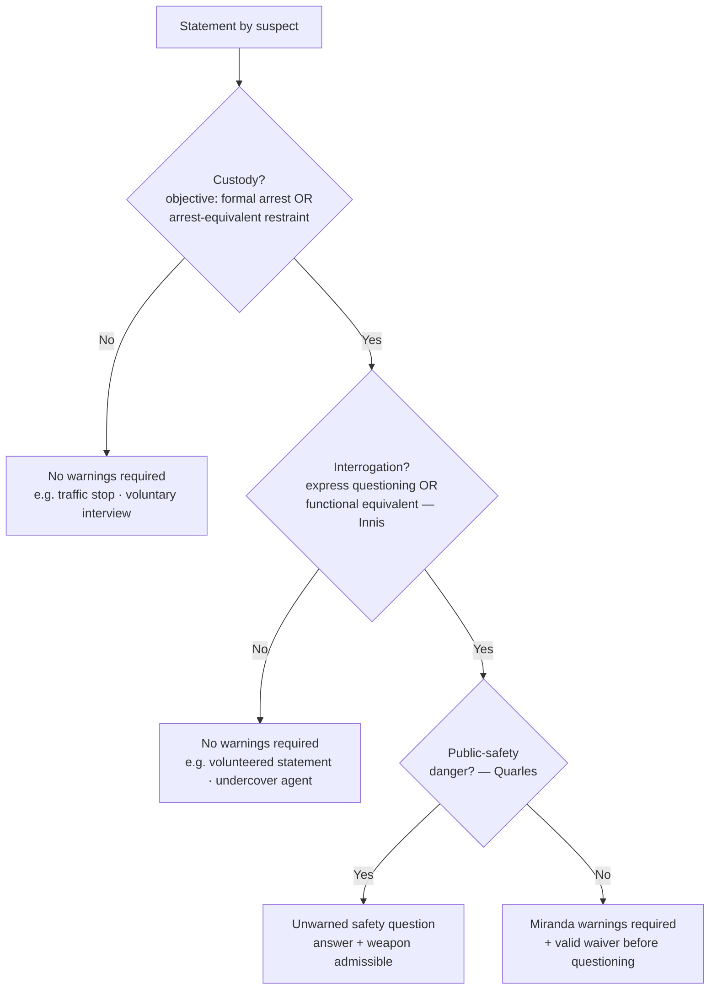

---
aliases:
  - "Miranda and Custodial Interrogation"
topic: Miranda and Custodial Interrogation
type: doctrine
jurisdiction: Federal (U.S. Const. amend. V); SCOTUS baseline
status: verified
related:
  - "[[Miranda Waiver and Invocation]]"
  - "[[Due-Process Voluntariness of Confessions]]"
  - "[[Sixth Amendment Right to Counsel]]"
  - "[[Seizure of the Person]]"
  - "[[Traffic Stops]]"
  - "[[Section 1983 Liability and Qualified Immunity]]"
---

# Miranda and Custodial Interrogation

## The Brief

**Field-decisive question:** *Do I have to Mirandize this person — is this **custody** + **interrogation**?*

**Black-letter rule.** A suspect's statements obtained through **custodial interrogation** are **inadmissible in the prosecution's case-in-chief** unless the police first gave the **[[Miranda v. Arizona|*Miranda*]] warnings** and the suspect made a **knowing, voluntary waiver** ([[Miranda v. Arizona#Rule|*Miranda v. Arizona*]]). Warnings are owed only when **both** triggers are present — the instructor's "two C's": **Custody** *and* **Interrogation**. Neither one alone requires warnings, and a volunteered statement is never the product of interrogation.

**Trigger 1 — Custody.** Custody means a **formal arrest** *or* a **restraint on freedom of movement of the degree associated with a formal arrest**, judged by an **objective** test — what a reasonable person in the suspect's position would understand, not the officer's private view ([[California v. Beheler#Rule|*Beheler*]]; [[Stansbury v. California|*Stansbury*]] — an officer's undisclosed suspicion is irrelevant). The inquiry has two parts: the factual circumstances of the interrogation, and whether, given them, a reasonable person would have felt free to terminate the questioning and leave ([[Thompson v. Keohane|*Thompson v. Keohane*]]). Applying that test:
- An **ordinary traffic stop is not custody** — it is temporary, public, and non-arrest-equivalent ([[Berkemer v. McCarty#Rule|*Berkemer*]]), and the same holds for **roadside DUI field-sobriety questioning** before arrest ([[Pennsylvania v. Bruder|*Bruder*]], applying *Berkemer*).
- A **voluntary station-house interview** is **not automatically** custody: where the suspect comes in voluntarily, is told he is not under arrest, and is free to leave, he is not "in custody" ([[Oregon v. Mathiason|*Mathiason*]]; [[California v. Beheler|*Beheler*]]) — and custody turns on **restraint, not focus**: an IRS target interviewed in his own home is not in custody merely because the investigation has zeroed in on him ([[Beckwith v. United States|*Beckwith*]]).
- **Setting is not dispositive — restraint is.** Custody can exist in the suspect's **own bedroom** when four officers question him under arrest in the early morning ([[Orozco v. Texas|*Orozco*]]); conversely, **incarceration alone is not custody** — questioning a prison inmate requires a totality analysis, not an automatic finding ([[Howes v. Fields|*Howes v. Fields*]]). But a person **already in custody who is questioned about an unrelated matter can be** in *Miranda* custody — the reason for the confinement does not curtail the warnings ([[Mathis v. United States (1968)|*Mathis*]], *limited by* [[Howes v. Fields]] as to the broad "imprisonment = custody" reading).
- Because the test is **objective**, a **child's age counts** in the custody calculus **when it was known to or objectively apparent to** the officer ([[J.D.B. v. North Carolina#Rule|*J.D.B.*]]); but age/experience were **not** part of the clearly-established objective test for AEDPA purposes at the time of [[Yarborough v. Alvarado|*Yarborough v. Alvarado*]].

**Trigger 2 — Interrogation.** Interrogation means **express questioning** *or* its **functional equivalent** — "any words or actions on the part of the police (other than those normally attendant to arrest and custody) that the police **should know are reasonably likely to elicit an incriminating response**," a test that focuses on the **suspect's perceptions**, not the officer's intent ([[Rhode Island v. Innis#Rule|*Innis*]]). Applying it:
- Officers do **not** interrogate merely by **hoping** a suspect incriminates himself — letting a suspect who invoked speak with his wife while an officer records is not the functional equivalent of questioning ([[Arizona v. Mauro|*Mauro*]]).
- **Routine booking questions** (name, address, and the like) fall within a **booking exception**; but a question whose answer's *content* reveals a suspect's impaired mental state (the "sixth-birthday" question) is testimonial and must be suppressed if unwarned, whereas the merely **physical** manner of slurred speech is not ([[Pennsylvania v. Muniz|*Muniz*]]).
- There is **no interrogation** — indeed no *Miranda* at all — where an **undercover officer or agent posing as an inmate** draws out statements, because a suspect who does not know he faces the State feels no police-dominated coercion ([[Illinois v. Perkins|*Perkins*]]).

**Content of the warnings.** The four warnings are substantively required, but **no talismanic recitation** is: warnings are adequate if, read as a whole and given a commonsense reading, they **reasonably convey** the suspect's rights ([[California v. Prysock|*Prysock*]]; [[Duckworth v. Eagan|*Duckworth*]] — "if and when you go to court" language upheld in context; [[Florida v. Powell|*Powell*]] — advice reasonably conveying the right to counsel *throughout* interrogation).

**Public-safety exception.** Warnings may be **dispensed with** for questions **reasonably prompted by an immediate threat to public safety** — asking a just-arrested suspect where a hidden loaded gun is, before *Mirandizing* him; both the answer and the weapon are admissible ([[New York v. Quarles#Rule|*Quarles*]]). It is narrow: it reaches questions **neutralizing an immediate danger**, not routine investigative fact-gathering.

**Fruits and procedure (summary — full treatment in [[Miranda Waiver and Invocation]]).** A first, **un-warned but voluntary** statement does **not automatically taint** a later, properly warned one ([[Oregon v. Elstad|*Elstad*]]) — **but** where officers **deliberately** use a "question-first, warn-later" **two-step** to undermine *Miranda*, the midstream warnings may be ineffective and the second statement suppressed (*Elstad* *limited by* [[Missouri v. Seibert|*Seibert*]]). And the **physical fruits** of an un-warned voluntary statement are **admissible** ([[United States v. Patane|*Patane*]]).

**Constitutional status and remedy.** *Miranda* is a **constitutional rule** that Congress **cannot override by statute** — 18 U.S.C. § 3501 cannot displace it ([[Dickerson v. United States#Rule|*Dickerson*]]). Its rules are nonetheless **prophylactic**: a bare *Miranda* violation (admission of an un-warned statement) is **not itself a Fifth Amendment violation and will not support a 42 U.S.C. § 1983 damages suit** against the officer ([[Vega v. Tekoh#Rule|*Vega v. Tekoh*]], qualifying *Dickerson*'s "constitutional rule" framing) — consistent with the rule that the Self-Incrimination Clause is a **trial right**, so coercive questioning that yields no statement used at a criminal trial is not, by itself, a completed Fifth Amendment violation ([[Chavez v. Martinez|*Chavez v. Martinez*]]).

**Elements · burden · standard of review · remedy.**
- **Elements:** (1) custody (objective, arrest-equivalent restraint) **and** (2) interrogation (express questioning or its functional equivalent) — **both** required; then (3) absence of warnings **or** of a valid waiver.
- **Burden:** the prosecution carries the burden of establishing that the warnings were given and that the suspect **knowingly and voluntarily waived** before a custodial-interrogation statement may be used in its case-in-chief ([[Miranda v. Arizona]]); the waiver/invocation burden and its preponderance standard are developed in [[Miranda Waiver and Invocation]].
- **Standard of review:** the ultimate custody determination is a **mixed question of law and fact** subject to **independent ([[Common Legal Terms#de-novo|de novo]]) federal review** ([[Thompson v. Keohane]]).
- **Remedy:** **exclusion from the prosecution's case-in-chief** ([[Miranda v. Arizona]]) — but **not** a § 1983 damages remedy ([[Vega v. Tekoh]]), **not** suppression of physical fruits ([[United States v. Patane]]), and an un-warned statement may still be available to **impeach** (see [[Miranda Waiver and Invocation]]).

**Watch the common pitfalls.** Do not treat *Miranda* as covering **all police contact** — warnings attach only when custody **and** interrogation coincide, so on-scene, consensual, or non-custodial questioning needs none. Do not call a *[[Terry Stops and Reasonable Suspicion|Terry]]* or traffic stop "custody": a brief public detention is a [[Seizure of the Person|Fourth Amendment seizure]] but not *Miranda* custody ([[Berkemer v. McCarty]]; see [[Traffic Stops]]). Do not suppress **volunteered** statements — spontaneous, unsolicited words, even after arrest, are not the product of interrogation ([[Rhode Island v. Innis]]). Do not rely on the officer's **unspoken** view of the suspect — custody is objective ([[Stansbury v. California]]). And do not read the public-safety exception broadly — it is confined to neutralizing an **immediate** danger ([[New York v. Quarles]]).

> **Scope note.** This page covers whether warnings are **required** — the custody + interrogation gate — plus the **content of the warnings** and the **public-safety exception**, with a summary of the fruits line. What happens *after* warnings — **waiver, invocation, and the fuller fruits/impeachment analysis** — lives in [[Miranda Waiver and Invocation]]. Coercion claims independent of *Miranda* go to [[Due-Process Voluntariness of Confessions]]. The distinct, offense-specific **Sixth Amendment** right that attaches at formal charging is treated in [[Sixth Amendment Right to Counsel]].

## Key cases

| Case | Holding (one line) | Weight | Treatment | CourtListener |
| --- | --- | --- | --- | --- |
| [[Miranda v. Arizona]] | Custodial-interrogation statements are inadmissible absent the warnings and a knowing, voluntary waiver. | Binding — SCOTUS | good | [opinion](https://www.courtlistener.com/opinion/107252/miranda-v-arizona/) |
| [[Berkemer v. McCarty]] | *Miranda* covers all offenses, but an ordinary traffic stop is not custody. | Binding — SCOTUS | good | [opinion](https://www.courtlistener.com/opinion/111249/berkemer-v-mccarty/) |
| [[Beckwith v. United States]] | Custody, not investigative "focus," triggers *Miranda*; a non-custodial home interview of a tax target is not custody. | Binding — SCOTUS | good | [opinion](https://www.courtlistener.com/opinion/109430/beckwith-v-united-states/) |
| [[California v. Beheler]] | A voluntary station interview after which the suspect may leave is not custody; the test is formal arrest or arrest-equivalent restraint. | Binding — SCOTUS | good | [opinion](https://www.courtlistener.com/opinion/111023/california-v-beheler/) |
| [[Oregon v. Mathiason]] | A voluntary station-house interview, told free to leave, is not custody. | Binding — SCOTUS | good | [opinion](https://www.courtlistener.com/opinion/109587/oregon-v-mathiason/) |
| [[Orozco v. Texas]] | Custody can exist in the suspect's own bedroom; it is not limited to the stationhouse. | Binding — SCOTUS | good | [opinion](https://www.courtlistener.com/opinion/107883/orozco-v-texas/) |
| [[Stansbury v. California]] | Custody is objective; an officer's undisclosed suspicion is irrelevant. | Binding — SCOTUS | good | [opinion](https://www.courtlistener.com/opinion/117843/stansbury-v-california/) |
| [[Howes v. Fields]] | Imprisonment alone is not *Miranda* custody; custody turns on the totality. | Binding — SCOTUS | good | [opinion](https://www.courtlistener.com/opinion/623144/howes-v-fields/) |
| [[Mathis v. United States (1968)]] | A person already in custody, questioned on an unrelated matter, can be in *Miranda* custody. | Binding — SCOTUS | limited — *limited by* [[Howes v. Fields]] | [opinion](https://www.courtlistener.com/opinion/107676/mathis-v-united-states/) |
| [[Thompson v. Keohane]] | Custody is a two-part objective inquiry and a mixed question of law and fact subject to independent federal review. | Binding — SCOTUS | good | [opinion](https://www.courtlistener.com/opinion/117982/thompson-v-keohane/) |
| [[Yarborough v. Alvarado]] | The custody test is objective; age/experience were not clearly-established elements of it (AEDPA). | Binding — SCOTUS | good | [opinion](https://www.courtlistener.com/opinion/134748/yarborough-v-alvarado/) |
| [[J.D.B. v. North Carolina]] | A child's age is part of the objective custody analysis when known/apparent to the officer. | Binding — SCOTUS | good | [opinion](https://www.courtlistener.com/opinion/218925/j-d-b-v-north-carolina/) |
| [[Rhode Island v. Innis]] | "Interrogation" includes express questioning *and* its functional equivalent. | Binding — SCOTUS | good | [opinion](https://www.courtlistener.com/opinion/110254/rhode-island-v-innis/) |
| [[Arizona v. Mauro]] | Merely hoping a suspect incriminates himself (recorded spousal visit) is not interrogation. | Binding — SCOTUS | good | [opinion](https://www.courtlistener.com/opinion/111878/arizona-v-mauro/) |
| [[Pennsylvania v. Muniz]] | Routine booking questions are exempt; a content-testimonial question is interrogation; slurred-speech manner is non-testimonial. | Binding — SCOTUS | good | [opinion](https://www.courtlistener.com/opinion/112464/pennsylvania-v-muniz/) |
| [[Illinois v. Perkins]] | No warnings for an undercover/jailhouse agent — no police-dominated coercive atmosphere. | Binding — SCOTUS | good | [opinion](https://www.courtlistener.com/opinion/112452/illinois-v-perkins/) |
| [[California v. Prysock]] | Warnings need not be verbatim; adequate if they reasonably convey the rights. | Binding — SCOTUS | good | [opinion](https://www.courtlistener.com/opinion/110556/california-v-prysock/) |
| [[Duckworth v. Eagan]] | "If and when you go to court" counsel language is adequate read in totality. | Binding — SCOTUS | good | [opinion](https://www.courtlistener.com/opinion/112322/duckworth-v-eagan/) |
| [[Florida v. Powell]] | Warnings need no precise words; test is whether they reasonably convey the rights, including counsel throughout. | Binding — SCOTUS | good | [opinion](https://www.courtlistener.com/opinion/1736/florida-v-powell/) |
| [[New York v. Quarles]] | Public-safety exception: unwarned questions to neutralize an immediate danger are allowed. | Binding — SCOTUS | good | [opinion](https://www.courtlistener.com/opinion/111214/new-york-v-quarles/) |
| [[Dickerson v. United States]] | *Miranda* is a constitutional rule; 18 U.S.C. § 3501 cannot supersede it. | Binding — SCOTUS | good | [opinion](https://www.courtlistener.com/opinion/118380/dickerson-v-united-states/) |
| [[Vega v. Tekoh]] | A *Miranda* violation is not itself a Fifth Amendment violation and supports no § 1983 damages claim. | Binding — SCOTUS | good | [opinion](https://www.courtlistener.com/opinion/6480695/vega-v-tekoh/) |
| [[Chavez v. Martinez]] | The Self-Incrimination Clause is a trial right; coercive questioning yielding no trial-used statement is not itself a completed violation. | Binding — SCOTUS | good | [opinion](https://www.courtlistener.com/opinion/127927/chavez-v-martinez/) |

## Related cases across doctrines

These cases are treated in full on other pages but bear directly on custodial interrogation, framed here for that doctrine.

| Case | Relevance to Miranda and custodial interrogation | Primary treatment | Weight | Treatment | CourtListener |
| --- | --- | --- | --- | --- | --- |
| [[Brewer v. Williams]] | The "Christian burial speech" is the textbook illustration of the *functional equivalent* of interrogation — words an officer should know are reasonably likely to elicit an incriminating response — **but the Court decided it on Sixth Amendment (deliberate-elicitation) grounds**, and *Innis* itself *distinguished* *Brewer* rather than treating it as a *Miranda* illustration; keep the 5A *Innis* functional-equivalent standard separate from the 6A [[Massiah v. United States|*Massiah*]]/*Brewer* deliberate-elicitation standard. | [[Sixth Amendment Right to Counsel]] | Binding — SCOTUS | good | [opinion](https://www.courtlistener.com/opinion/109624/brewer-v-williams/) |
| [[Escobedo v. Illinois]] | The historical precursor — custodial questioning of a focus-suspect denied counsel — later recast as a Fifth Amendment matter and confined to its facts; taught as origin, not a freestanding test. | [[Sixth Amendment Right to Counsel]] | Binding — SCOTUS | limited — superseded by [[Miranda v. Arizona]]; confined to its facts by [[Kirby v. Illinois]] | [opinion](https://www.courtlistener.com/opinion/106883/escobedo-v-illinois/) |
| [[Malloy v. Hogan]] | Incorporates the Fifth Amendment privilege against self-incrimination against the States — the constitutional footing on which *Miranda* rests. | [[Due-Process Voluntariness of Confessions]] | Binding — SCOTUS | good | [opinion](https://www.courtlistener.com/opinion/106862/malloy-v-hogan/) |
| [[Corley v. United States]] | The McNabb-Mallory prompt-presentment rule is a **separate** suppression path for federal confessions (unreasonable pre-presentment delay), independent of the *Miranda* gate. | [[Due-Process Voluntariness of Confessions]] | Binding — SCOTUS | good | [opinion](https://www.courtlistener.com/opinion/145888/corley-v-united-states/) |
| [[Dunaway v. New York]] | An arrest-tantamount seizure on less than probable cause makes the resulting confession a fruit of the illegal seizure that *Miranda* warnings alone do not attenuate. | [[Seizure of the Person]] | Binding — SCOTUS | good | [opinion](https://www.courtlistener.com/opinion/110096/dunaway-v-new-york/) |
| [[Kaupp v. Texas]] | A 3 a.m. removal without probable cause is an arrest; "Okay" was submission, not consent, so the confession is suppressed unless the taint is purged — warnings do not cure the illegal seizure. | [[Seizure of the Person]] | Binding — SCOTUS | good | [opinion](https://www.courtlistener.com/opinion/127919/kaupp-v-texas/) |
| [[Pennsylvania v. Bruder]] | Ordinary roadside DUI field-sobriety questioning before arrest is not custodial interrogation (applying *Berkemer*). | [[Traffic Stops]] | Binding — SCOTUS | good | [opinion](https://www.courtlistener.com/opinion/112152/pennsylvania-v-bruder/) |

## Recent developments

Circuit/state authority only; no SCOTUS. The core *Miranda* trigger (custody + interrogation) and the *Quarles* public-safety exception remain settled, but the circuits diverge on how far the public-safety exception reaches once an arrestee is secured.

- **United States v. Liddell, 517 F.3d 1007 (8th Cir. 2008)** — role: **expand / illustrates-a-split**. The Eighth Circuit read the public-safety exception broadly, extending it to the **generalized** risk that officers might mishandle an undiscovered weapon when searching a **secured** arrestee's car or apartment — even absent a true immediate exigency — so that questions about weapons or contraband are admissible: "the risk of police officers being injured by the mishandling of unknown firearms or drug paraphernalia provides a sufficient public safety basis to ask a suspect who has been arrested and secured whether there are weapons or contraband in a car or apartment that the police are about to search" (517 F.3d at 1009–10). **Binding in-circuit — 8th Cir.** (Persuasive outside the circuit); the opinion expressly acknowledges a **circuit split** (Judge Gruender [[Common Legal Terms#concurring-opinion|concurred]] to criticize the broad reading as untethered from *Quarles*'s exigency requirement), with a narrower line confining the exception to an actual, immediate threat. ⚖ Circuit split. [opinion](https://www.courtlistener.com/opinion/1461978/united-states-v-liddell/).

## Visual

## Sources

- [Miranda v. Arizona, 384 U.S. 436 (1966)](https://www.courtlistener.com/opinion/107252/miranda-v-arizona/)
- [Rhode Island v. Innis, 446 U.S. 291 (1980)](https://www.courtlistener.com/opinion/110254/rhode-island-v-innis/)
- [Berkemer v. McCarty, 468 U.S. 420 (1984)](https://www.courtlistener.com/opinion/111249/berkemer-v-mccarty/)
- [Beckwith v. United States, 425 U.S. 341 (1976)](https://www.courtlistener.com/opinion/109430/beckwith-v-united-states/)
- [California v. Beheler, 463 U.S. 1121 (1983)](https://www.courtlistener.com/opinion/111023/california-v-beheler/)
- [Oregon v. Mathiason, 429 U.S. 492 (1977)](https://www.courtlistener.com/opinion/109587/oregon-v-mathiason/)
- [Orozco v. Texas, 394 U.S. 324 (1969)](https://www.courtlistener.com/opinion/107883/orozco-v-texas/)
- [Stansbury v. California, 511 U.S. 318 (1994)](https://www.courtlistener.com/opinion/117843/stansbury-v-california/)
- [Howes v. Fields, 565 U.S. 499 (2012)](https://www.courtlistener.com/opinion/623144/howes-v-fields/)
- [Mathis v. United States, 391 U.S. 1 (1968)](https://www.courtlistener.com/opinion/107676/mathis-v-united-states/)
- [Thompson v. Keohane, 516 U.S. 99 (1995)](https://www.courtlistener.com/opinion/117982/thompson-v-keohane/)
- [Yarborough v. Alvarado, 541 U.S. 652 (2004)](https://www.courtlistener.com/opinion/134748/yarborough-v-alvarado/)
- [J.D.B. v. North Carolina, 564 U.S. 261 (2011)](https://www.courtlistener.com/opinion/218925/j-d-b-v-north-carolina/)
- [Arizona v. Mauro, 481 U.S. 520 (1987)](https://www.courtlistener.com/opinion/111878/arizona-v-mauro/)
- [Pennsylvania v. Muniz, 496 U.S. 582 (1990)](https://www.courtlistener.com/opinion/112464/pennsylvania-v-muniz/)
- [Illinois v. Perkins, 496 U.S. 292 (1990)](https://www.courtlistener.com/opinion/112452/illinois-v-perkins/)
- [California v. Prysock, 451 U.S. 355 (1981)](https://www.courtlistener.com/opinion/110556/california-v-prysock/)
- [Duckworth v. Eagan, 492 U.S. 195 (1989)](https://www.courtlistener.com/opinion/112322/duckworth-v-eagan/)
- [Florida v. Powell, 559 U.S. 50 (2010)](https://www.courtlistener.com/opinion/1736/florida-v-powell/)
- [New York v. Quarles, 467 U.S. 649 (1984)](https://www.courtlistener.com/opinion/111214/new-york-v-quarles/)
- [Oregon v. Elstad, 470 U.S. 298 (1985)](https://www.courtlistener.com/opinion/111364/oregon-v-elstad/)
- [Missouri v. Seibert, 542 U.S. 600 (2004)](https://www.courtlistener.com/opinion/137002/missouri-v-seibert/)
- [United States v. Patane, 542 U.S. 630 (2004)](https://www.courtlistener.com/opinion/137003/united-states-v-patane/)
- [Dickerson v. United States, 530 U.S. 428 (2000)](https://www.courtlistener.com/opinion/118380/dickerson-v-united-states/)
- [Vega v. Tekoh, 597 U.S. 134 (2022)](https://www.courtlistener.com/opinion/6480695/vega-v-tekoh/)
- [Chavez v. Martinez, 538 U.S. 760 (2003)](https://www.courtlistener.com/opinion/127927/chavez-v-martinez/)
- [Escobedo v. Illinois, 378 U.S. 478 (1964)](https://www.courtlistener.com/opinion/106883/escobedo-v-illinois/)
- [Malloy v. Hogan, 378 U.S. 1 (1964)](https://www.courtlistener.com/opinion/106862/malloy-v-hogan/)
- [Corley v. United States, 556 U.S. 303 (2009)](https://www.courtlistener.com/opinion/145888/corley-v-united-states/)
- [Dunaway v. New York, 442 U.S. 200 (1979)](https://www.courtlistener.com/opinion/110096/dunaway-v-new-york/)
- [Kaupp v. Texas, 538 U.S. 626 (2003)](https://www.courtlistener.com/opinion/127919/kaupp-v-texas/)
- [Pennsylvania v. Bruder, 488 U.S. 9 (1988)](https://www.courtlistener.com/opinion/112152/pennsylvania-v-bruder/)
- [Brewer v. Williams, 430 U.S. 387 (1977)](https://www.courtlistener.com/opinion/109624/brewer-v-williams/)
