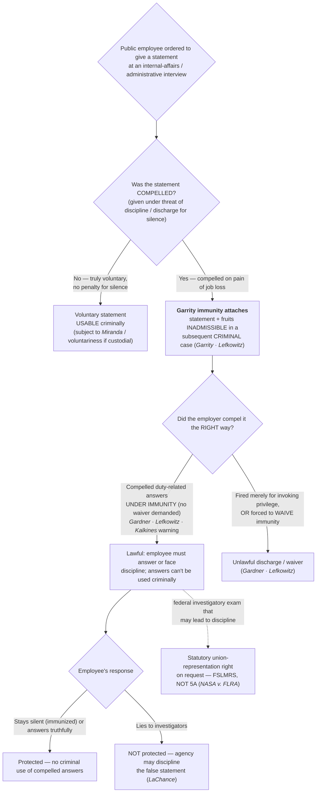

# Public-Employee Compelled Statements (Garrity)

> **Why this page is CORE (provenance).** This doctrine sits in an **employment / internal-affairs** posture rather than field search-and-seizure, so **S2 §2.0** originally tagged the government-employee Fifth-Amendment (*[[Garrity v. New Jersey|Garrity]]*) cluster **OPTIONAL**. It is promoted to **CORE** on **audience-relevance** grounds — the students *are* the public employees (police officers), and *[[Garrity v. New Jersey|Garrity]]*/*[[Kalkines v. United States|Kalkines]]* warnings bear on them directly (**U2-S5 / D3-S2**). The promotion **supersedes S2 §2.0's OPTIONAL tag** for this one cluster; recommend adding the one-line OPTIONAL→CORE cross-ref to S2 §2.0 at execution (the APPROVED S2 is not edited here). The six *[[Garrity v. New Jersey|Garrity]]*-cluster case pages S5 ingested (verified, live-checked) home to this page.

## The Brief

**Field-decisive question:** *I am ordered to give a statement at an internal-affairs interview — what is compelled, what is immunized, and what can be used against me criminally?* This page is written for the **officer as the public employee**. It does not ask what an officer may do in the field; it asks what happens when the officer's own employer orders a statement in an administrative/IA inquiry while a criminal investigation looms. The engine is the Fifth Amendment privilege against self-incrimination (applied to the states through the Fourteenth), not custody or interrogation.

**The black-letter rule — Garrity immunity (stated up front).** Statements **compelled** from a public employee under threat of **losing the job** are **coerced**, and the Constitution bars their use against the employee in a **subsequent criminal case**. In *[[Garrity v. New Jersey]]*, the officers were told they could refuse to answer, but that a refusal would forfeit their offices under a state statute; the Court held that "[t]he option to lose their means of livelihood or to pay the penalty of self-incrimination is the antithesis of free choice to speak out or to remain silent." *[[Garrity v. New Jersey#^pin-497|Garrity v. New Jersey]]*, 385 U.S. 493, 497 (1967). It therefore held "the protection of the individual under the Fourteenth Amendment against coerced statements prohibits use in subsequent criminal proceedings of statements obtained under threat of removal from office, and that it extends to all, whether they are policemen or other members of our body politic." *[[Garrity v. New Jersey#^pin-500|Id.]]* at 500. The immunity is a consequence of the **compulsion itself** — it attaches because the statement was extracted on pain of job loss, not because any particular form was read. Its reach includes the statement's **fruits**: answers "elicited upon the threat of the loss of employment are compelled and inadmissible in evidence." *[[Lefkowitz v. Turley#^pin-84a|Lefkowitz v. Turley]]*, 414 U.S. 70, 84–85 (1973).

**The employer's side — the government may compel, but only under immunity (Gardner / Lefkowitz).** *[[Garrity v. New Jersey|Garrity]]* immunity is **not** a shield that lets the officer refuse the IA order. The employer **may** require a public employee to answer questions **"specifically, directly, and narrowly relating to the performance of his official duties,"** on pain of dismissal — **but only if** the employee is **not required to waive** the immunity. *[[Gardner v. Broderick]]* holds that a policeman may **not** be fired **merely for refusing to sign a waiver of immunity** before a grand jury: "the mandate of the great privilege against self-incrimination does not tolerate the attempt . . . to coerce a waiver of the immunity it confers on penalty of the loss of employment." *[[Gardner v. Broderick#^pin-279|Gardner v. Broderick]]*, 392 U.S. 273, 279 (1968). Had the officer instead "refused to answer questions specifically, directly, and narrowly relating to the performance of his official duties, **without being required to waive his immunity** . . . the privilege . . . would not have been a bar to his dismissal." *[[Gardner v. Broderick#^pin-278|Id.]]* at 278. *[[Lefkowitz v. Turley]]* fixes the same line and extends it beyond employees to independent contractors: "given adequate immunity, the State may plainly insist that employees either answer questions under oath about the performance of their job or suffer the loss of employment," *[[Lefkowitz v. Turley#^pin-84|Lefkowitz v. Turley]]*, 414 U.S. at 84, but "the State may not insist that [they] waive their Fifth Amendment privilege . . . and consent to the use of the fruits of the interrogation in any later proceedings," and "must offer . . . whatever immunity is required to supplant the privilege." *[[Lefkowitz v. Turley#^pin-84a|Id.]]* at 84–85. **The bargain the Constitution forbids is "invoke and be fired *and* have your statement used."** The bargain it permits is "answer, keep your job, and the answer cannot be used to prosecute you."

**The warning — Garrity / Kalkines.** Because the line turns on whether the employee was compelled *and* immunized, the practice grew up of **advising the employee before the compelled interview**. The **Garrity warning** — the common name in state and local police IA practice, tracing to *[[Garrity v. New Jersey|Garrity]]*, *[[Gardner v. Broderick|Gardner]]*, and *[[Lefkowitz v. Turley|Lefkowitz]]* — tells the employee two things: (1) you are **ordered to answer**, and refusing may result in **discipline or discharge**; and (2) your compelled answers **cannot be used against you in a criminal prosecution**. The federal-sector formulation is the **Kalkines warning**: "a governmental employer is not wholly barred from insisting that relevant information be given it; the public servant can be removed for not replying if he is **adequately informed both that he is subject to discharge for not answering and that his replies (and their fruits) cannot be employed against him in a criminal case.**" *[[Kalkines v. United States#^pin-1393|Kalkines v. United States]]*, 473 F.2d 1391, 1393 (Ct. Cl. 1973). Conversely, "the individual cannot be discharged simply because he invokes his Fifth Amendment privilege . . . in refusing to respond." *[[Kalkines v. United States#^pin-1393a|Id.]]* An employer that wants the answers **must supply the immunizing warning**; if it does not, a discharge grounded on the employee's refusal to answer is invalid (as *[[Kalkines v. United States|Kalkines]]*'s was, where the "fruits" protection was never brought home). *[[Kalkines v. United States|Kalkines]]* is a **U.S. Court of Claims** decision whose precedent binds in the **Federal Circuit** — **Binding in-circuit — Fed. Cir.**

**The limit — you may stay silent, but you may not lie (LaChance).** The privilege protects **silence, not falsehood**. *[[LaChance v. Erickson]]* holds that a government agency **may discipline** an employee for **making false statements** to investigators in response to an underlying misconduct charge: "A citizen may decline to answer the question, or answer it honestly, but he cannot with impunity knowingly and willfully answer with a falsehood." *[[LaChance v. Erickson#^pin-265|LaChance v. Erickson]]*, 522 U.S. 262, 265 (1998). The employee's protected options are two — remain silent (invoking the privilege if answering "could expose [him] to a criminal prosecution," *[[LaChance v. Erickson#^pin-267|id.]]* at 267) or answer truthfully — so "a Government agency may take adverse action against an employee because the employee made false statements in response to an underlying charge of misconduct." *[[LaChance v. Erickson#^pin-268|Id.]]* at 268. *[[Garrity v. New Jersey|Garrity]]* immunity is a right against **compelled self-incrimination**, not a license to lie one's way out of an IA interview.

**A statutory companion, not a Fifth Amendment rule — the representation right (NASA v. FLRA).** *[[NASA v. FLRA]]* is grouped here because it governs the **same setting** — the public employee facing a compelled investigatory interview — but it is a **statutory** holding, **not a Fifth Amendment ruling**. It construes the **Federal Service Labor-Management Relations Statute (FSLMRS)**, 5 U.S.C. § 7114(a)(2)(B), which grants a union-representation right at "any examination of an employee in the unit by a representative of the agency in connection with an investigation" where the employee "reasonably believes that the examination may result in disciplinary action" and "requests representation." *[[NASA v. FLRA#^pin-233|NASA v. FLRA]]*, 527 U.S. 229, 233 (1999). The Court held that a **NASA Office of Inspector General investigator is a "representative of the agency"** for that purpose, so the statutory representation right applies. *[[NASA v. FLRA#^pin-231|Id.]]* at 231. It is the federal-sector analog of the private-sector *Weingarten* right, and it is **not** authority for any constitutional immunity — cite it for the **statutory** right to representation at the interview, never for the *[[Garrity v. New Jersey|Garrity]]* rule itself.

**Garrity is not Miranda — compelled-employment, not custodial-interrogation.** The officer-student's most useful distinction. *[[Miranda and Custodial Interrogation|Miranda]]* addresses **custodial interrogation** by police: the pressure is the police-dominated custodial setting, the suspect may **invoke and remain silent with no penalty**, and the remedy is exclusion from the criminal case-in-chief. **[[Garrity v. New Jersey|Garrity]]** addresses **compelled employment statements**: there is no custody requirement; the "compulsion" is the **threat of job loss** for silence; and — critically — the officer at a properly-warned IA interview is **not** free to simply stay silent without consequence, because silence can cost the job (*[[Gardner v. Broderick|Gardner]]* / *[[Kalkines v. United States|Kalkines]]*). What the officer **gets in return** is that the compelled answers and their fruits **cannot be used to prosecute** him. So on the street the Fifth Amendment buys **silence**; in the IA room it buys **immunity for answers the employer can order you to give**. Keep the two warnings straight: the **Miranda warning** (custody + interrogation; you may remain silent) is not the **Garrity/Kalkines warning** (compelled employment interview; you must answer or face discipline, but the answers cannot be used criminally).

**Burden · standard of review · remedy.** Whether a statement was **"compelled"** is judged **objectively** — the constitutionally disabling pressure is the penalty of job loss for silence, the "antithesis of free choice" (*[[Garrity v. New Jersey|Garrity]]*), not the employee's subjective anxiety. In a **criminal** case, once the statement is shown to have been compelled under threat of removal, the statement **and its fruits are inadmissible** (*[[Lefkowitz v. Turley|Lefkowitz]]*), so the prosecution must build its case from evidence drawn from a **source independent** of the compelled statement. On the **administrative** side, the employer that wants to compel answers **carries the burden** of first giving the immunizing (*[[Kalkines v. United States|Kalkines]]*) warning; a discharge grounded on a refusal to answer without that warning is invalid, while a discharge for **refusing to waive immunity** is invalid regardless (*[[Gardner v. Broderick|Gardner]]*). The **remedy** for criminal use of a *[[Garrity v. New Jersey|Garrity]]*-compelled statement or its fruits is **suppression** under the [[The Exclusionary Rule|exclusionary rule]]; the remedy for an unlawful discharge is reinstatement in the employment forum.

**Pitfalls to flag for the field.** (1) **Thinking the Fifth Amendment lets you refuse the IA order the way it lets a suspect stay silent on the street.** It does not — once properly immunized, you can be **compelled** to answer duty-related questions and **disciplined for silence** (*[[Gardner v. Broderick|Gardner]]* / *[[Lefkowitz v. Turley|Lefkowitz]]* / *[[Kalkines v. United States|Kalkines]]*). (2) **Assuming a "Garrity warning" makes the statement disappear.** It immunizes the statement from **criminal** use; it does **not** shield it from **administrative** discipline, and it does **not** shield a **lie** (*[[LaChance v. Erickson|LaChance]]*). (3) **Signing a "waiver of immunity."** That is precisely what the employer may **not** demand as the price of the job (*[[Gardner v. Broderick|Gardner]]* / *[[Lefkowitz v. Turley|Lefkowitz]]*); a signed waiver can surrender the very protection *[[Garrity v. New Jersey|Garrity]]* supplies. (4) **Investigators using a compelled IA statement — or its fruits — to build the criminal case.** Compelled statements and their fruits are inadmissible; a criminal investigation must be **walled off** from the *[[Garrity v. New Jersey|Garrity]]*-compelled material (*[[Garrity v. New Jersey|Garrity]]* / *[[Lefkowitz v. Turley|Lefkowitz]]*). (5) **Treating *[[NASA v. FLRA]]* as constitutional authority.** It is a **statutory** FSLMRS representation-rights holding, not a Fifth Amendment ruling — do not cite it for *[[Garrity v. New Jersey|Garrity]]* immunity. (6) **Conflating the Garrity warning with the Kalkines warning without noting the forum.** Both convey the same two-part message; **[[Kalkines v. United States|Kalkines]]** is the **federal**-employee formulation (**Binding in-circuit — Fed. Cir.**) that expressly requires advising of both discharge-for-silence **and** no-criminal-use-of-replies-and-fruits.

## Key cases

| Case | Holding in one line | Weight | Treatment | CourtListener |
|---|---|---|---|---|
| *[[Garrity v. New Jersey]]*, 385 U.S. 493 (1967) | **Anchor** — statements compelled from a public employee under **threat of removal from office** are coerced, and their use against the employee in a **subsequent criminal proceeding** is barred (the Garrity rule). | Binding — SCOTUS | good *(2026-06-30)* | [link](https://www.courtlistener.com/opinion/107336/garrity-v-new-jersey/) |
| *[[Gardner v. Broderick]]*, 392 U.S. 273 (1968) | **Refinement** — a police officer may **not** be dismissed merely for refusing to **waive immunity**; but he may be compelled to answer questions **specifically, directly, and narrowly** about official duties under immunity, and discharged for refusing **those**. | Binding — SCOTUS | good *(2026-06-30)* | [link](https://www.courtlistener.com/opinion/107738/gardner-v-broderick/) |
| *[[Lefkowitz v. Turley]]*, 414 U.S. 70 (1973) | **Refinement** — the State may compel duty-related answers **only by granting immunity**, never by demanding a **waiver**; answers threatened by loss of employment are "compelled and inadmissible." Extends the rule to independent contractors. | Binding — SCOTUS | good *(2026-06-30)* | [link](https://www.courtlistener.com/opinion/108882/lefkowitz-v-turley/) |
| *[[Kalkines v. United States]]*, 473 F.2d 1391 (Ct. Cl. 1973) | **Refinement (federal warning)** — a federal employee may be discharged for refusing to answer only if **adequately advised both** that refusal risks discharge **and** that his replies (and their fruits) cannot be used criminally (the **Kalkines warning**). | Binding in-circuit — Fed. Cir. | good *(2026-06-30)* | [link](https://www.courtlistener.com/opinion/8615714/kalkines-v-united-states/) |
| *[[LaChance v. Erickson]]*, 522 U.S. 262 (1998) | **Limit** — the privilege protects **silence, not falsehood**: an agency **may** discipline an employee for making **false statements** to investigators in response to an underlying misconduct charge. | Binding — SCOTUS | good *(2026-06-30)* | [link](https://www.courtlistener.com/opinion/118163/lachance-v-erickson/) |
| *[[NASA v. FLRA]]*, 527 U.S. 229 (1999) | **Statutory companion (not 5A)** — under the **FSLMRS**, 5 U.S.C. § 7114(a)(2)(B), a NASA-OIG investigator is a "representative of the agency," so the employee's **statutory union-representation right** at an investigatory exam that may lead to discipline applies. | Binding — SCOTUS | good *(2026-06-30)* | [link](https://www.courtlistener.com/opinion/9188189/national-aeronautics-space-administration-v-federal-labor-relations-authority/) |

## Related cases across doctrines

These are treated in full on other pages but bear on the *[[Garrity v. New Jersey|Garrity]]* setting — the **Fifth Amendment self-incrimination privilege** — framed here for that contrast.

| Case | Relevance to public-employee compelled statements (framed here) | Weight · Treatment | Treated in full · CourtListener |
|---|---|---|---|
| *[[Miranda v. Arizona]]*, 384 U.S. 436 (1966) | The **custodial-interrogation** counterpart: *[[Miranda v. Arizona|Miranda]]* compulsion arises from a **police-dominated custodial setting** and the suspect may **invoke and stay silent with no penalty**; **[[Garrity v. New Jersey|Garrity]]** compulsion arises from the **threat of job loss** and the properly-warned employee **must answer or face discipline** but earns **criminal-use immunity**. Both enforce the same Fifth Amendment privilege through different doctrines — do not conflate the **Miranda warning** with the **Garrity/Kalkines warning**. | Binding — SCOTUS · good | [[Miranda and Custodial Interrogation]] · [CL](https://www.courtlistener.com/opinion/107252/miranda-v-arizona/) |

Cross-doctrine bridges: the **custody + interrogation** gate and the post-warning **waiver/invocation** rules live on [[Miranda and Custodial Interrogation]] and [[Miranda Waiver and Invocation]]; a coercion claim independent of any employment threat runs through [[Due-Process Voluntariness of Confessions]].

## Recent developments

Role-based **circuit/state** developments only — **no SCOTUS** (the controlling Supreme Court cases — *[[Garrity v. New Jersey|Garrity]]*, *[[Gardner v. Broderick|Gardner]]*, *[[Lefkowitz v. Turley|Lefkowitz]]*, *[[LaChance v. Erickson|LaChance]]*, *[[NASA v. FLRA]]* — home to **Key cases** regardless of date, per the no-SCOTUS-in-recent-developments rule; the federal *[[Kalkines v. United States|Kalkines]]* warning is **Binding in-circuit — Fed. Cir.** and likewise homes to Key). The live line-drawing at the lower-court level tracks a few recurring frontiers: (a) whether *[[Garrity v. New Jersey|Garrity]]* immunity is **self-executing** — i.e., attaches from the objective compulsion of a job-loss threat even where **no formal warning** was read — versus requiring a subjective belief that silence would cost the job that was **objectively reasonable**; (b) the **adequacy** of a given IA advisement measured against the *[[Kalkines v. United States|Kalkines]]* two-part standard (discharge-for-silence **and** no-criminal-use-of-replies-and-fruits); and (c) the interaction of *[[Garrity v. New Jersey|Garrity]]* with **state Police Officer Bills of Rights (POBRs)**, which layer statutory interview protections on top of the constitutional floor. No SCOTUS case is pending on these points. *Specific circuit and state authority developing these frontiers is a live-verify addition (serial CL, L2/L4) deferred to the standing find→adjudicate→fix gate (R13) and S9 — no new case holding is asserted here.*

## Visual

## Sources

- *Garrity v. New Jersey*, 385 U.S. 493 (1967) — pinpoints 497, 500 — https://www.courtlistener.com/opinion/107336/garrity-v-new-jersey/
- *Gardner v. Broderick*, 392 U.S. 273 (1968) — pinpoints 278, 279 — https://www.courtlistener.com/opinion/107738/gardner-v-broderick/
- *Lefkowitz v. Turley*, 414 U.S. 70 (1973) — pinpoints 84, 84–85 — https://www.courtlistener.com/opinion/108882/lefkowitz-v-turley/
- *Kalkines v. United States*, 473 F.2d 1391 (Ct. Cl. 1973) (200 Ct. Cl. 570) — pinpoint 1393 — https://www.courtlistener.com/opinion/8615714/kalkines-v-united-states/
- *LaChance v. Erickson*, 522 U.S. 262 (1998) — pinpoints 265, 267, 268 — https://www.courtlistener.com/opinion/118163/lachance-v-erickson/
- *NASA v. FLRA*, 527 U.S. 229 (1999) — pinpoints 231, 233 — https://www.courtlistener.com/opinion/9188189/national-aeronautics-space-administration-v-federal-labor-relations-authority/
- *Miranda v. Arizona*, 384 U.S. 436 (1966) (cross-doctrine contrast) — https://www.courtlistener.com/opinion/107252/miranda-v-arizona/
