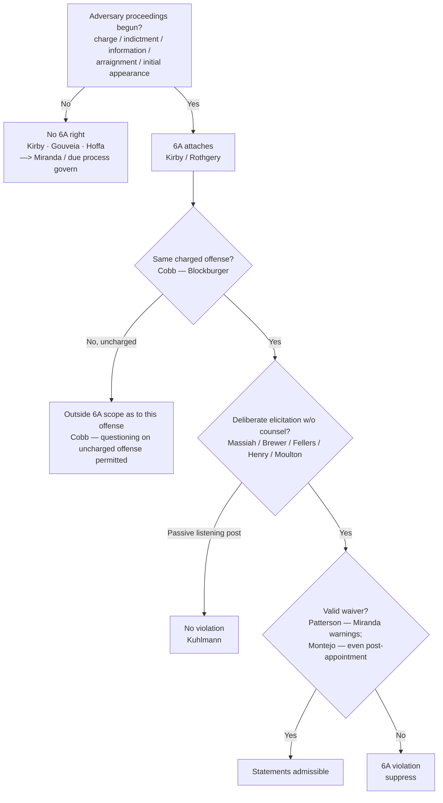

---
aliases:
  - "Sixth Amendment Right to Counsel"
topic: Sixth Amendment Right to Counsel
type: doctrine
jurisdiction: Federal (U.S. Const. amend. VI); SCOTUS baseline
status: verified
related:
  - "[[Miranda and Custodial Interrogation]]"
  - "[[Miranda Waiver and Invocation]]"
  - "[[Eyewitness Identification]]"
  - "[[Due-Process Voluntariness of Confessions]]"
---

# Sixth Amendment Right to Counsel

## The Brief

**Field-decisive question:** *Has the Sixth Amendment right to counsel **attached** — and did the government **deliberately elicit** a statement about the charged offense without counsel or a valid waiver?*

**Black-letter rule.** The Sixth Amendment right to counsel **attaches at the initiation of adversarial judicial proceedings** — formal charge, indictment, information, preliminary hearing, or arraignment ([[Kirby v. Illinois#^pin-689|*Kirby*]]) — which in practice includes the **initial appearance** before a magistrate, even if no prosecutor is aware of or involved in it ([[Rothgery v. Gillespie County#^pin-213|*Rothgery*]]). The right is **offense-specific**: it reaches only the charged offense (and offenses that are the "same offense" under the *Blockburger* same-elements test), not other uncharged offenses, even factually related ones ([[Texas v. Cobb#^pin-164|*Cobb*]]) — and it is a **distinct guarantee** from the Fifth Amendment *[[Miranda Waiver and Invocation|Miranda]]–Edwards* counsel right, with different triggers and scope ([[McNeil v. Wisconsin#^pin-175|*McNeil*]]). Once it has attached, the **Massiah rule** bars the government from **deliberately eliciting** incriminating statements from the accused, outside the presence of counsel, absent a valid waiver ([[Massiah v. United States#^pin-206|*Massiah*]]).

**Stage 1 — Attachment (the timing gate).** The right turns on the **initiation of adversary judicial proceedings**, not on arrest or investigative focus. *Kirby* fixes the line: the Court's right-to-counsel decisions "have involved points of time at or after the initiation of adversary judicial criminal proceedings — whether by way of formal charge, preliminary hearing, indictment, information, or arraignment" ([[Kirby v. Illinois#^pin-689|406 U.S. at 689]]). *Rothgery* pushes the point of attachment to the **initial appearance** — once a defendant appears before a judicial officer, learns the charge, and has his liberty restricted, adversary proceedings have begun, and "attachment does not require that a prosecutor . . . be aware of that initial proceeding or involved in its conduct" ([[Rothgery v. Gillespie County#^pin-213|554 U.S. at 213]]). Before that point there is **no** Sixth Amendment claim: the right "attaches only at or after the initiation of adversary judicial proceedings" ([[United States v. Gouveia#^pin-187|*Gouveia*]] — no right during pre-charge administrative segregation), and the Constitution does not force the government to arrest or charge early to trigger it, because "[t]here is no constitutional right to be arrested" ([[Hoffa v. United States#^pin-310|*Hoffa*]]). Pre-charge investigation is instead governed by [[Miranda and Custodial Interrogation|Miranda]] and [[Due-Process Voluntariness of Confessions|due-process voluntariness]].

**Stage 1(b) — Offense-specificity.** Attachment as to a charged offense does **not** bar questioning about *other, uncharged* offenses, even closely related ones; the reach of an "offense" is fixed by the *Blockburger* same-elements test — "where the same act or transaction constitutes a violation of two distinct statutory provisions, the test . . . is whether each provision requires proof of a fact which the other does not" ([[Texas v. Cobb#^pin-173|532 U.S. at 173]]). And a Sixth Amendment invocation is **not** an invocation of the Fifth Amendment *Miranda*-counsel right: the two "serve different interests" and are not interchangeable ([[McNeil v. Wisconsin#^pin-175|*McNeil*]]). Contrast [[Arizona v. Roberson|*Roberson*]], where a **Fifth Amendment** *Edwards* invocation bars custodial interrogation on **any** offense — a sharp divide the instructor should teach side by side (see [[Miranda Waiver and Invocation]]).

**Stage 2 — The *Massiah* rule: "deliberate elicitation," not "interrogation."** Once the right attaches, the government may not **deliberately elicit** statements without counsel or waiver ([[Massiah v. United States#^pin-206|*Massiah*]] — the accused "was denied the basic protections of that guarantee when there was used against him at his trial evidence of his own incriminating words, which federal agents had deliberately elicited from him after he had been indicted and in the absence of his counsel"). The trigger is **broader than *Miranda* interrogation**: it reaches surreptitious, non-custodial efforts to draw out statements, and the *absence* of interrogation does not defeat the claim — the standard is "deliberate elicitation," "expressly distinguished . . . from the Fifth Amendment custodial-interrogation standard" ([[Fellers v. United States#^pin-524|*Fellers*]]). Open elicitation counts: the "Christian burial speech" was deliberate elicitation after attachment with no valid waiver ([[Brewer v. Williams#^pin-399|*Brewer*]] — the detective "deliberately and designedly set out to elicit information"). So does **covert** elicitation through informants — but only **active inducement**, not passive listening:
- **Active inducement violates the right.** Using a paid informant planted in the cell to "intentionally creat[e] a situation likely to induce" an indicted defendant's statements is deliberate elicitation ([[United States v. Henry#^pin-274|*Henry*]]); so is the State's "knowing exploitation . . . of an opportunity to confront the accused without counsel," even where the *defendant* set up the meeting ([[Maine v. Moulton#^pin-176a|*Moulton*]]).
- **A passive "listening post" does not.** A jailhouse informant who merely listens and reports commits no violation; "the defendant must demonstrate that the police and their informant took some action, beyond merely listening, that was designed deliberately to elicit incriminating remarks" ([[Kuhlmann v. Wilson#^pin-459a|*Kuhlmann*]]).

**Stage 3 — Waiver.** The attached right can be **waived**. Standard *Miranda* warnings ordinarily supply a knowing and intelligent waiver of the post-attachment right, because an accused so warned "has been sufficiently apprised of the nature of his Sixth Amendment rights, and of the consequences of abandoning those rights" ([[Patterson v. Illinois#^pin-296|*Patterson*]]). And **[[Montejo v. Louisiana|*Montejo*]]** removed the old counsel-request bar: a defendant may validly waive during **police-initiated** interrogation **even after counsel has been requested or appointed**, so long as the waiver is voluntary, knowing, and intelligent — "*Michigan v. Jackson* should be and now is overruled" ([[Montejo v. Louisiana#^pin-797|556 U.S. at 797]]). The defendant who does not wish to be questioned without counsel is now protected through the Fifth Amendment *Edwards*/*Miranda* regime instead of a Sixth Amendment presumption.

> **Historical — *Michigan v. Jackson* is no longer law.** *Jackson* (1986) had held that a post-attachment, police-initiated waiver is presumptively invalid once the defendant requested counsel at arraignment. *Montejo* **overruled** it; present it **only as history**, never as current doctrine ([[Michigan v. Jackson|*Jackson*]], *overruled by* [[Montejo v. Louisiana]]).

**Critical stages beyond questioning — lineups.** The attachment/critical-stage rule also governs identification procedures (treated in full on [[Eyewitness Identification]]). A **post-attachment corporeal lineup** is a "critical stage" requiring counsel ([[United States v. Wade#^pin-237|*Wade*]]); testimony about an uncounseled post-attachment lineup is subject to a **[[Common Legal Terms#per-se|per se]]** exclusionary rule ([[Gilbert v. California#^pin-273|*Gilbert*]]). But a **pre-charge** lineup is **not** a critical stage — that is *Kirby*'s core holding ([[Kirby v. Illinois]]) — and there is **no** right to counsel at a **photographic array**, because it is not a trial-like confrontation of the accused ([[United States v. Ash#^pin-321|*Ash*]]).

**Escobedo — the precursor.** [[Escobedo v. Illinois|*Escobedo*]] (1964) held that denying a focus-suspect's request to consult his lawyer during custodial interrogation violated the Sixth Amendment. It was a **precursor** to *Miranda*: its rationale was recast as a Fifth Amendment matter and confined largely to its facts, so it is taught as **origin, not a freestanding test** (treatment: *limited* — result intact, rationale superseded by [[Miranda v. Arizona]]).

**Elements · burden · standard of review · remedy.**
- **Elements:** (1) the right has **attached** (adversary proceedings begun — [[Kirby v. Illinois|*Kirby*]]/[[Rothgery v. Gillespie County|*Rothgery*]]); (2) as to **this charged offense** (offense-specific — [[Texas v. Cobb|*Cobb*]]); (3) the government **deliberately elicited** the statement without counsel ([[Massiah v. United States|*Massiah*]]/[[Fellers v. United States|*Fellers*]]) — active inducement, not passive listening ([[Kuhlmann v. Wilson|*Kuhlmann*]]); (4) **no valid waiver** ([[Patterson v. Illinois|*Patterson*]]/[[Montejo v. Louisiana|*Montejo*]]).
- **Burden:** on the *Massiah* claim, the **defendant/movant** bears the burden of showing **deliberate elicitation** after attachment (a mere listening-post informant is insufficient — [[Kuhlmann v. Wilson]]). Once a waiver is asserted, the **government** bears a **heavy** burden of proving an "intentional relinquishment or abandonment of a known right" ([[Brewer v. Williams|*Brewer*]], 430 U.S. at 404).
- **Standard of review:** the ultimate waiver/voluntariness determination is reviewed **[[Common Legal Terms#de-novo|de novo]]**; subsidiary historical facts for **[[Common Legal Terms#clear-error|clear error]]**.
- **Remedy:** **suppression** of the deliberately-elicited statement; for an uncounseled post-attachment lineup, a **per se** bar on testimony about the lineup, with in-court identification admissible only on an **independent source** ([[United States v. Wade]]/[[Gilbert v. California]]).

**Watch the common pitfalls.**
- **Do not confuse the 5A *Miranda*-counsel right with the 6A counsel right.** Different triggers (custodial interrogation vs. charging) and different scope; a *Miranda* invocation is not a 6A invocation, and vice versa ([[McNeil v. Wisconsin]]). Keep [[Miranda and Custodial Interrogation]] and this doctrine separate.
- **Do not assume the right attaches at arrest.** It attaches at **charging/initial appearance** ([[Kirby v. Illinois]]; [[Rothgery v. Gillespie County]]); pre-charge investigation is [[Miranda and Custodial Interrogation|Miranda]]/[[Due-Process Voluntariness of Confessions|due-process]] territory ([[United States v. Gouveia]]; [[Hoffa v. United States]]).
- **Do not forget offense-specificity.** A charged defendant **may** be questioned about **uncharged** offenses ([[Texas v. Cobb]]).
- **Do not treat a passive jailhouse informant as automatically unlawful.** Mere listening is not deliberate elicitation ([[Kuhlmann v. Wilson]]); the violation is in *inducing* the statements ([[United States v. Henry]]/[[Maine v. Moulton]]). Compare the pre-charge undercover-informant setting, governed by *Miranda* (and permitted), where the 6A is not yet at issue ([[Illinois v. Perkins]]).
- **Do not cite *Michigan v. Jackson* as live law.** It is **overruled** ([[Montejo v. Louisiana]]).

## Key cases

| Case | Holding (one line) | Role | Weight | Treatment | CL |
|------|--------------------|------|--------|-----------|----|
| [[Kirby v. Illinois]], 406 U.S. 682 (1972) (plurality) | The 6A right attaches only at/after initiation of adversary judicial proceedings; a pre-charge ID is not a critical stage. | Key — Anchor | Binding — SCOTUS | good · 2026-06-30 | [opinion](https://www.courtlistener.com/opinion/108554/kirby-v-illinois/) |
| [[Rothgery v. Gillespie County]], 554 U.S. 191 (2008) | Attachment occurs at the initial appearance before a magistrate, even if no prosecutor is aware of or involved in it. | Key — Progeny | Binding — SCOTUS | good · 2026-06-30 | [opinion](https://www.courtlistener.com/opinion/145785/rothgery-v-gillespie-county/) |
| [[United States v. Gouveia]], 467 U.S. 180 (1984) | The right attaches only at/after initiation of adversary proceedings; no counsel during pre-charge administrative detention. | Key — Progeny | Binding — SCOTUS | good · 2026-06-30 | [opinion](https://www.courtlistener.com/opinion/111193/united-states-v-gouveia/) |
| [[Hoffa v. United States]], 385 U.S. 293 (1966) | No 6A claim when an informant elicits statements before the right attaches; "[t]here is no constitutional right to be arrested." | Key — Progeny | Binding — SCOTUS | good · 2026-06-30 | [opinion](https://www.courtlistener.com/opinion/107318/hoffa-v-united-states/) |
| [[Texas v. Cobb]], 532 U.S. 162 (2001) | The 6A right is offense-specific; it does not extend to uncharged offenses, even factually related ones (*Blockburger* same-elements test). | Key — Progeny | Binding — SCOTUS | good · 2026-06-30 | [opinion](https://www.courtlistener.com/opinion/118417/texas-v-cobb/) |
| [[McNeil v. Wisconsin]], 501 U.S. 171 (1991) | The 6A right is offense-specific and is **not** an invocation of the distinct 5A *Miranda–Edwards* right; the two are separate. | Key — Progeny | Binding — SCOTUS | good · 2026-06-30 | [opinion](https://www.courtlistener.com/opinion/112622/mcneil-v-wisconsin/) |
| [[Massiah v. United States]], 377 U.S. 201 (1964) | Post-indictment deliberate elicitation of statements without counsel — even surreptitiously, outside custody — violates the 6A. | Key — Anchor | Binding — SCOTUS | good · 2026-06-30 | [opinion](https://www.courtlistener.com/opinion/106822/massiah-v-united-states/) |
| [[Brewer v. Williams]], 430 U.S. 387 (1977) | The "Christian burial speech" deliberately elicited statements after attachment with no valid waiver — a *Massiah* violation. | Key — Progeny | Binding — SCOTUS | good · 2026-06-30 | [opinion](https://www.courtlistener.com/opinion/109624/brewer-v-williams/) |
| [[Fellers v. United States]], 540 U.S. 519 (2004) | The 6A standard is *deliberate elicitation*, not interrogation; the absence of interrogation does not defeat the claim. | Key — Progeny | Binding — SCOTUS | good · 2026-06-30 | [opinion](https://www.courtlistener.com/opinion/131158/fellers-v-united-states/) |
| [[United States v. Henry]], 447 U.S. 264 (1980) | Using a paid informant to intentionally induce an indicted defendant's statements "deliberately elicited" them, violating the 6A. | Key — Progeny | Binding — SCOTUS | good · 2026-06-30 | [opinion](https://www.courtlistener.com/opinion/110300/united-states-v-henry/) |
| [[Maine v. Moulton]], 474 U.S. 159 (1985) | Knowingly exploiting an opportunity to confront the charged accused without counsel violates the 6A — even if the defendant set up the meeting. | Key — Progeny | Binding — SCOTUS | good · 2026-06-30 | [opinion](https://www.courtlistener.com/opinion/111546/maine-v-moulton/) |
| [[Kuhlmann v. Wilson]], 477 U.S. 436 (1986) | A passive "listening post" informant does not violate the 6A; the accused must show deliberate elicitation *beyond merely listening*. | Key — Progeny | Binding — SCOTUS | good · 2026-06-30 | [opinion](https://www.courtlistener.com/opinion/111726/kuhlmann-v-wilson/) |
| [[Patterson v. Illinois]], 487 U.S. 285 (1988) | An accused may knowingly and intelligently waive the 6A counsel right for post-indictment questioning via *Miranda* warnings. | Key — Progeny | Binding — SCOTUS | good · 2026-06-30 | [opinion](https://www.courtlistener.com/opinion/112127/patterson-v-illinois/) |
| [[Montejo v. Louisiana]], 556 U.S. 778 (2009) | A defendant may validly waive the 6A right during police-initiated interrogation even after counsel is appointed; **overrules *Michigan v. Jackson***. | Key — Progeny | Binding — SCOTUS | good · 2026-06-30 | [opinion](https://www.courtlistener.com/opinion/145873/montejo-v-louisiana/) |
| [[Escobedo v. Illinois]], 378 U.S. 478 (1964) | Denying a focus-suspect's request for counsel during custodial interrogation violated the 6A — the *Miranda* precursor, taught as origin. | Key — Historical (precursor) | Binding — SCOTUS | limited · 2026-06-30 — result intact; rationale superseded by [[Miranda v. Arizona]] | [opinion](https://www.courtlistener.com/opinion/106883/escobedo-v-illinois/) |
| [[Michigan v. Jackson]], 475 U.S. 625 (1986) | Presumed a post-appointment, police-initiated waiver invalid — **no longer law**; survives only as history. | Historical — overruled | Historical | overruled · 2026-06-30 — *overruled by* [[Montejo v. Louisiana]] | [opinion](https://www.courtlistener.com/opinion/111622/michigan-v-jackson/) |

## Related cases across doctrines

These cases are treated in full on other doctrine pages but bear directly on the Sixth Amendment right to counsel and are framed for it here.

| Case | Relevance to the Sixth Amendment right to counsel | Primary treatment | Weight | Treatment | CL |
|------|---------------------------------------------------|-------------------|--------|-----------|----|
| [[United States v. Wade]], 388 U.S. 218 (1967) | A post-attachment corporeal lineup is a "critical stage" at which counsel is required — the lineup application of the same attachment/critical-stage rule that governs *Massiah* questioning; in-court ID admissible only on an independent source. | [[Eyewitness Identification]] | Binding — SCOTUS | good · 2026-06-30 | [opinion](https://www.courtlistener.com/opinion/107486/united-states-v-wade/) |
| [[Gilbert v. California]], 388 U.S. 263 (1967) | The remedy for an uncounseled post-attachment lineup: testimony that a witness identified the accused there is excluded **per se** — a strict exclusionary sanction for the 6A violation. | [[Eyewitness Identification]] | Binding — SCOTUS | good · 2026-06-30 | [opinion](https://www.courtlistener.com/opinion/107487/gilbert-v-california/) |
| [[United States v. Ash]], 413 U.S. 300 (1973) | Limit post-attachment: **no** right to counsel at a photographic array — it is not a trial-like adversary confrontation of the accused. | [[Eyewitness Identification]] | Binding — SCOTUS | good · 2026-06-30 | [opinion](https://www.courtlistener.com/opinion/108846/united-states-v-ash/) |
| [[Illinois v. Perkins]], 496 U.S. 292 (1990) | The pre-charge undercover-informant counterpart: no *Miranda* "police-dominated" coercion, and the 6A is **not** at issue because the suspect had not been charged — fixing the line that *Massiah* deliberate-elicitation applies only **after** attachment. | [[Miranda and Custodial Interrogation]] | Binding — SCOTUS | good · 2026-06-30 | [opinion](https://www.courtlistener.com/opinion/112452/illinois-v-perkins/) |
| [[Arizona v. Roberson]], 486 U.S. 675 (1988) | Contrast on offense-specificity: the **5A** *Edwards* bar is **not** offense-specific — once counsel is invoked, police may not interrogate about **any** offense. Pair with *Cobb* to show the divide from the offense-specific 6A right. | [[Miranda Waiver and Invocation]] | Binding — SCOTUS | good · 2026-06-30 | [opinion](https://www.courtlistener.com/opinion/112100/arizona-v-roberson/) |

## Recent developments

Role-based, **circuit/state only** — every SCOTUS holding in this doctrine lives in **Key cases** regardless of date (N5). The controlling framework here is entirely Supreme Court: the *Kirby*/*Rothgery* attachment line, the *Cobb*/*McNeil* offense-specificity line, the *Massiah*/*Henry*/*Kuhlmann* deliberate-elicitation-vs-listening-post line, and the *Patterson*/*Montejo* waiver line all remain settled at the SCOTUS level.

- *No circuit/state development is currently tracked on this page.* The subsequent-treatment content that formerly sat here (the post-*Montejo* waiver landscape and the continued vitality of the *Massiah* informant line) is **SCOTUS** and has been folded into the brief above, per N5. A circuit/state frontier pass — e.g. how the circuits draw the active-inducement / passive-listening-post line and the point-of-attachment quantum — is **deferred to EXECUTE** (serial CL, L4; no CL calls were made in this free reformat).

## Visual

## Sources

- [Massiah v. United States, 377 U.S. 201 (1964)](https://www.courtlistener.com/opinion/106822/massiah-v-united-states/) — pinpoint: 206
- [Escobedo v. Illinois, 378 U.S. 478 (1964)](https://www.courtlistener.com/opinion/106883/escobedo-v-illinois/) — pinpoint: 490–491
- [Hoffa v. United States, 385 U.S. 293 (1966)](https://www.courtlistener.com/opinion/107318/hoffa-v-united-states/) — pinpoint: 310
- [United States v. Wade, 388 U.S. 218 (1967)](https://www.courtlistener.com/opinion/107486/united-states-v-wade/) — pinpoint: 237, 242
- [Gilbert v. California, 388 U.S. 263 (1967)](https://www.courtlistener.com/opinion/107487/gilbert-v-california/) — pinpoint: 273
- [Kirby v. Illinois, 406 U.S. 682 (1972)](https://www.courtlistener.com/opinion/108554/kirby-v-illinois/) — pinpoint: 689
- [United States v. Ash, 413 U.S. 300 (1973)](https://www.courtlistener.com/opinion/108846/united-states-v-ash/) — pinpoint: 321
- [Brewer v. Williams, 430 U.S. 387 (1977)](https://www.courtlistener.com/opinion/109624/brewer-v-williams/) — pinpoint: 398, 399, 404
- [United States v. Henry, 447 U.S. 264 (1980)](https://www.courtlistener.com/opinion/110300/united-states-v-henry/) — pinpoint: 270, 274
- [United States v. Gouveia, 467 U.S. 180 (1984)](https://www.courtlistener.com/opinion/111193/united-states-v-gouveia/) — pinpoint: 187–188
- [Maine v. Moulton, 474 U.S. 159 (1985)](https://www.courtlistener.com/opinion/111546/maine-v-moulton/) — pinpoint: 176
- [Michigan v. Jackson, 475 U.S. 625 (1986)](https://www.courtlistener.com/opinion/111622/michigan-v-jackson/) — overruled by Montejo
- [Kuhlmann v. Wilson, 477 U.S. 436 (1986)](https://www.courtlistener.com/opinion/111726/kuhlmann-v-wilson/) — pinpoint: 459
- [Arizona v. Roberson, 486 U.S. 675 (1988)](https://www.courtlistener.com/opinion/112100/arizona-v-roberson/) — pinpoint: 683
- [Patterson v. Illinois, 487 U.S. 285 (1988)](https://www.courtlistener.com/opinion/112127/patterson-v-illinois/) — pinpoint: 296
- [Illinois v. Perkins, 496 U.S. 292 (1990)](https://www.courtlistener.com/opinion/112452/illinois-v-perkins/) — pinpoint: 296, 300
- [McNeil v. Wisconsin, 501 U.S. 171 (1991)](https://www.courtlistener.com/opinion/112622/mcneil-v-wisconsin/) — pinpoint: 175
- [Texas v. Cobb, 532 U.S. 162 (2001)](https://www.courtlistener.com/opinion/118417/texas-v-cobb/) — pinpoint: 164, 173
- [Fellers v. United States, 540 U.S. 519 (2004)](https://www.courtlistener.com/opinion/131158/fellers-v-united-states/) — pinpoint: 524
- [Rothgery v. Gillespie County, 554 U.S. 191 (2008)](https://www.courtlistener.com/opinion/145785/rothgery-v-gillespie-county/) — pinpoint: 213
- [Montejo v. Louisiana, 556 U.S. 778 (2009)](https://www.courtlistener.com/opinion/145873/montejo-v-louisiana/) — pinpoint: 797
