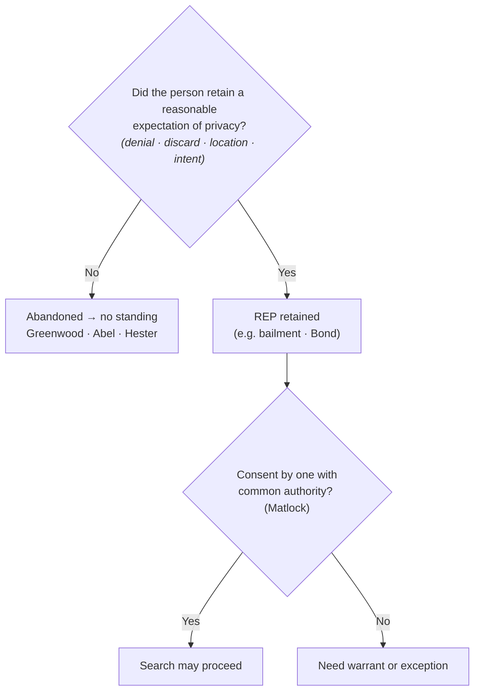

## Rule
A person who **voluntarily abandons** property loses any reasonable expectation of privacy in it and therefore has **no standing** to challenge its later search or seizure. Abandonment is judged by the **Fourth Amendment expectation-of-privacy standard**, not by strict property law — the question is whether the person retained an expectation of privacy that society accepts as objectively reasonable. *California v. Greenwood*, 486 U.S. 35, 39–40, 44 (1988). Garbage left for collection **outside the curtilage** carries no such expectation, so a warrantless search of curbside trash is permissible. *Id.* at 37, 40–41. Items thrown away — into a vacated hotel room's wastebasket (*Abel v. United States*, 362 U.S. 217, 241 (1960)) or dropped while fleeing (*Hester v. United States*, 265 U.S. 57, 58 (1924)) — are abandoned, and examining them is no "seizure in the sense of the law." Distinguish a mere **bailment** (temporary transfer of possession), which does **not** abandon a privacy interest. *Bond v. United States*, 529 U.S. 334, 338–39 (2000).

## Key cases
| Case (Bluebook) | Holding in one line | Weight | CourtListener |
|---|---|---|---|
| *Hester v. United States*, 265 U.S. 57 (1924) | A fleeing suspect who dropped containers abandoned any 4A interest in them — examining the contents was "no seizure in the sense of the law" (abandonment by flight). | SCOTUS — binding | [link](https://www.courtlistener.com/opinion/100413/hester-v-united-states/) |
| *Abel v. United States*, 362 U.S. 217 (1960) | Items left in a hotel-room wastebasket after the guest paid up and **vacated** the room were abandoned ("bona vacantia"); warrantless seizure was lawful. | SCOTUS — binding | [link](https://www.courtlistener.com/opinion/106021/abel-v-united-states/) |
| *United States v. Matlock*, 415 U.S. 164 (1974) | A third party with **common authority** over premises or effects — based on mutual use / joint access or control — may give valid consent against an absent co-occupant. | SCOTUS — binding | [link](https://www.courtlistener.com/opinion/108967/united-states-v-matlock/) |
| *California v. Greenwood*, 486 U.S. 35 (1988) | **No** reasonable expectation of privacy in garbage bags left for collection at the curb, outside the curtilage; warrantless search/seizure of curbside trash does not violate the 4A. | SCOTUS — binding | [link](https://www.courtlistener.com/opinion/112067/california-v-greenwood/) |
| *Bond v. United States*, 529 U.S. 334 (2000) | A bus passenger **retained** a REP in a carry-on bag; an agent's exploratory physical manipulation ("squeezing") was a search — a bailment is not abandonment. | SCOTUS — binding | [link](https://www.courtlistener.com/opinion/118354/bond-v-united-states/) |

## Nuances & limits
- **It's about privacy, not property.** The reach of the Fourth Amendment is not determined by state property law: a person can hold title to discarded property and still have abandoned any *Fourth Amendment* interest in it; conversely, relinquishing physical possession (a bailment) does not by itself abandon a privacy interest. The controlling question is the *Greenwood/Katz* one — did the person retain an expectation of privacy "that society accepts as objectively reasonable." *Greenwood*, 486 U.S. at 39.
- **Why curbside trash fails the test.** "It is common knowledge that plastic garbage bags left on or at the side of a public street are readily accessible to animals, children, scavengers, snoops, and other members of the public." *Greenwood*, 486 U.S. at 40. Note the express limit: the bags were left for collection **"outside the curtilage of a home."** *Id.* at 37. Trash still **within the curtilage** is a different question — see [[Curtilage]].
- **Abandonment is a totality inquiry, not a checklist.** Courts commonly weigh, as a synthesis of the case law, (1) **denial of ownership**, (2) **physical relinquishment or discard**, (3) the **location** where the item was left, and (4) **intent inferred from conduct**. These are factors bearing on the single ultimate question — whether a reasonable expectation of privacy was retained under *Greenwood* — not independent legal tests.
- **Abandonment by flight.** In *Hester*, the defendant and an associate dropped a jug, a jar, and a bottle while fleeing; the Court held "there was no seizure in the sense of the law when the officers examined the contents of each after it had been abandoned." 265 U.S. at 58. Contraband discarded *before* a suspect submits to authority is abandoned and admissible — the seizure-of-the-person timing in *California v. Hodari D.*, 499 U.S. 621, 629 (1991) (suspect "tossed away" crack while running) is the companion rule. See [[Seizure of the Person]].
- **Vacated premises.** *Abel* turned on the guest having "paid his bill and vacated the room"; once he left, "[t]he hotel then had the exclusive right to its possession," so both the abandonment *and* the hotel's consent justified the warrantless search. 362 U.S. at 241. Check-out, not mere absence, is the line.
- **Bailment ≠ abandonment.** Handing a bag to a carrier, hotel, or friend is a temporary transfer of possession that preserves a privacy interest. *Bond* squarely rejected the argument that "by exposing his bag to the public, petitioner lost a reasonable expectation that his bag would not be physically manipulated"; the Court held the agent's manipulation **was** a search — "Physically invasive inspection is simply more intrusive than purely visual inspection." 529 U.S. at 337, 338.
- **Common authority (a third-party route, not abandonment).** Where there is no abandonment, a search may still be valid if someone with **common authority** consents. Common authority "rests rather on mutual use of the property by persons generally having joint access or control for most purposes," and "is, of course, not to be implied from the mere property interest a third party has in the property." *Matlock*, 415 U.S. at 171 & n.7. Full consent doctrine is covered later under C.R.E.W. — see [[CREW]].
- **Abandonment vs. consent — keep them distinct.** *Abandonment* means there is **no** reasonable expectation of privacy at all, so the defendant lacks standing to object. *Consent* presupposes that a privacy interest **exists** but has been voluntarily waived (by the defendant or by one with common authority). Different doctrines, different proof.

## Common pitfalls
- Treating **all** trash as fair game. *Greenwood* authorizes the **curbside** bag left for collection *outside the curtilage*; trash sitting within the curtilage (e.g., a can beside the back door) is not covered by *Greenwood* on its terms.
- Confusing **giving up possession** with **giving up privacy**. A bailment — bag to a bus, luggage to a hotel — is not abandonment. *Bond*.
- Relying on a **third party's property interest** to imply consent. Common authority turns on mutual *use* and joint *access or control*, not on who owns or holds the keys. *Matlock* n.7.
- Litigating abandonment as a property dispute. The court asks about the **expectation of privacy**, not who holds title. *Greenwood*.

## Practical capture
To establish abandonment in the field, frame the question as whether the suspect has **"anything to do with"** the item — not merely whether it is "theirs." A clean disclaimer of any connection to the item supports the inference that no expectation of privacy was retained.

## Visual

## Flashcards
- What does voluntary abandonment do to standing?::It eliminates any reasonable expectation of privacy, so the person has no standing to challenge the search or seizure (*Greenwood*).
- Is abandonment decided by property law?::No — it turns on the Fourth Amendment expectation-of-privacy standard, not state property law (*Greenwood*, 486 U.S. at 39).
- Why is curbside trash searchable without a warrant?::Garbage left for collection outside the curtilage is "readily accessible to animals, children, scavengers, snoops, and other members of the public" — no objectively reasonable REP (*Greenwood*, 486 U.S. at 40).
- How does a bailment differ from abandonment?::A bailment is a temporary transfer of possession that preserves a privacy interest; *Bond* held squeezing a bus passenger's carry-on was still a search.
- What is "common authority" under *Matlock*?::Mutual use of the property by persons generally having joint access or control for most purposes — not a mere property interest (415 U.S. at 171 n.7).

## Sources
- *Hester v. United States*, 265 U.S. 57 (1924) — https://www.courtlistener.com/opinion/100413/hester-v-united-states/
- *Abel v. United States*, 362 U.S. 217 (1960) — https://www.courtlistener.com/opinion/106021/abel-v-united-states/
- *United States v. Matlock*, 415 U.S. 164 (1974) — https://www.courtlistener.com/opinion/108967/united-states-v-matlock/
- *California v. Greenwood*, 486 U.S. 35 (1988) — https://www.courtlistener.com/opinion/112067/california-v-greenwood/
- *Bond v. United States*, 529 U.S. 334 (2000) — https://www.courtlistener.com/opinion/118354/bond-v-united-states/
- *California v. Hodari D.*, 499 U.S. 621 (1991) — https://www.courtlistener.com/opinion/112579/california-v-hodari-d/ *(abandonment-by-flight / seizure timing; cross-reference)*
