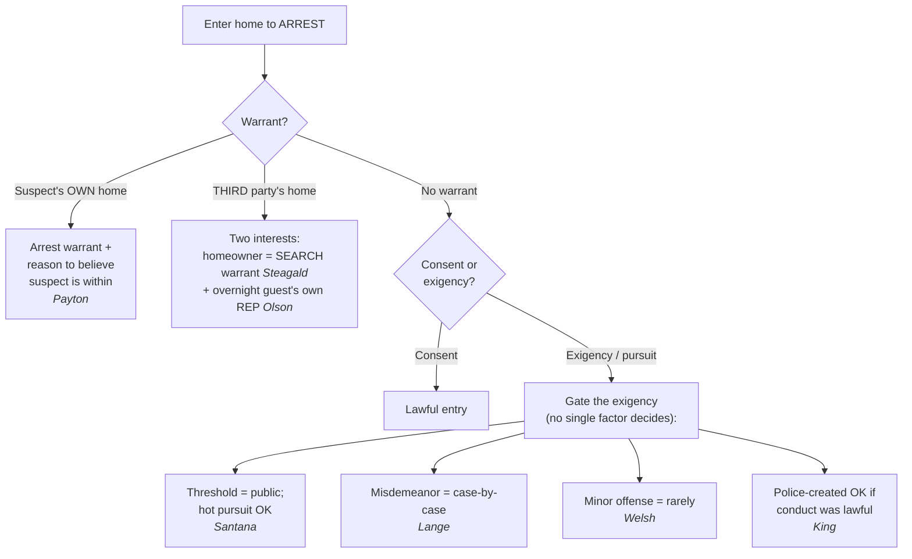

## Rule
The home receives the Fourth Amendment's highest protection: absent **consent** or **exigent circumstances**, police may not cross the threshold to make an arrest without a warrant. *Payton v. New York* sets the spine — for the suspect's **own** dwelling, an **arrest warrant** founded on probable cause implicitly authorizes entry **when there is reason to believe the suspect is within**. *Payton v. New York*, 445 U.S. 573, 603 (1980). To arrest that same suspect inside **someone else's** home, an arrest warrant is not enough; *Steagald* requires a **search warrant**, because the third party's privacy is a distinct, independently protected interest. *Steagald v. United States*, 451 U.S. 204, 205–06 (1981). And the guest himself is not rightless — an overnight guest has his **own** reasonable expectation of privacy in the host's home. *Minnesota v. Olson*, 495 U.S. 91, 96–97 (1990). The **threshold itself is a public place** (*Santana*), so an arrest lawfully begun in public may continue in **hot pursuit** across it. *United States v. Santana*, 427 U.S. 38, 42–43 (1976). The exigency that excuses a warrant is **bounded** — it is weakest for **minor offenses** (*Welsh*), it is **not forfeited** merely because lawful police conduct prompted it (*King*), and **misdemeanor pursuit is judged case by case, not categorically** (*Lange*).

## Key cases
| Case (Bluebook) | Holding in one line | Weight | CourtListener |
|---|---|---|---|
| *United States v. Santana*, 427 U.S. 38 (1976) | A suspect in her own doorway is in a **public** place; she cannot defeat a public-place arrest by retreating inside, and **hot pursuit** justifies the warrantless entry. | SCOTUS — binding | [link](https://www.courtlistener.com/opinion/109504/united-states-v-santana/) |
| *Payton v. New York*, 445 U.S. 573 (1980) | Warrantless, nonconsensual entry into a suspect's **own** home for a routine felony arrest is presumptively unreasonable; an **arrest warrant + reason to believe the suspect is within** authorizes entry. | SCOTUS — binding | [link](https://www.courtlistener.com/opinion/110235/payton-v-new-york/) |
| *Steagald v. United States*, 451 U.S. 204 (1981) | To arrest the subject of an arrest warrant inside a **third party's** home, police need a **search warrant** (absent exigency or consent) — the arrest warrant protects the suspect, not the homeowner. | SCOTUS — binding | [link](https://www.courtlistener.com/opinion/110464/steagald-v-united-states/) |
| *Welsh v. Wisconsin*, 466 U.S. 740 (1984) | The **gravity of the offense** is a key exigency factor; warrantless home entry for a **minor offense** should rarely be sanctioned (nighttime DUI, civil-forfeiture offense — unconstitutional). | SCOTUS — binding | [link](https://www.courtlistener.com/opinion/111173/welsh-v-wisconsin/) |
| *Minnesota v. Olson*, 495 U.S. 91 (1990) | An **overnight guest** has his **own** reasonable expectation of privacy in the host's home — so a warrantless arrest of the guest inside is governed by *Payton*'s protections, and the guest has standing to object. | SCOTUS — binding | [link](https://www.courtlistener.com/opinion/112416/minnesota-v-olson/) |
| *Kentucky v. King*, 563 U.S. 452 (2011) | Police do **not** forfeit the exigency exception by "creating" it — **unless** they created it by engaging or threatening to engage in conduct that **violates the Fourth Amendment**. | SCOTUS — binding | [link](https://www.courtlistener.com/opinion/216733/kentucky-v-king/) |
| *Lange v. California*, 594 U.S. 295 (2021) | Pursuit of a fleeing **misdemeanor** suspect does **not categorically** justify warrantless home entry; courts apply a **case-by-case** exigency assessment. | SCOTUS — binding | [link](https://www.courtlistener.com/opinion/4894407/lange-v-california/) |

## Related cases across doctrines
These cases are treated in full elsewhere but bear on this doctrine — the arrest-in-the-home rules — framed here for it.

| Case | Relevance to arrest in the home | Primary treatment | CourtListener |
|---|---|---|---|
| *Maryland v. Buie*, 494 U.S. 325 (1990) | When officers lawfully arrest inside a home, they may make a limited protective sweep — automatically of spaces immediately adjoining the place of arrest, and beyond that only on articulable facts suggesting a dangerous person is present; the in-home arrest power and its protective scope are two halves of the same encounter. | [[Securing the Scene]] | [opinion](https://www.courtlistener.com/opinion/112384/maryland-v-buie/) |
| *Minnesota v. Carter*, 525 U.S. 83 (1998) | The flip side of *Olson*: a short-term visitor present in another's home for a purely commercial purpose, with no overnight stay or prior relationship, has **no** reasonable expectation of privacy — so unlike the overnight guest, he cannot invoke *Payton*/*Olson* to suppress a warrantless entry that seizes him. | [[Standing to Challenge a Search]] | [opinion](https://www.courtlistener.com/opinion/118249/minnesota-v-carter/) |
| *Warden v. Hayden*, 387 U.S. 294 (1967) | Foundational hot-pursuit authority: warrantless entry into a house to seize a fleeing armed robber is reasonable where the exigencies (danger, escape) leave no time for a warrant — the felony-pursuit baseline that *Santana* builds on and that *Lange* leaves intact for genuine emergencies. | [[Exigent Circumstances and Hot Pursuit]] | [opinion](https://www.courtlistener.com/opinion/107465/warden-maryland-penitentiary-v-hayden/) |
| *Brigham City v. Stuart*, 547 U.S. 398 (2006) | Marks the boundary of this doctrine: police may cross the threshold without a warrant to render emergency aid (objectively reasonable basis to believe an occupant is seriously injured/threatened) — a **non-criminal** justification distinct from arrest exigency; do not conflate aid entry with entry to make an arrest. | [[Community Caretaking and Emergency Aid]] · [[Exigent Circumstances and Hot Pursuit]] | [opinion](https://www.courtlistener.com/opinion/145654/brigham-city-v-stuart/) |
| *Caniglia v. Strom*, 593 U.S. 194 (2021) | There is **no** freestanding "community caretaking" exception for the home — closing off an end-run around *Payton*. To cross the threshold non-consensually police still need a warrant, a recognized exigency, or true emergency aid; caretaking alone will not do. | [[Community Caretaking and Emergency Aid]] | [opinion](https://www.courtlistener.com/opinion/4883694/caniglia-v-strom/) |
| *Illinois v. McArthur*, 531 U.S. 326 (2001) | The less-intrusive alternative to a warrantless arrest entry: with PC that a home holds contraband, officers may temporarily bar a resident from re-entering his own home (or enter only to prevent destruction) while they obtain a warrant — a reasonable middle path that respects *Payton*'s firm line at the threshold. | [[Securing the Scene]] | [opinion](https://www.courtlistener.com/opinion/118405/illinois-v-mcarthur/) |
| *Segura v. United States*, 468 U.S. 796 (1984) | After a *Payton*-problematic entry, officers may secure the premises from within pending a warrant; evidence later seized under a warrant supported wholly by independent information is admissible — the securing/independent-source counterpart to the firm-line rule. | [[Securing the Scene]] | [opinion](https://www.courtlistener.com/opinion/111259/segura-v-united-states/) |
| *Mincey v. Arizona*, 437 U.S. 385 (1978) | No "murder scene" exception: the gravity/seriousness of the suspected offense does not by itself manufacture exigency to enter or remain in a home — the seriousness-cuts-both-ways companion to *Welsh* on the exigency analysis. | [[Community Caretaking and Emergency Aid]] | [opinion](https://www.courtlistener.com/opinion/109905/mincey-v-arizona/) |

## Nuances & limits
- **Burden and standard of review.** A warrantless home entry is presumptively unreasonable, so the **government bears the burden** of establishing that consent or a recognized exigency justified crossing the threshold; the suspect does not have to disprove it. On appeal, suppression rulings are reviewed under a **mixed standard** — the trial court's historical findings of fact for **clear error**, and the ultimate legal question of reasonableness (consent, exigency, "reason to believe") **de novo**.
- **Payton's "firm line."** The home is the most protected space the Amendment knows: "the Fourth Amendment has drawn a firm line at the entrance to the house. Absent exigent circumstances, that threshold may not reasonably be crossed without a warrant." *Payton*, 445 U.S. at 590. A routine felony arrest does not by itself justify crossing that line.
- **What an arrest warrant buys you — but only for the suspect's own home.** "[A]n arrest warrant founded on probable cause implicitly carries with it the limited authority to enter a dwelling in which the suspect lives when there is reason to believe the suspect is within." *Payton*, 445 U.S. at 603. Two predicates: the suspect **lives** there, and there is **reason to believe** he is **present** now.
- **The "reason to believe" quantum is a circuit split — flag it, don't anchor.** *Payton* never defined the showing behind "reason to believe the suspect is within," and it loads **two contested predicates**: reason to believe (a) the suspect **resides** there, and (b) he is **presently home**. The circuits divide on the quantum for each. One camp (persuasive — e.g., the Fourth Circuit's line of authority) reads "reason to believe" as **probable cause** on both predicates; another camp reads it as a **lesser standard** closer to reasonable, articulable suspicion, reasoning that the Court pointedly did **not** say "probable cause." This is unresolved at the Supreme Court, and circuit decisions are only **persuasive** — never anchor to one. For a multi-jurisdiction audience, **default to the higher (probable-cause) showing** on both predicates — it satisfies every circuit, and the articulation costs nothing.
- **The rights-holder map — who is protected, and what they need.** Three distinct interests can be in play in a single doorway: (1) ***Payton*** protects the **arrestee in his own home** — an arrest warrant + reason to believe he is within suffices; (2) ***Steagald*** protects the **third-party homeowner** — to enter *that* home for the suspect, police need a **search warrant**; (3) ***Olson*** gives the **overnight guest his own** reasonable expectation of privacy, so even the person being arrested may have standing to suppress when he is staying somewhere as a guest. Standing tracks the interest: the named suspect cannot invoke *Steagald* (that is the homeowner's right), but he *can* invoke his own *Olson*/*Payton* privacy interest in the place he is staying. *See* [[Seizure of the Person]] (the underlying public-place arrest power that *Santana* builds on).
- **The third-party home flips the warrant requirement.** The question in *Steagald* was "whether ... a law enforcement officer may legally search for the subject of an arrest warrant in the home of a third party without first obtaining a search warrant. Concluding that a search warrant must be obtained absent exigent circumstances or consent, we reverse ...." *Steagald*, 451 U.S. at 205–06. The interest protected is the **homeowner's** — so the named suspect cannot invoke *Steagald* to suppress, but the homeowner can.
- **The overnight guest has his own privacy interest.** "We need go no further than to conclude, as we do, that Olson's status as an overnight guest is alone enough to show that he had an expectation of privacy in the home that society is prepared to recognize as reasonable." *Olson*, 495 U.S. at 96–97. So in the third-party scenario there are **two** protected interests at once — the homeowner's (*Steagald*) and the guest's (*Olson*) — and a warrantless, nonconsensual entry to seize the guest implicates the home's full *Payton* protection.
- **The threshold is public — you can't outrun the arrest into the house.** "[A] suspect may not defeat an arrest which has been set in motion in a public place ... by the expedient of escaping to a private place." *Santana*, 427 U.S. at 43. And hot pursuit need not be a long chase: "The fact that the pursuit here ended almost as soon as it began did not render it any the less a 'hot pursuit' sufficient to justify the warrantless entry into Santana's house." *Id.* The threshold/doorway also borders the home's protected [[Curtilage]].
- **Gating the exigency — no single factor decides it.** Once you reach the "no warrant → exigency?" branch, four lines of authority run **at the same time**, and you must articulate the actual exigency (escape, evidence loss, danger):
  - **Offense gravity (*Welsh*).** "[A]pplication of the exigent-circumstances exception in the context of a home entry should rarely be sanctioned when there is probable cause to believe that only a minor offense ... has been committed." *Welsh*, 466 U.S. at 753. Gravity is "an important factor to be considered when determining whether any exigency exists." *Id.* A minor offense drags the whole analysis toward *unreasonable*.
  - **Who created the exigency (*King*).** "Where ... the police did not create the exigency by engaging or threatening to engage in conduct that violates the Fourth Amendment, warrantless entry to prevent the destruction of evidence is reasonable and thus allowed." *Kentucky v. King*, 563 U.S. 452, 462 (2011). Lawful knock-and-announce that makes occupants flush evidence **counts**; an unlawful threat that manufactures the emergency does not.
  - **Misdemeanor flight is not categorical (*Lange*).** "[T]he pursuit of a fleeing misdemeanor suspect ... [does not] categorically ... qualif[y] as an exigent circumstance. We hold it does not." *Lange v. California*, 594 U.S. 295, 298 (2021). Courts make a "case-by-case assessment of exigency." *Id.* at 298.
  - **Threshold / hot pursuit baseline (*Santana*, cabined by *Lange*).** *Santana*'s broad fleeing-suspect language still carries **felony** pursuits and genuine exigencies across the threshold — but after *Lange* it no longer carries **misdemeanor** pursuits automatically. Note this is *criminal* exigency; entry to render aid is a different, non-criminal justification — see [[Community Caretaking and Emergency Aid]] (do not conflate emergency-aid entry with arrest exigency).

## Common pitfalls
- **Using an arrest warrant to enter a third party's home.** That is a *Steagald* violation — you need a **search warrant** for the home, even with a valid arrest warrant for the guest inside.
- **Assuming a guest "has no rights" in the home.** Wrong — under *Olson* an overnight guest has his **own** reasonable expectation of privacy in the host's home (495 U.S. at 96–97). Even where the *homeowner's* right (*Steagald*) is the headline, the guest may *also* have a privacy interest and standing of his own.
- **Treating "reason to believe" as a hunch.** In several circuits it means **probable cause** the suspect both lives there and is present. Articulate why — strive to state both halves with facts behind each, and default to the probable-cause showing to be safe in any circuit.
- **Reading *Santana* as a blank check for hot pursuit.** After *Lange*, chasing a fleeing **misdemeanant** into a home is **not** automatically lawful — the categorical rule applies to felony arrests and to actual exigencies, not to every flight.
- **Assuming any arrest supports home exigency.** *Welsh* is the opposite — for a **minor offense**, warrantless home entry should "rarely be sanctioned."
- **Believing a "police-created exigency" always poisons the entry.** *King*: only if the police created it by conduct that itself **violated or threatened to violate** the Fourth Amendment. Lawful knocking that triggers evidence destruction is fine.

## Visual

## Recent developments & subsequent treatment
The home-arrest rules have held steady at their core, but the surrounding exigency map has tightened and the *Payton* "reason to believe" quantum remains the live battleground. Recent SCOTUS work sharpens the line between criminal-investigative probable cause and the non-investigative reasonableness that governs emergency-aid entry, while the circuits continue to divide over what *Payton* actually requires before officers force a door. The circuit decisions below are **persuasive, not binding** — never state a circuit holding as nationwide law.

- **Case v. Montana (SCOTUS 2026)** — Warrantless home entry to render emergency aid requires only *Brigham City*'s "objectively reasonable basis" to believe an occupant needs emergency assistance, not probable cause; probable cause is rooted in the criminal-investigative context and is not transplanted to the emergency-aid context. Resolves a circuit split (CA2/CA11/CADC had required probable cause; CA1/CA8 had not) by holding *Brigham City*'s reasonableness standard applies "with no further gloss." ⚖ Circuit split. "The probable-cause requirement is rooted in, and derives its meaning from, the criminal context, and we decline to transplant it to this different one. Brigham City's reasonableness standard means just what it says, with no further gloss." (slip op., at 1). [opinion](https://www.courtlistener.com/opinion/10774335/case-v-montana/).
- **Constructive-entry circuit split — *United States v. Maez* (10th Cir.); contra *United States v. Berkowitz* (7th Cir.); *Knight v. Jacobson* (11th Cir.)** — Circuits split on whether *Payton* reaches "constructive entry" — police using coercive tactics (surrounding the home, drawn weapons, loudspeakers) to force a suspect out for arrest at/beyond the threshold without physically crossing it. The Tenth Circuit (*Maez*, 872 F.2d 1444) treats such coercion as a *Payton* in-home arrest; the Seventh Circuit (*Berkowitz*, 927 F.2d 1376) and Eleventh Circuit (*Knight v. Jacobson*, 300 F.3d 1272) require the officer's body to cross the threshold. These are circuit decisions — **persuasive, not binding** — and this is an unresolved frontier/split, not new law. ⚖ Circuit split. [Maez](https://www.courtlistener.com/opinion/521939/united-states-v-arthur-maez/); [Berkowitz](https://www.courtlistener.com/opinion/557342/united-states-v-marvin-berkowitz/).
- **United States v. Brinkley (4th Cir. 2020)** — Holds that *Payton*'s "reason to believe the suspect is within" requires PROBABLE CAUSE on BOTH predicates — probable cause the suspect resides at the home AND probable cause he is presently inside; "generic signs of life" and a resident's nervousness are not enough. Suppressed the entry where officers had only a well-founded suspicion he sometimes stayed there. Fourth Circuit law — **persuasive, not binding**. ⚖ Circuit split. "the quantum of proof necessary to satisfy Payton has divided the circuits, with some construing 'reason to believe' to demand less than probable cause and others equating the two standards" (980 F.3d at 387). [opinion](https://www.courtlistener.com/opinion/4805913/united-states-v-kendrick-brinkley/).
- **United States v. Vasquez-Algarin (3d Cir. 2016)** — Third Circuit holds "reason to believe" under *Payton* "embodies the same standard of reasonableness inherent in probable cause," requiring PC that the arrestee both resides at and is present in the dwelling before forcing entry on an arrest warrant alone — joining the 5th, 6th, 7th, and 9th Circuits against the 2d, 10th, and D.C. Circuits' lesser-standard view. Third Circuit law — **persuasive, not binding**. ⚖ Circuit split. "we join the Fifth, Sixth, Seventh and Ninth Circuits in holding that Payton's 'reason to believe' language amounts to a probable-cause standard." (821 F.3d at 477). [opinion](https://www.courtlistener.com/opinion/3199633/united-states-v-johnny-vasquez-algarin/).

## Sources
- *United States v. Santana*, 427 U.S. 38 (1976) — https://www.courtlistener.com/opinion/109504/united-states-v-santana/
- *Payton v. New York*, 445 U.S. 573 (1980) — https://www.courtlistener.com/opinion/110235/payton-v-new-york/
- *Steagald v. United States*, 451 U.S. 204 (1981) — https://www.courtlistener.com/opinion/110464/steagald-v-united-states/
- *Welsh v. Wisconsin*, 466 U.S. 740 (1984) — https://www.courtlistener.com/opinion/111173/welsh-v-wisconsin/
- *Minnesota v. Olson*, 495 U.S. 91 (1990) — https://www.courtlistener.com/opinion/112416/minnesota-v-olson/
- *Kentucky v. King*, 563 U.S. 452 (2011) — https://www.courtlistener.com/opinion/216733/kentucky-v-king/
- *Lange v. California*, 594 U.S. 295 (2021) — https://www.courtlistener.com/opinion/4894407/lange-v-california/
