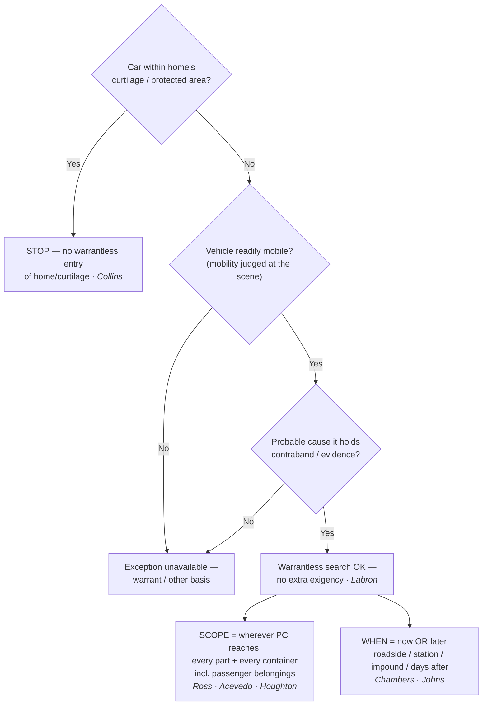

## Rule
Under the **automobile exception**, where a vehicle is **readily mobile** and an officer has **probable cause** to believe it contains contraband or evidence, the Fourth Amendment permits a **warrantless search of every part of the vehicle — and every container within it — in which the object of the search may be found**, with **no separate showing of exigency** required. *Carroll v. United States*, 267 U.S. 132, 153 (1925); *United States v. Ross*, 456 U.S. 798, 825 (1982); *Pennsylvania v. Labron*, 518 U.S. 938, 940 (1996) (per curiam). The justification rests on **two rationales** — a vehicle's ready mobility and the **reduced expectation of privacy** attending a pervasively regulated motor vehicle. *California v. Carney*, 471 U.S. 386, 392–93 (1985). Because the justification does not evaporate when the car is immobilized, the search may be conducted **later** — at the station, after impoundment, even days afterward. *Chambers v. Maroney*, 399 U.S. 42, 52 (1970); *United States v. Johns*, 469 U.S. 478, 487 (1985). The exception reaches the **car**, not the protected space it sits in: it does not authorize warrantless entry of a home or its curtilage to get to a vehicle parked there. *Collins v. Virginia*, 584 U.S. 586, 591 (2018).

## Key cases
| Case (Bluebook) | Holding in one line | Weight | CourtListener |
|---|---|---|---|
| *Carroll v. United States*, 267 U.S. 132 (1925) | **Origin** of the exception: a vehicle may be searched warrantless on PC because it can be quickly moved out of the jurisdiction before a warrant issues (ready mobility). | SCOTUS — binding | [link](https://www.courtlistener.com/opinion/100567/carroll-v-united-states/) |
| *Chambers v. Maroney*, 399 U.S. 42 (1970) | Where PC + mobility existed at the scene, a **station-house search** is as reasonable as a roadside one; immobilization until a warrant issues is no better. | SCOTUS — binding | [link](https://www.courtlistener.com/opinion/108184/chambers-v-maroney/) |
| *United States v. Ross*, 456 U.S. 798 (1982) | PC to search the vehicle justifies a search of **every part of it and every container within** that may conceal the object of the search. | SCOTUS — binding | [link](https://www.courtlistener.com/opinion/110719/united-states-v-ross/) |
| *California v. Carney*, 471 U.S. 386 (1985) | Applies to a **motor home** in use as a vehicle; states the **two rationales** — ready mobility + reduced expectation of privacy from pervasive regulation. | SCOTUS — binding | [link](https://www.courtlistener.com/opinion/111423/california-v-carney/) |
| *United States v. Johns*, 469 U.S. 478 (1985) | **Delayed search** of packages lawfully removed from a vehicle (three days later) is valid; immobilization does not end the justification. | SCOTUS — binding | [link](https://www.courtlistener.com/opinion/111305/united-states-v-johns/) |
| *California v. Acevedo*, 500 U.S. 565 (1991) | **One unified container rule**: police may search a container in a car on PC it holds contraband; overrules *Arkansas v. Sanders*. | SCOTUS — binding | [link](https://www.courtlistener.com/opinion/112608/california-v-acevedo/) |
| *Wyoming v. Houghton*, 526 U.S. 295 (1999) | With PC to search a car, officers may search a **passenger's belongings** capable of concealing the object; a non-suspect passenger's ownership is no shield. | SCOTUS — binding | [link](https://www.courtlistener.com/opinion/118277/wyoming-v-houghton/) |
| *Pennsylvania v. Labron*, 518 U.S. 938 (1996) (per curiam) | **No separate exigency**: readily mobile + PC permits a warrantless search "without more." | SCOTUS — binding | [link](https://www.courtlistener.com/opinion/118063/pennsylvania-v-labron/) |
| *Collins v. Virginia*, 584 U.S. 586 (2018) | The exception does **not** reach a vehicle parked within the home's **curtilage**; no warrantless entry of home/curtilage to search a car. | SCOTUS — binding | [link](https://www.courtlistener.com/opinion/4501697/collins-v-virginia/) |
| *United States v. Gastiaburo*, 16 F.3d 582 (4th Cir. 1994) | No temporal limit; a **38-day** gap between seizure and search is "legally irrelevant." | Circuit (4th) — persuasive | [link](https://www.courtlistener.com/opinion/6929715/united-states-v-gastiaburo/) |
| *United States v. Morley*, 99 F.4th 1328 (11th Cir. 2024) | Restates the modern **two-element test**: (1) readily mobile + (2) PC. | Circuit (11th) — persuasive | [link](https://www.courtlistener.com/opinion/9498175/united-states-v-derrick-alfondso-morley/) |

## Related cases across doctrines
These cases are treated in full elsewhere but bear on the automobile exception, framed for it here.

| Case | Relevance to the automobile exception | Primary treatment | CourtListener |
|---|---|---|---|
| *Arizona v. Gant*, 556 U.S. 332 (2009) | The OTHER vehicle-search theory and its sharp contrast: a search incident to a recent occupant's arrest is narrow (only if the arrestee is unsecured and within reach, OR it is reasonable to believe evidence of the arrest offense is in the car) — whereas the automobile exception, on PC, reaches the whole car and every container regardless of arrest; don't conflate the two. | [[Search Incident to Arrest]] | [opinion](https://www.courtlistener.com/opinion/145887/arizona-v-gant/) |
| *Maryland v. Pringle*, 540 U.S. 366 (2003) | Supplies the PC predicate that triggers the exception: drugs and cash found in a car with no occupant claiming them give probable cause as to the car (and all occupants) — exactly the "PC it contains contraband" that satisfies element two. | [[Probable Cause and Reasonable Suspicion]] | [opinion](https://www.courtlistener.com/opinion/131150/maryland-v-pringle/) |
| *South Dakota v. Opperman*, 428 U.S. 364 (1976) | The inventory alternative: a warrantless search of a lawfully impounded vehicle under standardized procedures is a SEPARATE basis from the auto exception (no PC needed) — invoke it when PC for the auto exception is thin but the car has been lawfully impounded. | [[Search Incident to Arrest]] | [opinion](https://www.courtlistener.com/opinion/109537/south-dakota-v-opperman/) |
| *Colorado v. Bertine*, 479 U.S. 367 (1987) | Inventory of an impounded vehicle may include opening closed containers under standardized criteria — the no-PC alternative route to a container-in-car that the auto exception reaches only with PC. | [[Search Incident to Arrest]] | [opinion](https://www.courtlistener.com/opinion/111788/colorado-v-bertine/) |
| *Florida v. Wells*, 495 U.S. 1 (1990) | Marks the boundary of the inventory alternative: an inventory cannot be a ruse for general rummaging — when officers are really hunting evidence without PC, neither inventory nor the auto exception saves the search. | [[Search Incident to Arrest]] | [opinion](https://www.courtlistener.com/opinion/112412/florida-v-wells/) |
| *Cady v. Dombrowski*, 413 U.S. 433 (1973) | Origin of community-caretaking specifically with vehicles — a distinct, non-investigatory warrantless basis to enter a car (disabled/impounded vehicles) that does not require the PC the auto exception demands. | [[Community Caretaking and Emergency Aid]] | [opinion](https://www.courtlistener.com/opinion/108850/cady-v-dombrowski/) |
| *Byrd v. United States*, 584 U.S. 395 (2018) | Standing predicate: a driver in lawful possession and control of a rental car has a reasonable expectation of privacy even if not on the rental agreement — so he can challenge an auto-exception search of it. | [[Standing to Challenge a Search]] | [opinion](https://www.courtlistener.com/opinion/4497658/byrd-v-united-states/) |
| *Michigan v. Long*, 463 U.S. 1032 (1983) | The Terry-based vehicle search to contrast with the full PC search: on reasonable suspicion the driver is dangerous, officers may sweep the passenger compartment for weapons — a protective, suspicion-level search distinct from the PC-driven auto exception. | [[Traffic Stops]] | [opinion](https://www.courtlistener.com/opinion/111020/michigan-v-long/) |
| *Riley v. California*, 573 U.S. 373 (2014) | The digital frontier of the exception: Riley's logic (a phone is not just another container; its data implicates privacy "far beyond" physical effects) is the engine of the live split over whether the auto exception reaches the DATA on a phone found in a car, or only the device — treat phone contents as warrant-required. | [[Search Incident to Arrest]] | [opinion](https://www.courtlistener.com/opinion/2680439/riley-v-cal-united-states/) |

## Nuances & limits
- **Ready mobility is the founding rationale.** *Carroll* allowed a warrantless vehicle search "where it is not practicable to secure a warrant, because the vehicle can be quickly moved out of the locality or jurisdiction in which the warrant must be sought." 267 U.S. at 153. The car's capacity to disappear is what excuses the warrant — not its label as a "car."
- **Two rationales, both load-bearing.** Modern doctrine rests on a pair of justifications, and you should be able to articulate both:
  > "First, the vehicle is obviously readily mobile by the turn of an ignition key, if not actually moving. Second, there is a reduced expectation of privacy stemming from its use as a licensed motor vehicle subject to a range of police regulation inapplicable to a fixed dwelling." — *Carney*, 471 U.S. at 392–93.

  *Carney* also confirms the exception covers a **motor home** being used as a vehicle, not just an ordinary car.
- **Scope tracks probable cause, and it reaches containers.** "If probable cause justifies the search of a lawfully stopped vehicle, it justifies the search of every part of the vehicle and its contents that may conceal the object of the search." *Ross*, 456 U.S. at 825. *Acevedo* then collapsed the old container/vehicle distinction into a single rule: "We therefore interpret *Carroll* as providing one rule to govern all automobile searches. The police may search an automobile and the containers within it where they have probable cause to believe contraband or evidence is contained." 500 U.S. at 580 — curing the *Ross*/*Sanders* anomaly under which PC as to a *specific* container placed in a car had demanded a warrant while PC as to the *whole car* did not. The "every container" reach is not limited to the driver's: with PC to search the car, officers may inspect "passengers' belongings found in the car that are capable of concealing the object of the search." *Wyoming v. Houghton*, 526 U.S. at 307 — a non-suspect passenger's ownership of a purse or bag is no shield. Scope is **object-limited**: PC to find a stolen flat-screen does not justify opening a pill bottle, and PC as to one container is not PC to dismantle the whole car.
- **No separate exigency beyond mobility + PC.** "If a car is readily mobile and probable cause exists to believe it contains contraband, the Fourth Amendment thus permits police to search the vehicle without more." *Labron*, 518 U.S. at 940. The Court reversed a state rule that demanded proof of *additional* exigent circumstances; mobility plus PC is the whole showing (reaffirmed per curiam in *Maryland v. Dyson*, 527 U.S. 465, 466–67 (1999): the "automobile exception" "has no separate exigency requirement").
- **Delay and immobilization do not defeat the exception (the delayed-search rule).** "[T]here is little to choose in terms of practical consequences between an immediate search without a warrant and the car's immobilization until a warrant is obtained." *Chambers*, 399 U.S. at 52. *Johns* upheld a search of packages "three days after the packages were seized," holding the search "was not unreasonable merely because the Customs officers returned to Tucson and placed the packages in a DEA warehouse rather than immediately opening them." 469 U.S. at 481, 487. The **binding anchor for delay is *Johns***. As a vivid persuasive illustration, *Gastiaburo* (4th Cir.) pushes the point to **38 days** — "the passage of time between the seizure and the search of Gastiaburo's car is legally irrelevant," and "[n]ot a single published federal case speaks of a 'temporal limit' to the automobile exception." 16 F.3d at 587.
- **The curtilage limit (cross-link [[Curtilage]]).** The exception is about the *vehicle*, not the constitutionally protected ground it rests on: "The automobile exception does not permit the warrantless entry of a home or its curtilage in order to search a vehicle therein." *Collins*, 584 U.S. at 591. A car parked in a driveway within the curtilage is off-limits without a warrant or a separate exception.
- **The modern field statement (persuasive).** Circuits routinely distill the doctrine to a clean two-element test: a warrantless vehicle search is permitted "if (1) the vehicle is readily mobile and (2) law enforcement has probable cause to search it." *Morley*, 99 F.4th at 1338. No circuit split surfaced on these propositions — they are SCOTUS-settled; *Morley* and *Gastiaburo* simply apply them.

## Common pitfalls
- **Treating "automobile" as the magic word.** A vehicle does not authorize a search by itself — you still need **probable cause**. *Carney*'s reduced-privacy rationale lowers the bar; it never eliminates the PC requirement.
- **Searching beyond the object's likely location.** PC defines the *scope* (*Ross*/*Acevedo*). PC to find a stolen rifle does not justify opening a small jewelry box; PC as to one closed container is not PC to tear apart the entire car. Flip side: don't assume a **passenger's** bag is off-limits — *Houghton* makes it fair game if it could hold the object. But *Houghton* reaches passenger **belongings**, not the passenger's **person/body**, which needs its own PC or a search incident to arrest (see [[Search Incident to Arrest]]).
- **Assuming you must search *now*.** You don't — *Chambers*, *Johns*, and *Labron* permit a later search. But the converse trap is just as common: don't assume a warrant is suddenly required merely because the car is now immobilized or impounded. Mobility is judged **at the scene**, and the justification persists.
- **Driveway / curtilage overreach.** Officers extend the exception to a car parked at a home and walk onto the property to reach it. *Collins* forbids warrantless entry onto the curtilage to get to the vehicle. (See [[Curtilage]].)
- **Over-relying on *Anchondo*.** *United States v. Anchondo*, 156 F.3d 1043 (10th Cir. 1998), is frequently cited in the field as automobile-exception authority — it is not. It is a brief, conclusory opinion that does **not** hold an automobile-exception rule. There, a canine alerted to the defendant's car at a checkpoint; the fruitless car search and a search of his person turned up cocaine strapped to his body, which the court upheld as a **search incident to arrest** on canine-alert PC (see [[Search Incident to Arrest]]). The defendant had **conceded** vehicle PC — "The defendant admits that the officers had probable cause to search the vehicle," 156 F.3d at 1045 — so the exception was never the disputed or decided issue, and the court **expressly declined** the *Terry* question, finding it "unnecessary to address the parties['] arguments on the application of *Terry v. Ohio* … because the agents were justified in conducting a full, warrant-less search of the defendant under these circumstances." *Id.* The opinion ends: "the discovery of cocaine on the defendant's person was the result of a lawful search incident to arrest. We AFFIRM." 156 F.3d at 1046. **Do not anchor any automobile-exception rule to it.**

## Recent developments & subsequent treatment
The core rule (mobility + PC, no separate exigency, object-limited scope reaching containers) is SCOTUS-settled and stable. The live frontier is digital: lower courts are dividing over whether the exception's "every container" reach extends to the DATA on a cell phone found in a car, with *Riley v. California*'s privacy logic pulling courts toward a warrant requirement for phone contents. No SCOTUS case has yet resolved the phone-data question for the automobile exception specifically; the leading appellate position treats a phone as a non-container.

- **United States v. Camou (9th Cir. 2014)** — Holds the automobile exception does NOT authorize a warrantless search of the DATA on a cell phone found in a vehicle: a phone is not a "container" for auto-exception purposes, and *Riley*'s reasoning applies a fortiori because the auto exception's scope is even broader than a search incident to arrest. The leading appellate anchor for the digital-limit position. ⚖ Circuit split. This is **Ninth Circuit law — persuasive, not binding**, and not nationwide rule. "We therefore conclude that cell phones are non-containers for purposes of the vehicle exception to the warrant requirement, and the search of Camou's cell phone cannot be justified under that exception." 773 F.3d at 943. [opinion](https://www.courtlistener.com/opinion/2759861/united-states-v-chad-camou/).

## Visual

## Sources
- *Carroll v. United States*, 267 U.S. 132 (1925) — https://www.courtlistener.com/opinion/100567/carroll-v-united-states/
- *Chambers v. Maroney*, 399 U.S. 42 (1970) — https://www.courtlistener.com/opinion/108184/chambers-v-maroney/
- *United States v. Ross*, 456 U.S. 798 (1982) — https://www.courtlistener.com/opinion/110719/united-states-v-ross/
- *California v. Carney*, 471 U.S. 386 (1985) — https://www.courtlistener.com/opinion/111423/california-v-carney/
- *United States v. Johns*, 469 U.S. 478 (1985) — https://www.courtlistener.com/opinion/111305/united-states-v-johns/
- *California v. Acevedo*, 500 U.S. 565 (1991) — https://www.courtlistener.com/opinion/112608/california-v-acevedo/
- *Wyoming v. Houghton*, 526 U.S. 295 (1999) — https://www.courtlistener.com/opinion/118277/wyoming-v-houghton/
- *Pennsylvania v. Labron*, 518 U.S. 938 (1996) (per curiam) — https://www.courtlistener.com/opinion/118063/pennsylvania-v-labron/
- *Maryland v. Dyson*, 527 U.S. 465 (1999) (per curiam) — https://www.courtlistener.com/opinion/2621047/maryland-v-dyson/
- *Collins v. Virginia*, 584 U.S. 586 (2018) — https://www.courtlistener.com/opinion/4501697/collins-v-virginia/
- *United States v. Gastiaburo*, 16 F.3d 582 (4th Cir. 1994) — https://www.courtlistener.com/opinion/6929715/united-states-v-gastiaburo/
- *United States v. Morley*, 99 F.4th 1328 (11th Cir. 2024) — https://www.courtlistener.com/opinion/9498175/united-states-v-derrick-alfondso-morley/
- *United States v. Anchondo*, 156 F.3d 1043 (10th Cir. 1998) — https://www.courtlistener.com/opinion/758111/united-states-v-erick-anchondo/ *(pitfall example — search-incident-to-arrest case, NOT automobile-exception authority)*
