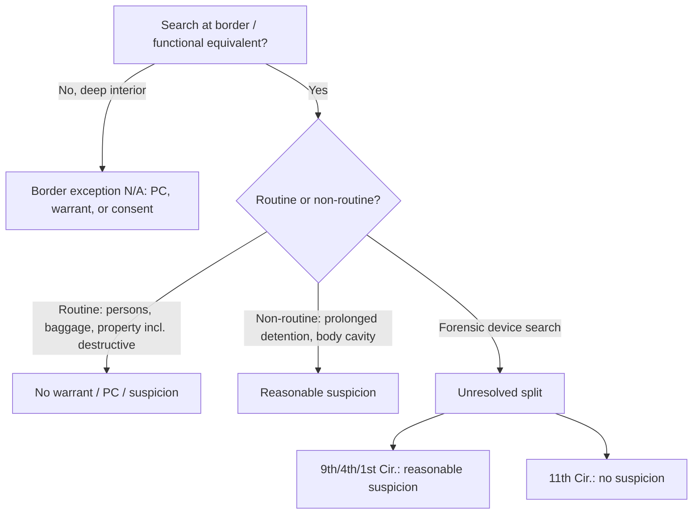

# Border Searches

## Rule

At the international border (and its functional equivalent), the sovereign's interest in protecting itself is at its zenith, so the Fourth Amendment's ordinary expectations are relaxed. The threshold inquiry is still whether government action is a "search" at all (see [[Two Definitions of Search]]); once it is, the border-search exception governs the reasonableness question. **Routine** searches of persons, baggage, and property require **no warrant, no probable cause, and no individualized suspicion** — a categorical exception to [[The Warrant Requirement]], like [[Search Incident to Arrest]]. By contrast, **non-routine, highly intrusive** intrusions (prolonged detention, body-cavity or alimentary-canal searches) require **reasonable suspicion**. The exception is geographic: it does not float free into the deep interior, and immigration checkpoints (a special-needs seizure power) should not be conflated with the border-search power.

## Key cases

| Case | Holding (one line) | Weight | CourtListener |
| --- | --- | --- | --- |
| *United States v. Ramsey*, 431 U.S. 606 (1977) | Routine border searches (here, incoming international mail) need no warrant or probable cause; rests on the sovereign's inherent self-protective authority. | SCOTUS — binding | [opinion](https://www.courtlistener.com/opinion/109675/united-states-v-ramsey/) |
| *United States v. Montoya de Hernandez*, 473 U.S. 531 (1985) | Prolonged detention of a suspected alimentary-canal smuggler is reasonable on reasonable suspicion the traveler is smuggling internally. | SCOTUS — binding | [opinion](https://www.courtlistener.com/opinion/111509/united-states-v-montoya-de-hernandez/) |
| *United States v. Flores-Montano*, 541 U.S. 149 (2004) | Suspicionless authority over vehicles at the border includes disassembling and reassembling a gas tank; this property search is routine. | SCOTUS — binding | [opinion](https://www.courtlistener.com/opinion/134729/united-states-v-flores-montano/) |
| *United States v. Martinez-Fuerte*, 428 U.S. 543 (1976) | Brief stops at fixed/permanent interior immigration checkpoints are constitutional without individualized suspicion. | SCOTUS — binding | [opinion](https://www.courtlistener.com/opinion/109541/united-states-v-martinez-fuerte/) |
| *Almeida-Sanchez v. United States*, 413 U.S. 266 (1973) | A roving-patrol vehicle search ~20 miles inside the border, without PC or consent, violates the Fourth Amendment — the exception does not reach the deep interior. | SCOTUS — binding | [opinion](https://www.courtlistener.com/opinion/108845/almeida-sanchez-v-united-states/) |
| *United States v. Brignoni-Ponce*, 422 U.S. 873, 884, 886-87 (1975) | A roving patrol may stop a vehicle near the border to question occupants only on reasonable suspicion; apparent Mexican ancestry alone is not enough. | SCOTUS — binding | [opinion](https://www.courtlistener.com/opinion/109311/united-states-v-brignoni-ponce/) |
| *United States v. Cotterman*, 709 F.3d 952 (9th Cir. 2013) (en banc) | Forensic examination of a device seized at the border requires reasonable suspicion; the comprehensive/intrusive nature, not location, triggers the requirement. | Circuit (9th Cir.) — persuasive | [opinion](https://www.courtlistener.com/opinion/854692/united-states-v-howard-cotterman/) |
| *United States v. Cano*, 934 F.3d 1002 (9th Cir. 2019) | Manual phone searches need no suspicion; forensic device searches need reasonable suspicion, and the exception covers only searches for digital contraband. | Circuit (9th Cir.) — persuasive | [opinion](https://www.courtlistener.com/opinion/4649091/united-states-v-miguel-cano/) |
| *United States v. Touset*, 890 F.3d 1227 (11th Cir. 2018) | No suspicion — not even reasonable suspicion — is required for a forensic device search; devices are property, and reasonable suspicion is reserved for intrusive searches of the body. | Circuit (11th Cir.) — persuasive | [opinion](https://www.courtlistener.com/opinion/4500452/united-states-v-karl-touset/) |

## Related cases across doctrines

These cases are treated in full on other doctrine pages but bear directly on border searches; the relevance below is framed for this doctrine.

| Case | Relevance to border searches | Primary treatment | CourtListener |
| --- | --- | --- | --- |
| *Riley v. California*, 573 U.S. 373 (2014) | The analytic engine of the border device-search split: Riley's holding that a cell phone's vast digital contents are categorically different (no search-incident bright line) is what every circuit reasons from when deciding whether a forensic device search at the border is "routine" (no suspicion) or "non-routine" (reasonable suspicion or a warrant). | [[Plain View Doctrine]] · [[Search Incident to Arrest]] | [opinion](https://www.courtlistener.com/opinion/2680439/riley-v-cal-united-states/) |
| *City of Indianapolis v. Edmond*, 531 U.S. 32 (2000) | Marks the limit of the checkpoint power that borders the border-search doctrine: a fixed checkpoint whose primary purpose is ordinary crime control (drug interdiction) is unconstitutional — contrast *Martinez-Fuerte* immigration checkpoints, and the reason interior crime-control stops cannot be bootstrapped onto the suspicionless border/checkpoint rationale. | [[Special Needs and Administrative Searches]] | [opinion](https://www.courtlistener.com/opinion/118391/city-of-indianapolis-v-edmond/) |

## Nuances & limits

- **Routine vs. non-routine is the master line.** Routine searches of persons, baggage, and property — including destructive property searches like gas-tank disassembly (*Flores-Montano*) — need no suspicion at all. The intrusiveness that bumps a search into the *non-routine* tier is intrusion on the **dignity and bodily integrity of the person**: prolonged detention, strip, body-cavity, and alimentary-canal searches. *Montoya de Hernandez* sets that floor: "the detention of a traveler at the border, beyond the scope of a routine customs search and inspection, is justified at its inception if customs agents, considering all the facts surrounding the traveler and her trip, reasonably suspect that the traveler is smuggling contraband in her alimentary canal." 473 U.S. at 541.
- **DEVICE FORENSIC-SEARCH CIRCUIT SPLIT (unresolved — the live frontier).** The circuits disagree on whether a **forensic** (Cellebrite-type) search of an electronic device at the border requires reasonable suspicion. The **Ninth Circuit** says **yes**: *Cotterman* held the "forensic examination of Cotterman's computer required a showing of reasonable suspicion, a modest requirement in light of the Fourth Amendment," 709 F.3d at 968, and *Cano* later confined that to searches for **digital contraband** (manual phone search = no suspicion; forensic = reasonable suspicion). The **Eleventh Circuit** says **no**: *Touset* requires **no suspicion at all**, reasoning that devices are property and reasonable suspicion is reserved for intrusive searches of the *body*. Both Ninth Circuit and Eleventh Circuit decisions are **persuasive only** outside their circuits. **SCOTUS has not resolved this split** — there is no nationwide device rule.
- **The exception is geographic, not portable.** It applies at the actual border and its functional equivalents. It does **not** authorize roving-patrol searches in the deep interior (*Almeida-Sanchez*).
- **Checkpoints are a different power.** Fixed interior immigration checkpoints (*Martinez-Fuerte*) and roving-patrol stops near the border (*Brignoni-Ponce*) are *seizure*/special-needs doctrines — see [[Special Needs and Administrative Searches]] — not the border *search* power. Brief checkpoint stops are suspicionless; a roving-patrol *stop* needs reasonable suspicion (*Brignoni-Ponce*); a roving-patrol *search* in the interior needs PC or consent (*Almeida-Sanchez*).
- **Burden & standard of review.** The **government** bears the burden of justifying a warrantless border search. *Routine* border searches (luggage, ordinary personal effects) require **no individualized suspicion**; *non-routine, highly intrusive* intrusions (prolonged detention, body-cavity / alimentary-canal searches, forensic device searches) require **reasonable suspicion**. *United States v. Montoya de Hernandez*, 473 U.S. 531, 541 (1985). The defendant bears the threshold burden of showing a search/seizure and standing. On appeal, the existence of reasonable suspicion is reviewed **de novo**, underlying historical facts for **clear error**. *Ornelas v. United States*, 517 U.S. 690, 699 (1996).

## Common pitfalls

- **Assuming the exception reaches the deep interior.** A search miles inland by a roving patrol is not a "border search." *Almeida-Sanchez* invalidated a suspicionless roving-patrol search ~20 miles from the border; interior searches need PC, a warrant, or consent.
- **Stating a nationwide device rule.** There is none. Saying "forensic device searches always need reasonable suspicion" overstates the Ninth Circuit (*Cotterman*/*Cano*); saying "they never do" overstates the Eleventh Circuit (*Touset*). Label the circuit and flag the unresolved split.
- **Conflating immigration checkpoints with the search power.** *Martinez-Fuerte* upholds suspicionless checkpoint *stops*; it is not authority to *search* without suspicion away from the border, and it is not a border-search holding.
- **Treating destructive property searches as "non-routine."** Per *Flores-Montano*, dignity-intrusion on the **person** — not property damage — drives the reasonable-suspicion tier. Disassembling a gas tank stayed routine.

## Recent developments & subsequent treatment

Since *Riley* (2014), the live frontier has been the standard for searching electronic devices at the border. A broad cross-circuit consensus has hardened that a brief, *manual* device search remains **routine** and needs no individualized suspicion, while the circuits continue to fracture over whether a *forensic* (Cellebrite-type) search demands reasonable suspicion — and, if so, what its scope is. SCOTUS has not resolved the device split. The decisions below are all federal circuit law: each is **persuasive, not binding**, outside its own circuit, and none states nationwide law.

- **United States v. Mendez (7th Cir. 2024)** — Border searches of electronic devices require neither a warrant nor probable cause, and a routine, manual search of a cell phone at the border requires no individualized suspicion; affirmed. Joins the cross-circuit consensus that a brief manual cell-phone search at the border is "routine," reserving the question whether intrusive forensic searches require reasonable suspicion. Seventh Circuit — **persuasive, not binding**. [opinion](https://www.courtlistener.com/opinion/9524074/united-states-v-marcos-mendez/).
- **United States v. Castillo (5th Cir. 2023)** — No individualized suspicion is required for a routine manual cell-phone search at the border, adopting the consensus view of every circuit to have addressed it. The court noted the circuits are divided over whether reasonable suspicion is required for a more intrusive forensic search but did not need to decide that question. Fifth Circuit — **persuasive, not binding**. [opinion](https://www.courtlistener.com/opinion/9407477/united-states-v-castillo/).
- **United States v. Xiang (8th Cir. 2023)** — The Eighth Circuit affirmed denial of suppression of a forensic border search of digital devices but **expressly declined** to decide whether reasonable suspicion is even required for an advanced/forensic border device search; it assumed-without-deciding the standard and held reasonable suspicion was satisfied on economic-espionage facts. It did **not** engage the Fourth Circuit's border-nexus framework or the Ninth Circuit's digital-contraband limit (*Cano*). Eighth Circuit — **persuasive, not binding**. [opinion](https://www.courtlistener.com/opinion/9397097/united-states-v-haitao-xiang/).
- **Alasaad v. Mayorkas (1st Cir. 2021)** — Civil challenge to CBP/ICE device-search policies. Held neither manual ("basic") nor forensic ("advanced") device searches require a warrant or probable cause; advanced searches need only reasonable suspicion. Expressly split from the Ninth Circuit by holding the searches need **not** be limited to digital contraband — they may seek evidence of any contraband-related or other illegal activity. ⚖ Circuit split. "the border search exception is not limited to searches for contraband itself rather than evidence of contraband or a border-related crime," 988 F.3d at 21-22. First Circuit — **persuasive, not binding**. (The CourtListener caption reads *Alasaad v. Wolf* — a benign official-substitution artifact, Wolf → Mayorkas; the link resolves to the correct 1st Cir. 2021 decision.) [opinion](https://www.courtlistener.com/opinion/4855246/alasaad-v-wolf/).
- **United States v. Aigbekaen (4th Cir. 2019)** — Adds a distinctive "border nexus" limit: where a border search is intrusive enough to require individualized suspicion, the suspected offense must bear a nexus to the border-search exception's purposes (national security, duties, contraband, excluding persons) — not a purely domestic investigation. Suspicion of purely domestic crimes lacked that nexus, so the warrantless forensic device searches violated the Fourth Amendment, but the good-faith exception applied and suppression was denied. ⚖ Circuit split. "We simply apply the teaching of Kolsuz: where a search at the border is so intrusive as to require some level of individualized suspicion, the object of that suspicion must bear some nexus to the purposes of the border search exception in order for the exception to apply. Because no such nexus existed here, the warrantless, nonroutine forensic searches violated the Fourth Amendment," 943 F.3d at 721. Fourth Circuit — **persuasive, not binding**. [opinion](https://www.courtlistener.com/opinion/4680725/united-states-v-raymond-aigbekaen/).
- **United States v. Kolsuz (4th Cir. 2018)** — First post-*Riley* federal appellate decision to hold a forensic (off-site, month-long Cellebrite-type) device search at the border is non-routine and requires individualized suspicion. Adds a second circuit to the Ninth's reasonable-suspicion camp; expressly left open whether the standard could be higher than reasonable suspicion. ⚖ Circuit split. "After Riley, we think it is clear that a forensic search of a digital phone must be treated as a nonroutine border search, requiring some form of individualized suspicion," 890 F.3d at 146. Fourth Circuit — **persuasive, not binding**. [opinion](https://www.courtlistener.com/opinion/4496513/united-states-v-hamza-kolsuz/).

## Visual

## Sources

- [United States v. Ramsey, 431 U.S. 606 (1977)](https://www.courtlistener.com/opinion/109675/united-states-v-ramsey/)
- [United States v. Montoya de Hernandez, 473 U.S. 531 (1985)](https://www.courtlistener.com/opinion/111509/united-states-v-montoya-de-hernandez/)
- [United States v. Flores-Montano, 541 U.S. 149 (2004)](https://www.courtlistener.com/opinion/134729/united-states-v-flores-montano/)
- [United States v. Martinez-Fuerte, 428 U.S. 543 (1976)](https://www.courtlistener.com/opinion/109541/united-states-v-martinez-fuerte/)
- [Almeida-Sanchez v. United States, 413 U.S. 266 (1973)](https://www.courtlistener.com/opinion/108845/almeida-sanchez-v-united-states/)
- [United States v. Brignoni-Ponce, 422 U.S. 873, 884, 886-87 (1975)](https://www.courtlistener.com/opinion/109311/united-states-v-brignoni-ponce/)
- [United States v. Cotterman, 709 F.3d 952 (9th Cir. 2013) (en banc)](https://www.courtlistener.com/opinion/854692/united-states-v-howard-cotterman/)
- [United States v. Cano, 934 F.3d 1002 (9th Cir. 2019)](https://www.courtlistener.com/opinion/4649091/united-states-v-miguel-cano/)
- [United States v. Touset, 890 F.3d 1227 (11th Cir. 2018)](https://www.courtlistener.com/opinion/4500452/united-states-v-karl-touset/)
