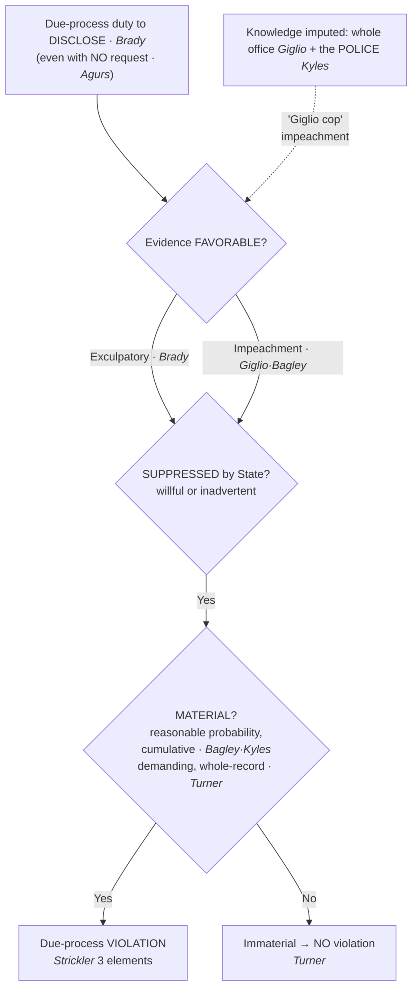

## Rule
Due process requires the prosecution to **disclose evidence favorable to the accused**. Suppressing favorable, material evidence "violates due process … irrespective of the good faith or bad faith of the prosecution" — this is the foundational, **no-fault** disclosure duty. *Brady v. Maryland*, 373 U.S. 83, 87 (1963). The duty is **not limited to exculpatory evidence**: it equally reaches **impeachment** evidence — for example, a promise of leniency to a key government witness. *Giglio v. United States*, 405 U.S. 150, 154 (1972); *United States v. Bagley*, 473 U.S. 667, 676 (1985). The duty exists **even when the defense makes no request**. *United States v. Agurs*, 427 U.S. 97, 107 (1976). A true violation has **three components**: the evidence is **favorable** (exculpatory or impeaching), it was **suppressed** by the State (willfully or inadvertently), and **prejudice** ensued. *Strickler v. Greene*, 527 U.S. 263, 281–82 (1999). Evidence is **material** — prejudice exists — only where there is a **reasonable probability** of a different result. *Bagley*, 473 U.S. at 682. The prosecutor's reach extends to favorable evidence **known to others on the government's team, including the police** — the law-enforcement hook; "no one told me" is no defense. *Kyles v. Whitley*, 514 U.S. 419, 437 (1995).

## Key cases
| Case (Bluebook) | Holding in one line | Weight | CourtListener |
|---|---|---|---|
| *Napue v. Illinois*, 360 U.S. 264 (1959) | The State may **not knowingly use false testimony** — even false testimony going only to a witness's **credibility** — and must correct it. | SCOTUS — binding | [link](https://www.courtlistener.com/opinion/105912/napue-v-illinois/) |
| *Brady v. Maryland*, 373 U.S. 83 (1963) | Suppression of **favorable, material** evidence violates due process, **irrespective of good or bad faith** — the foundational exculpatory-disclosure duty. | SCOTUS — binding | [link](https://www.courtlistener.com/opinion/106598/brady-v-maryland/) |
| *Giglio v. United States*, 405 U.S. 150 (1972) | **Impeachment** evidence (e.g., a promise to a key witness) is within *Brady*; one prosecutor's knowledge is imputed to the **whole office**. | SCOTUS — binding | [link](https://www.courtlistener.com/opinion/108471/giglio-v-united-states/) |
| *United States v. Agurs*, 427 U.S. 97 (1976) | The disclosure duty arises **even with no defense request**. (Its own materiality formula was later superseded by *Bagley*.) | SCOTUS — binding | [link](https://www.courtlistener.com/opinion/9426498/united-states-v-agurs/) |
| *United States v. Bagley*, 473 U.S. 667 (1985) | Unified **materiality** standard: "reasonable probability" of a different result; impeachment evidence is within the rule. | SCOTUS — binding | [link](https://www.courtlistener.com/opinion/111514/united-states-v-bagley/) |
| *Kyles v. Whitley*, 514 U.S. 419 (1995) | Materiality is judged **cumulatively**; the prosecutor must **learn of favorable evidence known to the police** (the LE hook). | SCOTUS — binding | [link](https://www.courtlistener.com/opinion/117923/kyles-v-whitley/) |
| *Strickler v. Greene*, 527 U.S. 263 (1999) | Canonical **three elements** of a *Brady* violation: favorable + suppressed + prejudice. | SCOTUS — binding | [link](https://www.courtlistener.com/opinion/118307/strickler-v-greene/) |
| *Smith v. Cain*, 565 U.S. 73 (2012) | Modern reversal: **undisclosed impeachment of the sole eyewitness** is material — conviction reversed. | SCOTUS — binding | [link](https://www.courtlistener.com/opinion/9485187/smith-v-cain/) |
| *Wearry v. Cain*, 577 U.S. 385 (2016) (per curiam) | Reaffirms **cumulative** materiality: suppressed evidence assessed collectively undermined confidence in the verdict. | SCOTUS — binding | [link](https://www.courtlistener.com/opinion/3183080/wearry-v-cain/) |
| *Turner v. United States*, 582 U.S. 313 (2017) | Counterweight: materiality is **demanding and judged on the whole record**; suppression here was **immaterial** — no *Brady* violation. | SCOTUS — binding | [link](https://www.courtlistener.com/opinion/4181055/turner-v-united-states/) |
| *Benn v. Lambert*, 283 F.3d 1040 (9th Cir. 2002) | Habeas granted: State suppressed **both** material exculpatory and impeachment evidence, each independently sufficient. | 9th Cir. — persuasive (illustrative) | [link](https://www.courtlistener.com/opinion/776954/gary-benn-v-john-lambert-superintendent-of-the-washington-state/) |

## Nuances & limits
- **The core duty is no-fault.** "[T]he suppression by the prosecution of evidence favorable to an accused upon request violates due process where the evidence is material either to guilt or to punishment, irrespective of the good faith or bad faith of the prosecution." *Brady*, 373 U.S. at 87. Later cases dropped the "upon request" qualifier — the duty exists with or without a defense request: "if the evidence is so clearly supportive of a claim of innocence that it gives the prosecution notice of a duty to produce, that duty should equally arise even if no request is made." *Agurs*, 427 U.S. at 107. Good faith is **no defense**; *Strickler* counts suppression "willfully or inadvertently." 527 U.S. at 282.
- **Impeachment evidence is squarely within the rule.** "Impeachment evidence, however, as well as exculpatory evidence, falls within the *Brady* rule." *Bagley*, 473 U.S. at 676. *Giglio* anchors why: where "[t]he reliability of a given witness may well be determinative of guilt or innocence," nondisclosure of evidence affecting that witness's credibility "falls within this general rule." 405 U.S. at 154 (quoting *Napue*). This covers promises or deals with witnesses, prior inconsistent statements, bias, mental condition, relevant convictions, and drug or alcohol issues.
- **The three elements (the working checklist).** "There are three components of a true *Brady* violation: The evidence at issue must be favorable to the accused, either because it is exculpatory, or because it is impeaching; that evidence must have been suppressed by the State, either willfully or inadvertently; and prejudice must have ensued." *Strickler*, 527 U.S. at 281–82.
- **Materiality = reasonable probability of a different result.** Evidence "is material only if there is a reasonable probability that, had the evidence been disclosed to the defense, the result of the proceeding would have been different. A 'reasonable probability' is a probability sufficient to undermine confidence in the outcome." *Bagley*, 473 U.S. at 682. Materiality is the same idea as the "prejudice" element — they are one inquiry, not two.
- **Materiality is judged cumulatively, and the duty reaches the police.** *Kyles* gives materiality its "definition in terms of suppressed evidence considered collectively, not item by item." 514 U.S. at 436. And the operational rule: "the individual prosecutor has a duty to learn of any favorable evidence known to the others acting on the government's behalf in the case, **including the police**." *Id.* at 437. Read with *Giglio*'s holding that "[t]he prosecutor's office is an entity and as such it is the spokesman for the Government" — "[a] promise made by one attorney must be attributed … to the Government" (405 U.S. at 154) — the government is treated as one team that cannot disclaim what its members know. *Wearry* reaffirms the cumulative test in a modern reversal: the accused "must show only that the new evidence is sufficient to 'undermine confidence' in the verdict." 577 U.S. at 392.
- **Prosecution-team imputation — "no one told me" is no defense.** The *Brady* duty reaches favorable evidence **known to the police even if the individual prosecutor does not personally know it**; the prosecutor is **charged with** that knowledge. *Kyles*, 514 U.S. at 437. The corollary for officers: police-held exculpatory or impeachment material must be **affirmatively surfaced** to the prosecutor — burying it does not make it disappear, and the office is treated as a single team.
- **But materiality is demanding and cuts both ways.** Not every suppression reverses. Materiality is judged on the entire record, and where there is no reasonable probability of a different result, there is **no** *Brady* violation. In *Turner*, the Court "agree[d] with the lower courts that there is not a 'reasonable probability' that the withheld evidence would have changed the outcome of petitioners' trial." 582 U.S. at 328–29. Contrast *Smith v. Cain*, where the suppressed material was "plainly material" because the lone eyewitness "testimony was the only evidence linking Smith to the crime." 565 U.S. at 76. Whether evidence is material is the **court's** call on the whole record — which is exactly why the safe practice is to surface everything rather than pre-judge it.
- ***Brady* is a constitutional floor, NOT criminal-discovery rules.** *Brady*/*Giglio* is a **due-process** obligation, separate from statutory and rule-based discovery — Fed. R. Crim. P. 16 and the Jencks Act (18 U.S.C. § 3500). Complying with Rule 16 does **not** discharge the *Brady* duty: favorable evidence may fall outside Rule 16's enumerated categories, and the constitutional duty can run on a different (often earlier) due-process timeline. Discovery compliance and *Brady* compliance are two separate checklists.
- **The law-enforcement hook — the "Giglio cop" and the "Brady/Giglio list."** Because police-held favorable evidence is imputed to the prosecution (*Kyles*, 514 U.S. at 437) and office knowledge is treated as a unit (*Giglio*, 405 U.S. at 154), an **officer's own credibility history becomes Giglio material that must be disclosed**: sustained findings of dishonesty or untruthfulness, false reports, false testimony, and certain convictions. This is the doctrinal root of the prosecutor's-office **"Brady/Giglio list"** — an administrative roster of officers with sustained credibility findings whose history must be turned over as impeachment (no SCOTUS case creates the list itself; it flows from *Kyles* + *Giglio*). Once disclosed, the defense can impeach the officer with it in every case. An officer carrying such findings can become **"Giglio impaired"** — effectively unusable as a credible witness, which can end a career's value in court. Integrity here is not merely ethics; it is **admissibility**.
- **Civil consequences are narrow (clearly CIVIL — not the criminal *Brady* spine).** A single *Brady* violation by a prosecutor does **not** establish municipal **§1983** failure-to-train (*Monell*) liability: "A pattern of similar constitutional violations by untrained employees is 'ordinarily necessary' to demonstrate deliberate indifference for purposes of failure to train." *Connick v. Thompson*, 563 U.S. 51, 62 (2011). This is the civil boundary, distinct from the criminal due-process duty — see [[Section 1983 Liability and Qualified Immunity]].
- **Napue is a related but distinct duty.** "The principle that a State may not knowingly use false evidence, including false testimony, to obtain a tainted conviction … does not cease to apply merely because the false testimony goes only to the credibility of the witness." *Napue*, 360 U.S. at 269. *Napue* = duty **not to knowingly use (and to correct) false** testimony; *Brady* = duty to **disclose favorable** evidence. *Giglio* sits at their intersection.
- **Concrete two-fer illustration.** In *Benn*, the Ninth Circuit granted habeas because "the state suppressed material exculpatory and impeachment evidence that would have destroyed the credibility of its principal witness, severely undermined its theory of motive, and left it without substantial evidence of premeditation or an aggravating circumstance." 283 F.3d at 1062. Both an exculpatory failure (fire-cause expert evidence) and an impeachment failure (an informant's ongoing drug use) — each independently material. Persuasive only; the binding spine is the SCOTUS line (and *Smith v. Cain* now carries the modern impeachment point as binding authority).

## Common pitfalls
- **Thinking good faith excuses non-disclosure.** It does not — *Brady* is no-fault and *Strickler* reaches suppression done "inadvertently." An honest oversight is still a violation if the evidence was favorable and material.
- **Treating *Brady* as exculpatory-only.** Impeachment evidence is squarely covered (*Giglio*, *Bagley*) — deals with witnesses, prior inconsistent statements, bias, mental condition, relevant convictions, drug or alcohol issues.
- **"The prosecutor never asked, so I'm clear."** *Kyles* imputes police-held favorable evidence to the prosecution. Officers cannot bury favorable or impeachment material and assume it stays buried — affirmatively surface it (including your own credibility issues).
- **"I produced it in Rule 16 discovery, so *Brady* is satisfied."** Wrong — *Brady* is a separate **constitutional** duty. Discovery-rule compliance does not discharge it, and *Brady* material may fall outside Rule 16's categories or be due earlier than discovery requires.
- **"It was minor / just a single item, so no harm."** Wrong twice over: materiality is judged **cumulatively** (*Kyles*), and good faith / inadvertence is **no defense** (*Strickler*) — and under *Kyles* the duty applies even when the favorable evidence is held by the police, not you. Whether it ends up "material" is the court's whole-record call (*Turner*), not yours to pre-judge — so surface it.
- **Weighing materiality item-by-item.** Wrong — *Kyles* (and *Wearry*) require the suppressed evidence be weighed **collectively**.
- **Confusing *Napue* with *Brady*.** *Napue* = duty not to knowingly use (and to correct) **false** testimony; *Brady* = duty to **disclose** favorable evidence. Related due-process duties, not identical.
- **Treating *Brady*/*Giglio* as a search-and-seizure rule.** It is a **disclosure / trial-fairness** doctrine grounded in due process — do not conflate it with the Fourth Amendment exclusionary rule.

## Visual

## Flashcards
- What does *Brady v. Maryland* require?::Due process requires the prosecution to disclose evidence favorable to the accused; suppressing favorable, material evidence violates due process "irrespective of the good faith or bad faith of the prosecution" (373 U.S. at 87).
- Does the disclosure duty cover impeachment evidence?::Yes — "Impeachment evidence, however, as well as exculpatory evidence, falls within the *Brady* rule" (*Bagley*, 473 U.S. at 676); *Giglio* reached a promise of leniency to a key witness.
- State the three elements of a *Brady* violation.::Favorable (exculpatory or impeaching) + suppressed by the State (willfully or inadvertently) + prejudice/materiality (*Strickler*, 527 U.S. at 281–82).
- What is the *Brady* materiality standard?::A "reasonable probability" that disclosure would have changed the result — "a probability sufficient to undermine confidence in the outcome," judged cumulatively (*Bagley*, 473 U.S. at 682; *Kyles*, 514 U.S. at 436).
- What is a "Giglio-impaired" officer?::Because *Kyles* imputes police-held favorable evidence to the prosecution (514 U.S. at 437), an officer's sustained dishonesty/credibility findings become Giglio impeachment material that must be disclosed — rendering the officer effectively unusable as a credible witness.
- Does the *Brady* duty depend on a defense request?::No — the duty exists even with no request: "that duty should equally arise even if no request is made" (*Agurs*, 427 U.S. at 107).
- Does complying with criminal-discovery rules satisfy *Brady*?::No — *Brady* is a separate **constitutional** due-process duty, not Fed. R. Crim. P. 16 or the Jencks Act (18 U.S.C. § 3500). Rule 16 compliance does not discharge *Brady*; favorable evidence may fall outside Rule 16 and be due on an earlier due-process timeline.
- Can suppressed favorable evidence ever NOT be a *Brady* violation?::Yes — materiality is demanding and judged on the whole record. In *Turner* the Court found "not a 'reasonable probability' that the withheld evidence would have changed the outcome" (582 U.S. at 328–29) — no violation; contrast *Smith v. Cain*, where impeachment of the sole eyewitness was "plainly material" (565 U.S. at 76).
- Does a single *Brady* violation create §1983 municipal liability?::No (civil point) — a "pattern of similar constitutional violations" is "ordinarily necessary" to show deliberate indifference for failure-to-train (*Connick v. Thompson*, 563 U.S. at 62). See [[Section 1983 Liability and Qualified Immunity]].

## Sources
- *Napue v. Illinois*, 360 U.S. 264 (1959) — https://www.courtlistener.com/opinion/105912/napue-v-illinois/
- *Brady v. Maryland*, 373 U.S. 83 (1963) — https://www.courtlistener.com/opinion/106598/brady-v-maryland/
- *Giglio v. United States*, 405 U.S. 150 (1972) — https://www.courtlistener.com/opinion/108471/giglio-v-united-states/
- *United States v. Agurs*, 427 U.S. 97 (1976) — https://www.courtlistener.com/opinion/9426498/united-states-v-agurs/
- *United States v. Bagley*, 473 U.S. 667 (1985) — https://www.courtlistener.com/opinion/111514/united-states-v-bagley/
- *Kyles v. Whitley*, 514 U.S. 419 (1995) — https://www.courtlistener.com/opinion/117923/kyles-v-whitley/
- *Strickler v. Greene*, 527 U.S. 263 (1999) — https://www.courtlistener.com/opinion/118307/strickler-v-greene/
- *Connick v. Thompson*, 563 U.S. 51 (2011) — https://www.courtlistener.com/opinion/7261027/connick-v-thompson/
- *Smith v. Cain*, 565 U.S. 73 (2012) — https://www.courtlistener.com/opinion/9485187/smith-v-cain/
- *Wearry v. Cain*, 577 U.S. 385 (2016) (per curiam) — https://www.courtlistener.com/opinion/3183080/wearry-v-cain/
- *Turner v. United States*, 582 U.S. 313 (2017) — https://www.courtlistener.com/opinion/4181055/turner-v-united-states/
- *Benn v. Lambert*, 283 F.3d 1040 (9th Cir. 2002) — https://www.courtlistener.com/opinion/776954/gary-benn-v-john-lambert-superintendent-of-the-washington-state/
